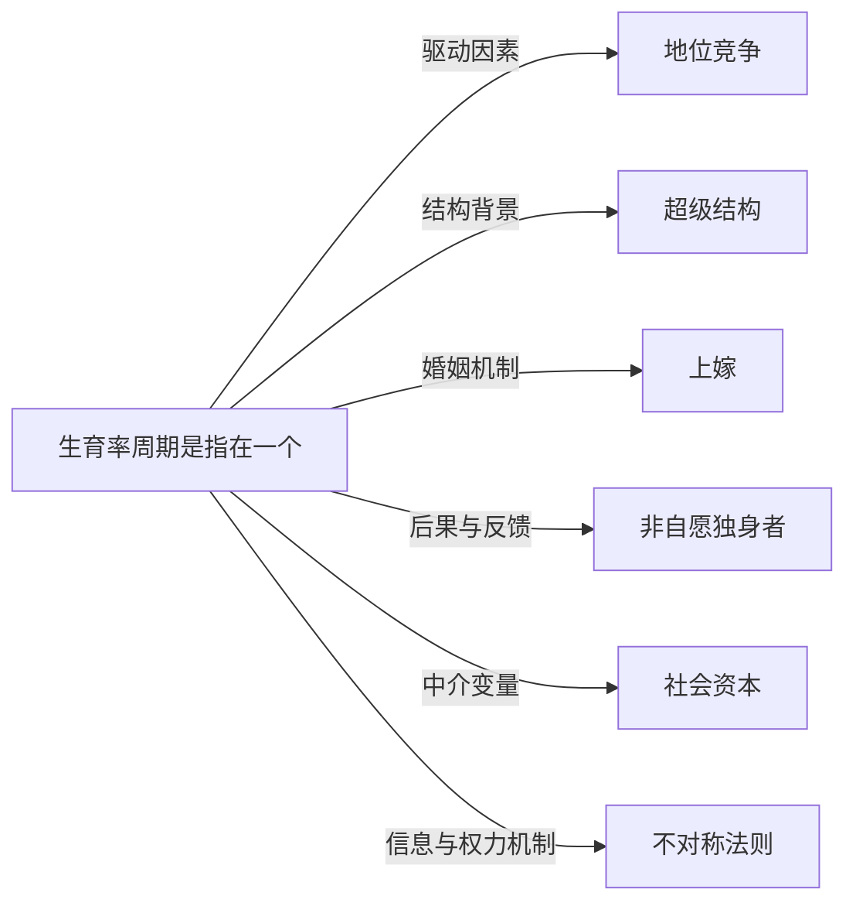

# 生育率周期

## 定义
生育率周期是指在一个社会中，总和生育率伴随经济不平等、地位竞争强度和社会规范变化而出现的阶段性波动与长期趋势性扭转现象。

## 核心解释
生育率并非单纯由生物学或个体偏好决定，而是深受社会经济结构影响。在地位竞争激烈、不平等加剧的“超级结构”下，个体为维持或提升社会阶层，会优先投资于教育、职业与社会资本，推迟或放弃生育，导致生育率进入下行周期。经济衰退期可能进一步压低生育率，经济回升时也只带来微弱补偿性反弹。常见误解是将生育率周期等同于固定的人口学波形，忽略了其根植于地位焦虑、婚姻梯度（如上嫁偏好）与资源分布不对称的深层社会机制。

## 示例
- 2008年全球金融危机后，许多发达国家生育率出现暂时性下降，随后部分国家出现小幅回升，但整体长周期仍受高不平等压制而走低。
- 韩国在高度地位竞争、教育内卷和超级结构固化的背景下，总和生育率持续跌破1.0，形成一种被地位焦虑锁死的低生育率长周期。

## 关联概念
- [[地位竞争]]：地位竞争迫使个体将大量资源投入地位信号与防御，挤压生育意愿，是生育率下行周期的核心推手。
- [[超级结构]]：高度固化的超级结构锁定阶层流动通道，使地位焦虑长期化，生育率被压制在低位难以回升。
- [[上嫁]]：女性的上嫁偏好加剧了婚配市场阶层匹配的困难，推迟或阻碍婚姻形成，从而影响生育时机和数量。
- [[非自愿独身者]]：在地位竞争中落败而难以进入婚育的群体，其规模扩大构成生育率低迷的人口底座，并进一步固化低生育预期。
- [[社会资本]]：积累社会资本的长期过程替代了短期生育投资，个体为获取地位所必需的社会关系而系统性地推迟生育。
- [[不对称法则]]：信息与权力不对称让地位信号失真，驱使人们在生育决策上出现趋同的延迟与规避，放大生育率的周期波动。

## 相关问题
- 地位不平等如何具体转化为生育率周期的波峰与波谷？
- 是否存在政策手段能在不降低地位竞争强度的前提下提升生育率？
- 不同社会制度下，生育率周期与超级结构的关系有何异同？
- 非自愿独身现象在生育率长期低迷中扮演了怎样的放大器角色？

## 关系图

