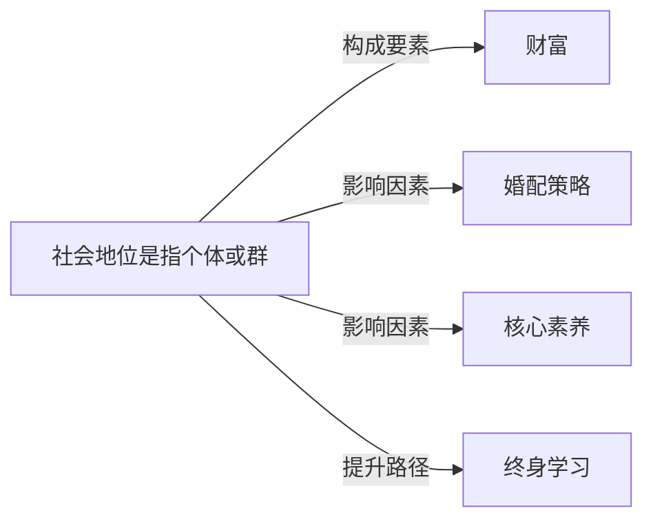

# 社会地位

## 定义
社会地位是指个体或群体在社会分层体系中所处的位置，通常与权力、声望、财富等因素相关联。

## 核心解释
社会地位反映了个体在群体中的相对位置，可分为先赋地位（出身、性别等）和自致地位（通过努力获得）。它决定了资源获取机会、社会影响力和生活方式。常见误解是将地位等同于财富；实际上，地位是多维度的，例如教师可能财富较少但声望较高。地位可通过符号（消费、称谓）展示，并存在地位不一致现象（如高学历低收入）。

## 示例
- 一位企业高管拥有高财富、高权力和高声望，属于高社会地位。
- 世袭贵族在现代社会中仍可能享有高社会声望，尽管政治权力或财富已减弱。

## 关联概念
- [[财富]]：财富是衡量社会地位的重要客观指标之一，但地位不完全由财富决定。
- [[婚配策略]]：社会地位会影响个体的婚配选择，如地位相近者联姻的“同质婚”策略。
- [[核心素养]]：核心素养（如教育、技能）是提升自致社会地位的关键途径。
- [[终身学习]]：终身学习有助于个体在变革社会中维持或提升自身社会地位。

## 相关问题
- 社会地位与财富的区别是什么？
- 社会地位可以通过哪些方式实现向上流动？
- 地位不一致现象有哪些典型例子？

## 关系图

