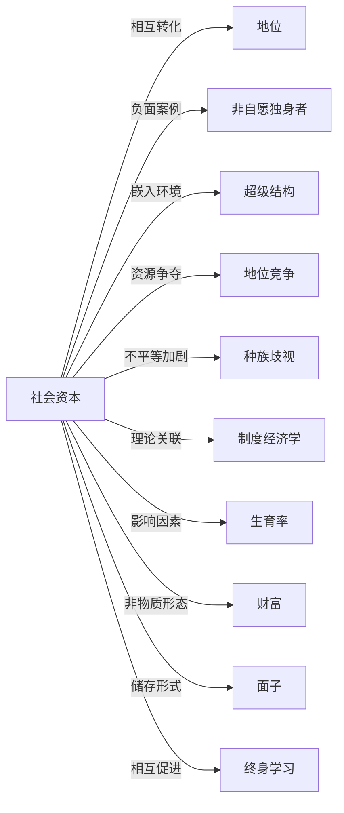

# 社会资本

## 定义
社会资本是指个体或群体通过社会关系网络、互信与互惠规范能够调动和获取的实际或潜在资源总和。

## 核心解释
社会资本强调关系网络的结构和内含的信任、规范，它是一种嵌入社会关系中的生产力。与经济资本（资产）和人力资本（技能）不同，社会资本无法被个人完全独占，需通过与他人互动才能激活和维持。其边界在于只有能够带来某种利益或功能的关系才构成资本，而非一切社会联系。常见误解是将社会资本简单等同于人脉的规模，忽视了信任和互惠规范在其中的核心作用；也有观点过度美化其正面作用，忽略其可能形成排外小团体、寻租网络等消极面。社会资本可分为粘结型（强化内部认同）和桥梁型（连接异质群体）。

## 示例
- 求职者通过校友关系获得内推机会，提高入职成功率。
- 社区居民因彼此信任和互助惯例，自发组织夜间巡逻，有效降低本地犯罪率。

## 关联概念
- [[地位]]：社会资本可以转化为地位，高地位者也更易积累社会资本。
- [[非自愿独身者]]：非自愿独身者现象常与个体社会资本匮乏有关，难以通过社交网络建立亲密关系。
- [[超级结构]]：社会资本嵌入在更大的社会超级结构中，受其形塑并反过来维护或改变结构。
- [[地位竞争]]：在地位竞争中，社会资本是关键被争夺和利用的资源。
- [[种族歧视]]：系统性歧视削弱被歧视群体的社会网络质量，造成社会资本分布不均。
- [[制度经济学]]：制度经济学将社会资本视为一种非正式制度，影响交易成本和长期经济表现。
- [[生育率]]：社区层面社会资本通过影响生育规范和信息传播，间接作用于生育率。
- [[财富]]：社会资本被视为非物质财富的一种形式，通过关系网络产生价值
- [[面子]]：面子可被视为一种储存于人际关系中的社会资本，能调动资源、建立信任，丧失面子即社会资本的贬值。
- [[终身学习]]：终身学习通过拓展人际网络和提升信任度增加社会资本，而丰富的社会资本又为学习提供信息渠道和协作机会

## 相关问题
- 社会资本的主要测量方法和困境是什么？
- 数字社交网络如何改变社会资本的形成与衰减？
- 社会资本是否可能带来负面效应？

## 关系图

