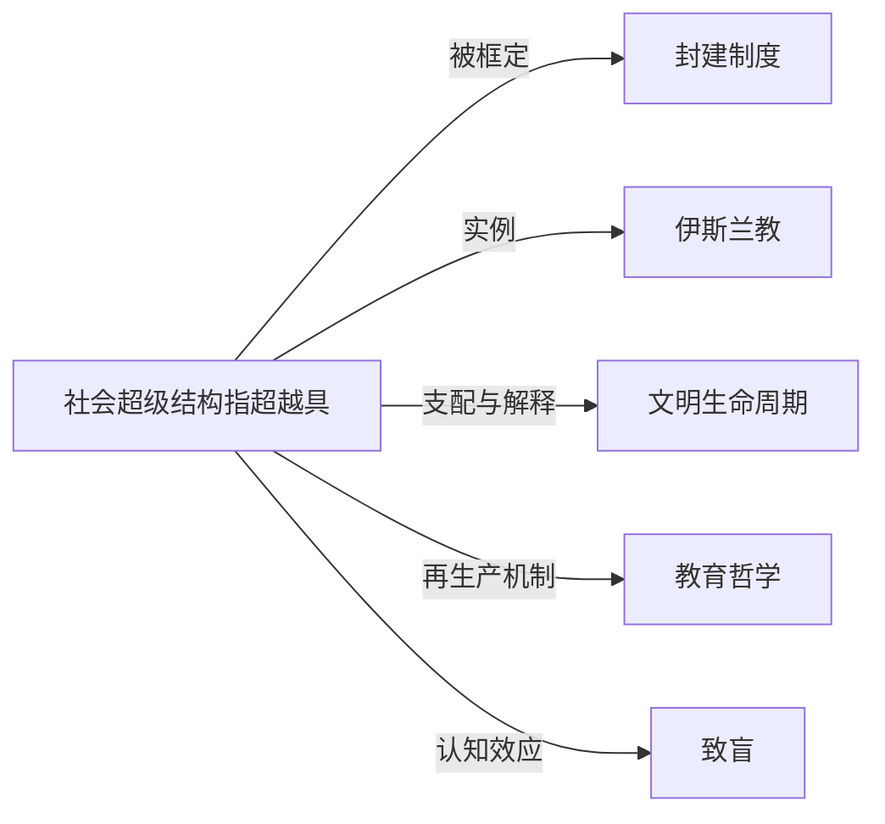

# 社会超级结构

## 定义
社会超级结构指超越具体制度与组织形态，在长时段内塑造文明走向的深层意义架构，如轴心时代的宗教哲学体系或主导性意识形态。

## 核心解释
它不同于日常的社会“上层建筑”，强调的是跨地域、跨世代的精神－文明框架，为各种具体制度（政治、经济、法律）提供终极合法性与方向感。其边界在于：它不是暂时性的政策或流行文化，而是维系文明连续性的意义内核。常见误解是将其等同于某一时期的制度集合，实际上它更像文明认知的底层语法。当原有超级结构瓦解时，文明会陷入意义危机与重组。

## 示例
- 以儒释道合一的价值体系作为中华文明两千年延续的超级结构
- 伊斯兰教在诸多前现代社会中同时承担法律、伦理、政治正当性来源的超稳定角色

## 关联概念
- [[封建制度]]：封建制度作为一种具体的社会组织形态，其权力合法性、等级秩序往往需要当时的宗教或意识形态等超级结构来提供终极辩护。
- [[伊斯兰教]]：伊斯兰教在其经典文明期不仅作为宗教，更作为整合政治、法律、日常伦理的文明超级结构发挥作用。
- [[文明生命周期]]：社会超级结构的僵化或解体是文明进入衰落阶段的核心内在原因，新的超级结构诞生则可能开启新一轮文明生命周期。
- [[教育哲学]]：特定的教育哲学常承担将社会超级结构内化于个体的功能，使宏观意义框架得以代际传递。
- [[致盲]]：沉浸于某一超级结构中的成员往往将该结构下的价值观视为自然、唯一合理，从而对其他可能性形成系统性视角遮蔽。

## 相关问题
- 社会超级结构与“上层建筑”的本质区别是什么？
- 现代多元化社会是否还存在单一的超级结构？
- 技术革命能否催生新的社会超级结构？

## 关系图

