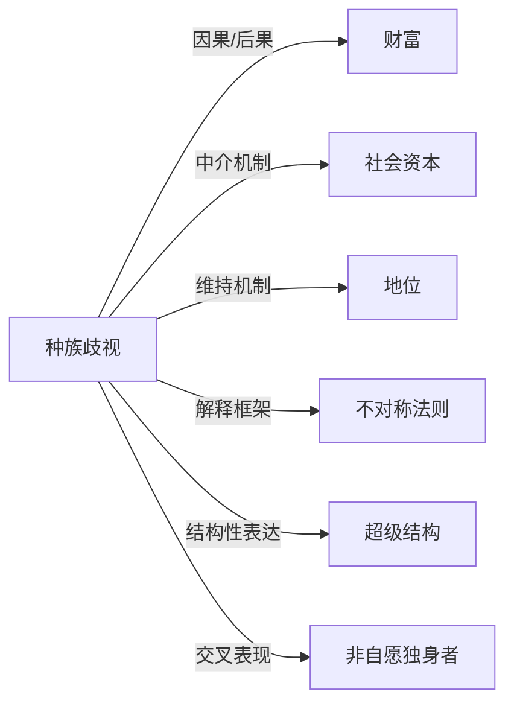

## 定义
基于种族或族裔身份对个体或群体进行区别对待、贬低或排斥的信念、行为与制度安排，常伴随着对某一“种族”的优越性或劣等性的刻板印象。

## 核心解释
种族歧视的核心是用生物性或不言自明的“种族”差异来正当化社会不平等。它既可以是显性的仇恨言论与暴力，也大量表现为隐性的偏见和结构性障碍。常见误解是将种族歧视简化为个人恶意，忽视其嵌入住房、就业、司法、教育等制度中的系统性格。另一误解是认为只有多数对少数的压迫才算歧视，实际上任何基于种族的差别对待均可构成种族歧视，但通常更关注权力不对等下的歧视。

## 示例
- 雇主以“文化契合度”为由拒绝合格的少数族裔求职者，而实际上是对其种族身份的隐性排斥。
- 银行系统性地拒绝向特定种族聚居区提供住房贷款（红线歧视），导致代际财富差距固化。

## 关联概念
- [[财富]]：种族歧视通过就业歧视、信贷排斥和遗产传递等渠道长期拉大不同种族间的财富鸿沟，使财富不平等代际再生产。
- [[社会资本]]：种族歧视常通过限制少数族裔进入主流社会网络来削弱其社会资本，从而影响职业机会、信息资源与地位获得。
- [[地位]]：种族歧视是一套维护主导群体社会地位的系统，通过污名化他者来固化等级秩序，使种族成为地位分层的核心轴线。
- [[不对称法则]]：可用来理解种族歧视中的权力不对称：主导群体对少数群体施以更严格的评判标准和更低的容错率，形成不对等的道德与行为期待。
- [[超级结构]]：种族歧视嵌入法律、经济、政治等超级结构中，成为“种族化结构”，即使没有个人歧视意图也能持续生产不平等结果。
- [[非自愿独身者]]：在某些语境下，种族歧视与性别关系交织，例如非自愿独身者群体中可能出现针对特定种族女性的物化或针对同种族男性的“种族劣势”叙事。

## 相关问题
- 个人无意识的隐性偏见如何构成种族歧视？
- 为什么说种族歧视是“结构性的”而非仅是个别行为？
- 种族歧视与阶层不平等、性别歧视如何相互强化？
- 反歧视政策（如平权行动）是否构成“反向歧视”？
- 在似乎没有“种族”的社会里（如一些同质化程度较高的东亚国家），种族歧视以何种形式存在？

## 关系图

