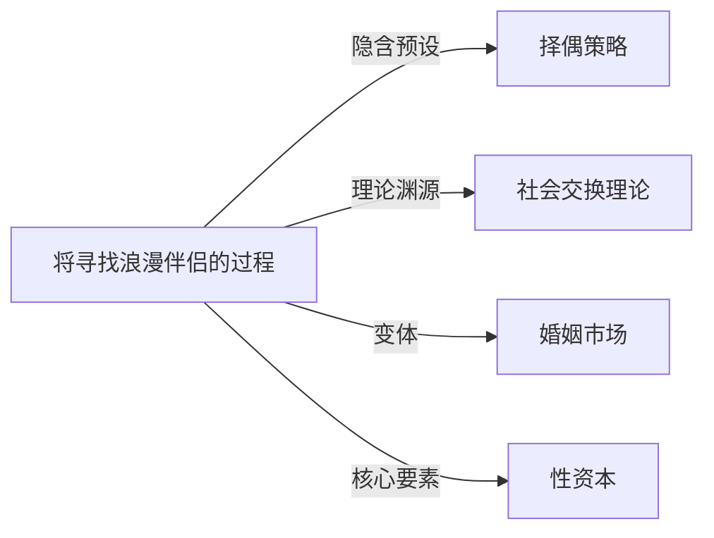

# 约会市场

## 定义
将寻找浪漫伴侣的过程类比为市场交易的概念，个人被视为具有不同价值属性的参与者，通过社交互动进行相互选择与匹配。

## 核心解释
约会市场借用经济学隐喻，强调择偶行为中的供需关系、竞争、偏好匹配和策略选择。个体携带的“资本”（如外貌、财富、性格、社会地位等）构成其在市场中的吸引力，而市场整体环境和交友渠道影响匹配效率。其核心边界在于这是一个启发性框架，并非严格的商品交换，人的情感、偶然性和长期承诺等非市场因素同样重要。常见误解是将约会市场等同于彻底的物化或贬低关系的神圣性，而忽略了它主要用来描述结构性择偶现象。

## 示例
- 在约会应用上，用户快速滑动选择，形成了高度流动、以第一印象为基础的“快餐式”配对市场。
- 某些社交圈子中，高收入和良好家庭背景被视为择偶中的“稀缺资源”，使得具备这些条件的人拥有更多的选择主动权。

## 关联概念
- [[择偶策略]]：约会市场中的参与者所采取的不同行为模式，如长期策略与短期策略，由进化心理学和社会学习共同塑造。
- [[社会交换理论]]：从社会心理学角度解释人们在关系中权衡收益与成本，约会市场即该理论在浪漫关系领域的一种投射。
- [[婚姻市场]]：将市场隐喻集中应用于以婚姻为目标的择偶过程，更关注制度性和长期契约因素。
- [[性资本]]：个体在约会市场中可动用的吸引力资源，包括身体吸引力、性魅力等，是市场价值的重要构成部分。

## 相关问题
- 约会市场概念在哪些方面忽略了亲密关系的情感深度？
- 不同类型的交友应用如何改变了约会市场的运作规则？
- 约会市场中的“价值”主要由哪些维度构成，在不同文化中有何差异？

## 关系图

