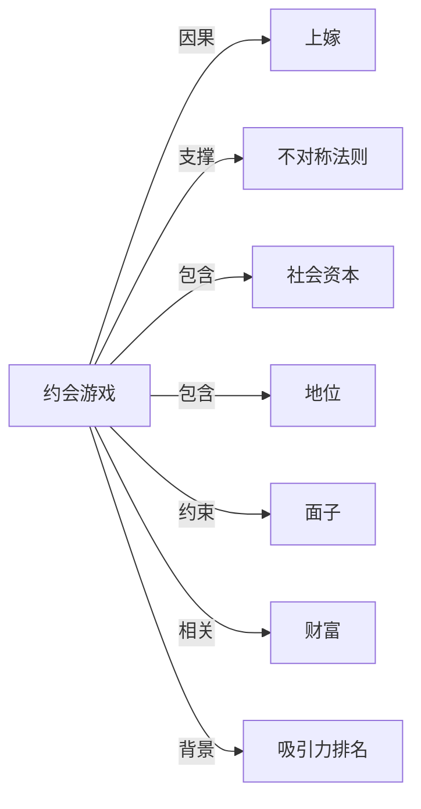

# 约会游戏

## 定义
约会游戏指在寻求浪漫或性伴侣的过程中，个体依据特定社会规则和策略进行展示、选择、匹配的互动模式，常被类比为一种带有博弈性质的社交交换行为。

## 核心解释
核心内涵在于将约会视为一个价值展示与评估的场域，参与者通过外貌、财富、地位、社会资本等信号吸引对方，并遵循矜持、投资门槛、推拉等隐性规则，以最大化自身的匹配收益。其边界限于浪漫关系建立的初期阶段，不同于柏拉图式友谊或纯粹商业交易。常见误解是将约会游戏完全等同于操纵或不真诚，忽略它同时反映了社会文化脚本、两性权力结构和真实的情感需求。

## 示例
- 在初期约会中刻意延迟回复消息，以维持神秘感和不被视为过度渴求，是典型的‘推拉’策略。
- 高端相亲时，双方仔细评估对方的学历、家庭背景和收入，如同进行资产审计，体现了以婚姻为目标的博弈。

## 关联概念
- [[上嫁]]：指女性通常寻求社会地位或财富不低于自己的配偶，构成约会游戏中价值匹配的核心动力之一。
- [[不对称法则]]：指两性在选择标准、时间压力、承诺成本等方面存在系统性差异，塑造了博弈中的攻防策略。
- [[社会资本]]：个体通过社交网络、声誉和人际关系网络带来的资源，是其约会博弈中可展示的价值之一。
- [[地位]]：个体的社会阶层与相对排名，是约会游戏中吸引力评估的关键维度。
- [[面子]]：维护社会形象与避免羞耻感的心理需求，影响约会中的表现策略和拒绝方式。
- [[财富]]：可观的经济资源是约会市场中直接展示生存与抚养能力的普适信号。
- [[吸引力排名]]：约会游戏是吸引力排名最典型的呈现和竞争场所，参与者通过策略行为试图提升自己在他人感知中的排名。

## 相关问题
- 为什么人们在约会中普遍采用类似游戏的策略？
- 约会游戏中的规则如何受到性别角色与社会期待的影响？
- 在线约会软件如何改变了传统约会游戏的不对称法则？

## 关系图

