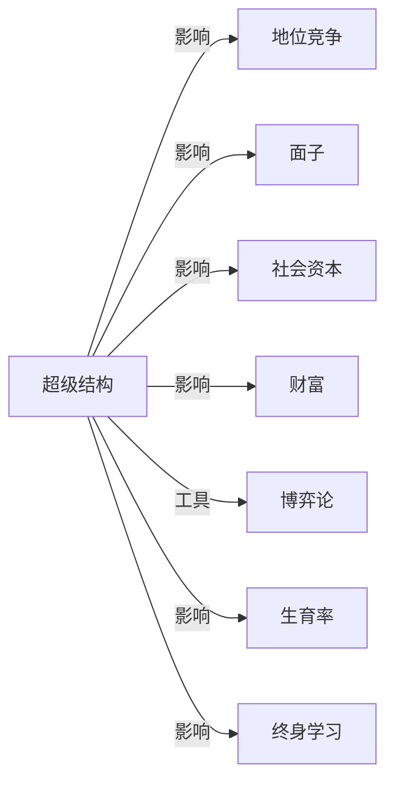

# 超级结构

## 定义
在社会理论中，超级结构（上层建筑）指建立于经济基础之上的制度、文化和意识形态体系，包括法律、政治、宗教、艺术和价值观等，它们由基础决定并反过来影响基础。

## 核心解释
超级结构映射社会再生产中非物质的规范性力量。它并非独立存在，而是根植于生产关系和财富分配，同时又通过法律、教育、媒体等渠道固化特定的地位秩序和面子逻辑。常见误解是将超级结构简单看作观念集合，忽略了其物质化的制度载体和强制性；另一极端是认为它完全由经济单向决定，忽视了文化惯性和自主性。边界在于：它不直接包括生产力和生产资料，而是围绕权力合法性与意义争夺的场域。

## 示例
- 一个社会中关于“成功”的主流叙事（如高消费即高人一等）强化了地位竞争，这种叙事和教育筛选机制共同构成超级结构。
- 面子文化通过社交礼仪、人情往来等制度化预期，调节着社会资本的积累与损耗，属于超级结构中的人际规范层。

## 关联概念
- [[地位竞争]]：超级结构提供了地位高低的评判标准和正当化话语，从而使地位竞争在特定轨道上展开。
- [[面子]]：面子是超级结构中的一种软性制度，文化将社会承认的符号体系编码为面子的得失。
- [[社会资本]]：超级结构通过信任规范、关系网的价值排序，塑造了社会资本的分布和兑换规则。
- [[财富]]：经济基础中的财富分配决定超级结构的基本形态，而超级结构又通过产权法、继承制等影响财富的传承与正当性。
- [[博弈论]]：可用博弈论建模超级结构中规则与信号如何塑造均衡，如规范演化可视为重复博弈中的稳定策略。
- [[生育率]]：超级结构通过家庭观念、性别分工叙事和育儿制度间接影响生育决策和生育率。
- [[终身学习]]：在当代知识经济中，超级结构将终身学习塑造为个体应对风险和维持地位的责任性意识形态。

## 相关问题
- 超级结构的变迁是如何滞后于经济基础变化的？
- 在数字化平台社会，算法是否已成为新的超级结构要素？
- 个人行动（如违反面子规范）能否局部瓦解超级结构的约束力？

## 关系图

