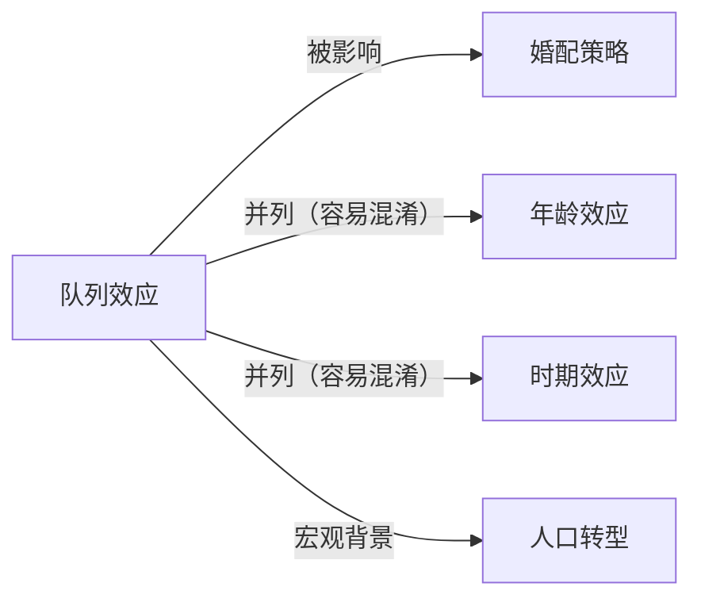

# 队列效应

## 定义
队列效应（Cohort Effect）指因出生年份或所属世代不同，导致个体在态度、行为或生命历程结果上的系统性差异，而非年龄或时期单独造成的变化。

## 核心解释
队列效应是人口学与社会学中区分年龄、时期和队列三种时间维度的核心概念。同一出生队列的人共同经历了特定的历史事件、社会变迁或政策环境，从而形成相似的价值观、机会结构或风险暴露。它常被误解为单纯的年龄效应（因变老而产生）或时期效应（因特定年份的事件影响所有人群）。识别队列效应需要纵向数据，用以剥离年龄和时期的影响，否则容易将代际差异错误归因。

## 示例
- 韩国1960年代出生的男性队列因性别选择性堕胎较少，性别比相对平衡；而1980年代后出生的队列面临严重的男性婚姻挤压，这是性别比失衡在队列上的体现。
- 沙特阿拉伯在石油繁荣后出生的年轻队列，其教育水平、女性劳动参与率和对全球文化的接受度显著高于石油时代前的队列，形成代际文化裂隙。

## 关联概念
- [[婚配策略]]：不同性别比和机会结构的出生队列会调整个体的择偶标准与婚姻时机，形成队列特有的婚配模式。
- [[年龄效应]]：年龄效应仅反映生理老化或生命历程阶段带来的变化，队列效应则强调同一出生群遭遇到的独特历史环境。
- [[时期效应]]：时期效应指某一特定时间点或时段对所有年龄和队列同时产生的影响，队列效应则长期烙印在特定出生群上。
- [[人口转型]]：不同队列的生育、死亡和迁移行为差异，是驱动人口结构变动的微观基础，队列效应由此与人口转变理论紧密相连。

## 相关问题
- 如何通过统计分析将队列效应从年龄和时期效应中分离出来？
- 韩国的低生育率在多大程度上可以归因于不同出生队列的价值观变化？
- 沙特阿拉伯的青年队列如何影响该国政治稳定的长期前景？
- 婚姻挤压中的队列效应是否会在性别比重新平衡后自动消失？

## 关系图

