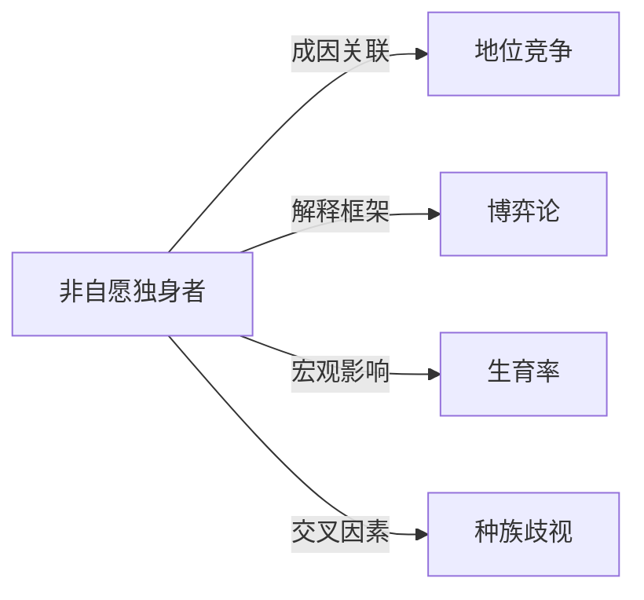

# 非自愿独身者

## 定义
非自愿独身者（incel）是指主观上希望建立浪漫或性亲密关系，但因社交、外貌、经济等结构性或个人因素长期无法实现，从而处于非自愿的独身状态的群体，以异性恋男性为主。

## 核心解释
核心在于“非自愿”——与主动选择独身（如独身主义）截然不同。其困境往往源于个体条件与社会择偶标准之间的错配，涉及地位竞争、社交技能、外貌评价等多重因素。常见误解是将所有非自愿独身者等同于网络仇恨意识形态或暴力倾向，但事实上多数incel并未走向极端化，只是经历着孤独与挫败。该概念在线上亚文化中发展出特定身份认同话语，容易强化受害者叙事和对外群体的怨恨。

## 示例
- 一名因身高偏矮和内向，数次表白被拒后长期无法进入亲密关系，在专属论坛分享经历的男性。
- 一位因重度社交焦虑而难以维持约会，最终自认永远无法找到伴侣的年轻人。

## 关联概念
- [[地位竞争]]：部分理论认为，在性别地位和资源竞争中失利、无法达到婚恋市场期望地位的男性更易陷入非自愿独身困境。
- [[博弈论]]：两性择偶策略可视为一种博弈，非自愿独身可被解释为在配对市场博弈中连续无法达成合作均衡的结果。
- [[生育率]]：大量男性长期处于非自愿独身状态，可能对整体人口生育率造成下行压力，加剧人口结构问题。
- [[种族歧视]]：在某些incel社区话语中，存在种族化审美标准，少数族裔男性常被描述为在约会市场中处于结构性劣势。

## 相关问题
- 非自愿独身现象背后的社会结构性原因有哪些？
- 非自愿独身与心理健康问题如何相互影响？
- 网络incel亚文化如何塑造成员的认同与行为？
- 如何有效干预因非自愿独身引发的厌女或仇恨情绪？

## 关系图

