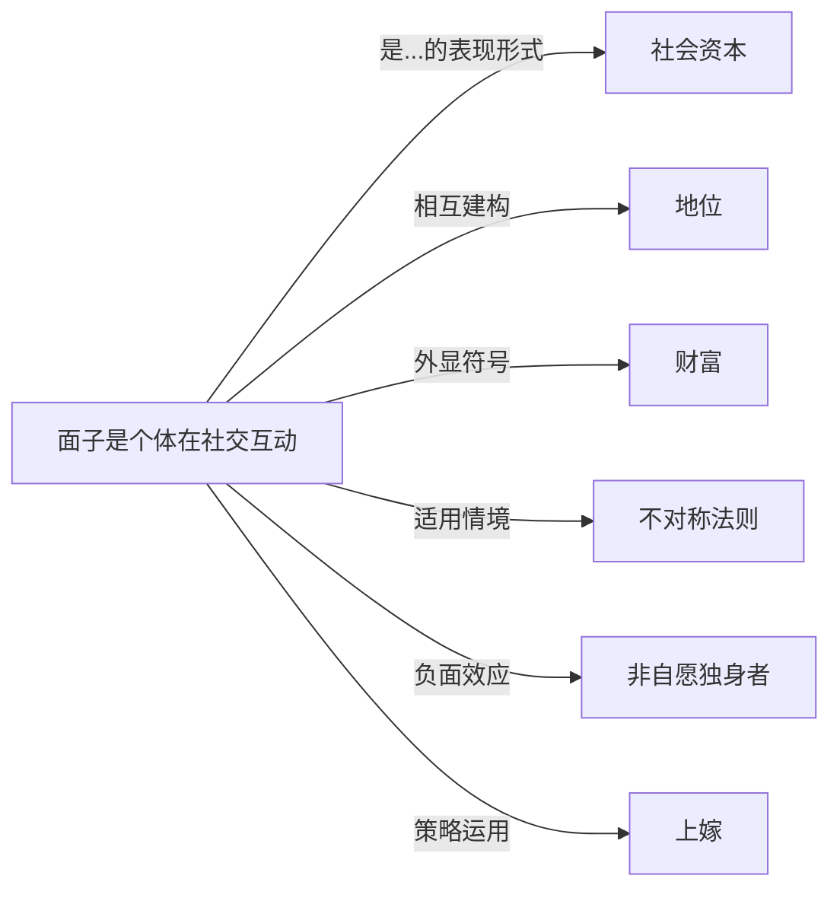

# 面子

## 定义
面子是个体在社交互动中希望获得他人认可而形成的自我形象与社会声誉。

## 核心解释
面子本质上是一种外源性社会评价，依赖于他人对个体行为、能力与身份的一致认可。它与自我内在的自尊不同：自尊是自我评价，面子则必须通过社会互动来维系和修复。面子不仅涉及个人尊严，还与地位、权威、人际关系网络紧密相连，在东亚文化中尤其被制度化为一种隐性的社会规则。常见误解是将面子简单等同于虚荣，实际上它是维护社会关系协调、减少公开冲突的软性机制，也是一种稀缺的社会资本。

## 示例
- 在会议中不在公开场合直接反驳上级的错误，以保全上级的面子，事后私下委婉沟通。
- 婚礼或酒席上主人安排超出自身经济能力的排场，以在亲友面前撑面子，维系家族的社会形象。

## 关联概念
- [[社会资本]]：面子可被视为一种储存于人际关系中的社会资本，能调动资源、建立信任，丧失面子即社会资本的贬值。
- [[地位]]：面子既是社会地位的晴雨表，也是维持或争取更高地位的手段，两者的失衡会引发面子危机。
- [[财富]]：财富常被用作面子竞争的显性工具，通过消费和馈赠来体现经济实力，从而获得社会认可。
- [[不对称法则]]：面子互动中常遵循不对称法则，如地位低者维护地位高者的面子，这种不对等维系了等级秩序。
- [[非自愿独身者]]：在强调面子与男性气概的文化中，无法建立亲密关系可能导致面子严重受损，加剧社会性排斥。
- [[上嫁]]：婚配中的上嫁模式可帮助个体或家庭获得面子上的攀升，将婚姻转化为提升社会评价的策略。

## 相关问题
- 面子与自尊的本质区别在哪里？
- 为什么东亚文化中面子概念比西方更为突出？
- 如何在跨文化沟通中避免触碰对方的面子禁忌？
- 面子经济如何扭曲个体的消费和负债行为？

## 关系图

