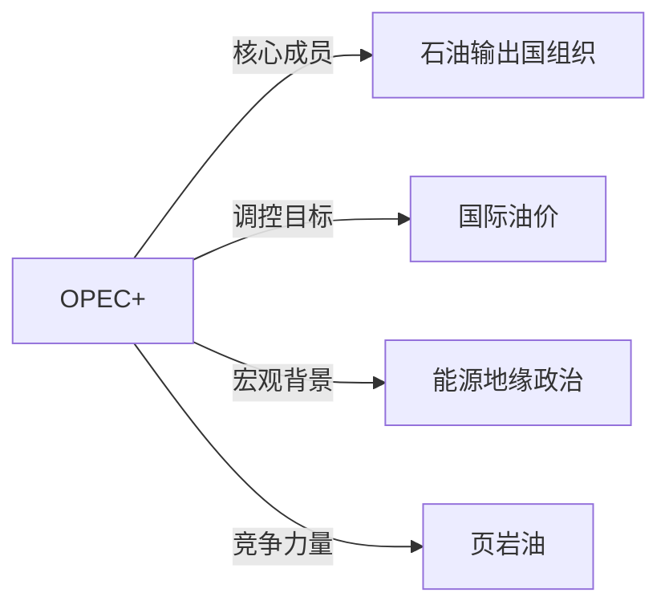

# OPEC+

## 定义
OPEC+是指石油输出国组织（OPEC）与包括俄罗斯在内的部分非OPEC产油国组成的协调机制，旨在通过联合调整原油产量来影响国际油价。

## 核心解释
OPEC+成立于2016年底，核心功能是在OPEC框架外纳入俄罗斯、墨西哥、哈萨克斯坦等非成员国，形成覆盖全球约一半石油产量的供给联盟。其通过协议减产或增产来管理市场供需，平衡油价。常见误解是将OPEC+视作正式国际组织，实际上它依赖自愿遵守，缺乏强制执行力，协议经常因成员国利益分歧而面临破裂风险。

## 示例
- 2020年新冠疫情期间，OPEC+达成历史性大规模减产协议以应对需求崩溃
- 2023年沙特和俄罗斯主导的额外自愿减产，以支撑油价并测试市场弹性

## 关联概念
- [[石油输出国组织]]：OPEC是OPEC+的主体，由沙特、伊拉克等主要产油国组成，为合作提供制度基础。
- [[国际油价]]：OPEC+的产量决策直接作用于布伦特原油和WTI原油等基准价格。
- [[能源地缘政治]]：OPEC+的博弈常反映美国、俄罗斯、沙特等大国的能源战略角力。
- [[页岩油]]：美国页岩油产量增长侵蚀了OPEC+的市场份额，迫使联盟调整策略以平衡市场。

## 相关问题
- OPEC+和OPEC的主要区别是什么？
- OPEC+减产协议为何常常难以彻底执行？
- OPEC+如何影响全球通胀和货币政策？

## 关系图

