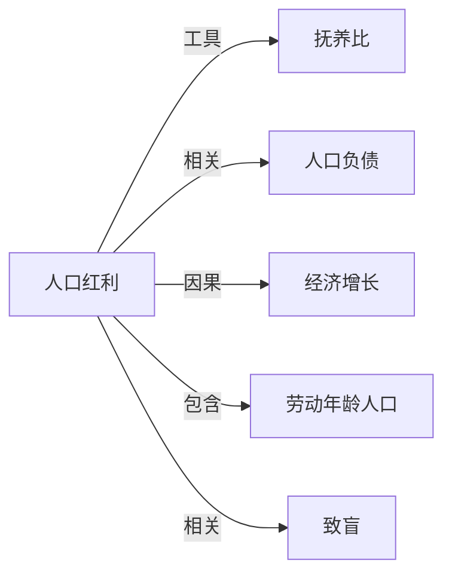

# 人口红利

## 定义
人口红利指在特定时期内，劳动年龄人口占总人口比重较高、社会抚养负担相对较轻，从而为经济高速增长提供有力人力支撑的人口结构状态。

## 核心解释
人口红利的核心是“人口机会窗口”：生育率下降导致儿童抚养比降低，而老龄化尚未加速，劳动力供给充裕。这能促进储蓄、投资和生产率提升，但它只是一种潜在优势，必须配合有效的经济政策、教育和就业机会才能转化为实际增长。常见误解是将人口红利等同于“人多力量大”，其实它取决于年龄结构而非人口总量，且具有时效性，过后可能转为人口负债。

## 示例
- 中国自1970年代后期至2010年代，大量劳动力进入市场，配合改革开放政策，推动了数十年的高速经济增长。
- 韩国1960-1990年代生育率下降而劳动年龄人口膨胀，为出口导向型工业化提供了快速扩张的劳动力基础。

## 关联概念
- [[抚养比]]：抚养比下降（非劳动年龄人口相对减少）是形成人口红利的直接人口学前提。
- [[人口负债]]：人口红利窗口关闭后，老龄化加速、抚养比上升，可能转变为经济增长减速的人口负债。
- [[经济增长]]：人口红利为经济增长提供劳动力、储蓄和人力资本条件，但不必然自动转化为实际增长。
- [[劳动年龄人口]]：人口红利直接依赖于劳动年龄人口占总人口比重的持续上升。
- [[致盲]]：充分就业是实现人口红利的关键政策条件，否则大量年轻人口可能带来社会压力。

## 相关问题
- 人口红利如何从潜在优势转化为实际经济增长？
- 人口红利通常持续多长时间？其结束的标志是什么？
- 未富先老的国家是否有机会实现替代性的人口红利？
- 人口红利与教育、女性劳动参与率的关系是怎样的？

## 关系图

