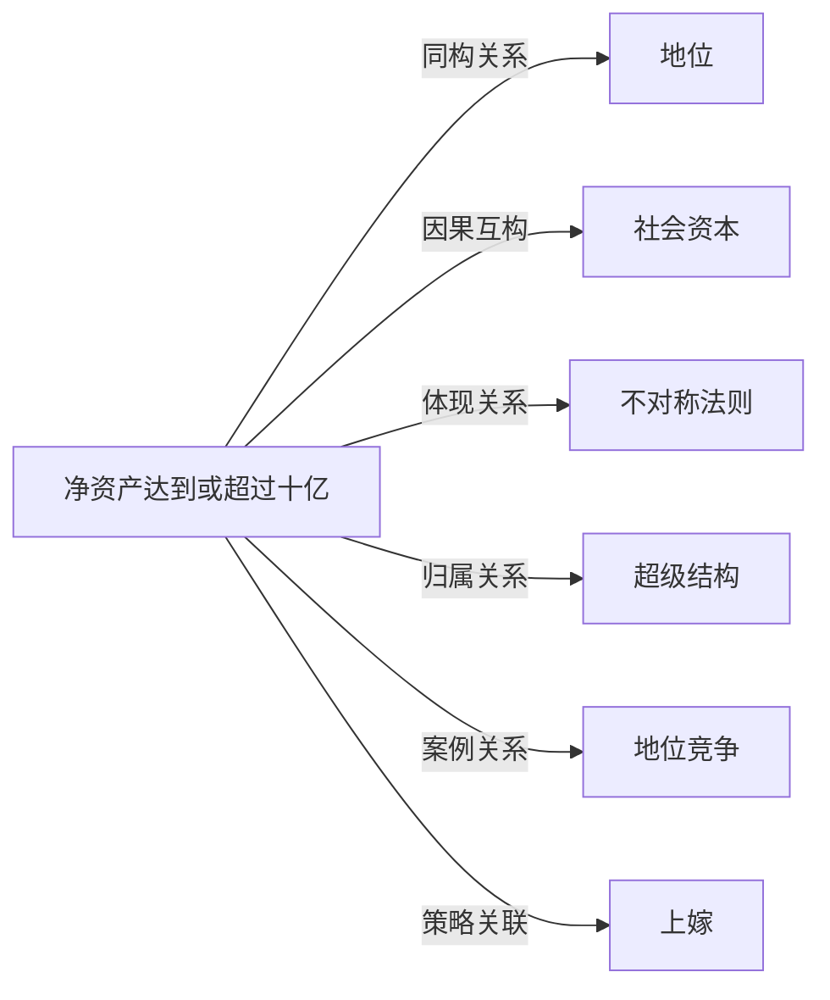

# 亿万富翁

## 定义
净资产达到或超过十亿货币单位（通常指美元）的个人。

## 核心解释
亿万富翁是财富积累的极端形态，其财富不仅来自收入，更多源于资产增值（如股权、不动产）。核心特征包括：拥有能够产生持续被动收入的资本规模，以及由此衍生的巨大经济、社会和政治影响力。常见误解是将亿万富翁等同于高收入者，实际上他们占据的是资本所有者而非劳动力提供者的位置，其财富增长主要受资产价格变动和复利效应驱动，边际消费倾向极低。

## 示例
- 一位创始人持有大量未上市科技公司股权，公司估值增长使其身价突破十亿美元
- 通过继承家族企业股权并实现多元化投资，使得资产净值达到十亿级别

## 关联概念
- [[地位]]：亿万富翁身份是经济地位高度可见的终极象征，可直接转化为社会尊重与话语权。
- [[社会资本]]：巨额财富便于建立高价值社交网络，而社会资本反过来又是获取稀缺信息与交易机会的关键，二者相互加强。
- [[不对称法则]]：亿万富翁群体是财富分配极端不对称的具象化，反映了资本收益增速远超劳动收入的现实。
- [[超级结构]]：亿万富翁占据社会经济超级结构的最顶层，他们的决策（如投资方向、慈善偏好）能够影响社会资源的宏观配置。
- [[地位竞争]]：在顶级富豪圈子中，财富增长、艺术品收藏、慈善捐赠等均可视为地位竞争的高级形式。
- [[上嫁]]：向上婚配策略中，亿万富翁常被视为终极目标，但实际中更受限于阶层内婚与资产保全考虑。

## 相关问题
- 亿万富翁的财富主要来自劳动收入还是资本利得？
- 亿万富翁如何通过资产分散配置来保护财富？
- 成为亿万富翁需要具备哪些非线性的跃迁条件？

## 关系图

