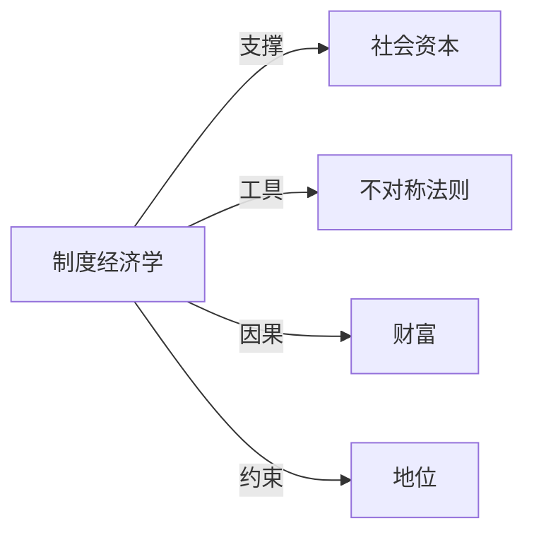

## 定义
制度经济学是研究制度如何产生、演变及其对经济行为与绩效影响的经济学分支。

## 核心解释
它把制度（如法律、产权、习俗、契约）视为经济分析的内生变量，强调交易成本和有限理性，反对新古典经济学完全信息的假设。核心边界在于：制度既包括正式规则（宪法、法律）也包括非正式约束（社会规范、惯例），并且制度变迁往往具有路径依赖和周期性。常见误解是将其简单等同于“研究经济制度”，实则它重点分析制度本身如何被选择、执行和改变。

## 示例
- 专利制度通过暂时垄断激励创新，但过度保护可能阻碍技术扩散
- 圈地运动前模糊的公共产权与之后清晰私有产权的转变解释了农业革命中的投资激励

## 关联概念
- [[社会资本]]：信任和合作网络作为非正式制度降低交易成本，是制度经济学分析的无形资源
- [[不对称法则]]：制度在信息不对称条件下充当治理机制，缓解逆向选择和道德风险
- [[财富]]：产权和契约等制度的质量直接影响国家财富积累与长期经济增长
- [[地位]]：地位秩序常嵌入非正式制度，影响资源配置和经济交换模式

## 相关问题
- 为什么有的国家移植了西方法律却仍然贫穷？
- 非正式习俗如何与正式法律相互作用以影响合同执行？
- 制度在什么条件下会从低效率均衡跃迁到高效率均衡？

## 关系图

