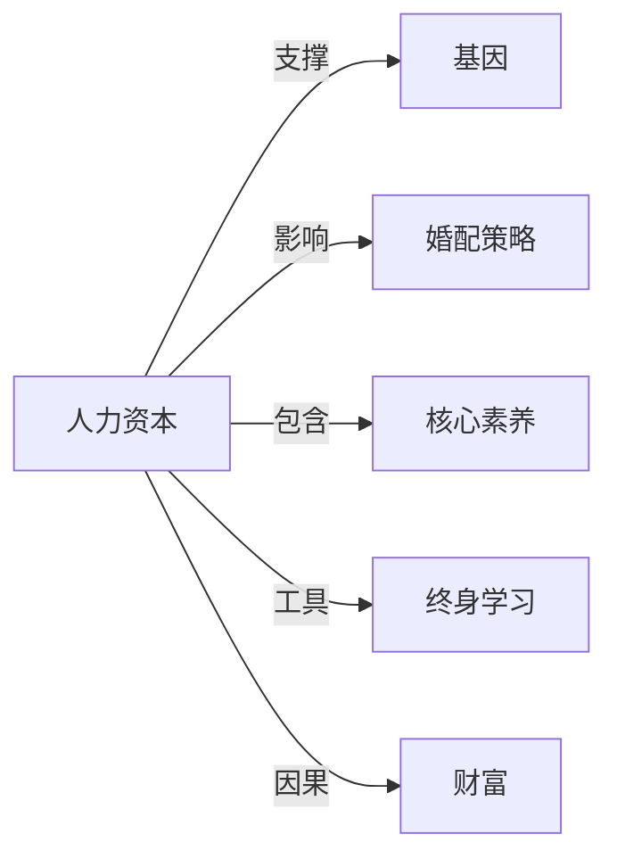

# 人力资本

## 定义
人力资本是体现在个人身上，通过教育、培训、健康投资和经历等积累而得的知识、技能、健康及价值观等，能带来未来经济回报的资本形式。

## 核心解释
人力资本把人的能力视为一种可以投资和增值的资产，与物质资本、金融资本等并列。其核心在于，个人和国家可以通过有意识的投入（如上学、在职培训、医疗保健）提高劳动生产率与创新能力，从而获得更高收入或经济增长。常见误解是将其等同于单纯的劳动力数量或体力劳动，而忽略了认知能力、身心健康和软技能等隐性维度。

## 示例
- 接受高等教育后，个人的就业选择面和终身收入水平显著提升。
- 企业为员工提供专业技能培训，员工效率提高，企业获得更多产出，这是一种人力资本投资。

## 关联概念
- [[基因]]：基因影响个体的基本认知潜能、性格特质和健康基础，构成人力资本积累的先天起点。
- [[婚配策略]]：婚配选择中常常隐含对双方人力资本（如教育水平、收入潜力）的考量，并影响下一代的人力资本环境。
- [[核心素养]]：核心素养是当前时代所需的关键能力与品格，可视为人力资本在特定社会背景下的具体内涵。
- [[终身学习]]：终身学习是个人持续更新和维护人力资本的主要方式，以应对快速变化的经济和社会需求。
- [[财富]]：人力资本可以通过劳动市场和创业等途径转化为物质财富和金融财富，是个人财富创造的重要根基。

## 相关问题
- 人力资本与物质资本的根本区别是什么？
- 如何衡量一个经济体的人力资本存量？
- 健康为什么也算人力资本投资？
- “内卷”是否意味着人力资本贬值？

## 关系图

