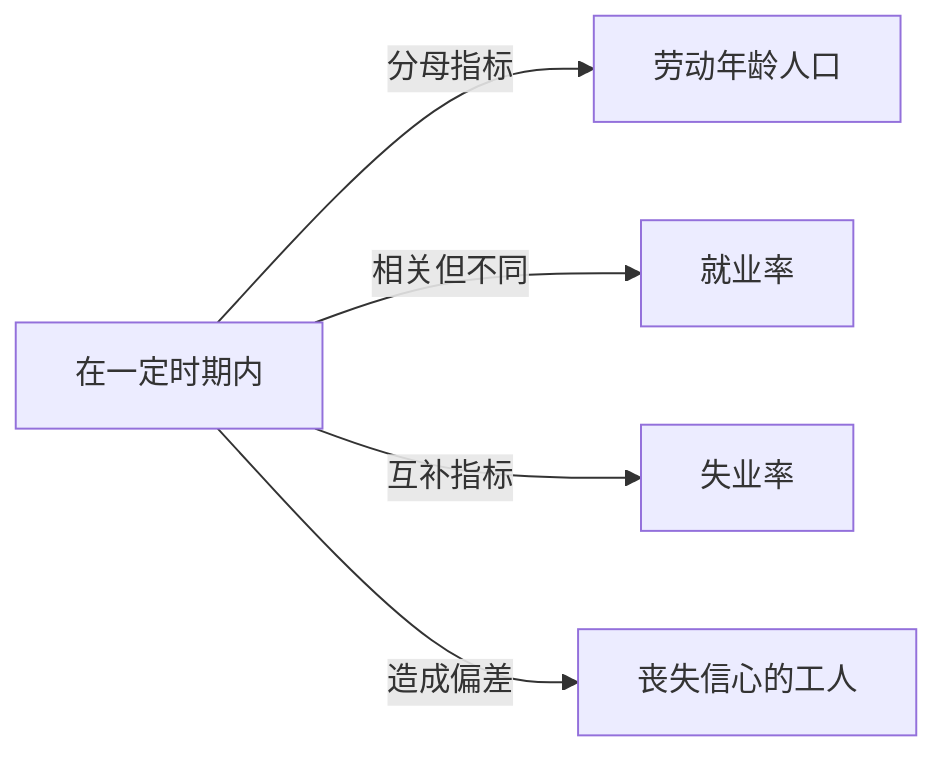

# 劳动力参与率

## 定义
在一定时期内，劳动年龄人口中参与劳动力市场（包括就业者和正在寻找工作的失业者）所占的百分比。

## 核心解释
劳动力参与率反映了一个经济体中潜在劳动者的实际劳动供给意愿。计算公式为：（经济活动人口 ÷ 劳动年龄人口）×100%。经济活动人口包括就业者和失业者，退休人员、在校学生、家庭主妇等不寻找工作的人群则不计入。该指标受人口结构、文化观念、教育水平、经济景气等因素影响。常见误解是将劳动力参与率等同于就业率，前者衡量的是参与意愿，后者衡量的是实际被雇佣比例。

## 示例
- 一个国家劳动年龄人口为2000万，其中1500万在就业或积极求职，劳动力参与率为75%。
- 经济衰退期，部分长期失业者因放弃寻找工作而退出劳动力市场，导致劳动力参与率下降。

## 关联概念
- [[劳动年龄人口]]：一般指16岁以上、法定退休年龄以下的人口，是计算劳动力参与率的基础人群。
- [[就业率]]：衡量就业人数占劳动年龄人口的比例，比劳动力参与率多排除失业者，常被混淆。
- [[失业率]]：失业人口占经济活动人口的比例，与劳动力参与率共同描绘劳动力市场状况。
- [[丧失信心的工人]]：因长期找不到工作而停止求职的人，不计入劳动力，会压低劳动力参与率，使失业率低估。

## 相关问题
- 劳动力参与率下降是否一定意味着经济恶化？
- 女性劳动力参与率上升对社会有哪些长期影响？
- 劳动力参与率如何影响潜在GDP？
- 劳动年龄人口老龄化会怎样改变劳动力参与率？

## 关系图

