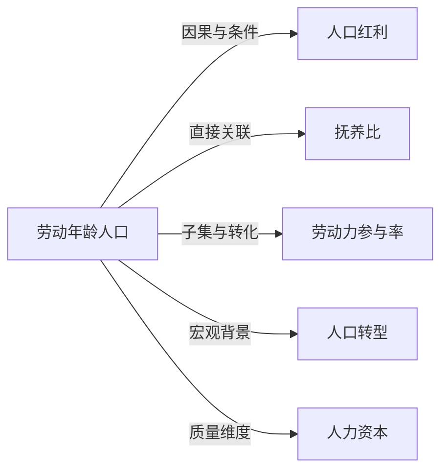

# 劳动年龄人口

## 定义
劳动年龄人口是指在一定年龄范围内，具有潜在劳动能力、构成劳动力资源的人口群体。

## 核心解释
国际一般将15–64岁（或15–59岁）人口定义为劳动年龄人口，是计算劳动参与率和抚养比的基础。它不等于“劳动力”或“就业人口”，因为它包含了在校学生、家庭照料者、无就业意愿者等实际未参与劳动的人。该概念主要用于分析人口结构对经济发展的影响，常见误解是将劳动年龄人口直接等同于实际可用劳动力。

## 示例
- 中国规定男性16–59岁、女性16–54岁为劳动年龄人口，用于统计抚养比
- 当一个国家劳动年龄人口占比上升时，可能带来“人口红利”，如1980–2010年的亚洲四小龙

## 关联概念
- [[人口红利]]：劳动年龄人口占比高且充分就业时，有利于经济增长的人口红利期
- [[抚养比]]：非劳动年龄人口与劳动年龄人口之比，衡量社会抚养负担
- [[劳动力参与率]]：劳动年龄人口中实际参与劳动（就业或失业）的人口比率
- [[人口转型]]：生育率和死亡率变化导致人口结构演变，包括劳动年龄人口比例波动
- [[人力资本]]：劳动年龄人口的教育、技能和健康水平，决定其转化为生产力的质量

## 相关问题
- 劳动年龄人口减少会如何影响经济？
- 劳动年龄人口和劳动力的区别是什么？
- 如何应对人口老龄化带来的劳动年龄人口下降？

## 关系图

