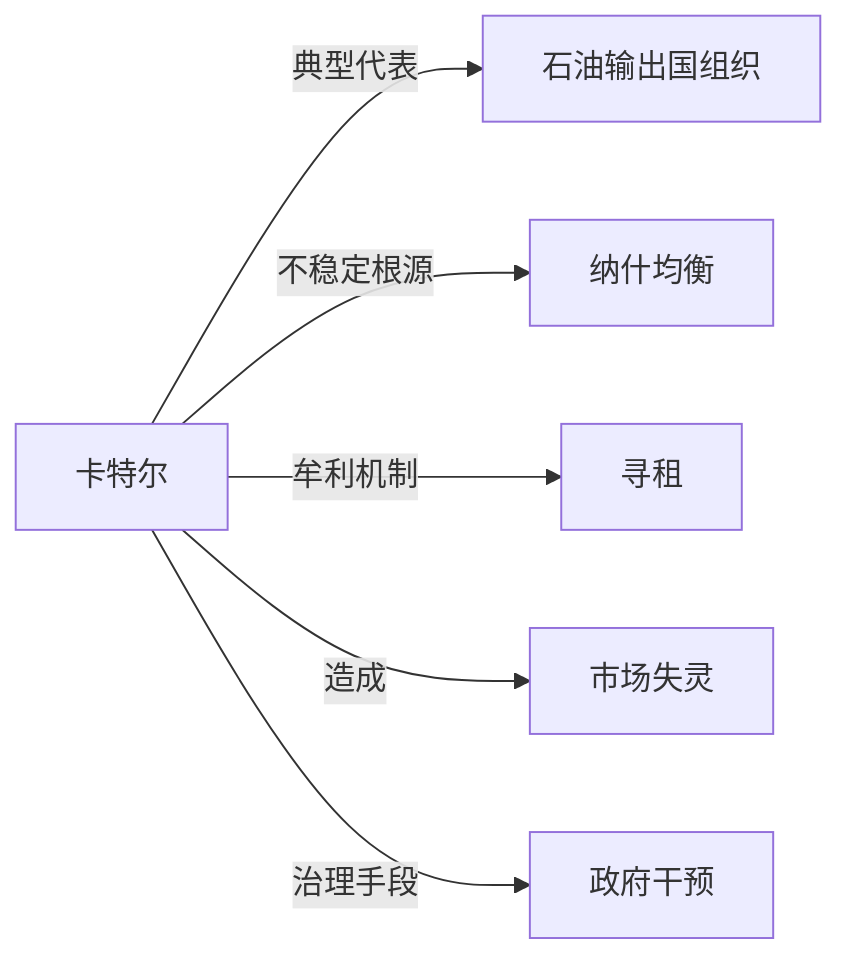

# 卡特尔

## 定义
由同一行业中的独立企业通过公开或默示协议，共同固定价格、限制产量、划分市场或串通投标，以抬高利润的联合行为或组织。

## 核心解释
卡特尔是寡头市场上共谋的典型形式：成员企业放弃相互竞争，像垄断者一样行动。其内在矛盾是每个成员都有"作弊"激励——在协议价格下偷偷降价增产可以独享更多利润，因此卡特尔天然不稳定，通常需要监督、惩罚与长期博弈中的声誉机制来维持。多数国家通过反垄断法禁止卡特尔，并将其视为对消费者福利的损害。常见误解是把所有行业组织都当作卡特尔，实际上只有涉及价格、产量或市场划分的共谋才算。

## 示例
- 石油输出国组织（OPEC）协调成员国产量以影响国际油价，是国际上最著名的卡特尔，但其成员也时常超额生产。
- 两家航空公司通过信号性涨价并互相跟随，形成默示共谋，即使没有书面协议也可能被认定为卡特尔行为。

## 关联概念
- [[石油输出国组织]]：以协调产量、影响国际油价为目标，是卡特尔在国际商品市场上的典型代表。
- [[纳什均衡]]：卡特尔成员的关系类似囚徒困境，单方面增产的诱惑使不合作的背叛成为纳什均衡，解释了卡特尔的不稳定。
- [[寻租]]：卡特尔通过限制产量抬高价格获取超额利润，是典型的企业寻租行为。
- [[市场失灵]]：卡特尔削弱竞争、抬高价格、降低产出，导致资源配置偏离帕累托最优，构成市场失灵。
- [[政府干预]]：反垄断执法是对卡特尔的主要干预手段，通过禁止共谋恢复竞争秩序。

## 相关问题
- 为什么卡特尔成员总是倾向于背叛协议？
- 默示共谋与明示协议在法律上如何区分？
- 卡特尔对消费者福利和创新的影响是什么？
- 国际卡特尔（如 OPEC）为何难以通过国内反垄断法约束？

## 关系图

