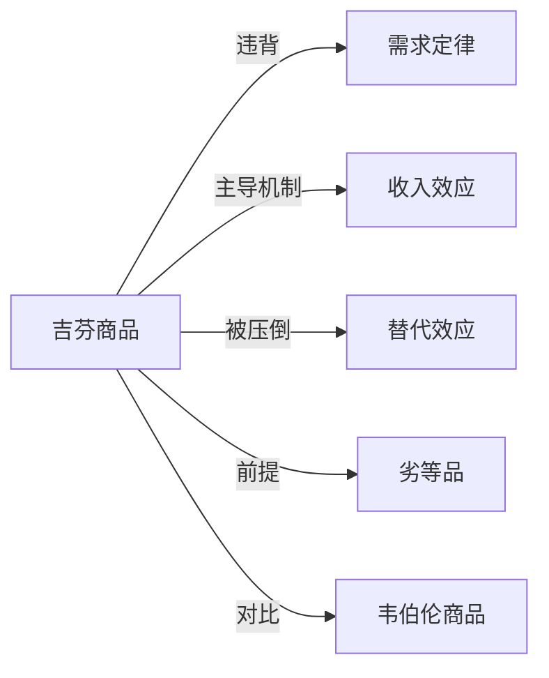

# 吉芬商品

## 定义
吉芬商品是指在其他因素不变的情况下，价格上升反而导致需求量增加的特殊低档商品。

## 核心解释
吉芬商品违背基本需求定律，其存在需要严格的条件：必须是劣等品（收入效应为负），且收入效应足够大，超过替代效应。常见误解是认为所有价格上涨需求增加的商品都是吉芬商品，而忽略了其劣等品前提。现实中的吉芬商品极为罕见。

## 示例
- 19世纪爱尔兰大饥荒时期的马铃薯，土豆价格上涨导致贫困家庭减少肉类消费，反而购买更多土豆以维持热量。
- 某些极端贫困地区的主粮，当价格飙升时，穷人买不起其他贵价食物，被迫消费更多主粮。

## 关联概念
- [[需求定律]]：吉芬商品是需求定律的例外情况，需求曲线向上倾斜。
- [[收入效应]]：价格上升使实际收入下降，对于劣等品，这会导致需求增加。
- [[替代效应]]：价格上涨时，人们本应转向相对便宜的替代品，但在吉芬商品情形下替代效应弱于收入效应。
- [[劣等品]]：吉芬商品必然是劣等品，但劣等品不一定是吉芬商品。
- [[韦伯伦商品]]：炫耀性消费品价格越高需求越大，但不符合吉芬商品的劣等品逻辑。

## 相关问题
- 吉芬商品与炫耀性消费品的区别是什么？
- 为什么现实中很难观察到真正的吉芬商品？
- 如何用无差异曲线和预算线推导吉芬商品的需求曲线？

## 关系图

