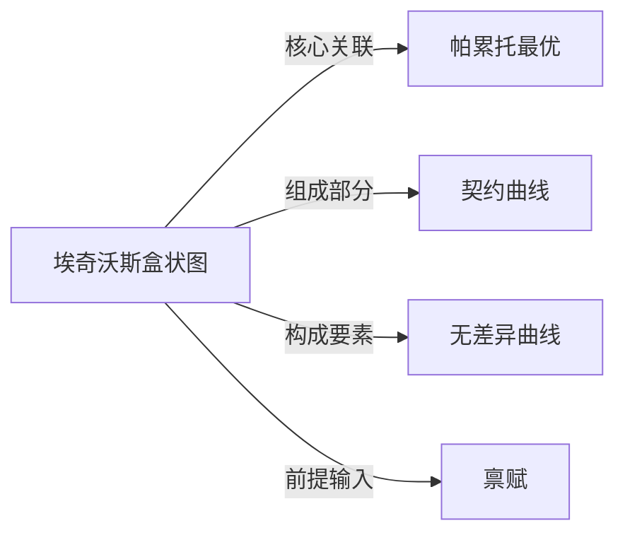

# 埃奇沃斯盒状图

## 定义
埃奇沃斯盒状图是一种用于分析两人、两种商品条件下交换经济效率和分配的图解工具。

## 核心解释
该图以两人各自的禀赋点出发，通过绘制无差异曲线来刻画双方可能的交易与帕累托改进区域。盒的横纵坐标分别代表两种商品的总量，两个原点分别对应两个消费者的原点。两条无差异曲线的切点集合构成契约曲线，其上各点均为帕累托有效率配置。常见误解包括将盒内任意点都视为均衡点，或忽视禀赋点变动对交换结果的影响。

## 示例
- 消费者A和消费者B分别持有若干面包和葡萄酒，通过埃奇沃斯盒状图可找到对双方都更优的交换方案。
- 在契约曲线上的某一点，若不损害一方的效用就无法提高另一方的效用，即为帕累托有效率分配。

## 关联概念
- [[帕累托最优]]：埃奇沃斯盒状图中的契约曲线所对应的正是帕累托有效率配置的集合。
- [[契约曲线]]：盒内两族无差异曲线切点的轨迹，代表所有帕累托最优配置。
- [[无差异曲线]]：每个消费者的偏好由无差异曲线表示，用于识别帕累托改进区域。
- [[禀赋]]：双方初始商品持有量，决定盒内初始点位置。

## 相关问题
- 如何从埃奇沃斯盒状图中识别帕累托改进区域？
- 为什么契约曲线上的点都是帕累托有效率配置？
- 禀赋点变动会如何影响契约曲线和贸易结果？
- 埃奇沃斯盒状图怎样用于分析生产交换经济中的总体均衡？

## 关系图

