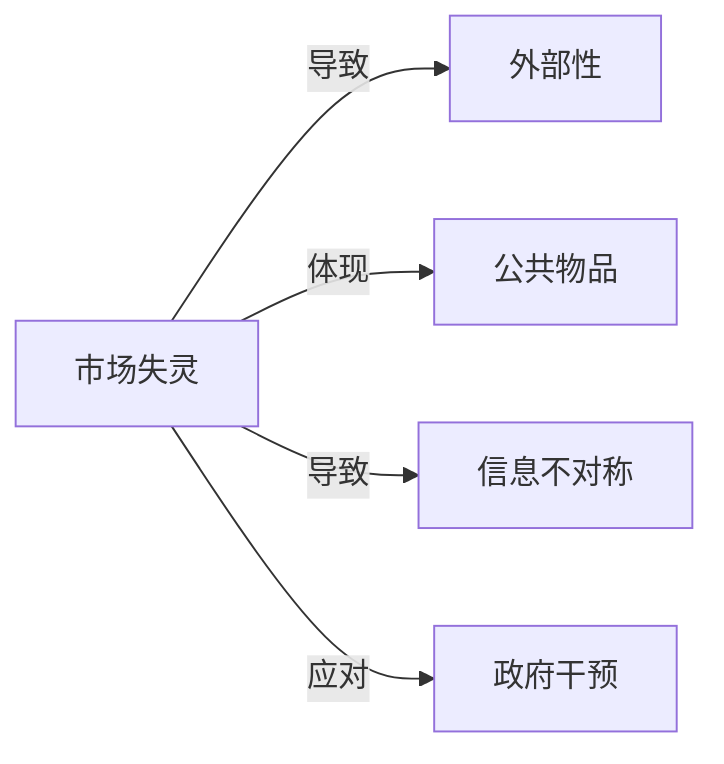

# 市场失灵

## 定义
市场失灵是指市场机制无法有效率地分配商品和劳务，导致资源配置未达到帕累托最优的状态。

## 核心解释
其关键内涵在于，当存在外部性、公共物品、信息不对称、垄断势力或交易成本过高等因素时，价格信号难以反映真实的社会成本与收益，从而市场自发运行的结果偏离社会最优。边界：市场失灵并不意味着市场完全无效，而是指在特定条件下市场机制无法实现潜在效率；也不等于自动证成政府干预，因为政府干预本身也可能带来政府失灵。常见误解是将所有经济问题都归为市场失灵，或在未分析失灵具体原因的情况下盲目主张替代市场。

## 示例
- 工厂排放污染损害周边居民健康却不承担代价，属于负外部性导致的市场失灵
- 公共物品如国防，因非排他性和非竞争性特征，私人市场无法充分供给

## 关联概念
- [[外部性]]：外部性是市场失灵的常见原因之一，指经济行为主体的活动对他人产生未补偿的影响
- [[公共物品]]：公共物品的非排他性与非竞争性使市场自发供给不足，是市场失灵的典型情形
- [[信息不对称]]：交易双方信息不均等可能引发逆向选择和道德风险，造成市场效率损失
- [[政府干预]]：市场失灵常被视为政府干预的经济学依据，但干预不当可能引发政府失灵

## 相关问题
- 市场失灵有哪几种主要类型？
- 为什么外部性会导致市场失灵？
- 公共物品为何难以由市场有效提供？
- 市场失灵就一定要由政府干预解决吗？
- 信息不对称如何引起市场失灵的例子有哪些？

## 关系图

