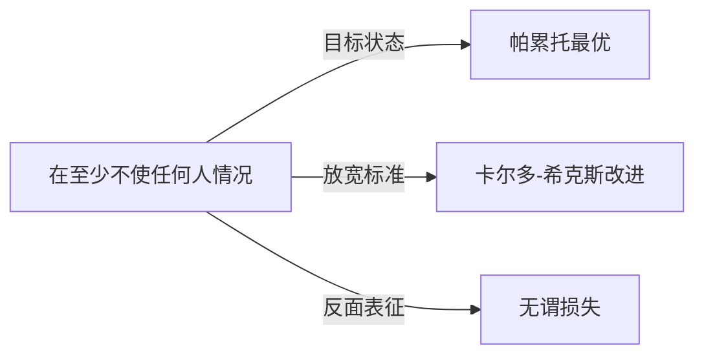

# 帕累托改进

## 定义
在至少不使任何人情况变坏的前提下，使得至少一个人情况变得更好的资源重新配置或改变。

## 核心解释
帕累托改进是判断资源配置变化是否可取的效率标准，源自帕累托最优概念。其核心内涵是“无人受损，至少一人受益”，因此只有在既有状态尚未达到帕累托最优时才存在改进空间。常见误解是将其等同于任何总福利增加的变化，但帕累托改进要求严格不出现任何个体绝对损失，即使总体收益巨大而只有极小损失，也不属于帕累托改进。

## 示例
- 两个人各自拥有对方更偏好的物品，自愿交换后双方都感觉更好，且无其他人受影响。
- 拆除一座闲置且无人反对拆除的旧建筑，改建为居民公园，原使用者未受损，周边居民受益。

## 关联概念
- [[帕累托最优]]：帕累托改进是朝向帕累托最优的路径，当不再存在帕累托改进空间时，即达到帕累托最优。
- [[卡尔多-希克斯改进]]：允许总体收益大于损失并可从赢家补偿输家，但补偿未必实际发生，是比帕累托改进更宽泛的效率标准。
- [[无谓损失]]：帕累托改进的缺失往往表现为无谓损失，即资源配置未达到帕累托最优时的福利净损失。

## 相关问题
- 帕累托改进在现实中是否常见？为什么许多政策采取卡尔多-希克斯标准而非帕累托标准？
- 如何判断一个变化是否属于帕累托改进？

## 关系图

