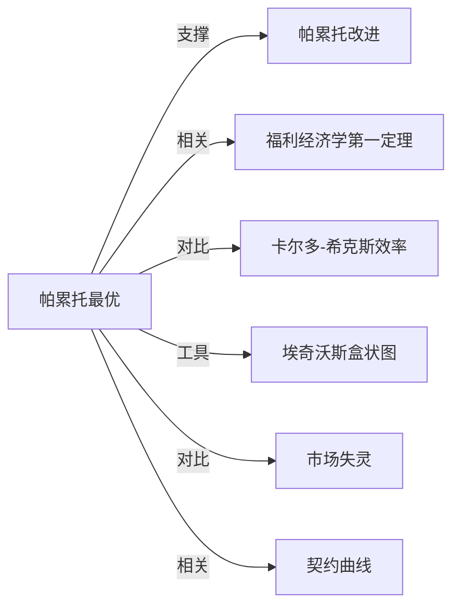

# 帕累托最优

## 定义
一种资源配置状态，其中无法通过重新分配使任何人变得更好而不让至少一个人变得更差。

## 核心解释
帕累托最优是福利经济学的核心效率判据，关注的是配置效率而非公平。关键内涵：当经济处于帕累托最优时，所有可能的互利交换与改进都已穷尽；边界在于它完全不涉及分配公平，一个极度不平等的结果也可能是帕累托最优的。常见误解是将其等同于“理想”或“公平”，其实它只保证效率，不保证合意性。

## 示例
- 两个消费者交换商品，直到没有进一步的交易能让双方都受益，此时达到消费的帕累托最优。
- 一个经济体将全部资源用于生产大炮和黄油，若不减少大炮产量就无法增加黄油产量，则生产处于帕累托最优。

## 关联概念
- [[帕累托改进]]：使至少一个人变好而不使任何人变差的改变；当帕累托改进不再可能时，即达到帕累托最优。
- [[福利经济学第一定理]]：在完全竞争市场下，竞争均衡必然是帕累托最优的。
- [[卡尔多-希克斯效率]]：一种放宽的补偿原则效率标准，允许有受损者，只要受益者理论上能补偿受损者；常用于政策分析，比帕累托最优更具操作性。
- [[埃奇沃斯盒状图]]：用于分析和展示帕累托最优配置的图形工具，契约曲线上的点均为帕累托最优。
- [[市场失灵]]：当存在外部性、公共品、不完全竞争时，市场均衡可能不再帕累托最优，为政府干预提供理由。
- [[契约曲线]]：契约曲线上的每一点都是帕累托最优配置，反之在给定禀赋下，帕累托最优集即为契约曲线。

## 相关问题
- 帕累托最优为何不能保证社会公平？
- 现实市场中哪些因素会阻碍帕累托最优的实现？
- 帕累托改进与帕累托最优在政策制定中有何应用局限性？

## 关系图

