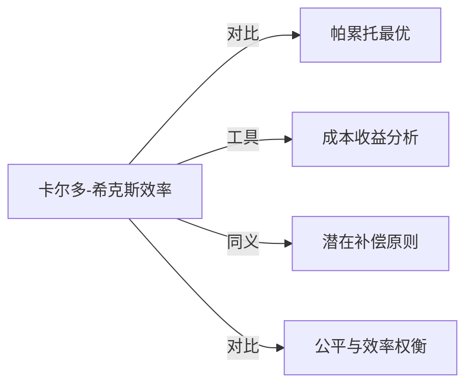

# 卡尔多-希克斯效率

## 定义
一种效率标准，认为如果一项改变使受益者获得的收益足以补偿受损者的损失，且补偿后仍有净收益，那么该改变就是有效率的，无论补偿实际上是否发生。

## 核心解释
卡尔多-希克斯效率放宽了帕累托最优中“无人受损”的严格条件，关注总收益是否超过总损失。关键内涵是潜在的补偿可能性，而非实际补偿；这使其成为成本收益分析的理论基础，常用于评估政策或项目。常见误解是把它等同于功利主义的“最大幸福”，或认为只要总收益大于总损失就一定可行，忽略了分配公平和权益保护问题。

## 示例
- 修建一条高速公路，部分居民因拆迁受损，但整体出行时间缩短和经济发展带来的收益超过拆迁成本，即使拆迁户未获全额补偿，也满足卡尔多-希克斯改进。
- 放松行业管制，原有垄断企业利润下降，但消费者剩余增加超过企业损失，即使企业未得到补偿，整体效率提升。

## 关联概念
- [[帕累托最优]]：帕累托效率要求无人受损且至少有一人受益；卡尔多-希克斯效率仅需潜在补偿，是更宽松的效率标准。
- [[成本收益分析]]：卡尔多-希克斯效率是成本收益分析的理论支柱，用以判断项目或政策的社会总收益是否超过总成本。
- [[潜在补偿原则]]：卡尔多-希克斯效率的核心就是潜在的补偿原则，即只要赢家能够补偿输家，就视为改进。
- [[公平与效率权衡]]：该标准常引发公平性批评，因为它在缺乏实际补偿的情况下可能加剧分配不均。

## 相关问题
- 卡尔多-希克斯效率与帕累托效率的关键区别是什么？
- 为什么实际补偿可以不发生仍被视为效率改进？
- 卡尔多-希克斯标准在政策评估中有哪些局限性？
- 如何用卡尔多-希克斯效率分析环境管制？

## 关系图

