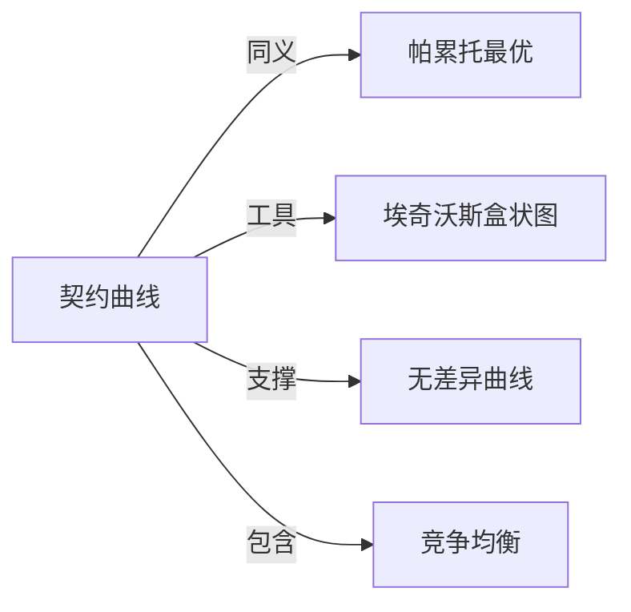

# 契约曲线

## 定义
在埃奇沃斯盒状图中，表示两种商品在两个消费者之间所有帕累托有效分配的点的轨迹，即双方无差异曲线切点的连线。

## 核心解释
契约曲线刻画了双方在交换经济中所有不可能在不损害一方的情况下改善另一方的资源配置。处于曲线上的点都实现了交换的帕累托最优，而曲线外的点则存在互利交换的余地。最终会在曲线的哪一点达成交易，取决于双方的初始禀赋与讨价还价能力。常见误解是将其等同于完全竞争市场下唯一的价格均衡线，实际上契约曲线包含所有可能的有效结果，而竞争均衡只是其上由价格机制决定的特定点。

## 示例
- 在只有苹果和橙子的两人经济中，若甲偏爱苹果、乙偏爱橙子，契约曲线会从甲多乙少延伸到甲少乙多的各类组合，曲线上的点无法再通过重新分配让两人同时变好。
- 在劳动力市场的潜在博弈中，契约曲线可能表示工资与劳动时间的有效组合，任何离开曲线的组合都意味着存在未利用的互利空间。

## 关联概念
- [[帕累托最优]]：契约曲线上的每一点都是帕累托最优配置，反之在给定禀赋下，帕累托最优集即为契约曲线。
- [[埃奇沃斯盒状图]]：契约曲线是绘制在埃奇沃斯盒状图中，通过两人无差异曲线的切点推导出来的轨迹。
- [[无差异曲线]]：契约曲线源自双方无差异曲线相切的点的集合，其切线斜率（边际替代率）相等。
- [[竞争均衡]]：在完全竞争市场中，竞争均衡点必然位于契约曲线上，但契约曲线上的点不一定都是竞争均衡结果。

## 相关问题
- 为什么契约曲线上的点都是帕累托有效的？
- 初始禀赋如何影响最终落在契约曲线上的哪个点？
- 契约曲线与效用可能性边界有何联系？
- 在生产经济中是否存在类似的契约曲线？

## 关系图

