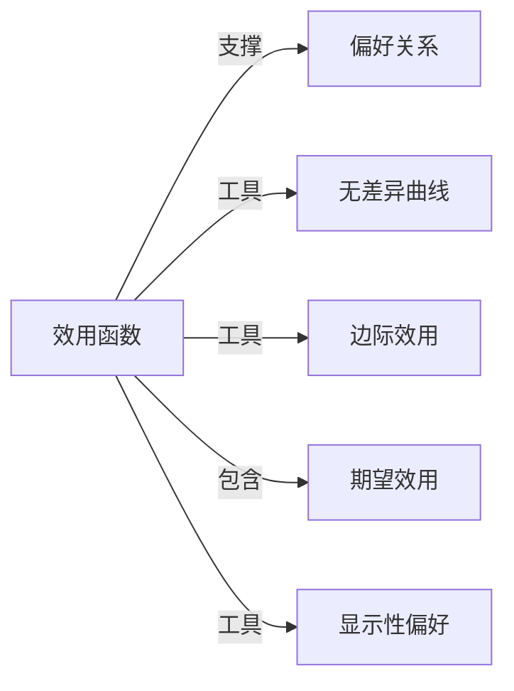

# 效用函数

## 定义
一种数学函数，将决策者对不同选项的偏好程度映射为实数值，数值越高表示偏好越强。

## 核心解释
效用函数是经济学和决策理论的核心建模工具，用于描述个体的理性选择行为。它并不直接测量幸福感，而是反映选择之间的排序关系。常见误解是将效用等同于可度量的心理满足感，但在标准序数效用理论中，只有相对次序有意义，数值的绝对大小和差值无实质含义。效用函数的存在性依赖于偏好的完备性和传递性等公理。

## 示例
- 消费者在预算约束下选择商品组合，使效用函数达到最大，如 U(苹果, 香蕉) = 苹果^0.5 * 香蕉^0.5。
- 投资者在不确定情境下比较不同资产的期望效用，如选择期望效用更高的股票或债券组合。

## 关联概念
- [[偏好关系]]：效用函数是对偏好关系的数值表示，理性偏好是效用函数存在的前提。
- [[无差异曲线]]：效用函数在二维平面的等值线，曲线上所有点效用相等。
- [[边际效用]]：增加一单位商品带来的效用增量，常用于解释边际效用递减规律。
- [[期望效用]]：在风险条件下，将效用函数与概率结合，构成期望效用理论的基础。
- [[显示性偏好]]：通过观察实际选择反推效用函数，不依赖主观效用报告。

## 相关问题
- 基数效用与序数效用的关键区别是什么？
- 如何在给定偏好关系下构造一个效用函数？
- 效用函数是否一定存在？哪些条件会破坏其存在性？
- 期望效用理论面临的主要挑战有哪些？

## 关系图

