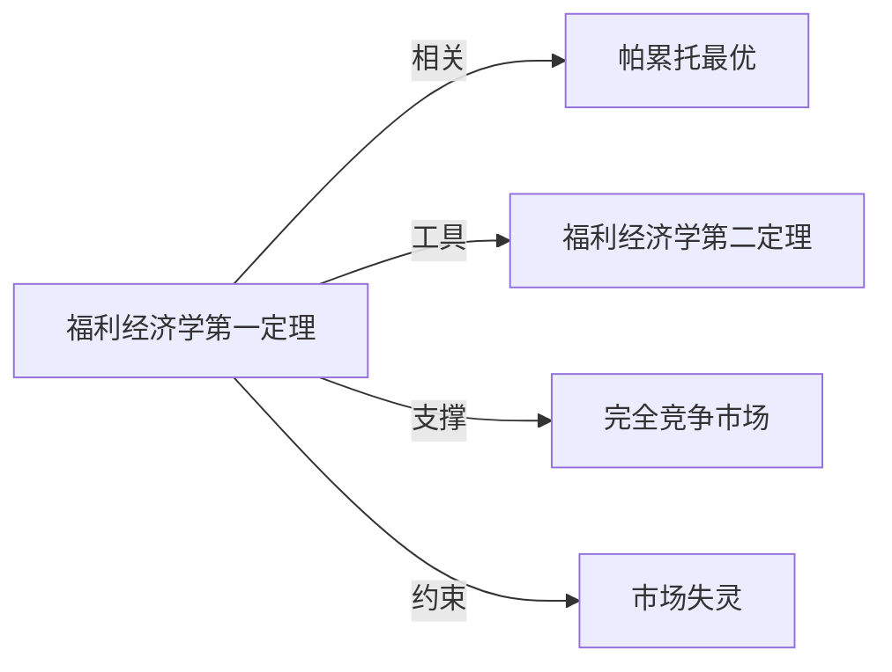

# 福利经济学第一定理

## 定义
福利经济学第一定理：在完全竞争市场中，均衡配置是帕累托最优的。

## 核心解释
该定理表明，如果市场满足完全竞争的一系列条件（如个体是价格接受者、没有外部性、没有公共物品、完全信息、偏好和生产技术是凸的等），那么由供需竞争自发形成的均衡结果，不存在任何能使至少一人变好而不使其他人变坏的改进余地。它用经济学逻辑为“看不见的手”提供了形式化支撑，但其边界十分严格：它只保证效率，不涉及公平分配；现实中的市场失灵（外部性、不完全竞争、信息不对称等）会使该结论不成立。常见误解是把帕累托最优等同于“好”或“公平”，而定理本身毫无伦理判断。

## 示例
- 在一个满足完全竞争假设的小麦市场，生产者按边际成本定价，消费者按边际效用支付，最终的产量和价格使得任何增产或减产的调整都无法在无人受损的前提下让某人得益。
- 如果没有空气污染的外部性，完全竞争的电力市场均衡也是帕累托最优的，但一旦考虑污染的外部成本，该均衡就不再帕累托最优，定理前提被破坏。

## 关联概念
- [[帕累托最优]]：福利经济学第一定理直接断言竞争均衡落在帕累托最优状态，帕累托最优是评价配置效率的基准概念。
- [[福利经济学第二定理]]：第二定理指出通过适当的禀赋再分配，任何帕累托最优配置都可以由竞争市场实现，关注公平与效率的分离；第一定理只管效率。
- [[完全竞争市场]]：定理成立所需的市场结构假设，包括大量价格接受者、同质产品、自由进入退出等。
- [[市场失灵]]：当存在外部性、公共物品、信息不对称、垄断势力等偏离完全竞争的因素时，定理的结论不成立，这构成了政府干预的可能理由。

## 相关问题
- 福利经济学第一定理需要哪些关键假设？
- 为什么第一定理只保证效率而不保证公平？
- 第一定理与亚当·斯密“看不见的手”有何具体关系？
- 现实中有哪些情形直接违反了第一定理的条件？
- 福利经济学第二定理如何补充第一定理的不足？

## 关系图

