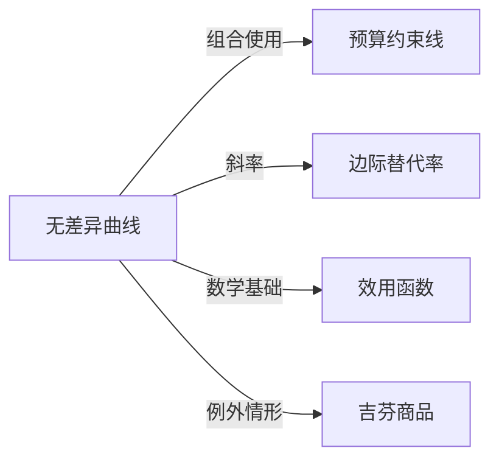

# 无差异曲线

## 定义
无差异曲线是微观经济学中表示给消费者带来同等效用水平的两种商品不同数量组合的点的轨迹。

## 核心解释
无差异曲线基于偏好完备性、传递性和非饱和性假设，通常凸向原点，边际替代率递减。同一条无差异曲线上的任意组合对消费者无差异，更高的曲线代表更高的效用水平。它只反映序数效用，不反映效用绝对值，且不涉及价格与收入。常见误解是将两条不同的无差异曲线相交，这违反了偏好的传递性。

## 示例
- 10单位食物和5单位衣服与8单位食物和7单位衣服在同一条无差异曲线上，表示两种组合带来的满足感相同
- 消费者在苹果和香蕉间的无差异曲线凸向原点，表明随着苹果消费增加，愿意放弃的香蕉数量逐渐减少

## 关联概念
- [[预算约束线]]：与无差异曲线相切确定消费者均衡，表示给定收入和价格下的最优消费组合
- [[边际替代率]]：无差异曲线斜率的绝对值，衡量消费者愿意用一种商品替代另一种商品的比率
- [[效用函数]]：无差异曲线是效用函数在给定效用水平下的等值线
- [[吉芬商品]]：吉芬商品的特殊性会破坏标准无差异曲线分析中需求定律的推论

## 相关问题
- 为什么无差异曲线不能相交？
- 无差异曲线凸向原点的经济含义是什么？
- 边际替代率递减与无差异曲线形状的关系是什么？
- 如何从无差异曲线推导需求曲线？

## 关系图

