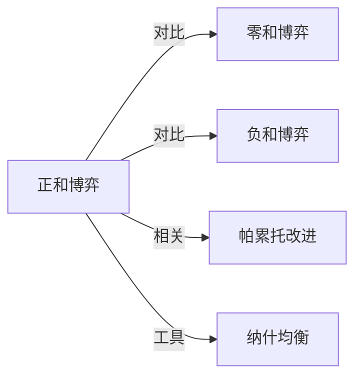

# 正和博弈

## 定义
正和博弈是指参与者通过合作或策略互动，使得整体利益总和增加的博弈，即一方的收益不必以另一方的等量损失为代价，总得益大于零。

## 核心解释
正和博弈的核心在于价值创造，参与者的利益可以同时得到改善，整体“蛋糕”能够做大。它与零和博弈根本不同：零和博弈中一方所得必为另一方所失，总和不变；正和博弈中合作、创新或交易可带来新增收益。常见误解是将所有非对抗性博弈都当作正和博弈，但正和需满足总收益净增，而非仅双方皆赢（双赢可能是负和背景下的相对改善）。区分的边界在于资源或价值是否在互动后发生了本质扩张，而不仅仅是重新分配。

## 示例
- 两个国家通过自由贸易协定，各自发挥比较优势，使两国总产出和消费水平均高于闭关自守时。
- 企业间的研发合作联盟，通过共享技术与专利，创造出单打独斗无法实现的新产品或市场。

## 关联概念
- [[零和博弈]]：零和博弈中总收益固定，一方的增益必然来自另一方的损失，与正和博弈的总收益增加形成鲜明对比。
- [[负和博弈]]：负和博弈中互动导致总收益减少，如恶性竞争或冲突，整体利益受损。
- [[帕累托改进]]：正和博弈的结果通常是一种帕累托改进，即至少有一方情况变好，而无任何一方情况变差。
- [[纳什均衡]]：在非合作博弈中，即使存在正和可能，个体理性可能导致非最优的纳什均衡，如囚徒困境，揭示了实现正和结果需要机制设计或合作约束。

## 相关问题
- 正和博弈与帕累托改进是什么关系？
- 现实中哪些因素阻碍正和博弈的实现？
- 如何设计激励制度来促成正和博弈？
- 双赢一定意味着整体利益的增长吗？

## 关系图

