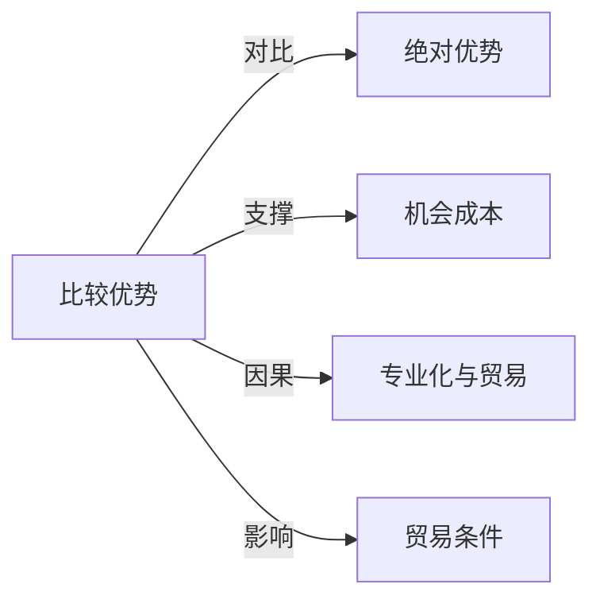

# 比较优势

## 定义
即使一个国家在生产所有商品上都比另一国更有效率（绝对劣势），仍可通过专门生产并出口其机会成本相对较低的商品来从贸易中获益。

## 核心解释
比较优势的核心不是比谁做得更好（绝对优势），而是比谁放弃得更少（机会成本）。一国在某种商品生产上的机会成本低于另一国，则在该商品上具有比较优势。边界在于：它假设要素流动、无运输成本等，现实中有摩擦。常见误解是将它与绝对优势混淆，误以为只有效率领先才能贸易。

## 示例
- 律师打字速度也快于秘书，但律师专门从事法律服务，秘书专门打字，总产出更高——因为律师打字的单位机会成本是放弃的高额法律收入。
- 若甲国生产1单位粮食需放弃0.5单位布匹，乙国生产1单位粮食需放弃2单位布匹，则甲国在粮食生产上有比较优势，双方贸易可互利。

## 关联概念
- [[绝对优势]]：完全使用更少资源生产某种商品的优势，是比较优势理论的前提背景，常被混淆。
- [[机会成本]]：比较优势由两种商品生产机会成本的相对差异决定。
- [[专业化与贸易]]：依据比较优势进行专业化分工并进行交换，是获得贸易利益的核心逻辑。
- [[贸易条件]]：国际交换比率落在两国国内机会成本之间时，双方均能从比较优势贸易中获益。

## 相关问题
- 比较优势和绝对优势的根本区别是什么？
- 如何计算某种商品的比较优势？
- 如果一国的比较优势长期集中在低端产业，是否可能陷入‘比较优势陷阱’？
- 比较优势理论能解释服务贸易和数字贸易吗？

## 关系图

