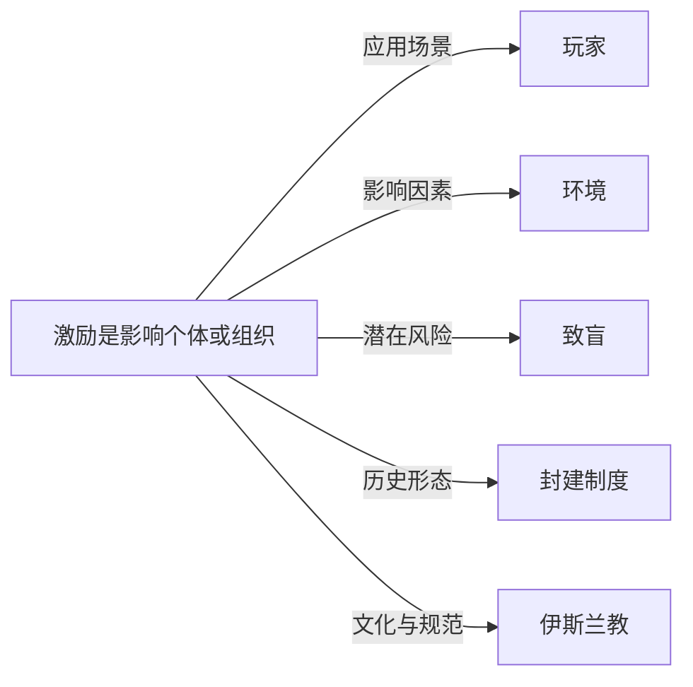

# 激励

## 定义
激励是影响个体或组织行为选择的因素，通过改变预期收益或成本来引导特定行动。

## 核心解释
激励的核心在于调整行为后果以影响决策，分为正向激励（奖励）和负向激励（惩罚），也可分为内在激励（来自活动本身的满足感）和外在激励（外部奖励）。关键原则包括激励相容（各方利益一致）和避免激励扭曲（目标错位）。常见误解是将激励等同于金钱奖励，实际上激励也包括情感、社会认同等非经济因素。

## 示例
- 销售人员的提成制度促使其更努力地达成交易
- 碳排放税提高污染成本，激励企业采用清洁技术

## 关联概念
- [[玩家]]：在游戏设计与博弈论中，玩家行为由激励结构塑造，如成就系统或收益矩阵。
- [[环境]]：制度与社会环境决定可用的激励工具及其效果，如市场环境中的价格信号。
- [[致盲]]：激励致盲指追求特定指标时忽略更广泛的目标或风险，如为短期利润牺牲长期安全。
- [[封建制度]]：封建制度以土地分封和封建义务为激励，维系领主与封臣的军事与忠诚关系。
- [[伊斯兰教]]：伊斯兰经济中基于风险共担与禁止利息的利润分享模式提供独特的商业激励。

## 相关问题
- 如何设计激励机制以避免目标错位？
- 内在激励和外在激励如何相互影响？
- 什么是激励相容？它在机制设计中有何作用？

## 关系图

