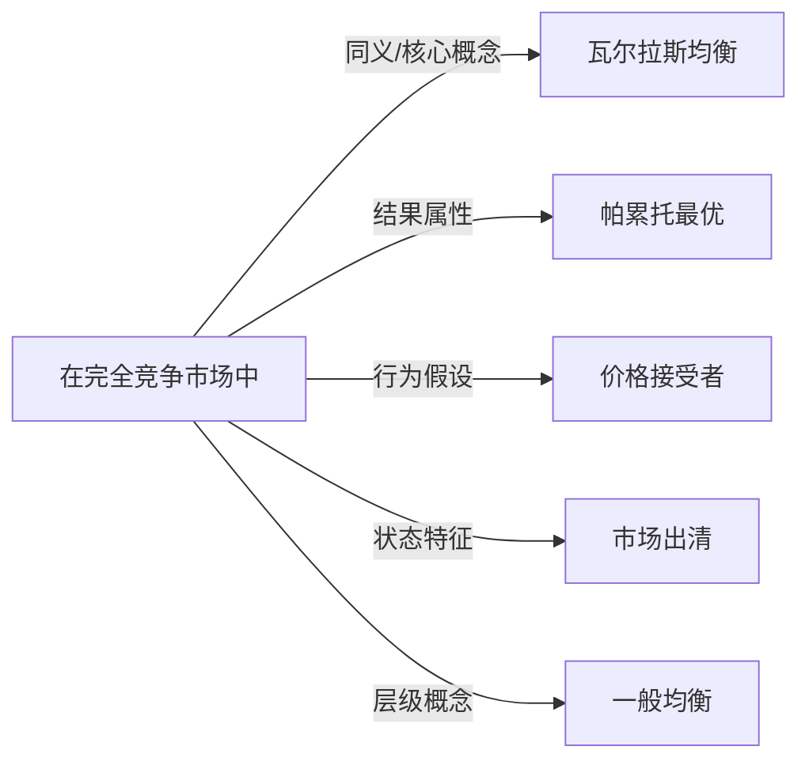

# 竞争均衡

## 定义
在完全竞争市场中，所有商品和服务的供给与需求同时达到平衡，每个经济主体在给定价格下实现了最优选择的状态。

## 核心解释
竞争均衡是市场一般均衡的核心形式。它假定所有参与者都是价格接受者，在既定的市场价格下最大化自己的效用（消费者）或利润（生产者），最终形成一组价格，使得每种商品的供给量与需求量相等。关键边界在于其依赖完全竞争、信息完全、无外部性等严格假设。常见误解是将任何市场出清都视为竞争均衡，实际上不完全竞争市场的均衡（如垄断、寡头）不属于竞争均衡。

## 示例
- 一个只有面包和牛奶的简单经济中，面包和牛奶的价格同时调整到消费者愿意购买的总量等于生产者愿意出售的总量。
- 在埃奇沃思盒状图中，初始禀赋点经由价格调整最终落在契约曲线上，且预算线穿过初始禀赋点与两条无差异曲线同时相切的点。

## 关联概念
- [[瓦尔拉斯均衡]]：竞争均衡的数学形式化表述，由莱昂·瓦尔拉斯提出，指一组价格使所有市场同时出清。
- [[帕累托最优]]：在满足某些条件（如无外部性）时，竞争均衡必定达到帕累托最优，这一关系由福利经济学第一定理刻画。
- [[价格接受者]]：竞争均衡的前提是市场中所有个体都是价格接受者，无法单方面影响市场价格。
- [[市场出清]]：竞争均衡要求所有市场同时出清，即供给等于需求，不存在超额供给或超额需求。
- [[一般均衡]]：竞争均衡是一般均衡的一种具体形式，一般均衡考虑所有市场的相互联系，不限定市场结构。

## 相关问题
- 竞争均衡与局部均衡有什么区别？
- 竞争均衡是否一定帕累托最优？
- 哪些条件会导致竞争均衡无法实现？
- 竞争均衡和纳什均衡有什么关系？
- 如何证明竞争均衡的存在性？

## 关系图

