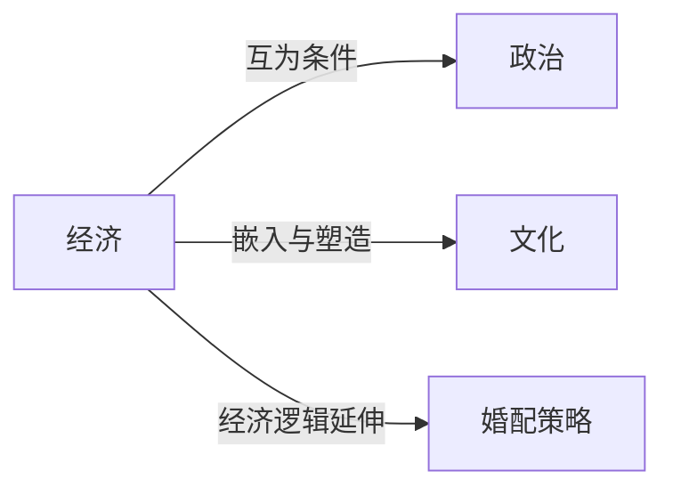

# 经济

## 定义
经济是人类社会在稀缺资源条件下，通过生产、分配、交换和消费来满足需求的组织与活动体系。

## 核心解释
经济的核心内涵是资源稀缺与选择，涉及个体与集体如何在有限手段中安排目标。它不仅是金钱与市场，更包含非正式交换、家庭劳动和公共品。常见误解是将经济等同于钱或GDP，而忽略制度、文化、权力等深层结构。

## 示例
- 一个家庭决定将收入分配于食品、住房和教育之间，就是微观经济决策。
- 沙特阿拉伯通过石油出口换取外汇并发展其他产业，体现了资源禀赋对一国经济结构的影响。

## 关联概念
- [[政治]]：政治设定产权的规则和分配冲突的框架，经济则创造可供分配的资源并塑造政治博弈的利益格局。
- [[文化]]：文化通过信任、规范、消费偏好等影响经济行为，经济变迁也缓慢重塑文化的物质基础。
- [[婚配策略]]：婚姻市场中的选择常隐含着资源合并、风险分担与地位交易等经济理性。

## 相关问题
- 经济与政治在制度变迁中如何相互作用？
- 非市场化的经济活动（如家务、礼物交换）为什么也是经济分析的对象？

## 关系图

