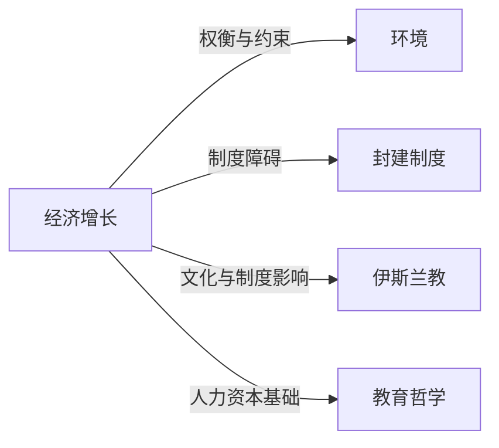

# 经济增长

## 定义
一个国家或地区在一定时期内生产的产品和劳务总量的持续增加，通常用实际国内生产总值（GDP）或人均GDP的增长率衡量。

## 核心解释
经济增长关注的是经济体生产能力的长期扩张，其核心内涵是生产可能性边界的向外推移，而非单纯的货币现象或短期波动。关键边界在于：增长不等于发展，后者包含分配、结构优化等更广维度；增长可能伴随资源消耗与环境压力。常见误解是将资产价格膨胀或单纯货币增发视为增长，但真正的增长必须体现为实际产出和实际收入的提高。

## 示例
- 中国在改革开放后连续多年保持约10%的GDP增长率，使数亿人摆脱贫困。
- 19世纪工业革命期间，英国依靠技术进步和资本积累实现了人均产出的持续攀升。

## 关联概念
- [[环境]]：经济增长常常以自然资源消耗和环境质量退化为代价，引出可持续发展议题。
- [[封建制度]]：封建制度下土地所有权集中和人身依附关系抑制了劳动流动和技术创新，长期阻碍现代意义上的经济增长。
- [[伊斯兰教]]：伊斯兰金融和产权的特定规则在中古时期曾支持商业扩张，但在不同历史条件下对资本积累和增长产生过不同影响。
- [[教育哲学]]：教育哲学引导人力资本投资的方向与质量，而人力资本是内生增长理论中持续增长的关键动力。

## 相关问题
- 为什么有些国家长期陷入低增长陷阱？
- 经济增长与收入不平等之间是何种关系？
- 技术进步如何转变为持续的经济增长？

## 关系图

