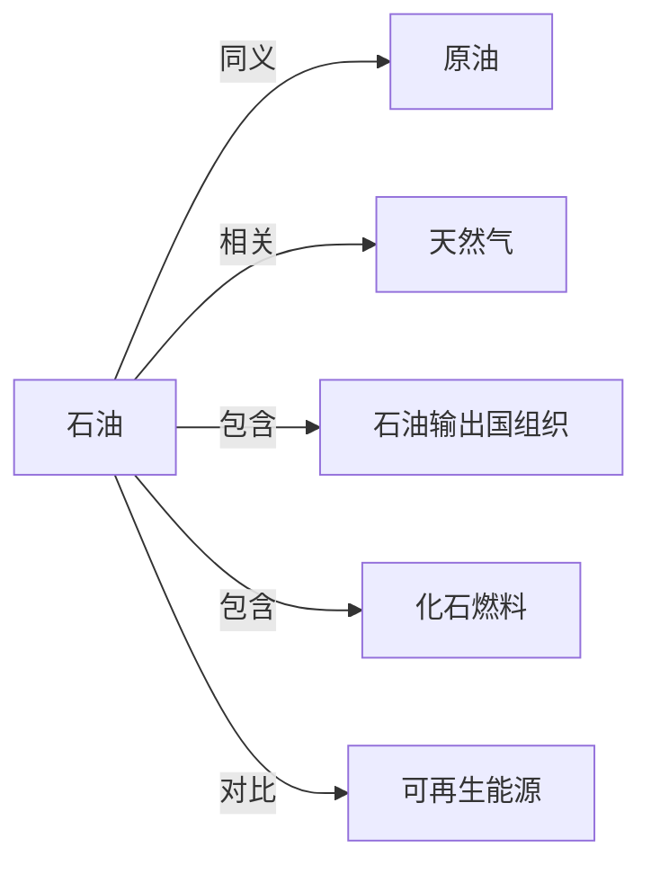

# 石油

## 定义
石油是一种天然形成的、以液态碳氢化合物为主的复杂混合物，埋藏于地下岩石孔隙中，是极为重要的化石能源和化工原料。

## 核心解释
石油主要由古代水生微生物和藻类在缺氧环境下经热演化而成，并非普通动物遗骸。它通过钻井开采，经炼制得到汽油、柴油、化工原料等。作为不可再生资源，石油的分布不均衡，其供应与价格深刻影响全球政治、经济格局。常见的误解是将石油直接等同于汽油，实际上原油需经过复杂的炼制过程；另常误以为石油形成与恐龙有关，其实主要来源是更微小的浮游生物。

## 示例
- 沙特阿拉伯的加瓦尔油田是世界上最大的陆上油田，其探明储量长期位居全球第一。
- 1973年石油危机中，阿拉伯产油国对西方实施禁运，导致油价暴涨，引发全球经济衰退。

## 关联概念
- [[原油]]：刚从地下采出、未经炼制的石油，是石油最常见的商品形态。
- [[天然气]]：常与石油共生，同属化石燃料，化学成分以甲烷为主。
- [[石油输出国组织]]：石油输出国组织，协调成员国石油政策，对全球石油供应和价格有重大影响。
- [[化石燃料]]：石油与煤、天然气并列为三大化石燃料，是古代生物遗骸转化而来的不可再生能源。
- [[可再生能源]]：如太阳能、风能等，被视为石油的替代品，以应对资源枯竭和气候变化。

## 相关问题
- 石油是怎么形成的，为什么主要在中东地区富集？
- 石油价格受哪些关键因素影响？
- 什么是峰值石油理论，它现在还有效吗？
- 石油除了作为燃料，还有哪些化工用途？

## 关系图

