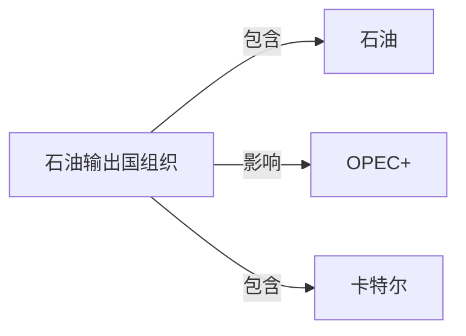

# 石油输出国组织

## 定义
石油输出国组织（OPEC）是协调和统一成员国石油政策、保障石油收入稳定的政府间国际组织。

## 核心解释
主要目标是协调产量以稳定油价、保障成员国石油收入。其决策通过产量配额影响市场，但受非成员国产量、全球需求变化和新能源发展等制约。常见误解是将OPEC视为绝对的垄断卡特尔，实际上其控制力有限，且内部存在利益分歧。

## 示例
- 1973年OPEC对支持以色列的国家实施石油禁运，导致国际油价飙升，引发石油危机。
- 2016年起OPEC与俄罗斯等非成员国形成OPEC+，协调联合减产以应对页岩油带来的价格压力。

## 关联概念
- [[石油]]：OPEC成员国出口和协调产量的核心自然资源。
- [[OPEC+]]：包括俄罗斯等10个非OPEC产油国在内的联合减产对话平台。
- [[卡特尔]]：OPEC常被经济学界称作产油国卡特尔，但其约束力和市场份额并未达到完全垄断。

## 相关问题
- OPEC如何通过产量决策影响国际油价？
- 为什么OPEC常被批评为卡特尔？
- OPEC+与OPEC有何区别？

## 关系图

