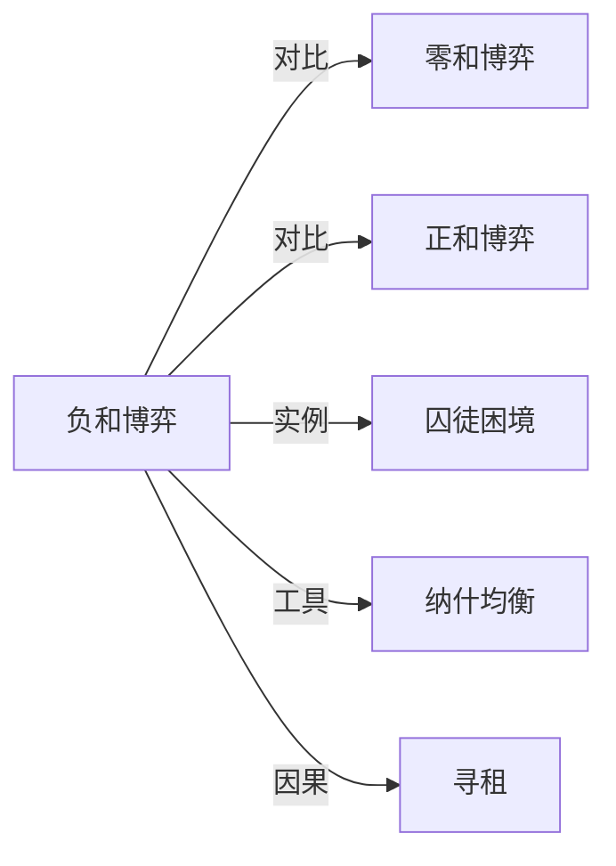

# 负和博弈

## 定义
参与者总收益为负的博弈，即各方得失相抵后整体出现净损失，所有参与者或多数参与者的处境反而更差。

## 核心解释
负和博弈强调互动结果使"蛋糕"变小：冲突、战争、恶性价格战、军备竞赛等都会消耗资源而未必产生等值收益。它与零和博弈（一方所得恰为另一方所失）的区别在于总量变化；与正和博弈（合作创造增量）相对。负和博弈中即使个别参与者"赢"了，其收益通常也不足以弥补整体或长期的损失。常见误解是把它等同于零和博弈，实际上负和博弈的总和小于零，意味着没有赢家或赢家所得远小于整体消耗。

## 示例
- 两国陷入军备竞赛，双方持续增加军费却谁也没有获得更安全的结果，整体福利净损失。
- 两家企业恶性降价竞争，利润被完全消耗，行业总利润低于正常竞争水平。
- 破坏性冲突中双方伤亡与重建成本远超任何一方可能获得的利益。

## 关联概念
- [[零和博弈]]：一方所得恰为另一方所失、总量不变的博弈，是理解负和博弈的对照基准。
- [[正和博弈]]：通过合作创造新增量、整体收益为正的博弈，与负和博弈构成光谱两端。
- [[囚徒困境]]：双方理性选择导致整体更差的典型负和结果，说明个体理性与集体理性冲突。
- [[纳什均衡]]：负和结果往往是一种纳什均衡——单方面改变策略无法改善，因而难以自发走出。
- [[寻租]]：寻租竞争消耗资源却不创造价值，使社会整体收益趋近于负和。

## 相关问题
- 负和博弈与零和博弈的本质区别是什么？
- 为什么理性的参与者会陷入负和博弈？
- 如何通过制度设计把负和博弈转化为正和博弈？
- 哪些日常社会情境可以用负和博弈解释？

## 关系图

