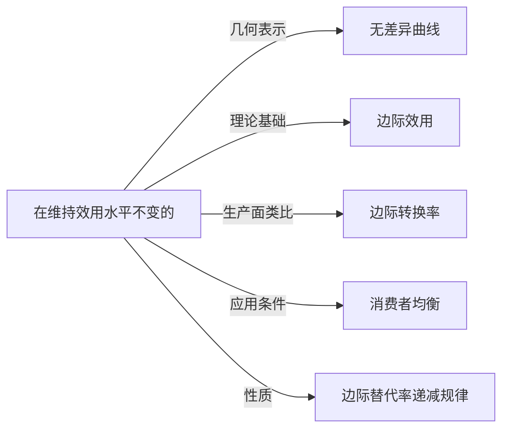

# 边际替代率

## 定义
在维持效用水平不变的前提下，消费者增加一单位某种商品的消费时，所愿意放弃的另一种商品的消费数量。

## 核心解释
边际替代率衡量消费者在两种商品间的主观取舍意愿。其几何含义是无差异曲线某点切线斜率的绝对值。核心内涵是它反映消费者对两种商品的相对边际评价，且通常随一种商品消费量增加而递减（边际替代率递减规律）。常见误解是将边际替代率等同于客观市场价格比率，实际上前者由主观偏好决定，后者由市场决定，只有在消费者均衡时二者才相等。

## 示例
- 某消费者愿用3个苹果换1个梨且效用不变，则苹果对梨的边际替代率为3。
- 消费组合从(2,10)移动到(3,7)时总效用不变，增加第3个单位商品1时愿意放弃3个单位商品2，此时边际替代率为3。

## 关联概念
- [[无差异曲线]]：边际替代率即为无差异曲线上某点切线斜率的绝对值，二者共同刻画消费者偏好。
- [[边际效用]]：在基数效用论下，两种商品的边际替代率等于二者边际效用之比。
- [[边际转换率]]：边际替代率是消费端的取舍率，边际转换率是生产端的取舍率，两者相等是帕累托最优条件之一。
- [[消费者均衡]]：在消费者均衡点，边际替代率等于两种商品的价格之比。
- [[边际替代率递减规律]]：随着一种商品消费量增加，消费者为获得额外一单位该商品而愿意放弃的另一种商品数量递减。

## 相关问题
- 边际替代率为什么通常是递减的？
- 边际替代率与边际效用之间有什么数量关系？
- 完全替代品和完全互补品的边际替代率各有什么特点？
- 消费者均衡条件如何用边际替代率表示？

## 关系图

