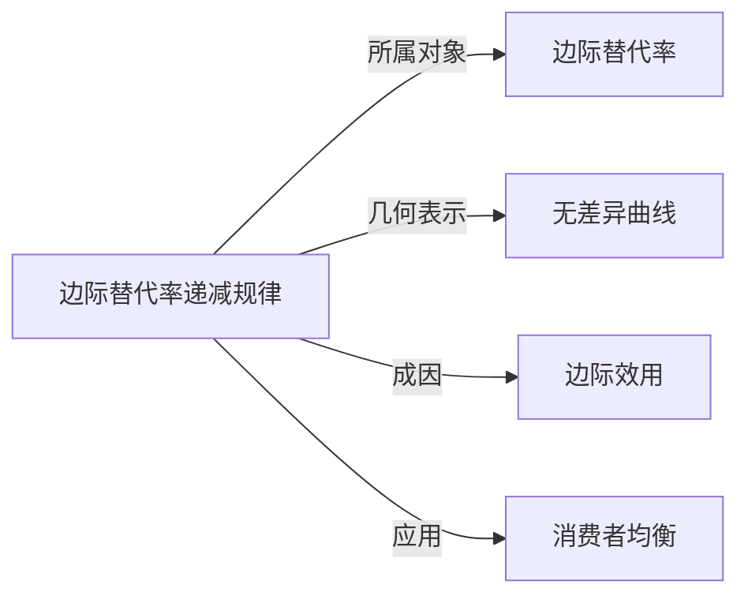

# 边际替代率递减规律

## 定义
在维持效用水平不变的前提下，随着一种商品消费量的增加，消费者为获得额外一单位该商品而愿意放弃的另一种商品数量递减。

## 核心解释
该规律使无差异曲线凸向原点，其经济学成因是边际效用递减：某商品越充足，其额外一单位的相对价值越低。它是推导消费者均衡与需求曲线的基础；完全替代品等特殊偏好下该规律不成立。

## 示例
- 口渴时第一杯水愿意用很多可乐交换，随着水越喝越饱，愿意放弃的可乐数量越来越少。
- 无差异曲线凸向原点，正是边际替代率递减规律的几何表现。

## 关联概念
- [[边际替代率]]：递减规律描述的是边际替代率随消费量增加而变化的方向。
- [[无差异曲线]]：无差异曲线凸向原点即该规律的几何表示。
- [[边际效用]]：边际效用递减是该规律的经济学成因。
- [[消费者均衡]]：消费者均衡的推导以该规律成立为前提。

## 相关问题
- 为什么无差异曲线凸向原点？
- 完全互补品与完全替代品的边际替代率有何不同？

## 关系图

