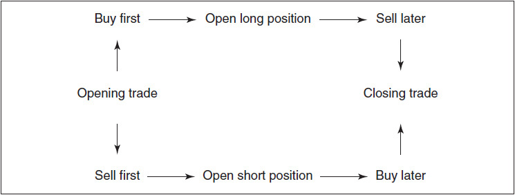
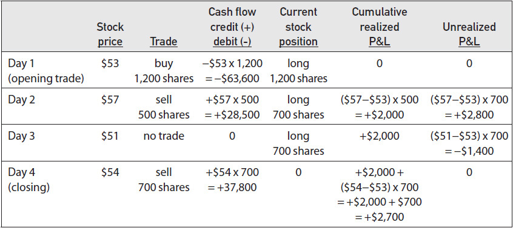
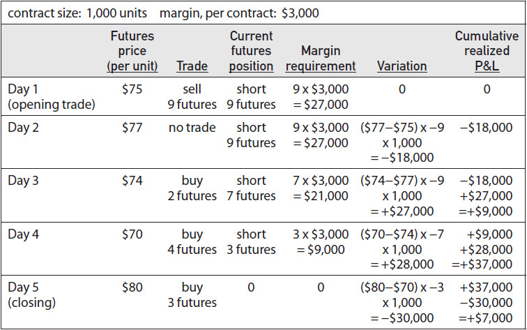
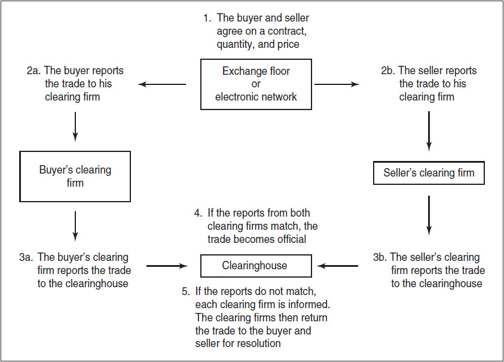

# 第1章 金融合约 / Financial Contracts

[[90-阅读导航|← 返回阅读导航]] · [[91-翻译说明与术语表|术语表]]

> [!warning] 翻译状态
> 本章为机器初译，并使用本地术语表校验。英文原文、数字、公式和图表用于核对；中文将在后续复核中继续修订。

<!-- chapter-toc:start -->
## 本章目录 / Chapter Outline

> [!abstract] 结构导航
> 以下标题按原书顺序保留；点击可直接跳转。

- [[#买卖 / Buying and Selling|买卖 / Buying and Selling]]
- [[#远期合约的名义价值 / Notional Value of a Forward Contract|远期合约的名义价值 / Notional Value of a Forward Contract]]
- [[#结算程序 / Settlement Procedures|结算程序 / Settlement Procedures]]
- [[#市场健全性 / Market Integrity|市场健全性 / Market Integrity]]
<!-- chapter-toc:end -->
<!-- chapter-nav:start -->
> [!tip] 章节导航（章首）
> [[90-阅读导航|全书导航]] · [[02-远期定价 Forward Pricing|下一章 →]]
<!-- chapter-nav:end -->
> [!quote]- English 1
> My friend Jerry lives in a small town, the same town in which he was born and raised. Because Jerry’s parents are no longer alive and many of his friends have left, he is seriously thinking of packing up and moving to a larger city. However, Jerry recently heard that there is a plan to build a major highway that will pass very close to his hometown. Because the highway is likely to bring new life to the town, Jerry is reconsidering his decision to move away. It has also occurred to Jerry that the highway may bring new business opportunities.

我的朋友杰里住在一个小镇，他就是在同一个小镇出生和长大的。由于杰里的父母去世了，他的许多朋友也离开了，他正在认真考虑收拾行李搬到一个更大的城市。然而，杰里最近听说有一项计划要修建一条主要高速公路，该高速公路将通过他的家乡非常近。由于高速公路可能会给小镇带来新的活力，杰里正在重新考虑搬走的决定。杰里也想到，高速公路可能会带来新的商业机会。

> [!quote]- English 2
> For many years, Jerry’s family was in the restaurant business, and Jerry is thinking of building a restaurant at the main intersection leading from the highway into town. If Jerry does decide to build the restaurant, he will need to acquire land along the highway. Fortunately, Jerry has located a plot of land, currently owned by Farmer Smith, that is ideally suited for the restaurant. Because the land does not seem to be in use, Jerry is hoping that Farmer Smith might be willing to sell it.

多年来，杰里的家人一直从事餐饮业，杰里正在考虑在从高速公路通往城镇的主要十字路口建一家餐厅。如果杰里真的决定建造餐厅，他将需要沿着高速公路购买土地。幸运的是，杰里找到了一块目前归史密斯农夫所有的土地，非常适合这家餐厅。由于土地似乎没有被使用，杰里希望史密斯农夫愿意出售它。

> [!quote]- English 3
> If Farmer Smith is indeed willing to sell, how can Jerry acquire the land on which to build his restaurant? First, Jerry must find out how much Farmer Smith wants for the land. Let’s say \$100,000. If Jerry thinks that the price is reasonable, he can agree to pay this amount and, in return, take ownership of the land. In this case, Jerry and Farmer Smith will have entered into a *spot* or *cash transaction*.

如果史密斯农夫确实愿意出售，杰里如何才能获得建造餐厅的土地呢？首先，杰里必须弄清楚史密斯农夫对土地的需求有多少。假设10万美元。如果杰里认为价格合理，他可以同意支付这笔金额，并作为回报，获得土地的所有权。在这种情况下，杰里和史密斯农夫将进行现货或现金交易。

> [!quote]- English 4
> In a cash transaction, both parties agree on terms, followed immediately by an exchange of money for goods. The trading of stock on an exchange is usually considered to be a cash transaction: the buyer and seller agree on the price, the buyer pays the seller, and the seller delivers the stock. The actions essentially take place simultaneously. (Admittedly, on most stock exchanges, there is a settlement period between the time the price is agreed on and the time the stock is actually delivered and payment is made. However, the settlement period is relatively short, so for practical purposes most traders consider this a cash transaction.)

在现金交易中，双方先议定条款，随后立即以货款交换商品。交易所中的股票买卖通常被视为现金交易：买卖双方商定价格，买方向卖方付款，卖方交付股票，这些行为实质上同时发生。（诚然，多数证券交易所从成交到实际交付股票、完成付款之间存在一个结算期；但这个期间相对较短，因此在实务中，多数交易者仍将其视为现金交易。）

> [!quote]- English 5
> However, it has also occurred to Jerry that it will probably take several years to build the highway. Because Jerry wants the opening of his restaurant to coincide with the opening of the highway, he doesn’t need to begin construction on the restaurant for at least another year. There is no point in taking possession of the land right now—it will just sit unused for a year. Given his construction schedule, Jerry has decided to approach Farmer Smith with a slightly different proposition. Jerry will agree to Farmer Smith’s price of \$100,000, but he will propose to Farmer Smith that they complete the transaction in one year, at which time Farmer Smith will receive payment, and Jerry will take possession of the land. If both parties agree to this, Jerry and Farmer Smith will have entered into a *forward contract*. In a forward contract, the parties agree on the terms now, but the actual exchange of money for goods does not take place until some later date, the *maturity* or *expiration date*.

不过，杰里也想到，公路可能要几年才能建成。他希望餐厅与公路同时开业，因此至少一年后才需要动工。现在取得土地没有意义，因为它只会闲置一年。根据施工安排，杰里向史密斯农夫提出另一种方案：他接受 100,000 美元的价格，但交易延至一年后完成；届时史密斯农夫收款，杰里取得土地。若双方同意，他们便签订了一份远期合约（forward contract）。远期合约的条款现在确定，货款与商品则在未来的到期日（maturity / expiration date）才实际交换。

> [!quote]- English 6
> If Jerry and Farmer Smith enter into a forward contract, it’s unlikely that the price Farmer Smith will want for his land in one year will be the same price that he is asking today. Because both the payment and the transfer of goods are deferred, there may be advantages or disadvantages to one party or the other. Farmer Smith may point out that if he receives full payment of \$100,000 right now, he can deposit the money in his bank and begin to earn interest. In a forward contract, however, he will have to forego any interest earnings. As a result, Farmer Smith may insist that he and Jerry negotiate a one-year *forward price* that takes into consideration this loss of interest.

如果杰里和史密斯农夫签订远期合约，史密斯农夫一年内对土地的期望价格不太可能与他今天要求的价格相同。由于付款和货物转让都被推迟，因此对一方或另一方可能有利或不利。史密斯农夫可能会指出，如果他现在收到10万美元的全额付款，他就可以将这笔钱存入银行并开始赚取利息。然而，在远期合约中，他必须放弃任何利息收入。因此，史密斯可能会坚持他和杰里协商一个一年期的远期价格，把利息损失考虑进去。

> [!quote]- English 7
> Forward contracts are common when a potential buyer requires goods in the future or when a potential seller knows that a supply of goods will be ready for sale in the future. A bakery may need a periodic supply of grain to support operations. Some grain may be required now, but the bakery also knows that additional grain will be required at regular intervals in the future. In order to eliminate the risk of rising grain prices, the bakery can buy grain in the forward market—agreeing on a price now but not taking delivery or making payment until some later date. In the same way, a farmer who knows that he will have grain ready for harvest at a later date can sell his crop in the forward market to insure against falling prices.

当潜在买方在未来需要货物或当潜在卖方知道货物供应将在未来准备出售时，远期合约很常见。面包店可能需要定期供应谷物以支持运营。现在可能需要一些谷物，但面包店也知道将来会定期需要额外的谷物。为了消除谷物价格上涨的风险，面包店可以在远期市场上购买谷物，现在就商定价格，但要等到以后才提货或付款。同样，一个知道自己将在稍后准备好收成的农民可以在远期市场上出售他的作物，以防止价格下跌。

> [!quote]- English 8
> When a forward contract is traded on an organized exchange, it is usually referred to as a *futures contract*. On a futures exchange, the contract specifications for a forward contract are standardized to more easily facilitate trading. The exchange specifies the quantity and quality of goods to be delivered, the date and place of delivery, and the method of payment. Additionally, the exchange guarantees the integrity of the contract. Should either the buyer or the seller default, the exchange assumes the responsibility of fulfilling the terms of the forward contract.

远期合约若在有组织的交易所交易，通常称为期货合约（futures contract）。期货交易所会将合约规格标准化，以便交易；交易所规定交割商品的数量与质量、交割日期与地点以及付款方式，并为合约履约提供保障。买方或卖方一旦违约，交易所负责确保合约条款得到履行。

> [!quote]- English 9
> The earliest futures exchanges enabled producers and users of physical commodities—grains, precious metals, and energy products—to protect themselves against price fluctuations. More recently, many exchanges have introduced futures contracts on financial instruments—stocks and stock indexes, interest-rate contracts, and foreign currencies. Although there is still significant trading in physical commodities, the total value of exchange-traded financial instruments now greatly exceeds the value of physical commodities.

最早的期货交易所使实物商品（谷物、贵金属和能源产品）的生产商和用户能够保护自己免受价格波动的影响。最近，许多交易所推出了金融工具的期货合约——股票和股指、利率合约和外币。尽管实物商品的交易仍然大量存在，但交易所交易金融工具的总价值现在大大超过了实物商品的价值。

> [!quote]- English 10
> Returning to Jerry, he finds that he has a new problem. The government has indicated its desire to build the highway, but the necessary funds have not yet been authorized. With many other public works projects competing for a limited amount of money, it’s possible that the entire highway project could be canceled. If this happens, Jerry intends to return to his original plan and move away. In order to make an informed decision, Jerry needs time to see what the government will do. If the highway is actually built, Jerry wants to purchase Farmer Smith’s land. If the highway isn’t built, Jerry wants to be able to walk away without any obligation.

回到杰里身边，他发现自己遇到了一个新问题。政府已表示希望修建这条高速公路，但必要的资金尚未获得批准。由于许多其他公共工程项目都在争夺有限的资金，整个高速公路项目可能会被取消。如果发生这种情况，杰里打算回到原来的计划并离开。为了做出明智的决定，杰里需要时间看看政府会做什么。如果高速公路真的建成了，杰里想购买史密斯农夫的土地。如果高速公路没有建成，杰里希望能够毫无义务地走开。

> [!quote]- English 11
> Jerry believes that he will know for certain within a year whether the highway project will be approved. As a result, Jerry approaches Farmer Smith with a new proposition. Jerry and Farmer Smith will negotiate a one-year forward price for the land, but Jerry will have one year to decide whether to go ahead with the purchase. One year from now, Jerry can either buy the land at the agreed-on forward price, or he can walk away with no obligation or penalty.

杰里相信一年内他就能确定该高速公路项目是否会获得批准。结果，杰里向史密斯农夫提出了一个新的提议。杰里和史密斯农夫将谈判一年的远期价格的土地，但杰里将有一年的时间来决定是否继续购买。一年后，杰里可以按照商定的远期价格购买土地，或者他可以在没有义务或处罚的情况下离开。

> [!quote]- English 12
> There is much that can happen over one year, and without some inducement Farmer Smith is unlikely to agree to this proposal. Someone may make a better offer for the land, but Farmer Smith will be unable to accept the offer because he must hold the land in the event that Jerry decides to buy. For the next year, Farmer Smith will be a hostage to Jerry’s final decision.

一年之内可能发生许多事情；没有额外补偿，史密斯农夫不大可能接受这个方案。即使有人对土地提出更高报价，他也无法接受，因为必须把土地留给可能决定购买的杰里。换言之，未来一年中，史密斯农夫将受制于杰里的最终决定。

> [!quote]- English 13
> Jerry understands Farmer Smith’s dilemma, so he offers to negotiate a separate payment to compensate Farmer Smith for this uncertainty. In effect, Jerry is offering to buy the right to decide at a later date whether to purchase the land. Regardless of Jerry’s final decision, Farmer Smith will get to keep this separate payment. If Jerry and Farmer Smith can agree on this separate payment, as well as the forward price, they will enter into an *option contract*. An option contract gives one party the right to make a decision at a later date. In this example, Jerry is the buyer of a *call option*, giving him the right to decide at a later date whether to buy. Farmer Smith is the seller of the call option.

杰里理解史密斯农夫的困境，因此他提出通过谈判单独付款来补偿史密斯农夫的这种不确定性。实际上，杰里提出购买稍后决定是否购买土地的权利。无论杰里的最终决定如何，史密斯农夫都将保留这笔单独付款。如果杰里和史密斯农夫能够就单独付款以及远期价格达成一致，他们将签订期权合约。期权合约赋予一方在稍后做出决定的权利。在本例中，杰里是看涨期权的买家，这赋予了他在稍后决定是否购买的权利。史密斯农夫是看涨期权的卖家。

> [!quote]- English 14
> Deciding whether to buy the land for his restaurant is not Jerry’s only problem. He owns a house that he inherited from his parents and that he was planning to sell prior to moving away. Before hearing about the highway project, Jerry had put up a “For Sale” sign in front of the house, and a young couple, seeing the sign, showed enough interest in the house to make an offer. Jerry was seriously considering accepting the offer, but then the highway project came up. Now Jerry doesn’t know what to do. If the government goes ahead with the highway and Jerry goes ahead with his restaurant, he wants to keep his house. If not, he wants to sell the house. Given the situation, Jerry might make a proposal to the couple similar to that which he made to Farmer Smith. Jerry and the couple will agree on a price for the house, but Jerry will have one year in which to decide whether to actually sell the house.

决定是否为他的餐厅购买土地并不是杰里唯一的问题。他拥有一所从父母那里继承的房子，他计划在搬走之前卖掉它。在听说高速公路项目之前，杰里在房子前竖起了一个“待售”的牌子，一对年轻夫妇看到这个牌子后，对房子表现出了足够的兴趣，提出了报价。杰里正在认真考虑接受这个提议，但随后高速公路项目出现了。现在杰里不知道该怎么办。如果政府继续修建高速公路，杰里继续修建他的餐馆，他就想保留他的房子。如果没有，他想卖掉房子。鉴于这种情况，杰里可能会向这对夫妇提出类似于他向史密斯农夫提出的提议。杰里和这对夫妇将就房子的价格达成一致，但杰里将有一年的时间来决定是否真正出售房子。

> [!quote]- English 15
> Like Farmer Smith, the couple’s initial reaction is likely to be negative. If they agree to Jerry’s proposal, they will have to make temporary housing arrangements for the next year. If they find another house they like better, they won’t be able to buy it because they might eventually be required to purchase Jerry’s house. They will spend the next year in housing limbo, a hostage to Jerry’s final decision.

与史密斯农夫一样，这对夫妇最初很可能拒绝。如果接受杰里的方案，他们下一年只能安排临时住所；即使找到更喜欢的房子，也不能购买，因为最终仍可能需要买下杰里的房子。他们将在一年内处于住房安排未定的状态，并受制于杰里的最终决定。

> [!quote]- English 16
> As with Farmer Smith, Jerry understands the couple’s dilemma and offers to compensate them for their inconvenience by paying an agreed-on amount. Regardless of Jerry’s final decision, the couple will get to keep this amount. If Jerry and the couple can agree on terms, Jerry will have purchased a *put option* from the couple. A put option gives one party the right to decide whether to sell at a later date.

和史密斯农夫一样，杰里理解这对夫妇的困境，并提出通过支付商定的金额来补偿他们的不便。无论杰里最终决定如何，这对夫妇都将保留这笔钱。如果杰里和这对夫妇能够就条款达成一致，杰里将从这对夫妇手中购买看跌期权。看跌期权赋予一方决定是否在稍后出售的权利。

> [!quote]- English 17
> Perhaps the most familiar type of option contract is insurance. In many ways an insurance contract is analogous to a put option. A homeowner who purchases insurance has the right to sell all or part of the home back to the insurance company at a later date. If the home should burn to the ground, the homeowner will inform the insurance company that he now wishes to sell the home back to the insurance company for the insured amount. Even though the home no longer exists, the insurance company is paying the homeowner as if it were actually purchasing the home. Of course, if the house does not burn down, perhaps even appreciating in value, the homeowner is under no obligation to sell the property to the insurance company.

也许最熟悉的期权合约类型是保险。在很多方面，保险合同类似于看跌期权。购买保险的房主有权在稍后将全部或部分房屋出售给保险公司。如果房屋被烧毁，房主会通知保险公司，他现在希望以保险金额将房屋卖回保险公司。即使房屋不再存在，保险公司仍向房主付款，就好像房主实际上购买了房屋一样。当然，如果房子没有烧毁，甚至可能升值，房主就没有义务将房产出售给保险公司。

> [!quote]- English 18
> As with an insurance contract, the purchase of an option involves the payment of a *premium*. This amount is negotiated between the buyer and the seller, and the seller keeps the premium regardless of any subsequent decision on the part of the buyer.

与保险合约类似，购买期权需要支付权利金（premium）。权利金由买卖双方协商确定；无论买方后来作出什么决定，卖方都会保留这笔权利金。

> [!quote]- English 19
> Many terms of an insurance contract are similar to the terms of an option contract. An option, like an insurance contract, has an *expiration date*. Does a homeowner want a six-month insurance policy? A one-year policy? The insurance contract may also specify an *exercise price*, how much the holder will receive if certain events occur. This exercise price, which may also include a deductible amount, is analogous to an agreed-on forward price.

保险合约的许多条款与期权合约相似。期权和保险合约一样具有到期日：房主需要六个月期还是一年期保单？保险合约也可以规定一个类似行权价的赔付金额，即特定事件发生时持有人可以获得多少；其中还可能包含免赔额。这个约定金额与预先议定的远期价格相似。

> [!quote]- English 20
> The logic used to price option contracts is also similar to the logic used to price insurance contracts. What is the probability that a house will burn down? What is the probability that someone will have an automobile accident? What is the probability that someone will die? By assigning probabilities to different occurrences, an insurance company will try to determine a fair value for the insurance contract. The insurance company hopes to generate a profit by selling the contract to the customer at a price greater than its fair value. In the same way, someone dealing with exchange-traded contracts may also ask, “What is the probability that this contract will go up in value? What is the probability that this contract will go down in value?” By assigning probabilities to different outcomes, it may be possible to determine the contract’s fair value.

用于期权合约定价的逻辑也与用于保险合同定价的逻辑相似。房子被烧毁的可能性有多大？发生车祸的可能性是多少？有人死亡的可能性是多少？通过为不同事件分配概率，保险公司将尝试确定保险合同的公允价值。保险公司希望通过以高于公允价值的价格向客户出售合同来产生利润。同样，处理交易所交易合同的人也可能会问：“该合同价值上涨的可能性有多大？这份合同贬值的可能性有多大？”通过为不同结果分配概率，可能可以确定合同的公允价值。

> [!quote]- English 21
> In later chapters we will take a closer look at how forwards, futures, and options are priced. For now, we can see that their values are likely to depend on or be derived from the value of some *underlying* asset. When my friend Jerry wanted to enter into a one-year forward contract to buy the land from Farmer Smith, the value of the forward contract derived from (among other things) the current value of the land. When Jerry was considering buying a call option from Farmer Smith, the value of that option derived from the value of the forward contract. When Jerry was considering selling his house, the value of the put option derived from the current value of the house. For this reason, forwards, futures, and options are commonly referred to as *derivative contracts* or, simply, *derivatives*.

在后面的章节中，我们将仔细研究远期、期货和期权的定价方式。目前，我们可以看到它们的价值可能取决于或源自某些标的资产的价值。当我的朋友杰里想要签订一份为期一年的远期合约从史密斯农夫手中购买土地时，远期合约的价值源自（除其他外）土地的当前价值。当杰里考虑从史密斯农夫购买看涨期权时，该期权的价值源自远期合约的价值。当杰里考虑出售他的房子时，看跌期权的价值源自房子的当前价值。因此，远期、期货和期权通常被称为衍生合约或简单地称为衍生品。

> [!quote]- English 22
> There is one other common type of derivatives contract. A *swap* is an agreement to exchange cash flows. The most common type, a *plain-vanilla interest-rate swap*, is an agreement to exchange fixed interest-rate payments for floating interest-rate payments. But a swap can consist of almost any type of cash-flow agreement between two parties. Because swaps are not standardized and therefore most often traded off exchanges, in this text we will restrict our discussion to the most common derivatives—forwards, futures, and options.

还有另一种常见类型的衍生合约。掉期是交换现金流的协议。最常见的类型是普通利率互换，是将固定利率付款兑换为浮动利率付款的协议。但互换几乎可以由双方之间任何类型的现金流协议组成。由于掉期尚未标准化，因此最常在交易所进行交易，因此在本文中，我们将讨论限制在最常见的衍生品——远期、期货和期权。

## 买卖 / Buying and Selling

> [!quote]- English 23
> We usually assume that in order to sell something, we must first own it. For most transactions, the normal order is to buy first and sell later. However, in derivative markets, the order can be reversed. Instead of buying first and selling later, we can sell first and buy later. The profit that results from a purchase and sale is usually independent of the order in which the transactions occur. We will show a profit if we either buy first at a low price and sell later at a high price or sell first at a high price and buy later at a low price.

我们通常认为，为了出售某物，我们必须首先拥有它。对于大多数交易，正常的顺序是先买后卖。然而，在衍生品市场中，顺序可以颠倒。我们可以先卖后买，而不是先买后卖。买卖产生的利润通常与交易发生的顺序无关。如果我们要么先低价买后高价卖，要么先高价卖后低价买，我们就会显示利润。

> [!quote]- English 24
> Sometimes we may want to specify the order in which trades take place. The first trade to take place, either buying or selling, is an *opening trade*, resulting in an *open position*. A subsequent trade, reversing the initial trade, is a *closing trade*. A widely used measure of trading activity in exchange-traded derivative contracts is the amount of *open interest*, the number of contracts traded on an exchange that have not yet been closed out. Logically, the number of long and short contracts that have not been closed out must be equal because for every buyer there must be a seller.

有时需要明确交易发生的先后顺序。第一笔交易无论是买入还是卖出，都称为开仓交易（opening trade），并形成未平仓头寸（open position）；此后用于反向抵消初始交易的交易称为平仓交易（closing trade）。衡量交易所衍生品交易活跃程度的常用指标是未平仓量（open interest），即已经成交但尚未平仓的合约数量。由于每个买方必然对应一个卖方，未平仓多头合约数与空头合约数在逻辑上必定相等。

> [!quote]- English 25
> If a trader first buys a contract (an opening trade), he is *long* the contract. If the trader first sells a contract (also an opening trade), he is *short* the contract. Long and short tend to describe a position once it has been taken, but traders also refer to the act of making an opening trade as either *going long* (buying) or *going short* (selling).

交易者若首先买入合约（开仓交易），便持有该合约的多头（long）；若首先卖出合约（同样是开仓交易），便持有空头（short）。Long 和 short 通常描述已经建立的头寸，交易者也把建立头寸的行为称为做多（买入）或做空（卖出）。

> [!quote]- English 26
> A long position will usually result in a debit (we must pay money when we buy), and a short position will usually result in a credit (we expect to receive money when we sell). We will see later that these terms are also used when trading multiple contracts, simultaneously buying some contracts and selling others. When the total trade results in a debit, it is a long position; when it results in a credit, it is a short position.

多头头寸通常产生 `debit`（买入时需要支付资金），空头头寸通常产生 `credit`（卖出时通常会收到资金）。这些术语也用于同时买卖多份合约的多腿交易：整个交易产生净现金流出时称为 `debit` 头寸，产生净现金流入时称为 `credit` 头寸；前者为多头头寸，后者为空头头寸。

> [!quote]- English 27
> The terms *long* and *short* may also refer to whether a trader wants the market to rise or fall. A trader who has a long stock market position wants the stock market to rise. A trader who has a short position wants the market to fall. However, when referring to derivatives, the terms can be confusing because a trader who has bought, or is long, a derivative may in fact want the underlying market to fall in price. In order to avoid confusion, we will refer to either a long or short contract position (we have either bought or sold contracts) or a long or short market position (we want the underlying market to rise or fall).

“多头（long）”与“空头（short）”也可用来表示交易者希望市场上涨还是下跌。持有股市多头头寸的交易者希望股市上涨；持有空头头寸的交者希望市场下跌。但在衍生品语境中，这些术语可能令人困惑：买入或做多某项衍生品的交易者，实际上也可能希望标的市场价格下跌。为避免混淆，本书会明确区分多头或空头的“合约头寸”（买入或卖出合约）与多头或空头的“市场头寸”（希望标的市场上涨或下跌）。

## 远期合约的名义价值 / Notional Value of a Forward Contract

> [!quote]- English 28
> Because a forward contract is an agreement to exchange money for goods at some later date, when a forward contract is initially traded, no money changes hands. Because no cash flow results, in a sense, there is no cash value associated with the contract. But a forward contract does have a *notional value* or *nominal value*. For physical commodities, the notional value of a forward contract is equal to the number of units to be delivered at maturity multiplied by the unit price. If a forward contract calls for the delivery of 1,000 units at a price of \$75 per unit, the notional value of the contract is $\$75 \times 1{,}000 = \$75{,}000$.

远期合约约定在未来某日以货款交换商品，因此合约刚成交时并没有货款易手，也没有相应的初始现金流。从这个意义上说，合约本身没有现金价值，但它具有名义价值（notional value / nominal value）。对实物商品而言，名义价值等于到期交割数量乘以单位价格。例如，合约规定以每单位 75 美元交割 1,000 单位商品，其名义价值为 $\$75 \times 1{,}000 = \$75{,}000$。

> [!quote]- English 29
> For some forward contracts, physical delivery is not practical. For example, many exchanges trade futures contracts on stock indexes. But it would be impractical to actually deliver a stock index because it would require the delivery of all stocks in the index in exactly the right proportion, which in some cases might mean delivering fractional shares. For financial futures, where the contract is not settled through physical delivery, the notional value is equal to the cash price of the index or instrument multiplied by a point value. A stock index that is trading at 825.00 and that has a point value of \$200 has a notional value of $825.00 \times \$200 = \$165{,}000$.

对于一些远期合约来说，实物交割并不切实际。例如，许多交易所交易股指期货合约。但实际交付股票指数是不切实际的，因为它需要以完全正确的比例交付指数中的所有股票，这在某些情况下可能意味着交付部分股票。对于金融期货，如果合约不通过实物交割结算，名义价值等于指数或工具的现金价格乘以点价值。交易价为 825.00、点值为 200 美元时，名义价值为 $825.00 \times \$200 = \$165{,}000$。

> [!quote]- English 30
> The point value of a stock index or similar contract is set by the exchange so that the contract has a notional value that is deemed reasonable for trading. If the point value is set too high, trading in the contract may be too risky for most market participants. If the point value is set too low, transaction costs may be prohibitive because it may require trading a large number of contracts to achieve the desired result.

股票指数及类似合约的点值（point value）由交易所设定，使合约具有适合交易的名义价值。点值过高，合约对多数市场参与者而言可能风险太大；点值过低，为达到预期敞口就需要交易大量合约，交易成本可能高得难以承受。

## 结算程序 / Settlement Procedures

> [!quote]- English 31
> What actually happens when a contract is traded on an exchange? The settlement procedure—the manner in which the transfer of money and ownership of a contract is facilitated—depends on the rules of the exchange and the type of contract traded.

当合约在交易所成交时，实际会发生什么？结算程序，即促成货款与合约所有权转移的方式，取决于交易所规则以及所交易的合约类型。

> [!quote]- English 32
> Consider a trader who buys 100 shares of a $50 stock on an exchange. The total value of the stock is 100 × $50 = $5,000, and the buyer is required to pay the seller this amount. The exchange, acting as intermediary, collects $5,000 from the buyer and transfers this money to the seller. At the same time, the exchange takes delivery of the shares from the seller and transfers these to the buyer. This is essentially a cash transaction with the exchange making both delivery and payment.

假设一名交易员在交易所购买了50美元股票中的100股。股票总价值为100 × 50 = 5,000美元，买家需要向卖家支付此金额。交易所作为中间人，从买家处收取5,000美元，并将这笔钱转移给卖家。与此同时，交易所从卖方手中收取股份并将其转让给买方。这本质上是一种现金交易，交易所同时进行交付和付款。

> [!quote]- English 33
> Suppose that the stock that was originally purchased at $50 per share subsequently rises to $60. How will the buyer feel? He will certainly be happy and may mentally record a profit of $1,000 (100 shares times the $10 increase per share). But he can’t actually spend this $1,000 because the profit is *unrealized* —it only appears on paper (hence the term *paper profit*). If the buyer wants to spend the $1,000, he will have to turn it into a *realized* profit by going back into the marketplace and selling his 100 shares to someone else at $60 per share. This *stock-type settlement* requires full and immediate payment, and all profits or losses are unrealized until the position is closed.

假设最初以每股50美元购买的股票随后上涨至60美元。买家会有什么感觉？他肯定会很高兴，并可能会在心里记录1,000美元的利润（100股乘以每股10美元的涨幅）。但他实际上无法花掉这1,000美元，因为利润尚未实现——它只出现在纸面上（因此有了纸面利润一词）。如果买家想花这1,000美元，他必须通过重返市场并以每股60美元的价格将他的100股股票出售给其他人，将其转化为已实现的利润。这种股票型结算需要立即全额付款，并且在头寸平仓之前所有利润或损失都不会实现。

> [!quote]- English 34
> Now consider what happens when a futures contract is traded on an exchange. Because a futures contract is a forward contract, there is no immediate exchange of money for goods. The buyer pays no money, and the seller receives none. But by entering into a forward contract, both the buyer and the seller have taken on future obligations. At contract maturity, the seller is obligated to deliver, and the buyer is obligated to pay. The exchange wants to ensure that both parties live up to these obligations. To do this, the exchange collects a *margin deposit* from each party that it holds as security against possible default by the buyer or seller. The amount of margin is commensurate with the risk to the exchange and depends on the notional value of the contract, as well as the possibility of price fluctuations over the life of the futures contract. An exchange will try to set margin requirements high enough so that the exchange is reasonably protected against default but not so high that it inhibits trading.

现在考虑期货合约在交易所交易时会发生什么。由于期货合约是远期合约，因此不存在立即货币与商品的交换。买家不付任何钱，卖家也不收到任何钱。但通过签订远期合约，买方和卖方都承担了未来的义务。合同到期时，卖方有义务交付，买方有义务付款。交易所希望确保双方履行这些义务。为此，交易所从各方收取保证金，并持有该保证金作为防范买家或卖家可能违约的担保。保证金金额与交易所的风险相称，并取决于合同的名义价值以及期货合约有效期内价格波动的可能性。交易所会尝试将保证金要求设定得足够高，以便交易所能够合理地防止违约，但不要高到抑制交易的程度。

> [!quote]- English 35
> For example, consider the futures contract calling for delivery of 1,000 units of a commodity at a unit price of $75. The notional value of the contract is $75,000. If the exchange has set a margin requirement for the contract at $3,000, when the contract is traded, both the buyer and seller must immediately deposit $3,000 with the exchange.

例如，考虑要求以75美元的单价交付1,000单位商品的期货合约。该合同的名义价值为75,000美元。如果交易所为合约设定了3,000美元的保证金要求，那么当合约交易时，买卖双方都必须立即向交易所存入3,000美元。

> [!quote]- English 36
> What happens if the price of the commodity subsequently rises to $80? Now the buyer has a profit of $5 × 1,000 = $5,000, whereas the seller has a loss of equal amount. As a result, the exchange will now transfer $5,000 from the seller’s account to the buyer’s account. This daily *variation* credit or debit results from fluctuations in the price of the futures contract as long as the position remains open. *Futures-type settlement*, where there is an initial margin deposit followed by daily cash transfers, is also known as *margin and variation settlement*.

如果商品价格随后涨至 80 美元，买方盈利 $5 × 1,000 = $5,000，卖方则亏损同样金额。交易所因此从卖方账户向买方账户划转 5,000 美元。只要头寸仍未平仓，期货价格的每日变动就会形成相应的 `variation credit` 或 `variation debit`。先缴纳初始保证金、随后每日划转现金的期货式结算（futures-type settlement），也称保证金与逐日盯市结算（margin and variation settlement）。

> [!quote]- English 37
> A futures trader can close out a position in one of two ways. Prior to maturity of the futures contract, he can make an offsetting trade, selling out the futures contract he initially bought or buying back the futures contract he initially sold. If the position is closed through an offsetting purchase or sale, a final variation payment is made, and the margin deposit is returned to the trader.

期货交易员可以通过两种方式之一平仓。在期货合约到期之前，他可以进行抵消交易，出售他最初购买的期货合约或回购他最初出售的期货合约。如果通过抵消购买或出售平仓头寸，则会支付最终变动结算款，并将保证金返还给交易者。

> [!quote]- English 38
> Alternatively, a trader may choose to carry the position to maturity, at which time *physical settlement* will take place. The seller must make delivery, and the buyer must pay an amount equal to the current value of the commodity. After delivery and payment have been made, the margin deposits will be returned to the respective parties. In our example, the original trade price was $75. If the price of the commodity at maturity is $90, the buyer must pay $90 × 1,000 = $90,000.

或者，交易者可以选择将头寸持有至到期，届时将进行实物结算。卖方必须交货，买方必须支付相当于商品现值的金额。交付并付款后，保证金将返还给各方。在我们的示例中，原始交易价格为75美元。如果商品到期价格为90美元，则买家必须支付90 × 1,000美元= 90,000美元。

> [!quote]- English 39
> It may seem that the buyer has paid $15 more per unit than the original trade price of $75. But recall that as the futures contract rose in price from $75 to $90, the buyer was credited with $15 in the form of variation. The total price paid, the $90 final price less the $15 variation, was indeed equal to the agreed-on price of $75 per unit.

买家似乎比原价75美元每件多支付了15美元。但请记住，随着期货合约价格从75美元上涨至90美元，买家以变动结算额的形式获得了15美元。支付的总价（90美元的最终价格减去15美元的变动）确实等于商定的每件75美元的价格。

> [!quote]- English 40
> Futures contracts such as stock indexes, which are not settled through physical delivery, can also be carried to maturity. In this case, there is one final variation payment based on the underlying index price at maturity. At that time, the margin deposits are also returned to the parties. These types of futures, where no physical delivery takes place at maturity, are said to be *cash-settled*.

不通过实物交割结算的股指等期货合约也可以到期。在这种情况下，根据到期时的标的指数价格进行一次最终变动结算款。届时，保证金押金也返还给当事人。这些类型的期货在到期时不进行实物交割，据说是现金结算的。

> [!quote]- English 41
> A futures trader must always have sufficient funds to cover the margin requirements for any trade he intends to make. But he should also have sufficient funds to cover any variation requirements. If the position moves against him and he does not have sufficient funds, he may be forced to close the position earlier than intended.

期货交易员必须始终有足够的资金来满足他打算进行的任何交易的保证金要求。但他也应该有足够的资金来满足任何变动结算要求。如果头寸对他不利并且他没有足够的资金，他可能会被迫比预期更早平仓。

> [!quote]- English 42
> There is an important distinction between margin and variation. Margin1 is money collected by the exchange to ensure that a trader can fulfill future financial obligations should the market move against him. Even though deposited with the exchange, margin deposits still belong to the trader and can therefore earn interest for the trader. Variation is a credit or debit that results from fluctuations in the price of a futures contract. A variation payment can either earn interest, if the variation results in a credit, or lose interest, if the variation results in a debit.

保证金（margin）与变动结算额（variation）之间存在重要区别。保证金1由交易所收取，用来确保市场走势不利时交易者仍能履行未来的财务义务。保证金虽然存放在交易所，所有权仍属于交易者，因此可以为其赚取利息。变动结算额则是期货价格波动产生的实际 `credit` 或 `debit`：`credit` 余额可以赚取利息，`debit` 余额则会产生利息成本。

> [!quote]- English 43
> Examples of the cash flows and profit or loss for a series of stock and futures trades are shown in Figures 1-1 and 1-2, respectively. In each example, we assume that the opening trade was made at the first day’s settlement price so that there is no profit and loss (i.e., a P&L of zero) at the end of day 1. For simplicity, we have also ignored any interest earned on credits or interest paid on debits.

一系列股票和期货交易的现金流与损益分别如图 1-1 和图 1-2 所示。在每个示例中，我们假设开仓交易按首日结算价成交，因此第 1 日结束时的损益（P&L）为零。为简化起见，我们还忽略了 `credit` 余额赚取的利息以及 `debit` 余额承担的利息。

*图1-1股票型结算。 / Figure 1-1 Stock-type settlement.*

*图1-2期货类结算 / Figure 1-2 Futures-type settlement.*

> [!quote]- English 46
> We make this very important distinction between stock-type settlement and futures-type settlement because some contracts are settled like stock and some contracts are settled like futures. It should come as no surprise that stock is subject to stock-type settlement and futures are subject to futures-type settlement. But what about options? Currently, all exchange-traded options in North America, whether options on stock, stock indexes, futures, or foreign currencies, are settled like stock. Options must be paid for immediately and in full, and all profits or losses are unrealized until the position is liquidated. In stock option markets, this is both logical and consistent because both the underlying contract and options on that contract are settled using identical procedures. However, on U.S. futures options markets, the underlying contract is settled one way (futures-type settlement), while the options are settled in a different way (stock-type settlement). This can sometimes cause problems when a trader has bought or sold an option to hedge a futures position. Even if the profits from the option position exactly offset the losses from the futures position, the profits from the option position, because the options are settled like stock, are unrealized. But the losses from the futures position will require an immediate cash outlay to cover variation requirements. If a trader is unaware of the different settlement procedures, he can occasionally find himself with unexpected cash-flow problems.

区分股票式结算与期货式结算非常重要，因为有些合约像股票一样结算，有些则像期货一样结算。股票采用股票式结算、期货采用期货式结算并不意外，那么期权如何结算？目前北美所有交易所期权——无论标的是股票、股指、期货还是外汇——都按股票方式结算：买入期权必须立即全额付款，头寸平仓前的盈亏都只是未实现盈亏。股票期权市场中，标的股票与其期权采用相同程序，逻辑一致；但美国期货期权市场中，标的期货采用期货式结算，期权却采用股票式结算。交易者用期权对冲期货时，这种差异可能造成问题：即使期权头寸的盈利完全抵消期货头寸的亏损，期权盈利仍未实现，而期货亏损却需要立即支付现金以满足逐日盯市要求。不了解这种差异，可能遭遇意外的现金流压力。

> [!quote]- English 47
> The settlement situation on most exchanges outside North America has been simplified by making option and underlying settlement procedures identical. If the underlying is subject to stock-type settlement, then the options on the underlying are subject to stock-type settlement. If the underlying is subject to futures-type settlement, then the options are subject to futures-type settlement. Under this method, a trader is unlikely to have a surprise variation requirement on a position that he thinks is well hedged.

通过使期权和基本结算程序相同，北美以外大多数交易所的结算情况都得到了简化。如果标的资产服从股票类型结算，则标的资产上的期权服从股票类型结算。如果标的物须接受期货式结算，则期权须接受期货式结算。在这种方法下，交易员不太可能对他认为对冲良好的头寸提出意外的变化要求。

> [!quote]- English 48
> In this text, when presenting option examples, we will generally assume the settlement convention used in North America, where all options are subject to stock-type settlement.

在本文中，当介绍期权示例时，我们通常假设北美使用的结算惯例，所有期权都适用于股票型结算。

## 市场健全性 / Market Integrity

> [!quote]- English 49
> Anyone who enters into a contract to buy or sell wants to be confident that the *counterparty* will fulfill his responsibilities under the terms of the contract. A buyer wants to be sure that the seller will deliver; a seller wants to be sure that the buyer will pay. No one will want to trade in a marketplace if there is a real possibility that the counterparty might default on a contract. To guarantee the integrity of an exchange-traded contract, exchanges assume the responsibility for both delivery and payment. When a trade is made on an exchange, the link between buyer and seller is immediately broken and replaced with two new links. The exchange becomes the buyer from each seller. If the buyer defaults, the exchange will guarantee payment. The exchange also becomes the seller to each buyer. If the seller defaults, the exchange will guarantee delivery.

任何签订买卖合约的人，都希望确认交易对手会履行合约责任：买方希望卖方交货，卖方希望买方付款。若交易对手确有违约可能，人们便不愿在该市场交易。为了保障交易所合约的履约可靠性，交易所同时承担交割与付款保障。成交后，原先买卖双方之间的直接联系立即被拆分为两项关系：交易所成为每个卖方的买方，并在原买方违约时保证付款；同时又成为每个买方的卖方，并在原卖方违约时保证交割。

> [!quote]- English 50
> To protect itself against possible default, an exchange will establish a *clearinghouse*. The clearinghouse may be a division of the exchange or a completely independent entity and is responsible for processing and guaranteeing all trades made on the exchange.2 The clearinghouse assumes the ultimate responsibility for ensuring the integrity of all exchange-traded contracts.3

为防范潜在违约，交易所会设立清算所（clearinghouse）。清算所可以是交易所的一个部门，也可以是完全独立的机构，负责处理并担保交易所内的全部交易。2 它对所有交易所合约的履约可靠性承担最终责任。3

*图1-3清算过程。 / Figure 1-3 The clearing process.*

> [!quote]- English 52
> The clearinghouse is made up of member *clearing firms*. A clearing firm processes trades made by individual traders and agrees to fulfill any financial obligation arising from those trades. Should an individual trader default, the clearing firm guarantees fulfillment of that trader’s responsibilities. No individual may trade on an exchange without first becoming associated with a clearing firm.

清算所由成员清算公司组成。清算公司处理个人交易者的交易，并同意履行这些交易产生的任何财务义务。如果某个交易员违约，结算公司保证履行该交易员的责任。任何个人不得在未与结算公司建立联系的情况下在交易所进行交易。

> [!quote]- English 53
> As part of its responsibilities, a clearing firm will collect the required margin from individual traders and deposit these funds with the clearinghouse.4 In some cases, the clearinghouse may permit a clearing firm to aggregate the positions of all traders at the firm. Because some traders will have long positions while other traders will have short positions in the same contract, the clearinghouse may reduce the margin deposits required from the clearing firm. At its discretion, and depending on market conditions, a clearing firm may require an individual trader to deposit more money with the clearing firm than is required by the clearinghouse.

作为其职责的一部分，清算公司将向个人交易员收取所需的保证金，并将这些资金存入清算所。4在某些情况下，清算所可能会允许清算公司汇总该公司所有交易员的头寸。由于在同一合约中，一些交易者持有多头头寸，而另一些交易者持有空头头寸，清算所可能会减少对清算公司的保证金要求。清算公司可自行决定，并根据市场情况，要求个人交易者在清算公司存入比清算所要求的更多的资金。

> [!quote]- English 54
> The current system of guarantees—individual trader, clearing firm, and clearinghouse—has proven effective in ensuring the integrity of exchange-traded contracts. Although individual traders and clearing firms occasionally fail, a clearinghouse has never failed in the United States.

目前的交易系统——个人交易者、清算公司和清算所——已经证明在确保交易所交易合约的完整性方面是有效的。尽管个别交易员和清算公司偶尔会失败，但清算所在美国从未失败过。

> [!note] Footnote 55
> 1 A margin requirement for a professional trader on an equity options exchange is sometimes referred to as a *haircut*.

[^ovp01-1]: 股票期权交易所专业交易员的保证金要求有时被称为理发。

> [!note] Footnote 56
> 2 In the United States, the two largest derivatives clearinghouses are the Options Clearing Corporation, responsible for processing all equity option trades, and the CME Clearing House, responsible for processing all trades made on exchanges falling within the CME Group. For instruments other than derivatives, such as stock and bonds, the Depository Trust and Clearing Corporation provides clearing services for many U.S. exchanges.

[^ovp01-2]: 在美国，最大的两家衍生品清算所是负责处理所有股票期权交易的期权清算公司和负责处理CME集团旗下交易所的所有交易的CME清算所。对于股票和债券等衍生品以外的工具，存管信托和清算公司为许多美国交易所提供清算服务。

> [!note] Footnote 57
> 3 Although the exchange and clearinghouse may be separate entities, for simplicity, we will occasionally use the terms interchangeably.

[^ovp01-3]: 尽管交易所和清算所可能是单独的实体，但为了简单起见，我们偶尔会互换使用这两个术语。

> [!note] Footnote 58
> 4 We noted earlier that, in theory, there is no loss of interest associated with a margin deposit. In practice, the amount of interest paid on margin deposits will vary by clearing firm and is typically negotiated between the clearing firm and the individual customer.

[^ovp01-4]: 我们前面指出，理论上保证金存款不会造成利息损失。在实践中，保证金存款支付的利息金额因清算公司而异，通常由清算公司与个人客户协商确定。

---

[[90-阅读导航|← 返回阅读导航]]

<!-- chapter-nav:start -->
> [!tip] 章节导航（章末）
> [[90-阅读导航|全书导航]] · [[02-远期定价 Forward Pricing|下一章 →]]
<!-- chapter-nav:end -->
