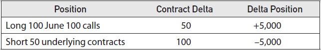
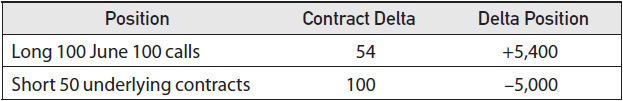
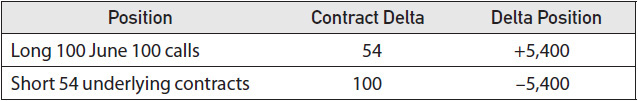
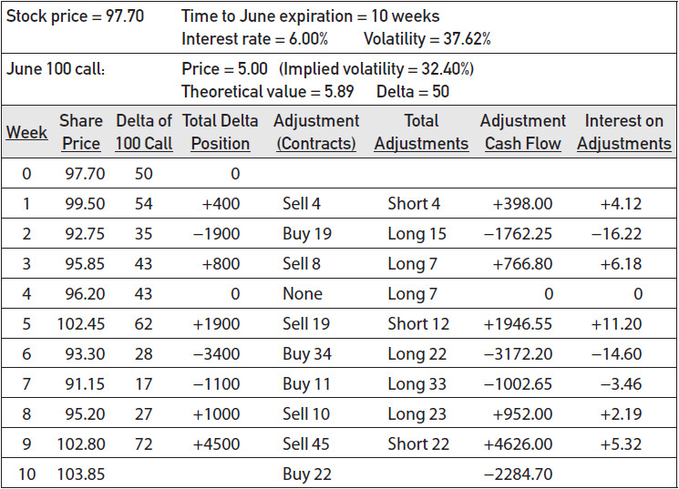
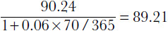
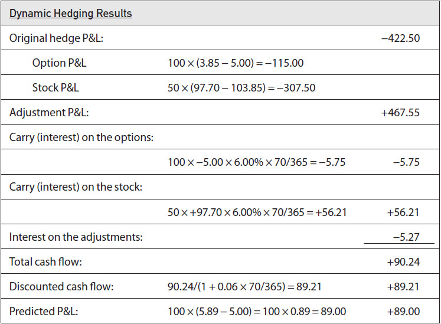
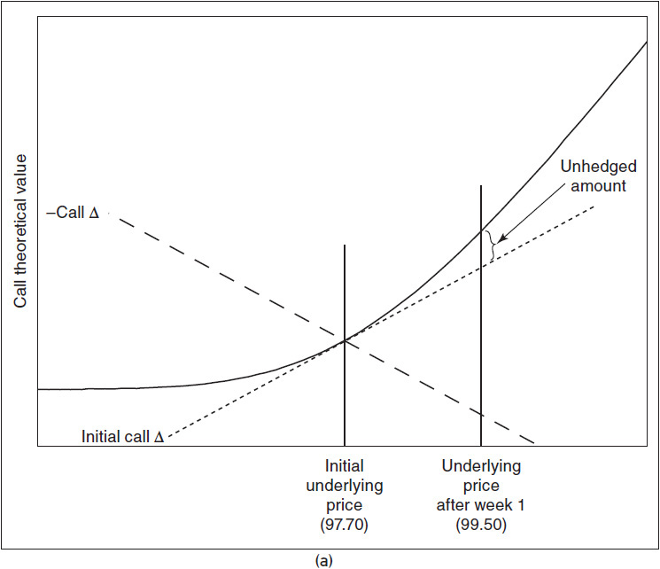
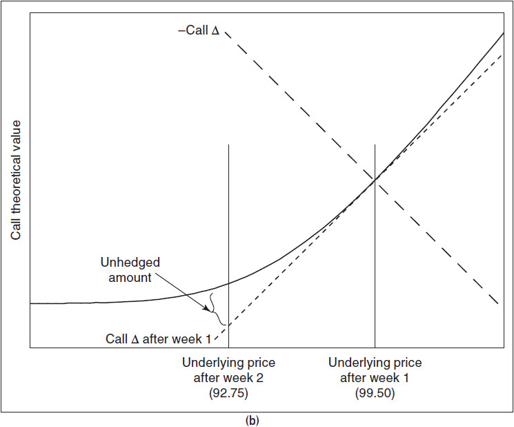
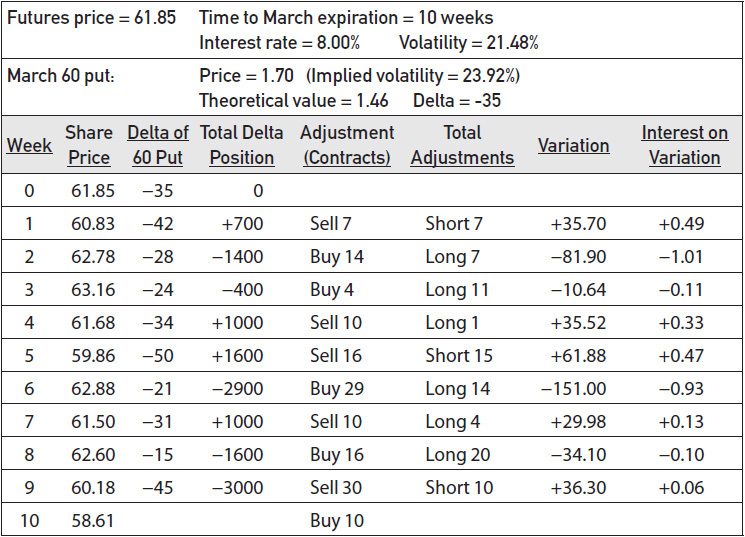
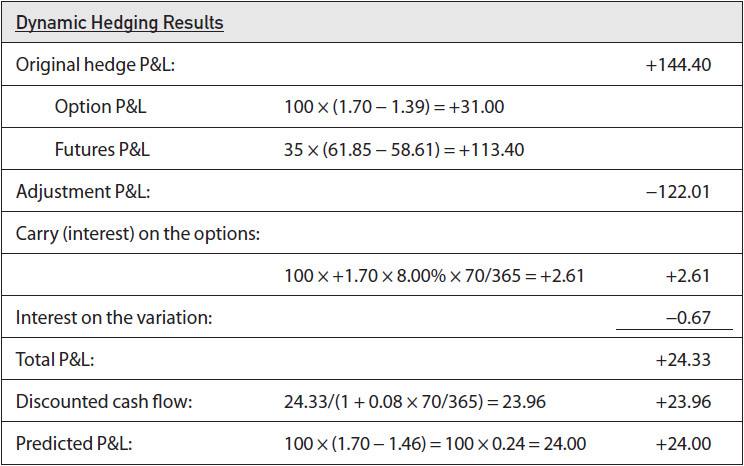

# 第8章 动态对冲 / Dynamic Hedging

[[00-阅读导航|← 返回阅读导航]] · [[00-翻译说明与术语表|术语表]]

> [!warning] 翻译状态
> 本章为机器初译，并使用本地术语表校验。英文原文、数字、公式和图表用于核对；中文将在后续复核中继续修订。

<!-- chapter-toc:start -->
## 本章目录 / Chapter Outline

> [!abstract] 结构导航
> 以下标题按原书顺序保留；点击可直接跳转。

- [[#初始对冲 / Original Hedge|初始对冲 / Original Hedge]]
  - [[#调整 / Adjustments|调整 / Adjustments]]
  - [[#期权头寸的利息成本 / Interest Lost on the Option Position|期权头寸的利息成本 / Interest Lost on the Option Position]]
  - [[#股票头寸赚取的利息 / Interest earned on the Stock Position|股票头寸赚取的利息 / Interest earned on the Stock Position]]
  - [[#调仓产生的利息 / Interest on the Adjustments|调仓产生的利息 / Interest on the Adjustments]]
  - [[#股息 / Dividends|股息 / Dividends]]
<!-- chapter-toc:end -->
<!-- chapter-nav:start -->
> [!tip] 章节导航（章首）
> [[07-风险度量（一） Risk Measurement I|← 上一章]] · [[00-阅读导航|全书导航]] · [[09-风险度量（二） Risk Measurement II|下一章 →]]
<!-- chapter-nav:end -->
<!-- source:block 068c4cfed2348aa2 -->

> [!quote]- English 1
> From our discussion thus far, it ought to be obvious why serious option traders use theoretical pricing models. First, a model tells us something about an option’s value. We can compare this value with the price of the option in the marketplace and from this choose an appropriate strategy. Second, once we have taken a position, the model helps us quantify many of the risks that option trading entails. By understanding these risks, we will be better prepared to minimize our losses when market conditions move against us and maximize our profits when market conditions move in our favor.

从我们到目前为止的讨论来看，严肃的期权交易者使用理论定价模型的原因应该很明显。首先，模型告诉我们有关期权价值的一些信息。我们可以将这个价值与市场上期权的价格进行比较，并从中选择合适的策略。其次，一旦我们采取了头寸，该模型可以帮助我们量化期权交易带来的许多风险。通过了解这些风险，我们将更好地准备在市场条件对我们不利时最大限度地减少损失，并在市场条件对我们有利时最大限度地增加利润。

<!-- source:block cafd23b8206d8ed1 -->

> [!quote]- English 2
> In discussing the performance of a theoretical pricing model, it is important to remember that all models are probability based. Even if we assume that we have all the right inputs into the model and that the model itself is correct, there is no guarantee that we will show a profit on any one trade. More often than not, the actual results will deviate, sometimes significantly, from what is predicted by the theoretical pricing model. It is only over many trades that the results will even out so that, on average, we achieve a result close to that predicted by the theoretical pricing model.

在讨论理论定价模型的性能时，重要的是要记住所有模型都是基于概率的。即使我们假设模型中有所有正确的输入并且模型本身是正确的，也不能保证我们会在任何一笔交易中显示利润。实际结果通常会偏离理论定价模型的预测，有时甚至显着偏离。只有在许多交易中，结果才会均衡，以便平均而言，我们获得的结果接近理论定价模型预测的结果。

<!-- source:block f542be0af16ab2c9 -->

> [!quote]- English 3
> However, option-pricing theory also suggests that for a single option trade there is a method by which we can reduce the variations in outcome so that the actual results will more closely approximate what is predicted by the theoretical pricing model. By treating the life of an option as a series of bets, rather than one bet, the model can be used to replicate long-term probability theory.

然而，期权定价理论还表明，对于单一期权交易，有一种方法可以减少结果的变化，以便实际结果将更接近理论定价模型预测的结果。通过将期权的寿命视为一系列赌注而不是一次赌注，该模型可以用于复制长期概率理论。

<!-- source:block b867f17634482bd1 -->

> [!quote]- English 4
> Consider the following situation:

考虑以下情况：

<!-- source:block 87f82b31146ab9e8 -->

> [!quote]- English 5
> Stock price = \$97.70

$$
\text{Stock price} = \$97.70
$$

<!-- source:block a05f0986e370d87e -->

> [!quote]- English 6
> Time to June expiration = 10 weeks

$$
\text{Time to June expiration} = 10 \text{weeks}
$$

<!-- source:block f655f2e2a35e183a -->

> [!quote]- English 7
> Interest rate = 6.00 percent

$$
\text{Interest rate} = 6.00 \text{percent}
$$

<!-- source:block c874e14557265df7 -->

> [!quote]- English 8
> Suppose that we are using a theoretical pricing model to evaluate June options on this stock. We already have three inputs into the model—underlying price, time to expiration, and the interest rate—but we still need three additional inputs—exercise price, type, and volatility. Given that we can choose from among the available exercise prices and that we can also choose the type of option (either call or put), we still lack the one unobservable input—volatility. In theory, we would like to know the future realized volatility of the underlying stock over the next 10 weeks. Clearly, we can never know the future, but let’s imagine that we have a crystal ball that can predict the future. When we look into our crystal ball, we see that the volatility of the stock over the next 10 weeks will be 37.62 percent.

假设我们正在使用理论定价模型来评估该股票的六月期权。我们已经向模型提供了三个输入-标的价格、到期时间和利率-但我们仍然需要三个额外的输入——行权价、类型和波动率。鉴于我们可以从可用的行权价中进行选择，并且我们还可以选择期权类型（看涨或看跌），我们仍然缺乏一种不可观察的输入波动率。理论上，我们希望知道未来10周标的股票的未来实现波动率。显然，我们永远无法知道未来，但让我们想象我们有一个可以预测未来的水晶球。当我们查看水晶球时，我们会发现该股未来10周的波动率将为37.62%。

<!-- source:block c42756950cacc968 -->

> [!quote]- English 9
> The June 100 call, being very close to at the money, is likely to be actively traded, so let’s focus on that option. Feeding our inputs into the Black-Scholes model, we find that the June 100 call has a theoretical value of 5.89. When we check its price in the marketplace, we find that it is being offered at 5.00. How can we profit from this discrepancy?

6月100 看涨期权非常接近ATM，交易可能会活跃，因此让我们关注该期权。将我们的输入输入Black-Scholes模型，我们发现June 100 看涨期权的理论价值为5.89。 当我们在市场上检查其价格时，我们发现它的价格为5.00。我们如何才能从这种差异中获利？

<!-- source:block 0bc02c74665a6b9b -->

> [!quote]- English 10
> Clearly, our first move will be to purchase the June 100 call because it is underpriced by 0.89. Can we now walk away from the position and come back at expiration to collect our money? In our previous discussion of theoretical pricing models, we noted that the purchase or sale of a theoretically mispriced option requires us to establish a neutral hedge by taking an opposing position in the underlying contract. When this is done correctly, for small changes in the price of the underlying contract, the increase or decrease in the value of the option position will exactly offset the decrease or increase in the value of the opposing position in the underlying contract. Such a hedge is unbiased, or neutral, with respect to directional moves in the underlying contract.

显然，我们的第一步将是购买6 月到期、行权价为 100 的看涨期权，因为它的价格被低估了0.89。我们现在可以离开头寸并在到期时回来收款吗？在我们之前对理论定价模型的讨论中，我们指出，购买或出售理论上定价错误的期权需要我们通过在标的合约中采取相反头寸来建立中性对冲。当正确操作时，对于标的合约价格的微小变化，期权头寸价值的增加或减少将恰好抵消标的合约中对方头寸价值的减少或增加。对于标的合约的方向性变动，这种对冲是公正或中立的。

<!-- source:block 52c8c4ce89d340f8 -->

> [!quote]- English 11
> In order to establish the appropriate riskless hedge, we need to determine the delta of the June 100 call. Using our theoretical pricing model, we find that the option has a delta of 50. For each call we purchase, we must sell 0.50, or one-half, of an underlying contract. Because it is usually not possible to buy or sell fractional underlying contracts, let’s assume that we buy 100 June 100 calls and sell 50 underlying contracts.1 We now have the following delta-neutral position:

为了建立适当的无风险对冲，我们需要确定6月100看涨期权的Delta。使用我们的理论定价模型，我们发现该期权的Delta为50。对于我们购买的每一次看涨期权，我们必须出售0.50（即标的合约的一半）。由于通常不可能购买或出售部分标的合约，因此假设我们购买100个6月100个看涨期权并出售50个标的合约。[^ovp08-1]我们现在拥有以下Delta中性头寸：

<!-- source:block 5ae4c5ec270f988d -->

<!-- source:block 2d0d6e83c536c15d -->

> [!quote]- English 12
> Suppose that one week later the price of the stock has moved up to 99.50. At this point, we can feed the new market conditions into our theoretical pricing model:

假设一周后股票价格上涨至99.50。此时，我们可以将新的市场条件融入我们的理论定价模型：

<!-- source:block 41b58df3d445f426 -->

> [!quote]- English 13
> Stock price = 99.50

$$
\text{Stock price} = 99.50
$$

<!-- source:block 67718da191cd8f24 -->

> [!quote]- English 14
> Interest rate = 6.00 percent

$$
\text{Interest rate} = 6.00 \text{percent}
$$

<!-- source:block 021c6a552d7076e1 -->

> [!quote]- English 15
> Time to June expiration = 9 weeks

$$
\text{Time to June expiration} = 9 \text{weeks}
$$

<!-- source:block 585b6f729daf0055 -->

> [!quote]- English 16
> Volatility = 37.62 percent

$$
\text{Volatility} = 37.62 \text{percent}
$$

<!-- source:block f90f46d5360209bf -->

> [!quote]- English 17
> Note that we have made no change in the interest rate or volatility. Theoretical pricing models typically assume that these two inputs remain constant over the life of the option.2 Based on the new inputs, we can calculate the new delta for the June 100 call, in this case 54.

请注意，我们没有对利率或波动率做出任何改变。理论定价模型通常假设这两个输入在期权有效期内保持不变。[^ovp08-2]根据新输入，我们可以计算6 月到期、行权价为 100 的看涨的新Delta，在本例中为54。

<!-- source:block 96b9271a35189fd3 -->

<!-- source:block b728de067abc8474 -->

> [!quote]- English 18
> Our delta position is now +400. We can think of this as the end of one bet, with another bet about to begin.

我们的Delta头寸现在为+400。我们可以将其视为一个赌注的结束，另一个赌注即将开始。

<!-- source:block 792fecf329b6fa40 -->

> [!quote]- English 19
> Whenever we begin a new bet, we are required to return to a delta-neutral position. In our example, it will be necessary to reduce our position by 400 deltas. There are a number of ways to do this, but to keep our present calculations as simple as possible and to remain consistent with the theoretical pricing model, we will make the necessary trades in the underlying contract because an underlying contract always has a delta of 100. We can return to delta neutral by selling 4 underlying contracts. Our position is now

每当我们开始一个新的赌注，我们需要回到一个Delta中立的头寸。在我们的例子中，有必要将我们的头寸减少400个Delta。有很多方法可以做到这一点，但为了使我们目前的计算尽可能简单，并与理论定价模型保持一致，我们将在标的合约中进行必要的交易，因为标的合约的Delta总是为100。我们可以通过卖出4个标的合约回到Delta中性。我们现在的头寸是

<!-- source:block 55a3ed9dc97fdbf9 -->

<!-- source:block 038d9cdfdae7160e -->

> [!quote]- English 20
> We are again delta neutral and about to begin a new bet. As before, our new bet depends only on the volatility of the underlying contract, not its direction.

我们再次处于Delta中立状态，即将开始新的赌注。与以前一样，我们的新赌注仅取决于标的合约的波动率，而不是其方向。

<!-- source:block 3700d03ade22633c -->

> [!quote]- English 21
> The extra four underlying contracts that we sold were an *adjustment* to our position. In option trading, adjustments are trades that are made primarily to ensure that a position remains delta neutral. In our case, the sale of the four extra contracts has no effect on our theoretical edge because, from an option trader’s point of view, an underlying contract has no theoretical value. The trade is made solely for the purpose of adjusting our hedge to remain delta neutral.

我们出售的额外四份标的合约是对我们头寸的调整。在期权交易中，调整是主要为了确保头寸保持Delta中性而进行的交易。在我们的案例中，出售四份额外合约对我们的理论优势没有影响，因为从期权交易者的角度来看，标的合约没有理论价值。该交易的目的仅是调整我们的对冲以保持Delta中性。

<!-- source:block 95a55a02eb7fbec6 -->

> [!quote]- English 22
> In Chapter 17, we will look at the use of options to protect a preexisting position. Such protective strategies usually employ a *static hedge*, whereby opposing market positions are taken in different contracts, with the entire position being carried to a fixed maturity date. To capture an option’s mispricing, the theoretical pricing model requires us to employ a *dynamic hedging* strategy. We must periodically reevaluate the position to determine the delta of the position and then buy or sell an appropriate number of underlying contracts to return to delta neutral. This procedure must be followed over the entire life of the option.

在第17章中，我们将研究如何使用期权来保护先前存在的头寸。此类保护策略通常采用静态对冲，即在不同的合约中持有相反的市场头寸，整个头寸被持续到固定的到期日。为了捕捉期权的错误定价，理论定价模型要求我们采用动态对冲策略。我们必须定期重新评估头寸以确定头寸的Delta，然后购买或出售适当数量的标的合约以恢复Delta中性。该程序必须在期权的整个生命周期内遵循。

<!-- source:block 270c63201fd43ca7 -->

> [!quote]- English 23
> Because volatility is assumed to compound continuously, theoretical pricing models assume that adjustments are also made continuously and that the hedge is being adjusted at every moment in time. Such continuous adjustments are not possible in the real world because a trader can only trade at discrete intervals. By making adjustments at regular intervals, we are conforming as closely as possible to the principles of the theoretical pricing model.

由于假设波动率持续复合，理论定价模型假设调整也是连续进行的，并且对冲在每个时刻都在进行调整。这种连续调整在现实世界中是不可能的，因为交易者只能以离散的时间间隔进行交易。通过定期进行调整，我们尽可能遵守理论定价模型的原则。

<!-- source:block 14bc656103610cb1 -->

> [!quote]- English 24
> The entire dynamic hedging process for our hedge, with adjustments made at weekly intervals, is shown in Figure 8-1. At the end of each interval, the delta of the June 100 call was recalculated from the time remaining to expiration, the current price of the underlying contract, an interest rate of 6.00 percent, and a volatility of 37.65 percent. Note that we did not change the volatility, even though other market conditions may have changed. Volatility, like interest rates, is assumed to be constant over the life of the option.3

我们对冲的整个动态对冲流程（每周进行调整）如图8-1所示。在每个区间结束时，6 月到期、行权价为 100 的看涨期权的Delta根据到期剩余时间、标的合约的当前价格、6.00%的利率和37.65%的波动率重新计算。请注意，尽管其他市场条件可能已经发生变化，但我们没有改变波动率。波动率（与利率一样）被假设在期权有效期内保持不变。[^ovp08-3]

<!-- source:block 76c0261d45532ca9 -->

*图8-1 / Figure 8-1*

<!-- source:block c7137d803b32a144 -->

<!-- source:block 0a88b9840d4c9bce -->

> [!quote]- English 26
> What will we do with our position at the end of 10 weeks when the options expire? At that time, we plan to close out the position by

当期权到期10周后，我们将如何处理我们的头寸？届时，我们计划通过以下方式结束该头寸：

<!-- source:block 93f37a9bce513929 -->

> [!quote]- English 27
> 1. Letting any out-of-the-money options expire worthless

1.让任何价外期权到期时变得毫无价值

<!-- source:block 80148b8f0d49ed42 -->

> [!quote]- English 28
> 2. Selling any in-the-money options at parity (intrinsic value) or, equivalently, exercising them and offsetting them against the underlying contract

2.以平价（内在价值）出售任何价内期权，或者同等地行权它们并将其与标的合约抵消

<!-- source:block ef3e0723704e5668 -->

> [!quote]- English 29
> 3. Liquidating any outstanding underlying contracts at the market price

3.以市场价格清算任何未完成的标的合约

<!-- source:block e0a1b00d10b956e5 -->

> [!quote]- English 30
> Let’s go through this procedure step by step and see what the complete results of our hedge are.

让我们一步一步地完成这个过程，看看我们对冲的完整结果是什么。

<!-- source:block 44deeacf0c1511e9 -->

## 初始对冲 / Original Hedge

<!-- source:block b142f99a4b0cca76 -->

> [!quote]- English 31
> At June expiration (week 10), with the underlying contract at 103.85, we can close out the June 100 calls by either selling them at 3.85 or exercising the calls and selling the underlying contract. Either method will result in a credit of 3.85 to our account. Because we originally paid 5.00 for each option, we will show a loss on our option position of

在 6 月到期日（第 10 周），标的合约价格为 103.85。我们既可以按 3.85 卖出 June 100 calls，也可以行权后立即卖出标的合约，从而平掉期权头寸。两种方式都会使账户获得 3.85 的 `credit`。由于我们最初为每份期权支付了 5.00，期权头寸的亏损为

<!-- source:block f3faad352d8d34ee -->

> [!quote]- English 32
> 100 × (3.85 – 5.00) = 100 × –1.15 = –115.00

$$
100 \times (3.85 - 5.00) = 100 \times -1.15 = -115.00
$$

<!-- source:block 0b78a7cd6760f09e -->

> [!quote]- English 33
> As part of our original hedge, we also sold 50 underlying contracts at 97.70. At expiration, in order to close out the position, we were required to buy them back at 103.85, for a loss of 6.15 per contract. Our total loss on the underlying trade is therefore

作为我们最初对冲的一部分，我们还以97.70美元的价格出售了50份标的合约。到期时，为了平仓，我们必须以103.85的价格买回，每份合约损失6.15。因此，我们在标的交易上的总损失为

<!-- source:block 03ca03f39c93c77f -->

> [!quote]- English 34
> 50 × (97.70 – 103.85) = 50 × –6.15 = –307.50

$$
50 \times (97.70 - 103.85) = 50 \times -6.15 = -307.50
$$

<!-- source:block cf6f13889190cf57 -->

> [!quote]- English 35
> Adding this to our option loss, the total loss on the original hedge is

加上我们的期权损失，初始对冲的总损失是

<!-- source:block 93a9e11a6a366d97 -->

> [!quote]- English 36
> –115.00 – 307.50 = –422.50

$$
-115.00 - 307.50 = -422.50
$$

<!-- source:block b7bb690d5b0223f8 -->

> [!quote]- English 37
> This certainly does not appear to have been successful. We expected to make money on the position, yet it appears that we have a sizable loss.

这似乎肯定没有成功。我们预计该头寸会赚钱，但看来我们损失惨重。

<!-- source:block 02bcef2283733239 -->

### 调整 / Adjustments

<!-- source:block 87b8d84c3c5888fd -->

> [!quote]- English 38
> Fortunately, the original hedge was not our only transaction. In order to remain delta neutral over the 10-week life of the option, we were forced to buy and sell underlying contracts. At the end of week 1, we were long 400 deltas, so we were required to sell four underlying contracts at 99.50. At the end of week 2, we were short 1,900 deltas, so we were required to buy 19 underlying contracts at 92.75, and so on each week until the end of week 10. At expiration, with the underlying contract at 103.85, we bought in the 22 underlying contracts that we were short at the end of week 9.

幸运的是，最初的对冲并不是我们唯一的交易。为了在期权的10周有效期内保持Delta中性，我们被迫买卖标的合约。在第一周结束时，我们做多了400个Delta，因此我们被要求以99.50的价格出售四份标的合约。在第2周结束时，我们做空了1,900个Delta，因此我们被要求以92.75的价格购买19个标的合约，以此为基础每周进行，直到第10周结束。到期时，标的合约为103.85，我们买入了第9周末做空的22份标的合约。

<!-- source:block 7185daccf224e3f0 -->

> [!quote]- English 39
> In this example, each time the underlying price rose, our delta position became positive, so we were forced to sell underlying contracts, and each time the underlying price fell, our delta position became negative, so we were forced to buy underlying contracts. Because our adjustments depended only on our delta position, we were forced to do what every trader wants to do: buy low and sell high.

在这个例子中，每次标的价格上涨，我们的Delta头寸就会变成正值，因此我们被迫出售标的合约，每次标的价格下跌，我们的Delta头寸就会变成负值，因此我们被迫购买标的合约。由于我们的调整仅取决于我们的Delta头寸，我们被迫做每个交易员都想做的事情：低买高卖。

<!-- source:block d92652ccb8ed97b1 -->

> [!quote]- English 40
> The result of making all the adjustments required to maintain a delta-neutral position was a profit of 467.55. (The reader may wish to confirm this by adding up the cash flow from all the trades in the adjustment column in Figure 8-1.) This profit more than offset the losses incurred from the original hedge.

进行维持Delta中性头寸所需的所有调整的结果是利润467.55。(The读者可能希望通过将图8-1中调整列中所有交易的现金流相加来确认这一点。）这笔利润远远抵消了初始对冲产生的损失。

<!-- source:block 42f940683fdaf488 -->

### 期权头寸的利息成本 / Interest Lost on the Option Position

<!-- source:block 94abe33281962f29 -->

> [!quote]- English 41
> We originally bought 100 June options at a price of 5.00 each, for a total cash outlay of 500.00. At the assumed interest rate of 6.00 percent, the cost of financing the option purchase for the 10-week (70-day) life of the position was

我们最初以每份5.00的价格购买了100份六月期权，总现金支出为500.00。假设利率为6.00%，头寸10周（70天）期限内期权购买融资成本为

<!-- source:block a7dca63cc2edf5ff -->

> [!quote]- English 42
> –500.00 × 6% × 70/365 = –5.75

$$
-500.00 \times 6\% \times 70/365 = -5.75
$$

<!-- source:block 3978eda555e4b06e -->

### 股票头寸赚取的利息 / Interest earned on the Stock Position

<!-- source:block 946abbd8a9677a2d -->

> [!quote]- English 43
> To establish our initial hedge, we sold 50 underlying stock contracts at a price of 97.70 each, for a total credit of 4,885.00. Over the life of the hedge, we were able to earn total interest in the amount of

为建立初始对冲，我们以每份 97.70 的价格卖出 50 份标的股票合约，账户共获得 4,885.00 的 `credit`。在整个对冲存续期内，我们赚取的利息总额为

<!-- source:block fff5cfacbb9e5f12 -->

> [!quote]- English 44
> +4,885 × 6% × 70/365 = +56.21

$$
+4{,}885 \times 6\% \times 70/365 = +56.21
$$

<!-- source:block 1bdc2498125d6f09 -->

### 调仓产生的利息 / Interest on the Adjustments

<!-- source:block 61b89f0f83f58aaa -->

> [!quote]- English 45
> Each week we were forced to buy or sell underlying contracts in order to remain delta neutral. As a result, there was either a cash debit on which we were required to pay interest or a cash credit on which we were able to earn interest. For example, at the end of week 1, we were forced to sell four underlying contracts at a price of 99.50 each, for a total credit of 4 × 99.50 = 398.00. The interest earned on this credit for the remaining nine weeks was

为了保持 Delta 中性，我们每周都必须买入或卖出标的合约，由此产生需要承担利息的 `cash debit`，或能够赚取利息的 `cash credit`。例如，第 1 周结束时，我们以每份 99.50 的价格卖出 4 份标的合约，共获得 $4 \times 99.50 = 398.00$ 的 `credit`。该笔 `credit` 在剩余 9 周内赚取的利息为

<!-- source:block 9446aff0eedbd082 -->

> [!quote]- English 46
> +398.00 × 6% × 63/365 = +4.12

$$
+398.00 \times 6\% \times 63/365 = +4.12
$$

<!-- source:block 196cd8a1216d7234 -->

> [!quote]- English 47
> At the end of week 2, we were forced to buy 19 underlying contracts at a price of 92.75 each, for a total debit of 19 × 92.75 = 1,762.25. The interest cost on this debit over the remaining eight weeks was

第 2 周结束时，我们以每份 92.75 的价格买入 19 份标的合约，共产生 $19 \times 92.75 = 1{,}762.25$ 的 `debit`。该笔 `debit` 在剩余 8 周内的利息成本为

<!-- source:block 4e81e77abe8b5f2d -->

> [!quote]- English 48
> –1,762.25 × 6% × 56/365 = –16.22

$$
-1{,}762.25 \times 6\% \times 56/365 = -16.22
$$

<!-- source:block 9d056e9eb2c00d75 -->

> [!quote]- English 49
> Adding up the interest on all the adjustments, we get a total of –5.28.

将所有调整的利息加起来，总共得到-5.28。

<!-- source:block 0d3ab479fca350f0 -->

### 股息 / Dividends

<!-- source:block 4b7b130919796427 -->

> [!quote]- English 50
> To keep our example relatively simple, we have assumed that the stock pays no dividend over the life of the option. If the stock were to pay a dividend, any long stock position resulting from either the original hedge or the adjustment process would receive the dividend. Any short stock position would be required to pay out the dividend. There also would be an interest consideration on the amount of the dividend, interest either earned or interest lost, between the date of the dividend payment and expiration. The dividend and the interest on the dividend would then become part of the total profit or loss.

为了使我们的例子相对简单，我们假设股票在期权有效期内不支付股息。如果该股票支付股息，那么由于初始对冲或调整过程产生的任何多头股票头寸都将获得股息。任何空头头寸都需要支付股息。股息支付之日至到期之间的股息金额（赚取的利息或损失的利息）也会考虑利息。股息和股息利息将成为总利润或亏损的一部分。

<!-- source:block bfbdb181680707d4 -->

> [!quote]- English 51
> What was the total cash flow resulting from the entire 10-week hedge? This amount, +90.24, is shown in Figure 8-2. Of course, this represents the cash flow at the end of 10 weeks. To obtain the initial or present value, we need to discount backwards over 10 weeks at an interest rate of 6.00 percent. This gives us a final value, or total profit and loss (P&L), of

整个10周对冲产生的总现金流是多少？该金额+90.24，如图8-2所示。当然，这代表10周结束时的现金流。为了获得初始或现值，我们需要在10周内以6.00%的利率向后贴现。这为我们提供了最终价值或总损益（P & L）

<!-- source:block 69eecf99d9576d74 -->

<!-- 原 EPUB 中此公式为图片，已原样保留 -->

<!-- source:block 83d3b2445dbf63f9 -->

*图8-2 / Figure 8-2*

<!-- source:block 8bf38cf5b5c1c72c -->

<!-- source:block 635f6d59291ee528 -->

> [!quote]- English 53
> How does this final value of 89.21 compare with our predicted profit or loss? We purchased 100 June options at a price of 5.00 each, but the options had a theoretical value of 5.89, so the theoretical profit was

这个最终值89.21与我们预测的利润或亏损相比如何？我们以每份5.00美元的价格购买了100份6月期权，但这些期权的理论价值为5.89美元，因此理论利润为

<!-- source:block 95f66fd4851a7c82 -->

> [!quote]- English 54
> 100 × (5.89 – 5.00) = +89.00

$$
100 \times (5.89 - 5.00) = +89.00
$$

<!-- source:block 34c0f9e1a9b2a188 -->

> [!quote]- English 55
> In our example, the profit and loss were made up of five components. Two of these were positive (the adjustments and the interest earned on stock), while three were negative (the original hedge, the option carrying costs, and interest on the adjustments). Is this always the case? Because price movement in the underlying contract is assumed to be random, it is impossible to determine beforehand which components will be profitable and which will not. It would also be possible to construct an example where the original hedge was profitable and the adjustments were not. The important point is that if a trader’s inputs are correct, in some combination, he can expect to show a profit or loss approximately equal to that predicted by the theoretical pricing model.

在我们的例子中，利润和损失由五个部分组成。其中两个是正值（调整和股票利息），三个是负值（初始对冲、期权持有成本和调整利息）。总是这样吗？由于标的合约的价格变动被认为是随机的，因此不可能事先确定哪些成分将盈利，哪些成分不会盈利。还可以举出一个例子，说明原来的套期保值是有利可图的，而调整后却没有。重要的一点是，如果交易者的输入是正确的，在某种组合中，他可以期望显示出近似等于理论定价模型预测的利润或损失。

<!-- source:block ede8aae803311913 -->

> [!quote]- English 56
> Of all the inputs, volatility is the only one that is not directly observable. Where did our volatility figure of 37.62 percent come from? Obviously, it is not possible to know the future volatility. In our example the 10 price changes in Figure 8-1 do in fact represent an annualized volatility of 37.62 percent. The complete calculations are given in Appendix B.

在所有输入中，波动率是唯一不可直接观察的输入。我们37.62%的波动率数据从何而来？显然，不可能知道未来的波动率。在我们的例子中，图8-1中的10个价格变化实际上代表了37.62%的年化波动率。完整的计算见附录B。

<!-- source:block b2efaaf581bc4501 -->

> [!quote]- English 57
> In the foregoing example, we assumed that the market was *frictionless*, that no external factors affected the total profit or loss. This assumption is basic to many financial models. In a frictionless market, we assume that

在上面的例子中，我们假设市场是无摩擦的，没有外部因素影响总利润或损失。这个假设是许多金融模型的基础。在无摩擦的市场中，我们假设

<!-- source:block 47c74313a88638ad -->

> [!quote]- English 58
> 1. Traders can freely buy or sell the underlying contract without restriction.

1.交易员可以不受限制地自由买卖标的合约。

<!-- source:block e05e0ae251a580af -->

> [!quote]- English 59
> 2. Traders can borrow and lend as much money as desired at one constant interest rate.

2.交易员可以以固定利率借入和借出尽可能多的资金。

<!-- source:block 05727957f0bb06f6 -->

> [!quote]- English 60
> 3. Transaction costs are zero.

3.交易成本为零。

<!-- source:block 6a77ddfa0cdded67 -->

> [!quote]- English 61
> 4. There are no tax consequences.

4.没有税收后果。

<!-- source:block 935907c209c88d7d -->

> [!quote]- English 62
> A trader will immediately realize that option markets are not frictionless because in the real world, each of these assumptions is violated to a greater or lesser degree. In our example, we were required to sell stock to initiate the original hedge. If we did not own the stock, we would need to *sell short* by first borrowing the stock and then making delivery. In some markets, short sales may be difficult to execute because of exchange or regulatory restrictions. Moreover, even if a short sale is possible, a trader typically will not receive full interest on the proceeds from the short sale.

交易者会立即意识到期权市场并非没有摩擦，因为在现实世界中，这些假设中的每一个都或多或少地被违反。在我们的例子中，我们需要出售股票才能启动初始对冲。如果我们不拥有股票，我们需要先借入股票然后交割来卖空。在某些市场，由于交易所或监管限制，卖空可能难以执行。此外，即使卖空是可能的，交易员通常也不会获得卖空收益的全额利息。

<!-- source:block 53022f3ab45ee9dd -->

> [!quote]- English 63
> Turning to options on futures, in some markets, there is a daily limit on the amount of allowable price movement for a futures contract. When this limit is reached, the market is *locked*, and no further trading can take place until the price of the futures contract comes off its limit. Clearly, in such markets, the underlying contract cannot always be freely bought or sold.

至于期货期权，在某些市场中，期货合约允许的价格变动量有每日限制。当达到该限额时，市场就会被锁定，并且在期货合约的价格超过限额之前不能进行进一步的交易。显然，在这样的市场中，标的合约并不总是可以自由购买或出售。

<!-- source:block 74244962002f7529 -->

> [!quote]- English 64
> Concerning interest rates, different rates apply to different market participants. The rate that applies to an individual trader will not be the same rate that applies to a large financial institution. Moreover, even for the same trader, different rates can apply to different transactions. If a trader has a debit balance, it will cost him more to carry that debit; if he has a credit balance, he will not earn as much on that credit. There is a spread, and perhaps a fairly large one, between a trader’s borrowing and lending rate. Fortunately, the interest-rate component is usually the least important of the inputs into a theoretical pricing model. Even though the applicable interest rate may vary from trader to trader, in general, it will cause only minor changes in the total profit or loss in relation to the profit or loss resulting from other inputs.

不同市场参与者适用的利率并不相同：个人交易者与大型金融机构的利率不同，同一交易者在不同交易中适用的利率也可能不同。交易者持有 `debit` 余额时，融资成本通常较高；持有 `credit` 余额时，所得利息通常较低。借款利率与贷款利率之间存在利差，而且可能相当大。所幸，利率通常是理论定价模型中相对次要的输入。尽管不同交易者适用的利率有所差异，与其他输入造成的损益相比，它通常只会使总损益发生小幅变化。

<!-- source:block 2ba6d862db8dbed1 -->

> [!quote]- English 65
> Transaction costs, on the other hand, can be a very real consideration. If these costs are high, the hedge in Figure 8-1 might not be a viable strategy; all the profits could be eaten up by brokerage and exchange fees. The desirability of a strategy will depend not only on the trader’s initial transaction costs but also on the subsequent costs of making adjustments. The adjustment cost is a function of a trader’s desire to remain delta neutral. A trader who wants to remain delta neutral at every moment will have to adjust more often, and more adjustments mean greater transaction costs.

另一方面，交易成本可能是一个非常现实的考虑因素。如果这些成本很高，图8-1中的对冲可能不是一个可行的策略;所有利润都可能被经纪费和交易所费用吃掉。策略的可取性不仅取决于交易者的初始交易成本，还取决于随后进行调整的成本。调整成本是交易员保持Delta中性的愿望的函数。想要随时保持Delta中性的交易员将不得不更频繁地调整，而更多的调整意味着更高的交易成本。

<!-- source:block f9735c882cab942c -->

> [!quote]- English 66
> If a trader initiates a hedge but adjusts less frequently or does not adjust at all, how will this affect the outcome? Because theoretical evaluation of options is based on the laws of probability, a trader who initiates a theoretically profitable hedge still has the odds on his side. Although he may lose on any one individual hedge, if given a chance to initiate the same hedge repeatedly at a positive theoretical edge, on average, he should profit by the amount predicted by the theoretical pricing model. The adjustment process is simply a way of smoothing out the winning and losing hedges by forcing the trader to make more bets, always at the same favorable odds. A trader who is disinclined to adjust is at greater risk of not realizing a profit on any one hedge. Adjustments do not in themselves alter the expected return; they simply reduce the short-term effects of good and bad luck.

如果交易员启动对冲，但调整频率较低或根本不调整，这将如何影响结果？由于期权的理论评估是基于概率定律，因此发起理论上有利可图的对冲的交易员仍然有胜算。尽管他可能会在任何一项对冲中亏损，但如果有机会以正的理论优势反复启动相同的对冲，平均而言，他的利润应该达到理论定价模型预测的金额。调整过程只是通过迫使交易者进行更多赌注，始终以相同的有利赔率来平滑输赢对冲的一种方法。不愿意调整的交易员面临着更大的无法从任何一种对冲中实现利润的风险。调整本身不会改变预期回报;它们只是减少好运气和坏运气的短期影响。

<!-- source:block a4cd5cd1bdc0d858 -->

> [!quote]- English 67
> Based on the foregoing discussion, a retail customer and a professional trader are likely to approach option trading in a somewhat different manner, even if both understand and use the values generated by a theoretical pricing model. A professional trader, particularly if he is an exchange member, has relatively low transaction costs. Because adjustments cost him very little in relation to the expected theoretical profit from a hedge, he will be inclined to make frequent adjustments. In contrast, a retail customer who establishes the same hedge will be less inclined to adjust or will adjust less frequently because any adjustments will reduce the profitability of the position. A retail customer who understands the laws of probability will realize that his position has the same favorable odds as the professional trader’s position, but he should also realize that his position is more sensitive to the effects of short-term good and bad luck. Even though the retail customer may occasionally experience larger losses than the professional trader, he will also occasionally experience larger profits. In the long run, on average, both should end up with approximately the same profit.4

根据前面的讨论，零售客户和专业交易员可能会以某种不同的方式进行期权交易，即使他们都理解并使用理论定价模型产生的价值。专业交易员，特别是如果他是交易所会员，交易成本相对较低。由于与对冲的预期理论利润相比，调整的成本很少，因此他倾向于频繁进行调整。相比之下，建立相同对冲的零售客户将不太愿意调整或调整频率较低，因为任何调整都会降低头寸的盈利能力。了解概率定律的零售客户会意识到自己的头寸与专业交易者的头寸具有相同的有利赔率，但他也应该意识到自己的头寸对短期好运气和坏运气的影响更加敏感。尽管零售客户偶尔会经历比专业交易员更大的损失，但他偶尔也会经历更大的利润。从长远来看，平均而言，两者最终应该会获得大致相同的利润。[^ovp08-4]

<!-- source:block bffebc73a1478fe7 -->

> [!quote]- English 68
> Taxes may also be a factor in evaluating an option strategy. When positions are initiated, when they are liquidated, how the positions overlap, and the relationship between different instruments (e.g., options, stock, futures, physical commodities, etc.) may have different tax consequences. Such consequences may affect the value of a diversified portfolio, and for this reason, portfolio managers must be sensitive to the tax ramifications of a strategy. Because each trader has unique tax considerations and this book is intended as a general guide to option evaluation and strategies, we will simply assume that each trader wishes to maximize his pretax profits and that he will worry about taxes afterward.

税收也可能是评估期权策略的一个因素。何时启动头寸、何时清算、头寸如何重叠以及不同工具之间的关系（例如，期权、股票、期货、实物商品等）可能会产生不同的税收后果。此类后果可能会影响多元化投资组合的价值，因此，投资组合经理必须对策略的税收后果保持敏感。由于每个交易者都有独特的税务考虑因素，而且本书旨在作为期权评估和策略的一般指南，因此我们简单地假设每个交易者希望最大化他的税前利润，并且他会担心事后的税收问题。

<!-- source:block 507d05ec136a3c8f -->

> [!quote]- English 69
> It may seem like a fortunate coincidence that the theoretical P&L in our example and the actual P&L are so close. In fact, the example in Figure 8-1 was carefully constructed to demonstrate why the dynamic hedging process is so important. In the real world, it is unlikely that the actual results from any one hedge will so closely match the theoretical results.

我们例子中的理论损益和实际损益如此接近，这似乎是一个幸运的巧合。事实上，图8-1中的例子是经过精心构建的，以证明动态对冲过程为何如此重要。在现实世界中，任何一种对冲的实际结果都不太可能与理论结果如此接近。

<!-- source:block 2155730e46f94d08 -->

> [!quote]- English 70
> Figure 8-3 illustrates in graphic terms the dynamic hedging process. We determined the initial delta of the option (the dotted line) at the underlying price of 97.70 and then took an opposing delta position in the underlying contract (the dashed line). For very small moves in the underlying price, the profit from one position offset the loss from the other position. As the changes in the underlying price in either direction become greater, because of the option’s curvature (its gamma), there is a mismatch between these two positions. With a falling underlying price, the rate at which the option position loses value begins to decline; with a rising underlying price, the rate at which the option position gains value begins to increase. In Figure 8-3*a*, we can see this mismatch, or unhedged amount, at an underlying price of 99.50.

图8-3以图形方式说明了动态对冲过程。我们以97.70的标的价格确定了期权的初始Delta（虚线），然后在标的合约中采取相反的Delta头寸（虚线）。对于标的价格的微小波动，一个头寸的利润抵消了另一个头寸的损失。随着标的价格在任何方向上的变化变得更大，由于期权的弯曲（其Gamma），这两个头寸之间存在不匹配。随着标的价格下跌，期权头寸失去价值的速度开始下降;随着标的价格上涨，期权头寸增值的速度开始上升。在图8-3a中，我们可以看到这种不匹配或未对冲金额，标的价格为99.50。

<!-- source:block f9ae5be13eff2e7f -->

*图8-3 / Figure 8-3*

<!-- source:block 2d6ca016d9cf5110 -->

<!-- source:block f466610db274b252 -->

<!-- source:block 079e5263c0b8ee26 -->

> [!quote]- English 72
> With the underlying price at 99.50, we captured the value of this mismatch by adjusting the position to return to delta neutral. This is shown in Figure 8-3*b*. We recalculated the delta at the new underlying price and took a new opposing position in the underlying contract. When the underlying price fell to 92.75, there was again a mismatch equal to the unhedged amount.

由于标的价格为99.50，我们通过调整头寸以返回Delta中性来捕捉这种不匹配的价值。如图8-3b所示。我们以新的标的价格重新计算了Delta，并在标的合约中采取了新的反对头寸。当标的价格跌至92.75时，再次出现与未对冲金额相等的错配。

<!-- source:block 90c3dc21b682bf0e -->

> [!quote]- English 73
> By rehedging the position each week, we were able to capture a series of profits resulting from the mismatch between the option’s changing delta and the fixed delta of the underlying contract. Of course, while time was passing, there were also interest considerations. But most of the option’s value was determined by the amount earned on the rehedging process. In theory, if we ignore interest, the sum of all these small profits (the unhedged amounts in Figure 8-3) should approximately equal the value of the option

通过每周重新对冲头寸，我们能够捕捉由于期权变化的Delta和标的合约的固定Delta之间不匹配而产生的一系列利润。当然，随着时间的推移，也有利益考虑。但期权的大部分价值是由再对冲过程中赚取的金额决定的。从理论上讲，如果我们忽略利息，所有这些小额利润（图8-3中的未对冲金额）的总和应该大约等于期权的价值

<!-- source:block f9cc5d8e9b50f505 -->

> [!quote]- English 74
> Option theoretical value = {·} + {·} + {·} + … + {·} + {·} + {·}

$$
\text{Option theoretical value} = {·} + {·} + {·} + \ldots + {·} + {·} + {·}
$$

<!-- source:block a7c24f9dee6581d4 -->

> [!quote]- English 75
> In our example, rehedging took place at discrete intervals, equivalent to making a finite number of bets, all with the same positive theoretical edge. If we want to exactly replicate the option’s theoretical value, we need to make an infinite number of bets. This, in theory, can only be achieved by continuous rehedging of the position at every possible moment in time. If such a process were possible, and if all the assumptions on which the model is based were accurate, then the rehedging process would indeed replicate the exact value of the option.

在我们的例子中，重新对冲以离散的时间间隔发生，相当于进行有限数量的赌注，所有赌注都具有相同的正理论优势。如果我们想准确复制期权的理论价值，我们需要进行无限次的赌注。理论上，这只能通过在每个可能的时刻持续重新对冲头寸来实现。如果这样的过程是可能的，并且模型所基于的所有假设都是准确的，那么再对冲过程确实会复制期权的确切价值。

<!-- source:block 4d4bc73b4ba0c318 -->

> [!quote]- English 76
> Of course, continuous rehedging is not possible in the real world. Nor are all the model assumptions entirely accurate. Nonetheless, most traders have found through experience that using a dynamic hedging strategy, even if only at discrete intervals, is the best way to capture the difference between an option’s price and its theoretical value.

当然，在现实世界中，持续的再对冲是不可能的。所有模型假设也并非完全准确。尽管如此，大多数交易员通过经验发现，使用动态对冲策略，即使只是以离散的间隔进行，也是捕捉期权价格与其理论价值之间差异的最佳方法。

<!-- source:block 91fde22f38e7f1e3 -->

> [!quote]- English 77
> Given that continuous rehedging is not possible, how often should a trader rehedge? The answer to this question will depend on each trader’s cost structure and risk tolerance. We have already noted that a trader’s transaction costs are likely to affect the frequency at which adjustments are made. Higher transaction costs will often lead to less frequent adjustments. If we ignore the question of transaction costs, there are two common approaches to rehedging: rehedge at regular intervals or rehedge whenever the delta becomes unbalanced by a predetermined amount.

鉴于不可能持续进行再对冲，交易员应该多久进行一次再对冲？这个问题的答案将取决于每个交易者的成本结构和风险承受能力。我们已经指出，交易员的交易成本可能会影响调整的频率。较高的交易成本通常会导致调整频率较低。如果我们忽略交易成本问题，则有两种常见的再对冲方法：定期进行再对冲或每当Delta变得不平衡预定金额时进行再对冲。

<!-- source:block 4fd9f0733617c185 -->

> [!quote]- English 78
> The position in Figure 8-1 is an example of the first approach—rehedging at regular intervals. Here we made adjustments to the position at the end of each week. Of course, we might have made adjustments at the end of each day or even every hour if we were willing to recalculate the deltas so frequently. The more often rehedging takes place, the more likely it is that the final result will approximate the results predicted by the model. In our example, we used weekly intervals for no other reason than 10 lines seemed to fit nicely on the page.

图8-1中的头寸是第一种方法的示例——定期重新对冲。在这里，我们会在每个周末对头寸进行调整。当然，如果我们愿意如此频繁地重新计算Delta，我们可能会在每天结束时甚至每个小时进行调整。重新对冲发生得越频繁，最终结果就越有可能接近模型预测的结果。在我们的例子中，我们每周使用间隔没有其他原因，只是10行似乎很适合页面。

<!-- source:block 54d18f32765ed5b2 -->

> [!quote]- English 79
> Most traders do not insist on maintaining an exactly delta-neutral position. Within limits, they are willing to accept some directional risk. The more directional risk a trader is willing to accept, the less frequent the adjustments. And the less frequent the adjustments, the more likely the actual results will differ from the results predicted by the theoretical pricing model. For example, if a trader decides that he is willing to accept a directional risk up to 500 deltas, no rehedging would take place after week 1 (+400 deltas). If the trader is willing to accept a directional risk up to 1,000 deltas, no rehedging would take place at the end of week 1 (+400 deltas), week 3 (+800 deltas), and week 8 (+1,000 deltas). And if the trader is willing to accept a directional risk up to 1,500 deltas,5 no rehedging would take place at the end of week 1 (+400 deltas), week 3 (+800 deltas), week 7 (–1,100 deltas), and week 8 (+1,000 deltas). In each case, because of the less frequent rehedging, the actual results are more likely to differ from the predicted results.

大多数交易员并不坚持维持完全Delta中性的头寸。在一定范围内，他们愿意接受一些定向风险。交易员愿意接受的方向性风险越大，调整的频率就越低。调整的频率越低，实际结果与理论定价模型预测的结果就越有可能不同。例如，如果交易员决定愿意接受高达500个Delta的方向风险，则在第1周（+400个Delta）后不会进行再对冲。如果交易者愿意接受高达1,000个Delta的定向风险，则在第1周末（+400个Delta）、第3周末（+800个Delta）和第8周末（+1,000个Delta）不会进行再对冲。如果交易者愿意接受高达1,500个Delta的定向风险，[^ovp08-5]在第1周结束（+400个Delta）、第3周结束（+800个Delta）、第7周结束（-1,100个Delta）和第8周结束（+1,000个Delta）不会进行再对冲。在每种情况下，由于重新对冲的频率较低，实际结果更有可能与预测结果不同。

<!-- source:block da18724b626ec558 -->

> [!quote]- English 80
> Note that after the hedge in Figure 8-1 was initiated, no subsequent trades were made in the option market. The trader’s only concern was the realized volatility, or price fluctuations, in the underlying market. These price fluctuations determined the size and frequency of the adjustments, and in the final analysis, it was the adjustments that determined the profitability of the hedge. We might think of the hedge as a race between the loss in time value of the June 100 calls and the cash flow resulting from the adjustments, with the theoretical pricing model acting as the judge. Under the assumptions of the model, if options are purchased at less than theoretical value, the adjustments will win the race; if options are purchased at more than theoretical value, the loss in time value will win the race. The conditions of the race are determined by the inputs into the theoretical pricing model.

请注意，在图8-1中的对冲启动后，期权市场上没有进行后续交易。交易员唯一担心的是标的市场中已实现的波动率或价格波动。这些价格波动决定了调整的规模和频率，归根结底，正是调整决定了对冲的盈利能力。我们可能会将对冲视为6 月到期、行权价为 100 的看涨期权的时间价值损失与调整产生的现金流之间的竞赛，理论定价模型作为判断。在模型的假设下，如果期权以低于理论价值的价格购买，调整将赢得比赛;如果期权以高于理论价值的价格购买，时间价值的损失将赢得比赛。比赛条件由理论定价模型的输入决定。

<!-- source:block eaf22ba0b5fa81b5 -->

> [!quote]- English 81
> We assumed in our example that the future volatility was known to be 37.62 percent. What will be the outcome if volatility is something other than 37.62 percent? Suppose, for example, that volatility turns out to be higher than 37.62 percent. Higher volatility means greater price fluctuations, resulting in more and larger adjustments. In our example, more adjustments mean more profit. This is consistent with the principle that higher volatility increases the value of options.

在我们的例子中，我们假设未来的波动率为37.62%。如果波动率不是37.62%，结果会是什么？例如，假设波动率高于37.62%。更高的波动率意味着更大的价格波动，导致更多更大的调整。在我们的例子中，更多的调整意味着更多的利润。这与较高的波动率会增加期权价值的原则是一致的。

<!-- source:block a7063b59b4da8a70 -->

> [!quote]- English 82
> What about the opposite, if volatility is less than 37.62 percent? Lower volatility means smaller price fluctuations, resulting in fewer and smaller adjustments. This will reduce the profit. If the volatility is low enough, the adjustment profit will just offset the other components, so the total profit from the hedge will be exactly zero. This *breakeven volatility* is identical to the option’s implied volatility at the original trade price. Using the Black-Scholes model, we find that the implied volatility of the June 100 call at a price of 5.00 is 32.40 percent. At this volatility, the race between profits from the adjustments and the loss in the option’s time value will end in an exact tie. Above a volatility of 32.40 percent, we expect the hedge, including adjustments and interest, to show a profit; below 32.40 percent, we expect the hedge to show a loss.

如果波动率低于37.62%，反之亦然？波动率较低意味着价格波动较小，从而导致调整越来越少和越来越小。这会减少利润。如果波动率足够低，调整利润将抵消其他成分，因此对冲的总利润将完全为零。这种盈亏平衡波动率与原始交易价格下的期权隐含波动率相同。使用Black-Scholes模型，我们发现6 月到期、行权价为 100 的看涨期权价格为5.00时的隐含波动率为32.40%。在这种波动率下，调整的利润与期权时间价值损失之间的竞争将以完全平局结束。波动率高于32.40%，我们预计对冲（包括调整和利息）将显示盈利;波动率低于32.40%，我们预计对冲将显示亏损。

<!-- source:block d9fe61d917565fe6 -->

> [!quote]- English 83
> Because we needed to make adjustments to realize a profit, it may seem that every profitable hedge requires us to maintain the position until expiration. In practice, this may not be necessary. Suppose that immediately after we establish the hedge, the implied volatility in the option market increases from 32.40 percent, the implied volatility at which we bought the June 100 calls, to 37.62 percent, the realized volatility of the underlying contract we expect over the life of the option. What will happen to the price of the June 100 call? Its price will rise from 5.00 (an implied volatility of 32.40 percent) to 5.89 (an implied volatility of 37.62 percent). We can then sell our calls for an immediate profit of 0.89 per option. Of course, if we want to close out the hedge, we must also buy back the 50 underlying contracts that we originally sold. What effect will the change in implied volatility have on the price of these contracts? Implied volatility is a characteristic associated with options, not with underlying contracts. Consequently, we expect the underlying contract to continue to trade at its original price of 97.70. By purchasing our 50 outstanding underlying contracts at a price of 97.70, we will realize an immediate total profit from the hedge of 89.00, exactly the amount predicted by the theoretical pricing model. If we can do all this, there is no reason to hold the position for the full 10 weeks.

因为我们需要进行调整才能实现利润，所以似乎每一个盈利的对冲都需要我们维持头寸直到到期。在实践中，这可能没有必要。假设在我们建立对冲后，期权市场的隐含波动率立即从32.40%（我们购买6 月到期、行权价为 100 的看涨期权时的隐含波动率）增加到37.62%（我们预计在期权有效期内标的合约的已实现波动率）。6 月到期、行权价为 100 的看涨期权的价格会发生什么变化？其价格将从5.00（隐含波动率为32.40%）上涨至5.89（隐含波动率为37.62%）。然后我们可以出售看涨期权，立即获得每份期权0.89美元的利润。当然，如果我们想平仓对冲，我们还必须回购我们最初出售的50份标的合约。隐含波动率的变化会对这些合约的价格产生什么影响？隐含波动率是与期权相关的特征，而不是与标的合约相关的特征。因此，我们预计标的合约将继续以原价97.70进行交易。通过以97.70的价格购买我们的50份未偿标的合约，我们将立即从对冲中获得89.00的总利润，这正是理论定价模型预测的金额。如果我们能做到这一切，就没有理由保持该头寸整整10周。

<!-- source:block 32561190950a91f2 -->

> [!quote]- English 84
> How likely is an immediate reevaluation of implied volatility from 32.40 to 37.62 percent? Although swift changes in implied volatility occur occasionally, more often changes occur gradually over a period of time and are the result of equally gradual changes in the volatility of the underlying contract. As the volatility of the underlying contract changes, option demand rises and falls, and this demand is reflected in a corresponding rise or fall in the implied volatility. In our example, if the price of the underlying contract begins to fluctuate at a volatility greater than 32.40 percent, we can expect implied volatility to rise. If implied volatility ever reaches our target of 37.62 percent, we can simply sell our calls and buy our underlying contracts, thereby realizing our expected profit of 89.00 without having to hold the position for the full 10 weeks. But option prices are subject to a wide variety of market forces, not all of them theoretical. There is no guarantee that implied volatility will ever reevaluate upward to 37.62 percent. In this case, we will have to hold the position and continue to adjust for the full 10 weeks to realize our profit.

立即将隐含波动率从32.40%重新评估至37.62%的可能性有多大？尽管隐含波动率偶尔会发生迅速变化，但更常见的变化是在一段时间内逐渐发生的，并且是标的合约波动率同样渐进变化的结果。随着标的合约波动率的变化，期权需求会上升和下降，这种需求会反映在隐含波动率的相应上升或下降上。在我们的例子中，如果标的合约的价格开始以大于32.40%的波动率波动，则我们可以预计隐含波动率将会上升。如果隐含波动率达到37.62%的目标，我们可以简单地出售看涨期权并购买标的合约，从而实现89.00的预期利润，而不必持有完整10周的头寸。但期权价格受到多种市场力量的影响，而并非全部是理论上的。无法保证隐含波动率会重新评估至37.62%。在这种情况下，我们将不得不持有该头寸并继续调整整整10周才能实现我们的利润。

<!-- source:block 6316a446104e2b88 -->

> [!quote]- English 85
> Every trader hopes that implied volatility will reevaluate as quickly as possible toward his volatility target. It not only enables him to realize his profits more quickly, but it eliminates the risk of holding a position for an extended period of time. The longer a position is held, the greater the possibility of error from the inputs into the model.

每个交易员都希望隐含波动率能够尽快重新评估，以达到他的波动率目标。这不仅使他能够更快地实现利润，而且消除了长期持有头寸的风险。持有头寸的时间越长，模型的输入出现错误的可能性就越大。

<!-- source:block 72aa88d048e6499d -->

> [!quote]- English 86
> Not only might implied volatility not reevaluate favorably, it also might move against us, even if the actual volatility of the underlying contract moves in our favor. Suppose that after initiating our hedge, implied volatility immediately falls from 32.40 to 30.35 percent. The price of the June 100 call will fall from 5.00 to 4.65, and we will have an immediate loss of 100 × –0.35 = –35.00. Does this mean that we made a bad trade and should close out the position? If the volatility forecast of 37.65 percent turns out to be correct, the options will still be worth 5.89 by expiration. If we hold the position and adjust, we can eventually expect a profit of 89.00 points. Realizing this, we ought to maintain the position as we originally intended. Even though an adverse move in implied volatility is unpleasant, it is something with which all traders must learn to cope. Just as a speculator can rarely hope to pick the exact bottom or top at which to take a long or short position, an option trader can rarely hope to pick the exact bottom or top in implied volatility. He must try to establish positions when market conditions are favorable. But he must also realize that conditions might become even more favorable. If they do, his initial trade may show a temporary loss. This is something a trader learns to accept as a practical aspect of trading.

隐含波动率不仅可能不会得到有利的重新评估，而且可能会对我们不利，即使标的合约的实际波动率向我们有利。假设启动对冲后，隐含波动率立即从32.40%下降至30.35%。6月100看涨的价格将从5.00下跌至4.65，我们将立即损失100 x-0.35 =-35.00。这是否意味着我们进行了一笔糟糕的交易，应该平仓？如果37.65%的波动率预测被证明是正确的，那么期权到期时仍将价值5.89。如果我们坚守头寸并进行调整，最终可以预期盈利89.00点。意识到这一点，我们应该保持最初的头寸。尽管隐含波动率的不利变动令人不快，但这是所有交易员都必须学会应对的事情。正如投机者很少希望选择确切的底部或顶部来进行多头或空头头寸一样，期权交易者很少希望选择隐含波动率的确切底部或顶部。他必须在市场条件有利的情况下尝试建立头寸。但他也必须意识到，条件可能会变得更加有利。如果他们这样做，他的最初交易可能会显示暂时的损失。这是交易者学会接受的一个实际方面。

<!-- source:block 62a1284f04cdeebc -->

> [!quote]- English 87
> Let’s look at one other dynamic hedging example, this time in the form of an overpriced put in the futures option market. Suppose that current market conditions are as follows:

让我们看看另一个动态对冲例子，这次是期货期权市场定价过高的看跌期权的形式。假设当前市场状况如下：

<!-- source:block bf1add29120c7c89 -->

> [!quote]- English 88
> Futures price = 61.85

$$
\text{Futures price} = 61.85
$$

<!-- source:block 6ba44451bdd4b406 -->

> [!quote]- English 89
> Time to March expiration = 10 weeks

$$
\text{Time to March expiration} = 10 \text{weeks}
$$

<!-- source:block fe817e482d5a5582 -->

> [!quote]- English 90
> Interest rate = 8.00 percent

$$
\text{Interest rate} = 8.00 \text{percent}
$$

<!-- source:block 6bcb4517a7ae9e19 -->

> [!quote]- English 91
> Again, let’s assume that we know the true volatility of the underlying contract over the 10-week life of the option, in this case 21.48 percent. In this example, we will focus on the March 60 put, with a theoretical value of 1.46 but a price of 1.70, equivalent to an implied volatility of 23.92 percent.

同样，假设我们知道标的合约在期权10周期限内的真实波动率，在这种情况下为21.48%。在本例中，我们将重点关注3 月到期、行权价为 60 的看跌期权，理论值为1.46，但价格为1.70，相当于隐含波动率为23.92%。

<!-- source:block 24c355a6b42de181 -->

> [!quote]- English 92
> Because the put is overpriced, we will begin by selling 100 March 60 puts, with a delta of –35 each, and simultaneously selling 35 underlying futures contracts. We will then follow a dynamic hedging procedure by recalculating the put delta at the end of each week and buying or selling futures to remain delta neutral. At expiration, we will close out the entire position. The entire dynamic hedging process is shown in Figure 8-4.

由于看跌期权定价过高，我们将首先出售100个3月60个看跌期权，每份Delta为-35，并同时出售35个标的期货合约。然后，我们将遵循动态对冲程序，在每周结束时重新计算看跌Delta并买卖期货以保持Delta中性。到期时，我们将平仓整个头寸。整个动态对冲流程如图8-4所示。

<!-- source:block 80a9cfae98c32581 -->

*图8-4 / Figure 8-4*

<!-- source:block 9d67aa6e777caf04 -->

<!-- source:block 682210d280cf0926 -->

> [!quote]- English 94
> The cash flow in this example is slightly different from that in our stock option example. Although these are options on futures contracts and in many markets are subject to futures-type settlement, we will follow the U.S. convention and assume that the options are subject to stock-type settlement, requiring immediate and full cash payment. Futures, however, are always subject to futures-type settlement: there is no initial cash outlay, but a cash flow, in the form of variation, will result whenever the price of the futures contract changes. When this occurs, there will be a cash credit, on which interest can be earned, or a cash debit, on which interest must be paid.

本例的现金流与股票期权示例略有不同。尽管这些期货期权在许多市场采用期货式结算，这里仍遵照美国惯例，假设期权采用股票式结算，即必须立即全额支付现金。期货本身则始终采用期货式结算：初始时没有现金支出，但期货价格每次变动都会产生变动结算现金流。该现金流可能是能够赚取利息的 `cash credit`，也可能是需要支付利息的 `cash debit`。

<!-- source:block af3545711a94ef2f -->

> [!quote]- English 95
> All P&L components for this example are shown in Figure 8-5. Three of these components are the same as in the stock option example: the P&L on the original hedge, the P&L resulting from the delta-neutral dynamic hedging process, and the carrying cost on the options. However, the interest on the initial stock position, as well as the interest on the adjustments, has been replaced by the interest on the variation credits and debits.

本例的全部损益组成见图 8-5。其中三项与股票期权示例相同：初始对冲的损益、Delta 中性动态对冲产生的损益，以及期权持有成本。不过，初始股票头寸和历次调整所产生的利息，在这里由 `variation credit` 与 `variation debit` 对应的利息取代。

<!-- source:block 145cedacfcd604c4 -->

*图8-5 / Figure 8-5*

<!-- source:block abb5358087d453ca -->

<!-- source:block 65e72a8fa6170eea -->

> [!quote]- English 97
> For example, as part of our original hedge, we sold 35 futures contracts at a price of 61.85. After week 1, the futures price declined to 60.83. As a result, we received a variation payment of

例如，作为我们最初对冲的一部分，我们以61.85的价格出售了35份期货合约。第一周后，期货价格跌至60.83。结果，我们收到了变动结算款

<!-- source:block 900ed0e0dd6c93a6 -->

> [!quote]- English 98
> 35 × (61.85 – 60.83) = 35.70

$$
35 \times (61.85 - 60.83) = 35.70
$$

<!-- source:block 4f13908aee0b0189 -->

> [!quote]- English 99
> We were able to earn 8.00 percent on this amount for the nine weeks (63 days) remaining to expiration

我们能够在距离到期还剩九周（63天）内从这笔金额中赚取8.00%

<!-- source:block a9c29b555181d38b -->

> [!quote]- English 100
> 35.70 × 8% × 63/365 = 0.49

$$
35.70 \times 8\% \times 63/365 = 0.49
$$

<!-- source:block eea958726a369613 -->

> [!quote]- English 101
> At the end of week 1, in order to remain delta neutral, we were forced to sell seven futures contracts. This, together with our initial sale of 35 futures, left us short a total of 42 futures. After week 2, the futures price rose to 62.78. The result was a variation debit of

第 1 周结束时，为保持 Delta 中性，我们卖出了 7 份期货合约。连同最初卖出的 35 份期货，我们合计持有 42 份期货空头。第 2 周后，期货价格升至 62.78，由此产生的 `variation debit` 为

<!-- source:block 580def92ca39f5dd -->

> [!quote]- English 102
> 42 × (60.83 – 62.78) = –81.90

$$
42 \times (60.83 - 62.78) = -81.90
$$

<!-- source:block 568ea0d8511424f2 -->

> [!quote]- English 103
> In order to finance this debit for the eight weeks (56 days) remaining to expiration, we incurred an interest cost of

为该笔 `debit` 融资至到期日（尚余 8 周，即 56 天），我们承担的利息成本为

<!-- source:block 308a983d827756e1 -->

> [!quote]- English 104
> –81.90 × 8% × 56/365 = –1.01

$$
-81.90 \times 8\% \times 56/365 = -1.01
$$

<!-- source:block adbf1f871281e545 -->

> [!quote]- English 105
> The total interest on all variation cash flows was –0.67.

所有变动结算额现金流的总利息为-0.67。

<!-- source:block 90db7d33fac586ee -->

> [!quote]- English 106
> The total cash flow of 24.33 and the present value of this amount, 23.96, are shown in Figure 8-5. The predicted theoretical profit was

总现金流量24.33和该金额的现值23.96见图8-5。预测的理论利润为

<!-- source:block 50e1134b64489526 -->

> [!quote]- English 107
> 100 × (1.70 – 1.46) = 24.00

$$
100 \times (1.70 - 1.46) = 24.00
$$

<!-- source:block 2d4f8fc1c8991b5d -->

> [!quote]- English 108
> In both our stock option and futures option examples, we were able use the dynamic hedging process to capture the difference between the option’s theoretical value and its price. In a sense, dynamic hedging enabled us to take the other side of the trade, but at the option’s true theoretical value. When we bought calls in our stock option example, we sold the same calls at theoretical value through the dynamic hedging process. When we sold puts in our futures option example, we bought the same puts at theoretical value through the dynamic hedging process. From this, we can deduce an important principle of option evaluation:

在我们的股票期权和期货期权示例中，我们能够使用动态对冲过程来捕捉期权理论价值与其价格之间的差异。从某种意义上说，动态对冲使我们能够采取交易的另一边，但具有期权的真实理论价值。当我们在股票期权示例中购买看涨期权时，我们通过动态对冲过程以理论价值出售了相同的看涨期权。当我们在期货期权示例中出售看跌期权时，我们通过动态对冲过程以理论价值购买了相同的看跌期权。由此，我们可以推导出期权评估的一个重要原则：

<!-- source:block 2f95ec00a51a5ab6 -->

> [!quote]- English 109
> *In theory, we can replicate an option position through a dynamic hedging process. The cost of this replication is equal to the sum of all the cash flows resulting from the dynamic hedging process. The present value of this sum is equal to the option’s theoretical value*.

理论上，我们可以通过动态对冲过程复制期权头寸。这种复制的成本等于动态对冲过程产生的所有现金流的总和。该金额的现值等于期权的理论价值。

<!-- source:block ad1e024d6dbd3d85 -->

> [!note] Footnote 110
> 1 The underlying contract for most stock options is 100 shares of stock. The proper hedge is therefore equivalent to selling 5,000 shares of stock.

[^ovp08-1]: 大多数股票期权的标的合约是100股股票。因此，适当的对冲相当于出售5,000股股票。

<!-- source:block d8850b51d50f4950 -->

> [!note] Footnote 111
> 2 Whether this is in fact a realistic assumption we will leave for a later discussion.

[^ovp08-2]: 这是否实际上是一个现实的假设，我们将留待稍后讨论。

<!-- source:block b628d6a43113a510 -->

> [!note] Footnote 112
> 3 In practice, as new information becomes available, traders are constantly changing their opinions about interest rates and volatility. Here we make the assumption of constant volatility and interest rates in order to be consistent with option pricing theory.

[^ovp08-3]: 在实践中，随着新信息的出现，交易员不断改变对利率和波动率的看法。在这里，我们假设波动率和利率不变，以便与期权定价理论保持一致。

<!-- source:block aec1abde73f259f0 -->

> [!note] Footnote 113
> 4 This, of course, ignores the very real advantage the professional trader often has from being able to buy at the bid price and sell at the ask price. A retail customer can never hope to match the profit resulting from this advantage, nor should he try to do so.

[^ovp08-4]: 当然，这忽视了专业交易者通常能够以买入价买入并以卖出价卖出的真正优势。零售客户永远不可能希望获得与这一优势所带来的利润相匹配，也不应该尝试这样做。

<!-- source:block f4cbc5827a9c9e5c -->

> [!note] Footnote 114
> 5 These delta numbers were chosen only to illustrate the effect of rehedging based on a predetermined delta risk. Even a directional risk of 500 deltas might be more than many traders are willing to accept.

[^ovp08-5]: 选择这些Delta数字只是为了说明基于预定Delta风险进行再对冲的效果。即使是500个Delta的方向风险也可能超过许多交易者愿意接受的程度。

---

[[00-阅读导航|← 返回阅读导航]]

<!-- chapter-nav:start -->
> [!tip] 章节导航（章末）
> [[07-风险度量（一） Risk Measurement I|← 上一章]] · [[00-阅读导航|全书导航]] · [[09-风险度量（二） Risk Measurement II|下一章 →]]
<!-- chapter-nav:end -->
