# 第13章 风险考量 / Risk Considerations

[[90-阅读导航|← 返回阅读导航]] · [[91-翻译说明与术语表|术语表]]

> [!warning] 翻译状态
> 本章为机器初译，并使用本地术语表校验。英文原文、数字、公式和图表用于核对；中文将在后续复核中继续修订。

<!-- chapter-toc:start -->
## 本章目录 / Chapter Outline

> [!abstract] 结构导航
> 以下标题按原书顺序保留；点击可直接跳转。

- [[#波动率风险 / Volatility Risk|波动率风险 / Volatility Risk]]
- [[#实务考量 / Practical Considerations|实务考量 / Practical Considerations]]
- [[#应预留多大的误差空间？ / How Much Margin for error?|应预留多大的误差空间？ / How Much Margin for error?]]
- [[#股息与利息 / Dividends and Interest|股息与利息 / Dividends and Interest]]
- [[#什么是好的价差？ / What is a Good spread?|什么是好的价差？ / What is a Good spread?]]
  - [[#效率 / Efficiency|效率 / Efficiency]]
  - [[#调整 / Adjustments|调整 / Adjustments]]
  - [[#风格问题 / A Question of Style|风格问题 / A Question of Style]]
  - [[#流动性 / Liquidity|流动性 / Liquidity]]
<!-- chapter-toc:end -->
<!-- chapter-nav:start -->
> [!tip] 章节导航（章首）
> [[12-牛市与熊市价差 Bull and Bear Spreads|← 上一章]] · [[90-阅读导航|全书导航]] · [[14-合成头寸 Synthetics|下一章 →]]
<!-- chapter-nav:end -->
<!-- source:block 29342e12e7b0ec07 -->

> [!quote]- English 1
> When choosing a strategy, a trader must always try to find a reasonable balance between two opposing considerations—reward and risk. Ideally, a trader would like the greatest possible profit at the smallest possible risk. In the real world, however, high profit usually goes hand in hand with high risk, while low risk goes hand in hand with low profit. How should a trader balance these two considerations? Certainly, a strategy should have an expected profit that makes it worth executing. At the same time, the risk associated with the strategy must be kept within reasonable bounds. And whatever the risk, it should never be greater than what is commensurate with the potential reward.

在选择策略时，交易者必须始终尝试在两种相反的描述（回报和风险）之间找到合理的平衡。理想情况下，交易者希望以最小的风险获得最大的利润。但在现实世界中，高利润通常与高风险齐头并进，而低风险与低利润齐头并进。交易者应该如何平衡这两个考虑因素？当然，一项策略应该有一个预期利润，使其值得执行。与此同时，与该策略相关的风险必须控制在合理的范围内。无论风险有多大，它都不应该大于与潜在回报相称的风险。

<!-- source:block e70e3a1b49cf2b6c -->

> [!quote]- English 2
> In option trading, the reward is typically expressed in terms of *theoretical edge*—the average profit resulting from a strategy, assuming that the trader’s assessment of market conditions is correct. Unfortunately, although the theoretical edge can be expressed as one number, the risk associated with an option position cannot be expressed in the same way. We know that options are subject to many different risks. If we want to intelligently analyze a strategy, we may be required to consider a variety of risks. A strategy may be reasonable with respect to some risks but unacceptable with respect to others.

在期权交易中，回报通常以理论优势来表示——假设交易员对市场状况的评估是正确的，即策略产生的平均利润。不幸的是，尽管理论优势可以用一个数字来表达，但与期权头寸相关的风险不能以同样的方式表达。我们知道期权面临许多不同的风险。如果我们想智能地分析策略，我们可能需要考虑各种风险。一项策略在某些风险方面可能是合理的，但在其他风险方面是不可接受的。

<!-- source:block 675656a8389f239d -->

> [!quote]- English 3
> Before proceeding further in our discussion, let’s summarize the basic risks associated with an option position:

在进一步讨论之前，让我们总结一下与期权头寸相关的基本风险：

<!-- source:block a83a4e5e6da21453 -->

> [!quote]- English 4
> ***Delta (Directional) Risk*.** The risk that the underlying market will move in one direction rather than another. When we create a position that is delta neutral, we are trying to ensure that initially the position has no bias as to the direction in which the underlying instrument will move. A delta-neutral position does not necessarily eliminate all directional risk, but the position is typically immune to directional risks within a limited range.

Delta（方向性）风险。标的市场向一个方向而不是另一个方向移动的风险。当我们创建Delta中性头寸时，我们试图确保该头寸最初对标的工具的走势方向没有偏差。Delta中性头寸不一定消除所有方向风险，但该头寸通常不受有限范围内的方向风险的影响。

<!-- source:block fa5fd4b16169fdc0 -->

> [!quote]- English 5
> ***Gamma (Curvature) Risk*.** The risk of a large move in the underlying contract, regardless of direction. The gamma position is a measure of how sensitive a position is to such moves. A positive gamma position does not really have gamma risk because such a position will, in theory, increase in value with movement in the underlying contract. A negative gamma position, however, can quickly lose its theoretical edge with a large move in the underlying contract. The effect of such a move must always be a consideration when analyzing the relative merits of different positions.

Gamma（弯曲）风险。无论方向如何，标的合约大幅变动的风险。Gamma头寸是衡量头寸对此类走势敏感程度的衡量标准。正Gamma头寸并不真正具有Gamma风险，因为理论上，这种头寸的价值会随着标的合约的变动而增加。然而，负Gamma头寸可能会随着标的合约的大幅波动而迅速失去其理论优势。在分析不同头寸的相对优点时，必须始终考虑这种行动的影响。

<!-- source:block 927269cffd75f8ac -->

> [!quote]- English 6
> ***Theta (Time Decay) Risk*.** This is the opposite side of gamma risk. Positions with positive gamma become more valuable with large moves in the underlying. But if movement helps, the passage of time hurts. A positive gamma always goes hand in hand with a negative theta; a negative gamma always goes hand in hand with a positive theta. A trader with a negative theta must consider the risk in terms of how much time can pass before the spread’s theoretical edge disappears. The position wants movement, but if the movement fails to occur over the next day, next week, or next month, will the spread, in theory, still be profitable?

Theta（时间衰变）风险。这是Gamma风险的反面。随着标的资产的大幅波动，具有正Gamma的头寸变得更有价值。但如果运动有所帮助，时间的流逝就会带来伤害。正的Gamma总是与负的Theta齐头并进;负的Gamma总是与正的Theta齐头并进。具有负Theta的交易者必须考虑风险，即在价差的理论优势消失之前可以经过多少时间。该头寸需要变动，但如果变动未能在第二天、下周或下个月发生，那么理论上，价差仍然有利可图吗？

<!-- source:block 175a1003f1a347ae -->

> [!quote]- English 7
> ***Vega (Volatility) Risk*.** The risk that the volatility that we input into the theoretical pricing model will be incorrect. If we use the wrong volatility, we have the wrong probability distribution for the underlying contract. Because some positions have a positive vega and are hurt by declining volatility and some positions have a negative vega and are hurt by rising volatility, vega represents a risk to every position. A trader must always consider how much the volatility can move against him before the potential profit from a position disappears. Most traders prefer to interpret vega as the sensitivity of a position to a change in implied volatility. If implied volatility rises or falls, how will that change the prices of options that make up a position? If the changes hurt the position, will the trader be able to maintain the position in the face of adverse market conditions?

Vega（波动率）风险。我们输入理论定价模型的波动率不正确的风险。如果我们使用错误的波动率，我们就会得到错误的标的合约的概率分布。由于某些头寸具有正的Vega并受到波动率下降的损害，而某些头寸具有负的Vega并受到波动率上升的损害，因此Vega对每个头寸都构成风险。交易者必须始终考虑在头寸的潜在利润消失之前，波动率会对他不利。大多数交易员更愿意将Vega解释为头寸对隐含波动率变化的敏感性。如果隐含波动率上升或下降，这将如何改变构成头寸的期权的价格？如果这些变化损害了头寸，交易员能否在不利的市场状况下保持头寸？

<!-- source:block e5b27aea6693dbaf -->

> [!quote]- English 8
> ***Rho (Interest-Rate) Risk*.** The risk that the interest rate will change over the life of the option. A position with a positive rho will be helped by rising interest rates and hurt by declining rates; a position with a negative rho has just the opposite characteristics.1 Except for special situations, the interest rate is the least important of the inputs into a theoretical pricing model. Consequently, rho is usually considered the least important of the risk measures.

Rho（利率）风险。利率在期权有效期内发生变化的风险。具有正Rho的头寸将受到利率上升的帮助，并受到利率下降的伤害;具有负Rho的头寸具有相反的特征。[^ovp13-1]除了特殊情况外，利率是理论定价模型中最不重要的输入。因此，Rho通常被认为是风险指标中最不重要的。

<!-- source:block 476fbcc1048e2355 -->

> [!quote]- English 9
> Let’s look at the relative importance of the various risks by considering several different option strategies.

让我们通过考虑几种不同的期权策略来看看各种风险的相对重要性。

<!-- source:block 03cf2b64733cce68 -->

## 波动率风险 / Volatility Risk

<!-- source:block 1b0f2ca3f1200fc7 -->

> [!quote]- English 10
> For an option trader, volatility risk comes in two forms—the risk that he has incorrectly estimated the realized volatility of the underlying contract over the life of a strategy and the risk that implied volatility in the option market will change. Any spread that has a nonzero gamma or vega has volatility risk.

对于期权交易员来说，波动率风险有两种形式——他错误估计了标的合约在策略有效期内已实现波动率的风险，以及期权市场隐含波动率发生变化的风险。任何具有非零Gamma或Vega的价差都存在波动风险。

<!-- source:block 705520f324b1092a -->

> [!quote]- English 11
> Consider the prices and values in the theoretical evaluation table in Figure 13-1.2 What types of volatility strategies might be profitable under these conditions? Whether we compare option prices with their theoretical values or the implied volatilities of the options with the volatility input of 18 percent, we will reach the same conclusion: all options are overpriced. Recalling the general guidelines in Chapter 11, under these conditions, a trader will want to consider spreads with a negative vega:

考虑图13-1中理论评估表中的价格和价值。在这些条件下，什么类型的波动率策略可能是有利可图的？ 无论我们将期权价格与其理论值进行比较，还是将波动率输入为18 %的期权的隐含波动率进行比较，我们都会得出相同的结论：所有期权都定价过高。 在这些条件下，回顾第11,章中的一般指导方针，交易员将需要考虑具有负Vega的价差： [^ovp13-2]

<!-- source:block ef35cc7e1ef99fee -->

*图13-1 / Figure 13-1*

<!-- source:block 2d617d6a7ad7d13a -->

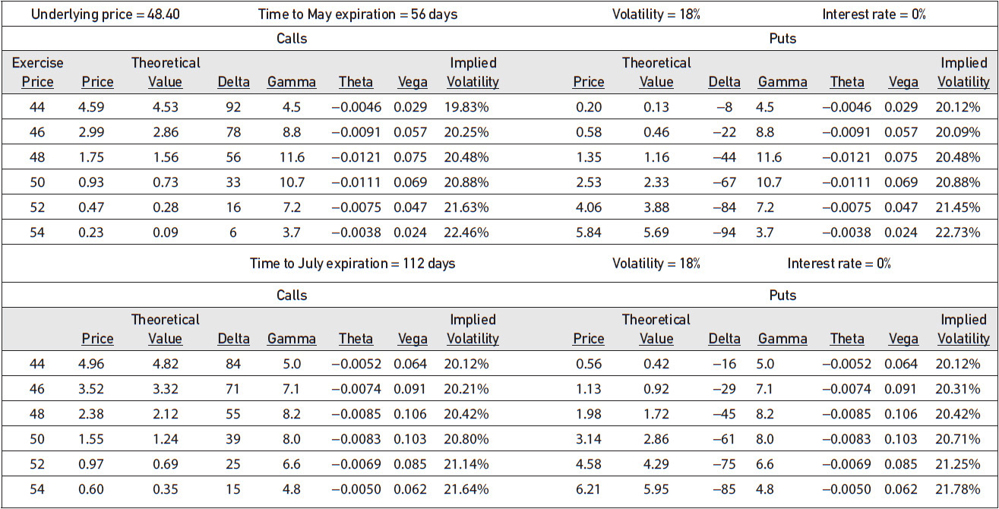

<!-- source:block 0460ad73fb6b668d -->

> [!quote]- English 13
> Short straddles and strangles

短跨和宽跨式

<!-- source:block e009a5c03745a5c8 -->

> [!quote]- English 14
> Call or put ratio spreads—sell more than buy

看涨或看跌比率价差-卖出多于买入

<!-- source:block fd7abc38e854d40c -->

> [!quote]- English 15
> Long butterflies

多头蝶式价差

<!-- source:block 277abb27aa5d3f8e -->

> [!quote]- English 16
> Short calendar spreads

短期日历价差

<!-- source:block 8c21d716ee1424e3 -->

> [!quote]- English 17
> Which of these categories is likely to represent the best spreading opportunity? And within each category, which specific spread might represent the best risk-reward tradeoff?

这些类别中哪一个可能代表最佳的价差机会？在每个类别中，哪个特定的价差可能代表最佳的风险回报权衡？

<!-- source:block 531bcd1bb086b4cb -->

> [!quote]- English 18
> For the moment, let’s focus on May options. Having eliminated the possibility of calendar spreads, any spread we choose will necessarily have a negative gamma and negative vega. But with 12 different May options available (6 calls and 6 puts), it’s possible to construct a number of spreads that fall into this category. How can we make an intelligent decision about which spread might be best?

目前，让我们关注五月的选择。消除了日历价差的可能性后，我们选择的任何价差都必然具有负Gamma和负Vega。但有12种不同的5月期权可用（6个看涨和6个看跌），可以构建属于这一类别的多种价差。我们如何才能明智地决定哪种价差可能是最好的？

<!-- source:block c98bc347b08ca54a -->

> [!quote]- English 19
> Initially, let’s consider the three strategies shown in Figure 13-2: a short straddle that has been done in a 4:3 ratio to make it closer to delta neutral (Spread 1), a ratio call spread (Spread 2), and a long put butterfly (Spread 3). Each spread is approximately delta neutral and, as we would expect, has a positive theoretical edge. How can we evaluate the relative merits of each spread?

首先考察图 13-2 中的三种策略：按 4:3 比率构建、使其更接近 Delta 中性的空头跨式（价差 1）；比率看涨价差（价差 2）；以及多头看跌蝶式价差（价差 3）。每个价差都大致保持 Delta 中性，并且如预期一样具有正的理论优势。我们应如何评估各价差的相对优劣？

<!-- source:block edfe2973b9b77ecf -->

*图13-2 / Figure 13-2*

<!-- source:block 183dea075cee8e0c -->

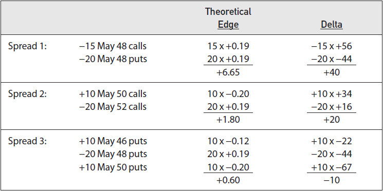

<!-- source:block 890eac720b0d00b1 -->

> [!quote]- English 21
> Initially, it may appear that Spread 1 is best because it has the greatest theoretical edge. If the volatility estimate of 18 percent turns out to be correct, Spread 1 will show a profit of 6.65, Spread 2 a profit of 1.80, and Spread 3 a profit of only .60.

最初，Spread 1似乎是最好的，因为它具有最大的理论优势。如果18%的波动率估计被证明是正确的，那么价差1将显示6.65的利润，价差2将显示1.80的利润，价差3将显示0.60的利润。

<!-- source:block 4dbc89d58897269d -->

> [!quote]- English 22
> But is theoretical edge our only concern? If this is true, we can simply do each spread in larger and larger size to make the theoretical edge as big as we want. Instead of doing Spread 2 in our original size of 10 × 20, we can increase the size fivefold to 50 × 100. This will also increase the theoretical edge fivefold to 9.00. This ostensibly makes Spread 2 a better strategy than Spreads 1 and 3. Clearly, theoretical edge cannot be the only consideration.

但理论优势是我们唯一关心的问题吗？如果这是真的，我们可以简单地将每次价差的规模越来越大，以使理论优势尽可能大。我们可以将大小增加五倍至50 × 100，而不是以最初的10 × 20大小进行Spread 2。这也将使理论优势增加五倍至9.00。表面上，这使得Spread 2比Spread 1和3成为更好的策略。显然，理论优势不能是唯一的考虑因素。

<!-- source:block 36a2c488bbf5d0c0 -->

> [!quote]- English 23
> Theoretical edge is only an indication of what we expect to earn if we are right about market conditions. Because there is no guarantee that we will be right, we must give at least as much consideration to the question of risk. If we are wrong about market conditions, how badly might we be hurt?

理论优势只是表明，如果我们对市场状况的判断正确，我们期望获得什么。因为不能保证我们是正确的，所以我们必须至少同样多地考虑风险问题。如果我们对市场状况的判断有误，我们会受到多大的伤害？

<!-- source:block 26d883eec2f9e14b -->

> [!quote]- English 24
> In order to focus on the risk considerations, let’s change the size of Spreads 2 and 3 so that their theoretical edge is approximately equal to that of Spread 1. We can achieve this by increasing the size of Spread 2 to 35 × 70 and increasing the size of Spread 3 to 100 × 200 × 100. The spreads in their new sizes with their total theoretical edge and risk sensitivities are shown in Figure 13-3. With all three spreads having a similar theoretical edge, we can now focus on the risks associated with each spread.

为了关注风险因素，让我们改变价差2和价差3的大小，使其理论边缘近似等于价差1的边缘。我们可以通过将Spread 2的大小增加到35 × 70，并将Spread 3的大小增加到100 × 200 × 100来实现这一点。图13-3显示了新规模下的价差及其总理论边际和风险敏感度。由于这三种价差都具有类似的理论优势，我们现在可以关注与每种价差相关的风险。

<!-- source:block aff103b4157a849d -->

*图13-3 / Figure 13-3*

<!-- source:block 59313f6eb8da3049 -->

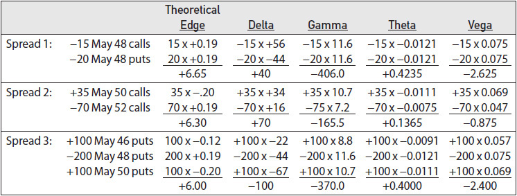

<!-- source:block 3b049aa88bfb154e -->

> [!quote]- English 26
> As with all volatility positions, one consideration is the possibility of a large price move in the underlying contract. Because each strategy has a negative gamma, any large move will hurt the position. But will each spread be hurt to the same degree? Because Spread 2 has the smallest negative gamma (–165.5), we might conclude that it has the smallest risk with respect to a large move. But this is true only under current market conditions. As market conditions change, all risk measures, including the gamma, will almost certainly change. If the underlying contract makes a very large move such that current market conditions no longer apply, it may not be clear what will happen to the risks associated with each spread.

与所有波动率头寸一样，一个考虑因素是标的合约价格大幅波动的可能性。由于每个策略都有负的Gamma，任何大幅变动都会损害头寸。但每个价差都会受到同样程度的伤害吗？由于价差2的负Gamma最小（-165.5），因此我们可能会得出结论，它的大幅波动风险最小。但这只有在当前的市场条件下才成立。随着市场条件的变化，包括Gamma在内的所有风险指标几乎肯定会发生变化。如果标的合约发生非常大的波动，导致当前的市场条件不再适用，那么可能不清楚与每个价差相关的风险会发生什么。

<!-- source:block c18a4342504fc4a6 -->

> [!quote]- English 27
> It will be easier to analyze the relative risks of the spreads if we construct a graph of the theoretical profit or loss with respect to movement in the underlying contract. This has been done in Figure 13-4. We can see that each spread does indeed lose value as the underlying price moves either up or down.3 However, we can also see that if there is a very large move, the spread characteristics begin to diverge. On both the upside and downside, the losses from Spread 1, the short straddle, continue to increase, resulting in potentially unlimited risk in either direction. Spread 2, the ratio spread, has unlimited upside risk. On the downside, though, it flattens out and eventually results in a very small profit. Spread 3, the long butterfly, flattens out on both the upside and downside, so its risk is limited regardless of direction.

如果我们构建一张关于标的合约变动的理论利润或损失的图表，那么分析价差的相对风险就会更容易。这已在图13-4中完成。我们可以看到，随着标的价格的上涨或下跌，每个价差确实会失去价值。但是，我们也可以看到，如果出现非常大的波动，价差特征开始出现分化。无论是在上行还是下行，价差1（空头跨式）的损失继续增加，导致任何方向的潜在风险都是无限的。价差2（比率价差）具有无限的上行风险。不过，缺点是，它会破产，最终只带来微薄的利润。价差[^ovp13-3]，即多头蝶式价差，在上行和下行中都出现，因此无论方向如何，其风险都是有限的。 3

<!-- source:block c8a611f5abba6a94 -->

*图13-4 / Figure 13-4*

<!-- source:block 8d4ed2bbe31b25e5 -->

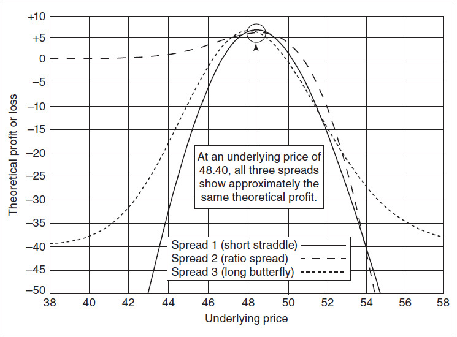

<!-- source:block 611cc46ad26a8adb -->

> [!quote]- English 29
> Which spread is best? That depends on what the trader is worried about. If the trader is oblivious to the risk, it won’t matter which spread he chooses. On average, each position will show a profit of approximately 6.00. If, however, the trader is more worried about a large downward move in the market, then perhaps Spread 2 is best. And if the trader is unwilling to accept the risk of unlimited loss in either direction, then perhaps Spread 3 is best.

哪个价差最好？这取决于交易员担心什么。如果交易者没有注意到风险，那么他选择哪个价差就不重要了。平均而言，每个头寸的利润约为6.00。然而，如果交易者更担心市场大幅下跌，那么也许价差2是最好的。如果交易者不愿意接受任何方向无限损失的风险，那么也许价差3是最好的。

<!-- source:block 148279389147a41b -->

> [!quote]- English 30
> In addition to the possibility of a large move, all three positions are exposed to the risk of an incorrect volatility estimate. Because each spread has a negative vega, there will be no problem if, over the life of the option, volatility turns out to be lower than 18 percent. In such a case, the spreads will show a profit greater than originally expected. On the other hand, if volatility turns out to be greater than 18 percent, this could present a problem. What will happen if volatility turns out to be 20 or 25 percent or some higher number? Each spread will be hurt because of the negative vega, but will they be hurt to the same degree?

除了大幅变动的可能性外，所有三个头寸都面临波动率估计不正确的风险。由于每个价差都有负的Vega，因此如果在期权有效期内波动率低于18%，也不会有任何问题。在这种情况下，价差将显示出比最初预期更大的利润。另一方面，如果波动率超过18%，这可能会带来问题。如果波动率达到20%或25%或更高的数字，会发生什么？每个价差都会因为负Vega而受到伤害，但它们会受到同样程度的伤害吗？

<!-- source:block 27ea7f8d85148b6d -->

> [!quote]- English 31
> Because Spread 2 has the smallest vega (–.875), we might initially conclude that it has the smallest volatility risk. But the vega, like the gamma, changes as market conditions change. If we raise volatility, the vega of Spread 1, the short straddle, will remain essentially unchanged because the vega of an at-the-money option is constant with respect to changes in volatility. But the vega of Spread 3, the long butterfly, will decline because the vega of in-the-money and out-of-the-money options (the May 46 and May 50 puts) will tend to increase as volatility rises. With Spread 2, the vega of both options, the May 50 call and the May 52 call, will begin to increase, so it’s not immediately clear what will happen if we increase volatility.

由于Spread 2的Vega最小（-.875），因此我们最初可能会得出结论，它的波动率风险最小。但Vega与Gamma一样，会随着市场条件的变化而变化。如果我们提高波动率，那么价差1（空头跨式）的Vega将基本保持不变，因为平值期权的Vega对于波动率的变化是恒定的。但价差3（多头蝶式价差）的Vega将会下降，因为随着波动率的上升，价内期权和价外期权（5月46日和5 月到期、行权价为 50 的看跌期权）的Vega将会增加。随着价差2，两种期权（5 月到期、行权价为 50 的看涨期权和5 月到期、行权价为 52 的看涨期权）的Vega将开始增加，因此目前尚不清楚如果我们增加波动率会发生什么。

<!-- source:block 655c441a05a7163e -->

> [!quote]- English 32
> We can analyze the volatility characteristics of each spread by constructing a graph of each spread’s value with respect to changing volatility. This is shown in Figure 13-5. With a large change in volatility, the values of the three positions begin to diverge. If volatility rises, the spreads begin to lose value until, at some point, the potential profit becomes a loss. In terms of volatility risk, we might logically ask, how high can volatility rise before we begin to lose money? That is, we might want to determine the breakeven volatility, or *implied volatility*, for each spread. This is simply an extension of the general definition of implied volatility: the volatility over the life of an option, or options, at which the position will, in theory, show neither a profit nor a loss. In Figure 13-5, we can see that the breakeven volatility for Spread 1 (the short straddle) is approximately 21 percent, for Spread 2 (the ratio spread) approximately 23 percent, and for Spread 3 (the long butterfly) approximately 21.5 percent. This seems to confirm that Spread 2, the ratio spread, is the least risky with respect to volatility.

我们可以通过构建每个价差的价值相对于波动率变化的图表来分析每个价差的波动率特征。如图13-5所示。随着波动率的大幅变化，三个头寸的价值开始出现分歧。 如果波动率上升，价差开始失去价值，直到在某个时候潜在的利润变成损失。就波动率风险而言，我们可能会逻辑上问，波动率能上升到多高才能开始赔钱？ 也就是说，我们可能想要确定每个价差的盈亏平衡波动率或隐含波动率。 这仅仅是隐含波动率一般定义的延伸：一个或多个期权在其有效期内的波动率，理论上，在该波动率下，头寸既不会显示盈利也不会显示亏损。 在图13-5,中，我们可以看到，价差1（空头跨式）的盈亏平衡波动率约为21 %，价差2（比例价差）约为23 %，价差3（多头蝶式价差）约为21.5 %。 这似乎证实了价差2,（比率价差）在波动率方面风险最小。

<!-- source:block e23529e8f033d4a9 -->

*图13-5 / Figure 13-5*

<!-- source:block 2dd01db7bfc8bc20 -->

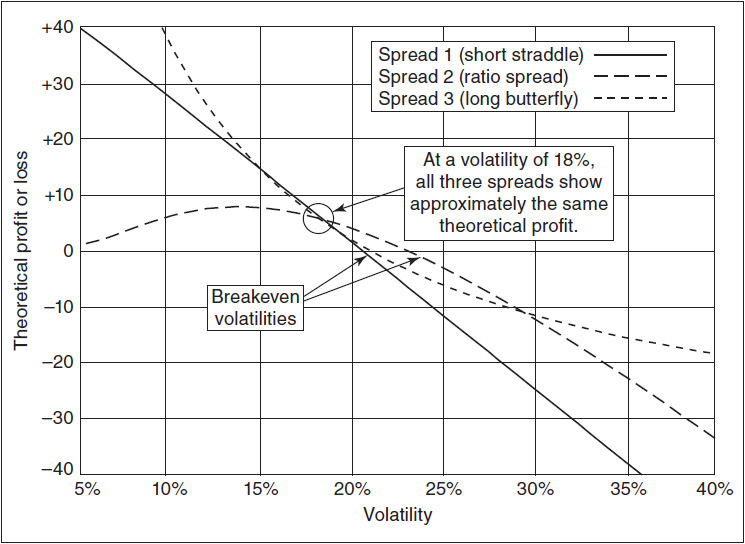

<!-- source:block 8f540e1d39bc97c3 -->

> [!quote]- English 34
> However, if volatility turns out to be higher than expected, why should it stop at 23 percent? What will happen if volatility turns out to be much higher, perhaps 30 percent or even 40 percent? Eventually, Spread 2, the ratio spread, which initially seemed to carry the least volatility risk, will begin to lose value at almost the same rate as Spread 1, the short straddle. On the other hand, at higher volatilities, the graph of Spread 3, the long butterfly, begins to flatten out, suggesting that there is a limit to how much it can lose. Of course, we know this because a butterfly has both limited profit potential and limited risk.

然而，如果波动率高于预期，为什么要停在23%呢？如果波动率高得多，也许是30%甚至40%，会发生什么？最终，最初似乎具有最小波动率风险的价差2（比率价差）将开始以几乎与价差1（空头跨式）相同的速度贬值。另一方面，在波动率较高的情况下，多头蝶式价差Spread 3的图表开始变平，这表明它的损失是有限的。当然，我们知道这一点，因为蝶式价差的利润潜力和风险都有限。

<!-- source:block f388664d83f88637 -->

> [!quote]- English 35
> Although we might worry that volatility will increase to some value greater than 18 percent, we might also consider what will happen if volatility turns out to be less than 18 percent. For the same reason that rising volatility will hurt, falling volatility should help. In Figure 13-5, we can see that as volatility falls below 18 percent, the profit resulting from each spread does indeed increase. However, as volatility falls well below 18 percent, the profit from Spread 2 begins to decline, eventually falling to almost 0. On the other hand, the profit from Spread 3 begins to accelerate.

虽然我们可能会担心波动率会增加到大于18%的某个值，但我们也可能会考虑如果波动率低于18%会发生什么。出于同样的原因，波动率上升会造成伤害，波动率下降应该会有所帮助。在图13-5中，我们可以看到，当波动率降到18%以下时，每一个价差带来的利润确实增加了。然而，随着波动率降至18%以下，价差2的利润开始下降，最终几乎降至0。另一方面，价差3的利润开始加速增长。

<!-- source:block f09e89f562319bd2 -->

> [!quote]- English 36
> The shapes of the graphs in Figure 13-5 are a result of each position’s *volga*—the sensitivity of the vega to a change in volatility. (For a discussion of the volga, see Chapter 9, specifically Figure 9-15.) Spread 1 has a volga close to 0; its vega remains constant regardless of changes in volatility. Spread 2 has a negative volga. As volatility rises, the vega becomes more negative; as volatility falls, the vega becomes less negative. This means that as volatility rises or falls, changes in volatility work against the position, accelerating the rate of loss as volatility rises and reducing the rate of profit as volatility falls. In contrast, Spread 3 has positive volga. Changes in volatility work in favor of the position, reducing the rate of loss as volatility rises and increasing the rate of profit as volatility falls.

图13-5中图表的形状是每个头寸volga的结果——Vega对波动率变化的敏感性。(For关于伏尔加河的讨论，请参阅第9章，特别是图9-15。）价差1的volga接近0;无论波动率如何变化，其Vega都保持不变。价差2的伏尔加舞曲为负。随着波动率上升，Vega指数变得更加负;随着波动率下降，Vega指数变得更加负。这意味着，随着波动率的上升或下降，波动率的变化会对头寸产生不利影响，随着波动率的上升而加速亏损率，随着波动率的下降而降低利润率。相比之下，Spread 3的伏尔加舞曲呈阳性。波动率的变化有利于头寸，随着波动率上升，降低损失率，并随着波动率下降，提高利润率。

<!-- source:block b68417a15fce31e5 -->

> [!quote]- English 37
> Although Figure 13-5 can be interpreted as the risk of using an incorrect volatility over the life of the options, it can also be interpreted as the risk of a sudden change in implied volatility. In terms of implied volatility risk, Spread 3 probably represents the best value. If implied volatility begins to rise, Spread 3 will initially lose money more quickly than Spread 2, but if implied volatility rises dramatically, Spread 3 will begin to outperform both Spreads 1 and 2 because the rate of loss will decline. And if implied volatility falls, Spread 3 will outperform both Spreads 1 and 2, increasing in value more quickly at lower volatilities.

尽管图13-5可以解释为在期权有效期内使用错误波动率的风险，但它也可以解释为隐含波动率突然变化的风险。就隐含波动率风险而言，价差3可能代表了最佳价值。如果隐含波动率开始上升，那么价差3最初亏损的速度将比价差2更快，但如果隐含波动率急剧上升，那么价差3将开始优于价差1和2，因为亏损率将会下降。如果隐含波动率下降，则价差3的表现将优于价差1和2，在波动率较低的情况下价值增值得更快。

<!-- source:block 0ce97e6a35809861 -->

> [!quote]- English 38
> Why are risk considerations so important? Every trader knows that there are times when a strategy will result in a profit and times when it will result in a loss. No one wins all the time. In the long run, however, a good trader’s profits will more than offset his losses. For example, suppose that a trader chooses a strategy that will show a profit of \$7,000 half the time and will show a loss of \$5,000 the other half of the time. In the long run, the trader will show an average profit of \$1,000. Suppose, though, that the first time that the trader executes the strategy, she loses \$5,000, and the trader only has \$3,000? Now the trader will not be able to stay in business for all those times when he is fortunate enough to show a profit of \$7,000. Every trader knows that it is only over long periods of time that good luck and bad luck even out. Hence no trader will initiate a strategy where short-term bad luck might end his trading career.

为什么风险考虑如此重要？每个交易者都知道，策略有时会带来利润，有时会带来损失。没有人总是获胜。然而，从长远来看，一个优秀交易者的利润将足以抵消他的损失。例如，假设交易者选择的策略一半时间显示利润7,000美元，另一半时间显示亏损5,000美元。从长远来看，交易员的平均利润将为1,000美元。不过，假设交易员第一次执行该策略时，她损失了5,000美元，而交易员只有3,000美元？现在，当交易员幸运地获得7,000美元的利润时，他将无法继续营业。每个交易者都知道，只有在很长一段时间内，好运气和坏运气才会平衡。因此，没有交易者会发起短期厄运可能会结束他的交易生涯的策略。

<!-- source:block 2f34f473fea065d8 -->

> [!quote]- English 39
> Financial officers at large firms know that it is much easier to manage a steady cash flow than one that swings wildly. In a sense, every trader is his own financial officer. He must sensibly manage his finances so that he can avoid being ruined by the periods of back luck that will inevitably occur, no matter how skillfully he trades.

大公司的财务官员知道，管理稳定的现金流比管理剧烈波动的现金流容易得多。从某种意义上说，每个交易员都是自己的财务官员。他必须明智地管理自己的财务，这样他就可以避免因不可避免的运气不佳时期而破产，无论他的交易多么熟练。

<!-- source:block d8efe48b7e60295c -->

## 实务考量 / Practical Considerations

<!-- source:block 1782c5e26532b31a -->

> [!quote]- English 40
> Considering only the gamma and vega risk, Spread 3 probably has the best risk characteristics. It has limited risk if there is a large move in either direction and performs better than either Spread 1 or Spread 2 if there is a dramatic change in volatility. This does not mean that Spread 3 performs better under all conditions. If the underlying market makes any downward move or there is a small to moderate upward move, Spread 2 outperforms Spreads 1 and 3. Spread 2 also has an advantage if there is a moderate increase in volatility.

仅考虑Gamma和Vega风险，Spread 3可能具有最好的风险特征。如果任何一个方向都出现大幅波动，那么它的风险有限，并且如果波动率发生巨大变化，它的表现优于价差1或价差2。这并不意味着Spread 3在所有条件下都表现得更好。如果标的市场出现任何向下移动或小幅至温和的向上移动，则价差2的表现优于价差1和3。如果波动率适度增加，则价差2也具有优势。

<!-- source:block 0c6d7df119e314de -->

> [!quote]- English 41
> Even if we assume that Spread 3, the long butterfly, offers the best theoretical risk-reward tradeoff, it may have some practical drawbacks. Butterflies are actively traded in many markets, but Spread 3 is a three-sided spread, as opposed to Spreads 1 and 2, which are two-sided spreads. A three-sided spread may be more difficult to execute in the marketplace and also may cost more in terms of the bid-ask spread. If a trader wants to execute the complete spread at one time, he may not be able to do so at his target prices. And if he tries to execute one leg at a time, he will be at risk from adverse changes in the market until the other legs can be executed.

即使我们假设Spread 3（多头蝶式价差）提供了最好的理论风险回报权衡，它也可能存在一些实际缺陷。蝴蝶在许多市场上交易活跃，但价差3是三方价差，而价差1和2是双边价差。三方价差可能更难在市场上执行，而且买卖价差也可能更贵。如果交易者想要一次执行完整的价差，他可能无法以目标价格做到这一点。如果他试图一次执行一条腿，他将面临市场不利变化的风险，直到其他腿可以执行。

<!-- source:block bd148406514181e0 -->

> [!quote]- English 42
> Additionally, there is the question of market liquidity. In order to obtain a theoretical edge commensurate with Spreads 1 and 2, it was necessary to increase the size of the butterfly to 100 × 200 × 100. If there is insufficient liquidity in the May 46, 48, and 50 puts to support this size, it may not be possible to execute the butterfly in the size required to meet the trader’s profit objective. Alternatively, it may be possible to execute part of the spread at favorable prices, but as the size increases, the prices may become less satisfactory. Moreover, for a retail customer, the increased size may entail greater transaction costs.

此外，还有市场流动性问题。为了获得与价差1和2相当的理论优势，有必要将蝶式价差的大小增加到100 × 200 × 100。如果5月46日、48日和50日看跌期权的流动性不足来支持这一规模，那么可能无法执行达到交易员盈利目标所需规模的蝶式价差交易。或者，也可以以有利的价格执行部分价差，但随着规模的增加，价格可能会变得不太令人满意。此外，对于零售客户来说，规模的增加可能会带来更高的交易成本。

<!-- source:block a0760153284219bb -->

> [!quote]- English 43
> If trading considerations make Spread 3 impractical, a trader may have to choose between Spreads 1 (short straddle) and 2 (ratio spread). If this happens, Spread 2 is the clear winner. It allows for a much greater margin for error in both underlying price change (gamma risk) and volatility (vega risk). A trader who is given a choice between these two spreads will strongly prefer Spread 2.

如果交易考虑导致价差3不切实际，交易员可能必须在价差1（空头跨式）和2（比例价差）之间进行选择。如果发生这种情况，则Spread 2是明显的赢家。 它允许标的价格变化（Gamma风险）和波动率（Vega风险）的误差保证金更大。在这两个价差之间做出选择的交易者将强烈喜欢价差2。

<!-- source:block c03c8dfcec1044e7 -->

> [!quote]- English 44
> In the real world, the choice of spreads is not always clear. One spread may be superior with respect to one type of risk, while a different spread may be superior with respect to a different risk. The ease with which a spread can be executed, as well as the cost of execution, will also play a role.

在现实世界中，价差的选择并不总是明确的。一种价差可能对一种类型的风险更有利，而不同的价差可能对不同的风险更有利。价差执行的难易程度以及执行成本也将发挥作用。

<!-- source:block 9978c4b80209dec6 -->

> [!quote]- English 45
> Let’s consider three new spreads—Spread 4 (a short put calendar spread), Spread 5 (a diagonal call spread), and Spread 6 (a put diagonal ratio spread). In order to again focus on risk, the size of each spread has been adjusted so that the theoretical edge of all three spreads is similar. The total theoretical edge and risk sensitivities of each spread (all taken from the theoretical evaluation table in Figure 13-1) are shown in Figure 13-6.

让我们考虑三种新的价差——价差4（卖空日历价差）、价差5（对角线看涨价差）和价差6（看跌对角线比例价差）。为了再次关注风险，每个价差的规模都进行了调整，以便所有三个价差的理论优势相似。每个价差的总理论优势和风险敏感度（均取自图13-1中的理论评估表）如图13-6所示。

<!-- source:block a7b197a898210ecd -->

*图13-6 / Figure 13-6*

<!-- source:block 8e1da8d29d69b216 -->

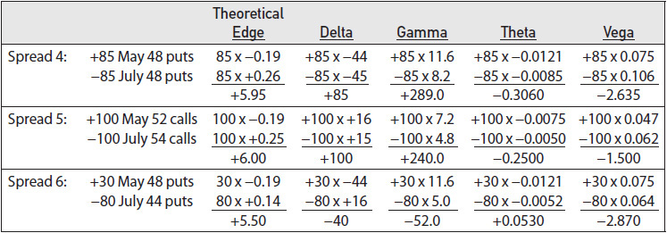

<!-- source:block 55e7961011852666 -->

> [!quote]- English 47
> Because each spread has a negative vega, we will again want to consider the risk that volatility will turn out to be greater than our estimate of 18 percent. The sensitivity of each spread to increasing volatility is shown in Figure 13-7. We can see that Spread 4 has an implied volatility of approximately 20.5 percent, Spread 5 approximately 22 percent, and Spread 6 approximately 20 percent. If rising volatility is our primary concern, Spread 5, the diagonal call spread, seems to entail the lowest risk. However, although Spread 5 loses the least in a rising-volatility market, it also shows a smaller profit in a falling-volatility market. This may seem like a reasonable tradeoff, except that with Spread 5, the positive effects of falling volatility begin to decline very quickly. This is due to the negative volga associated with the position. As volatility falls, the vega becomes less negative until, at a volatility of approximately 10 percent, the vega falls to 0. Spread 6, the put diagonal ratio spread, has an even larger negative volga; its vega turns positive if volatility falls below 11 percent. In contrast to both Spreads 5 and 6, Spread 4, the short calendar spread, has a volga of 0. Its vega remains constant regardless of whether volatility rises or falls. It offers an equal tradeoff between losses when volatility rises and profits when volatility falls.

由于每个价差都有负的Vega，因此我们再次需要考虑波动率大于我们估计的18%的风险。每个价差对波动率增加的敏感性如图13-7所示。我们可以看到，价差4的隐含波动率约为20.5%，价差5约为22%，价差6约为20%。如果波动率上升是我们的主要担忧，那么价差5（对角线看涨价差）的风险似乎最低。然而，尽管价差5在波动率上升的市场中损失最小，但在波动率下降的市场中利润也较小。这似乎是一个合理的权衡，除了对于价差5，波动率下降的积极影响开始迅速下降。这是由于与该头寸相关的负伏尔加河。随着波动率下降，Vega指数变得不那么负，直到波动率约为10%时，Vega指数降至0。价差6（看跌对角线比率价差）的负volga甚至更大;如果波动率低于11%，其Vega就会变成正值。与价差5和6相反，价差4（短日历价差）的伏尔加值为0。无论波动率上升还是下降，其Vega都保持不变。它在波动率上升时的损失和波动率下降时的利润之间提供了平等的权衡。

<!-- source:block 4716a911b98380c2 -->

*图13-7 / Figure 13-7*

<!-- source:block 6110dd625536d71f -->

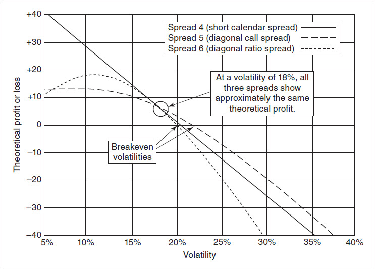

<!-- source:block 48140fa42343187b -->

> [!quote]- English 49
> What about the gamma risk of each spread? Here we have a situation where not all the spreads have a gamma with the same sign. Spread 6, the diagonal ratio spread, has a negative gamma, so it should be hurt by a large move in the underlying. Spreads 4 and 5, however, have a positive gamma and should profit from a large move. The graphs of the positions with respect to changes in the underlying price are shown in Figure 13-8.

每次价差的Gamma风险如何？这里我们遇到的情况是，并非所有的价差都具有相同符号的Gamma。价差6（对角线比价差）具有负Gamma，因此它应该会受到基础大幅变动的损害。然而，价差4和5具有正的Gamma，并且应该会从大幅波动中获利。标的价格变化的头寸图表如图13-8所示。

<!-- source:block 80b65fcb4e6cd5bd -->

*图13-8 / Figure 13-8*

<!-- source:block acdc294fdaeb1397 -->

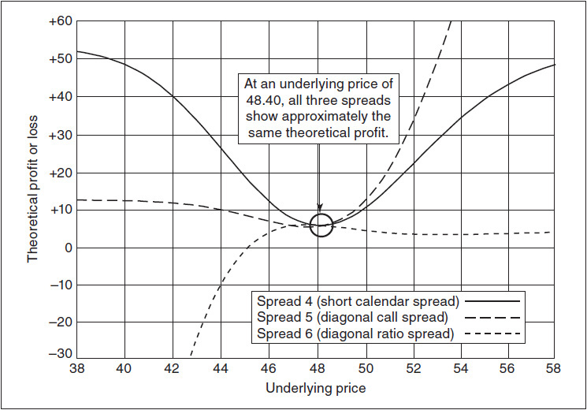

<!-- source:block 1178a3d261043e32 -->

> [!quote]- English 51
> We can see in Figure 13-8 that although Spread 6, the diagonal ratio spread, will be hurt by a move in the price of the underlying contract, the degree to which the move will hurt depends on the direction. With an upward move, the potential profit will decline. But even with a very large upward move, the spread will always retain some profit. On the downside, however, the spread’s profit rapidly disappears, turning into a potentially unlimited loss if the downward move is large enough.

从图13-8中我们可以看到，尽管价差6（对角线比例价差）会因标的合约价格的变动而受到损害，但变动的损害程度取决于方向。随着上升，潜在利润就会下降。但即使出现非常大的上涨，价差也总是会保留一些利润。然而，不利的一面是，价差的利润迅速消失，如果向下移动足够大，就会变成潜在的无限损失。

<!-- source:block b77c03612e698f5d -->

> [!quote]- English 52
> Spread 4, the short put calendar spread, and Spread 5, the diagonal call spread, both have positive gamma and will profit from a large move. Unlike Spread 4, though, which shows approximately equal profit in either direction, Spread 5 shows a greater profit in an upward move and a smaller profit in a downward move.4

价差 4（空头看跌日历价差）和价差 5（对角看涨价差）都具有正 Gamma，因此都会从市场的大幅变动中获利。但与价差 4 在两个方向上的利润大致相等不同，价差 5 在上涨时利润更大，在下跌时利润较小。 [^ovp13-4]

<!-- source:block 63ada5eb4c458922 -->

> [!quote]- English 53
> There is, of course, a tradeoff between gamma and theta. If movement in the underlying price will increase the value of Spreads 4 and 5 (positive gamma), the passage of time with no movement will reduce the value (negative theta). It may be worthwhile to look at how much time can pass before each spread loses its theoretical edge. This is shown in Figure 13-9.

当然，在Gamma和Theta之间有一个折衷。如果标的价格的变动将增加价差4和5的价值（正Gamma），则随着时间的推移而没有变动，该价值将减少（负Theta）。 我们不妨看看，在每一个价差失去其理论优势之前，还需要多少时间。如图13-9所示。

<!-- source:block cd0f33abda61af27 -->

*图13-9 / Figure 13-9*

<!-- source:block 6ed94d3a86a717d3 -->

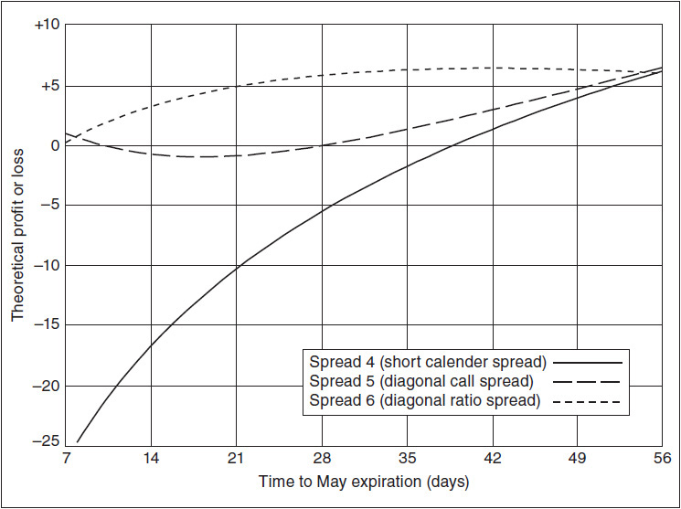

<!-- source:block ff31f736cdf61bf3 -->

> [!quote]- English 55
> In Figure 13-9, Spread 4 exhibits the typical decay profile for a short calendar spread that is approximately at the money. As time passes, the position loses value at an increasingly greater rate. Spread 5, the diagonal call spread, also loses value as time passes. But after five weeks the decay turns positive, so that if nothing happens in the underlying market the position will eventually show a small profit. Spread 6, the diagonal ratio spread, initially shows a small increase in value as time passes. Eventually, though, this position is also subject to decay. After seven weeks, its potential profit disappears completely.

在图13-9,价差4中，显示了大约ATM的短日历价差的典型衰减曲线。随着时间的推移，该头寸的价值以越来越快的速度失去。价差5,对角线看涨期权价差也随着时间的推移而失去价值。 但五周后，衰退变为正值，因此如果标的市场没有任何变化，该头寸最终将出现小幅利润。Spread 6,对角线比Spread，最初显示值随着时间的推移略有增加。 不过，最终，这一头寸也会衰落。七周后，其潜在利润完全消失。

<!-- source:block cb3a74be47a500f3 -->

> [!quote]- English 56
> As must be obvious by now, the choice of spreads is never simple. As with all trading decisions, it is a question of risk and reward. Although there are many risks with which an option trader must deal, he will often have to ask himself which risk represents the greatest threat. Sometimes, in order to avoid one type of risk, he will be forced to accept a different risk. Even if the trader is willing to accept some risk in a certain area, he may decide that he will only do so to a limited degree. Then he may have to accept increased risks in other areas.

正如现在必须清楚的那样，价差的选择从来都不简单。与所有交易决策一样，这是一个风险和回报的问题。尽管期权交易者必须应对许多风险，但他经常不得不问自己哪种风险是最大的威胁。有时，为了避免一种风险，他会被迫接受另一种风险。即使交易者愿意接受某个领域的一些风险，他也可能会决定只会在有限的程度上这样做。那么他可能不得不接受其他领域增加的风险。

<!-- source:block d997a9b575cad827 -->

> [!quote]- English 57
> If given the choice between several different strategies, a trader can use a computer to determine the risk characteristics of the strategies under different market conditions. Unfortunately, it may not always be possible to analyze the choices in such detail. A trader may not have immediate access to the necessary computer support, or market conditions may be changing so rapidly that if he fails to make an immediate decision, opportunity may quickly pass him by. In such cases, the trader will often have to rely on his instincts in choosing a strategy. Although there is no substitute for experience, most traders quickly learn an important rule: *straddles and strangles are the riskiest of all spreads*. This is true whether one buys or sells these strategies. New traders sometimes assume that the purchase of straddles and strangles is not especially risky because the risk is limited. However, it can be just as painful to lose money day after day when one buys a straddle or strangle and the market fails to move as it is to lose the same amount of money all at once when one sells a straddle and the market makes a violent move. Of course, a trader who is right about volatility can reap large rewards from straddles and strangles. But an experienced trader knows that such strategies offer the least margin for error and will therefore prefer strategies with more desirable risk characteristics.

如果可以在几种不同的策略之间做出选择，交易者可以使用计算机来确定不同市场条件下策略的风险特征。不幸的是，可能并不总是能够如此详细地分析选择。交易员可能无法立即获得必要的计算机支持，或者市场条件可能变化如此之快，如果他未能立即做出决定，机会可能很快就会与他擦肩而过。在这种情况下，交易者通常不得不依靠自己的直觉来选择策略。尽管经验是无法替代的，但大多数交易者很快就会学到一条重要规则：跨式和宽跨式是所有价差中风险最大的。无论购买还是出售这些策略，情况都是如此。新交易者有时会认为购买跨式和宽跨式的风险并不是特别大，因为风险有限。然而，当一个人购买跨式或宽跨式时，日复一日地赔钱，而市场却没有动静，就像当一个人出售跨式或宽跨式时，同时损失同样多的钱一样痛苦。市场发生剧烈波动。当然，一个对波动率判断正确的交易者可以从跨仓和套牢中获得巨大回报。但一个有经验的交易者知道，这样的策略提供了最小的误差幅度，因此会更喜欢具有更理想的风险特征的策略。

<!-- source:block 1ea174a31b118339 -->

## 应预留多大的误差空间？ / How Much Margin for error?

<!-- source:block 197e33615efccfa1 -->

> [!quote]- English 58
> What is a reasonable margin for error in assessing the risk of a position, particularly when it comes to volatility risk? There is no clear answer because it will usually depend on the volatility characteristics of a particular market, as well as the trader’s experience in that market. In some cases, 5 percentage points may be an extremely large margin for error, and the trader will feel very confident with any strategy passing such a test. In other cases, 5 percentage points may be almost no margin for error at all, and the trader will find that the strategy is a constant source of worry.

在评估头寸风险时，合理的误差幅度是多少，特别是在波动率风险方面？没有明确的答案，因为它通常取决于特定市场的波动率特征，以及交易者在该市场的经验。在某些情况下，5个百分点可能是一个非常大的误差保证金，交易员会对任何通过此类测试的策略感到非常有信心。在其他情况下，5个百分点可能几乎根本没有误差，交易者会发现该策略是一个持续的担忧来源。

<!-- source:block 6d01779382f3469b -->

> [!quote]- English 59
> Rather than focusing on margin for error, a better approach might be to focus on the correct size in which to do a spread given a known margin for error. Practical trading considerations aside, a trader should always choose the spread with the best risk-reward characteristics. But sometimes even the best spread will have only a small margin for error and consequently will entail significant risk. In such a case, a trader, if he wants to make a trade, ought to do so in small size. If, however, a trader can execute a spread with a very large margin for error, he ought to be willing to do the spread in a much larger size.

与其关注误差幅度，更好的方法可能是关注在已知误差幅度的情况下进行价差的正确大小。撇开实际交易考虑不谈，交易者应该始终选择具有最佳风险回报特征的价差。但有时，即使是最好的价差也只有很小的误差幅度，因此会带来巨大的风险。在这种情况下，如果交易者想进行交易，就应该进行小规模交易。然而，如果一个交易者可以执行一个非常大的误差幅度的价差，他应该愿意做一个更大的价差。

<!-- source:block e469ce751e9a6c2d -->

> [!quote]- English 60
> Consider a trader whose best estimate of volatility in a certain market is 25 percent. If implied volatility is lower than 25 percent, the trader will look for positions with a positive vega. If the best positive-vega strategy the trader can find is a 2 × 1 ratio spread with an implied volatility of 23 percent (only a 2-percentage-point margin for error), he will almost certainly keep the size of his strategy small, perhaps executing the spread only 10 times (20 × 10). If, however, the same spread has an implied volatility of 18 percent (a 7-percentage-point margin for error) and the trader believes that such a low volatility is extremely rare, he may have the confidence to execute the spread in a much larger size, perhaps 100 × 50.5 The size of a trader’s positions should depend on the riskiness of the positions, and this, in turn, depends on how much can go wrong before the strategy turns against the trader.

考虑一个交易者，他对某个市场的波动率的最佳估计是25 %。如果隐含波动率低于25 %，交易员将寻找具有正Vega的头寸。 如果交易者能找到的最佳正Vega策略是隐含波动率为23 %的2 × 1比率价差（只有2-零点保证金），那么他几乎肯定会保持策略的规模较小，也许只行权价差10次（20 × 10）。 然而，如果相同的价差的隐含波动率为18 %（误差为7点），并且交易员认为如此低的波动率极其罕见，则他可能有信心以更大的规模行权价差，也许是100 × 50。 交易者头寸的规模应取决于头寸的风险，而这反过来又取决于在策略转向不利于交易者之前会出现多少错误。 [^ovp13-5]

<!-- source:block 194fc091514ea487 -->

## 股息与利息 / Dividends and Interest

<!-- source:block 1d0e69d7fe653102 -->

> [!quote]- English 61
> In addition to the delta, gamma, theta, and vega risks that apply to all traders, stock option traders may also have to consider the risk of changes in interest rates and dividends.6 When all options expire at the same time, the risk associated with changes in interest rates and dividends tends to be relatively small. Straddles, strangles, ratio spreads, and butterflies may change slightly because a change in interest rates or dividends will raise or lower the forward price. But all options are evaluated using one and the same forward price. For calendar spreads, however, where the options are evaluated using two different forward prices, long-term and short-term options can react differently to changes in these inputs.

除了适用于所有交易者的Delta、Gamma、Theta和Vega风险外，股票期权交易者还可能必须考虑利率和股息变化的风险。 当所有期权同时到期时，与利率和股息变化相关的风险往往相对较小。跨式、宽跨式、比率价差和蝶式价差可能会略有变化，因为利率或股息的变化将提高或降低远期价格。 但所有期权都使用相同的远期价格进行评估。然而，对于日历价差，如果期权是使用两种不同的远期价格评估的，长期和短期期权可能会对这些输入的变化做出不同的反应。 [^ovp13-6]

<!-- source:block 271edc4b7120bd8d -->

> [!quote]- English 62
> Consider the evaluation table for stock options shown in Figure 13-10. With implied volatilities below the forecast of 29 percent, it makes sense to look for spreads with positive vegas. Suppose that we focus on the four spreads shown in Figure 13-11. Spreads 7 and 8 are long calendar spreads, while Spreads 9 and 10 are diagonal spreads. What are the relative merits of each spread?

考虑图13-10中所示的股票期权评估表。由于隐含波动率低于29%的预测，寻找Vega斯正的价差是有意义的。假设我们关注图13-11中所示的四个价差。价差7和8是长日历价差，而价差9和10是对角线价差。每个价差的相对优点是什么？

<!-- source:block a9335bf2c5fb7dbe -->

*图13-10 / Figure 13-10*

<!-- source:block 000dd79e12986727 -->

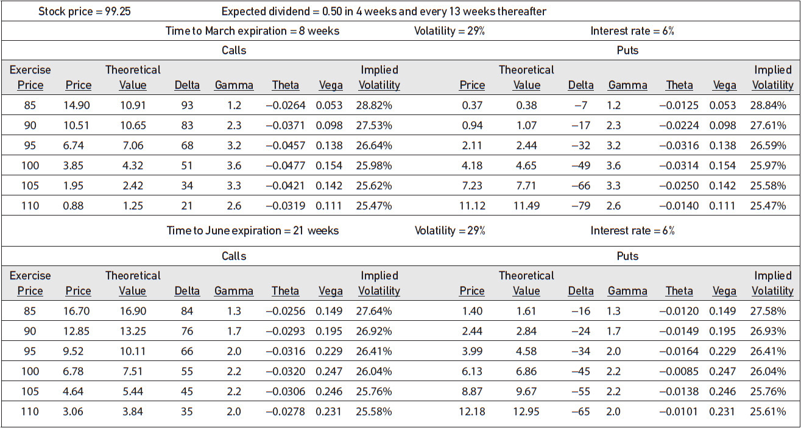

<!-- source:block a296ea6d54f7ba1e -->

*图13-11 / Figure 13-11*

<!-- source:block 9f484455b74b399b -->

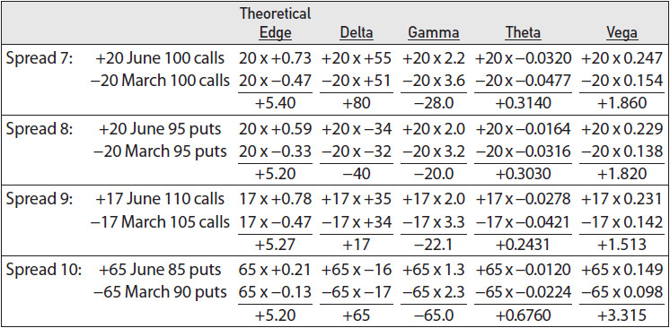

<!-- source:block e392b0f952410fda -->

> [!quote]- English 65
> Because all four spreads fall into the long calendar spread category, they all have the typical negative-gamma and positive-vega characteristics associated with such spreads. This is shown in Figures 13-12 and 13-13. Movement in the price of the underlying contract or falling volatility will reduce the value of the spread. Rising volatility will increase the value of the spread. (Spreads 7 and 8 have essentially identical volatility characteristics and are almost indistinguishable from each other in Figure 13-13.) Initially, the choice of spreads will depend on the risk of movement in the underlying contract as well as the risk of changes in implied volatility.

由于所有四种价差都属于长日历价差类别，因此它们都具有与此类价差相关的典型负Gamma和正Vega特征。这如图13-12和13-13所示。标的合约价格的变动或波动率下降将减少价差的价值。波动率上升将增加价差的价值。（价差7和价差8具有基本相同的波动率特征，在图13-13中几乎无法区分。）最初，价差的选择将取决于标的合约的变动风险以及隐含波动率变化的风险。

<!-- source:block dbb987464ba2a12e -->

*图13-12 / Figure 13-12*

<!-- source:block 2b2ddd62d383b712 -->

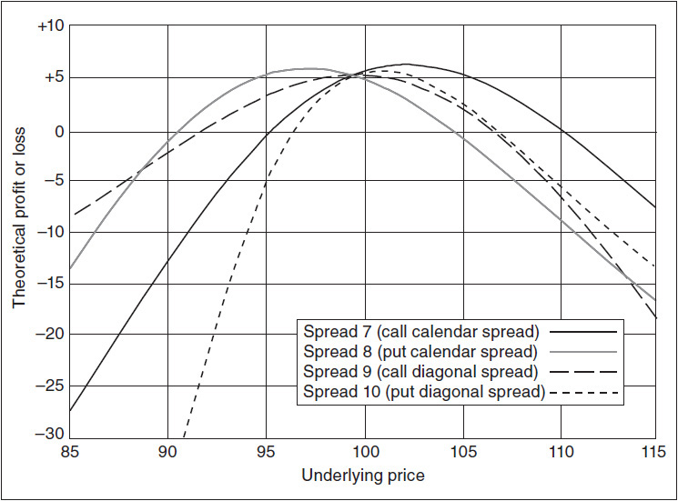

<!-- source:block fa0ae53eba291458 -->

*图13-13 / Figure 13-13*

<!-- source:block 7a3ce7219e70289e -->

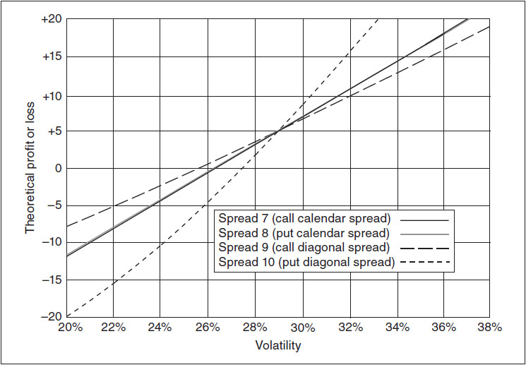

<!-- source:block a834bbb355857040 -->

> [!quote]- English 68
> Because we are dealing with stock options, there are two additional risks—the risk of changing interest rates and the risk of changing dividends, assuming that at least one dividend payment falls between expirations. We know from Chapter 7 that stock option calls and puts react in just the opposite way to changes in interest rates and dividends. Rising interest rates or falling dividends cause calls to rise in value and puts to fall; falling interest rates and rising dividends cause calls to fall in value and puts to rise. Moreover, the impact of a change in either of these inputs will be greater for long-term options than for short-term options. We can measure the risk of changing interest rates by determining the total rho value for each spread. Even though there is no Greek for the dividend sensitivity, we can still use a computer to determine the dividend risk associated with each spread. The sensitivities for the individual options, as well as the total spread sensitivities, to changing interest rates and dividends are shown in Figure 13-14.

由于这里讨论的是股票期权，还需要考虑另外两类风险：利率变动风险和股息变动风险——前提是两个到期日之间至少有一次股息支付。由第 7 章可知，股票看涨期权和看跌期权对利率及股息变动的反应恰好相反：利率上升或股息下降会使看涨期权价值上升、看跌期权价值下降；利率下降或股息上升则会使看涨期权价值下降、看跌期权价值上升。此外，无论哪项输入变量发生变化，对长期期权的影响都会大于对短期期权的影响。我们可以通过计算每个价差的 Rho 总值来衡量利率变动风险。尽管股息敏感度没有对应的 Greek（希腊字母风险指标），仍可借助计算机确定每个价差的股息风险。各单一期权以及整个价差对利率和股息变动的敏感度如图 13-14 所示。

<!-- source:block 02d916085972026c -->

*图 13-14 利率和股息敏感度。 / Figure 13-14 Interest-rate and dividend sensitivity.*

<!-- source:block 858cd09c13f24ba6 -->

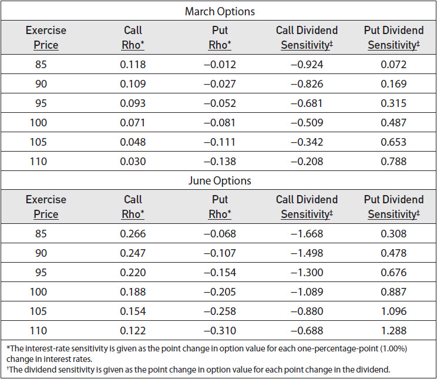

<!-- source:block e4e74669c3831183 -->

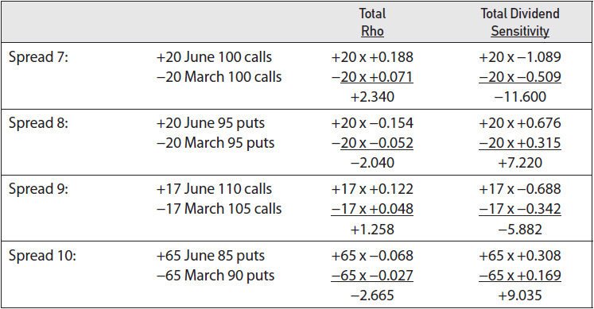

<!-- source:block f7738b8610825488 -->

> [!quote]- English 70
> The call spreads (Spreads 7 and 9) have a positive rho and negative dividend sensitivity. The put spreads (Spreads 8 and 10) have a negative rho and positive dividend sensitivity. The value of each spread with respect to changes in these inputs is shown in Figures 13-15 and 13-16.

看涨价差（价差7和9）具有正的Rho敏感性和负的股息敏感性。看跌价差（价差8和10）具有负的Rho和正的股息敏感性。每个价差相对于这些输入变化的值如图13-15和13-16所示。

<!-- source:block 8a22494d0c467259 -->

*图13-15采样率敏感性。 / Figure 13-15 Interest-rate sensitivity.*

<!-- source:block 43c131af58a1ab17 -->

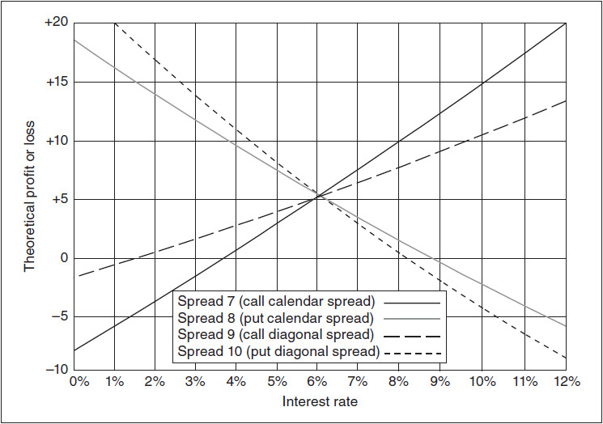

<!-- source:block 1395455d19ea358b -->

*图13-16股息敏感性。 / Figure 13-16 Dividend sensitivity.*

<!-- source:block 39f875219b563a2e -->

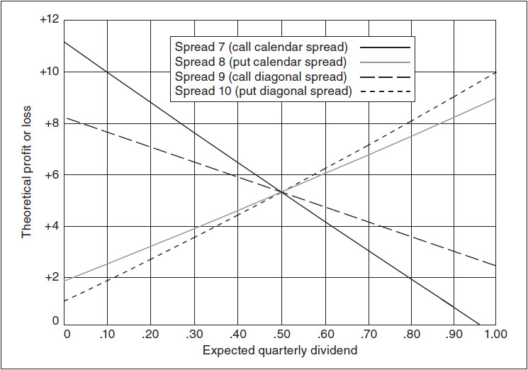

<!-- source:block 7fed224d8c8090da -->

> [!quote]- English 73
> The interest-rate and dividend risk associated with volatility spreads is usually small compared with the volatility (gamma and vega) risk. Nonetheless, a trader ought to be aware of these risks, especially when a position is large and there is significant risk of a change in either interest rates or dividends.

与波动率（Gamma和Vega）风险相比，与波动率价差相关的利率和股息风险通常较小。尽管如此，交易员应该意识到这些风险，特别是当头寸较大并且利率或股息变化的风险很大时。

<!-- source:block af8e8ba5aeae16a7 -->

## 什么是好的价差？ / What is a Good spread?

<!-- source:block 591b6a5486eed38a -->

> [!quote]- English 74
> Option traders, being human, would rather talk about their successes than their disasters. If one were to eavesdrop on conversations among traders, it would probably seem that no one ever made a losing trade. Disasters, when they do occur, only happen to other traders. The fact is that every successful option trader has had his share of disasters. What separates successful traders from the unsuccessful ones is the ability to survive such occurrences.

期权交易员作为人，宁愿谈论他们的成功，也不愿谈论他们的灾难。如果有人窃听交易员之间的对话，可能会发现没有人进行过亏损的交易。当灾难确实发生时，只会发生在其他交易者身上。事实是，每一位成功的期权交易者都曾经历过灾难。成功的交易者与失败的交易者的区别在于在此类事件中生存的能力。

<!-- source:block 6fbda89ee36ff87e -->

> [!quote]- English 75
> Consider the trader who initiates a spread with a good theoretical edge and a large margin for error in almost every risk category. If the trader still ends up losing money on the spread, does this mean that the trader has made a poor choice of spreads? Maybe a similar spread, but one with less margin for error, would have resulted in an even greater loss, perhaps a loss from which the trader could not recover.

考虑一下发起价差的交易员，他在几乎所有风险类别中都具有良好的理论优势和很大的误差幅度。如果交易者最终仍然在价差上赔钱，这是否意味着交易者对价差的选择很差？也许类似的价差，但误差幅度较小，会导致更大的损失，也许是交易员无法弥补的损失。

<!-- source:block 70fe486ced7af931 -->

> [!quote]- English 76
> It is impossible to take into consideration every possible risk. A spread that passed every risk test would probably have so little theoretical edge that it would not be worth doing. But the trader who allows himself a reasonable margin for error will find that even his losses will not lead to financial ruin. A good spread is not necessarily the one that shows the greatest profit when things go well; it may be the one that shows the least loss when things go badly. Winning trades always take care of themselves. Losing trades that do not give back all the profits from the winning ones are just as important.

不可能考虑所有可能的风险。通过了每项风险测试的价差可能没有什么理论优势，以至于不值得这样做。但允许自己有合理误差的交易者会发现，即使他的损失也不会导致财务破产。良好的价差并不一定是在事情进展顺利时表现出最大利润的价差;它可能是在事情进展不顺利时表现出最小损失的价差。获胜的交易总是会照顾好自己。如果失败的交易无法从获胜的交易中返还所有利润，这同样重要。

<!-- source:block 017e3147e238d5f7 -->

### 效率 / Efficiency

<!-- source:block d7973f078f856a0d -->

> [!quote]- English 77
> One method that traders sometimes use to compare the relative riskiness of potential strategies focuses on the risk-reward ratio, or *efficiency*, of the strategies. Suppose that a trader is considering two possible spreads, both with a positive gamma and a negative theta. The reward is represented by the gamma, the potential profit when the underlying market moves. The risk is the theta, the money that will be lost through the passage of time if the underlying market fails to make sufficiently large moves. The trader would like the reward (the gamma) to be as large as possible compared with the risk (the theta). We might express this relationship as a ratio

交易员有时用来比较潜在策略相对风险的一种方法侧重于策略的风险回报比或效率。假设交易员正在考虑两种可能的价差，都是正的Gamma和负的Theta。回报由Gamma来代表，即标的市场变动时的潜在利润。风险是Theta，即如果标的市场未能做出足够大的波动，随着时间的推移将损失的资金。交易者希望回报（Gamma）与风险（Theta）相比尽可能大。我们可以将这种关系表示为

<!-- source:block a2fd53ec7479ef60 -->

> [!quote]- English 78
> gamma/theta

$$
\text{gamma}/\text{theta}
$$

<!-- source:block c4747ee135345061 -->

> [!quote]- English 79
> The larger the absolute value of this ratio, the more efficient the position.

该比率的绝对值越大，头寸的效率越高。

<!-- source:block d31ca1d07df44b59 -->

> [!quote]- English 80
> In the same way, a trader who has a negative gamma and a positive theta wants the risk (the gamma) to be as small as possible compared with the reward (the theta). He therefore wants the absolute value of the gamma/theta ratio to be as large as possible.

同样，具有负Gamma和正Theta的交易者希望风险（Gamma）与回报（Theta）相比尽可能小。因此，他希望Gamma/Theta比的绝对值尽可能大。

<!-- source:block 716cf965b155b32e -->

> [!quote]- English 81
> For example, we might go back and calculate the efficiency of Spreads 1 through 3 in Figure 13-3. The efficiencies are

例如，我们可能会回去计算图13-3中价差1到3的效率。效率是

<!-- source:block 48b4fe4c4d57896b -->

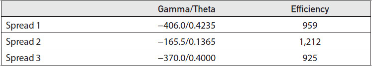

<!-- source:block 573fd4c4bec33265 -->

> [!quote]- English 82
> Because each spread has a negative gamma and positive theta, we want the efficiency to be as small as possible. We can see that Spread 3 is best, which is consistent with our previous analysis of each spread.

因为每个价差都有负的Gamma和正的Theta，所以我们希望效率尽可能小。我们可以看到Spread 3是最好的，这与我们之前对每个Spread的分析一致。

<!-- source:block 44c33a73ed7c814a -->

> [!quote]- English 83
> Assuming that all strategies have approximately the same theoretical edge, the efficiency can be a reasonable method of quickly comparing strategies where all options expire at the same time. In such cases, the gamma and theta are the primary risks to the position. If a strategy consists of options that expire at different times, the efficiency is only one consideration, and the sensitivity of the positions to changes in implied volatility (the vega) may also become important, as they were in our other spread examples. In such cases, a more detailed risk analysis will be necessary.

假设所有策略都具有大致相同的理论优势，那么效率可以是快速比较所有期权同时到期的策略的合理方法。在这种情况下，Gamma和Theta是头寸的主要风险。 如果一项策略由在不同时间到期的期权组成，那么效率只是考虑因素之一，而且头寸对隐含波动率（Vega）变化的敏感性也可能变得重要，就像我们的其他价差示例中那样。 在这种情况下，需要进行更详细的风险分析。

<!-- source:block 13e978ea7d9b0922 -->

### 调整 / Adjustments

<!-- source:block c8e3b842d1754654 -->

> [!quote]- English 84
> In Chapter 11, we considered the question of when a trader should adjust a position to remain delta neutral. In addition to deciding when to adjust, the trader also must consider how best to adjust because there are many different ways to adjust the total delta position. An adjustment to a trader’s delta position may reduce his directional risk, but if he simultaneously increases his gamma, theta, or vega risk, he may inadvertently be exchanging one type of risk for another.

在第11章中，我们考虑了交易者何时应该调整头寸以保持Delta中性的问题。除了决定何时调整外，交易员还必须考虑如何最好地调整，因为有很多不同的方式来调整总Delta头寸。调整交易者的Delta头寸可能会降低他的方向风险，但如果他同时增加他的Gamma、Theta或Vega风险，他可能会无意中将一种风险转换为另一种风险。

<!-- source:block 1dceca494b3fd76b -->

> [!quote]- English 85
> A delta adjustment made with the underlying contract is essentially a risk-neutral adjustment. The gamma, theta, and vega of an underlying contract are 0, so an adjustment made with the underlying contract will not change any of these risks. If a trader wants to adjust his delta position but wants to leave the other characteristics of the position unaffected, he can do so by purchasing or selling an appropriate number of underlying contracts.

对标的合约进行的Delta调整本质上是风险中性调整。标的合约的Gamma、Theta和Vega为0，因此对标的合约进行的调整不会改变任何这些风险。如果交易者想要调整他的Delta头寸，但想要不影响头寸的其他特征，他可以通过购买或出售适当数量的标的合约来做到这一点。

<!-- source:block 3a9ebeb8062b30d3 -->

> [!quote]- English 86
> An adjustment made with options will also reduce the delta risk, but at the same time, it will change the other risk characteristics. Because every option has not only a delta but also a gamma, theta, and vega, when an option is added to or subtracted from a position, it necessarily changes the total delta, gamma, theta, and vega of the position. This is something that new traders sometimes forget.

通过期权进行的调整也会降低Delta风险，但同时也会改变其他风险特征。因为每个期权不仅有Delta，还有Gamma、Theta和Vega，因此当一个期权被添加到一个头寸或从一个头寸中减去时，它必然会改变该头寸的总Delta、Gamma、Theta和Vega。这是新交易者有时会忘记的事情。

<!-- source:block 411db213c232af2e -->

> [!quote]- English 87
> Consider a stock option market where the underlying contract is trading at 99.25 and all options appear to be overpriced. Suppose that a trader decides to sell the 95/105 strangle (sell the 95 put, sell the 105 call), with put and call deltas of –32 and 34, respectively. If the trader sells 20 strangles, the position is initially slightly delta negative because

假设一个股票期权市场，其中标的合约的交易价格为99.25，并且所有期权似乎定价过高。假设一名交易员决定出售95/105宽跨式（出售95看跌期权，出售105看涨期权），看跌期权和看涨期权Delta分别为-32和34。如果交易员出售20只宽跨式，该头寸最初略微为Delta负，因为

<!-- source:block 1a5af2db3eb051ae -->

> [!quote]- English 88
> (–20 × +34) + (–20 × –32) = –40

$$
(-20 \times +34) + (-20 \times -32) = -40
$$

<!-- source:block fea4b544dd2df422 -->

> [!quote]- English 89
> Suppose that a week passes and the underlying market has fallen to 97.00, with new delta values for the 95 put and 105 call of –39 and +25. Assuming that no adjustments have been made, the trader’s delta position is now

假设一周过去，标的市场跌至97.00，95看跌和105看涨的新Delta值为-39和+25。假设没有进行调整，交易员的Delta头寸现在是

<!-- source:block 4561030ad66f98d0 -->

> [!quote]- English 90
> (–20 × –39) + (–20 × +25) = +280

$$
(-20 \times -39) + (-20 \times +25) = +280
$$

<!-- source:block c97afa30a4bb2bc2 -->

> [!quote]- English 91
> If the trader wants to hold the position but also wants to remain approximately delta neutral, he has three basic choices:

如果交易者想要持有该头寸，但也希望保持大致Delta中性，他有三个基本选择：

<!-- source:block 2dda9dfcf9e88c35 -->

> [!quote]- English 92
> 1. Sell underlying contracts.

1.出售标的合约。

<!-- source:block 5817e95e8018d45a -->

> [!quote]- English 93
> 2. Sell calls.

2.卖出看涨期权。

<!-- source:block a6a592cc27f5dd2c -->

> [!quote]- English 94
> 3. Buy puts.

3.购买看跌期权。

<!-- source:block 46ce24ccf6ba6cf9 -->

> [!quote]- English 95
> Which method is best?

哪种方法最好？

<!-- source:block f8513fce33570954 -->

> [!quote]- English 96
> All other considerations being equal, whenever a trader makes an adjustment, she should do so with the intention of improving the risk-reward characteristics of the position. If the trader decides to adjust his delta position by purchasing puts, he also reduces his other risks because the gamma, theta, and vega associated with the put purchase are opposite in sign to the gamma, theta, and vega associated with the existing short strangle position.

在所有其他考虑因素相同的情况下，每当交易员做出调整时，她的做法都应该是为了改善头寸的风险回报特征。如果交易者决定通过购买看跌期权来调整他的Delta头寸，他也会降低他的其他风险，因为与看跌期权购买相关的Gamma、Theta和Vega符号与与现有空头宽跨式头寸相关的Gamma、Theta和Vega符号相反。

<!-- source:block a06dcb31f2addf40 -->

> [!quote]- English 97
> Unfortunately, all other considerations may not be equal. Because implied volatility can remain high or low for long periods of time, it is quite likely that if all options were overpriced when the trader initiated his position, they will still be overpriced when he goes back into the market to make his adjustment. Even though the purchase of puts to become delta neutral will also reduce his other risks, such an adjustment will have the effect of reducing the theoretical edge. On the other hand, if all options are overpriced and the trader decides to sell additional calls to reduce the delta, the sale of the overpriced calls will have the effect of increasing the theoretical edge. If the trader decides that adding to his theoretical edge is of primary importance, he may decide to sell 11 additional 105 calls, leaving him approximately delta neutral because

不幸的是，所有其他考虑因素可能并不相同。由于隐含波动率可以在很长一段时间内保持在高位或低位，因此很可能，如果交易者在开始头寸时所有期权都被定价过高，那么当他重返市场进行调整时，它们仍然会被定价过高。尽管购买看跌期权以使Delta中性也会降低他的其他风险，但这种调整将产生降低理论优势的效果。另一方面，如果所有期权定价过高，并且交易员决定出售额外的看涨期权以降低Delta，则出售定价过高的看涨期权将产生增加理论优势的效果。如果交易员认为增加理论优势是首要重要的，他可能会决定额外出售11个105看涨期权，使他大致处于Delta中性，因为

<!-- source:block 637ab89f817ef642 -->

> [!quote]- English 98
> (–20 × –39) + (–31 × +25) = –5

$$
(-20 \times -39) + (-31 \times +25) = -5
$$

<!-- source:block 2cb2ca6112da27c7 -->

> [!quote]- English 99
> Now suppose that another week passes and the market has rebounded to 101.00, with new delta values for the 95 put and 105 call of –24 and +37. The position delta is now

现在假设又过了一周，市场反弹至101.00，95看跌和105看涨的新Delta值为-24和+37。现在的头寸Delta

<!-- source:block 99fe0a714322ba75 -->

> [!quote]- English 100
> (–20 × –24) + (–31 × +37) = –667

$$
(-20 \times -24) + (-31 \times +37) = -667
$$

<!-- source:block 571be6d9c05e1f8e -->

> [!quote]- English 101
> Again, if the trader wants to adjust, he has three basic choices—buy underlying contracts, buy calls, or sell puts. Assuming that all options are still overpriced and that the trader wants to continue to increase his theoretical edge, he may decide to sell an additional 28 of the 95 puts. The new total delta position is

同样，如果交易者想要调整，他有三个基本的选择——买入标的合约、买入看涨期权或卖出看跌期权。假设所有期权的价格仍然过高，交易者希望继续增加他的理论优势，他可能会决定卖出95个看跌期权中的28个。新的总Delta头寸为

<!-- source:block 7315f86bef384188 -->

> [!quote]- English 102
> (–48 × –24) + (–31 × +37) = +5

$$
(-48 \times -24) + (-31 \times +37) = +5
$$

<!-- source:block f11c3acf0a281240 -->

> [!quote]- English 103
> It should be clear what will result from these adjustments. If all options remain overpriced and the trader focuses solely on increasing his theoretical edge, he will continue to make whatever adjustments are necessary by selling overpriced options. This method of adjusting may indeed result in the greatest profit to the trader, but the strangle, which the trader was initially prepared to sell 20 times, now has increased in size to 48 × 31. If the market now makes a violent move in either direction, the adverse consequences will be greatly magnified. The new trader, overly concerned with always increasing his theoretical edge, often finds himself in just such a position. If the market makes a very swift move, the trader may not survive. For this reason, a new trader is usually well advised to avoid making adjustments that increase the size of a position.

应该清楚这些调整将产生什么。如果所有期权仍然定价过高，并且交易员只专注于提高其理论优势，他将继续通过出售定价过高的期权来进行任何必要的调整。这种调整方法确实可能会给交易者带来最大的利润，但交易者最初准备出售20次的宽跨式，现在规模已经增加到48 × 31。如果市场现在向任何一个方向剧烈波动，不良后果将大大放大。新交易者过度关注不断提高自己的理论优势，经常发现自己处于这样的境地。如果市场走势非常迅速，交易者可能无法生存。因此，通常建议新交易员避免进行增加头寸规模的调整。

<!-- source:block eea665854d8b12b5 -->

> [!quote]- English 104
> No trader can afford to ignore the effect that adjustments will have on the total risk to a position. If he has a positive gamma or vega position, buying any additional options will increase his gamma or vega risk; if he has a negative gamma or vega position, selling any additional options will likewise increase his gamma or vega risk. A trader cannot afford to sell overpriced options or buy underpriced options ad infinitum. At some point, the size of the spread will simply become too large, and any additional theoretical edge will have to take a back seat to risk considerations. When this happens, there are only two choices:

任何交易者都不能忽视调整对头寸总风险的影响。如果他的Gamma或Vega头寸为正，购买任何额外的期权都会增加他的Gamma或Vega风险;如果他的Gamma或Vega头寸为负，出售任何额外的期权同样也会增加他的Gamma或Vega风险。交易者无法无限期地出售定价过高的期权或购买定价过低的期权。在某个时候，价差的规模只会变得太大，任何额外的理论优势都将不得不退居风险考虑的后面。当这种情况发生时，只有两种选择：

<!-- source:block 51b5b5b1878c1837 -->

> [!quote]- English 105
> 1. Decrease the size of the spread.

1.减少价差的大小。

<!-- source:block 59c33ccd81d65e0f -->

> [!quote]- English 106
> 2. Adjust in the underlying market.

2.在标的市场中进行调整。

<!-- source:block bf938ef8a6062eda -->

> [!quote]- English 107
> A disciplined trader knows that sometimes, because of risk considerations, the best course is to reduce the size of the spread, even if it means giving up some theoretical edge. When open-outcry markets were flourishing, this could be particularly hard on a trader’s ego if the trader had to personally go back into the market and either buy back options, that he originally sold, at a lower price or sell out options, that he originally purchased, at a higher price. However, if a trader is unwilling to swallow his pride from time to time, his trading career is likely to be a short one.

一个有纪律的交易者知道，有时，出于风险考虑，最好的做法是缩小价差规模，即使这意味着放弃一些理论优势。当公开喊价市场蓬勃发展时，如果交易员必须亲自重返市场并以较低的价格回购他最初出售的期权或以较高的价格卖掉他最初购买的期权，这对交易员的自尊心可能会特别困难。然而，如果交易者不愿意时不时地吞下自己的骄傲，那么他的交易生涯很可能会很短暂。

<!-- source:block 26e9045acb36c2fa -->

> [!quote]- English 108
> If a trader finds that any delta adjustment in the option market that reduces his risk will also reduce his theoretical edge and he is unwilling to give up any theoretical edge, his only recourse is to make adjustments in the underlying market. An underlying contract has no gamma, theta, or vega, so the risks of the position will remain essentially the same.

如果交易者发现期权市场中任何降低风险的Delta调整也会降低他的理论优势，并且他不愿意放弃任何理论优势，那么他唯一的手段就是对标的市场进行调整。标的合约没有Gamma、Theta或Vega，因此头寸的风险将基本保持相同。

<!-- source:block cca82b6c0fd0df48 -->

### 风格问题 / A Question of Style

<!-- source:block b7e89b7dbd74579c -->

> [!quote]- English 109
> Because most option pricing models assume that movement in the underlying contract is random, an option trader who trades purely from the theoretical values generated by a model should not have any prior opinion about market direction. In practice, however, many option traders begin their trading careers by taking positions in the underlying market, where direction is the primary consideration. Many traders therefore develop a style of trading based on presumed directional moves in the underlying market. A trader might, for example, be a trend follower, adhering to the philosophy that “the trend is your friend.” Or he might be a contrarian, preferring to “buy weakness, sell strength.”

由于大多数期权定价模型假设标的合约的变动是随机的，因此纯粹根据模型生成的理论值进行交易的期权交易者不应该对市场方向有任何先验的看法。然而，在实践中，许多期权交易员通过在标的市场上建仓开始他们的交易生涯，而方向是主要考虑因素。因此，许多交易者根据标的市场的假设方向性走势发展出一种交易风格。例如，交易者可能是趋势追随者，遵循“趋势是你的朋友”的理念。或者他可能是一个反向投资者，更喜欢“买弱，卖强”。

<!-- source:block 013b7a5287265683 -->

> [!quote]- English 110
> Traders often try to incorporate their personal trading styles into their option strategies. One way to do this is to consider beforehand the adjustments that will be required for a certain strategy if the underlying market begins to move. A trader who sells straddles knows that such spreads have negative gamma. As the market moves higher, his delta position is becoming negative, and as the market moves lower, his delta position is becoming positive. If this trader likes to trade against the trend, he will avoid adjustments as much as possible because his position is automatically trading against the trend. Whichever way the market moves, the position always wants a retracement of this movement. On the other hand, a trader who sells the same straddles but prefers to trade with the trend will adjust at every opportunity. In order to remain delta neutral, he will be forced to buy underlying contracts as the market rises and sell underlying contracts as the market falls.

交易者经常试图将他们的个人交易风格融入到他们的期权策略中。实现这一目标的一种方法是提前考虑如果标的市场开始波动，某个策略所需的调整。出售跨式债券的交易员知道这种价差具有负Gamma。随着市场走高，他的Delta头寸正在变得负，而随着市场走低，他的Delta头寸正在变得正。如果这个交易者喜欢逆势交易，他会尽可能避免调整，因为他的头寸自动逆势交易。无论市场如何走势，头寸总是希望这种走势的回撤。另一方面，出售相同的跨式但更愿意跟随趋势交易的交易者会抓住一切机会进行调整。为了保持Delta中性，他将被迫在市场上涨时购买标的合约，并在市场下跌时出售标的合约。

<!-- source:block 1e956dc710609a87 -->

> [!quote]- English 111
> The opposite is true for a trader who buys straddles. He has a positive-gamma position. As the market rises, his delta position is becoming positive, and as the market falls, his delta position is becoming negative. If this trader likes to trade with the trend, he will adjust as little as possible in the belief that the market is likely to continue in the same direction. If, however, he prefers to trade against the trend, he will adjust as often as possible. Every adjustment will represent a profit opportunity if the market does in fact reverse its direction.

对于购买跨式的交易者来说，情况恰恰相反。他的头寸为正Gamma。随着市场上涨，他的Delta头寸变得正，随着市场下跌，他的Delta头寸变得负。如果该交易者喜欢跟随趋势进行交易，他会尽可能少地调整，因为他相信市场可能会继续朝同一方向发展。然而，如果他更愿意逆势交易，他会尽可能频繁地进行调整。如果市场确实扭转了方向，每一次调整都将代表一个盈利机会。

<!-- source:block 27a38875c2d5e061 -->

> [!quote]- English 112
> A trader with a negative gamma is always adjusting with the trend of the underlying market. A trader with a positive gamma is always adjusting against the trend of the underlying market. If a trader prefers to trade with the trend or against the trend, he should choose a strategy and an adjustment process that are appropriate to his preference. A trader who prefers to trade with the trend can choose a strategy with a positive gamma together with less frequent adjustments or a strategy with a negative gamma with more frequent adjustments. A trader who prefers to trade against the trend can choose a strategy with a negative gamma together with less frequent adjustments or a strategy with a positive gamma with more frequent adjustments. The purely theoretical trader will not have to worry about this because for him there is no such thing as a trend. However, for many traders, old habits, such as trading with or against the trend, are hard to break.

具有负Gamma系数的交易者总是根据标的市场的趋势进行调整。具有正Gamma系数的交易者总是根据标的市场的趋势进行调整。如果交易者喜欢顺趋势或逆势交易，他应该选择适合他偏好的策略和调整过程。喜欢跟随趋势进行交易的交易者可以选择具有正Gamma系数且不太频繁调整的策略或具有负Gamma系数且更频繁调整的策略。喜欢逆势交易的交易者可以选择具有负Gamma系数且调整频率较低的策略，或者具有正Gamma系数且调整频率较高的策略。纯理论交易者不必担心这一点，因为对他来说，不存在趋势这样的东西。然而，对于许多交易者来说，旧习惯，例如顺趋势或逆趋势交易，很难打破。

<!-- source:block 57d8a2fc0756cb23 -->

### 流动性 / Liquidity

<!-- source:block a6b526bf13614161 -->

> [!quote]- English 113
> Every open option position entails risk. Even if the risk is limited to the current value of the options, by leaving the position open, the trader is risking the loss of that value. If the trader wants to eliminate the risk, he will have to take some action that will, in effect, close out the position. Sometimes this can be done through early exercise or by taking advantage of an opposing position to create an arbitrage. More often, however, in order to close out an open position, a trader must go into the marketplace and buy in any short options and sell out any long options.

每个未平仓期权头寸都存在风险。即使风险仅限于期权的当前价值，通过保持头寸未平仓，交易者也面临着失去该价值的风险。如果交易者想要消除风险，他将不得不采取一些实际上平仓的行动。有时，这可以通过提前行权或利用对方头寸创造套利来实现。然而，更多情况下，为了平仓未平仓头寸，交易员必须进入市场并买入任何空头期权并卖出任何多头期权。

<!-- source:block 643420c63785534e -->

> [!quote]- English 114
> An important consideration in deciding whether to enter into a trade is often the ease with which the trader can reverse the trade. Liquid option markets, where there are many buyers and sellers, are much less risky than illiquid markets, where there are few buyers and sellers. In the same way, a spread that consists of very liquid options is much less risky than a spread that consists of one or more illiquid options. If a trader is considering entering into a spread where the options are illiquid, he ought to ask himself whether he is willing to live with that position until expiration. If the market is very illiquid, this may be the only time that he will be able to get out of the position at anything resembling a fair price. If the spread consists of long-term options, the trader may find himself married to the position for better or worse, in sickness and in health, for what may seem like an eternity. If he is unwilling to commit his capital for such a lengthy period, perhaps he should avoid the position. Because there is greater risk associated with a long-term investment than with a short-term investment, a trader who does decide to take a position in long-term options ought to expect greater potential profit in the form of larger theoretical edge.7

决定是否进行交易的一个重要考虑因素通常是交易员逆转交易的容易程度。有许多买家和卖家的流动性期权市场比没有买家和卖家的非流动性市场的风险要小得多。同样，由流动性强的期权组成的价差比由一个或多个非流动性期权组成的价差的风险要小得多。如果交易者正在考虑进入期权流动性不高的价差，他应该问自己是否愿意维持该头寸直到到期。如果市场流动性非常差，这可能是他唯一能够以类似公平价格平仓的时候。如果价差由长期期权组成，交易者可能会发现自己与该头寸的婚姻无论好坏，无论疾病还是健康，似乎是永恒。如果他不愿意投入这么长时间的资金，也许他应该回避这个头寸。由于长期投资的风险比短期投资更大，因此决定持有长期期权的交易员应该期望以更大的理论优势形式获得更大的潜在利润。[^ovp13-7]

<!-- source:block 8b20b4963f0237d7 -->

> [!quote]- English 115
> New traders are often advised to begin trading in liquid markets. If a new trader makes an error resulting in a losing trade, in a liquid market, he will be able to keep his loss to a minimum because he will be able to exit the trade with relative ease. On the other hand, an experienced trader, especially a market maker, will often prefer to deal in less liquid markets. There may be less trading activity in such markets, but the bid-ask spread is much wider, resulting in greater theoretical edge each time a trade is made. Of course, any mistake can be a problem with which the trader will have to live for a long time. However, an experienced trader is expected to keep his mistakes to a minimum.

新交易者通常被建议开始在流动性市场进行交易。如果新交易者犯了错误导致交易损失，在流动性高的市场中，他将能够将损失控制在最低限度，因为他将能够相对轻松地退出交易。另一方面，经验丰富的交易员，尤其是做市商，通常更喜欢在流动性较低的市场进行交易。此类市场的交易活动可能较少，但买卖价差要宽得多，导致每次交易时都有更大的理论优势。当然，任何错误都可能是交易员必须忍受很长一段时间的问题。然而，经验丰富的交易员应该将错误控制在最低限度。

<!-- source:block ffc5f2eaabc347cb -->

> [!quote]- English 116
> The most liquid options in any market are usually those that are short term and that are either at or slightly out of the money. Such options always have the narrowest bid-ask spread, and there are usually many traders willing to buy or sell these contracts. As a trader moves to longer-term options or to options that are more deeply in the money, he finds that the bid-ask spread begins to widen, and fewer and fewer traders are interested in these contracts. Although there is constant activity in at-the-money short-term options, deeply in-the-money long-term options may not trade for weeks at a time.

任何市场中流动性最强的期权通常是那些短期且处于或略微OTM的期权。此类期权的买卖价差总是最小的，并且通常有许多交易者愿意购买或出售这些合约。 当交易者转向长期期权或更深入ITM的期权时，他发现买卖价差开始扩大，越来越少的交易者对这些合约感兴趣。 尽管ATM短期期权持续活跃，但深度ITM长期期权可能不会一次交易数周。

<!-- source:block 232f71d395d6c555 -->

> [!quote]- English 117
> In addition to the liquidity of an option market, a trader should also give some thought to the liquidity of the underlying market. In an illiquid option market, a trader may find it difficult to adjust the position using options. If, however, the underlying market is liquid, he will at least be able to make his adjustment in that market with relative ease. The most dangerous markets in which to trade are those where both the options and the underlying contract are inactively traded. Only the most experienced and knowledgeable traders should enter such markets.

除了期权市场的流动性外，交易员还应该考虑标的市场的流动性。在非流动性的期权市场中，交易者可能会发现很难使用期权调整头寸。然而，如果标的市场具有流动性，他至少能够相对轻松地在该市场中进行调整。最危险的交易市场是期权和标的合约交易不活跃的市场。只有最有经验和知识渊博的交易员才应该进入此类市场。

<!-- source:block 3996eb20766156d8 -->

> [!quote]- English 118
> Figure 13-17 shows end-of-day bid-ask spreads and volume figures for Standard and Poor’s (S&P) 500 Index options traded at the Chicago Board Options Exchange on March 1, 2010.8 In general, the volumes are lower and bid-ask spreads are wider for back-month options or options that are deeply in the money compared with front-month options or options that are at the money or out of the money.

图13-17显示了1, 2010年3月在芝加哥期权交易所交易的标准普尔（S&P）500指数期权的日终买卖价差和交易量。 一般来说，与前月期权或ATM或OTM期权相比，后月期权或深度ITM期权的成交量更低，买卖价差更大。 [^ovp13-8]

<!-- source:block a065cfa734d60919 -->

*图13-17 SPX指数期权：2010年3月1日买卖价差和交易量。 / Figure 13-17 SPX index options: Bid-ask spreads and trading volumes for March 1, 2010.*

<!-- source:block f0040e162a22cf84 -->

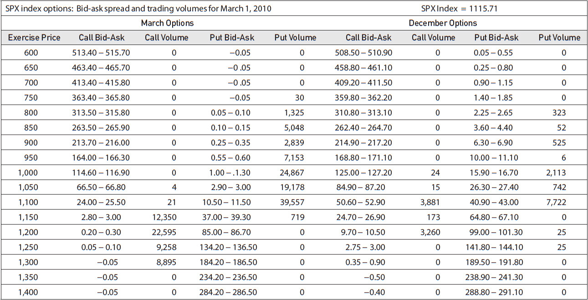

<!-- source:block 3da31a3671754a86 -->

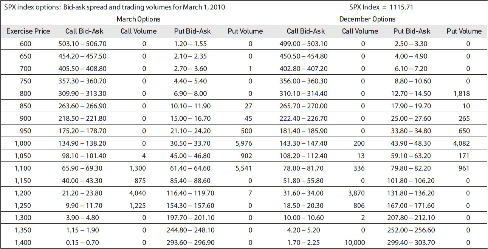

<!-- source:block d8155eb73dba3616 -->

> [!note] Footnote 120
> 1 We are considering only the interest-rate risk as it applies to the evaluation of options. Changes in interest rates can also affect the evaluation of an underlying contract, such as a bond, or even the shares in a company. But that is a separate matter.

[^ovp13-1]: 我们仅考虑适用于期权评估的利率风险。利率的变化还可能影响标的合约（例如债券）甚至公司股票的评估。但那是另一回事。

<!-- source:block f548e8dcfc3d4c00 -->

> [!note] Footnote 121
> 2 In order to focus only on volatility, we have assumed an interest rate of 0.

[^ovp13-2]: 为了只关注波动率，我们假设利率为0。

<!-- source:block 0e2a5c1cf7cf238b -->

> [!note] Footnote 122
> 3 Spreads 1 and 2, with their slightly positive delta, initially show a small gain as the market rises. Spread 3, with its slight negative delta, initially shows a small gain as the market falls.

[^ovp13-3]: 价差1和2的Delta略有正值，随着市场上涨，最初显示小幅上涨。价差3的Delta略有负，随着市场下跌，最初显示出小幅上涨。

<!-- source:block 42a684caa1269434 -->

> [!note] Footnote 123
> 4 It may appear from Figure 13-8 that Spread 5 has unlimited upside profit potential. In reality, the profit is limited by the fact that the spread between the value of the May 52 call and the July 54 call can never be greater than 2.00. This will occur if both options go very deeply into the money.

[^ovp13-4]: 从图13-8中可以看出，价差5具有无限的上行利润潜力。事实上，利润受到以下事实的限制：5月52 看涨期权和7月54 看涨期权之间的价差永远不能大于2.00。如果这两种选择都非常深入地投入金钱，就会发生这种情况。

<!-- source:block 575dfc6ea3d27715 -->

> [!note] Footnote 124
> 5 Size, of course, is relative. To a well-capitalized, experienced trader, even 100 × 50 may be a small trade.

[^ovp13-5]: 当然，尺寸是相对的。对于资金充足、经验丰富的交易者来说，即使是100 × 50也可能是一笔小额交易。

<!-- source:block 96c7da4b2437439c -->

> [!note] Footnote 125
> 6 Depending on the settlement procedure, changes in interest rates can also affect futures options. But the effect, as discussed in Chapter 7, is usually quite small. Changes in interest rates can also affect futures options because they may change the price of the underlying futures contract. But this can be assessed as the risk of a change in the underlying price, not a change in interest rates.

[^ovp13-6]: 根据结算程序，利率变化也会影响期货期权。但正如第7章所讨论的那样，这种影响通常相当小。利率变化也会影响期货期权，因为它们可能会改变标的期货合约的价格。但这可以被评估为标的价格变化的风险，而不是利率变化的风险。

<!-- source:block 8a071513d7324dfd -->

> [!note] Footnote 126
> 7 This is the same reason that long-term interest rates tend to be higher than short-term rates. If one is willing to commit capital for a longer period, the potential reward should also be greater.

[^ovp13-7]: 这与长期利率往往高于短期利率的原因相同。如果一个人愿意投入更长时间的资本，那么潜在的回报也应该更大。

<!-- source:block 99964517948b08ef -->

> [!note] Footnote 127
> 8 Figure 13-17 represents only a partial listing of S&P 500 Index options. More exercise prices and expiration months were available than could conveniently be displayed here.

[^ovp13-8]: 图13-17只是标普500指数期权的一部分。更多的行权价和到期月份比可以方便地显示在这里。

---

[[90-阅读导航|← 返回阅读导航]]

<!-- chapter-nav:start -->
> [!tip] 章节导航（章末）
> [[12-牛市与熊市价差 Bull and Bear Spreads|← 上一章]] · [[90-阅读导航|全书导航]] · [[14-合成头寸 Synthetics|下一章 →]]
<!-- chapter-nav:end -->
