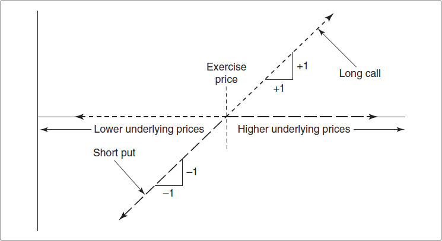
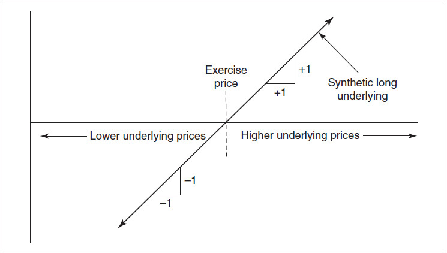
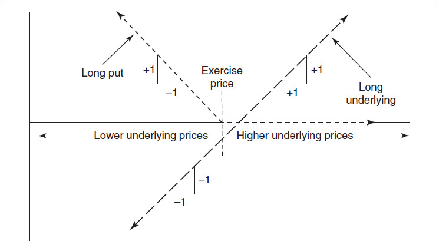
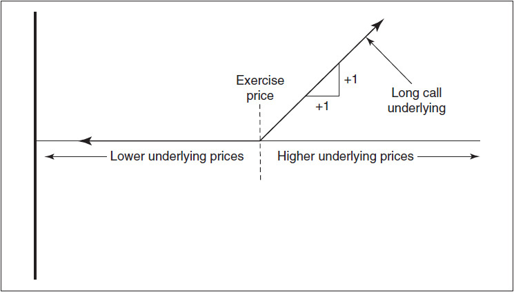
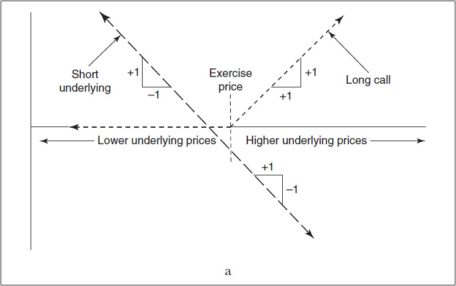
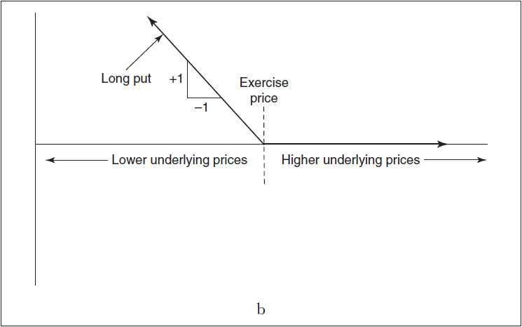
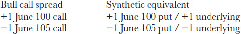
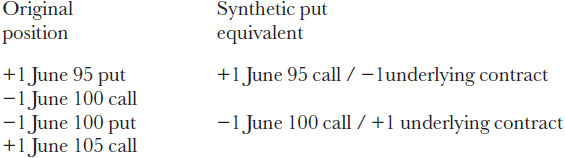
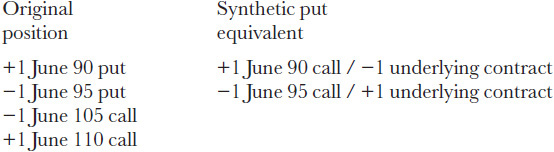
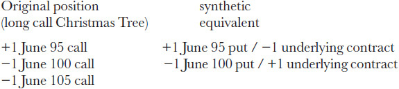

# 第14章 合成头寸 / Synthetics

[[90-阅读导航|← 返回阅读导航]] · [[91-翻译说明与术语表|术语表]]

> [!warning] 翻译状态
> 本章为机器初译，并使用本地术语表校验。英文原文、数字、公式和图表用于核对；中文将在后续复核中继续修订。

<!-- chapter-toc:start -->
## 本章目录 / Chapter Outline

> [!abstract] 结构导航
> 以下标题按原书顺序保留；点击可直接跳转。

- [[#合成标的头寸 / Synthetic Underlying|合成标的头寸 / Synthetic Underlying]]
- [[#合成期权 / Synthetic Options|合成期权 / Synthetic Options]]
- [[#在价差策略中使用合成头寸 / Using Synthetics in a Spreading Strategy|在价差策略中使用合成头寸 / Using Synthetics in a Spreading Strategy]]
- [[#铁蝶式与铁鹰式 / Iron Butterflies and Iron Condors|铁蝶式与铁鹰式 / Iron Butterflies and Iron Condors]]
<!-- chapter-toc:end -->
<!-- chapter-nav:start -->
> [!tip] 章节导航（章首）
> [[13-风险考量 Risk Considerations|← 上一章]] · [[90-阅读导航|全书导航]] · [[15-期权套利 Option Arbitrage|下一章 →]]
<!-- chapter-nav:end -->
<!-- source:block cada302b44f07f97 -->

> [!quote]- English 1
> One important characteristic of options is that they can be combined with other options, or with underlying contracts, to create positions with characteristics which are almost identical to some other contract or combination of contracts. This type of replication enables us to do most option strategies in a variety of ways, and leads to many useful relationships between options and the underlying contract.

期权的一个重要特征是，它们可以与其他期权或标的合约结合，以创建具有与其他合约或合约组合几乎相同特征的头寸。这种类型的复制使我们能够以各种方式执行大多数期权策略，并在期权和标的合约之间建立许多有用的关系。

<!-- source:block 8bb0cafe8d537379 -->

## 合成标的头寸 / Synthetic Underlying

<!-- source:block 07cf0f46db357263 -->

> [!quote]- English 2
> Consider the following position where all options are European (no early exercise permitted):

考虑以下头寸，所有期权均为欧洲期权（不允许提前行权）：

<!-- source:block 7d4b745e2181a7bb -->

> [!quote]- English 3
> long a June 100 call

`long a June 100 call`

<!-- source:block d6ee1a7b91593f7a -->

> [!quote]- English 4
> short a June 100 put

`short a June 100 put`

<!-- source:block 1ead349dee395bda -->

> [!quote]- English 5
> What will happen to this position at expiration? It may seem that one cannot answer the question without knowing where the underlying contract will be at expiration. Surprisingly, the price of the underlying contract does not affect the outcome. If the underlying contract is above 100, the put will expire worthless, but the trader will exercise the 100 call, thereby buying the underlying contract at 100. Conversely, if the underlying contract is below 100, the call will expire worthless, but the trader will be assigned on the 100 put, also buying the underlying contract at 100.

到期后该头寸会发生什么？看来，如果不知道标的合约到期时的头寸，就无法回答这个问题。令人惊讶的是，标的合约的价格并不影响结果。如果标的合约高于100，看跌期权到期时将毫无价值，但交易员将行权100看涨期权，从而在100点买入标的合约。相反，如果标的合约低于100，则看涨期权到期时将毫无价值，但交易员将被指派给100看跌期权，同时也在100买入标的合约。

<!-- source:block 21b0fcc0d1ac1add -->

> [!quote]- English 6
> Ignoring for the moment the unique case when the underlying price is exactly 100, at June expiration the above position will always result in the trader buying the underlying contract at the exercise price of 100, either by choice (the underlying contract is above 100 and he exercises the 100 call) or by force (the underlying contract is below 100 and he is assigned on the 100 put). This position, a *synthetic long underlying*, has the same characteristics as a long underlying contract, but won’t actually become an underlying contract until expiration.1

暂时忽略标的价格恰好为100的独特情况，在6月到期时，上述头寸总是会导致交易者以100的行权价购买标的合约，要么选择（标的合约高于100，他行权100看涨期权），要么强制（标的合约低于100，他被指派100看跌期权）。该头寸是一种合成的多头标的，具有与多头标的合约相同的特征，但在到期之前不会真正成为标的合约。[^ovp14-1]

<!-- source:block b34576645a8d227f -->

> [!quote]- English 7
> If the trader takes the opposite position, selling a June 100 call and buying a June 100 put, he has a synthetic short underlying position. At June expiration he will always sell the underlying contract at the exercise price of 100, either by choice (the underlying contract is below 100 and he exercises the 100 put) or by force (the underlying contract is above 100 and he is assigned on the 100 call).

如果交易员采取相反的头寸，出售6月100看涨期权并购买6月100看跌期权，则他拥有合成空头标的头寸。在6月到期时，他将始终以100的行权价出售标的合约，要么选择（标的合约低于100，他行权100看跌期权），要么强制（标的合约高于100，他被指派参加100看涨期权）。

<!-- source:block 7901396b8934a5ed -->

> [!quote]- English 8
> We can express the foregoing relationships as follows:

我们可以将上述关系表达如下：

<!-- source:block caef2b0a39cfe87c -->

> [!quote]- English 9
> synthetic long underlying ≈ long call + short putsynthetic short underlying ≈ short call + long put

$$
\text{synthetic long underlying} \approx \text{long call} + \text{short putsynthetic short underlying} \approx \text{short call} + \text{long put}
$$

<!-- source:block 7b5407275719e3fe -->

> [!quote]- English 10
> where all options expire at the same time and have the same exercise price.

所有期权同时到期并且具有相同的行权价。

<!-- source:block 32e25295a503b600 -->

> [!quote]- English 11
> In our examples we created a synthetic position using the 100 exercise price. But we can create a synthetic using any available exercise price. A long June 110 call together with a short June 110 put is still a synthetic long underlying contract. The difference is that at June expiration the underlying contract will be purchased at 110. A short June 95 call together with a long June 95 put is a synthetic short underlying contract. At June expiration the underlying contract will be sold at 95.

在前面的例子中，我们用行权价 100 构造了合成头寸，但任何可用的行权价都可以用于构造合成头寸。`long June 110 call` 加上 `short June 110 put`，仍构成合成标的多头；区别在于，6 月到期时将按 110 买入标的合约。`short June 95 call` 加上 `long June 95 put`，则构成合成标的空头；6 月到期时将按 95 卖出标的合约。

<!-- source:block 51673f3a590cd107 -->

> [!quote]- English 12
> We can also see why a call and put with the same exercise price and expiration date make up a synthetic underlying by constructing parity graphs of the options. This is shown in Figures 14-1a and 14-1b.

我们还可以通过构建期权的平价图来理解为什么具有相同行权价和到期日的看涨和看跌构成合成标的。这如图14-1a和14-1b所示。

<!-- source:block 4f9ff8d08d57d7c7 -->

*图14-1a / Figure 14-1a*

<!-- source:block 9bc964c37560c058 -->

<!-- source:block c3cdb063ec89ae25 -->

*图14-1b / Figure 14-1b*

<!-- source:block f83caeced1493742 -->

<!-- source:block 5e92eadb77c9bf78 -->

> [!quote]- English 15
> While not exactly identical (hence the use of an equivalent sign rather than an equal sign) a synthetic position acts very much like its real equivalent. For each point the underlying instrument rises, a synthetic long position will gain approximately one point in value and a synthetic short position will lose approximately one point in value. This leads us to conclude, correctly, that the delta of a synthetic underlying position must be approximately 100. If the delta of the June 100 call is 75, the delta of the June 100 put will be approximately –25. If the delta of the June 100 put is –60, the delta of the June 100 call will be approximately 40. The absolute value of a call and put delta will always add up to approximately 100. We will see later that the settlement procedure and interest rates, as well as the possibility of early exercise, can cause the delta of a synthetic underlying position to be slightly more or less than 100. But for most practical purposes this is a reasonable estimate.

虽然并不完全相同（因此使用了等效符号而不是等效符号），但合成头寸的作用与其真实的等效头寸非常相似。对于标的工具每上涨一个点，合成多头头寸的价值将增加大约一个点，合成空头头寸的价值将损失大约一个点。这使我们正确地得出结论，合成标的头寸的Delta必须约为100。如果6 月到期、行权价为 100 的看涨期权的Delta为75，那么6 月到期、行权价为 100 的看跌期权的Delta将约为-25。如果6月100看跌期权的Delta为-60，那么6月100看涨期权的Delta将约为40。看涨和看跌Delta的绝对值总和总是大约为100。稍后我们将看到，结算程序和利率，以及提前行权的可能性，可能会导致合成标的头寸的Delta略高于或低于100。但就大多数实际目的而言，这是一个合理的估计。

<!-- source:block 21067169c00a6ce1 -->

## 合成期权 / Synthetic Options

<!-- source:block 526d9444f90e8135 -->

> [!quote]- English 16
> By rearranging the components of a synthetic underlying position we can create four additional synthetic contracts:

通过重新排列合成标的头寸的组成部分，我们可以创建四个额外的合成合约：

<!-- source:block 83134dd5ba426a7d -->

> [!quote]- English 17
> synthetic long call ≈ long an underlying contract + long putsynthetic short call ≈ short an underlying contract + short put

$$
\text{synthetic long call} \approx \text{long an underlying contract} + \text{long putsynthetic short call} \approx \text{short an underlying contract} + \text{short put}
$$

<!-- source:block eba510114b947a86 -->

> [!quote]- English 18
> synthetic long put ≈ short an underlying contract + long callsynthetic short put ≈ long an underlying contract + short call

$$
\text{synthetic long put} \approx \text{short an underlying contract} + \text{long callsynthetic short put} \approx \text{long an underlying contract} + \text{short call}
$$

<!-- source:block a1998c69593d370a -->

> [!quote]- English 19
> Again, all options must expire at the same time and have the same exercise price. Each synthetic position has a delta approximately equal to its real equivalent and will therefore gain or lose value at approximately the same rate as its real equivalent. The parity graphs for a synthetic long call are shown in Figures 14-2a and 14-2b. The graphs for a synthetic long put are shown in Figures 14-3a and 14-3b.

同样，所有期权必须同时到期并且具有相同的行权价。每个合成头寸的Delta大致等于其真实等效头寸，因此将以与其真实等效头寸大致相同的速率获得或损失价值。合成多头看涨的平价图如图14-2a和14-2b所示。合成多头看跌期权的图表如图14-3a和14-3b所示。

<!-- source:block 3ac0945648d568ab -->

*图14-2a / Figure 14-2a*

<!-- source:block 8c2952627d6dd3d0 -->

<!-- source:block fb33de5da3dd4390 -->

*图14-2b / Figure 14-2b*

<!-- source:block 1b534819abaf7ec4 -->

<!-- source:block 20b7dada0aa52c77 -->

*图14-3a / Figure 14-3a*

<!-- source:block 7ec11b2d151addd1 -->

<!-- source:block 18cbd57338946d93 -->

*图14-3b / Figure 14-3b*

<!-- source:block 160dceea2315568e -->

<!-- source:block 471ad9c4ffdfbcfd -->

> [!quote]- English 24
> A new trader may initially find it difficult to remember which combination is equivalent to which synthetic option. This suggestion may help: *If we trade a single option and hedge it with an underlying contract, we have the same position, synthetically in the companion option* (the companion option being the opposite type, either a call or put, at the same exercise price).

新交易者最初可能会发现很难记住哪个组合相当于哪个合成期权。这个建议可能会有所帮助：如果我们交易单个期权并用标的合约对冲它，那么我们在同伴期权中综合拥有相同的头寸（同伴期权是相反类型，无论是看涨还是看跌，行权价相同）。

<!-- source:block 4ec891648082ee5e -->

> [!quote]- English 25
> If we *buy* a call and hedge it by selling the underlying contract, we have synthetically *bought* a put.

如果我们购买看涨期权并通过出售标的合约进行对冲，那么我们就综合购买了看跌期权。

<!-- source:block 2bb478186fdbb4e9 -->

> [!quote]- English 26
> If we *sell* a call and hedge it by buying an underlying contract, we have synthetically *sold* a put.

如果我们出售看涨期权并通过购买标的合约进行对冲，那么我们就综合出售了看跌期权。

<!-- source:block b0cac9dc84316e42 -->

> [!quote]- English 27
> If we *buy* a put and hedge it by buying the underlying contract, we have synthetically *bought* a call.

如果我们购买看跌期权并通过购买标的合约对其进行对冲，那么我们就综合购买了看涨期权。

<!-- source:block d01427b89bb23d69 -->

> [!quote]- English 28
> If we *sell* a put and hedge it by selling an underlying contract, we have synthetically *sold* a call.

如果我们卖出一个看跌期权，并通过卖出一个标的合约来对冲，我们就合成卖出了一个看涨期权。

<!-- source:block c5b0d882458ae845 -->

> [!quote]- English 29
> Thus far we have made no mention of the prices at which any of the contracts are traded. The prices will of course be important when deciding whether to create a synthetic position, and we will eventually address this question. But for the present we are considering only the characteristics of a synthetic position, and these are independent of the prices at which the contracts are traded. In Figures 14-2a and 14-3a the underlying position was taken at a price different than the exercise price. What gives the position its characteristics is not the prices of the contracts, but the slopes of the contracts. And the combined slopes are equivalent to a long call (Figure 14-2b) and a long put (Figure 14-3b).

到目前为止，我们尚未讨论各合约的交易价格。在决定是否构建合成头寸时，价格当然很重要，稍后我们会讨论这个问题。但现在我们只考察合成头寸的特征，这些特征与合约的交易价格无关。在图 14-2a 和图 14-3a 中，标的头寸的建仓价格与行权价不同。决定头寸特征的不是合约价格，而是各合约损益线的斜率。合并后的斜率分别等价于多头看涨期权（图 14-2b）和多头看跌期权（图 14-3b）。

<!-- source:block fd3f342b13e55722 -->

> [!quote]- English 30
> Summarizing, there are six basic synthetic contracts—long and short an underlying contract, long and short a call, and long and short a put. If all options expire in June, using the 100 exercise price we have:

总结起来，基本合成合约共有六种：标的合约多头与空头、看涨期权多头与空头，以及看跌期权多头与空头。若所有期权均于 6 月到期，并采用 100 的行权价，则有：

<!-- source:block 2dbdca59b7923d68 -->

> [!quote]- English 31
> synthetic long underlying = long June 100 call + short June 100 put

$$
\text{synthetic long underlying} = \text{long June} 100 \text{call} + \text{short June} 100 \text{put}
$$

<!-- source:block b2cebe8e9c565e1b -->

> [!quote]- English 32
> synthetic short underlying = short June 100 call + long June 100 put

$$
\text{synthetic short underlying} = \text{short June} 100 \text{call} + \text{long June} 100 \text{put}
$$

<!-- source:block 48a51271ab7662d9 -->

> [!quote]- English 33
> synthetic long June 100 call = long underlying + long June 100 put

$$
\text{synthetic long June} 100 \text{call} = \text{long underlying} + \text{long June} 100 \text{put}
$$

<!-- source:block f25570cd710b5983 -->

> [!quote]- English 34
> synthetic short June 100 call = short underlying + short June 100 put

$$
\text{synthetic short June} 100 \text{call} = \text{short underlying} + \text{short June} 100 \text{put}
$$

<!-- source:block fd15c1fb9e66b0fc -->

> [!quote]- English 35
> synthetic long June 100 put = short underlying + long June 100 call

$$
\text{synthetic long June} 100 \text{put} = \text{short underlying} + \text{long June} 100 \text{call}
$$

<!-- source:block a26da0353ce5a7b0 -->

> [!quote]- English 36
> synthetic short June 100 put = long underlying + short June 100 call

$$
\text{synthetic short June} 100 \text{put} = \text{long underlying} + \text{short June} 100 \text{call}
$$

<!-- source:block 753a466082d7be5b -->

> [!quote]- English 37
> We know from the synthetic relationship that the absolute value of the deltas of calls and puts with the same exercise price and expiration date add up to approximately 100. We can also use synthetics to identify other important risk relationships.

我们从合成关系中知道，具有相同行权价和到期日的看涨期权和看跌期权的Delta的绝对值加起来约为100。我们还可以使用合成材料来识别其他重要的风险关系。

<!-- source:block 6ff14c8781dfc75b -->

> [!quote]- English 38
> We know that the gamma and vega of an underlying contract is zero. Since a long call and short put with the same exercise price and expiration date can be combined to create a long underlying contract, the gamma and vega of these combinations must also add up to zero. This means that the gamma and vega of a companion call and put must be identical. If the June call has a gamma of 5, so must the June 100 put. If the June 105 put has a vega of .20, so must the June 105 call. (To confirm this, it may be useful to go back and compare the companion delta, gamma, and vega values in Figures 7-13, 13-1, and 13-10.)

我们知道标的合约的Gamma和Vega为零。由于具有相同行权价和到期日的多头看涨和空头看跌可以组合起来创建多头标的合约，因此这些组合的Gamma和Vega之和也必须为零。这意味着伴随看涨期权和看跌期权的Gamma和Vega必须相同。如果6月看涨期权的Gamma值为5，那么6月100看跌期权的Gamma值也必须为5。如果6 月到期、行权价为 105 的看跌期权的Vega为0.20，那么6 月到期、行权价为 105 的看涨期权也必须如此。(To确认这一点后，回去比较图7-13、13-1和13-10中的伴随Delta、Gamma和Vega值可能会很有用。）

<!-- source:block f1cf9781210d9920 -->

> [!quote]- English 39
> Because the gamma and vega of companion calls and puts is identical, option traders who focus on volatility make no distinction between calls and puts with the same exercise price and expiration date. Both have the same gamma and vega, and therefore the same volatility characteristics. If a trader owns a call and would prefer instead to own a put he need only sell the underlying contract. If he owns a put and would prefer to own a call, he need only buy the underlying contract. The volatility risk of a position depends not on whether the contracts are calls or puts, but on the exercise prices and expiration dates which make up the position.

由于伴随看涨期权和看跌期权的Gamma和Vega是相同的，因此专注于波动率的期权交易员不会区分具有相同行权价和到期日的看涨期权和看跌期权。两者具有相同的Gamma和Vega，因此具有相同的波动率特征。如果交易者拥有看涨期权并且更愿意拥有看跌期权，他只需要出售标的合约。如果他拥有看跌期权并且更愿意拥有看涨期权，他只需要购买标的合约。头寸的波动率风险不取决于合约是看涨还是看跌，而是取决于构成头寸的行权价和到期日期。

<!-- source:block 71ea5cf8c40658fe -->

> [!quote]- English 40
> Why isn’t the theta, like the gamma and vega, of companion options identical? Depending on the underlying contract and the settlement procedure, in some cases the theta values will be the same. But in other cases the theta values in a synthetic will not add up to zero because of the cost of carry associated with either the underlying contract or the option contracts.

为什么配套期权的Theta（像Gamma和Vega）不相同？根据标的合约和结算程序，在某些情况下，Theta值将相同。但在其他情况下，由于与标的合约或期权合约相关的套利成本，合成的Theta值加起来不会为零。

<!-- source:block fdd72ed06f56d160 -->

> [!quote]- English 41
> As an example, if we purchase stock and the stock price remains unchanged are we making money or losing money? It may seem that the position is just breaking even. But if we consider the cost of borrowing cash in order to buy the stock, then the position is losing money because of the interest cost. This will be reflected in the synthetic equivalent having a nonzero theta.

举个例子，如果我们购买股票，而股价保持不变，我们是赚钱还是赔钱？看起来该头寸刚刚收支平衡。但如果我们考虑借入现金购买股票的成本，那么该头寸就会因为利息成本而赔钱。这将反映在具有非零Theta的合成等效物中。

<!-- source:block c6807086fd8cecf4 -->

> [!quote]- English 42
> Unlike stock, there is no cost of carry associated with a futures contract. But if options on futures are subject to stock-type settlement there will be a cost of carry associated with the options. If companion options are trading at different prices there will be a different cost of carry, and this will result in the synthetic underlying position having a nonzero theta.

与股票不同，期货合约不存在相关的套利成本。但如果期货期权须接受股票型结算，则将存在与期权相关的持有成本。如果配套期权以不同的价格交易，那么套利成本就会不同，这将导致合成标的头寸具有非零Theta。

<!-- source:block 61239e2da0cec450 -->

> [!quote]- English 43
> Finally, if we are dealing with options on futures, and the options are subject to futures-type settlement, there is no cost of carry associated with either the underlying contract or the options. In this case the companion calls and puts will indeed have the same theta.

最后，如果我们处理的是期货期权，并且期权须接受期货型结算，则不存在与标的合约或期权相关的套利成本。在这种情况下，伴随的看涨和看跌确实具有相同的Theta。

<!-- source:block b3ba9eb457566305 -->

> [!quote]- English 44
> Synthetics can explain some relationships that were previously discussed. In our discussion of vertical spreads we noted that a bull spread consists of buying the lower exercise price and selling the higher exercise price, regardless of whether the spread consisted of all calls or all puts. Using synthetics we can see why this is true:

合成可以解释之前讨论过的一些关系。在我们讨论垂直价差时，我们注意到，牛市价差包括买入较低的行权价和卖出较高的行权价，无论价差是由所有看涨还是所有看跌组成。使用合成材料我们可以明白为什么这是真的：

<!-- source:block 1935f95b4a09f220 -->

<!-- 原 EPUB 中此公式为图片，已原样保留 -->

<!-- source:block 920bab103ba36f96 -->

> [!quote]- English 45
> In the synthetic equivalent the long and short underlying contracts cancel out leaving a bull put spread

在合成相当于中，多头和空头标的合约抵消，留下牛市价差

<!-- source:block 325ba7d1add65221 -->

> [!quote]- English 46
> +1 June 100 put–1 June 105 put

+1 6月100看跌-6月1日105看跌

<!-- source:block b23bba08daafb07d -->

> [!quote]- English 47
> The call spread and put spread have similar characteristics, but they differ in terms of cash flow. The call spread is done for a debit, while the put spread is done for a credit. Since the spread has a maximum value of 5.00, in the absence of interest considerations, the value of the two spreads at expiration must add up to 5.00. If the call spread is trading for 3.00, the put spread must be trading for 2.00. If interest rates are nonzero, and the options are subject to stock-type settlement, their values today must add up to the present value of 5.00.

看涨价差和看跌价差具有相似特征，但现金流方向不同：看涨价差以 `debit` 建仓，看跌价差以 `credit` 建仓。由于该价差到期时的最大价值为 5.00，在不考虑利息的情况下，两种价差当前价值之和必须为 5.00。若看涨价差的价格为 3.00，看跌价差就必须为 2.00。若利率不为零且期权采用股票式结算，两者的当前价值之和必须等于 5.00 的现值。

<!-- source:block b7788262fd6251cf -->

## 在价差策略中使用合成头寸 / Using Synthetics in a Spreading Strategy

<!-- source:block 35892e8f456d4419 -->

> [!quote]- English 48
> Since a synthetic has essentially the same characteristics as its real equivalent, any strategy can be done using a synthetic. This means that there can often be several different ways to create the same strategy.

由于合成物本质上与其真实等效物具有相同的特征，因此任何策略都可以使用合成物来完成。这意味着通常可以有几种不同的方法来创建相同的策略。

<!-- source:block 29c026207377b4c3 -->

> [!quote]- English 49
> Consider the following position:

考虑以下头寸：

<!-- source:block 77b11f818134ef1d -->

> [!quote]- English 50
> + 2 June 100 calls

$$
+ 2 \text{June} 100 \text{calls}
$$

<!-- source:block 242c4d233800c3e5 -->

> [!quote]- English 51
> –1 underlying contract

$$
-1 \text{underlying contract}
$$

<!-- source:block 76fcdebdecd18766 -->

> [!quote]- English 52
> This combination doesn’t seem to fit any previously discussed strategy. But suppose we write the June 100 calls separately:

这种组合似乎不适合之前讨论的任何策略。但假设我们单独写6 月到期、行权价为 100 的看涨期权：

<!-- source:block b843959eb1978849 -->

> [!quote]- English 53
> +1 June 100 call

$$
+1 \text{June} 100 \text{call}
$$

<!-- source:block b843959eb1978849 -->

> [!quote]- English 54
> +1 June 100 call

$$
+1 \text{June} 100 \text{call}
$$

<!-- source:block 242c4d233800c3e5 -->

> [!quote]- English 55
> –1 underlying contract

$$
-1 \text{underlying contract}
$$

<!-- source:block 3b3aa6e4b7ec505a -->

> [!quote]- English 56
> We know that a long call and short underlying contract is a synthetic long put. Therefore, the position is really

我们知道，做多看涨和做空标的合约是合成做多看跌。所以，头寸确实是

<!-- source:block b843959eb1978849 -->

> [!quote]- English 57
> +1 June 100 call

$$
+1 \text{June} 100 \text{call}
$$

<!-- source:block e9bd2934d21bc88c -->

> [!quote]- English 58
> +1 June 100 put

$$
+1 \text{June} 100 \text{put}
$$

<!-- source:block 56467a7872057f6e -->

> [!quote]- English 59
> which is easily recognizable as a long straddle.

这很容易识别为多头跨式。

<!-- source:block 6eecfd9bf19b0ce3 -->

> [!quote]- English 60
> Similarly, suppose we have

同样，假设我们有

<!-- source:block 0d9cb14bbb1d7bd1 -->

> [!quote]- English 61
> +2 June 100 puts

$$
+2 \text{June} 100 \text{puts}
$$

<!-- source:block b401e99e007c1c03 -->

> [!quote]- English 62
> +1 underlying contract

$$
+1 \text{underlying contract}
$$

<!-- source:block 7586a1d808e7821f -->

> [!quote]- English 63
> We can write the June 100 puts separately

我们可以单独写6月100份看跌期权

<!-- source:block f5ef03ed227718c5 -->

> [!quote]- English 64
> +1 June 100 put

$$
+1 \text{June} 100 \text{put}
$$

<!-- source:block f5ef03ed227718c5 -->

> [!quote]- English 65
> +1 June 100 put

$$
+1 \text{June} 100 \text{put}
$$

<!-- source:block b401e99e007c1c03 -->

> [!quote]- English 66
> +1 underlying contract

$$
+1 \text{underlying contract}
$$

<!-- source:block 246dbb89c0ec973b -->

> [!quote]- English 67
> A long put and a long underlying contract is a synthetic long call. The entire position is again a long straddle:

多头看跌期权加上标的合约多头，等价于合成多头看涨期权。因此，整个头寸同样是多头跨式策略：

<!-- source:block f5ef03ed227718c5 -->

> [!quote]- English 68
> +1 June 100 put

$$
+1 \text{June} 100 \text{put}
$$

<!-- source:block 7bdf97d7a07cb0a2 -->

> [!quote]- English 69
> +1 June 100 call

$$
+1 \text{June} 100 \text{call}
$$

<!-- source:block 03032d94355cf85f -->

> [!quote]- English 70
> From the foregoing examples, we can see that there are three ways to create a long straddle:

从前面的例子中，我们可以看到有三种方法可以创建多头跨式：

<!-- source:block ca8101d66b96372d -->

> [!quote]- English 71
> 1. buy the call and buy the put

1.买入看涨期权并买入看跌期权

<!-- source:block c456711ec4242d28 -->

> [!quote]- English 72
> 2. buy the call, and buy the put synthetically

2.买入看涨期权，并综合买入看跌期权

<!-- source:block 2475f0486e460919 -->

> [!quote]- English 73
> 3. buy the put, and buy the call synthetically

3.买入看跌期权，并综合买入看涨期权

<!-- source:block 8e35bef78b2d656e -->

> [!quote]- English 74
> The latter two methods are *synthetic long straddles*. The best way to buy a straddle will depend on the prices of the synthetics compared to their real equivalents. We shall address the question of pricing synthetics in the next chapter.

后两种方法是合成多头跨式。购买跨式的最佳方式取决于合成材料与实际同等产品的价格。我们将在下一章中讨论合成材料的定价问题。

<!-- source:block 86f3e5ce645d2741 -->

## 铁蝶式与铁鹰式 / Iron Butterflies and Iron Condors

<!-- source:block 2ee7a63061a1e181 -->

> [!quote]- English 75
> Consider these two positions:

考虑这两个头寸：

<!-- source:block d5f146fa1515ac55 -->

> [!quote]- English 76
> 1. +1 June 95 put / +1 June 105 call

1. +1 6月95看跌/ +1月105看涨

<!-- source:block d98a11b4f3e4ecf1 -->

> [!quote]- English 77
> 2. –1 June 100 call / –1 June 100 put

2. -1六月100看涨/ -1六月100看跌

<!-- source:block 7d35e4990d53099d -->

> [!quote]- English 78
> The first strategy is a long strangle; the second strategy is a short straddle. What will happen if we combine the two strategies? We can answer the question by rewriting the position using only calls or only puts. If we choose to express all contracts as calls we can rewrite each put as a synthetic:

第一种策略是多头宽跨式;第二种策略是空头跨式。如果我们将这两种策略结合起来会发生什么？我们可以通过仅使用看涨或仅使用看跌来重写头寸来回答这个问题。如果我们选择将所有合约表示为看涨期权，我们可以将每个看跌期权重写为合成期权：

<!-- source:block 0fecdc6e25a12fc1 -->

<!-- 原 EPUB 中此公式为图片，已原样保留 -->

<!-- source:block be64712f845c8c12 -->

> [!quote]- English 79
> Replacing the puts with their synthetic equivalents, and canceling out the long and short underlying contracts, we are left with a long butterfly

用合成等值的看跌期权取代看跌期权，并抵消长期和空头标的合约，我们只剩下一只多头蝶式价差

<!-- source:block 54d31eb212fca41f -->

> [!quote]- English 80
> +1 June 95 call–2 June 100 calls +1 June 105 call

95年6月1日-100年6月2日+105年6月1日

<!-- source:block 7207332a5f6420c7 -->

> [!quote]- English 81
> If, instead of calls, we express all contracts as puts we will also end up with a long butterfly. This confirms the fact that a call and put butterfly are essentially the same. One is simply a synthetic version of the other.

如果我们不是看涨，而是将所有合约表达为看跌期权，我们最终也会得到一只多头蝶式价差。这证实了这样一个事实：看涨蝴蝶和看跌蝴蝶本质上是相同的。一个只是另一个的合成版本。

<!-- source:block cf9480a32a3d042c -->

> [!quote]- English 82
> An *iron butterfly* is a position which combines a strangle and straddle, with the straddle centered exactly in the middle of the strangle. It has the same characteristics as a traditional butterfly. But unlike a long butterfly (buy the outside exercise prices / sell the inside exercise price) which is done for a debit (hence the term long), the equivalent iron butterfly (buy the strangle / sell the straddle) is done for a credit. The straddle which we are selling is always more valuable than the strangle which we are buying. If we receive money when we put on the position then we are *short* the iron butterfly. Buying a traditional butterfly is equivalent to selling an iron butterfly.

铁蝶式价差（iron butterfly）由一组宽跨式（strangle）和一组跨式（straddle）组合而成，跨式的行权价恰好位于宽跨式两个行权价的中点。它与传统蝶式价差具有相同的损益特征。传统多头蝶式价差（买入外侧行权价、卖出内侧行权价）以 `debit` 建仓，因而称为多头蝶式；与之等价的铁蝶式价差（买入宽跨式、卖出跨式）则以 `credit` 建仓。卖出的跨式总是比买入的宽跨式更有价值，因此建仓时会收到净权利金，这一头寸称为空头铁蝶式价差。买入传统蝶式价差等价于卖出铁蝶式价差。

<!-- source:block 9328b0c141ab4a0d -->

> [!quote]- English 83
> What is an iron butterfly worth? We know that a long butterfly will have a value at expiration between zero and the amount between exercise prices. If we buy the June 95 / 100 / 105 butterfly we will pay some amount between zero and 5.00. We hope the underlying contract will finish at 100, in which case the butterfly will be worth its maximum of 5.00. If we sell the June 95 / 100 / 105 iron butterfly we will take in some amount between zero and 5.00. We also hope that the underlying will finish at 100, in which case all the options will be worthless and we will profit by the amount of the original sale.

铁蝶式价差值多少钱？我们知道，多头蝶式价差到期时的价值介于零和行权价之间。如果我们购买June 95 / 100 / 105蝶式价差，我们将支付0到5.00之间的一定金额。我们希望标的合约以100收盘，这样蝶式价差的最高价值为5.00。如果我们出售6月95 / 100 / 105铁蝶式价差，我们将获得0到5.00之间的一定数量。我们还希望标的股票将以100收盘，在这种情况下，所有期权都将一文不值，我们将从原始销售金额中获利。

<!-- source:block 619b355acc2277bd -->

> [!quote]- English 84
> At expiration the value of a butterfly and an iron butterfly must add up to the amount between exercise prices. Taking interest into consideration, the values today must add up to the present value of this amount. If we assume that interest rates are zero, and the June 95 / 100 / 105 butterfly is trading from 1.75, the June 95 / 100 / 105 iron butterfly should be trading for 3.25. Whether we buy the butterfly for 1.75, or sell the iron butterfly for 3.25, we want the same thing to happen, the market to remain close to the inside exercise price of 100. Both spreads will have the same profit or loss potential.

到期时，蝶式价差和铁蝶式价差的价值总和必须等于行权价之间的金额。考虑到利息，今天的价值加起来必须等于该金额的现值。如果我们假设利率为零，并且6月95 / 100 / 105蝶式价差的交易价格为1.75，那么6月95 / 100 / 105铁蝶式价差的交易价格应为3.25。无论我们以1.75的价格购买蝶式价差，还是以3.25的价格出售铁蝶式价差，我们都希望同样的事情发生，市场保持接近100的内部行权价。两种价差将具有相同的盈利或亏损潜力。

<!-- source:block 39a6d16cb1d403be -->

> [!quote]- English 85
> We can also create a condor synthetically by combining long and short strangles.

我们还可以通过结合多头宽跨式与空头宽跨式来综合制造鹰式价差。

<!-- source:block 8be9c3da0d85c359 -->

> [!quote]- English 86
> 1. +1 June 90 put / +1 June 110 call

1. +1 6月90看跌/ +1 6月110看涨

<!-- source:block 05cbc05107ca4ad7 -->

> [!quote]- English 87
> 2. –1 June 95 put / –1 June 105 call

2. -1 6 月到期、行权价为 95 的看跌/ -1 6 月到期、行权价为 105 的看涨

<!-- source:block add7e4397a80f122 -->

> [!quote]- English 88
> The first position is a long June 90 / 110 strangle; the second is a short June 95 / 105 strangle. If we express the entire position in terms of calls we can rewrite each put as a synthetic:

第一个头寸是6月90 / 110多头宽跨式;第二个头寸是6月95 / 105空头宽跨式。如果我们用看涨期权来表达整个头寸，我们可以将每个看跌期权重写为合成的：

<!-- source:block 1c04e904c588f802 -->

<!-- 原 EPUB 中此公式为图片，已原样保留 -->

<!-- source:block a5d0ba065b608575 -->

> [!quote]- English 89
> Replacing the puts with their synthetic equivalents, and canceling out the long and short underlying contracts, we are left with a long condor

用合成的看跌期权取代看跌期权，并抵消长期和空头标的合约，我们只剩下一只多头秃鹰

<!-- source:block 4628d00372c5c256 -->

> [!quote]- English 90
> +1 June 90 call

+1 6 月到期、行权价为 90 的看涨期权

<!-- source:block 707b721993ac394d -->

> [!quote]- English 91
> –1 June 95 call

-95年6 月到期、行权价为 1 的看涨期权

<!-- source:block e2260b98f8747f37 -->

> [!quote]- English 92
> –1 June 105 call

-1 6月105看涨期权

<!-- source:block be7a5bfc61450a1a -->

> [!quote]- English 93
> +1 June 110 call

+1 6月110看涨期权

<!-- source:block 8738416c3f7616b2 -->

> [!quote]- English 94
> If we instead express all contracts as puts we will also end up with a long condor. This confirms that a call and put condor are essentially the same. One is simply a synthetic version of the other.

如果我们将所有合约表示为看跌，我们最终也会得到一只长鹰式价差。这证实了看涨期权和看跌期权 condor本质上是相同的。一个只是另一个的合成版本。

<!-- source:block 9639e19da0eaf12c -->

> [!quote]- English 95
> An *iron condor* is a position which combines a long strangle with a short strangle, with one strangle centered in the middle of the other strangle. While a long condor (buy the outside exercise prices / sell the inside exercise price) is done for a debit, the iron condor equivalent (sell the outside strangle / buy the inside strangle) is done for a credit. The inside strangle which we are selling is always more valuable than the outside strangle which we are buying. If we receive money when we put on the position then we are *short* the iron condor. Buying a traditional condor is equivalent to selling an iron condor.

铁鹰式价差由一组多头宽跨式与一组空头宽跨式组合而成，其中一组宽跨式位于另一组的两个行权价之间。传统多头鹰式价差（买入外侧行权价、卖出内侧行权价）以 `debit` 建仓；其等价的铁鹰式价差（卖出内侧宽跨式、买入外侧宽跨式）则以 `credit` 建仓。卖出的内侧宽跨式总是比买入的外侧宽跨式更有价值。若建仓时收到净权利金，该头寸就是空头铁鹰式价差。买入传统鹰式价差等价于卖出铁鹰式价差。

<!-- source:block 801fbd4af2296e67 -->

> [!quote]- English 96
> At expiration the value of a condor and an iron condor must add up to the amount between the inside and outside exercise prices, in our example 5.00. Taking interest into consideration, the values must add up to the present value of this amount. If we assume that interest rates are zero, and the June 90 / 95 / 105 / 110 condor is trading for 3.75, the June 90 / 95 / 105 / 110 iron condor should be trading for 1.25. Whether we buy the condor for 3.75, or sell the iron butterfly for 1.25, we want the same thing to happen, the market to remain within the exercise prices of the inside strangle. Both spreads will have the same profit or loss potential.

到期时，鹰式价差和铁鹰式价差的价值总和必须等于内部和外部行权价之间的金额，在我们的示例中为5.00。考虑到利息，这些价值加起来必须等于该金额的现值。如果我们假设利率为零，并且6月90 / 95 / 105 / 110鹰式价差的交易价为3.75，那么6月90 / 95 / 105 / 110铁鹰式价差的交易价应为1.25。无论我们以3.75的价格购买鹰式价差，还是以1.25的价格出售铁蝶式价差，我们都希望同样的事情发生，市场保持在内部宽跨式的行权价内。两种价差将具有相同的盈利或亏损潜力。

<!-- source:block eebb713584fe2e4b -->

> [!quote]- English 97
> The characteristics of some volatility spreads can often be more easily recognized when written in synthetic form. For example, in Chapter 11 we looked at spreads commonly known as Christmas trees. A typical long Christmas tree might be

将某些波动率价差改写为合成形式后，其特征往往更容易识别。例如，第 11 章讨论过通常称为圣诞树的价差。一组典型的多头圣诞树价差可能为

<!-- source:block fb650fd0da4b5a21 -->

> [!quote]- English 98
> +1 June 95 call / –1 June 100 call / –1 June 105 call

+1 6 95看涨期权/ -1 6月100看涨期权/ -1 6月105看涨期权

<!-- source:block 88d5542db4664ac1 -->

> [!quote]- English 99
> The characteristics of this position may not have been immediately apparent. But suppose we use synthetics to rewrite the June 95 and 100 calls as puts

这个头寸的特征可能还没有立即显现出来。但假设我们使用合成物将6月95日和100日的看涨期权重写为看跌

<!-- source:block 0482363743a1bcc4 -->

<!-- 原 EPUB 中此公式为图片，已原样保留 -->

<!-- source:block 7c0c86fab45d332d -->

> [!quote]- English 100
> Replacing the June 95 and 100 calls with their synthetic equivalents, and canceling out the long and short underlying contracts, we are left with

用合成的等值合约取代6月95日和100日看涨期权，并取消多头和空头标的合约，我们只剩下

<!-- source:block 1f57f236ab4804e1 -->

> [!quote]- English 101
> +1 June 95 put

+1 June 95 put

<!-- source:block b8814529e4afef21 -->

> [!quote]- English 102
> –1 June 100 put

–1 June 100 put

<!-- source:block e2260b98f8747f37 -->

> [!quote]- English 103
> –1 June 105 call

-1 6月105看涨期权

<!-- source:block 1c8964ce4dbf7f81 -->

> [!quote]- English 104
> If we focus first on the June 100 put and June 105 call, the position consists of a short strangle (the June100 / 105 strangle) combined with a long put at a lower exercise price (the June 95 put). If we focus on the June 95 put and the June 100 put, the position consists of a bull put spread (the June100 / 105 put spread) combined with a short call at a higher exercise price (the June 105 call). In both cases, we have a position with limited downside risk and unlimited upside risk.

若先关注六月 100 看跌期权与六月 105 看涨期权，该头寸可视为一个空头宽跨式（六月 100/105 宽跨式），再加上一份较低行权价的看跌期权多头（六月 95 看跌期权）。若关注六月 95 与六月 100 看跌期权，该头寸可视为一个牛市看跌价差（六月 100/105 看跌价差），再加上一份较高行权价的看涨期权空头（六月 105 看涨期权）。两种分解都表明：该头寸的下行风险有限，而上行风险无限。

<!-- source:block 96ca5f448a336849 -->

> [!note] Footnote 105
> 1 Because the position will not turn into an underlying contract until expiration, it is sometimes referred to as a *synthetic forward contract*, which is perhaps a more accurate theoretical description. We will see later that pricing of this combination depends on the value of a forward contract.

[^ovp14-1]: 由于头寸在到期之前不会变成标的合约，因此有时被称为合成远期合约，这也许是更准确的理论描述。稍后我们将看到，该组合的定价取决于远期合约的价值。

---

[[90-阅读导航|← 返回阅读导航]]

<!-- chapter-nav:start -->
> [!tip] 章节导航（章末）
> [[13-风险考量 Risk Considerations|← 上一章]] · [[90-阅读导航|全书导航]] · [[15-期权套利 Option Arbitrage|下一章 →]]
<!-- chapter-nav:end -->
