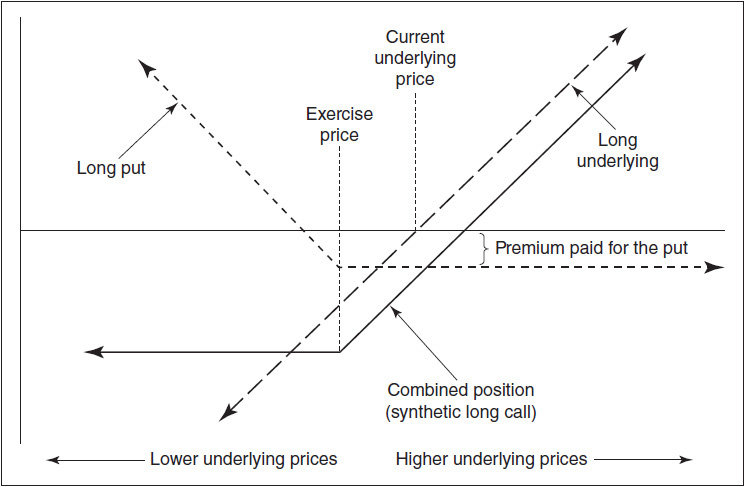
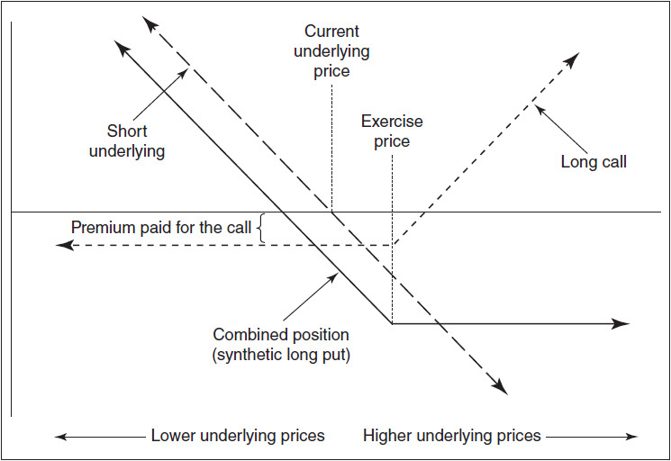
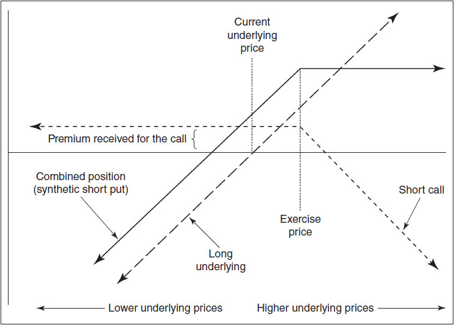
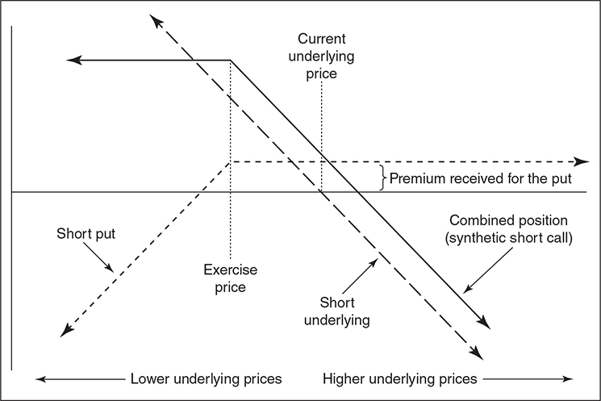
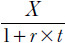
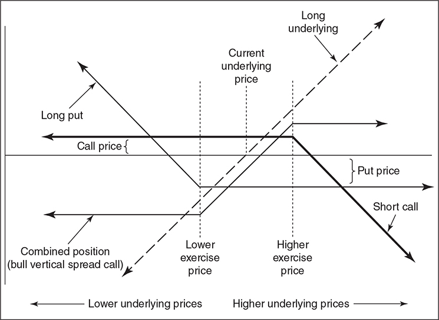
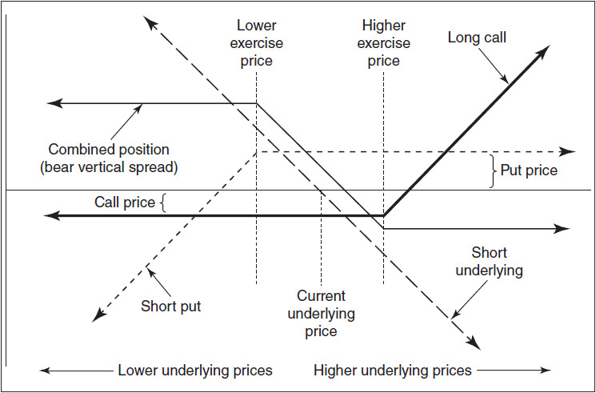
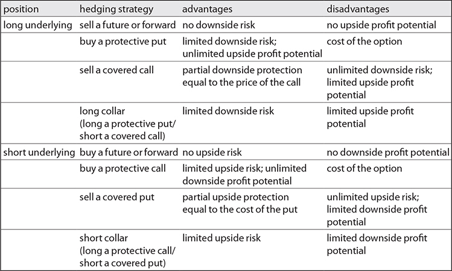
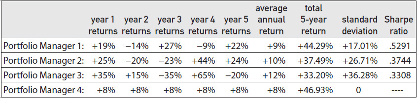

# 第17章 使用期权进行对冲 / Hedging with Options

[[00-阅读导航|← 返回阅读导航]] · [[00-翻译说明与术语表|术语表]]

> [!warning] 翻译状态
> 本章为机器初译，并使用本地术语表校验。英文原文、数字、公式和图表用于核对；中文将在后续复核中继续修订。

<!-- chapter-toc:start -->
## 本章目录 / Chapter Outline

> [!abstract] 结构导航
> 以下标题按原书顺序保留；点击可直接跳转。

- [[#保护性看涨期权与看跌期权 / Protective Calls and Puts|保护性看涨期权与看跌期权 / Protective Calls and Puts]]
- [[#备兑卖出 / Covered Writes|备兑卖出 / Covered Writes]]
- [[#领式策略 / Collars|领式策略 / Collars]]
- [[#复杂对冲策略 / Complex Hedging Strategies|复杂对冲策略 / Complex Hedging Strategies]]
- [[#通过对冲降低波动率 / Hedging to Reduce Volatility|通过对冲降低波动率 / Hedging to Reduce Volatility]]
- [[#投资组合保险 / Portfolio Insurance|投资组合保险 / Portfolio Insurance]]
<!-- chapter-toc:end -->
<!-- chapter-nav:start -->
> [!tip] 章节导航（章首）
> [[16-美式期权的提前行权 Early Exercise of American Options|← 上一章]] · [[00-阅读导航|全书导航]] · [[18-Black–Scholes 模型 The Black-Scholes Model|下一章 →]]
<!-- chapter-nav:end -->
<!-- source:block 82a01a85cbb2e31a -->

> [!quote]- English 1
> Futures and options were originally introduced as insurance contracts, enabling market participants to transfer the risk of holding a position in the underlying instrument from one party to another. But unlike a futures contract, which essentially transfers all the risk, an option transfers only part of the risk. In this respect, an option acts much more like a traditional insurance policy than does a futures contract.

期货和期权最初是作为保险合约引入的，使市场参与者能够将持有标的工具头寸的风险从一方转移到另一方。但与本质上转移所有风险的期货合约不同，期权只转移部分风险。在这方面，期权的作用更像是传统的保险单，而不是期货合约。

<!-- source:block 761ff03aaf45ebc4 -->

> [!quote]- English 2
> Even though options were originally intended to function as insurance policies, option markets have evolved to the point where, in most markets, hedgers (those wanting to protect an existing position) make up only a small portion of market participants. Other traders, including arbitrageurs, speculators, and spreaders, typically outnumber true hedgers. Nevertheless, hedgers still represent an important force in the marketplace, and any active market participant ought to be aware of the strategies a hedger might use to protect a position.

尽管期权最初的目的是充当保险单，但期权市场已经发展到这样的程度：在大多数市场中，对冲者（那些想要保护现有头寸的人）只占市场参与者的一小部分。其他交易者，包括套利者、投机者和散布者，数量通常超过真正的对冲者。尽管如此，对冲者仍然是市场中的重要力量，任何活跃的市场参与者都应该了解对冲者可能用来保护头寸的策略。

<!-- source:block ccfb13457960aae1 -->

> [!quote]- English 3
> Many hedgers come to the marketplace as either *natural longs* or *natural shorts*. Through the course of normal business activity, they will profit from either a rise or fall in the price of some underlying instrument. The producer of a commodity is a natural long; if the price of the commodity rises, the producer will receive more when he sells in the marketplace. The user of a commodity is a natural short; if the price of the commodity falls, the user will have to pay less for it when he buys in the marketplace. In the same way, lenders and borrowers are natural longs and shorts in terms of interest rates. A rise in interest rates will help lenders and hurt borrowers. A decline in interest rates will have the opposite effect.

许多对冲者要么是自然多头，要么是自然空头，要么是自然空头。在正常的商业活动过程中，他们将从某些标的工具价格的上涨或下跌中获利。商品的生产者是自然多头;如果商品价格上涨，生产者在市场上销售时就会得到更多。商品的使用者是天生的空头;如果商品价格下跌，使用者在市场上购买时将不得不支付更少的费用。同样，贷方和借款人在利率方面也是天然的多头和空头。利率上升将帮助贷方并伤害借款人。利率下降会产生相反的效果。

<!-- source:block 6c620ff53ccd1041 -->

> [!quote]- English 4
> Other potential hedgers come to the marketplace because they have voluntarily chosen to take a long or short position and now wish to lay off part or all of the risk of that position. A speculator in a commodity may have taken a long or short position but wishes to temporarily reduce the risk associated with an outright long or short position. A fund manager may hold a portfolio of stocks but believes that the value of the portfolio may decline in the short term. If so, it may be less expensive to temporarily hedge the stocks with options or futures than to sell the stocks and buy them back at a later date.

其他潜在的对冲者进入市场是因为他们自愿选择持有多头或空头头寸，并且现在希望放弃该头寸的部分或全部风险。大宗商品的投机者可能已经持有多头或空头头寸，但希望暂时降低与完全多头或空头头寸相关的风险。基金经理可能持有股票投资组合，但认为该投资组合的价值在短期内可能会下降。如果是这样，用期权或期货暂时对冲股票可能比出售股票并在稍后回购的成本更低。

<!-- source:block 1a2343c11f3a8ce8 -->

> [!quote]- English 5
> As with insurance, there is a cost to hedging. The cost may be immediately apparent in the form of a cash outlay. But the cost may also be more subtle, either in terms of lost profit opportunity or in terms of additional risk under some circumstances. Every hedging decision is a tradeoff: what is the hedger willing to give up under one set of market conditions in return for protection under a different set of market conditions. A hedger with a long position who wants to protect his downside will almost certainly have to give up something on the upside; a hedger with a short position who wants to protect his upside will have to give up something on the downside.

与保险一样，对冲也有成本。成本可能会以现金支出的形式立即显现出来。但成本也可能更加微妙，无论是在利润机会的损失还是在某些情况下的额外风险方面。每一个对冲决策都是一种权衡：对冲者在一组市场条件下愿意放弃什么，以换取另一组市场条件下的保护。一个持有多头头寸的对冲者想要保护自己的下跌空间，几乎肯定会放弃一些上行空间;一个持有空头头寸的对冲者想要保护自己的上涨空间，将不得不放弃一些下行空间。

<!-- source:block 62e3a2bdadd1b352 -->

## 保护性看涨期权与看跌期权 / Protective Calls and Puts

<!-- source:block 46e37a5b4a77ad1f -->

> [!quote]- English 6
> The simplest way to hedge an underlying position using options is to purchase either a put to protect a long position or a call to protect a short position. In each case, if the market moves adversely, the hedger is insulated from any loss beyond the exercise price. The difference between the exercise price and the current price of the underlying is similar to the deductible portion of an insurance policy. The price of the option is similar to the premium that one has to pay for the insurance policy.

使用期权对冲标的头寸的最简单方法是购买看跌期权以保护多头头寸，或购买看涨期权以保护空头头寸。在每一种情况下，如果市场走势不利，套期保值者都不会受到任何超过行权价的损失。行权价与相关资产当前价格之间的差额类似于保险单的可扣除部分。期权的价格与购买保险所需支付的保险费相似。

<!-- source:block 52e34edad74c2d85 -->

> [!quote]- English 7
> Consider an American firm that expects to take delivery of €1 million worth of German goods in six months. If the contract requires payment in euros at the time of delivery, the American firm has acquired a short position in euros against U.S. dollars. If over the next six months the euro rises against the dollar, the goods will cost more in dollars; if the euro falls, the goods will cost less. If the euro is currently trading at 1.35 (\$1.35 per euro) and remains there for the next six months, the cost to the American firm will be \$1,350,000. If, however, at delivery the euro has risen to 1.45 (\$1.45 per euro), the cost to the American firm will be \$1,450,000.

假设一家美国公司预计在六个月后接收价值 100 万欧元的德国商品。若合约要求在交付时以欧元付款，该公司就建立了欧元兑美元的空头敲口。未来六个月若欧元对美元升值，商品的美元成本将上升；若欧元贬值，成本则下降。若欧元当前为 1.35（每欧元 \$1.35），且六个月后仍保持该水平，公司的成本为 \$1,350,000。若交付时欧元上升至 1.45（每欧元 \$1.45），成本将增至 \$1,450,000。

<!-- source:block ede95a6660a7d4fc -->

> [!quote]- English 8
> The American firm can offset the risk it has acquired by purchasing a call option on euros, for example, a 1.40 call. For a complete hedge, the underlying contract will be €1 million, and the option will have an expiration date corresponding to the date on which payment is required. If the value of the euro begins to rise against the U.S. dollar, the firm will have to pay a higher price than expected when it takes delivery of the goods in six months. But the price it will have to pay for euros can never be greater than 1.40. If the price is greater than 1.40 at expiration, the firm will simply exercise its call, effectively purchasing euros at 1.40. If the price of euros is less than 1.40 at expiration, the firm will let the option expire worthless because it will be cheaper to purchase euros in the open market.

这家美国公司可以通过购买欧元看涨期权（例如1.40看涨期权）来抵消其所获得的风险。对于完整对冲，标的合约为100万欧元，期权的到期日与需要付款的日期相对应。如果欧元兑美元开始上涨，该公司在六个月内交货时将不得不支付比预期更高的价格。但它为欧元支付的价格永远不会超过1.40。如果到期时价格高于1.40，该公司将简单地行权看涨期权，实际上以1.40的价格购买欧元。如果欧元到期时价格低于1.40，该公司将让期权到期时变得毫无价值，因为在公开市场购买欧元会更便宜。

<!-- source:block 7a164971dd47213f -->

> [!quote]- English 9
> When used to hedge interest-rate risk, protective options are sometimes referred to as *caps* and *floors*. A firm that borrows funds at a variable interest rate has a short interest-rate position—falling interest rates will reduce its cost of borrowing, while rising interest rates will increase its costs. To *cap* the upside risk, the firm can purchase an interest-rate call, thereby establishing a maximum amount it will have to pay for borrowed funds. No matter how high interest rates rise, the borrower will never have to pay more than the cap’s exercise price.

当用于对冲利率风险时，保护性期权有时被称为上限和下限。以可变利率借入资金的公司的利率头寸较短——利率下降将降低借贷成本，而利率上升将增加借贷成本。为了限制上行风险，公司可以购买利率通知，从而确定其必须为借入资金支付的最高金额。无论利率上升多高，借款人永远不必支付超过上限的行权价的费用。

<!-- source:block 71d4cbf7d101889a -->

> [!quote]- English 10
> An institution that lends funds at a variable interest rate has a long interest-rate position—rising interest rates will increase its returns, while falling interest rates will reduce its returns. To set a *floor* on its downside risk, the institution can purchase an interest-rate put, thereby establishing a minimum amount it will receive for loaned funds. No matter how low interest rates fall, the lender will never receive less than the floor’s exercise price.

以可变利率放贷的机构利率头寸较长——利率上升会增加其回报，而利率下降会减少其回报。为了为其下行风险设定下限，该机构可以购买利率看跌期权，从而确定其将获得的贷款资金的最低金额。无论利率降得多低，贷方的收益永远不会低于下限的行权价。

<!-- source:block 6beade10e3606944 -->

> [!quote]- English 11
> A hedger who chooses to purchase a call to protect a short position or a put to protect a long position has risk limited by the exercise price of the option. At the same time, the hedger still maintains open-ended profit potential. If the underlying market moves in the hedger’s favor, he can let the option expire and take advantage of the position in the open market. If, in our example, the euro falls to 1.25 at the time of delivery, the firm will simply let the 1.40 call expire unexercised. At the same time, the firm will purchase €1 million for \$1,250,000, resulting in a windfall of \$100,000.

选择购买看涨期权以保护空头头寸或购买看跌期权以保护多头头寸的对冲者的风险受到期权行权价的限制。与此同时，对冲者仍保持开放式盈利潜力。 如果标的市场的走势对对冲者有利，他可以让期权到期并利用公开市场的头寸。在我们的示例中，如果欧元在交付时跌至1.25，则公司将简单地让1.40 看涨期权在未执行的情况下到期。 与此同时，该公司将以1,250,000,美元购买1百万欧元，从而获得100,000美元的意外之财。

<!-- source:block d2696456a58e77e2 -->

> [!quote]- English 12
> There is a cost involved in buying insurance in the form of a protective call or put, namely, the price of the option. The cost of the insurance is commensurate with the amount of protection afforded by the option. If the price of a six-month 1.40 call is 0.02, the firm will pay an extra \$20,000 (0.02 × 1 million) no matter what happens. A call option with a higher exercise price will cost less, but it also offers less protection in the form of an additional deductible amount. If the firm chooses to purchase a 1.45 call trading at .01, the cost for this insurance will only be \$10,000 (0.01 × 1 million), but the firm will have to bear any loss up to a euro price of 1.45. Only above 1.45 is the firm fully protected. In the same way, a lower-exercise-price call will offer additional protection but at a higher price. A 1.35 call will protect the firm against any rise above 1.35, but if the price of the call is 0.04, the purchase of this protection will add an additional \$40,000 (0.04 × 1 million) to the final cost.

以保护性看涨或看跌形式购买保险涉及成本，即期权的价格。保险费用与该期权提供的保护金额相称。如果六个月1.40看涨期权的价格是0.02，那么无论发生什么，该公司都将额外支付20,000美元（0.02 × 100万）。行权价较高的看涨期权成本较低，但它以额外免赔额形式提供的保护也较少。如果公司选择购买交易价格为0.01的1.45看涨期权，则该保险的成本仅为10,000美元（0.01 × 100万），但公司必须承担高达1.45欧元价格的任何损失。只有高于1.45，公司才能得到充分保护。同样，较低的行权价看涨将提供额外的保护，但价格更高。1.35看涨期权将保护公司免受1.35以上的任何上涨，但如果看涨期权的价格为0.04，则购买此保护将使最终成本额外增加40,000美元（0.04 × 100万）。

<!-- source:block 6769fdcac6dc3b53 -->

> [!quote]- English 13
> The cost of purchasing a protective option and the insurance afforded by the strategy are shown in Figures 17-1 (protective put) and 17-2 (protective call). Because each strategy combines an underlying position with a long option position, it follows from Chapter 14 that the resulting protected position is a synthetic long option

购买保护性期权的成本和该策略提供的保险如图17-1（保护性看跌）和17-2（保护性看涨）所示。由于每种策略都将标的头寸与多头期权头寸结合起来，因此从第14章可以看出，由此产生的受保护头寸是合成多头期权

<!-- source:block 2731f891ba3944f6 -->

*Figure 17-1 Long an underlying position and long a protective put. / Figure 17-1 Long an underlying position and long a protective put.*

<!-- source:block d3faf0f299565e95 -->

<!-- source:block 0d8cf17934f37acf -->

*图17-2做空标的头寸并做多保护性看涨。 / Figure 17-2 Short an underlying position and long a protective call.*

<!-- source:block 453761543c53931b -->

<!-- source:block 8067b0e8bb34eb83 -->

> [!quote]- English 16
> Short underlying + long call ≈ synthetic long put

$$
\text{Short underlying} + \text{long call} \approx \text{synthetic long put}
$$

<!-- source:block e1ba188e79fc505f -->

> [!quote]- English 17
> Long underlying + long put ≈ synthetic long call

$$
\text{Long underlying} + \text{long put} \approx \text{synthetic long call}
$$

<!-- source:block 9b1c90fb3c08473a -->

> [!quote]- English 18
> A hedger who buys a put to protect a long underlying position has effectively created a long call position at the same exercise price. A hedger who buys a call to protect a short underlying position has effectively created long put position. In our example, if the firm purchases a 1.40 call to protect a short euro position, the combined position (i.e., short underlying, long call) is equivalent to owning a 1.40 put.

一个套期保值者为了保护一个长期的标的头寸而购买了一个看跌期权，实际上是以同样的行权价创造了一个多头看涨期权。对冲者买入看涨期权以保护空头标的头寸，实际上创造了多头看跌头寸。在我们的例子中，如果公司购买1.40看涨期权来保护欧元空头头寸，那么组合头寸（即，做空标的，做多看涨期权）相当于拥有1.40看跌期权。

<!-- source:block ca15766083524b6c -->

> [!quote]- English 19
> Which protective option should a hedger buy? This depends on the amount of risk the hedger is willing to bear, something that each hedger must determine individually. One thing is certain: there will always be a cost associated with the purchase of a protective option. If the insurance afforded by the option enables the hedger to protect his financial position, the cost may be worthwhile.

对冲者应该购买哪种保护性选择？这取决于对冲者愿意承担的风险大小，这是每个对冲者必须单独确定的。有一件事是肯定的：购买保护性期权总是会产生相关的成本。如果期权提供的保险使对冲者能够保护其财务状况，那么成本可能是值得的。

<!-- source:block 1831a19be702368a -->

## 备兑卖出 / Covered Writes

<!-- source:block fac969752855b027 -->

> [!quote]- English 20
> If a hedger is averse to paying for protective options, which offer limited and well-defined risk, the hedger may instead consider selling, or writing, an option against an underlying position. This *covered write* (sometimes referred to as an *overwrite*) does not offer the limited risk afforded by the purchase of a protective option but does have the obvious advantage of creating an immediate cash credit. This credit offers limited protection against an adverse move in the underlying market.

如果对冲者不愿支付保护性期权的权利金，也可以考虑针对已有标的头寸卖出期权。这种备兑卖出（covered write，也称 overwrite）不具备买入保护性期权那种风险有限且界定明确的特征，但它能立即产生 `cash credit`；该笔 `credit` 可为标的市场的不利变动提供有限缓冲。

<!-- source:block ca2fc627b6423bcf -->

> [!quote]- English 21
> Consider an investor who owns stock but wants to protect against a short-term decline in the stock price. He can, of course, buy a protective put. But if he believes that any decline is likely to be only moderate, he might instead sell a call option against the long stock position. The amount of protection the investor is seeking, as well as the potential upside appreciation, will determine which call he sells, whether in the money, at the money, or out of the money. Selling an in-the-money call offers a high degree of protection but will eliminate most of the upside profit potential. Selling an out-of-the-money call offers less protection but leaves room for additional upside profit.

考虑一位拥有股票但希望防范股价短期下跌的投资者。当然，他可以购买保护性看跌期权。但如果他认为任何下跌都可能只是温和的，他可能会出售针对多头股票头寸的看涨期权。投资者正在寻求的保护金额以及潜在的上行增值将决定他出售哪一个看涨期权，无论是在价内、在平值还是在价外。出售价内的看涨期权可以提供高度的保护，但会消除大部分上行利润潜力。出售价外看涨期权提供的保护较少，但为额外的上行利润留下了空间。

<!-- source:block c9fa993543c2f519 -->

> [!quote]- English 22
> Suppose that an investor owns a stock that is currently trading at 100. If he sells a 95 call at a price of 6.50, the sale of the call will offer a high degree of protection against a decline in the price of the stock. As long as the stock declines by no more than 6.50 to 93.50, the investor will do no worse than break even. Unfortunately, if the stock begins to rise, there will be no opportunity to participate in the rising stock price because the stock will be called away when the investor is assigned on the 95 call. Still, even if the stock rises, the investor will at least profit by the time premium of 1.50 that he received from the sale of the 95 call.

假设投资者拥有一只目前交易价为100的股票。如果他以6.50的价格出售95看涨期权，则出售看涨期权将为股票价格下跌提供高度保护。只要股票跌幅不超过6.50至93.50，投资者的表现就不会比盈亏平衡差。不幸的是，如果该股开始上涨，就没有机会参与股价上涨，因为当投资者被指派到95看涨时，该股就会被召回。尽管如此，即使股价上涨，投资者也至少可以从出售95看涨期权中获得1.50的时间溢价中获利。

<!-- source:block 90a3a0d267dc886d -->

> [!quote]- English 23
> On the other hand, if the investor wants to participate in upside movement in the stock and is also willing to accept less protection on the downside, he might sell a 105 call. If the 105 call is trading at a price of 2.00, the sale of this option will only protect the investor down to a stock price of 98. But, if the stock price rises, the investor will participate up to a price of 105. Above 105, he can expect the stock to be called away, eliminating any further profit.

另一方面，如果投资者想参与股票的上行，并且也愿意接受较少的下跌保护，他可能会卖出105看涨期权。如果105看涨期权的交易价格为2.00，则出售该期权只能在股价98以下保护投资者。但是，如果股价上涨，投资者将参与的价格高达105。高于105，他预计该股将被召回，从而消除任何进一步的利润。

<!-- source:block 8d58d265c23dc146 -->

> [!quote]- English 24
> Which option should the investor sell? This is a subjective decision based on how much risk the investor is willing to accept, as well as the amount of upside appreciation in which he wants to participate. Many covered writes involve selling at-the-money options. Such options offer less protection than in-the-money calls and less profit potential than out-of-the-money options. But an at-the-money option has the greatest amount of time premium. If the market remains close to its current price, a position that is hedged by selling at-the-money options will show the greatest amount of appreciation.

投资者应当卖出哪一种期权？这是一个主观决定，取决于投资者愿意承受的风险，以及希望保留多少股价上涨收益。许多 covered write（备兑卖出）策略会选择卖出 ATM 期权。与 ITM call 相比，ATM 期权提供的下行保护较少；与 OTM call 相比，其潜在上涨收益也较少，但 ATM 期权的时间价值最高。如果市场价格维持在当前水平附近，卖出 ATM 期权进行对冲的头寸将获得最大的增值。

<!-- source:block 56f917e333519a7a -->

> [!quote]- English 25
> The characteristics of a covered write and the protection afforded by the strategy are shown in Figures 17-3 (covered call) and 17-4 (covered put). Because each strategy combines an underlying position with a short option position, it follows from Chapter 14 that the resulting protected position is a synthetic short option:

图 17-3（covered call，备兑看涨期权）和图 17-4（covered put，备兑看跌期权）展示了 covered write（备兑卖出）策略的特征及其提供的保护。由于两种策略都把标的头寸与期权空头组合在一起，根据第 14 章的合成关系，所得的受保护头寸等价于合成期权空头：

<!-- source:block b24120270e11568c -->

*图17-3做多标的头寸并做空已补看涨。 / Figure 17-3 Long an underlying position and short a covered call.*

<!-- source:block d1ce7d3b08ed3c35 -->

<!-- source:block aba9b0bc9d562be6 -->

*图17-4做空标的头寸并做空已付看跌期权。 / Figure 17-4 Short an underlying position and short a covered put.*

<!-- source:block 614b61d1135d41ad -->

<!-- source:block 161653d527e23232 -->

> [!quote]- English 28
> Long underlying + short call ≈ synthetic short put

$$
\text{Long underlying} + \text{short call} \approx \text{synthetic short put}
$$

<!-- source:block f3d47e0532d42a09 -->

> [!quote]- English 29
> Short underlying + short put ≈ synthetic short call

$$
\text{Short underlying} + \text{short put} \approx \text{synthetic short call}
$$

<!-- source:block 3289b826c2d7799d -->

> [!quote]- English 30
> A hedger who sells a call against a long underlying position has effectively created a short put position at the same exercise price. A hedger who sells a put to protect a short underlying position has effectively created short call put position. In our example, if the hedger sells a 105 call to protect a long stock position, the combined position (i.e., long underlying, short call) is equivalent to selling a 105 put.

出售针对多头标的头寸的看涨期权的对冲者实际上以相同的行权价创建了卖空头寸。出售看跌期权以保护空头标的头寸的对冲者实际上创造了空头看涨期权头寸。在我们的例子中，如果对冲者出售105看涨期权以保护多头股票头寸，则合并头寸（即，做多基础、做空看涨）相当于卖出105看跌期权。

<!-- source:block 1019205966d332cc -->

> [!quote]- English 31
> Selling a covered call against a long stock position is one of the most popular hedging strategies in equity option markets. When executed all at one time—buying stock and simultaneously selling a call on the stock—the strategy is referred to as a *buy/write*. The December 105 buy/write consists of buying one stock contract (usually 100 shares) and simultaneously selling a December 105 call. As with any spread, it can be quoted as a single price (the stock price – the call price) and executed with a single counterparty. With a stock trading at 100 and the December 105 call trading at 2.00, the December 105 buy/write is trading at 98.00. The price quoted by a market maker might be 97.90 – 98.10. In total, the market maker is willing to buy the stock and sell the call for 97.90. He is willing to sell the stock and buy the call for 98.10.

针对股票多头卖出备兑看涨期权，是股票期权市场最常见的对冲策略之一。若买入股票与卖出该股票的看涨期权同时执行，这一组合称为买入并备兑卖出（*buy/write*）。一组 12 月到期、行权价为 105 的 buy/write，由买入一份股票合约（通常为 100 股）并同时卖出一份 12 月 105 看涨期权构成。与价差委托一样，这一组合可以按一个净价报价，即股票价格减去看涨期权价格，并由同一交易对手执行。若股票交易价格为 100，12 月 105 看涨期权交易价格为 2.00，则这组 12 月 105 buy/write 的净价为 98.00。做市商可能报出 97.90–98.10：总体而言，他愿意按 97.90 买入股票并卖出看涨期权，也愿意按 98.10 卖出股票并买入看涨期权。

<!-- source:block 44804014cc5585ea -->

> [!quote]- English 32
> Buy/writes are such common strategies that some exchanges publish indexes reflecting the performance of the strategy, usually against a major stock index. The Chicago Board Options Exchange BuyWrite Index (BXM) reflects the performance of a strategy consisting of buying a Standard and Poor’s (S&P) 500 Index (SPX) portfolio and each month selling a slightly out-of-the-money one-month S&P 500 Index call option.1

买入/卖出是如此常见的策略，以至于一些交易所发布反映该策略表现的指数，通常针对主要股票指数。 芝加哥期权交易所买入写入指数（BXM）反映了一项策略的表现，该策略包括购买标准普尔（S & P）500指数（SPX）投资组合并每月出售稍微OTM的一个月期标准普尔500指数看涨期权。 [^ovp17-1]

<!-- source:block 18837f0db6582a0c -->

> [!quote]- English 33
> A covered write can also be used to set a target price for either buying or selling an underlying instrument. An investor who owns a stock may decide that if the stock reaches a certain price, he will be willing to sell. By selling a call with an exercise price equal to the target price, the investor has effectively locked in the sale if the stock reaches the exercise price. If the stock does not reach the exercise price, the investor still gets to keep the premium received from the sale of the call.

covered write（备兑卖出）也可以用来设定买入或卖出标的工具的目标价格。持有股票的投资者可能决定：若股价达到某一目标价，就愿意卖出股票。此时可以卖出行权价等于目标售价的 call；若股价达到该行权价，投资者实际上已经锁定了股票出售。若股价未达到行权价，投资者仍可保留卖出 call 所收取的权利金。

<!-- source:block cbb3706db9045fdd -->

> [!quote]- English 34
> Similarly, an investor who is willing to buy stock if the price declines by some given amount can sell a put with an exercise price equal to the target purchase price. If the stock falls below the exercise price, the investor will be assigned on the put, forcing him to purchase the stock. But that was his original intention. If the stock fails to fall below the exercise price, the investor gets to keep the premium received from the sale of the put. This strategy of selling puts to trigger the purchase of stock is often used by companies that want to initiate a buy-back program for their stock. By selling puts with exercise prices equal to the target buy-back price, the company either buys back its own stock or profits by the amount of the put premium.

同样，如果价格下跌一定数量，愿意购买股票的投资者可以出售行权价等于目标购买价的看跌期权。如果股票跌破行权价，投资者将被指派看跌期权，迫使他购买股票。但这是他的初衷。如果股票未能跌破行权价，投资者将保留出售看跌期权所获得的溢价。想要启动股票回购计划的公司经常使用这种出售看跌期权以触发股票购买的策略。通过出售行权价等于目标回购价格的看跌期权，公司要么回购自己的股票，要么通过看跌期权溢价的金额获利。

<!-- source:block bbdb0338c7d38baa -->

> [!quote]- English 35
> The primary difference between selling a call to set a sale price and selling a put to set a purchase price is the way in which the trade is secured. The sale of a call is secured with ownership of the stock. But the sale of the put must be secured with enough cash to support the purchase of the stock should the put be exercised. The sale of a *cash-secured put* requires the investor to keep on deposit cash equal to the exercise price of the put. If the put is European with no possibility of early exercise, the investor can keep on deposit cash equal to the present value of the exercise price

卖出看涨期权以设定卖出价格和卖出看跌期权以设定买入价格之间的主要区别在于交易的担保方式。认购权的出售是以股票的所有权为担保的。但出售认沽期权必须有足够的现金作为担保，以支持在认沽期权被行权时购买股票。现金担保看跌期权的出售要求投资者保持与看跌期权的行权价相等的现金存款。如果看跌期权是欧洲的，不可能提前行权，投资者可以保留等于行权价现值的存款现金

<!-- source:block cf3e7bb07782293a -->

<!-- 原 EPUB 中此公式为图片，已原样保留 -->

<!-- source:block 64b7675cf2d6a215 -->

> [!quote]- English 36
> The purchase of a protective option and the sale of a covered option are the two most common hedging strategies involving options. If given a choice between these strategies, which one should a hedger choose? In theory, the hedger ought to base his decision on the same criteria used by a trader: price versus value. If option prices seem low, the purchase of a protective option makes sense. If option prices seem high, the sale of a covered option makes sense. From a trader’s point of view, *low* or *high* is typically expressed in terms of implied volatility. By comparing implied volatility with the expected volatility over the life of the option, a hedger ought to be able to make a sensible determination as to whether he wants to buy or sell options. Of course, he is still left with the question of which exercise price to choose. This will depend on the amount of adverse or favorable movement the hedger foresees, as well as the risk he is willing to accept if he is wrong.

购买保护性期权和出售担保期权是两种最常见的涉及期权的对冲策略。如果在这些策略之间做出选择，对冲者应该选择哪一种？理论上，对冲者的决定应该基于交易者使用的相同标准：价格与价值。如果期权价格看起来很低，那么购买保护性期权是有意义的。如果期权价格看起来很高，那么出售担保期权是有意义的。从交易者的角度来看，低或高通常用隐含波动率来表示。通过将隐含波动率与期权有效期内的预期波动率进行比较，对冲者应该能够明智地决定他是想购买还是出售期权。当然，他仍然面临选择哪个行权价的问题。这将取决于对冲者预见的不利或有利走势的数量，以及如果他错了，他愿意接受的风险。

<!-- source:block a267f44a37acd6e4 -->

> [!quote]- English 37
> While theoretical considerations often play a role in a hedger’s decision, these may be less important than practical considerations. If a hedger knows that a move in the underlying contract beyond a certain price will represent a threat to his business, then the purchase of a protective option at that exercise may be the most sensible strategy regardless of whether the option is theoretically overpriced.2

虽然理论考虑通常在对冲者的决定中发挥作用，但这些可能不如实际考虑重要。 如果对冲者知道标的合约超出一定价格将对其业务构成威胁，那么在该行权中购买保护性期权可能是最明智的策略，无论该期权在理论上是否定价过高。 [^ovp17-2]

<!-- source:block 58809de0f1bd42cd -->

> [!quote]- English 38
> Many hedgers seem to have an aversion to buying protective options. “Why should I pay for an option when I will probably lose the premium?” This is, indeed, true. Most protective options do expire out of the money. The reasoning, however, seems illogical when one considers that most people willingly purchase insurance to protect their personal property. And the great majority of insurance policies expire without claims ever being made against them: houses do not burn down; people do not die; and cars are not stolen. This is the reason insurance companies make a profit. But most people do not buy insurance to make a profit. They do so for the peace of mind that the insurance policy affords. The same philosophy ought to apply to the purchase of options. If a hedger needs well-defined protection, the purchase of an option may be the best choice regardless of the fact that the option will most often expire worthless.

许多对冲者似乎厌恶购买保护性期权。“当我可能会失去保费时，为什么我要为期权付费呢？”这确实是事实。大多数保护期权都会在OTM过期。 然而，当考虑到大多数人愿意购买保险来保护他们的个人财产时，这种推理似乎不合逻辑。 绝大多数保险单到期后从未有人提出索赔：房子不会烧毁;人不会死亡;汽车不会被盗。这就是保险公司盈利的原因。但大多数人购买保险并不是为了盈利。 他们这样做是为了让保险单带来的安心。同样的理念也应该适用于期权的购买。如果对冲者需要明确的保护，那么购买期权可能是最好的选择，无论期权到期时往往一文不值。

<!-- source:block 2bbad01a70bfa62a -->

## 领式策略 / Collars

<!-- source:block 8cb91590a20d8568 -->

> [!quote]- English 39
> A hedger may want the limited risk afforded by the purchase of a protective option but may also be reluctant to pay the premium associated with such a strategy. What can he do? A *collar* involves simultaneously purchasing a protective option and selling a covered option against a position in an underlying contract.3 Collars are popular hedging tools because they offer known protection at a low cost. At the same time, they still allow a hedger to participate, at least partially, in favorable market movement. With an underlying stock trading at 100, a hedger with a long position might choose to buy a 95 put and at the same time sell a 105 call. The hedger is insulated from any fall in price below 95 because he can then exercise his put. At the same time, he can participate in any upward move up to 105.

对冲者可能希望购买保护性期权所提供的有限风险，但也可能不愿意支付与此类策略相关的溢价。他能做什么？领式策略涉及同时购买保护性期权并针对标的合约中的头寸出售担保期权。[^ovp17-3]领式策略是流行的对冲工具，因为它们以低成本提供已知的保护。与此同时，它们仍然允许对冲者至少部分参与有利的市场走势。当标的股票交易价格为100时，持有多头头寸的对冲者可能会选择买入95看跌期权，同时卖出105看涨期权。对冲者不会受到价格跌破95的影响，因为他可以行权看跌期权。同时，他可以参与任何向上移动至105。

<!-- source:block 676dd448b151fcb4 -->

> [!quote]- English 40
> The terms *long* and *short*, when applied to collars, typically refer to the underlying position. A long underlying position together with a protective put and covered call is a long collar. A short underlying position together with a protective call and covered put is a short collar. The characteristics of a collar are shown in Figures 17-5 and 17-6. Because every contract can be expressed as a synthetic equivalent, we can see that a long collar (Figure 17-5) is simply a bull vertical spread, while a short collar (Figure 17-6) is simply a bear vertical spread. Both strategies have limited risk and limited reward.

在领式策略中，“多头”和“空头”通常指标的头寸的方向。标的多头加保护性看跌期权和备兑看涨期权，构成多头领式（long collar）；标的空头加保护性看涨期权和备兑看跌期权，构成空头领式（short collar）。领式策略的特征见图 17-5 和图 17-6。由于每一份合约都可以表示为其合成等价头寸，多头领式（图 17-5）本质上是牛市垂直价差，空头领式（图 17-6）本质上是熊市垂直价差。两种策略的风险和收益都是有限的。

<!-- source:block fac9776f04056ac7 -->

*图17-5长领（做多标的合约，做多保护性看跌，做空备兑看涨期权）。 / Figure 17-5 Long collar (long an underlying contract, long a protective put, short a covered call).*

<!-- source:block 405ad9aba1ac16e1 -->

<!-- source:block 0e43890e18cd349c -->

*图17-6空头（做空标的合约，做多保护性看涨，做空有保障看跌）。 / Figure 17-6 Short collar (short an underlying contract, long a protective call, short a covered put).*

<!-- source:block a060df02f245fa51 -->

<!-- source:block 2ffc89d93782a9b1 -->

> [!quote]- English 43
> Because a collar is a vertical spread, it will have the risk characteristics described in Chapter 12. A long collar will always have a positive delta; a short collar will always have a negative delta. The gamma, theta, and vega will be determined by the choice of exercise prices. If the underlying price is closer to the protective option, the position will usually have a positive gamma, negative theta, and positive vega. If the underlying price is closer to the covered option, the position will usually have a negative gamma, positive theta, and negative vega. Unless one option is much further out of the money than the other, these risk measures are likely to be similar, resulting in only a small gamma, theta, and vega position. A hedger might also choose exercise prices such that the collar will be approximately neutral with respect to the gamma, theta, or vega.

由于衣领是垂直价差，因此它将具有第12章中描述的风险特征。长领总是有正的Delta;短领总是有负的Delta。Gamma、Theta和Vega将由行权价格的选择决定。 如果标的价格更接近保护性期权，则头寸通常具有正的Gamma、负的Theta和正的Vega。如果标的价格更接近备兑期权，头寸通常会有负的Gamma、正的Theta和负的Vega。 除非一个期权比另一个期权更远OTM，否则这些风险度量很可能相似，导致仅小的Gamma、Theta和Vega头寸。 对冲者还可以选择行权价格，以便衣领相对于Gamma、Theta或Vega大致中立。

<!-- source:block 30e9d6737665075c -->

> [!quote]- English 44
> Collars are also popular because the sale of the covered option may offset some or all of the cost of the protective option. When the price of the protective option is greater than the price of the covered option, as it is in Figure 17-5, the midsection of the combined position will fall below the profit and loss (P&L) graph for the underlying position. When the price of the protective option is less than the price of the covered option, as it is in Figure 17-6, the midsection of the combined position will be above the P&L graph for the underlying position. If the price of the protective option and the covered option are the same, the strategy becomes a *zero-cost collar*. A summary of basic hedging strategies is given in Figure 17-7.

衣领也很受欢迎，因为承保期权的出售可能会抵消保护期权的部分或全部成本。当保护性期权的价格大于担保期权的价格时，如图17-5所示，合并头寸的中间部分将跌破标的头寸的损益（P & L）图表。当保护性期权的价格低于担保期权的价格时，如图17-6所示，组合头寸的中部将位于标的头寸的损益图上方。如果保护性期权和承保期权的价格相同，该策略就变成了零成本衣领。基本对冲策略的摘要见图17-7。

<!-- source:block b44b1e712f4197f8 -->

*图17-7基本对冲策略摘要。 / Figure 17-7 Summary of basic hedging strategies.*

<!-- source:block 82345d4ae887b539 -->

<!-- source:block 56631bb0aa594b09 -->

## 复杂对冲策略 / Complex Hedging Strategies

<!-- source:block 938decfd1cac6ea3 -->

> [!quote]- English 46
> Because most hedgers are not professional option traders and have neither the time nor the desire to carefully analyze option prices, simple hedging strategies involving the purchase or sale of single options are the most widely used. However, if one is willing to do a more detailed analysis of options, it is possible to construct a wide variety of hedging strategies that involve both volatility and directional considerations. To do this, a hedger must be familiar with volatility and its impact on option values, as well as the delta as a measure of directional risk. The hedger can then combine his knowledge of options with the practical considerations of hedging.

由于大多数对冲者都不是专业的期权交易员，既没有时间也没有意愿仔细分析期权价格，因此涉及购买或出售单一期权的简单对冲策略是使用最广泛的。然而，如果人们愿意对期权进行更详细的分析，就有可能构建多种涉及波动率和方向性考虑的对冲策略。要做到这一点，对冲者必须熟悉波动率及其对期权价值的影响，以及作为方向风险度量标准的Delta。然后，对冲者可以将他的期权知识与对冲的实际考虑结合起来。

<!-- source:block 8c02fd183aa0fcbd -->

> [!quote]- English 47
> As a first step in choosing a strategy, a hedger might consider the following:

作为选择策略的第一步，对冲者可能会考虑以下几点：

<!-- source:block 9c198878996a04c1 -->

> [!quote]- English 48
> 1. Does the hedge need to offer protection against a worst-case scenario?

1.对冲是否需要提供针对最坏情况的保护？

<!-- source:block 875a5c8c6c765444 -->

> [!quote]- English 49
> 2. How much of the current directional risk should the hedge eliminate?

2.对冲应该消除多少当前的定向风险？

<!-- source:block 7481ae205436cf59 -->

> [!quote]- English 50
> 3. What additional risks is the hedger willing to accept?

3.对冲者愿意接受哪些额外风险？

<!-- source:block 2a8aa02f66a139ed -->

> [!quote]- English 51
> A hedger who needs disaster insurance to protect against a worst-case scenario only has a choice of which option(s) to buy. Even so, he still needs to decide which exercise price to purchase and how many options. With a long position in an underlying contract currently trading at 100, a hedger decides to buy a put because he needs to limit the downside risk to some known and fixed amount. Which put should he buy?

需要灾难保险来防范最坏情况的对冲者只能选择购买哪些期权。即便如此，他仍然需要决定购买哪个行权价以及购买多少期权。由于标的合约的多头头寸目前交易价为100，对冲者决定购买看跌期权，因为他需要将下跌风险限制在某个已知且固定的金额。他应该买哪个看跌期权？

<!-- source:block 4d051b76edc643f3 -->

> [!quote]- English 52
> If the hedger has determined that options are generally overpriced (i.e., implied volatility seems high), any option purchase will clearly be to the hedger’s disadvantage. If his sole purpose is to hedge his downside risk without regard to upside profit potential, he ought to avoid options and hedge his position in the futures or forward market. If, however, he still wants upside profit potential, he must ask himself how much of a long position he wants to retain. If he is willing to retain 50 percent of his current long position, he ought to purchase puts with a total delta of –50. He can do this by purchasing one at-the-money put with a delta of –50 or several out-of-the-money puts whose deltas add up to –50. In a high-implied-volatility market, however, it is usually best to buy as few options as possible and sell as many options as possible. (This is analogous to constructing a ratio spread.) Hence, purchasing one put with a delta of –50 will be less costly, theoretically, than purchasing several puts with a total delta of –50. If the hedger wants to eliminate even more of the directional risk, say, 75 percent, under these circumstances, he will be better off purchasing one put with a delta of –75.

如果对冲者确定期权通常定价过高（即，隐含波动率似乎很高），任何期权购买显然都会对对冲者不利。如果他的唯一目的是对冲下跌风险，而不考虑上涨利润潜力，那么他应该避免期权并对冲期货或远期市场的头寸。然而，如果他仍然想要上行利润潜力，他必须问自己他想保留多少多头头寸。如果他愿意保留当前多头头寸的50%，他应该购买Delta为-50的看跌期权。他可以通过购买一个Delta为-50的平值看跌期权或多个Delta之和为-50的价外看跌期权来实现这一点。然而，在高隐含波动率的市场中，通常最好是尽可能少地买入期权，尽可能多地卖出期权。(This类似于构建比率价差。）因此，理论上，购买一个Delta为-50的看跌期权比购买几个Delta为-50的看跌期权成本更低。如果对冲者想要消除更多的定向风险，比如75%，在这种情况下，他最好购买Delta为-75的看跌期权。

<!-- source:block 5f1af331527d52e8 -->

> [!quote]- English 53
> *All other factors being equal, in a high-implied-volatility market, a hedger should buy as few options as possible and/or sell as many options as possible. Conversely, in a low-implied-volatility market, a hedger should buy as many options as possible and/or sell as few options as possible*.

在所有其他因素相同的情况下，在高隐含波动率市场中，对冲者应该购买尽可能少的期权和/或出售尽可能多的期权。相反，在低隐含波动率市场中，对冲者应该购买尽可能多的期权和/或出售尽可能少的期权。

<!-- source:block 0f78b4a7957ede2c -->

> [!quote]- English 54
> This means that if all options are overpriced (i.e., implied volatility seems high) and the hedger decides that he is willing to accept the unlimited downside risk that goes with the sale of a covered call, in theory, he ought to sell as many calls as possible to reach his hedging objectives. If he is trying to hedge 50 percent of his long underlying position, he can do a *ratio write* by selling several out-of-the-money calls with a total delta of 50 rather than selling a single at-the-money call with a delta of 50.

这意味着，如果所有期权定价过高（即，隐含波动率似乎很高），并且对冲者决定他愿意接受出售备兑看涨期权所带来的无限下行风险，理论上，他应该出售尽可能多的看涨期权以实现他的对冲目标。如果他试图对冲50%的多头标的头寸，他可以通过出售几个总Delta为50的价外看涨期权来进行比率写入，而不是出售一个Delta为50的平值看涨期权。

<!-- source:block 974bb74f9a9eb265 -->

> [!quote]- English 55
> There is an obvious disadvantage if one sells multiple calls against a single long underlying position. Now the hedger not only has the unlimited downside risk that goes with a covered call position, but he also has unlimited upside risk because he has sold more calls than he can cover with the underlying. If the market moves up enough, he will be assigned on all the calls. Most hedgers want to restrict their unlimited risk to one direction, usually the direction of their natural position. A hedger with a long underlying position may be willing to accept unlimited downside risk, but he is probably unwilling to accept unlimited upside risk. A hedger with a short underlying position may be willing to accept unlimited upside risk, but he is probably unwilling to accept unlimited downside risk. A hedger who constructs a position with unlimited risk in either direction is presumably taking a volatility position. There is nothing wrong with this because volatility trading can be highly profitable. But a true hedger ought not lose sight of what his ultimate goal is—to protect an existing position and to keep the cost of this protection as low as possible.

如果针对单一多头标的头寸出售多个看涨期权，那么存在明显的缺点。现在，对冲者不仅面临备兑看涨期权头寸所带来的无限下跌风险，而且还面临无限的上涨风险，因为他出售的看涨期权数量超过了标的头寸所能弥补的数量。如果市场上涨足够多，他将被指派参加所有看涨期权会议。大多数对冲者希望将其无限风险限制在一个方向，通常是其自然头寸的方向。拥有多头标的头寸的对冲者可能愿意接受无限的下跌风险，但他可能不愿意接受无限的上涨风险。持有空头标的头寸的对冲者可能愿意接受无限的上行风险，但他可能不愿意接受无限的下行风险。对冲者如果在任何一个方向上建立了无限风险的头寸，那么他很可能会采取波动率头寸。这没有什么问题，因为波动率交易可以利润丰厚。但真正的对冲者不应该忽视他的最终目标是什么——保护现有头寸并尽可能降低这种保护的成本。

<!-- source:block 76e19767493b6ccf -->

> [!quote]- English 56
> A hedger can also protect a position by constructing one-to-one volatility spreads with deltas that yield the desired amount of protection. A hedger who wants to protect 50 percent of a short underlying position can buy or sell calendar spreads or butterflies with a total delta of +50. Such spreads offer partial protection within a range. The entire position still has unlimited upside risk but also retains unlimited downside profit potential. Such volatility spreads also give the hedger the choice of buying or selling volatility. If implied volatility is generally low, with the underlying market currently at 100, the hedger might protect a short underlying position by purchasing a 110 call calendar spread (i.e., purchase a long-term 110 call, sell a short-term 110 call). This spread has a positive delta and is also theoretically attractive because the low implied volatility makes a long calendar spread relatively inexpensive. If the 110 call calendar spread has a delta of +25, to hedge 50 percent of his directional risk, the hedger can buy two spreads for each short underlying position. Conversely, if implied volatility is high, the hedger can consider selling calendar spreads. Now he will have to choose a lower exercise price to achieve a positive delta. If he sells the 90 call calendar spread (i.e., purchase a short-term 90 call, sell a long-term 90 call), he will have a position with a positive delta and a positive theoretical edge. If he wants to protect 75 percent of his position and the spread has a delta of +25, he can sell the spread three times for each underlying position. (See Chapter 11 for characteristics of calendar spreads and butterflies.)

对冲者还可以通过构建具有Delta的一对一波动率价差来保护头寸。想要保护50%空头标的头寸的对冲者可以购买或出售总Delta为+50的日历价差或蝶式价差。此类价差在一定价差内提供部分保护。整个头寸仍然具有无限的上行风险，但也保留了无限的下行利润潜力。这样的波动率价差也给了对冲者买入或卖出波动率的选择。如果隐含波动率普遍较低，而标的市场目前为100，对冲者可能会通过购买110看涨日历价差（即，买入长期110看涨期权，卖出短期110看涨期权）。这种价差有一个正的Delta，理论上也很有吸引力，因为低隐含波动率使得长期价差相对便宜。如果110看涨日历价差的Delta为+25，为了对冲50%的定向风险，对冲者可以为每个空头标的头寸购买两个价差。相反，如果隐含波动率很高，对冲者可以考虑出售日历价差。现在他必须选择较低的行权价才能实现正Delta。如果他出售90个看涨期权日历价差（即，买入短期90看涨期权，卖出长期90看涨期权），他将拥有正Delta和正理论优势的头寸。如果他想保护75%的头寸，并且价差的Delta为+25，他可以将每个标的头寸的价差出售三次。(See第11章日历和蝶式价差的特征。）

<!-- source:block c763b62703420ef7 -->

> [!quote]- English 57
> A hedger can also buy or sell vertical spreads to achieve a desired amount of protection. Depending on whether options are generally underpriced or overpriced (i.e., implied volatility is excessively low or high), the hedger will work around the at-the-money option. With the underlying market currently at 100, the hedger who wants to protect a long position can execute a bear vertical spread (i.e., sell the lower exercise price, buy the higher exercise price). If implied volatility is high, he will prefer to sell an at-the-money option and buy an option at a higher exercise price. If implied volatility is low, he will prefer to buy an in-the-money option and sell an option at a lower exercise price. Each spread will have a negative delta but will also have a positive theoretical edge because the at-the-money option is the most sensitive to changes in volatility. (See Chapter 12 for characteristics of vertical spreads.)

对冲者还可以购买或出售垂直价差以实现所需的保护金额。取决于期权通常是定价过低还是定价过高（即，隐含波动率过低或过高），对冲者将围绕平值的选择进行工作。由于标的市场目前为100，想要保护多头头寸的对冲者可以执行熊市垂直价差（即，卖出较低的行权价，买入较高的行权价）。如果隐含波动率很高，他会更愿意出售平值期权，并以更高的行权价购买期权。如果隐含波动率较低，他会更愿意购买价内期权并以较低的行权价出售期权。每个价差将具有负的Delta，但也将具有正的理论优势，因为平值期权对波动率变化最敏感。(See第12章垂直价差的特征。）

<!-- source:block 76f0b740fcf3d1be -->

> [!quote]- English 58
> As is obvious, using options to hedge a position can be just as complex as using options to construct trading strategies. Many factors go into the decision-making process. When a potential hedger is confronted for the first time with the multitude of possible strategies, he can understandably feel overwhelmed, to the point where he decides to abandon options completely. Perhaps a better approach is to consider a limited number of strategies (perhaps four or five) that make sense and compare the various risk-reward characteristics of the strategies. Given the hedger’s general market outlook and his willingness or unwillingness to accept certain risks, it should then be possible to make an informed decision.

显而易见，使用期权对冲头寸可能与使用期权构建交易策略一样复杂。决策过程涉及许多因素。当潜在的对冲者第一次面对多种可能的策略时，他会感到不知所措，甚至决定完全放弃选择，这是可以理解的。也许一个更好的方法是考虑有限数量的有意义的策略（也许四个或五个），并比较这些策略的各种风险回报特征。鉴于对冲者的总体市场前景以及他愿意或不愿意接受某些风险，那么应该可以做出明智的决定。

<!-- source:block 0ff64c8e52de125b -->

## 通过对冲降低波动率 / Hedging to Reduce Volatility

<!-- source:block bf46d1991effcd95 -->

> [!quote]- English 59
> In addition to protecting a position against an adverse move in the underlying contract, hedging strategies have an additional important advantage—they tend to reduce the volatility of a position. To understand why this may be important, consider a portfolio manager who generates the following annual returns over a period of five years:

除了保护头寸免受标的合约不利变动之外，对冲策略还有一个额外的重要好处——它们往往会降低头寸的波动率。要理解为什么这可能很重要，请考虑一位在五年内产生以下年度回报的投资组合经理：

<!-- source:block c273afe9a36e953a -->

> [!quote]- English 60
> +19% –14% +27% –9% +22%

$$
+19\% -14\% +27\% -9\% +22\%
$$

<!-- source:block 8d7b601a61d2ad67 -->

> [!quote]- English 61
> His average annual return is

他的平均年回报是

<!-- source:block 09afc50588b8576f -->

> [!quote]- English 62
> (19% – 14% + 27% – 9% + 22%)/5 = +9%

$$
(19\% - 14\% + 27\% - 9\% + 22\%)/5 = +9\%
$$

<!-- source:block 40a6c6c72fbc029b -->

> [!quote]- English 63
> Now consider a second portfolio manager who generates these annual returns:

现在考虑第二个投资组合经理，他产生了这些年回报：

<!-- source:block 5a89300ac4763fc5 -->

> [!quote]- English 64
> +25% –20% –23% +44 +24

$$
+25\% -20\% -23\% +44 +24
$$

<!-- source:block 8d7b601a61d2ad67 -->

> [!quote]- English 65
> His average annual return is

他的平均年回报是

<!-- source:block ca8bfd7cc72e955f -->

> [!quote]- English 66
> (25% – 20% – 23% + 44% + 24%)/5 = +10%

$$
(25\% - 20\% - 23\% + 44\% + 24\%)/5 = +10\%
$$

<!-- source:block 977e6926ec73e376 -->

> [!quote]- English 67
> Finally, a third portfolio manager generates these returns:

最后，第三个投资组合经理产生这些回报：

<!-- source:block adf4bcbad56d55db -->

> [!quote]- English 68
> +35% +15 –35 +65% –20%

$$
+35\% +15 -35 +65\% -20\%
$$

<!-- source:block 8d7b601a61d2ad67 -->

> [!quote]- English 69
> His average annual return is

他的平均年回报是

<!-- source:block eb0d47f554180066 -->

> [!quote]- English 70
> (35% + 15% – 35% + 65% – 20%)/5 = +12%

$$
(35\% + 15\% - 35\% + 65\% - 20\%)/5 = +12\%
$$

<!-- source:block 54f9c2403de4f068 -->

> [!quote]- English 71
> Portfolio Manager 3 trumpets his average annual return of 12 percent compared with Portfolio Managers 1 and 2, with returns of only 9 and 10 percent. Clearly, we ought to invest our money with Portfolio Manager 3. Or should we? Perhaps we should consider not only what is happening each year but also how each portfolio performs over the entire five-year period. We can do this by taking the product of all the annual changes for each portfolio:

投资组合经理3宣称其平均年回报率为12%，而投资组合经理1和2的回报率仅为9%和10%。显然，我们应该将钱投资于投资组合经理3。或者我们应该？也许我们不仅应该考虑每年发生的事情，还应该考虑每个投资组合在整个五年内的表现。我们可以通过取每个投资组合所有年度变化的积来做到这一点：

<!-- source:block f41cc1b5de9a2c18 -->

> [!quote]- English 72
> Portfolio 1: 1.19 × 0.86 × 1.27 × 0.91 × 1.22 = 1.4429 (up 44.29%)

$$
\text{Portfolio} 1: 1.19 \times 0.86 \times 1.27 \times 0.91 \times 1.22 = 1.4429 (\text{up} 44.29\%)
$$

<!-- source:block 8725a2fbe452e56b -->

> [!quote]- English 73
> Portfolio 2: 1.25 × 0.80 × 0.77 × 1.44 × 1.24 = 1.3749 (up 37.49%)

$$
\text{Portfolio} 2: 1.25 \times 0.80 \times 0.77 \times 1.44 \times 1.24 = 1.3749 (\text{up} 37.49\%)
$$

<!-- source:block 3a35314b8286d631 -->

> [!quote]- English 74
> Portfolio 3: 1.35 × 1.15 × 0.65 × 1.65 × 0.80 = 1.3320 (up 33.20%)

$$
\text{Portfolio} 3: 1.35 \times 1.15 \times 0.65 \times 1.65 \times 0.80 = 1.3320 (\text{up} 33.20\%)
$$

<!-- source:block b1d7d073bb313c9f -->

> [!quote]- English 75
> Even though Portfolio Manager 3 had the best average annual return, his portfolio fared the worst. Portfolio Manager 1, with the lowest annual return, fared the best, making 11 percent more over the five-year period than Portfolio Manager 3.

尽管投资组合经理3的平均年回报率最高，但他的投资组合表现最差。年回报率最低的投资组合经理1表现最好，五年内的收益比投资组合经理3高出11%。

<!-- source:block aee326ee202a2868 -->

> [!quote]- English 76
> The explanation for this seemingly unexpected result has to do with the volatility, or standard deviation, of the returns. The returns for Portfolio Manager 3 fluctuated wildly from a high of +65 percent to a low of –35 percent. The returns for Portfolio Manger 1 fluctuated much less, between +27 percent and –14 percent. The greater volatility seemed to reduce the total return.

这一看似意外的结果的解释与回报的波动率或标准差有关。投资组合经理3的回报率从+65%的高点到-35%的低点大幅波动。投资组合经理1的回报波动较小，在+27%和-14%之间。更大的波动率似乎降低了总回报。

<!-- source:block 97cf0cb71ee44f4b -->

> [!quote]- English 77
> The results for each portfolio manager are summarized in Figure 17-8. We have also added a very boring Portfolio Manager 4, who plods along with a return of exactly 8 percent each year for the five-year period. In spite of having the lowest average return, his portfolio performed the best, gaining 46.93 percent over the entire period.

图17-8总结了每位投资组合经理的结果。我们还增加了一位非常无聊的投资组合经理4，他在五年内每年的回报率正好为8%。尽管平均回报率最低，但他的投资组合表现最好，整个期间上涨了46.93%。

<!-- source:block 49cbc820d533f26c -->

*图17-8波动率越大，总回报越低。 / Figure 17-8 The greater the volatility, the lower the total return.*

<!-- source:block 3735b67ed9d5369e -->

<!-- source:block a6ba2d4b895185a6 -->

> [!quote]- English 79
> Our example does not mean that high volatility is unacceptable. A portfolio manager with highly volatile returns may still be preferable if his average return is also commensurably higher. This tradeoff between returns and volatility is often expressed by the *Sharpe ratio*, originally suggested by William Sharpe in 19664

我们的例子并不意味着高波动率是不可接受的。如果回报高度波动的投资组合经理的平均回报也不可否认地更高，那么他可能仍然是更可取的。 回报和波动率之间的权衡通常用Sharpe比率来表达，该比率最初由William Sharpe在1966中提出 [^ovp17-4]

<!-- source:block 57874944cd453fb5 -->

> [!quote]- English 80
> Average return/standard deviation of returns

$$
\text{Average return}/\text{standard deviation of returns}
$$

<!-- source:block 778373a38d28aaf6 -->

> [!quote]- English 81
> The greater the Sharpe ratio, the more favorable the tradeoff between risk (volatility) and reward (returns). The standard deviation and the Sharpe ratio for all four portfolio managers are also given in Figure 17-8.

夏普比率越大，风险（波动率）和回报（回报）之间的权衡就越有利。图17-8给出了四位投资组合经理的标准差和夏普比率。

<!-- source:block dbe70b214fd7b0ea -->

## 投资组合保险 / Portfolio Insurance

<!-- source:block f5609010304cf95c -->

> [!quote]- English 82
> Imagine that we hold a long position in an underlying asset such as stock and that we would like to protect our position against a possible decline in price over some period of time. One possible strategy is to purchase a protective put. Unfortunately, when we go into the market to purchase the put, we find that no market exists for options on our stock. What can we do?

想象一下，我们持有股票等标的资产的多头头寸，并且我们希望保护我们的头寸免受一段时间内价格可能下跌的影响。一种可能的策略是购买保护性看跌期权。不幸的是，当我们进入市场购买看跌期权时，我们发现我们股票的期权不存在市场。我们能做什么？

<!-- source:block e4dfa4c73b197f28 -->

> [!quote]- English 83
> If we were really able to purchase a put, our position would be

如果我们真的能够购买看跌期权，我们的头寸将是

<!-- source:block c404451ffb22dced -->

> [!quote]- English 84
> Long stock + long put

$$
\text{Long stock} + \text{long put}
$$

<!-- source:block 7dcbaaf7ab001878 -->

> [!quote]- English 85
> But we know that a long underlying position together with a long put is equivalent to a long call. What we really want is a long call position with the same exercise price and expiration date as the put that we wanted but were unable to buy.

但我们知道，做多标的头寸加上做多看跌相当于做多看涨。我们真正想要的是一个与我们想要但无法购买的看跌期权相同的行权价和到期日的多头看涨头寸。

<!-- source:block c4b7019af75d56a3 -->

> [!quote]- English 86
> What would be the characteristics of this call? We can determine this by using a theoretical pricing model. To do this, we need the basic inputs into the theoretical pricing model:

这次看涨期权的特点是什么？我们可以通过使用理论定价模型来确定这一点。为此，我们需要理论定价模型的基本输入：

<!-- source:block 7a9ac12eb0fec9e8 -->

> [!quote]- English 87
> Exercise price

行权价

<!-- source:block d39f8696f49c49b7 -->

> [!quote]- English 88
> Time to expiration

距到期时间

<!-- source:block cd62a672c4625db5 -->

> [!quote]- English 89
> Underlying stock price

标的股票价格

<!-- source:block de92a17421d1f5e4 -->

> [!quote]- English 90
> Interest rate

利率

<!-- source:block 09fa971c6c1991ad -->

> [!quote]- English 91
> Volatility

波动率

<!-- source:block 5b6de0ed6f5d1fd3 -->

> [!quote]- English 92
> Because we are not dependent on listed exercise prices and expiration dates (because none exist), the exercise price and expiration date can be of our own choosing. We can determine the stock price and interest rate from current market conditions. Only the volatility cannot be directly observed in the marketplace. But, if we have a database of historical price changes for the stock, we may be able to make a reasonable estimate of the stock’s volatility.

由于我们不依赖于列出的行权价和到期日（因为不存在），因此行权价和到期日可以由我们自己选择。我们可以根据当前的市场情况来确定股价和利率。只有波动率无法在市场上直接观察到。但是，如果我们有一个股票历史价格变化的数据库，我们也许能够对股票的波动率做出合理的估计。

<!-- source:block eb1db40fa9b49c79 -->

> [!quote]- English 93
> Suppose that we feed all the inputs into a theoretical pricing model and determine that our intended call has a delta of 75. To replicate the call position, we need to own 75 percent of the underlying contract. We can achieve this by selling off 25 percent of our holdings in the stock. If we originally owned 1,000 shares, we need to sell 250 shares, leaving us with a long position of 750 shares.

假设我们将所有输入输入到理论定价模型中，并确定我们的预期看涨期权的Delta为75。要复制看涨期权头寸，我们需要拥有标的合约的75 %。我们可以通过出售25 %的股票来实现这一目标。 如果我们最初拥有1,000股，我们需要出售250股，从而留下750股的多头头寸。

<!-- source:block 8d790983ee5f69ee -->

> [!quote]- English 94
> Now suppose that at some later date we look at the new market conditions, recalculate the delta of the call, and find that it is now 60. To achieve the desired delta position, we must now sell off an additional 15 percent of our original holdings, or 150 shares. We are now long 600 shares of stock.

现在假设在稍后的某个日期，我们查看新的市场条件，重新计算看涨的Delta，并发现现在是60。为了实现所需的Delta头寸，我们现在必须额外出售15%的原始持股，即150股。我们现在做多600股股票。

<!-- source:block 6d736f1340e8d26e -->

> [!quote]- English 95
> Suppose that we continue this process of periodically calculating the delta from current market conditions and buying or selling some percentage of our original holding in the underlying stock to achieve a position with the same delta as the presumed call option. Finally, suppose that at the target expiration date we buy back a sufficient amount of the stock so that we have 100 percent of our original holding. What should be the result of this entire process?

假设我们继续这个过程，定期计算当前市场状况的Delta，并购买或出售我们原始持有的标的股票的一定比例，以获得与假设的看涨期权相同Delta的头寸。最后，假设我们在目标到期日回购了足够数量的股票，以便我们拥有100%的原始持股。整个过程的结果应该是什么？

<!-- source:block ffc92c6c4fffb3fb -->

> [!quote]- English 96
> We are essentially going through the dynamic hedging process described in Chapter 8. Whereas in Chapter 8 we used dynamic hedging to capture the difference between an option’s price in the marketplace and its theoretical value, in our current example, we cannot profit from a mispriced option because no option exists. But we can replicate the characteristics of the option to achieve a desired option position.

我们本质上正在经历第8章描述的动态对冲过程。在第8章中，我们使用动态对冲来捕捉市场上期权价格与其理论价值之间的差异，但在我们当前的例子中，我们无法从定价错误的期权中获利，因为不存在期权。但我们可以复制期权的特征以实现所需的期权头寸。

<!-- source:block f6496e20b2456dd9 -->

> [!quote]- English 97
> In Chapter 8 we presented a stock option example and a futures option example. In the stock option example, we bought a call at a price that was less than its theoretical value and then sold the call, through the dynamic hedging process, at a price that was equal to its theoretical value. In the futures option example, we sold a put at a price that was greater than its theoretical value and then bought the put, through the dynamic hedging process, at a price that was equal to its theoretical value. In both examples, we ended up with a profit equal to the difference between the option’s price and its theoretical value.

在第8章中，我们给出了一个股票期权示例和一个期货期权示例。在股票期权示例中，我们以低于其理论价值的价格购买了看涨期权，然后通过动态对冲过程以等于其理论价值的价格出售看涨期权。在期货期权示例中，我们以高于其理论价值的价格出售看跌期权，然后通过动态对冲过程以等于其理论价值的价格购买看跌期权。在这两个例子中，我们最终获得的利润等于期权价格与其理论价值之间的差额。

<!-- source:block ff81b6a7480cd5dd -->

> [!quote]- English 98
> *Portfolio insurance*, or *option replication*, is a method by which the dynamic hedging process is used to create a position with the same characteristics as an option. In theory, the method should achieve the same results as buying a protective option but without actually purchasing the option. Portfolio insurance can be used by a fund manager to insure the value of the securities in a portfolio against a drop in value. If a manager has a portfolio of securities currently valued at \$100 million and wants to insure the value of the portfolio against a drop in value below \$90 million, he can either buy a \$90 million put or replicate the characteristics of a \$90 million call. If he is unable to find someone willing to sell him a \$90 million put, he can evaluate the characteristics of the \$90 million call and continuously buy or sell a portion of his portfolio required to replicate the call position. In effect, he has created his own put.

投资组合保险或期权复制是一种使用动态对冲过程创建与期权具有相同特征的头寸的方法。理论上，该方法应该与购买保护性期权但实际上没有购买该期权相同的结果。基金经理可以使用投资组合保险来确保投资组合中证券的价值免受价值下跌的影响。如果经理拥有目前价值1亿美元的证券投资组合，并且希望确保投资组合的价值不会跌破9000万美元，他可以购买9000万美元的看跌期权，也可以复制9000万美元看涨期权的特征。如果他找不到愿意向他出售9000万美元看跌期权的人，他可以评估9000万美元看涨期权的特征，并连续购买或出售复制看涨头寸所需的一部分投资组合。实际上，他创造了自己的看跌期权。

<!-- source:block 42a371e6aa8a59a6 -->

> [!quote]- English 99
> Portfolio insurance strategies were widely used by fund managers prior to the stock market crash of 1987, especially by managers with a portfolio that tended to track a major index. If the portfolio manager wanted to buy protective puts but also believed that the prices of puts were inflated, he could create the puts himself at the “correct” theoretical value through the dynamic hedging process. Instead of buying or selling a portion of the portfolio, which could be expensive in terms of transaction costs, the portfolio manager could mimic the delta adjustments by buying or selling index futures to increase or reduce the total value of the portfolio. In return for a fee, firms that marketed portfolio insurance strategies assumed the responsibility of determining the characteristics of the option that the portfolio manager wanted to purchase by estimating the correct volatility and choosing the most appropriate option pricing model.5 Some portfolio insurance firms generated additional fees by acting as a broker and executing the necessary adjustments in the index futures market.

在1987年股市崩盘之前，基金经理广泛使用投资组合保险策略，尤其是投资组合倾向于跟踪主要指数的基金经理。如果投资组合经理想购买保护性看跌期权，但又认为看跌期权的价格被夸大，他可以通过动态对冲过程以“正确”的理论价值创造自己的看跌期权。投资组合经理可以通过购买或出售指数期货来模拟Delta调整，以增加或减少投资组合的总价值，而不是购买或出售投资组合的一部分（这在交易成本方面可能很昂贵）。作为费用的回报，营销投资组合保险策略的公司承担了通过估计正确的波动率并选择最合适的期权定价模型来确定投资组合经理想要购买的期权的特征的责任。[^ovp17-5]一些投资组合保险公司通过担任经纪人并在指数期货市场执行必要的调整来产生额外的费用。

<!-- source:block aa75206e9ece1e7b -->

> [!quote]- English 100
> Unfortunately, following the crash of 1987, practitioners came to realize that portfolio insurance would only achieve the desired results if the inputs into the model were correct and the model itself was based on realistic assumptions.6 No one foresaw the dramatic increase in volatility resulting from the crash, so the volatility input that was being used was clearly incorrect. At the same time, many of the model assumptions about dynamic hedging seemed to be violated in the real world. The upshot was that the cost of replicating an option through the dynamic hedging process became much more expensive than anyone had anticipated. As a result, portfolio insurance strategies fell out of favor with most fund managers.

不幸的是，在1987年金融危机之后，从业者意识到，只有当模型的输入正确且模型本身基于现实的预测时，投资组合保险才会实现预期的结果。[^ovp17-6]没有人预见到崩溃导致的波动率急剧增加，因此所使用的波动率输入显然是错误的。与此同时，许多关于动态对冲的模型假设似乎在现实世界中被违反了。结果是，通过动态对冲流程复制期权的成本变得比任何人预期的要昂贵得多。因此，投资组合保险策略不再受到大多数基金经理的青睐。

<!-- source:block 329906685a8c63dc -->

> [!note] Footnote 101
> 1 A complete description of the CBOE Buy/Write Index, as well as its historical performance, can be found at http://www.cboe.com/micro/bxm/.

[^ovp17-1]: CBOE买入/卖出指数及其历史表现的完整描述，请访问http://www.cboe.com/micro/bxm/。

<!-- source:block 282be74797dbe9bf -->

> [!note] Footnote 102
> 2 Of course, if options seem wildly overpriced, a hedger may be reluctant to buy a protective option. But this is an unlikely scenario. If option prices are high, there is usually a valid reason.

[^ovp17-2]: 当然，如果期权的价格似乎过高，对冲者可能不愿意购买保护性期权。但这是一个不太可能的情况。如果期权价格很高，通常有合理的理由。

<!-- source:block 7fe8365ef51dae64 -->

> [!note] Footnote 103
> 3 The collar strategy goes by a wide variety of names, including *fence, tunnel, cylinder, range forward*, or *split-strike conversion*.

[^ovp17-3]: 衣领策略有多种名称，包括栅栏、隧道、圆柱、前锋或分击转换。

<!-- source:block dc39260b88d3d644 -->

> [!note] Footnote 104
> 4 The returns used to calculate the Sharpe ratio are sometimes expressed as the returns in excess of some benchmark, such as a risk-free Treasury instrument.

[^ovp17-4]: 用于计算夏普比率的回报有时表示为超过某个基准的回报，例如无风险国债工具。

<!-- source:block 2f08987c57c676ff -->

> [!note] Footnote 105
> 5 The firm most closely associated with portfolio insurance prior to the crash of 1987 was Los Angeles–based Leland, O’Brien, Rubinstein (with principals Hayne Leland, John O’Brien, and Mark Rubinstein).

[^ovp17-5]: 在1987年金融危机之前，与投资组合保险关系最密切的公司是总部位于洛杉矶的Leland、O ' Brien、Rubinstein（其负责人包括Hayne Leland、John O ' Brien和Mark Rubinstein）。

<!-- source:block fcd8daba96a261f7 -->

> [!note] Footnote 106
> 6 Some studies have suggested that the dynamic hedging required to implement portfolio insurance exacerbated the stock market crash of October 19, 1987. Because of the dramatic drop in the stock market, portfolio insurers were required to sell ever larger numbers of index futures contracts, creating a cascading effect in the market.

[^ovp17-6]: 一些研究表明，实施投资组合保险所需的动态对冲加剧了1987年10月19日的股市崩盘。由于股市大幅下跌，投资组合保险公司被要求出售越来越多的指数期货合约，在市场上产生了连锁效应。

---

[[00-阅读导航|← 返回阅读导航]]

<!-- chapter-nav:start -->
> [!tip] 章节导航（章末）
> [[16-美式期权的提前行权 Early Exercise of American Options|← 上一章]] · [[00-阅读导航|全书导航]] · [[18-Black–Scholes 模型 The Black-Scholes Model|下一章 →]]
<!-- chapter-nav:end -->
