# 第24章 波动率偏斜 / Volatility Skews

[[00-阅读导航|← 返回阅读导航]] · [[00-翻译说明与术语表|术语表]]

> [!warning] 翻译状态
> 本章为机器初译，并使用本地术语表校验。英文原文、数字、公式和图表用于核对；中文将在后续复核中继续修订。

<!-- chapter-toc:start -->
## 本章目录 / Chapter Outline

> [!abstract] 结构导航
> 以下标题按原书顺序保留；点击可直接跳转。

- [[#波动率偏斜建模 / Modeling the Skew|波动率偏斜建模 / Modeling the Skew]]
- [[#偏度与峰度 / Skewness and kurtosis|偏度与峰度 / Skewness and kurtosis]]
- [[#偏斜下的风险指标 / Skewed Risk Measures|偏斜下的风险指标 / Skewed Risk Measures]]
- [[#平移波动率 / Shifting the Volatility|平移波动率 / Shifting the Volatility]]
- [[#偏度与峰度策略 / Skewness and kurtosis Strategies|偏度与峰度策略 / Skewness and kurtosis Strategies]]
- [[#隐含分布 / Implied Distributions|隐含分布 / Implied Distributions]]
<!-- chapter-toc:end -->
<!-- chapter-nav:start -->
> [!tip] 章节导航（章首）
> [[23-模型与现实世界 Models and the Real World|← 上一章]] · [[00-阅读导航|全书导航]] · [[25-波动率合约 Volatility Contracts|下一章 →]]
<!-- chapter-nav:end -->
<!-- source:block c3fe8283d51dc10a -->

> [!quote]- English 1
> There are clearly real problems associated with the use of a traditional theoretical pricing model. Markets are not frictionless, prices do not always follow a diffusion process, volatility may vary over the life of an option, the real world may not look like a lognormal distribution. With all these weaknesses, one might wonder whether theoretical pricing models have any practical value at all. In fact, most traders have found that pricing models, while not perfect, are an invaluable tool for making decisions in the option market. Even if a model does not work perfectly, traders have found that using a model, even a flawed one, is usually better than using no model at all.

显然，与传统理论定价模型的使用相关存在现实问题。市场并非无摩擦，价格并不总是遵循扩散过程，波动率可能会在期权的整个生命周期中有所不同，现实世界可能看起来不像是对数正态分布。鉴于所有这些弱点，人们可能会想知道理论定价模型是否有任何实际价值。事实上，大多数交易员发现，定价模型虽然并不完美，但却是期权市场决策的宝贵工具。即使模型并不完美，交易员发现使用模型，即使是有缺陷的模型，通常也比根本不使用模型要好。

<!-- source:block fe1b2372e178a885 -->

> [!quote]- English 2
> Still, a trader who wants to make the best possible decisions cannot afford to ignore the problems associated with a theoretical pricing model. Consequently, a trader who uses a pricing model might look for a way to reduce the potential errors resulting from these weaknesses. Initially, one might simply look for a better theoretical pricing model. If such a model exists, it will certainly be worth replacing the old model with the new one. But *better* is a relative term. A model might be better in the sense that it gives slightly more accurate theoretical values. But if the model is extremely complex and difficult to use, or if it requires additional inputs of which a trader cannot always be certain, then the model may merely substitute one set of problems for another. Given the fact that most traders are not theoreticians, a more realistic solution might be to use a less complex model and somehow fine-tune it so that it is consistent with the realities of the marketplace.

尽管如此，想要做出尽可能最好的决策的交易员不能忽视与理论定价模型相关的问题。因此，使用定价模型的交易员可能会寻找一种方法来减少这些弱点导致的潜在错误。最初，人们可能只是寻找更好的理论定价模型。如果存在这样的模式，用新模式取代旧模式肯定是值得的。但更好是一个相对术语。模型可能更好，因为它给出了稍微准确的理论值。但如果模型极其复杂且难以使用，或者如果它需要交易者无法始终确定的额外输入，那么模型可能只是用一组问题替换另一组问题。鉴于大多数交易者都不是理论家，更现实的解决方案可能是使用一个不太复杂的模型，并以某种方式对其进行微调，使其与市场的现实保持一致。

<!-- source:block 20cf90d9d9e4a715 -->

> [!quote]- English 3
> A trader trying to compensate for weaknesses in a pricing model might make the assumption that the marketplace is using the same model as the trader and then ask how the marketplace is dealing with the weaknesses in the model. This is somewhat analogous to calculating implied volatility where we assume that everyone is using the same model, that the price of the option is known, and that everyone agrees on all the inputs except volatility. From these assumptions, we are able to determine the volatility that the marketplace is implying to the underlying contract. We can take the same general approach but ask instead what weaknesses the marketplace is implying to the model.

试图弥补定价模型中的弱点的交易者可能会假设市场正在使用与交易者相同的模型，然后询问市场如何处理模型中的弱点。这有点类似于计算隐含波动率，我们假设每个人都在使用相同的模型，期权的价格是已知的，并且每个人都同意波动率以外的所有输入。根据这些假设，我们能够确定市场对标的合约暗示的波动率。我们可以采取相同的一般方法，但询问市场对模型暗示了哪些弱点。

<!-- source:block aa68b8303dfe1574 -->

> [!quote]- English 4
> Figure 24-1 shows the implied volatilities across exercise prices for June 2012 FTSE 100 Index1 options traded on the London International Financial Exchange on March 16, 2012. Calculations were made at the end of the trading day from the average of the bid-ask spread using the Black-Scholes model. It is immediately apparent that implied volatilities vary across exercise prices. If we assume that the exercise price, time to expiration, underlying price, and interest rate are known, the theoretical value of an option in a Black-Scholes world will depend solely on the volatility of the underlying contract over the life of the option. Of course, we won’t know what that volatility is until we reach expiration, at which time we can look back and calculate the historical volatility over the 13-week period from March 16 to June expiration. But the FTSE 100 Index can have only one volatility over this period. Because the underlying index is the same for all options, it doesn’t make sense in a perfect Black-Scholes world for every exercise price to have a different implied volatility. If the activity in the marketplace were a result of everyone believing in the efficiency of the Black-Scholes model, the selling of overpriced options and the buying of underpriced options would eventually cause every option to have the same implied volatility. Yet this almost never happens in any market.

图24-1显示了2012年3月16日在伦敦国际金融交易所交易的2012年6月富时100指数[^ovp24-1]期权的行权价隐含波动率。计算是在交易日结束时使用Black-Scholes模型根据买卖价差的平均值进行的。显而易见，隐含波动率因行权价而异。如果我们假设行权价、到期时间、标的价格和利率是已知的，那么布莱克-斯科尔斯世界中期权的理论价值将完全取决于标的合约在期权有效期内的波动率。当然，在到期之前我们不会知道波动率是多少，届时我们可以回顾并计算3月16日至6月到期13周期间的历史波动率。但富时100指数在此期间只能有一次波动。由于标的指数对于所有期权来说都是一样的，因此在完美的布莱克-斯科尔斯世界中，每个行权价都具有不同的隐含波动率是没有意义的。如果市场上的活动是每个人都相信布莱克-斯科尔斯模型效率的结果，那么出售定价过高的期权和购买定价过低的期权最终将导致每个期权具有相同的隐含波动率。然而，这在任何市场上几乎从未发生过。

<!-- source:block 56518c68a66ee722 -->

*图24-1 2012年6月富时100指数隐含波动率：2012年3月16日。 / Figure 24-1 June 2012 FTSE 100 implied volatilities: March 16, 2012.*

<!-- source:block f66b0717e3808035 -->

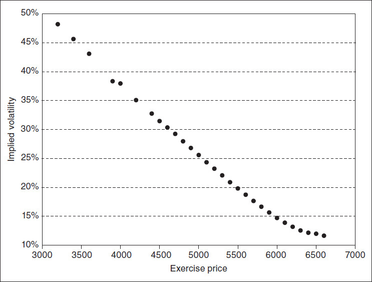

<!-- source:block 081cf7deca68ffd1 -->

> [!quote]- English 6
> The distribution of implied volatilities across exercise prices is often referred to as a *volatility skew* or, possibly, a *volatility smile* or *volatility smirk* depending on the shape of the skew. One likely explanation for the distribution of implied volatilities has to do with the way in which options are used as a hedging instrument. In the stock market, most investors are long stock2 and are therefore concerned about a decline in stock prices. The two most common hedging strategies to protect a long underlying position, as described in Chapter 17, are the purchase of protective puts and the sale of covered calls.

隐含波动率在行权价中的分布通常被称为波动率倾斜，或者可能被称为波动率微笑或波动率傻笑，具体取决于波动率倾斜的形状。隐含波动率分布的一个可能解释与期权用作对冲工具的方式有关。在股市中，大多数投资者都是多头股票[^ovp24-2]，因此担心股价下跌。如第17章所述，保护多头标的头寸的两种最常见的对冲策略是购买保护性看跌期权和出售备兑看涨期权。

<!-- source:block 4c0351ce231a3019 -->

> [!quote]- English 7
> If a stock investor decides to purchase a protective put, which exercise price will he choose? An out-of-the-money put costs less than an in-the-money put but also offers less protection against a down move. However, if the investor is so worried about a downward move that he needs the protection afforded by an in-the-money put, he ought to simply sell the stock. The result is that most protective puts are purchased at lower exercise prices.

如果股票投资者决定购买保护性看跌期权，他会选择哪个行权价？价外看跌期权的成本低于价内看跌期权，但对下跌的保护也较少。然而，如果投资者非常担心下跌，以至于需要货币看跌期权提供的保护，他应该简单地出售股票。结果是，大多数保护性看跌期权都以较低的行权价购买。

<!-- source:block 2fa8f89e718341f3 -->

> [!quote]- English 8
> If, instead, the investor decides to sell a covered call, he will almost always do so at a higher exercise price. This will offer less protection than the sale of an in-the-money call, but presumably the investor holds the stock because he believes that the stock price will rise. If it does rise, he will want to participate in at least some of the upside profit potential. If the stock rises and the investor has sold an in-the-money call, the stock will be quickly called away, limiting any upside profit. The result is that most covered calls are sold at higher exercise prices.

相反，如果投资者决定出售备兑看涨期权，他几乎总是会以更高的行权价出售。这比出售价内看涨期权提供的保护要少，但投资者持有该股票可能是因为他相信股价会上涨。如果它确实上涨，他将希望至少参与部分上行利润潜力。如果该股上涨并且投资者卖出了价内看涨期权，该股将很快被召回，从而限制任何上行利润。结果是，大多数备兑看涨期权都以更高的行权价出售。

<!-- source:block aed3ea3e9ca0c9f7 -->

> [!quote]- English 9
> As a result of hedging activity, in the stock option market there tends to be buying pressure on the lower exercise prices (the purchase of protective puts) and selling pressure on the higher exercise prices (the sale of covered calls). This causes the implied volatilities at lower exercise prices to rise and the implied volatilities at higher exercise prices to fall. The resulting skew, such as that in Figure 24-1, is sometimes referred to as an *investment skew*. It occurs in markets in which people freely invest, the most obvious example being the stock market. Traders sometimes describe an investment skew by saying that the “skew is to the puts,” indicating that put implied volatilities are inflated. But put-call parity dictates that if a put price is inflated, the call price at the same exercise price must also be inflated, so perhaps it is more accurate to say that the “skew is to the downside.”

由于对冲活动，在股票期权市场上，较低的行权价往往会面临买入压力（购买保护性看跌期权），而较高的行权价往往会面临卖出压力（出售备兑看涨期权）。这导致较低行权价下的隐含波动率上升，而较高行权价下的隐含波动率下降。由此产生的偏差（例如图24-1中的偏差）有时被称为投资偏差。它发生在人们自由投资的市场中，最明显的例子是股市。交易员有时会用“看跌期权的倾斜”来描述投资倾斜，这表明看跌期权隐含的波动率被夸大了。但是，看跌期权与看涨期权的平价关系表明，如果看跌期权的价格被抬高，那么在同一行权价下的看涨期权价格也必须被抬高，因此，也许更准确的说法是“向下倾斜”。

<!-- source:block 7fa46f953fd0dbd3 -->

> [!quote]- English 10
> While investors in the stock market may worry about falling stock prices, in other markets hedgers may worry about rising prices. This is often the case in commodity markets where end users try to protect themselves against rising prices by either buying protective calls at higher exercise prices or selling covered puts at lower exercise prices. In the resulting *demand* or *commodity skew* (there is a demand for the commodity), lower exercise prices have lower implied volatilities, and higher exercise prices have higher implied volatilities. Of course, commodity producers, such as farmers, mining companies, and oil drilling companies, are likely to worry about falling commodity prices, so it might seem that there ought to be equal hedging activity between the longs (producers) and the shorts (end users). But in many markets the end users tend to dominate, perhaps because higher commodity prices, and the concomitant inflationary pressures, are perceived as having a negative effect on the entire economy. Moreover, in some countries, the government has a program of price supports for agricultural products, so growers have less to worry about from falling agricultural commodity prices than end users have from rising prices.

虽然股市投资者可能会担心股价下跌，但在其他市场，对冲者可能会担心价格上涨。在大宗商品市场中，这种情况经常出现，最终用户试图通过以更高的行权价购买保护性看涨期权或以更低的行权价出售担保看跌期权来保护自己免受价格上涨的影响。在由此产生的需求或商品倾斜（存在对商品的需求）中，较低的行权价具有较低的隐含波动率，较高的行权价具有较高的隐含波动率。当然，农民、矿业公司和石油钻探公司等大宗商品生产商可能会担心大宗商品价格下跌，因此多头（生产商）和空头（最终用户）之间似乎应该有平等的对冲活动。但在许多市场中，最终用户往往占据主导地位，也许是因为大宗商品价格上涨以及随之而来的通胀压力被认为对整个经济产生了负面影响。此外，在一些国家，政府对农产品制定了价格支持计划，因此种植者对农产品价格下跌的担忧不如最终用户对价格上涨的担忧。

<!-- source:block 9234098cebabbd23 -->

> [!quote]- English 11
> Finally, there are markets where both longs and shorts are equally worried. Consider a U.S. company buying goods in Europe that must be paid for on some future date in euros. The company clearly is worried about a rising euro compared with the dollar. At the same time, a European company may buy goods in the United States that must be paid for in dollars. This company is worried about a falling euro compared with the dollar. If both companies choose to hedge their risk in the currency option market, the hedging activity will tend to result in a *balanced skew*, where there is no obvious domination of implied volatilities at either higher or lower exercise prices. This does not mean that implied volatilities will necessarily form a *flat skew*, but the distribution of implied volatilities is likely to be symmetrical around the current underlying price. The three common types of skews are shown in Figure 24-2.

最后，在某些市场上，多头和空头都同样感到担忧。假设一家美国公司在欧洲购买必须在未来某个日期以欧元付款的商品。该公司显然担心欧元相对于美元升值。与此同时，欧洲公司可能会在美国购买必须以美元支付的商品。该公司担心欧元相对于美元贬值。如果两家公司都选择在货币期权市场对冲风险，对冲活动往往会导致平衡倾斜，即无论是在较高还是较低的行权价下，隐含波动率都没有明显的支配作用。这并不意味着隐含波动率一定会形成平坦的倾斜，但隐含波动率的分布可能围绕当前标的价格对称。图24-2显示了三种常见的倾斜类型。

<!-- source:block 764ccd5154d01f8c -->

*图24-2（a）投资倾斜。(b)需求倾斜。(c)平衡的倾斜。 / Figure 24-2 (*a*) Investment skew. (*b*) Demand skew. (*c*) Balanced skew.*

<!-- source:block 38bffadd248c96b4 -->

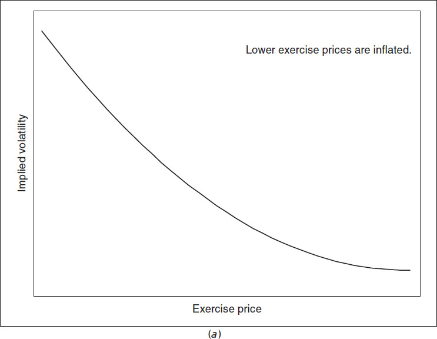

<!-- source:block 1cd887d57530966b -->

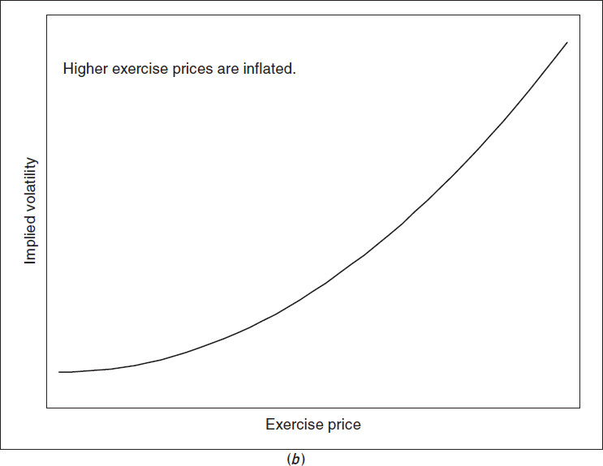

<!-- source:block 05f8d07e2427a8dd -->

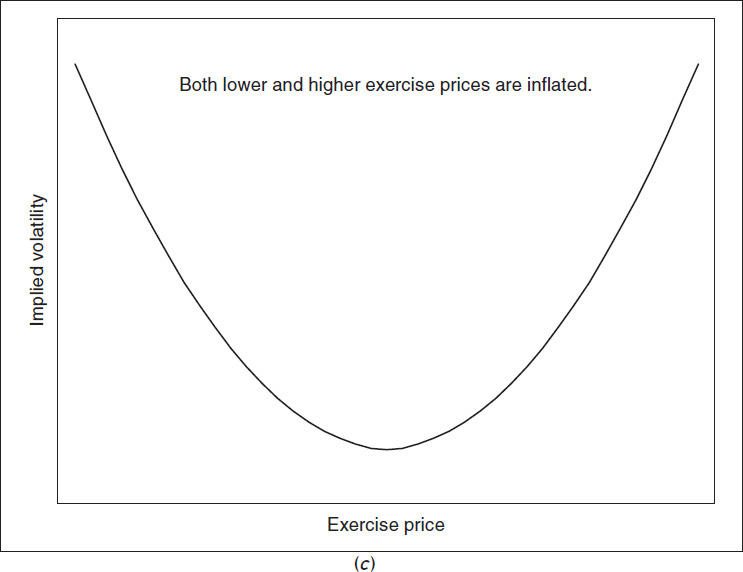

<!-- source:block 3b17939a4a998727 -->

> [!quote]- English 13
> In addition to distortions caused by hedging activity, we also know from Chapter 23 that there are inherent weaknesses in many models. For example, most traders believe that stock markets become more volatile when they are falling and less volatile when they are rising. We also know that an option is most sensitive to volatility changes (it has its highest vega) when it is at the money. If an underlying stock is trading at 100 and the market begins to fall, the vega of the 95 put will rise because it is becoming more at the money. If the market also becomes more volatile because the stock price is falling, this will increase the volatility value of the 95 put. But, if the market begins to rise, the 105 call, even though its vega is rising, will not benefit to the same extent as the 95 put because the market is becoming less volatile. So it should not come as a surprise that the 95 put carries a higher implied volatility and the 105 call a lower implied volatility than expected. This is consistent with an investment skew.

除了对冲活动造成的扭曲之外，我们还从第23章了解到，许多模型都存在固有的弱点。例如，大多数交易员认为股市下跌时波动率更大，上涨时波动率较小。 我们还知道，当期权是ATM时，它对波动率变化最敏感（它的Vega最高）。如果标的股票的交易价格为100并且市场开始下跌，则95 看跌期权的Vega将上涨，因为它变得越来越ATM。 如果市场因股价下跌而变得更加波动，则将增加95 看跌期权的波动率值。 但是，如果市场开始上涨，即使105 看涨期权正在上涨，但其Vega看涨期权的受益程度也不会与95 看跌期权相同，因为市场的波动率正在减弱。 因此，95 看跌期权的隐含波动率高于预期，而105 看涨期权隐含波动率低于预期，这并不奇怪。这与投资倾斜一致。

<!-- source:block e6a39100bdb4a705 -->

> [!quote]- English 14
> The marketplace, like every individual trader, is trying to evaluate options as efficiently as possible given all available information. Whether one believes that markets are efficient or not, one can argue that the marketplace is trying to be efficient. From the wide range of implied volatilities found in almost every option market, we can reasonably infer that the marketplace does not think the Black-Scholes model is perfectly efficient. Unfortunately, trying to identify the source of the inefficiency may not be possible. It might have to do with how options are used in hedging strategies. Or it might have to do with weaknesses in the theoretical pricing model. Whatever the reason, we can make the assumption that at any moment in time the marketplace believes that options are priced efficiently, even if those prices happen to differ from model-generated values.

市场，就像每个交易者一样，试图在所有可用信息的情况下尽可能有效地评估期权。无论人们是否相信市场是有效的，人们都可以说市场正在努力提高效率。从几乎每个期权市场的隐含波动率的大范围来看，我们可以合理地推断市场并不认为布莱克-斯科尔斯模型是完全有效的。不幸的是，试图找出低效率的根源可能是不可能的。这可能与期权在对冲策略中的使用方式有关。或者这可能与理论定价模型的弱点有关。无论出于何种原因，我们都可以假设，市场在任何时候都相信期权的定价是有效的，即使这些价格恰好与模型生成的价值不同。

<!-- source:block 88b0205d990ac7ab -->

> [!quote]- English 15
> An option trader using a theoretical pricing model might take the view that the volatility skew contains useful information that can be used in the decision-making process. By treating the volatility skew as an additional input into the theoretical pricing model, the skew becomes an important aid in generating theoretical values and managing risk. Moreover, analysis of the skew can form the basis for a variety of option strategies.

使用理论定价模型的期权交易员可能会认为波动率偏差包含可用于决策过程的有用信息。通过将波动率偏差视为理论定价模型的额外输入，偏差成为产生理论价值和管理风险的重要帮助。此外，对偏差的分析可以构成各种期权策略的基础。

<!-- source:block 821720b758ee5e75 -->

## 波动率偏斜建模 / Modeling the Skew

<!-- source:block ef837c6c13470330 -->

> [!quote]- English 16
> If we want to include a skew in our model, we need to do it in a way that the model understands. This is typically done using a mathematical function that generates a best fit for the skew

如果我们想在模型中包含倾斜，我们需要以模型可以理解的方式进行。这通常是使用生成倾斜最佳匹配的数学函数来完成的

<!-- source:block 76542fad0f8a9c52 -->

> [!quote]- English 17
> *f* (*x*) = *y*

$$
f\,(x) =\,y
$$

<!-- source:block e86a6aac3f398042 -->

> [!quote]- English 18
> where *y* is the implied volatility at each exercise price *x*. A trader can choose any function that seems to yield a good fit, but many traders use a polynomial function of the form *a* + *bx* + *cx*2 + *dx*3 + …. A best-fit function for the implied volatilities in Figure 24-1 is shown in Figure 24-3.

其中y是每个行权价x的隐含波动率。交易者可以选择任何似乎很适合的函数，但许多交易者使用a + bx + cx 2 + dx 3 +.形式的多元函数。图24-1中隐含波动率的最佳匹配函数如图24-3所示。

<!-- source:block f09d307270699864 -->

*图24-3 2012年6月富时100指数隐含波动率：2012年3月16日。 / Figure 24-3 June 2012 FTSE 100 implied volatilities: March 16, 2012.*

<!-- source:block 93b2aeab49bac2b5 -->

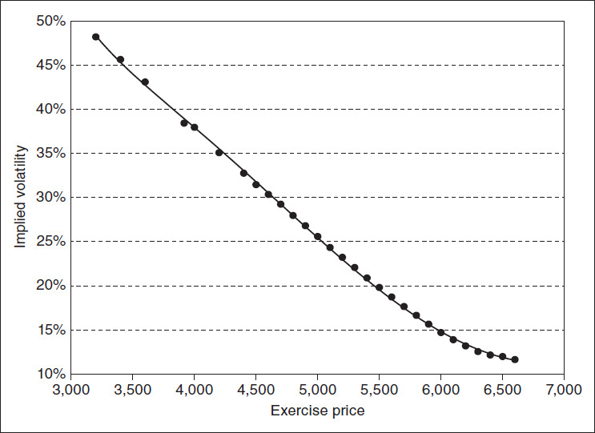

<!-- source:block e5b4b6715f569f70 -->

> [!quote]- English 20
> If we think of the skew as an input into the model, then, as with all inputs, we need to ask how changes in the input will affect a position. If we can model possible changes in the skew as market conditions change, we will be in a better position to assess the risk associated with an option position. In particular, as market conditions change, we will want to model both the location and shape of the skew.

如果我们将倾斜视为模型的输入，那么，与所有输入一样，我们需要询问输入的变化将如何影响头寸。如果我们能够对随着市场条件变化而可能发生的偏差进行建模，那么我们将能够更好地评估与期权头寸相关的风险。特别是，随着市场条件的变化，我们需要对倾斜的头寸和形状进行建模。

<!-- source:block 9802aa80ccc143a0 -->

> [!quote]- English 21
> Of course, we might take the position that the location and shape of the volatility skew will remain fixed. Under this *sticky-strike* assumption, the current skew determines the implied volatility at each strike regardless of how market conditions change.

当然，我们可能会采取这样的头寸：波动率偏差的头寸和形状将保持固定。在这种粘性打击假设下，无论市场条件如何变化，当前的偏差决定了每次打击时的隐含波动率。

<!-- source:block 16b0b0e8be0919e8 -->

> [!quote]- English 22
> Unfortunately, a sticky-strike skew, with its fixed volatilities at each exercise price, is not consistent with the observed dynamics of the marketplace. In most option markets, the skew will shift as the underlying price moves or implied volatility changes. An alternative approach is to use a *floating skew*, where the entire skew is shifted horizontally as the underlying price rises or falls or vertically as implied volatility rises or falls. The shift is equal to the amount of change in either the price or volatility. If the underlying price rises five points, the skew is shifted to the right by five points. If implied volatility falls by two percentage points, the skew is shifted downward by two percentage points. This type of skew is shown in Figure 24-4.

不幸的是，粘性影响偏差（其在每个行权价下的波动率固定）与观察到的市场动态并不一致。在大多数期权市场中，随着标的价格的变动或隐含波动率的变化，偏差将会发生变化。另一种方法是使用浮动偏差，即整个偏差随着标的价格上升或下降而水平移动，或者随着隐含波动率上升或下降而垂直移动。这种转变等于价格或波动率的变化量。如果标的价格上涨五个百分点，那么倾斜就会向右移动五个百分点。如果隐含波动率下降两个百分点，那么偏差就会向下移动两个百分点。这种类型的倾斜如图24-4所示。

<!-- source:block aca9e0f0fd2c9b32 -->

*图24-4（a）标的价格变化时的简单浮动偏差。(b)随着隐含波动率变化，简单的浮动偏差。 / Figure 24-4 (*a*) A simple floating skew as the underlying price changes. (*b*) A simple floating skew as implied volatility changes.*

<!-- source:block de5ec22602a9f76a -->

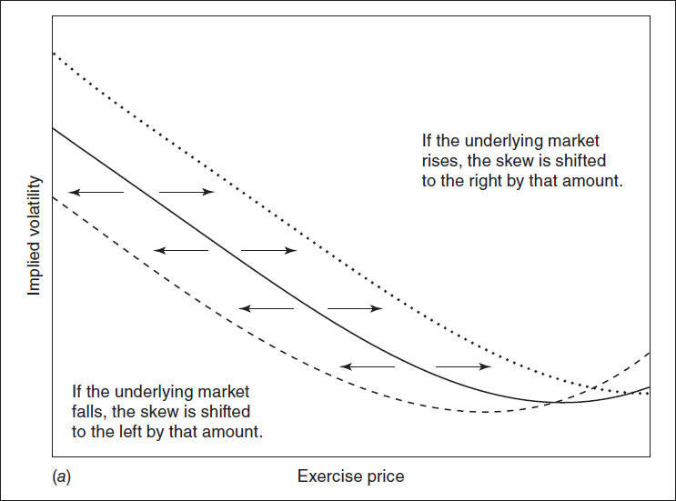

<!-- source:block f9ddf5cc13bb1b51 -->

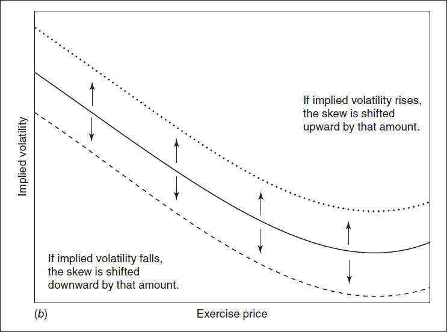

<!-- source:block 20b8c569b5485c86 -->

> [!quote]- English 24
> Shifting the entire skew might be a reasonable approach if a trader believes that the shape of the skew will remain unchanged regardless of changing market conditions. But is this likely? The implied volatilities at different exercise prices are likely to depend on how the marketplace views the likelihood of either larger or smaller moves in the price of the underlying contract. But all moves are relative with respect to both the underlying price and the time to expiration. In relative terms, a price change of 10.00 is greater with an underlying price of 100 (a 10 percent move) than with an underlying price of 200 (a 5 percent move). In the same way, a 10 percent move is greater over a one-week period than the same 10 percent move over a one-month period.

如果交易者相信，无论市场条件如何变化，扭曲的形状都将保持不变，那么改变整个扭曲可能是一种合理的方法。但这可能吗？ 不同行权价格的隐含波动率可能取决于市场如何看待标的合约价格大幅或小幅波动的可能性。但所有的变动都是相对于标的价格和到期时间的。 相对而言，标的价格为100（变动10 %）时的价格变化10.00大于标的价格为200（变动5 %）时的价格变化。同样，一周内的10 %变动大于一个月内的同样10 %变动。

<!-- source:block 381a2698221c2d52 -->

> [!quote]- English 25
> A first step in adjusting for the relative magnitude of price changes is to express each exercise price along the *x* axis in terms of its *moneyness*—how far in the money or out of the money the exercise price is as a percent of the underlying price. The 90 exercise price with the underlying price at 100 will have a moneyness of 0.90. This is the same moneyness as the 180 exercise price with an underlying price of 200. We can make a further refinement by expressing each exercise price in logarithmic terms ln (*X/S*), where *S* is the underlying or spot price and *X* is the exercise price. This is consistent with the assumption that underlying prices are lognormally distributed.

调整价格变化相对幅度的第一步是用其金钱量来表达沿x轴的每个行权价-行权价占标的价格的百分比的情况下，即ITM或OTM有多远。 标的价格为100的90行权价将具有0.90的金钱性。这与180行权价的货币性相同，其标的价格为200。 我们可以通过用对数项ln(X/S)表示每个行权价来进一步细化，其中S是标的或现货价格，X是行权价。这与标的价格服从对数正态分布的假设是一致的。

<!-- source:block 3c610e9dc3ae6351 -->

> [!quote]- English 26
> How will the passage of time affect the shape of the volatility skew? Consider a 90 put with the underlying contract trading at 100. As time passes, in relative terms, the 90 put is moving further out of the money. In an investment skew, as the option moves further out of the money, its implied volatility will rise. In a sense, it is moving “up the skew.” This will cause the skew to appear more severe as time passes, with lower exercise prices carrying increasingly higher implied volatilities. Higher exercise prices may also be affected by the passage of time because an out-of-the-money call will also go further out of the money. Depending on the shape of the skew and where an exercise price falls along the skew, its implied volatility may rise, fall, or remain the same. If no adjustment is made, the effect of time passing on the FTSE 100 skew is shown in Figure 24-5.

时间的推移将如何影响波动率倾斜的形状？考虑90看跌期权，标的合约交易价为100。随着时间的推移，相对而言，90看跌期权正在进一步价外。在投资倾斜中，随着期权进一步价外，其隐含波动率将会上升。从某种意义上说，它正在“向上倾斜”。随着时间的推移，这将导致这种扭曲显得更加严重，较低的行权价带来越来越高的隐含波动率。较高的行权价也可能受到时间推移的影响，因为价外看涨也会进一步走远。根据倾斜的形状以及行权价沿着倾斜下降的位置，其隐含波动率可能会上升、下降或保持不变。如果不进行调整，时间流逝对富时100偏差的影响如图24-5所示。

<!-- source:block b41146a65e88bed5 -->

*图24-5富时100期权隐含波动率，2012年3月16日（富时= 5965.58）。 / Figure 24-5 FTSE 100 option implied volatilities, March 16, 2012 (FTSE = 5965.58).*

<!-- source:block e75fa55ed8fb5be5 -->

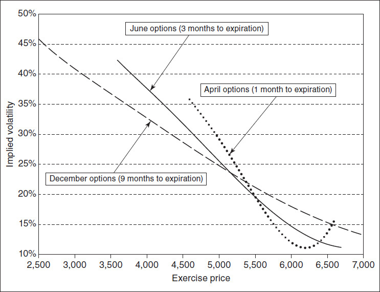

<!-- source:block 2d607e9bcdad50ef -->

> [!quote]- English 28
> To compare volatility skews for different expirations, we need to determine theoretically how far in the money or out of the money an option is. Perhaps the easiest way to do this is to express each exercise price in terms of standard deviations away from at the money. Recalling the square-root relationship between time and volatility, and using our logarithmic scale, the number of standard deviations in the money or out of the money for each exercise price is given by

为了比较不同报价的波动率偏差，我们需要从理论上确定期权的ITM或OTM有多远。也许最简单的方法是用远离ATM的标准差来表达每个行权价。 回顾时间和波动率之间的平方根关系，并使用我们的对数标度，每个行权价的标准差ITM或OTM数由下式给出

<!-- source:block 56de461f3add7466 -->

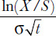

<!-- 原 EPUB 中此公式为图片，已原样保留 -->

<!-- source:block ea22d134ac6eb58c -->

> [!quote]- English 29
> with an exactly at-the-money3 option having a standard deviation of 0. Skews for several FTSE 100 option expirations as of March 16, 2012, are shown in Figure 24-6. When expressed in this format, the skew is sometimes referred to as a *sticky-delta* skew because the delta is an approximation of how far in the money or out of the money an option is.

一个标准差为0的完全在价期权。图24-6显示了截至2012年[^ovp24-3]月16日几个富时100指数期权价格的偏差。当以这种格式表示时，偏差有时被称为粘性Delta偏差，因为Delta近似于期权的价内或价外。

<!-- source:block 0bf560b38ecec4cc -->

*图24-6富时100指数隐含波动率，2012年3月16日。 / Figure 24-6 FTSE 100 implied volatilities, March 16, 2012.*

<!-- source:block 56727033052198e9 -->

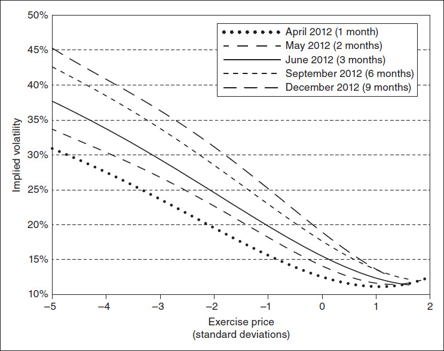

<!-- source:block 516c8556a241f04e -->

> [!quote]- English 31
> The skews in Figure 24-6 appear to be similar, but they are clearly not identical. All adjustments thus far have been to the *x* axis, changing the calibration to more easily compare exercise prices. But we might also adjust the *y* axis, the volatility. When a trader refers to the overall implied volatility in a market, he is almost always referring to the implied volatility of at-the-money options. Whether the implied volatility at any exercise price is high or low will depend on whether it is high or low compared with the at-the-money implied volatility. As a result, many traders recalibrate the *y* axis in terms of how the implied volatility at an exercise price compares with the at-the-money implied volatility. We can do this by expressing *y* values as the difference between the implied volatility of an at-the-money option and the implied volatility at each exercise price. If the at-the-money implied volatility is 20 (percent) and the implied volatility at an exercise price is 25 (percent), the *y* value is 20 – 25 = –5. If the implied volatility at a different exercise price is 18 (percent), the *y* value is 20 – 18 = 2.

图24-6中的倾斜看起来相似，但显然不相同。到目前为止，所有调整都是针对x轴，改变了校准，以更轻松地比较行权价。但我们也可能会调整y轴，即波动率。当交易员提到市场的总体隐含波动率时，他几乎总是指的是平值期权的隐含波动率。任何行权价的隐含波动率是高还是低将取决于它与价值隐含波动率相比是高还是低。因此，许多交易员根据行权价的隐含波动率与价内隐含波动率的比较来重新调整y轴。我们可以通过将y值表示为平值期权的隐含波动率与每个行权价的隐含波动率之间的差来做到这一点。如果平值隐含波动率为20（%），而行权价的隐含波动率为25（%），则y值为20 - 25 =-5。如果不同行权价下的隐含波动率为18（%），则y值为20 - 18 = 2。

<!-- source:block 6606bc664865ce14 -->

> [!quote]- English 32
> This method may be satisfactory if implied volatilities remain relatively constant, but suppose that the at-the-money implied volatility doubles from 20 to 40 percent. We might also expect the volatility at each exercise to double. An exercise price that previously had an implied volatility of 25 percent will now have an implied volatility of 50 percent, and an exercise price that previously had an implied volatility of 18 percent will now have an implied volatility of 36 percent. We can better calibrate the *y* axis by expressing the volatility at each exercise price as a percent of at-the-money implied volatility. With an at-the-money implied volatility of 20 percent, an implied volatility of 25 percent would be expressed as 25/20 = 125 percent. An implied volatility of 18 percent would be expressed as 18/20 = 90 percent. And an implied volatility equal to the at-the-money implied volatility would be expressed as 20/20 = 100 percent. In Figure 24-7, the *y* axis for the sample FTSE 100 skews has been recalibrated using this approach.

如果隐含波动率保持相对恒定，这种方法可能是令人满意的，但假设价格隐含波动率从20%增加到40%。我们还可以预期，每次交易的波动率都会翻倍。以前隐含波动率为25%的行权价现在将隐含波动率为50%，以前隐含波动率为18%的行权价现在将隐含波动率为36%。我们可以更好地校准y轴，将每个行权价的波动率表示为实值隐含波动率的百分比。如果平值计算的隐含波动率为20%，那么25%的隐含波动率将表示为25/20 = 125%。18%的隐含波动率将表示为18/20 = 90%。与平值隐含波动率相等的隐含波动率将表示为20/20 = 100%。在图24-7中，FTSE 100样本倾斜的y轴已使用这种方法重新校准。

<!-- source:block 56767c2398f50ad4 -->

*图24-7富时100指数隐含波动率，2012年3月16日。 / Figure 24-7 FTSE 100 implied volatilities, March 16, 2012.*

<!-- source:block 643351257001bbde -->

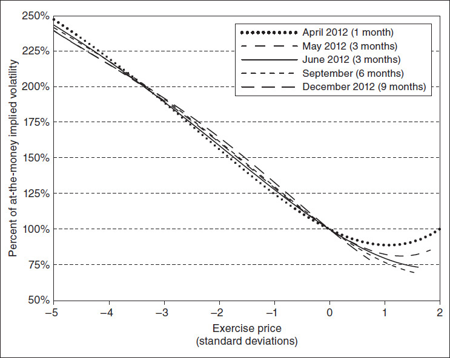

<!-- source:block 4dd61c7356e7caa4 -->

> [!quote]- English 34
> Figure 24-7 is typical of many stock indexes, exhibiting a very pronounced investment skew, with lower exercise prices significantly inflated compared with higher exercise prices. A different set of skews, for wheat options, is shown in Figure 24-8. In this example, the skews exhibit more curvature but with higher exercise prices somewhat more inflated, as is often the case with a demand or commodity skew. The skews also seem to exhibit less consistency across different expiration months than the FTSE 100. While skews in a financial product tend to be similar across expiration months, skews in a commodity market can often vary across different expirations, perhaps owing to seasonal volatility considerations or because of short-term supply and demand imbalances.

图24-7是许多股指的典型代表，表现出非常明显的投资倾斜，较低的行权价格与较高的行权价格相比显着夸大。图24-8显示了小麦期权的一组不同的倾斜。 在这个例子中，倾斜表现出更多的弯曲度，但较高的行权价格稍微膨胀，就像需求或商品倾斜的情况一样。与FTSE 100相比，偏斜在不同到期月份之间的一致性似乎也较低。 虽然金融产品在不同到期月份的偏差往往相似，但商品市场的偏差在不同的到期月份往往不同，这可能是由于季节性波动率的考虑，也可能是由于短期供求失衡。

<!-- source:block bd9fc631e0501375 -->

*图24-8小麦暗示波动率，2012年1月27日。 / Figure 24-8 wheat implied volatilities, January 27, 2012.*

<!-- source:block cba8df27d2093447 -->

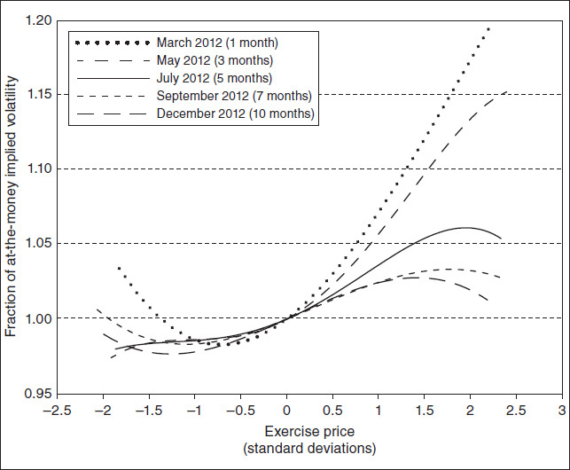

<!-- source:block 9c5e22b855e2abfe -->

> [!quote]- English 36
> The foregoing method of modeling a skew is used by many traders but is in no way meant to be definitive. Adjustments are often required to prevent the model from generating illogical volatilities or theoretical values. For example, as we reduce volatility, an out-of-the-money option goes further out of the money because it is a greater number of standard deviations away from the underlying price. But in an investment skew, as a put goes further out of the money, it’s volatility is rising—it is “climbing the skew.” If the skew is sufficiently steep, the increase in volatility may in fact cause the theoretical value of the put to rise. This is inherently illogical because we expect all option values to decline if we reduce volatility.

许多交易者都使用上述对倾斜进行建模的方法，但绝不是确定的。通常需要进行调整以防止模型产生不合逻辑的波动率或理论值。例如，当我们降低波动率时，价外期权会进一步远离价外，因为它与标的价格的标准差更多。但在投资倾斜中，随着看跌期权进一步远离资金，波动率正在上升——它正在“攀登倾斜”。如果倾斜度足够陡峭，波动率的增加实际上可能会导致看跌期权的理论价值上升。这在本质上是不合逻辑的，因为如果我们降低波动率，我们预计所有期权价值都会下降。

<!-- source:block b0c7a7241ee9fddd -->

## 偏度与峰度 / Skewness and kurtosis

<!-- source:block 6a076ac180849581 -->

> [!quote]- English 37
> The shape of the skew is not constant. As market conditions change, option prices will also change, often causing the shape of the skew to change. Two common changes have to do with the tilt and curvature of the skew. The tilt, which defines how much the implied volatilities of lower exercise prices differ from the implied volatilities of higher exercise prices, is often referred to as the *skewness*. This follows logically from the definition of skewness in Chapter 23 (see Figure 23-10). If the probability distribution has a longer left tail (negative skewness), there is greater likelihood of large down moves, resulting in greater demand for lower exercise prices. If the distribution has a longer right tail (positive skewness), there is greater likelihood of large up moves and, consequently, greater demand for higher exercise prices. Examples of positive and negative skewness are shown in Figure 24-9.

倾斜的形状不是恒定的。随着市场条件的变化，期权价格也会发生变化，通常会导致倾斜的形状发生变化。两个常见的变化与倾斜的倾斜度和弯曲度有关。倾斜度定义了较低行权价的隐含波动率与较高行权价的隐含波动率的差异，通常称为偏度。这在逻辑上源于第23章中的偏度定义（见图23-10）。如果概率分布的左尾较长（负偏度），则大幅下跌的可能性更大，导致对较低的行权价的需求更大。如果分布的右尾较长（正偏度），则大幅上涨的可能性更大，因此对更高的行权价的需求也更大。正偏度和负偏度的示例如图24-9所示。

<!-- source:block a3e5ea1ed1b08142 -->

*图24-9倾斜度。 / Figure 24-9 Skewness.*

<!-- source:block 93e8ef96fe9d83a8 -->

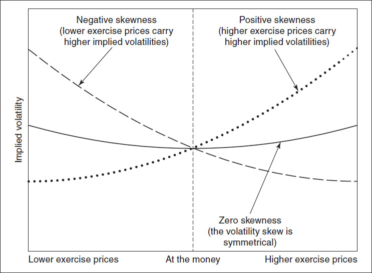

<!-- source:block 954935537eaa566c -->

*图24-10峰度。 / Figure 24-10 kurtosis.*

<!-- source:block 226ce0b71a04571c -->

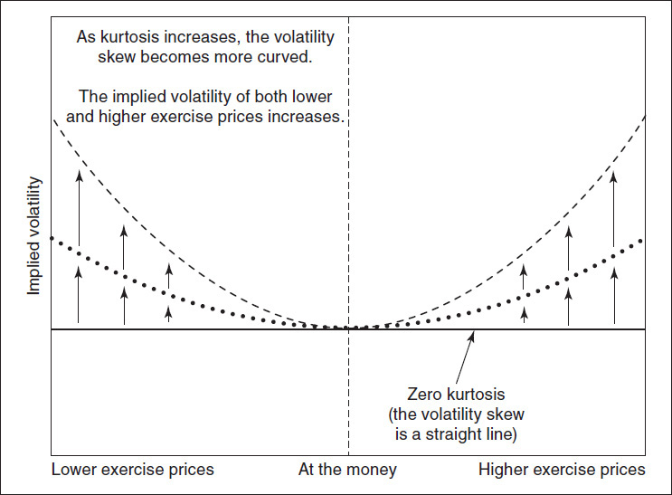

<!-- source:block 202458656249e183 -->

> [!quote]- English 40
> The curvature, or *kurtosis*, defines how much the implied volatilities of both higher and lower exercise prices are inflated compared with the at-the-money implied volatility. This also follows logically from the definition in Chapter 23 (see Figure 23-11). If the probability distribution has “fat tails,” there is a greater likelihood of large moves in either direction. Consequently, there will be a greater demand for out-of-the-money options (positive kurtosis). Examples of increasing positive kurtosis are shown in Figure 24-10.4

弯曲度或峰度定义了较高和较低行权价格的隐含波动率与ATM隐含波动率相比被夸大的程度。这也符合第23章中的定义的逻辑（请参阅图23-11）。 如果概率分布具有“粗尾”，则任何一个方向大幅波动的可能性都更大。因此，对OTM期权的需求将会更大（正峰度）。图24-10显示了增加正峰度的示例。 [^ovp24-4]

<!-- source:block dbd5fe9f1a081155 -->

*图24-11作为模型输入的偏差。 / Figure 24-11 The skew as a model input.*

<!-- source:block 4978a1d88036cbb5 -->

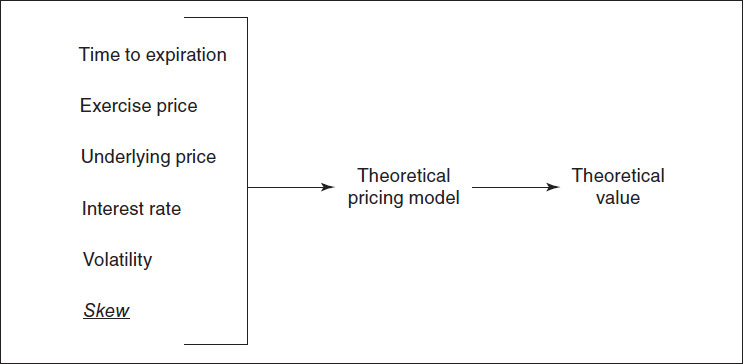

<!-- source:block 49567ac20b747c89 -->

> [!quote]- English 42
> We might think of the skew as an input into a theoretical pricing model (Figure 24-11), but the skew is input into the model as a formula rather than as a single number. As with any input, it will be useful to determine how sensitive an option value or option position is to changes in the shape of the skew.

我们可能会将偏差视为理论定价模型的输入（图24-11），但偏差作为公式而不是单个数字输入到模型中。与任何输入一样，确定期权值或期权头寸对倾斜形状变化的敏感性将非常有用。

<!-- source:block 45ae18da561c561c -->

> [!quote]- English 43
> The sensitivities associated with a skew will depend on the skew model that is used. For example, let’s assume a very simple second-degree-polynomial model where the volatility *y* at an exercise price *x* is given by

与倾斜相关的灵敏度将取决于所使用的倾斜模型。例如，假设一个非常简单的二次多项模型，其中行权价x的波动率y由下式给出

<!-- source:block c42360ad628777ed -->

> [!quote]- English 44
> *y* = *a* + *bx* + *cx*2

$$
y\,=\,a +\,bx +\,cx^{2}
$$

<!-- source:block 8e5defbad29eb0b2 -->

> [!quote]- English 45
> In this model, the value of *a* is the base volatility, usually the implied volatility of the at-the-money options. The values of *b* and *c* represent the skewness and kurtosis, respectively, of the volatility skew. We can raise or lower the value of *a* as implied volatility rises or falls. We can raise or lower the value of *b* to increase or decrease the skewness. And we can raise or lower the value of *c* to increase or decrease the kurtosis. *b* can be either positive or negative depending on whether higher or lower exercise prices are inflated. For exchange-traded markets, the value of *c* is almost always positive because the probability distributions of these markets always exhibit some fat-tail characteristics.

在该模型中，a的值是基本波动率，通常是平值期权的隐含波动率。b和c的值分别代表波动率倾斜的偏度和峰度。随着隐含波动率的上升或下降，我们可以提高或降低a的价值。我们可以提高或降低b的值来增加或减少偏度。我们可以提高或降低c的值来增加或减少峰度。b可以是正值或负值，具体取决于较高或较低的行权价被夸大。对于交易所交易市场，c的值几乎总是正值，因为这些市场的概率分布总是表现出一些厚尾特征。

<!-- source:block 1634d89e6d6a8a8d -->

> [!quote]- English 46
> The sensitivity of an option’s theoretical value to a change in skewness or kurtosis will depend on how the option’s value changes as we raise or lower the value of *b* and *c*. If raising the value of *b* by one unit will cause the option to fall by 0.15, then the option has a skewness sensitivity of –0.15. If raising the value of *c* by one unit will cause the option to rise by 0.08, the option has a kurtosis sensitivity of 0.08. For active traders who carry very large option positions, the skewness and kurtosis sensitivities can represent significant risks and, as with all risks, must be monitored to ensure that that they remain within acceptable bounds.

期权理论价值对偏度或峰度变化的敏感性将取决于当我们提高或降低b和c的值时期权价值如何变化。如果将b的值提高一个单位会导致期权下降0.15，那么该期权的偏度敏感度为-0.15。如果将c的值提高一个单位将导致期权增加0.08，则该期权的峰度敏感度为0.08。对于持有非常大期权头寸的活跃交易者来说，偏度和峰度敏感性可能代表重大风险，并且与所有风险一样，必须进行监控，以确保它们保持在可接受的范围内。

<!-- source:block 9f06c2746e1cac48 -->

> [!quote]- English 47
> The units used to express skewness and kurtosis sensitivity will depend on how the skew model has been constructed. Most traders choose a unit that represents a common change in the skewness and kurtosis values. For example, if the value of *b* commonly ranges from 0.20 to 0.40, a logical unit for *b* might be 0.01. If the unit value is an unwieldy number, the value can be adjusted by including a multiplier. If the unit value for *b* is 0.001 but we wish to express the unit value as a whole number, we can use a multiplier of 0.001 to yield a unit value of 1. The model will then be expressed as

用于表达偏度和峰度敏感性的单位将取决于偏度模型的构建方式。大多数交易者选择代表偏度和峰度值共同变化的单位。例如，如果b的值通常在0.20到0.40之间，则b的逻辑单位可能是0.01。如果单位值是一个笨重的数字，则可以通过包含乘数来调整该值。如果b的单位值是0.001，但我们希望将单位值表示为一个完整的数字，那么我们可以使用乘数0.001来产生单位值1。然后该模型将被表达为

<!-- source:block df9acde84162afaa -->

> [!quote]- English 48
> *y* = *a* + 0.001*bx* + *cx*2

$$
y\,=\,a + 0.001bx\,+\,cx^{2}
$$

<!-- source:block b1ec460955d98ffe -->

> [!quote]- English 49
> If we raise the skew value of *b* by 1, we are really raising it by 0.001. The same approach can also be used to express *c* in simple units.5

如果我们将b的倾斜值提高1，那么我们实际上将其提高了0.001。同样的方法也可以用于用简单单位表达c。[^ovp24-5]

<!-- source:block 8d0bfb66861d1052 -->

> [!quote]- English 50
> In most skew models, the at-the-money exercise price acts as a pivot point so that an option that is exactly at the money has a skewness and kurtosis sensitivity of 0. Options that are in the money or out of the money can have either a positive or a negative skewness sensitivity. If we increase the skewness input, the volatility of higher exercise prices will rise, whiles the volatility of lower exercise prices will fall. Consequently, higher exercise prices will have positive skewness sensitivity values, and lower exercise prices will have negative sensitivity. If we increase the kurtosis input, the volatility of options at both higher and lower exercise prices will rise. Consequently, any option that is not exactly at the money will have a positive kurtosis sensitivity.

在大多数倾斜模型中，平值行权价充当支点，因此恰好平值执行的期权的倾斜度和峰度敏感度为0。价内或价外的期权可以具有正的或负的偏度敏感性。如果我们增加偏度输入，较高行权价的波动率将会上升，而较低行权价的波动率将会下降。因此，较高的行权价将具有正的偏度敏感性值，而较低的行权价将具有负的敏感性。如果我们增加峰度输入，较高和较低行权价下期权的波动率都会上升。因此，任何不完全符合金钱要求的期权都将具有正的峰度敏感性。

<!-- source:block f10adf4a10e11606 -->

> [!quote]- English 51
> Which options are the most sensitive to changes in skewness and kurtosis? There is no definitive answer because it depends on the volatility characteristics of the market as well as the skew model that is used. But in many skew models puts with deltas of –25 and calls with deltas of +25 tend to have the greatest skewness sensitivity. For this reason, a common measure of skewness is the difference between the implied volatility of the –25 delta put and the +25 delta call. There is no similar benchmark for kurtosis, but for many models, puts with deltas of approximately –5 and calls with deltas of +5 tend to have the greatest sensitivity to a change in kurtosis.

哪些期权对偏度和峰度的变化最敏感？没有明确的答案，因为它取决于市场的波动率特征以及所使用的倾斜模型。但在许多倾斜模型中，Delta为-25的put和Delta为+25的看涨期权往往具有最大的倾斜敏感性。因此，衡量偏度的常见指标是-25 Delta看跌期权和+25 Delta看涨期权的隐含波动率之间的差异。没有类似的峰度基准，但对于许多模型来说，Delta约为-5的put和Delta为+5的call往往对峰度变化具有最大的敏感性。

<!-- source:block f1e9cd3075db5211 -->

## 偏斜下的风险指标 / Skewed Risk Measures

<!-- source:block c461d569498fba0c -->

> [!quote]- English 52
> How we model the volatility skew also will affect the risk measures generated by a model—the delta, gamma, theta, and vega. Look again at Figure 24-4*a*, where the floating skew is shifted either right or left as the underlying price rises or falls. As the skew is shifted, the volatility at some exercise prices will rise, while the volatility at other exercise prices will fall. This change in volatility can cause an option’s value and its risk sensitivities to change either more or less than expected if there were no skew.

我们如何对波动率偏差进行建模也会影响模型生成的风险指标-Delta、Gamma、Theta和Vega。再看看图24-4a，随着标的价格上涨或下跌，浮动偏差向右或向左移动。随着倾斜的转移，一些行权价的波动率将会上升，而其他行权价的波动率将会下降。如果不存在偏差，波动率的这种变化可能会导致期权价值及其风险敏感性的变化幅度大于或小于预期。

<!-- source:block fbdc15c6f56eedda -->

> [!quote]- English 53
> For example, consider an out-of-the-money put with a delta of –20. Ignoring the gamma, if the underlying price rises 1.00, we expect the option value to decline by 0.20. But in an investment skew, such as in Figure 24-4*a*, as the underlying price rises, the volatility of an out-of-the-money put will rise as it moves further out of the money. If the option has a vega of 0.10 and the shift in the skew causes the implied volatility of the option to rise 0.5 percent, the higher volatility will cause the option’s value to rise by 0.5 × 0.10 = 0.05. Consequently, the option will only decline by 0.15, a decline of 0.20 due to a change in the underlying price combined with an increase of 0.05 due to the increase in implied volatility. The option has a *skewed* or *adjusted delta* of –15.

例如，考虑Delta为-20的价外看跌期权。忽略Gamma，如果标的价格上涨1.00，我们预计期权价值将下降0.20。但在投资倾斜中，例如图24-4a中，随着标的价格上升，随着价外看跌期权的波动率将随着其进一步远离价外而上升。如果期权的Vega为0.10，并且偏差的变化导致期权的隐含波动率上升0.5%，则较高的波动率将导致期权价值上升0.5 × 0.10 = 0.05。因此，该期权只会下降0.15，由于标的价格变化而下降0.20，加上由于隐含波动率增加而增加0.05。该期权的倾斜或调整后Delta为-15。

<!-- source:block 53dc4717dfd5408a -->

> [!quote]- English 54
> The inclusion of a volatility skew in a pricing model will affect the calculation of all option risk measures and can greatly complicate a trader’s ability to manage risk. For many traders, it may be best to keep things simple, perhaps using a skew model to generate theoretical values while using a traditional model to calculate the delta, gamma, theta, and vega. For an active trader who carries large option positions, calculating accurate skewed sensitivities becomes much more important because the total value of the position can change very quickly as market conditions change. Financial engineers at professional option trading firms are often responsible for developing methods to accurately calculate theoretical values and risk sensitivities using a volatility skew model. But even the most sophisticated model is unlikely to generate values that exactly model option prices under all market conditions. A model can help, but it will always have limitations.

在定价模型中包含波动率偏差将影响所有期权风险指标的计算，并可能使交易员管理风险的能力变得非常复杂。对于许多交易者来说，最好保持简单，也许使用倾斜模型来生成理论值，同时使用传统模型来计算Delta、Gamma、Theta和Vega。对于持有大量期权头寸的活跃交易者来说，计算准确的倾斜敏感度变得更加重要，因为头寸的总价值可能会随着市场条件的变化而迅速变化。专业期权交易公司的金融工程师通常负责开发使用波动率偏差模型准确计算理论值和风险敏感性的方法。但即使是最复杂的模型也不太可能产生准确模拟所有市场条件下期权价格的价值。模型可以有所帮助，但它总是有局限性。

<!-- source:block 7fd1be0092d0b112 -->

> [!quote]- English 55
> By combining the volatility term structure across expiration dates with the volatility skew across exercise prices, we can form a *volatility surface*. While sometimes difficult to visualize, a volatility surface may enable a trader to more easily see the basic volatility characteristics of an option market. The more exercise prices and expiration dates that are available, the more accurate will be the volatility surface. Sample volatility surfaces for the FTSE 100 options and wheat options are shown in Figures 24-12 and 24-13. At the time, the FTSE 100 Index was trading at 5,966, and the front-month wheat futures contract was trading at 647.

通过将到期日的波动率期限结构与行权价的波动率倾斜相结合，我们可以形成波动率表面。虽然有时难以想象，但波动率表面可能使交易员更容易看到期权市场的基本波动率特征。可用的行权价和到期日期越多，波动率表面就越准确。富时100指数期权和小麦期权的样本波动率表面如图24-12和24-13所示。当时，富时100指数交易价为5,966点，前月小麦期货合约交易价为647点。

<!-- source:block 7673ef3bac881c4e -->

*图24-12富时100指数波动率表面，2012年3月16日。 / Figure 24-12 FTSE 100 volatility surface, March 16, 2012.*

<!-- source:block 03f4d7c6e7aebe7d -->

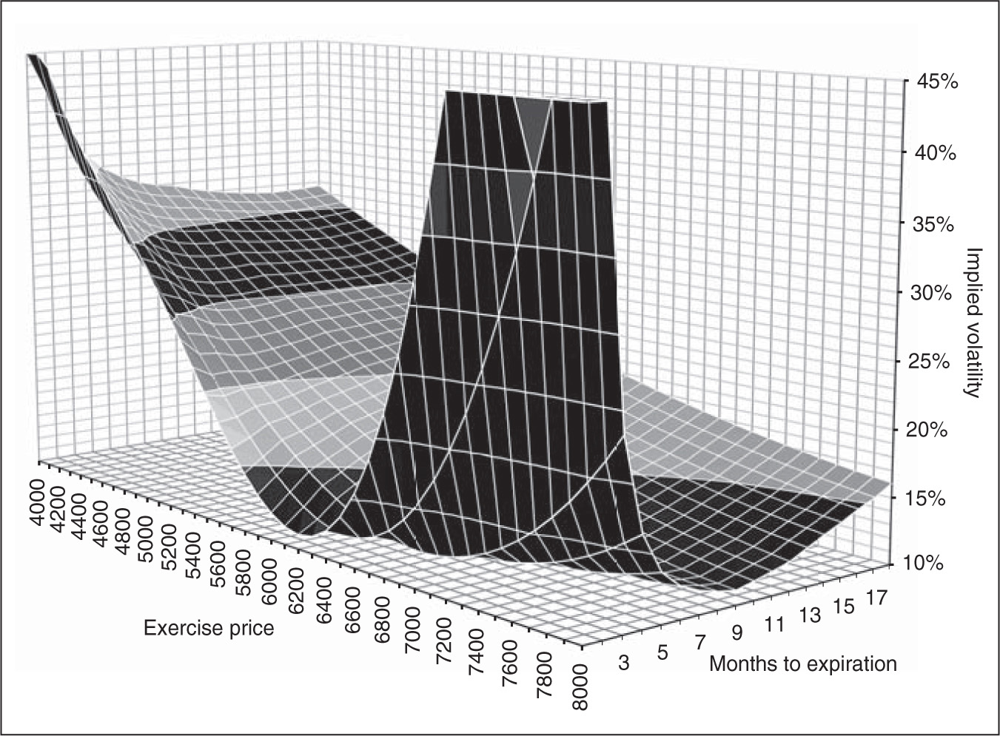

<!-- source:block f455645c7a7b6718 -->

*Figure 24-13 wheat volatility surface, January 27, 2012. / Figure 24-13 wheat volatility surface, January 27, 2012.*

<!-- source:block e8604ba32d3a9b16 -->

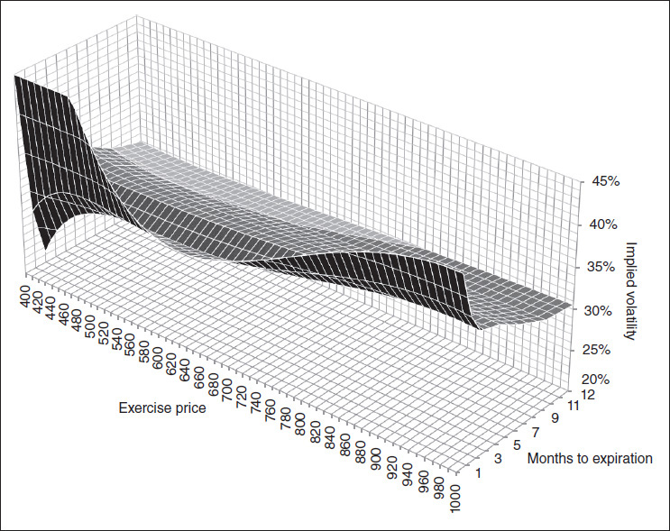

<!-- source:block 779737350b806dde -->

## 平移波动率 / Shifting the Volatility

<!-- source:block f38bd0958062da51 -->

> [!quote]- English 58
> Traders have long noted that in many option markets, implied volatility tends to change as the price of the underlying contract changes. Some markets exhibit a direct relationship between movement in the underlying price and changes in implied volatility: when the underlying price rises, implied volatility tends to rise; when the underlying price falls, implied volatility tends to fall. This is typical of markets with a demand skew, such as agricultural and energy products. Other markets may exhibit an inverse relationship: when the underlying price rises, implied volatility tends to fall; when the underlying price falls, implied volatility tends to rise. This is typical of markets with an investment skew, such as stock and stock index markets.

交易员长期以来一直指出，在许多期权市场中，隐含波动率往往会随着标的合约价格的变化而变化。一些市场在标的价格的变动与隐含波动率的变化之间表现出直接关系：当标的价格上涨时，隐含波动率往往会上升;当标的价格下跌时，隐含波动率往往会下降。这是具有需求倾斜的市场的典型情况，例如农业和能源产品。其他市场可能表现出反向关系：当标的价格上涨时，隐含波动率往往会下降;当标的价格下跌时，隐含波动率往往会上升。这是具有投资倾斜的市场的典型情况，例如股票和股指市场。

<!-- source:block 065622baa99383a1 -->

> [!quote]- English 59
> For purposes of both option evaluation and risk management, many traders will attempt to incorporate this characteristic into an option pricing model. One possible theoretical solution is the CEV model referred to in Chapter 23. But this model can be mathematically complex and requires additional inputs, all of which make it difficult to use. Alternatively, many traders simply use a “home grown” model that shifts the volatility up or down in a way that is consistent with the observed volatility characteristics of a market. However, no model will generate accurate values under all conditions because implied volatility often changes in ways that seem to defy even the best model.

出于期权评估和风险管理的目的，许多交易员会尝试将这一特征纳入期权定价模型中。一种可能的理论解决方案是第23章提到的CEV模型。但这个模型在数学上可能很复杂，并且需要额外的输入，所有这些都使得它很难使用。或者，许多交易员只是使用“本土”模型，以与观察到的市场波动率特征一致的方式上下移动波动率。然而，没有一个模型能在所有条件下生成准确的值，因为隐含波动率的变化方式似乎甚至与最好的模型背道而驰。

<!-- source:block 3aadf2e1df493f02 -->

> [!quote]- English 60
> A shift in volatility can also affect the risks associated with a position. Consider a trader who buys an at-the-money straddle. Ignoring interest considerations and slight adjustments for a lognormal distribution, the trader’s position is approximately delta neutral: the call has a delta of 50, and the put has a delta of –50. But delta neutral means that the trader has no particular preference for market movement in one direction or the other. Is this really true? If this position is taken in a stock index market, the trader actually has a preference for downward movement because he prefers higher volatility, something that is more likely to occur in a falling market. Even though the position may be delta neutral in a theoretical world, in the real world, it is delta negative. On the other hand, if this position is taken in a commodity market, where the market is likely to become more volatile when prices rise, the trader really has a positive delta position. Of course, it may be difficult to determine the real-world delta of either position. That will depend on how fast volatility rises or falls as the underlying price changes. But in neither case is the position truly delta neutral.

波动率的变化也会影响与头寸相关的风险。假设一位以平值的价格购买跨式的交易者。忽略利息考虑和对对数正态分布的轻微调整，交易者的头寸大致为Delta中性：看涨期权的Delta为50，看跌期权的Delta为-50。但Delta中性意味着交易员对市场朝一个方向或另一个方向的走势没有特别偏好。这真的吗？如果在股指市场采取这种头寸，交易者实际上倾向于向下移动，因为他更喜欢更高的波动率，而这种波动率更有可能发生在下跌的市场中。尽管该头寸在理论世界中可能是Delta中性的，但在现实世界中，它是Delta负的。另一方面，如果在大宗商品市场采取这种头寸，当价格上涨时市场可能会变得更加波动，那么交易员确实拥有正的Delta头寸。当然，可能很难确定任何一个头寸的现实世界Delta。这将取决于波动率随着标的价格变化上升或下降的速度。但在这两种情况下，头寸都不是真正的Delta中立。

<!-- source:block dbd4469bb84a0946 -->

## 偏度与峰度策略 / Skewness and kurtosis Strategies

<!-- source:block dc649b657a616cc5 -->

> [!quote]- English 61
> Just as a trader may have an opinion about the direction of movement in a market (delta strategies) or about implied and realized volatility (vega and gamma strategies), a trader may also have an opinion about the shape of the volatility skew. We can see in Figure 24-14 that, depending on the type of skew and whether a trader expects the skew to become steeper or flatter, the trader will want to buy lower exercise prices and sell higher exercise prices, or vice versa. This is most commonly done using out-of-the-money options, very often 25 delta calls and –25 delta puts because these options tend to be most sensitive to changes in the slope of the skew.

正如交易者可能对市场的运动方向（Delta策略）或隐含波动率和已实现波动率（Vega和Gamma策略）有看法一样，交易者也可能对波动率偏斜的形状有看法。从图24-14中我们可以看到，根据偏斜的类型以及交易者预期偏斜会变得更陡还是更平，交易者会希望以更低的行权价买入，以更高的行权价卖出，反之亦然。这是最常见的使用价外期权，经常是25Delta看涨期权和-25Delta看跌期权，因为这些期权往往是最敏感的倾斜斜率的变化。

<!-- source:block 236aebf4972d2652 -->

*图24-14（a）倾斜度下降。(b)增加倾斜度。 / Figure 24-14 (*a*) Declining skewness. (*b*) Increasing skewness.*

<!-- source:block 37c6d5d959a97964 -->

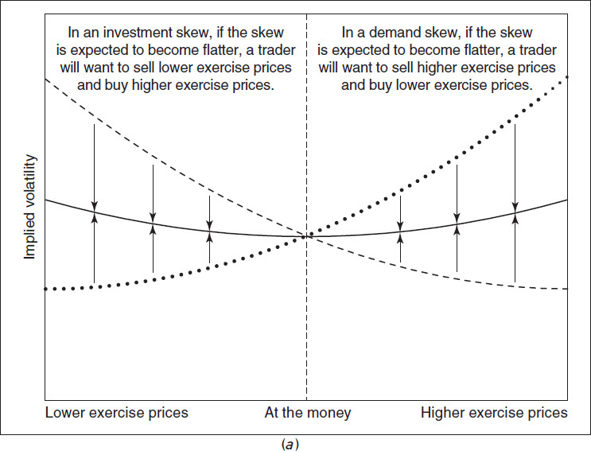

<!-- source:block 4662d3a127406d3c -->

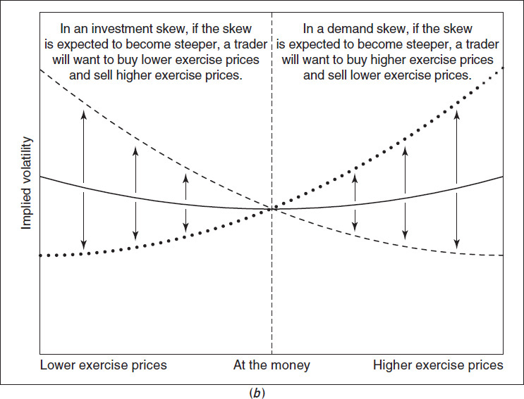

<!-- source:block aa8284e927887218 -->

> [!quote]- English 63
> If a skew trade is not hedged, the position will clearly have a positive delta (long calls and short puts) or negative delta (long puts and short calls). A trader who wants to focus solely on “buying skew” or “selling skew” must offset the delta position, most commonly with an opposing delta position in the underlying contract. When this is done, the entire strategy is usually referred to as a *risk reversal*. With the underlying contract trading at a price close to 100, the following are typical risk reversals (delta values are in parentheses):

如果偏斜交易未进行对冲，该头寸显然会带有正 Delta（多头看涨期权加空头看跌期权）或负 Delta（多头看跌期权加空头看涨期权）。若交易者只想暴露于“买入偏斜”或“卖出偏斜”，就必须抵消该 Delta 头寸，最常见的方法是在标的合约中建立反向 Delta 头寸。完成这一对冲后，整体策略通常称为风险反转（risk reversal）。当标的合约价格接近 100 时，以下是典型的风险反转（括号内为 Delta）：

<!-- source:block b1963b693dc64653 -->

> [!quote]- English 64
> +10 June 95 puts (–25)

$$
+10 \text{June} 95 \text{puts} (-25)
$$

<!-- source:block 0e806a5bc3c6f130 -->

> [!quote]- English 65
> –10 June 105 calls (+25)

$$
-10 \text{June} 105 \text{calls} (+25)
$$

<!-- source:block a396dfffb009fa89 -->

> [!quote]- English 66
> +5 underlying contracts

$$
+5 \text{underlying contracts}
$$

<!-- source:block 7e7222de590dad25 -->

> [!quote]- English 67
> or

或

<!-- source:block cda1ed78ba728677 -->

> [!quote]- English 68
> –30 December 90 puts (–15)

$$
-30 \text{December} 90 \text{puts} (-15)
$$

<!-- source:block 47feb93bc340a5d7 -->

> [!quote]- English 69
> +30 December 110 calls (+15)

$$
+30 \text{December} 110 \text{calls} (+15)
$$

<!-- source:block 3602285c7ab0808e -->

> [!quote]- English 70
> –9 underlying contracts

$$
-9 \text{underlying contracts}
$$

<!-- source:block a75967936f45a69e -->

> [!quote]- English 71
> In these examples, the calls and puts have the same delta, but this is not a requirement. More commonly, calls and puts are chosen with the same vega values.6 This ensures that the position is vega neutral at inception and therefore primarily sensitive to changes in the slope of the skew rather than changes in overall implied volatility. Of course, as market conditions change, the delta, gamma, and vega of the position will almost certainly change. When this occurs, a trader will have to decide whether to maintain the position and, if so, how best to manage the delta, gamma, and vega risk. The risk characteristics of a typical risk reversal were discussed in Chapter 21.

在这些示例中，看涨期权和看跌具有相同的Delta，但这不是要求。更常见的是，看涨和看跌期权的选择具有相同的Vega值。[^ovp24-6]这确保了头寸在开始时是Vega中性的，因此主要对斜率的变化敏感，而不是总体隐含波动率的变化。当然，随着市场条件的变化，头寸的Delta、Gamma和Vega几乎肯定会发生变化。当这种情况发生时，交易者必须决定是否维持头寸，如果是，如何最好地管理Delta、Gamma和Vega风险。第21章讨论了典型风险逆转的风险特征。

<!-- source:block 9ee9779b1516f638 -->

> [!quote]- English 72
> Just as a trader may have an opinion about skewness, the slope of a volatility skew, a trader may also have an opinion about kurtosis, the curvature of a volatility skew. If the kurtosis is expected to increase, the prices of options at both lower and higher exercise prices will increase. A trader will therefore want to buy strangles by purchasing both out-of-the-money calls and out-of-the-money puts. If the kurtosis is expected to decrease, option prices at both lower and higher exercise prices will decline. A trader will then want to sell strangles by selling both out-of-the-money calls and out-of-the-money puts. This is shown in Figure 24-15.

正如交易者可能对波动率倾斜的斜率（slope）有看法一样，交易者也可能对峰度（波动率倾斜的弯曲度）有看法。如果预计峰度会增加，那么较低和较高行权价的期权价格都会增加。因此，交易者会希望通过购买价外看涨期权和价外看跌期权来购买宽跨式。如果预计峰度会下降，那么较低和较高行权价的期权价格都会下降。然后，交易员会希望通过出售价外看涨期权和价外看跌期权来出售宽跨式期权。如图24-15所示。

<!-- source:block 6d1f0f327ebb1b3a -->

*图24-15峰度上升和下降。 / Figure 24-15 Rising and falling kurtosis.*

<!-- source:block 3b94c4bbe3f55c64 -->

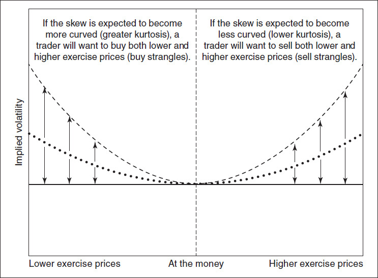

<!-- source:block 2f898402bd4a518e -->

> [!quote]- English 74
> If a trader “buys” kurtosis by purchasing strangles or “sells” kurtosis by selling strangles, the position will also be sensitive to overall changes in volatility because the position will have a very pronounced positive or negative vega. Even if the trader is correct in his assessment of kurtosis, the position can be negatively affected by overall changes in implied volatility. If the trader wishes to focus solely on kurtosis, he will need to neutralize his vega position without changing the kurtosis of the position. Because at-the-money options are neutral with respect to kurtosis, a trader can achieve this by taking an offsetting vega position in at-the-money straddles. Assuming that the selected strangles and straddles are delta neutral, the entire position will also be delta neutral. With the underlying contract trading at a price close to 100, the following are typical kurtosis positions (vega values are in parentheses):

如果交易者通过购买宽跨式来“购买”峰度或通过出售宽跨式来“出售”峰度，则该头寸也将对波动率的整体变化敏感，因为该头寸将具有非常明显的正或负的Vega。即使交易员对峰度的评估是正确的，该头寸也可能受到隐含波动率整体变化的负面影响。如果交易者希望只关注峰度，他需要在不改变头寸的峰度的情况下抵消他的Vega头寸。由于平值期权相对于峰度是中性的，因此交易者可以通过在平值跨式易中持有抵消Vega头寸来实现这一目标。假设所选的宽跨式和跨式是Delta中性的，则整个头寸也将是Delta中性的。由于标的合约的交易价格接近100，以下是典型的峰度头寸（Vega值在括号中）：

<!-- source:block 004247f8f282e4ca -->

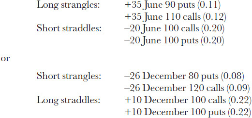

<!-- 原 EPUB 中此公式为图片，已原样保留 -->

<!-- source:block d00b250a7611205e -->

> [!quote]- English 75
> If a kurtosis position is made up of a strangle that has exactly half the vega of the straddle, a vega-neutral position will consist of two strangles for each straddle. When done in this 2 × 1 ratio, the position is sometimes referred to as a *dragonfly*.

如果峰度头寸是由一个Strangle组成的，而该Strangle的Vega恰好是跨式的一半，那么一个Vega中性头寸将由每个跨式的两个Strangle组成。当以此2 × 1比例执行时，该头寸有时被称为“到期时”。

<!-- source:block 4de9e28201345843 -->

> [!quote]- English 76
> An opinion about skew and kurtosis can also be incorporated into other strategies. Consider the skews in Figure 24-16 on the same underlying product but for different expiration months. If a trader has no opinion on whether either skew is mispriced individually but believes that the skews are mispriced with respect to each other, a logical strategy might be to take a skew position in one expiration month and an opposing skew position in the other month. For example, a trader might buy out-of-the-money puts in June and sell out-of-the-money puts in March. At the same time, the trader might sell out-of-the-money calls in June and buy out-of-the-money calls in March. The trader has, in effect, bought put calendar spreads and sold call calendar spreads. If the skew is the only consideration (the trader has no opinion on whether implied volatility is high or low), the trader will try to take a position that is vega neutral by choosing calendar spreads that have approximately the same vega. Any residual deltas can be hedged away with the underlying contract.

关于倾斜和峰度的观点也可以结合到其他策略中。考虑图24-16中相同基础产品但到期月份不同的倾斜。如果交易员对任何一个扭曲是否单独定价没有意见，但认为这些扭曲彼此定价错误，那么逻辑策略可能是在一个到期月份采取扭曲头寸，并在另一个月采取相反的扭曲头寸。例如，交易员可能会在6月份购买价外看跌期权，并在3月份出售价外看跌期权。与此同时，交易员可能会在6月份出售价外看涨期权，并在3月份购买价外看涨期权。交易员实际上购买了看跌日历价差并出售了看涨日历价差。如果偏差是唯一的考虑因素（交易员对隐含波动率是高还是低没有意见），交易员将尝试通过选择具有大致相同Vega的日历价差来采取Vega中性的头寸。任何剩余Delta都可以通过标的合约对冲。

<!-- source:block 90ccb345cbf153b8 -->

*图24-16不同到期月份的买卖偏差。 / Figure 24-16 Buying and selling skew in different expiration months.*

<!-- source:block 49c09f4f6ecf493f -->

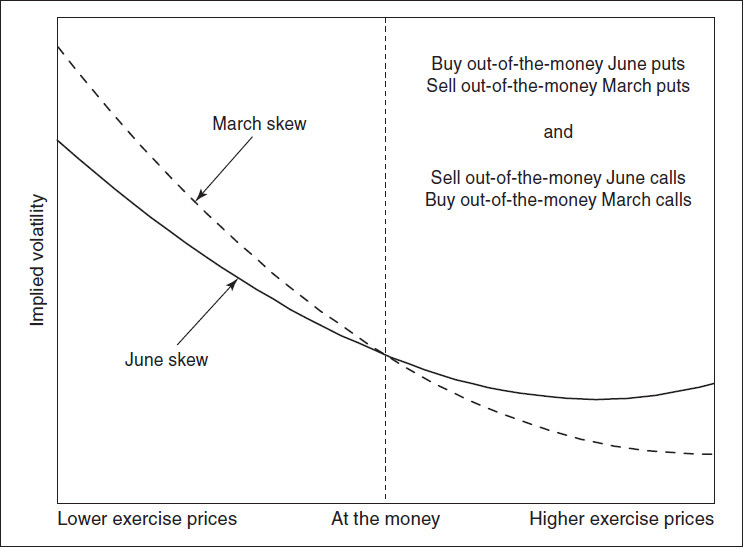

<!-- source:block fcac9d081a3a3c61 -->

> [!quote]- English 78
> If, in addition to an opinion about the skew, a trader also has an opinion about the relative implied volatility in different expiration months, he can take this into consideration when choosing a strategy. If a trader believes that implied volatility in June is low compared with implied volatility in March, the trader will consider buying calendar spreads—buy June options and sell March options. If, at the same time, the trader also believes that the skews are mispriced with respect to each other, as in Figure 24-16, he will choose calendar spreads that take both relationships into consideration. Now he will want to buy put calendar spreads—buy out-of-the-money June puts and sell out-of-the-money March puts. By doing so, the trader takes advantage of both implied volatility and skew. Note that the trader will avoid call calendar spreads because the volatility and skew will tend to offset each other. The June calls are too expensive with respect to skew, but the March calls are too expensive with respect to implied volatility. If the trader believes that June implied volatility is high compared with March, now he will choose to sell call calendar spreads because the June calls are too expensive with respect to both implied volatility and skew.

如果交易者除了对偏差的看法之外，还对不同到期月份的相对隐含波动率有看法，那么他可以在选择策略时考虑这一点。如果交易员认为6月份的隐含波动率低于3月份的隐含波动率，该交易员将考虑购买日历价差-购买6月期权并出售3月期权。同时，如果交易者还认为倾斜方向彼此定价错误，如图24-16所示，他将选择考虑这两种关系的日历价差。现在他将想要购买看跌期权日历价差——购买6月价外看跌期权并出售3月价外看跌期权。通过这样做，交易员可以利用隐含波动率和偏差。请注意，交易者将避免看涨日历价差，因为波动率和偏差往往会相互抵消。6月份的看涨期权就偏差而言太贵了，但3月份的看涨期权就隐含波动率而言太贵了。如果交易员认为6月隐含波动率高于3月，那么现在他将选择出售看涨日历价差，因为6月看涨期权在隐含波动率和偏差方面都太贵了。

<!-- source:block e47f351658445139 -->

> [!quote]- English 79
> The same approach can be used when kurtosis in two different expiration months seems to be mispriced, as shown in Figure 24-17. Now a trader might consider buying June strangles and selling March strangles. If this is a simple kurtosis strategy within a single expiration month, it will be necessary to offset the vega by purchasing at-the-money straddles. But a trader can avoid this complication by choosing strangles in the two different expiration months that have approximately the same vega values. This ensures that the entire strategy is sensitive only to changes in kurtosis. If, at the same time, June implied volatility seems low compared with March, the strategy has an added advantage. June options are cheap compared with March options with respect to both volatility and kurtosis.

当两个不同到期月份的峰度似乎定价错误时，可以使用相同的方法，如图24-17所示。现在，交易员可能会考虑购买June Strangle并出售March Strangle。 如果这是一个简单的峰度策略，在一个单一的到期月，这将是必要的，以抵消Vega购买ATM 跨式。但交易者可以通过在Vega值大致相同的两个不同到期月份选择Strangle来避免这种复杂性。 这确保了整个策略仅对峰度的变化敏感。与此同时，如果6月隐含波动率似乎低于3月，那么该策略还有额外的优势。与三月期权相比，六月期权在波动率和峰度方面都便宜。

<!-- source:block fbc41d1ae58894ea -->

*图24-17不同到期月份的买卖峰度。 / Figure 24-17 Buying and selling kurtosis in different expiration months.*

<!-- source:block 5541e8812fc3331b -->

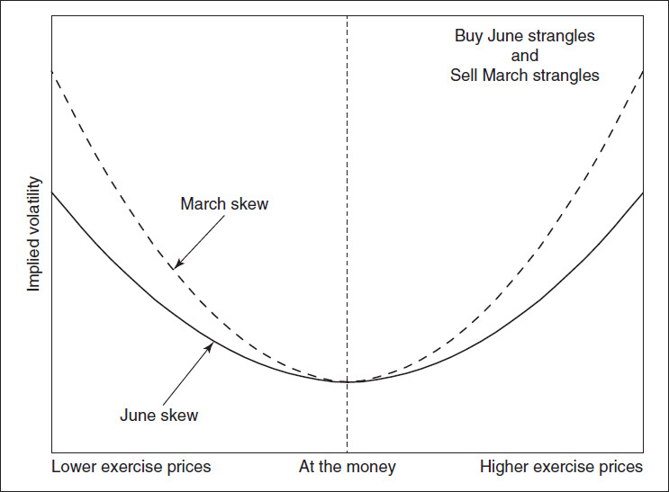

<!-- source:block 5996bdea1777c122 -->

## 隐含分布 / Implied Distributions

<!-- source:block 962ccd09eb08ac83 -->

> [!quote]- English 81
> In a perfect Black-Scholes world, the prices of the underlying contract are assumed to be lognormally distributed at expiration, and every option with the same expiration date ought to have the same implied volatility. The fact that options across different exercise prices have different implied volatilities must mean that the marketplace believes that the distribution of underlying prices at expiration is not lognormal. Exactly what probability distribution is the marketplace implying to the underlying contract at expiration? We can estimate this implied distribution by looking at the prices of butterflies in the marketplace.

在完美的布莱克-斯科尔斯世界中，假设标的合约的价格在到期时服从对数正态分布，并且具有相同到期日期的每个期权都应该具有相同的隐含波动率。不同行权价的期权具有不同的隐含波动率这一事实一定意味着市场认为到期时标的价格的分布不是对数正态的。市场在到期时对标的合约意味着什么概率分布？我们可以通过观察市场上蝶式价差的价格来估计这种隐含分布。

<!-- source:block 3ead3584e31a4e31 -->

> [!quote]- English 82
> At expiration, a butterfly has a minimum value of 0 if the underlying price is at or outside the wings and a maximum value of the amount between exercise prices if the underlying price is exactly at the body, or midpoint, of the butterfly. At expiration, the 95/100/105 butterfly (i.e., buy a 95 call, sell two 100 calls, buy a 105 call) will have a minimum value of 0 if the underlying price is at or below 95 or at or above 105, a maximum value of 5.00 if the underlying price is exactly 100, or some amount between 0 and 5.00 if the underlying price is between 95 and 100 or between 100 and 105.

到期时，如果标的价格位于蝶式价差翅膀处或翅膀外，蝶式价差的最小值为0;如果标的价格恰好位于蝶式价差的身体或中点，则蝶式价差的最大值为行权价之间的金额。到期时，95/100/105蝶式价差（即，买入95看涨期权，卖出两个100看涨期权，买入105看涨期权）如果标的价格处于或低于95或处于或高于105，则最小值为0，如果标的价格恰好为100，则最大值为5.00，或者如果标的价格在95和100之间或100和105之间，则最大值为0和5.00之间的某个金额。

<!-- source:block 6016e7e906152306 -->

> [!quote]- English 83
> Suppose that exercise prices at five-point intervals are available extending from 0 to infinity:

假设以五个点的间隔提供从0到无限大的行权价：

<!-- source:block 167cac6a92c9b526 -->

> [!quote]- English 84
> …, 70, 75, 80, 85, 90, 95, 100, 105, 110, 115, 120, 125, 130,…

$$
\ldots, 70, 75, 80, 85, 90, 95, 100, 105, 110, 115, 120, 125, 130,\ldots
$$

<!-- source:block fb25640136eb8bac -->

> [!quote]- English 85
> What will be the value of the position at expiration if we buy every five-point butterfly?

如果我们购买每一只五点蝶式价差，到期时头寸的价值是多少？

<!-- source:block 1f68815da6642928 -->

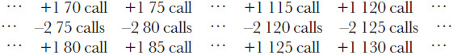

<!-- 原 EPUB 中此公式为图片，已原样保留 -->

<!-- source:block 53402a16a59e5230 -->

> [!quote]- English 86
> Regardless of the underlying price at expiration, the entire position will always have a value of exactly 5.00. As a result, if we add up the prices of all the butterflies, the total value must be 5.00.7

无论到期时的标的价格如何，整个头寸的价值始终恰好为5.00。因此，如果我们将所有Butterfly的价格加起来，总价值一定是5.00。 [^ovp24-7]

<!-- source:block 994d6159cb3c5ba8 -->

> [!quote]- English 87
> Suppose that we make the assumption that the only prices that are possible at expiration are prices that are equal to an exercise price

假设我们假设到期时唯一可能的价格是等于行权价的价格

<!-- source:block 167cac6a92c9b526 -->

> [!quote]- English 88
> …, 70, 75, 80, 85, 90, 95, 100, 105, 110, 115, 120, 125, 130,…

$$
\ldots, 70, 75, 80, 85, 90, 95, 100, 105, 110, 115, 120, 125, 130,\ldots
$$

<!-- source:block b2e9d69c945b7172 -->

> [!quote]- English 89
> The probability of each underlying price occurring must be equal to the price of that butterfly, where the inside exercise price is equal to the underlying price divided by 5.00. If the price of the 75/80/85 butterfly is 0.15, the probability of an underlying price of 80 at expiration must be

每个标的价格发生的概率必须等于该蝶式价差的价格，其中内部行权价等于标的价格除以5.00。如果75/80/85蝶式价差的价格为0.15，则到期时标的价格为80的概率必须为

<!-- source:block 92cfd39b6cc89cd7 -->

> [!quote]- English 90
> 0.15/5.00 = 0.03 (3%)

$$
0.15/5.00 = 0.03 (3\%)
$$

<!-- source:block c01a23fdada8f225 -->

> [!quote]- English 91
> If the price of the 90/95/100 butterfly is 0.50, the probability of an underlying price of 95 at expiration must be

如果90/95/100蝶式价差的价格为0.50，则到期时标的价格为95的概率必须为

<!-- source:block 342634b92cfdbbeb -->

> [!quote]- English 92
> 0.50/5.00 = 0.10 (10%)

$$
0.50/5.00 = 0.10 (10\%)
$$

<!-- source:block 34bd818331dbe431 -->

> [!quote]- English 93
> Figure 24-18 shows a series of call values together with the resulting butterfly values for our series of exercise prices.8 The probability associated with each underlying price is determined by dividing the butterfly value by the total value of all butterflies, which we know must be 5.00. (The reader may wish to confirm that all the butterfly values do indeed sum to 5.00 and that the probabilities sum to 1.00, or 100 percent.) The underlying prices and their associated probabilities are shown in Figure 24-19. Note that these values form a probability distribution that is skewed to the right. This should come as no surprise because the values were derived from the Black-Scholes model, which assumes a lognormal distribution of underlying prices.

图24-18显示了一系列行权价格的看涨期权值以及由此产生的Butterfly值。与每个标的价格相关的概率是通过将Butterfly价值除以所有Butterfly的总价值来确定的，我们知道该总价值必须是5.00。 (The读者可能希望确认所有Butterfly值的总和确实为5.00，并且概率总和为1.00或100 %。）标的价格及其相关概率如图24-19所示。 请注意，这些值形成了向右倾斜的概率分布。这并不令人意外，因为这些价值是从布莱克-斯科尔斯模型中得出的，该模型假设标的价格呈对数正态分布。 [^ovp24-8]

<!-- source:block 0f828c77ff570bc7 -->

*Figure 24-18 Butterfly values and probabilities. / Figure 24-18 Butterfly values and probabilities.*

<!-- source:block bb3bfe40cfe93d3c -->

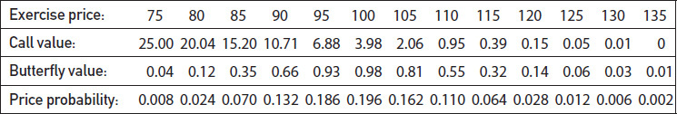

<!-- source:block 24258c59c9aa7a66 -->

*Figure 24-19 A discrete probability distribution implied from the prices of butterflies. / Figure 24-19 A discrete probability distribution implied from the prices of butterflies.*

<!-- source:block 038c0829d99af59e -->

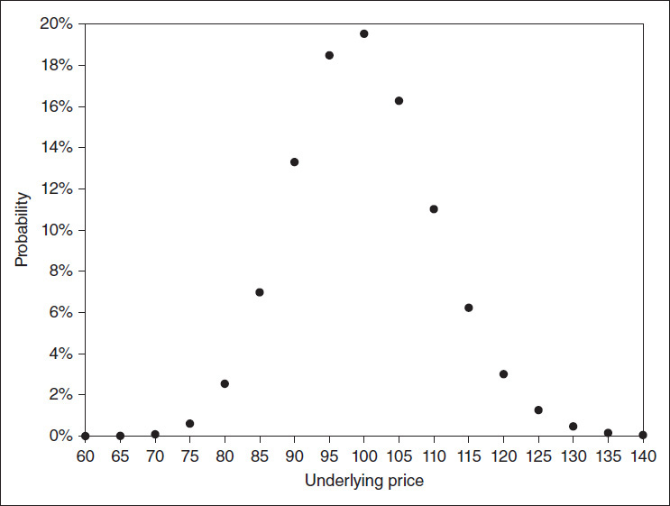

<!-- source:block 378c357e3d5fa323 -->

> [!quote]- English 96
> Of course, the distribution in Figure 24-19 is only an approximation because it includes a limited number of underlying prices. A more exact distribution requires us to consider more and more exercise prices. We can do this by reducing the width of the butterflies. Instead of using increments of 5.00, we might use increments of 2.00, 1.00, or 0.50. Indeed, if we use increments that are infinitesimally small, the butterfly values will enable us to construct a continuous probability distribution. Figure 24-20 shows the probability distribution with the increment between exercise prices reduced to 0.10. With such a small increment, the distribution appears almost continuous.

当然，图24-19中的分布只是一个近似值，因为它包括有限数量的标的价格。更准确的分配需要我们考虑越来越多的行权价。我们可以通过减少蝶式价差的宽度来做到这一点。我们可以使用2.00、1.00或0.50的增量，而不是使用5.00的增量。事实上，如果我们使用无限小的增量，蝶式价差值将使我们能够构建连续的概率分布。图24-20显示了行权价之间增量降至0.10时的概率分布。增量如此之小，分布看起来几乎是连续的。

<!-- source:block b9da4566197cdac9 -->

*Figure 24-20 A continuous lognormal probability distribution implied from the prices of butterflies. / Figure 24-20 A continuous lognormal probability distribution implied from the prices of butterflies.*

<!-- source:block cfaab77c069ca0a5 -->

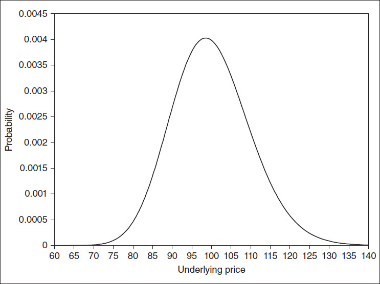

<!-- source:block e1b8862ad6308816 -->

> [!quote]- English 98
> How does the distribution implied by option prices compare with a traditional lognormal distribution? The implied distribution will change as option prices change, so there cannot be one implied distribution under all market conditions. But we might get some sense of the distribution that the marketplace is implying by using the prices of butterflies generated by a volatility skew to derive a distribution and comparing it with a Black-Scholes distribution with a constant volatility. In Figure 24-21, we have taken the volatility skew for the FTSE 100 options shown in Figure 24-3 and created two distributions, one from the prices generated from the skew and one from prices generated from a constant volatility across every exercise price. What can we infer from Figure 24-21?

期权价格所隐含的分布与传统的对数正态分布相比如何？隐含分布会随着期权价格的变化而变化，因此在所有市场条件下都不可能有一个隐含分布。但我们可能会通过使用波动率倾斜产生的蝶式价差价格来推导一个分布，并将其与具有恒定波动率的布莱克-斯科尔斯分布进行比较来了解市场所暗示的分布。在图24-21中，我们对图24-3所示的富时100期权进行了波动率偏差，并创建了两个分布，一个来自偏差产生的价格，另一个来自每个行权价的恒定波动产生的价格。从图24-21我们可以推断出什么？

<!-- source:block f43b2ec7fd581d41 -->

*图24-21富时100期权价格暗示的三个月价格分布，2012年3月16日（富时100指数= 5,965.58）。 / Figure 24-21 Three-month price distribution implied from FTSE 100 option prices, March 16, 2012 (FTSE 100 Index = 5,965.58).*

<!-- source:block cdb87b1cd18e3dee -->

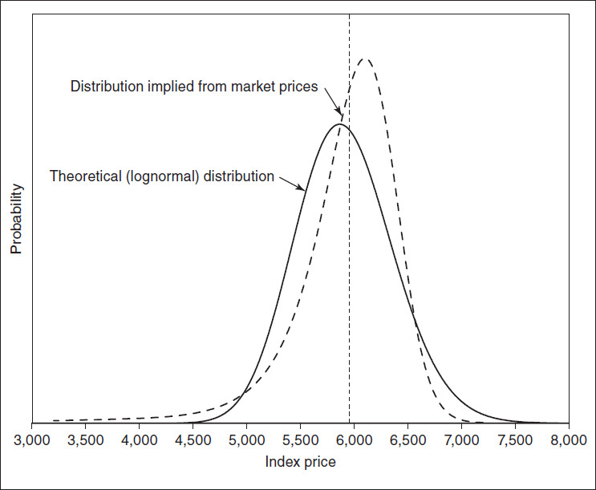

<!-- source:block 091203f9828cfd06 -->

> [!quote]- English 100
> Compared with a traditional lognormal distribution, the marketplace seems to be implying the following:

与传统的对数正态分布相比，市场似乎暗示了以下内容：

<!-- source:block 3f95f1292412d35f -->

> [!quote]- English 101
> 1. A greater probability of a small to intermediate upward move

1.小幅至中等上行的可能性较大

<!-- source:block cccd67e5cb60618d -->

> [!quote]- English 102
> 2. A greater probability of a large downward move

2.大幅下调的可能性较大

<!-- source:block 00bca855581bbe26 -->

> [!quote]- English 103
> 3. A smaller probability of a small to intermediate downward move

3.小幅至中等向下移动的可能性较小

<!-- source:block 5f4134cf6ad3d777 -->

> [!quote]- English 104
> 4. A smaller probability of a large upward move

4.大幅上涨的可能性较小

<!-- source:block ef104f8b487a1010 -->

> [!quote]- English 105
> This implied distribution is typical of most stock index markets, and many of these points seem to be consistent with the S&P 500 histogram in Figure 23-8*a*. There do seem to be more small moves in the real world than is predicted by a theoretical distribution. There also seem to be more large downward moves and fewer intermediate downward moves. But the histogram also shows more big upward moves, which is not consistent with the implied distribution.

这种隐含分布是大多数股指市场的典型分布，其中许多点似乎与图23-8a中的标准普尔500指数图表一致。现实世界中的小动作似乎确实比理论分布预测的要多。似乎也有更多的大幅下跌和更少的中间下跌。但该图表也显示了更大的上涨，这与隐含的分布不一致。

<!-- source:block 9c11152fa35898ea -->

> [!quote]- English 106
> Figure 24-22 shows the three-month distribution implied from the prices of options on wheat futures on January 27, 2012. This implied distribution seems to conform more closely to a theoretical lognormal distribution than does the distribution in the FTSE 100 example. However, the marketplace is still implying more small moves, slightly fewer intermediate upward moves, and slightly more large upward moves than a true lognormal distribution.

图24-22显示了2012年1月27日小麦期货期权价格隐含的三个月分布。与富时100指数示例中的分布相比，这种隐含分布似乎更符合理论上的对数正态分布。然而，市场仍然意味着比真正的对数正态分布更多的小幅波动、略少的中间上行波动以及略大的上行波动。

<!-- source:block abff77da0668ccda -->

*图24-22小麦期权价格暗示的三个月价格分布，2012年1月27日（三个月小麦期货为661.75）。 / Figure 24-22 Three-month price distribution implied from wheat option prices, January 27, 2012 (with three-month wheat futures at 661.75).*

<!-- source:block ed6dabb47d03e7e1 -->

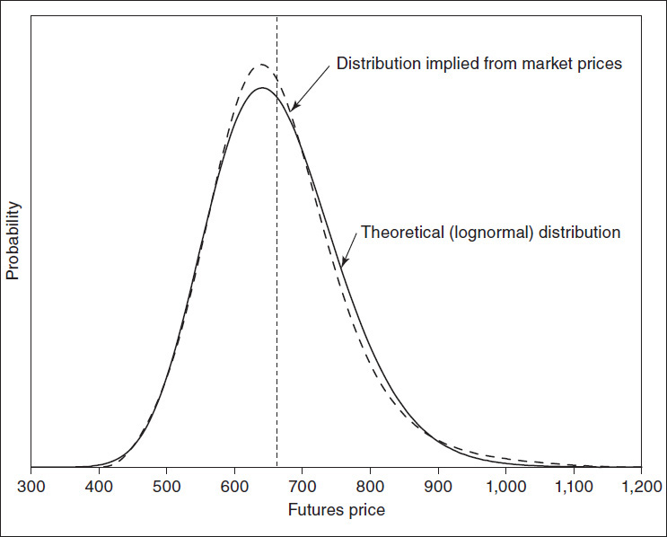

<!-- source:block f4c0e2d09222ce36 -->

> [!quote]- English 108
> Of course, Figures 24-21 and 24-22 are snapshots of markets at one moment in time, and it would be unwise to draw any sweeping conclusions from these examples. Nonetheless, it can often be useful for a trader to compare his opinions about a probability distribution with that implied by prices in the marketplace. If there is a clear disagreement, it may point the way to a potentially profitable strategy.

当然，图24-21和24-22是某个时刻的市场快照，从这些例子中得出任何全面的结论是不明智的。尽管如此，对于交易者来说，将他对概率分布的看法与市场价格所暗示的看法进行比较通常是有用的。如果存在明显的分歧，可能会为潜在盈利的策略指明道路。

<!-- source:block 6a562f3186e8cae4 -->

> [!note] Footnote 109
> 1 The Financial Times Stock Exchange 100 Index (the FTSE 100) is the most widely followed index of U.K. stock prices.

[^ovp24-1]: 英国《金融时报》证券交易所100指数（富时100）是英国最受关注的指数股价。

<!-- source:block 8417190769014de4 -->

> [!note] Footnote 110
> 2 There are, of course, investors and traders who take short stock positions, but they are relatively small in number compared with those who are long stock.

[^ovp24-2]: 当然，也有投资者和交易者持有股票空头，但与持有股票多头的人相比，他们的数量相对较少。

<!-- source:block 433ff693f0b22fee -->

> [!note] Footnote 111
> 3 A more theoretically correct approach involves using the forward price *F* rather than the spot price, *S*

[^ovp24-3]: 理论上更正确的方法涉及使用远期价格F而不是现货价格S

<!-- source:block 8b9405a666b4ace9 -->

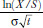

<!-- 原 EPUB 中此公式为图片，已原样保留 -->

<!-- source:block b7993aa4b28189e2 -->

> [!note] Footnote 112
> In this case, the at-the-forward option has a standard deviation of 0.
> 在这种情况下，向前期权的标准差为0。

<!-- source:block 50915aa501b7d042 -->

> [!note] Footnote 113
> 4 Because all exchange-traded markets seem to exhibit positive kurtosis, we ignore negative kurtosis skews.

[^ovp24-4]: 由于所有交易所交易市场似乎都表现出正的峰度，因此我们忽略了负的峰度偏差。

<!-- source:block 01c8737c0e39729c -->

> [!note] Footnote 114
> 5 When traders use the terms *skewness* and *kurtosis* (or *skew* and *kurt* for short), it is not always clear whether they are referring to the inputs into the model (the values of *b* and *c* in our example) or the sensitivity of the option’s value to a change in these inputs. Typically, a trader will refer to the sensitivities as the option’s skewness or kurtosis. Or the trader will refer to his skewness and kurtosis position: the sensitivity of his entire position to a one-unit change in the skewness or kurtosis inputs.

[^ovp24-5]: 当交易者使用术语skewness和kurt（或简称skew和kurt）时，并不总是清楚他们是否指的是模型的输入（我们示例中的b和c的值）或期权价值对这些输入变化的敏感性。通常，交易员会将敏感性称为期权的偏度或峰度。或者交易者会参考他的偏度和峰度头寸：他的整个头寸对偏度或峰度输入一个单位变化的敏感性。

<!-- source:block 625b1b57ade1143e -->

> [!note] Footnote 115
> 6 A risk reversal that is vega neutral will tend to be gamma neutral, although this will not always be the case. A trader may have to decide whether it is more important for the risk reversal to be vega neutral or gamma neutral.

[^ovp24-6]: 一个Vega中性的风险逆转将倾向于Gamma中性，尽管情况并非总是如此。交易员可能必须决定风险逆转是Vega中性还是Gamma中性更重要。

<!-- source:block 7c5849b68a48c523 -->

> [!note] Footnote 116
> 7If we include interest rates, and the options are subject to stock-type settlement, the total will be the present value of 5.00.

[^ovp24-7]: 如果我们包括利率，并且期权须进行股票型结算，则总数将为5.00的现值。

<!-- source:block cdb6f1949d31ac85 -->

> [!note] Footnote 117
> 8The values in Figure 24-18 correspond, approximately, to Black-Scholes values using an underlying price of 100, three months to expiration, a volatility of 20 percent, and an interest rate of 0.

[^ovp24-8]: 图24-18中的值大约相当于Black-Scholes值，标的价格为100，到期三个月，波动率为20%，利率为0。

---

[[00-阅读导航|← 返回阅读导航]]

<!-- chapter-nav:start -->
> [!tip] 章节导航（章末）
> [[23-模型与现实世界 Models and the Real World|← 上一章]] · [[00-阅读导航|全书导航]] · [[25-波动率合约 Volatility Contracts|下一章 →]]
<!-- chapter-nav:end -->
