# Black–Scholes 模型 / The Black-Scholes Model

[[阅读导航|← 返回阅读导航]]

> [!warning] 翻译状态
> 本章双语稿已生成，尚待逐段人工复核。英文原文、数字、公式和图表保留用于核对。

> [!info] 先分清两个分布
> Black–Scholes 的经典假设不是“价格服从正态分布”，而是[[正态分布|对数收益服从正态分布]]，从而使到期价格服从[[对数正态分布]]。本章中的 $N(\cdot)$ 是标准正态累积分布函数，用来计算风险中性定价权重。

<!-- chapter-toc:start -->
## 本章目录 / Chapter Outline

> [!abstract] 结构导航
> 以下标题按原书顺序保留；点击可直接跳转。
> 其中若干分组标题为本双语版为便于理解而增加的编辑性结构；英文原文与原书小节顺序未变。

- [[#模型目标与偏微分方程 / Model Objective and PDE|模型目标与偏微分方程 / Model Objective and PDE]]
- [[#从偏微分方程到闭式解 / From PDE to Closed Form|从偏微分方程到闭式解 / From PDE to Closed Form]]
- [[#定价公式的直觉 / Pricing Intuition|定价公式的直觉 / Pricing Intuition]]
- [[#正态与对数正态 / Normal and Lognormal Distributions|正态与对数正态 / Normal and Lognormal Distributions]]
  - [[#n(x) 与 N(x) / n(x) and N(x)|n(x) 与 N(x) / n(x) and N(x)]]
- [[#从对数正态分布到 d1 与 d2 / From Lognormal Distribution to d1 and d2|从对数正态分布到 d1 与 d2 / From Lognormal Distribution to d1 and d2]]
- [[#持有成本与模型变体 / Carry and Model Variants|持有成本与模型变体 / Carry and Model Variants]]
  - [[#广义 Black–Scholes 定价公式|广义 Black–Scholes 定价公式]]
  - [[#传统敏感度公式|传统敏感度公式]]
  - [[#高阶敏感度公式|高阶敏感度公式]]
- [[#一个实用的近似式 / A Useful Approximation|一个实用的近似式 / A Useful Approximation]]
- [[#Delta（标的价格敏感度） / The Delta|Delta（标的价格敏感度） / The Delta]]
- [[#Theta（时间敏感度） / The Theta|Theta（时间敏感度） / The Theta]]
- [[#Gamma、Theta 与 Vega 的最大值 / Maximum Gamma, Theta, and Vega|Gamma、Theta 与 Vega 的最大值 / Maximum Gamma, Theta, and Vega]]
<!-- chapter-toc:end -->
<!-- chapter-nav:start -->
> [!tip] 章节导航（章首）
> [[使用期权进行对冲 Hedging with Options|← 上一章]] · [[阅读导航|全书导航]] · [[二叉树期权定价 Binomial Option Pricing|下一章 →]]
<!-- chapter-nav:end -->

## 模型目标与偏微分方程 / Model Objective and PDE

<!-- source:block dda1779c7e9e8874 -->

> [!quote]- English 1
> Because of its importance as a foundation of option pricing theory, as well as its widespread use by traders, it will be worthwhile to take a closer look at the Black-Scholes model.1 The discussion in this chapter is not meant to be a rigorous or detailed derivation of the model, which is better suited to a university textbook or to a class in financial engineering. Rather, we hope to present a more intuitive discussion of the workings of the model, as well as some observations on the values generated by the model.

由于它作为期权定价理论基础的重要性，以及它被交易者广泛使用，因此值得仔细研究布莱克-斯科尔斯模型。[^ovp18-1]本章的讨论并不意味着该模型的严格或详细推导，该模型更适合大学教科书或金融工程课程。相反，我们希望对模型的工作原理进行更直观的讨论，以及对模型生成的值的一些观察。

<!-- source:block 1800d7d1313f492d -->

> [!quote]- English 2
> Initially, rather than calculating the theoretical value of an option, Black and Scholes tried to answer this question: if the stock price moves randomly over time, but in a manner that is consistent with a constant interest rate and volatility, what must be the option price after each moment in time such that an option position that is correctly hedged will just break even? The answer to this question resulted in rather intimidating-looking equation

最初，布莱克和斯科尔斯并没有计算期权的理论价值，而是试图回答这个问题：如果股价随时间随机移动，但以与恒定利率和波动率一致的方式移动，那么每个时刻之后的期权价格必须是多少，以便正确对冲的期权头寸将盈亏平衡？这个问题的答案产生了一个看起来相当吓人的方程

<!-- source:block 443778ab3672e77d -->

$$
rS\frac{\partial C}{\partial S}
+\frac{1}{2}\sigma^2S^2\frac{\partial^2 C}{\partial S^2}
+\frac{\partial C}{\partial u}
=rC.
$$

这里用 $u$ 表示向前推进的日历时间，到期日固定为 $T$；后文统一用

$$
\tau=T-u,
\qquad
\frac{\partial}{\partial u}=-\frac{\partial}{\partial\tau}
$$

表示剩余期限。因此，上式的时间项取正号；若改用 $\tau$ 写 PDE，同一项应写成 $-\partial C/\partial\tau$。

<!-- source:block 63ae4e25d5c27f74 -->

> [!quote]- English 3
> Although this equation might look mysterious to many readers, it is just a mathematician’s way of expressing how changes in one set of variables—stock price *S* and time *t*—affect the value of something else, a call *C*. To determine the exact effect caused by changes in the variables, one must solve the equation.

尽管这个方程对许多读者来说可能看起来很神秘，但它只是数学家表达一组变量（股价 $S$ 和日历时间 $u$）的变化如何影响其他事物（看涨期权 $C$）价值的方式。为了确定变量变化引起的确切影响，必须求解方程。

<!-- source:block 46187727fa2cbfd8 -->

> [!quote]- English 4
> Note that we did not refer to the volatility σ and interest rate *r* as variables. In the Black-Scholes equation, only the stock price and time are changing. As inputs into the model, the volatility and interest rate will affect the value of the option. But once they have been chosen, they are assumed to remain constant over the life of the option. This is consistent with the dynamic hedging examples in Chapter 8. Over the life of an option, we assumed that only the underlying price and time were changing. Everything else remained constant.

请注意，我们没有将波动率 $\sigma$ 和利率 $r$ 视为状态变量。在 Black–Scholes 方程中，变化的状态量只有股价 $S$ 与日历时间 $u$。波动率和利率作为模型输入会影响期权价值，但一旦选定，便假设它们在期权存续期内保持不变。这与第 8 章的动态对冲示例一致：期权存续期内仅让标的价格和时间变化，其他输入保持不变。

<!-- source:block f43b300b2088170f -->

> [!quote]- English 5
> We have already encountered several of the components of the Black-Scholes equation in slightly different form. The terms *C*

我们已经遇到过布莱克-斯科尔斯方程中形式略有不同的几个组成部分。术语C

<!-- source:block b12abde13d15b420 -->

$$
\frac{\partial C}{\partial S},
\qquad
\frac{\partial^2 C}{\partial S^2},
\qquad
\frac{\partial C}{\partial u}
$$

<!-- source:block bdf1e6fc79ee704d -->

> [!quote]- English 6
> are the more formal mathematical notation for the option’s delta (Δ), gamma (Γ), and theta (Θ). The Black-Scholes equation states that changes in an option’s value depend on the sensitivity of the option to changes in the stock price (the delta), the sensitivity of the option’s delta to changes in the stock price (the gamma), and the sensitivity of the option to the passage of time (the theta).

分别是期权的 Delta（$\Delta$）、Gamma（$\Gamma$）和日历时间 Theta（$\Theta_{\mathrm{calendar}}$）的正式数学记号。Black–Scholes 方程表明，期权价值的变化取决于期权对股价、Delta 对股价以及期权对日历时间推进的敏感度。

<!-- source:block f57324b55e88d9a7 -->

> [!quote]- English 7
> Of course, the equation also includes volatility and interest-rate components. The interest-rate component plays two roles. First, because the Black-Scholes model values options from the forward price, the interest rate takes us from the spot price to the forward price (assuming that the stock pays no dividend). This spot-to-forward relationship appears in the equation as

当然，该方程还包括波动率和利率成分。利率部分发挥着两个作用。首先，由于布莱克-斯科尔斯模型根据远期价格对期权进行估值，因此利率将我们从现货价格带到远期价格（假设股票不支付股息）。这种点与向前的关系在等式中出现为

<!-- source:block 728a2d13082a863d -->

> [!quote]- English 8
> *rS*

$$
rS
$$

<!-- source:block 2111aa0533cb26f4 -->

> [!quote]- English 9
> Second, the Black-Scholes equation initially gives us the expected value of the option as time passes. If we want to determine the option’s theoretical value, we must discount the expected value backwards to get its present value. This expected-value-to-present-value relationship appears in the equation as

其次，布莱克-斯科尔斯方程最初为我们提供了随着时间的推移期权的预期价值。如果我们想确定期权的理论价值，我们必须向后贴现预期价值以获得其现值。这种期望值与现值的关系在方程中出现为

<!-- source:block 8f3474f7a04a99b5 -->

> [!quote]- English 10
> *rC*

$$
rC
$$

<!-- source:block 8e66bb586f622232 -->

> [!quote]- English 11
> Finally, there is a volatility component. The rate at which the delta changes depends not only on the gamma but on the speed at which the stock price is changing. The speed is expressed as a volatility or standard deviation σ. The volatility component and its effect on the gamma appear in the Black-Scholes equation as

最后，还有波动率成分。Delta变化的速度不仅取决于Gamma，还取决于股价变化的速度。速度表示为波动率或标准差σ。波动率成分及其对Gamma的影响在布莱克-斯科尔斯方程中出现为

<!-- source:block a974f464fabe1533 -->

$$
\frac{1}{2}\sigma^2S^2\frac{\partial^2 C}{\partial S^2}
=\frac{1}{2}\sigma^2S^2\Gamma.
$$

<!-- source:block 384ce9c14ef3edfd -->

> [!quote]- English 12
> We will not go into the formal derivation of the Black-Scholes equation in this text because it can be mathematically complex. But we might note that there is some similarity between the Black-Scholes equation and the method used in Chapter 7 to estimate the change in an option’s value as the underlying price changes from *S*1 to *S*2. To approximate this change, we used the average delta over the price range

在本文中，我们不会讨论布莱克-斯科尔斯方程的正式推导，因为它在数学上可能很复杂。但我们可能会注意到，布莱克-斯科尔斯方程与第7章中用于估计期权价值随着标的价格从S1变化到S2变化的方法之间存在一些相似之处。为了估算这一变化，我们使用了价格范围内的平均Delta

<!-- source:block f1159ebad64f9796 -->

> [!quote]- English 13
> (*S*1 – *S*2) × Δ + (*S*1 – *S*2)2 × Γ/2 = (*S*1 – *S*2) × Δ + 1/2(*S*1 – *S*2)2 × Γ

$$
(S_{1} -\,S_{2}) \times \Delta + (S_{1} -\,S_{2})^{2} \times \frac{\Gamma}{2} = (S_{1} -\,S_{2}) \times \Delta + 1/2(S_{1} -\,S_{2})^{2} \times \Gamma
$$

<!-- source:block fd6da1b4491288ec -->

> [!quote]- English 14
> Recalling that

回顾

<!-- source:block 01b093922ffd1800 -->

$$
\frac{\partial C}{\partial S}=\Delta,
\qquad
\frac{\partial^2 C}{\partial S^2}=\Gamma
$$

<!-- source:block 5036520004d90728 -->

> [!quote]- English 15
> represent the delta and gamma, we can see that there is a similarity between this relationship and the first two terms of the Black-Scholes equation.

代表Delta和Gamma，我们可以看到这种关系与Black-Scholes方程的前两项之间存在相似性。

<!-- source:block f100ec2660bb189f -->

$$
\begin{aligned}
(S_1-S_2)\Delta
+\frac{1}{2}(S_1-S_2)^2\Gamma
&=(S_1-S_2)\frac{\partial C}{\partial S}
+\frac{1}{2}(S_1-S_2)^2\frac{\partial^2 C}{\partial S^2},\\[4pt]
rS\frac{\partial C}{\partial S}
+\frac{1}{2}\sigma^2S^2\frac{\partial^2 C}{\partial S^2}
&\quad\text{是 PDE 中对应的一阶与二阶价格项。}
\end{aligned}
$$

<!-- source:block febf485bd4e6ee97 -->

> [!quote]- English 16
> The primary differences are the interest-rate component attached to *S* (the stock price must move from spot to forward) and the volatility component attached to the gamma. Although we assumed a discrete price change from *S*1 to *S*2, the Black-Scholes equation assumes an infinitesimally small, or instantaneous, price change.

主要差异是与S相关的利率成分（股价必须从现货转向远期）和与Gamma相关的波动率成分。尽管我们假设从S1到S2的价格变化是离散的，但布莱克-斯科尔斯方程假设价格变化是无限小的或瞬时的。

<!-- source:block d43381665f1b957c -->

> [!quote]- English 17
> This is, admittedly, a very simplistic attempt to explain the roles played by the various components in the Black-Scholes equation. However, even for someone who fully understands the model, being able to write out the equation does not necessarily yield a value. The real goal is to solve the equation so that it is possible to calculate the exact value of an option.

不可否认，这是解释布莱克-斯科尔斯方程中各个组成部分所扮演角色的一种非常简单化的尝试。然而，即使对于完全理解模型的人来说，能够写出方程并不一定会产生值。真正的目标是求解方程，以便计算期权的确切价值。

<!-- source:block 4f5b8cfb60fd021f -->

## 从偏微分方程到闭式解 / From PDE to Closed Form

> [!quote]- English 18
> The solution to the Black-Scholes equation yields the well-known *Black-Scholes model*: if

布莱克-斯科尔斯方程的解产生了著名的布莱克-斯科尔斯模型：如果

<!-- source:block 6064ba11702b7a4a -->

> [!quote]- English 19
> *C* = theoretical value of a European call

$$
C\,= \text{theoretical value of a European call}
$$

<!-- source:block d4cdcef8f65d7b41 -->

> [!quote]- English 20
> *S* = the price of a non-dividend-paying stock

$$
S\,= \text{the price of a non-dividend-paying stock}
$$

<!-- source:block 01ec9c03e1b5e308 -->

> [!quote]- English 21
> *X* = exercise price

$$
X\,= \text{exercise price}
$$

<!-- source:block 991c09812a2a047e -->

> [!quote]- English 22
> *t* = time to expiration, in years

$$
\tau\,= \text{time to expiration}, \text{in years}
$$

<!-- source:block 0792778a44079bf7 -->

> [!quote]- English 23
> σ = annual standard deviation (volatility) of the stock price, in percent

$$
\sigma = \text{annual standard deviation} (\text{volatility}) \text{of the stock price}, \text{in percent}
$$

<!-- source:block e23002ce4d480cec -->

> [!quote]- English 24
> *r* = annual interest rate

$$
r\,= \text{annual interest rate}
$$

<!-- source:block ab78fa692de2e0f5 -->

> [!quote]- English 25
> ln = the natural logarithm

$$
\ln = \text{the natural logarithm}
$$

<!-- source:block 2f00ed57f5d16dae -->

> [!quote]- English 26
> *e* = the exponential function

$$
e\,= \text{the exponential function}
$$

<!-- source:block ece6ca2b5b0debf8 -->

> [!quote]- English 27
> *N* = the cumulative normal distribution function

$$
N\,= \text{the cumulative normal distribution function}
$$

<!-- source:block 78c9299468435ee9 -->

$$
\boxed{C=SN(d_1)-Xe^{-r\tau}N(d_2)}
$$

其中

$$
d_1=
\frac{\ln(S/X)+\left(r+\tfrac12\sigma^2\right)\tau}
{\sigma\sqrt\tau},
\qquad
d_2=
\frac{\ln(S/X)+\left(r-\tfrac12\sigma^2\right)\tau}
{\sigma\sqrt\tau}
=d_1-\sigma\sqrt\tau.
$$

<!-- source:block 13f30ec9d7978734 -->

## 定价公式的直觉 / Pricing Intuition

> [!quote]- English 28
> It may not be immediately apparent what the values in the Black-Scholes model represent, but one starting point is put-call parity, discussed in Chapter 15

布莱克-斯科尔斯模型中的值代表什么可能还不清楚，但一个出发点是看涨-看跌平价，第15章讨论了这一点

<!-- source:block d6da3e5bd3094e45 -->

$$
C-P=\frac{F-X}{1+r\tau}.
$$

<!-- source:block d1d38727edf4987c -->

> [!quote]- English 29
> If the underlying contract is a non-dividend-paying stock, the forward price is

如果标的合约是不派息股票，则远期价格为

<!-- source:block b34d7dd0b8310448 -->

> [!quote]- English 30
> *F = S*× (1 *+ r* × *t*)

$$
F=S(1+r\tau)
$$

<!-- source:block a2fd81ae1f64451b -->

> [!quote]- English 31
> Substituting this into the put-call parity relationship gives us

将其替换为看跌期权平价关系，我们

<!-- source:block e071445b453a9434 -->

$$
C-P
=\frac{S(1+r\tau)-X}{1+r\tau}
=S-\frac{X}{1+r\tau}.
$$

<!-- source:block 15d3b6991395c830 -->

> [!quote]- English 32
> In our examples thus far, we have used simple interest. If, instead, we use continuous interest, rather than dividing by 1 + *r* × *t*, we can multiply by *e–rt*. This gives us

此前的例子使用简单利息。若改用连续复利，就不再除以 $1+r\tau$，而是乘以 $e^{-r\tau}$。于是得到

<!-- source:block 50fbcddbcd86f35d -->

> [!quote]- English 33
> *C – P = S – Xe–rt*

$$
C-P=S-Xe^{-r\tau}
$$

<!-- source:block ccad282e70a1012d -->

> [!quote]- English 34
> Because a put can never be worth less than 0, we know from Chapter 16 that the lower arbitrage boundary for a European call option on stock is the greater of either 0 or

由于看跌期权的价值永远不能小于0，因此我们从第16章中知道，欧洲股票看涨期权的套利下限是0或中较大的一个

<!-- source:block 20d2f8070714e9b0 -->

> [!quote]- English 35
> *S – Xe–rt*

$$
S-Xe^{-r\tau}
$$

<!-- source:block b52da4ca5341aa85 -->

> [!quote]- English 36
> This expression looks similar to the Black-Scholes value for a call option, but without the terms *N*(*d*1) and *N*(*d*2) attached to *S* and *Xe–rt*, respectively. What do *N*(*d*1) and *N*(*d*2) represent?

这个表达式与 Black–Scholes 看涨期权公式相似，只是 $S$ 与 $Xe^{-r\tau}$ 后面还没有分别乘上 $N(d_1)$ 与 $N(d_2)$。那么，$N(d_1)$ 和 $N(d_2)$ 分别代表什么？

<!-- source:block 612d97b699482b7e -->

> [!quote]- English 37
> In Chapter 5, we proposed a very simple method for evaluating options by considering a series of underlying prices at expiration and assigning probabilities to each of those prices. Using this approach, the expected value for a call option is the sum of the intrinsic values multiplied by the probability associated with each underlying price

在第5章中，我们提出了一种非常简单的方法来评估期权，通过考虑到期时的一系列标的价格并为每个价格分配概率。使用这种方法，看涨期权的预期价值是内在价值之和乘以与每个标的价格相关的概率

<!-- source:block ad4c79afa58725c9 -->

$$
\sum_{i=1}^{n}p_i\max(S_i-X,0).
$$

<!-- source:block 86c823b7c8b62ada -->

> [!quote]- English 38
> To determine the option’s intrinsic value, we combined the underlying price and exercise price into one expression (*S*i – *X*).

为了确定期权的内在价值，我们将标的价格和行权价组合为一个公式（Si-X）。

<!-- source:block cf973e043816a808 -->

> [!quote]- English 39
> The Black-Scholes model takes a slightly different approach by separating the underlying price and exercise price into two distinct components and then asking two questions:

布莱克-斯科尔斯模型采用了略有不同的方法，将标的价格和行权价分成两个不同的组成部分，然后提出两个问题：

<!-- source:block e6a682638c83fba4 -->

> [!quote]- English 40
> 1. If held to expiration, what is the average value of all the stock above the exercise price?

1.如果持有到到期，高于行权价的所有股票的平均价值是多少？

<!-- source:block 524fa65cbf7030ce -->

> [!quote]- English 41
> 2. If held to expiration, what is the likelihood that the owner of an option will end up paying the exercise price?

2.如果持有至到期，期权所有者最终支付行权价的可能性有多大？

<!-- source:block a725941f054be90a -->

> [!quote]- English 42
> If we can answer these questions, the difference between the average value of the stock above the exercise price and the likelihood of paying the exercise price should equal the option’s expected value.

如果我们能够回答这些问题，那么高于行权价的股票平均价值与支付行权价的可能性之间的差异应该等于期权的预期价值。

<!-- source:block 5cb23296757995bc -->

> [!quote]- English 43
> To help explain the approach taken by Black and Scholes, let’s consider a discrete distribution of stock prices at expiration, but one that more closely resembles a lognormal distribution with an extended right tail. Such a distribution, resulting from a total of 153 occurrences, is shown in Figure 18-1. Using this distribution, how might we evaluate a call option with an exercise price of 12½?

为了帮助解释布莱克和斯科尔斯采取的方法，让我们考虑到期时股票价格的离散分布，但更接近于具有扩展右尾的对数正态分布。这种分布由总共153次事件产生，如图18-1所示。使用这种分布，我们如何评估行权价为12½的看涨期权？

<!-- source:block 3a4b4305b435298c -->

*图18-1 / Figure 18-1*

<!-- source:block f5534298ff78780a -->

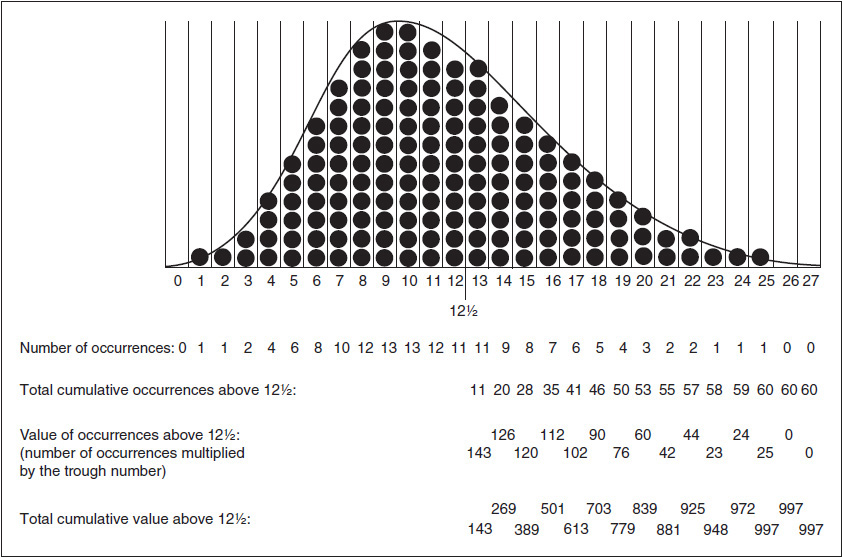

<!-- source:block 22ec35455019c40b -->

> [!quote]- English 45
> First, we must determine the value of all stock above 12½, that is, the value resulting from all occurrences that fall into troughs 13 through 27. The number of occurrences and the value of the occurrences in each trough are as follows:

首先，我们必须确定所有高于12½的股票的价值，即所有落入13至27谷的情况所产生的价值。每个谷中的发生次数和发生值如下：

<!-- source:block 1466fa2a78164f16 -->

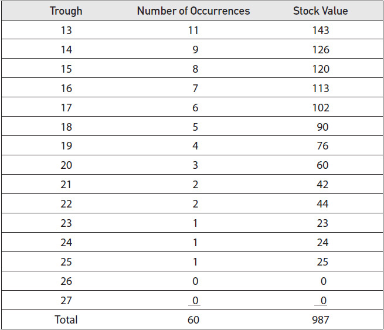

<!-- source:block 9f40f58cdc92ab0c -->

> [!quote]- English 46
> The average value of all stock above the exercise price of 12½ is the total value, 987, divided by the total number of occurrences, 153

高于行权价12½的所有股票的平均价值是总价值，987,除以总发生次数，153

<!-- source:block 321579dd5e84bd8f -->

> [!quote]- English 47
> 987/153 = 6.45

$$
987/153 = 6.45
$$

<!-- source:block 03b5257e66b40895 -->

> [!quote]- English 48
> Next, we need to determine the likelihood that we will pay the exercise price of 12½. There are 60 occurrences where the option is in the money (the stock price is above 12½), but there are a total of 153 occurrences. The likelihood that we will pay the exercise price is

接下来，我们需要确定支付12½行权价的可能性。有60次期权是价内的（股价高于12½），但总共有153次。我们支付行权价的可能性是

<!-- source:block d20a3bede0ca4a98 -->

> [!quote]- English 49
> 60/153 = 0.392

$$
60/153 = 0.392
$$

<!-- source:block 33b754db931ccda5 -->

> [!quote]- English 50
> The average payout resulting from exercise of the option 0.392 × 12½ = 4.90.

行权期权产生的平均支出0.392 × 12½ = 4.90。

<!-- source:block d6deefd147559064 -->

> [!quote]- English 51
> In the Black-Scholes model, the average value of all stock above the exercise price is given by *SertN*(*d*1), where *Sert* is the forward price of the stock. The average amount we will have to pay is given by *XN*(*d*2). The expected value for a call option is the difference between these two numbers

在 Black–Scholes 模型中，到期时高于行权价部分的标的平均价值写作 $Se^{r\tau}N(d_1)$，其中 $Se^{r\tau}$ 是股票的远期价格；届时平均支付额写作 $XN(d_2)$。看涨期权的到期预期价值就是两者之差：

<!-- source:block 2fcfe64f75c04bb2 -->

> [!quote]- English 52
> *SertN*(*d*1) – *XN*(*d*2) = 6.45 – 4.90 = 1.55

$$
Se^{r\tau}N(d_{1})-XN(d_{2})=6.45-4.90=1.55
$$

<!-- source:block 51b99bb7c793b866 -->

> [!quote]- English 53
> These terms are slightly different from the terms that appear in the model, *SN*(*d*1) and *Xe–rtN*(*d*2), but we will show shortly how *SertN*(*d*1) becomes *SN*(*d*1) and how *XN*(*d*2) becomes *Xe–rtN*(*d*2).

这些项与模型中的 $SN(d_1)$ 和 $Xe^{-r\tau}N(d_2)$ 略有不同；下文会说明，贴现后 $Se^{r\tau}N(d_1)$ 如何变为 $SN(d_1)$，而 $XN(d_2)$ 如何变为 $Xe^{-r\tau}N(d_2)$。

<!-- source:block b30086b0ba169e31 -->

> [!quote]- English 54
> We can confirm that 1.55 is the correct value (with slight rounding error) by returning to our original approach of adding up the intrinsic values multiplied by their probabilities (the number of occurrences divided by 153).

我们可以通过返回将内在值乘以其概率（出现次数除以153）相加的原始方法来确认1.55是正确的值（存在轻微的舍入误差）。

<!-- source:block 85e8b75b178b5b3f -->

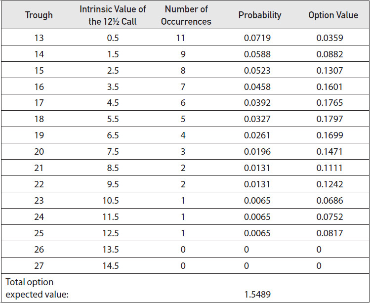

<!-- source:block a23c6bcaa290d4dd -->

> [!quote]- English 55
> This is essentially the approach taken by the Black and Scholes. The primary difference is that the Black-Scholes model, rather than using discrete outcomes as we did, assumes a continuous lognormal distribution.

这基本上是布莱克和斯科尔斯所采取的方法。主要的区别是，布莱克-斯科尔斯模型，而不是像我们一样使用离散的结果，假设一个连续的对数正态分布。

<!-- source:block 4f6d9d3805cca01e -->

## 正态与对数正态 / Normal and Lognormal Distributions

### n(x) 与 N(x) / n(x) and N(x)

<!-- source:block f29f05d89acca960 -->

> [!quote]- English 56
> Before continuing, it will be useful to define two important probability functions—*n*(*x*) and *N*(*x*). In this chapter and in previous discussions of volatility, we have often referred to the concept of a bell-shaped, or normal, distribution. Depending on the mean and standard deviation, there can be many different normal distributions, but *n*(*x*), the *standard normal distribution*, is perhaps the most common. It has a mean of 0 and a standard deviation of 1. The standard normal distribution, shown in Figure 18-2, also has one very useful characteristic: the total area under the curve adds up to exactly 1. That is, the curve represents 100 percent of all occurrences that form a true normal distribution.

在继续之前，定义两个重要的概率函数-n（x）和N（x）将很有用。在本章和之前关于波动率的讨论中，我们经常提到钟形分布或正态分布的概念。根据均值和标准差，可能有许多不同的正态分布，但n（x）（标准正态分布）可能是最常见的。它的平均值为0，标准差为1。图18-2所示的标准正态分布也有一个非常有用的特征：曲线下总面积总和正好为1。也就是说，该曲线代表了形成真正正态分布的所有事件的100%。

<!-- source:block 882bf168468c7e0a -->

*图18-2 n（x）-标准正态分布曲线，平均值= 0，标准差= 1。 / Figure 18-2 *n*(*x*)—the standard normal distribution curve with mean = 0 and standard deviation = 1.*

<!-- source:block 6b00ba3fc827dff2 -->

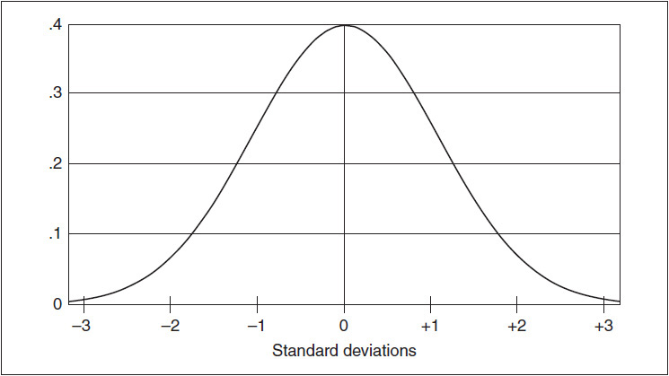

<!-- source:block 200a4bed7d132abe -->

> [!quote]- English 58
> Although the standard normal distribution takes in 100 percent of all occurrences, we may want to know what percent of the occurrences fall within a specific portion of the standard normal distribution. This is given by *N*(*x*), the *standard cumulative normal distribution function*. If *x* is some number of standard deviations, *N*(*x*) returns the probability of getting an occurrence less than *x* by calculating the area under the standard normal distribution curve between the values of –∞ and *x*, as shown in Figure 18-3. That is, *N*(*x*) tells us what percentage of all possible occurrences fall between –∞ and *x*. Obviously, *N*(+∞) must be 1.00 because 100 percent of all occurrences must fall between –∞ and +∞. And *N*(–∞) must be 0 because there can be no occurrences to the left of –∞. Because the normal distribution curve is symmetrical, with 50 percent of the occurrences falling to the left of 0 and 50 percent falling to the right, *N*(0) must equal 0.50. It also follows that the area under the curve between –∞ and *x* must be equal to the area under the curve between –*x* and +∞, resulting in this useful relationship

尽管标准正态分布涵盖了所有事件的100%，但我们可能想知道有多少百分比的事件属于标准正态分布的特定部分。这由标准累积正态分布函数N（x）给出。如果x是一定数量的标准差，则N（x）通过计算标准正态分布曲线下面积返回小于x的发生概率，如图18-3所示。也就是说，N（x）告诉我们所有可能发生的情况中有多大的百分比位于-Infinity和x之间。显然，N（+Infinity）必须为1.00，因为所有事件的100%必须介于-Infinity和+Infinity之间。N（-Infinity）必须为0，因为在-Infinity的左侧不可能出现。由于正态分布曲线是对称的，50%的事件落在0的左侧，50%的事件落在右侧，因此N（0）必须等于0.50。它还可以得出结论，-Infinity和x之间的曲线下面积必须等于-x和+Infinity之间的曲线下面积，从而产生这种有用的关系

<!-- source:block 4d8480e556094fa6 -->

*图18-3 N（x）——Infinity和x之间的标准正态分布曲线下面积。 / Figure 18-3 *N*(*x*)—the area under the standard normal distribution curve between –∞ and *x*.*

<!-- source:block 211899856755cbcd -->

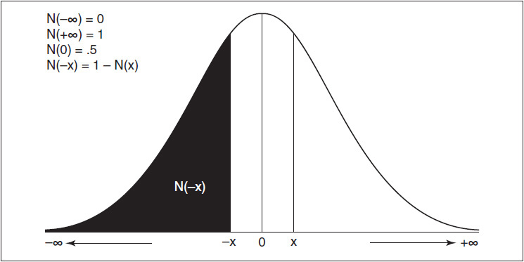

<!-- source:block 59376e96993d95bc -->

> [!quote]- English 60
> *N*(*x*) = 1 – *N*(–*x*)

$$
N(x) = 1 -\,N(-x)
$$

<!-- source:block 4122b2bac06be61d -->

> [!quote]- English 61
> The Black-Scholes model makes all calculations using the probabilities associated with a normal distribution. This may seem inconsistent with our assumption that the prices of an underlying contract are lognormally distributed because a normal distribution and a lognormal distribution are clearly not the same. However, by making some adjustments to the value of *x*, we can use *N*(*x*) to generate probabilities associated with a lognormal distribution.

Black-Scholes模型使用与正态分布相关的概率进行所有计算。这可能似乎与我们的假设不一致，即标的合约的价格服从对数正态分布，因为正态分布和对数正态分布显然不相同。然而，通过对x的值进行一些调整，我们可以使用N（x）来生成与对数正态分布相关的概率。

<!-- source:block 3b38fb424aa10fe4 -->

> [!quote]- English 62
> It will also be useful to define three numbers used to describe many common distributions:

定义用于描述许多常见分布的三个数字也很有用：

<!-- source:block a0b36d4f5a356a11 -->

> [!quote]- English 63
> ***Mode***. The peak of the distribution. The point at which the greatest number of occurrences take place.

**众数（Mode）**：分布的峰值，即出现次数最多的点。

<!-- source:block eb4774a94671a1e6 -->

> [!quote]- English 64
> ***Mean***. The balance point of the distribution. The point at which half the value of the occurrences fall to the left and half to the right.

**均值（Mean）**：分布的平衡点，也就是所有结果按概率加权后的平均值。

<!-- source:block a397a0805ffdfc16 -->

> [!quote]- English 65
> ***Median***. The point at which half the occurrences fall to the left and half to the right.

**中位数（Median）**：使一半事件落在左侧、另一半落在右侧的点。

<!-- source:block 9a7199615ed9649c -->

> [!quote]- English 66
> In a perfect normal distribution, all these points fall in the same place, exactly in the middle of the distribution. But consider the distribution in Figure 18-1. The mode, mean, and median of this distribution all fall at different points, as shown in figure Figure 18-4. The mode is approximately 9.3, the mean is approximately 12.7, and the median is approximately 10.5. To make the appropriate adjustments to a lognormal distribution so that we can use the probabilities associated with a normal distribution, we must locate these numbers.

在完全正态分布中，所有这些点都落在同一个地方，恰好在分布的中间。但请考虑图18-1中的分布。该分布的众数、均值和中位数均落在不同的点，如图18-4所示。众数约为9.3，平均值约为12.7，中位数约为10.5。为了对对数正态分布进行适当的调整，以便我们可以使用与正态分布相关的概率，我们必须找到这些数字。

<!-- source:block bb6c3e1714187f71 -->

*图18-4 / Figure 18-4*

<!-- source:block 4a2b6b3417834473 -->

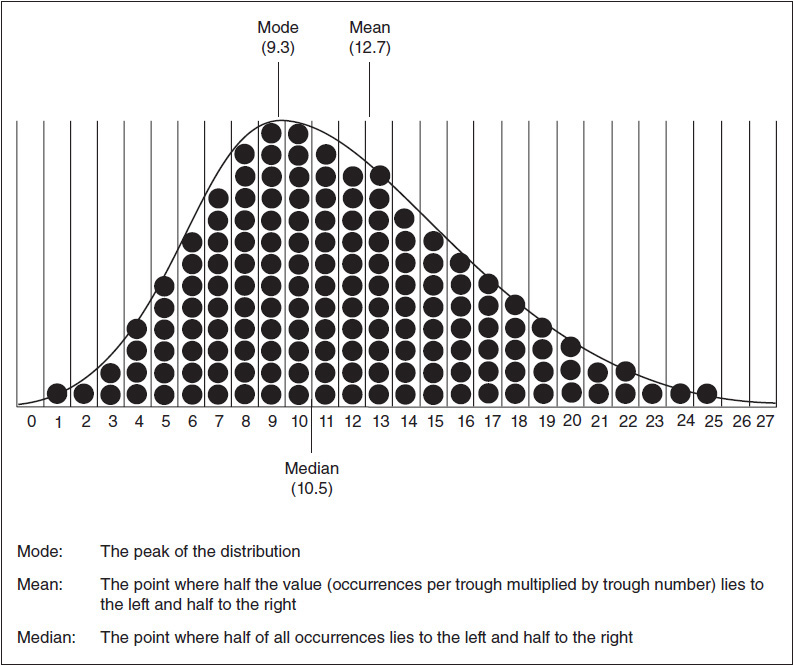

<!-- source:block 9ee17008ef344a48 -->

## 从对数正态分布到 d1 与 d2 / From Lognormal Distribution to d1 and d2

> [!quote]- English 68
> The Black-Scholes model begins by defining the relationship between the exercise price and the underlying price. In a normal distribution, this is simply *S* – *X*, but in a lognormal distribution, the relationship is

布莱克-斯科尔斯模型首先定义了行权价和标的价格之间的关系。在正态分布中，这只是S-X，但在对数正态分布中，关系是

<!-- source:block cc2b0cd8b3be281a -->

$$
\ln\!\left(\frac{S}{X}\right).
$$

<!-- source:block 4f033da361252e8a -->

> [!quote]- English 69
> If *S* > *X*, this value is positive, and the call is in the money; if *S* < *X*, the value is negative, and the call is out of the money.

如果S > X，则该值为正，且看涨价内;如果S < X，则该值为负，且看涨价外。

<!-- source:block 04e789321d086239 -->

> [!quote]- English 70
> Next, because options are valued off the forward price and the forward price is a function of interest rates, we must adjust this relationship by the interest component over the life of the option *rt*. This gives us2

接下来，由于期权是根据远期价格进行估值的，而远期价格是利率的函数，因此必须加入期权剩余期限内的利息成分 $r\tau$。于是得到[^ovp18-2]

<!-- source:block 05b902766d446e71 -->

$$
\ln\!\left(\frac{S}{X}\right)+r\tau.
$$

<!-- source:block f1a7e14c6ac23ba7 -->

> [!quote]- English 71
> The number of standard deviations associated with an occurrence depends on how far the occurrence is from the mean of the distribution. In a normal distribution, the mean, like the mode, is located in the exact center of the distribution. But in Figure 18-4, which approximates a lognormal distribution, with its elongated right tail, we can see that the mean must be somewhere to the right of the mode. How far to the right? This depends on the standard deviation of the lognormal distribution. The higher the standard deviation, the longer the right tail, and consequently, the further to the right we must shift the mean. Mathematically, the shift is equal to σ*2t*/2. Adding this adjustment gives us

一个结果对应多少个标准差，取决于该结果偏离分布均值的程度。在正态分布中，均值与众数一样位于分布正中心。但图 18-4 近似对数正态分布，具有拉长的右尾，因而均值必然位于众数右侧。向右偏移多远取决于对数正态分布的标准差：标准差越大，右尾越长，均值就必须向右移得越远。从数学上说，这一偏移量等于 $\sigma^2\tau/2$。加入这项调整后得到：

<!-- source:block 1af3b871c9a4c441 -->

$$
\ln\!\left(\frac{S}{X}\right)+r\tau+\frac{\sigma^2\tau}{2}.
$$

<!-- source:block 1d96f5950ec64156 -->

> [!quote]- English 72
> Combining the interest-rate and volatility components gives us the numerator for *d*1

结合利率和波动率成分，我们得到了d1的分子

<!-- source:block 8b4a459263700a76 -->

$$
d_1=
\frac{
\ln(S/X)+\left(r+\tfrac12\sigma^2\right)\tau
}{\sigma\sqrt\tau}.
$$

<!-- source:block 58466d1a0b5a8b02 -->

<!-- source:block 05096bbd2b952421 -->

> [!quote]- English 73
> In the equation shown in Figure 18-5, the calculation of *d*1 may seem somewhat complicated, but it is really just a collection of adjustments to the exercise price and underlying price that enable us to use a cumulative normal distribution function to calculate probabilities.

在图18-5所示的方程中，d1的计算可能看起来有些复杂，但它实际上只是对行权价和标的价格的调整的集合，使我们能够使用累积正态分布函数来计算概率。

<!-- source:block c556c5b6cbdb1a71 -->

*图18-5 / Figure 18-5*

<!-- source:block 2facf300a3dcaf06 -->

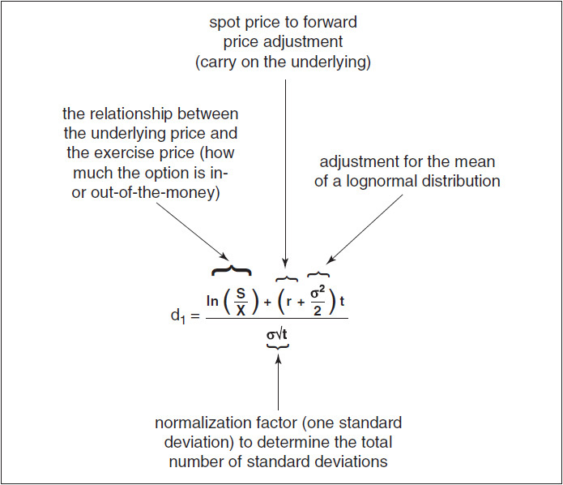

<!-- source:block 84909915b47e82ec -->

> [!quote]- English 75
> Once we have determined the value of *d*1, multiplying the forward price of the stock by *N*(*d*1) gives us the average value of all stock above the exercise price at expiration.

一旦我们确定了d1的值，将股票的远期价格乘以N（d1），我们就得到了所有股票在到期时高于行权价的平均值。

<!-- source:block 0e04bea492c83c20 -->

<!-- source:block 3fe76d0d18fedbc5 -->

$$
d_2=d_1-\sigma\sqrt\tau
=\frac{
\ln(S/X)+\left(r-\tfrac12\sigma^2\right)\tau
}{\sigma\sqrt\tau}.
$$

<!-- source:block e34fd950401672c6 -->

> [!quote]- English 76
> The value *N*(*d*2) uses the median to calculate the probability of the option being in the money at expiration and therefore being exercised. Multiplying this probability by the exercise price gives us the average amount we will pay at expiration if we own the option

值N（d2）使用中位数来计算期权在到期时价内并因此被行权的可能性。将此概率乘以行权价，即可得出如果我们拥有期权，我们将在到期时支付的平均金额

<!-- source:block f8e1741625618b5b -->

> [!quote]- English 77
> *XN*(*d*2)

$$
XN(d_{2})
$$

<!-- source:block 4d6c1cda166ddbb9 -->

> [!quote]- English 78
> Taking the average value of the stock we will receive at expiration and subtracting the average amount we will pay at expiration gives us the expected value for the call

取到期时我们将收到的股票的平均价值，减去到期时我们将支付的平均金额，即可得到看涨期权的预期价值

<!-- source:block d185a9ec4802c71a -->

> [!quote]- English 79
> *SertN*(*d*1) – *XN*(*d*2)

$$
Se^{r\tau}N(d_{1})-XN(d_{2})
$$

<!-- source:block df5db672a68d292e -->

> [!quote]- English 80
> There is still one final step in calculating the theoretical value of a call option, and this step explains how the terms *S–rtN*(*d*1) and *XN*(*d*2) become *SN*(*d*1) and *Xe–rtN*(*d*2), which is the way they appear in the Black-Scholes model. The expression *SertN*(*d*1) – *XN*(*d*2) represents the expected value of the option at expiration. If we must pay for the option today, the theoretical value is the present value of the expected value. Multiplying the expected value by *e–rt* yields the familiar form of the Black-Scholes model

计算看涨期权理论价值还差最后一步：说明 $Se^{r\tau}N(d_1)$ 与 $XN(d_2)$ 如何变成模型中的 $SN(d_1)$ 与 $Xe^{-r\tau}N(d_2)$。前者之差是期权到期时的预期价值；今天支付的理论价值应是该预期价值的现值，因此再乘以 $e^{-r\tau}$。

<!-- source:block 33a9c6615f064f0a -->

> [!quote]- English 81
> *C =*[*SertN*(*d*1) – *XN*(*d*2)]*e–rt = SN*(*d*1) – *Xe–rtN*(*d*2)

$$
C=\left[Se^{r\tau}N(d_1)-XN(d_2)\right]e^{-r\tau}
=SN(d_1)-Xe^{-r\tau}N(d_2).
$$

<!-- source:block f8c73266aa262aae -->

## 持有成本与模型变体 / Carry and Model Variants

> [!quote]- English 82
> In the original Black-Scholes model, the underlying contract was assumed to be a non-dividend-paying stock. However, since its introduction, the model has been extended to evaluate options on other types of underlying instruments. This is most commonly done by including an adjustment factor *b* that varies depending on the type of underlying instrument and the settlement procedure for the options. If *r* is the domestic interest rate and *rf* is the foreign interest rate, then

原始 Black–Scholes 模型假设标的是不派息股票。后来模型被扩展到其他标的工具，常见做法是引入持有成本参数 $b$；其取值取决于标的类型与期权结算方式。若 $r$ 为本国利率、$r_f$ 为外国利率，则常见取值如下：

<!-- source:block 169376c279fc721a -->

| 持有成本参数 | 常见模型与标的 |
|---|---|
| $b=r$ | 原始 Black–Scholes：不派息股票期权 |
| $b=0$ | Black：期货期权 |
| $b=r-r_f$ | Garman–Kohlhagen：外汇期权，其中 $r_f$ 为外国利率 |

<!-- source:block 8a1f2cf83354329c -->

> [!quote]- English 83
> The complete Black-Scholes model, with variations and sensitivities, is given in Figure 18-6.

图18-6给出了完整的布莱克-斯科尔斯模型（含变化和灵敏度）。

<!-- source:block 15d5674fc216333c -->

*图 18-6 Black–Scholes 模型（原图公式已改为 LaTeX）。 / Figure 18-6 The Black-Scholes model, reset in LaTeX.*

<!-- source:block dc449a0d3e4efa07 -->

### 广义 Black–Scholes 定价公式

设 $S$ 为现货或标的价格，$X$ 为行权价，$\tau$ 为距到期时间（年），$r$ 为本国无风险利率，$b$ 为持有成本率，$\sigma$ 为年化波动率，则

$$
\begin{aligned}
C&=Se^{(b-r)\tau}N(d_1)-Xe^{-r\tau}N(d_2),\\
P&=Xe^{-r\tau}N(-d_2)-Se^{(b-r)\tau}N(-d_1),
\end{aligned}
$$

其中

$$
d_1=
\frac{\ln(S/X)+\left(b+\tfrac12\sigma^2\right)\tau}
{\sigma\sqrt\tau},
\qquad
d_2=
\frac{\ln(S/X)+\left(b-\tfrac12\sigma^2\right)\tau}
{\sigma\sqrt\tau}
=d_1-\sigma\sqrt\tau.
$$

常见取值为：$b=r$ 对应不派息股票；$b=0$ 对应 Black 期货期权模型；$b=r-r_f$ 对应 Garman–Kohlhagen 外汇模型。连续股息率为 $q$ 的股票可令 $b=r-q$。若股息是离散现金流，可将现货价格替换为

$$
S_{\mathrm{adj}}
=S-\sum_i D_i e^{-r\tau_i},
$$

其中 $D_i$ 是到期前第 $i$ 笔股息，$\tau_i$ 是距该笔股息支付日的时间。

### 传统敏感度公式

以下公式统一使用剩余期限 $\tau$ 与持有成本 $b$。令 $n(\cdot)$ 为标准正态密度，$N(\cdot)$ 为标准正态累积分布函数。时间衰减指标统一按日历时间定义：

$$
\Theta_{\mathrm{calendar}}
=\frac{\partial V}{\partial u}
=-\frac{\partial V}{\partial\tau}.
$$

$$
\begin{aligned}
\Delta_C&=e^{(b-r)\tau}N(d_1),\\
\Delta_P&=e^{(b-r)\tau}\left[N(d_1)-1\right],\\[4pt]
\Gamma_C=\Gamma_P
&=\frac{e^{(b-r)\tau}n(d_1)}{S\sigma\sqrt\tau},\\[4pt]
\mathrm{Vega}_C=\mathrm{Vega}_P
&=Se^{(b-r)\tau}n(d_1)\sqrt\tau.
\end{aligned}
$$

$$
\begin{aligned}
\Theta_{C,\mathrm{calendar}}
&=-\frac{Se^{(b-r)\tau}n(d_1)\sigma}{2\sqrt\tau}
-(b-r)Se^{(b-r)\tau}N(d_1)
-rXe^{-r\tau}N(d_2),\\[4pt]
\Theta_{P,\mathrm{calendar}}
&=-\frac{Se^{(b-r)\tau}n(d_1)\sigma}{2\sqrt\tau}
+(b-r)Se^{(b-r)\tau}N(-d_1)
+rXe^{-r\tau}N(-d_2).
\end{aligned}
$$

当 $b\ne0$ 时，

$$
\rho_C=\tau Xe^{-r\tau}N(d_2),
\qquad
\rho_P=-\tau Xe^{-r\tau}N(-d_2).
$$

在原书的 $b=0$ 结算口径下，$\rho_C=-\tau C$、$\rho_P=-\tau P$。外国利率或连续收益率敏感度为

$$
\Phi_C=-\tau Se^{(b-r)\tau}N(d_1),
\qquad
\Phi_P=\tau Se^{(b-r)\tau}N(-d_1),
$$

而弹性为

$$
\Lambda_C=\Delta_C\frac{S}{C},
\qquad
\Lambda_P=\Delta_P\frac{S}{P}.
$$

> [!note] 报价单位
> 上式 $\Theta_{\mathrm{calendar}}$ 是对一年日历时间推进的敏感度，换算为自然日近似值时除以 $365$。Vega 与 Rho 是对完整小数变化的导数；若交易系统按 1 个百分点报价，通常还需除以 $100$。不同系统的时间与结算口径可能不同，使用前必须核对定义。

<!-- source:block aba884c1481295b1 -->

### 高阶敏感度公式

以下时间敏感度继续使用日历时间口径：

$$
\begin{aligned}
\mathrm{Charm}_{\mathrm{calendar}}
&=\frac{\partial\Delta}{\partial u}
=-\frac{\partial\Delta}{\partial\tau},\\
\mathrm{Color}_{\mathrm{calendar}}
&=\frac{\partial\Gamma}{\partial u}
=-\frac{\partial\Gamma}{\partial\tau},\\
\mathrm{VegaDecay}_{\mathrm{calendar}}
&=\frac{\partial\mathrm{Vega}}{\partial u}
=-\frac{\partial\mathrm{Vega}}{\partial\tau}.
\end{aligned}
$$

$$
\mathrm{Vanna}
=-e^{(b-r)\tau}n(d_1)\frac{d_2}{\sigma}.
$$

$$
\begin{aligned}
\mathrm{Charm}_{C,\mathrm{calendar}}
&=-e^{(b-r)\tau}
\left[
n(d_1)\left(\frac{b}{\sigma\sqrt\tau}-\frac{d_2}{2\tau}\right)
+(b-r)N(d_1)
\right],\\[4pt]
\mathrm{Charm}_{P,\mathrm{calendar}}
&=-e^{(b-r)\tau}
\left[
n(d_1)\left(\frac{b}{\sigma\sqrt\tau}-\frac{d_2}{2\tau}\right)
-(b-r)N(-d_1)
\right].
\end{aligned}
$$

$$
\mathrm{Speed}
=-\frac{\Gamma}{S}
\left(1+\frac{d_1}{\sigma\sqrt\tau}\right).
$$

$$
\mathrm{Color}_{\mathrm{calendar}}
=\Gamma\left[
r-b
+\frac{bd_1}{\sigma\sqrt\tau}
+\frac{1-d_1d_2}{2\tau}
\right].
$$

$$
\mathrm{Volga}
=\mathrm{Vega}\frac{d_1d_2}{\sigma}.
$$

$$
\mathrm{VegaDecay}_{\mathrm{calendar}}
=\mathrm{Vega}\left[
r-b
+\frac{bd_1}{\sigma\sqrt\tau}
-\frac{1+d_1d_2}{2\tau}
\right].
$$

$$
\mathrm{Zomma}
=\Gamma\frac{d_1d_2-1}{\sigma}.
$$

这些公式分别对应[[Vanna]]、[[Charm]]、[[Speed]]、[[Color]]、[[Volga（Vomma）|Volga / Vomma]]、[[Vega Decay|Vega decay]]与[[Zomma]]。本节所有带 `calendar` 下标的指标均表示 $u$ 增加时的变化；若改为对剩余期限 $\tau$ 求导，符号整体相反。

<!-- source:block c4c9fb02140d6707 -->

## 一个实用的近似式 / A Useful Approximation

<!-- source:block 31e50ba960d99a51 -->

> [!quote]- English 85
> A trader might wonder whether it is possible to calculate a Black-Scholes value without using a computer. In general, the answer is no; the computations are just too complex. However, there is one type of approximation that many traders are able to make without too much difficulty.

交易者可能想知道是否可以在不使用计算机的情况下计算布莱克-斯科尔斯值。一般来说，答案是否定的;计算太复杂了。然而，有一种类型的近似是许多交易者能够不太困难地做出的。

<!-- source:block 66559af5b181c685 -->

对于恰好处于远期平值、期限为一年、利率为 $0$ 且波动率为 $1\%=0.01$ 的期权，

$$
d_1=\frac{0.01^2/2}{0.01}=0.005,
\qquad
d_2=\frac{-0.01^2/2}{0.01}=-0.005.
$$

> [!note] 公式校正
> 原书公式图片把 $d_2$ 的最终结果排成了正的 $0.005$；由负分子及下文 $N(d_2)=0.498005$ 可知，正确结果应为 $-0.005$。

<!-- source:block e604338f41e2291c -->

<!-- source:block a253c597b4233e85 -->

> [!quote]- English 86
> If we calculate *N*(*d*1) and *N*(*d*2), we find that

如果我们计算N（d1）和N（d2），我们发现，

<!-- source:block 6281ef95cf58b9e7 -->

> [!quote]- English 87
> *N*(*d*1) = 0.501995 and *N*(*d*2) = 0.498005

$$
N(d_{1}) = 0.501995 \text{and}\,N(d_{2}) = 0.498005
$$

<!-- source:block 499dcae136bf367a -->

> [!quote]- English 88
> Because the interest rate is 0, the value of the call option must be

由于利率为0，因此看涨期权的价值必须为

<!-- source:block 0c9a3e22ee2860b4 -->

> [!quote]- English 89
> (*S* × 0.501995) – (*X* × 0.498005)

$$
(S\,\times 0.501995) - (X\,\times 0.498005)
$$

<!-- source:block 7be8238e893fe57c -->

> [!quote]- English 90
> If *X* = *S*, the value of the call is

如果X = S，则看涨期权的值为

<!-- source:block 3e6149f814eab8a0 -->

> [!quote]- English 91
> *X* × (0.501995 – 0.498005) = *X* × 0.003990

$$
X\,\times (0.501995 - 0.498005) =\,X \times 0.003990
$$

<!-- source:block 25c2181af7c989d6 -->

> [!quote]- English 92
> What does this number tell us? For a one-year European option that is exactly at the forward (i.e., the forward price is equal to the exercise price), for each percentage point of volatility, the expected value for the option is equal to the exercise price multiplied by 0.00399. If the exercise price is 100, the expected value is 0.00399 × 100 = 0.399 for each percentage point in volatility.

这个数字告诉我们什么？对于恰好处于前瞻位置的一年期欧洲期权（即，远期价格等于行权价），对于每一个百分点的波动率，期权的预期价值等于行权价乘以0.00399。如果行权价为100，则波动率每一个百分点的预期值为0.00399 × 100 = 0.399。

<!-- source:block 1916d398d0fbcda2 -->

> [!quote]- English 93
> Why doesn’t this value change as we increase volatility? Although the first percentage point of volatility may be worth 0.00399, perhaps the second percentage point is worth either more or less than 0.00399. But recall from Chapter 9 that the vega of an at-the-money option is relatively constant with respect to changes in volatility. Therefore, at a volatility of 20 percent, the value of a 100 call should be

为什么这个值不会随着我们增加波动率而改变？尽管第一个百分点的波动率可能值0.00399，但第二个百分点的波动率可能大于或小于0.00399。但回想一下第9章，平值期权的Vega值对于波动率的变化来说相对恒定。因此，在波动率为20%时，100看涨期权的价值应该是

<!-- source:block 4dd1b67fa7c9cffe -->

> [!quote]- English 94
> 20 × 100 × 0.00399 = 7.98

$$
20 \times 100 \times 0.00399 = 7.98
$$

<!-- source:block e6238903ee2c5cab -->

> [!quote]- English 95
> At a volatility of 35 percent, the value should be

波动率为35%时，该值应为

<!-- source:block 69dfcf7b356abda3 -->

> [!quote]- English 96
> 35 × 100 × 0.00399 = 13.965

$$
35 \times 100 \times 0.00399 = 13.965
$$

<!-- source:block a8bb5422daaaa623 -->

> [!quote]- English 97
> We also know that the theoretical value of an at-the-forward option is proportional to its exercise price. If the value of a one-year 100 call at a volatility of 20 percent is 7.98, under the same conditions, the value of an at-the-forward 50 call should be

我们还知道，远期期权的理论价值与其行权价成正比。如果波动率为20%的一年期100看涨期权的价值为7.98，则在相同条件下，远期50看涨期权的价值应为

<!-- source:block b405461593080bcd -->

> [!quote]- English 98
> 20 × 50 × 0.00399 = 3.99

$$
20 \times 50 \times 0.00399 = 3.99
$$

<!-- source:block cdf95ae39a3b43a9 -->

> [!quote]- English 99
> and the value of a 125 call should be

125看涨期权的值应该是

<!-- source:block e9e60d97f6d6c478 -->

> [!quote]- English 100
> 20 × 125 × 0.00399 = 9.975

$$
20 \times 125 \times 0.00399 = 9.975
$$

<!-- source:block e7851721422209d6 -->

> [!quote]- English 101
> We can further refine our approximation if we note that an at-the-money option is made up entirely of time value and that the time value of an option is proportional to the square root of time. If a one-year 100 call is worth 7.98 at a volatility of 20 percent, the same call with six months to expiration (*t* = 0.5) must be worth

如果我们注意到平值期权完全由时间价值组成，并且期权的时间价值与剩余期限的平方根成正比，我们可以进一步完善这一近似。如果一年期 100 看涨期权的价值为 7.98，波动率为 20%，那么距离到期六个月（$\tau=0.5$）的同一看涨期权价值应近似为

<!-- source:block f53c909d21af72f6 -->

$$
7.98\sqrt{0.5}
=7.98\times0.707
=5.64.
$$

<!-- source:block 65ddade3361bd1ff -->

> [!quote]- English 102
> Lastly, this is an approximation for the expected value. To determine the theoretical value, we must discount by interest to get the present value. Putting everything together, for an exactly at-the-forward European option, the expected value at expiration is approximately3

最后，这是预期值的近似值。为了确定理论价值，我们必须按利息贴现才能得到现值。综合考虑，对于准确的远期欧式期权来说，到期时的预期价值大约为[^ovp18-3]

<!-- source:block 278ac5a70b3235bf -->

$$
\operatorname{EV}_{T}
\approx
X\,(100\sigma)\sqrt\tau\,(0.00399),
$$

其中 $\sigma$ 以小数表示，因此 $100\sigma$ 是波动率百分点数。

<!-- source:block f0f7d02d1647127e -->

> [!quote]- English 103
> and the theoretical value is4

理论值为[^ovp18-4]

<!-- source:block cec6d7e3c9d420b3 -->

$$
V_0
\approx
\frac{X\,(100\sigma)\sqrt\tau\,(0.00399)}{1+r\tau}.
$$

<!-- source:block af53bfdf6251d232 -->

> [!quote]- English 104
> This approximation applies to both calls and puts because under put-call parity, an exactly at-the-forward European call and put must have the same value.

这种逼近适用于看涨和看跌，因为在看涨-看跌平价下，完全向前的欧洲看涨和看跌必须具有相同的值。

<!-- source:block 7edefeca75d2093c -->

> [!quote]- English 105
> For example, if volatility is 18 percent, what is the expected value of a three-month (*t* = ¼) at-the-forward option with an exercise price of 65?

例如，如果波动率为 $18\%$，那么行权价为 $65$ 的三个月期（$\tau=\tfrac14$）远期平值期权的预期价值是多少？

<!-- source:block c1ef8b33c817d540 -->

$$
65\times0.18\times100\times\sqrt{\frac14}\times0.00399
=65\times18\times\frac12\times0.00399
\approx2.33.
$$

<!-- source:block 4f5ec3329c9b8642 -->

> [!quote]- English 106
> If interest rates are 4 percent, the option’s theoretical value is approximately

如果利率为4%，期权的理论价值约为

<!-- source:block 15f0eba09bc5670e -->

$$
\frac{2.33}{1+0.04/4}
=\frac{2.33}{1.01}
\approx2.31.
$$

<!-- source:block e4356502cb6e2c66 -->

> [!quote]- English 107
> Although this is a commonly used approximation, it is only an approximation. As we increase time and volatility, the approximation will actually be slightly greater than the true Black-Scholes value. This is because the vega of an at-the-money option declines slightly as we increase volatility, and this decline is magnified with greater time to expiration. This can be seen in Figure 9-14: the vega of an at-the-money option, although relatively constant with respect to changes in volatility, does in fact decline slightly with increasing volatility. If, in our example, we raise the volatility to 40 percent and increase the time to expiration to two years, the approximation for the expected value is

虽然这是常用的近似值，但它只是一个近似值。随着时间和波动率的增加，逼近值实际上会略大于真实的布莱克-斯科尔斯值。这是因为随着波动率的增加，平值期权的Vega会略有下降，而这种下降随着到期时间的延长而被放大。这可以从图9-14中看出：平值期权的Vega，尽管相对于波动率的变化相对稳定，但事实上确实随着波动率的增加而略有下降。在我们的例子中，如果我们将波动率提高到40%并将到期时间提高到两年，那么预期值的近似值是

<!-- source:block bc4e1e924b426836 -->

$$
65\times40\times\sqrt2\times0.00399
=65\times40\times1.414\times0.00399
\approx14.67.
$$

<!-- source:block 0c36ed5923a402f4 -->

> [!quote]- English 108
> while the actual Black-Scholes expected value is 14.48.

而布莱克-斯科尔斯的实际预期值为14.48。

<!-- source:block 207665579b4bf6cf -->

> [!quote]- English 109
> The reader who is familiar with the characteristics of a standard normal distribution may already have recognized the significance of the value 0.00399. Referring to Figure 18-2, for a standard normal distribution with a mean of 0 and standard deviation of 1, the peak of the distribution has a value of approximately 0.399 (more exactly, 0.398942). Because a volatility of 1 percent represents 1/100 of a standard deviation, the value from the model is 0.399/100 = 0.00399.

熟悉标准正态分布特征的读者可能已经认识到值0.00399的重要性。参见图18-2，对于平均值为0、标准差为1的标准正态分布，分布的峰值的值约为0.399（更准确地说，为0.398942）。由于1%的波动率代表标准差的1/100，因此模型的值为0.399/100 = 0.00399。

<!-- source:block 9434b9a6bfe9f102 -->

## Delta（标的价格敏感度） / The Delta

<!-- source:block 40adefe6452fd054 -->

> [!quote]- English 110
> In the Black-Scholes model, the delta of an option is equal to *N*(*d*1). When we defined the delta in Chapter 7, we suggested that the delta is approximately the probability that an option will finish in the money. But we now know that the true probability that an option will finish in the money is equal to *N*(*d*2). Although *N*(*d*1) and *N*(*d*2) are often very close in value, especially for short-term options, *N*(*d*1) (the delta) is always larger than *N*(*d*2).

在原始无股息 Black–Scholes 模型中，看涨期权的 Delta 等于 $N(d_1)$。第 7 章曾把 Delta 粗略解释为期权到期价内的概率；更准确地说，在模型的风险中性测度下，看涨期权到期价内概率为 $N(d_2)$。它不是现实测度下的“真实概率”。$N(d_1)$ 与 $N(d_2)$ 对短期期权往往很接近，但 $N(d_1)$ 始终大于 $N(d_2)$。

<!-- source:block f7f318553f4d2078 -->

> [!quote]- English 111
> For a call option that is at the forward, the delta will be greater than 50, even if only slightly. Because we know that

对于远期平值看涨期权，看涨 Delta 会略大于 $0.50$；按原书采用的 0–100 报价标度，就是略大于 50。又因为

<!-- source:block a09f27104e707996 -->

> [!quote]- English 112
> Put delta = call delta – 100

$$
\Delta_P=\Delta_C-1
\qquad
\left(\text{0--100 报价标度：put delta = call delta - 100}\right).
$$

<!-- source:block bfa079c2547c2e97 -->

> [!quote]- English 113
> the delta of a put will be less than –50 in absolute value. This means that an at-the-forward straddle will have a positive delta. If a call and put have the same exercise price, at what forward price will the delta of the call and put be identical? This will occur when *d*1 is exactly 0. A straddle will therefore be exactly delta neutral when

看跌 Delta 因而介于 $-0.50$ 与 $0$ 之间（其绝对值小于 $0.50$），所以远期平值跨式的净 Delta 为正。对于执行价相同的看涨与看跌期权，当二者 Delta 的绝对值相等时，跨式为 Delta 中性；这等价于 $d_1=0$，即

<!-- source:block 6fd72a16b80e0925 -->

$$
\ln\!\left(\frac{S}{X}\right)
+\left(r+\frac{\sigma^2}{2}\right)\tau
=0.
$$

<!-- source:block 08d4407781358a6e -->

> [!quote]- English 114
> Solving, for *S*, we get

解出此时的即期价格 $S_*$，得到

<!-- source:block 9abebbaa9c20adfc -->

> [!quote]- English 115
> *S* = *Xe*–[*r*+(σ2/2)]t

$$
S_*=Xe^{-\left(r+\tfrac12\sigma^2\right)\tau}.
$$

<!-- source:block 48585a5ea2698e3e -->

> [!quote]- English 116
> For a straddle to be exactly delta neutral, the forward price will be less than the exercise price by a factor of

原文随后把这一带有利率项的表达式称为“远期价格”因子；严格地说，它是即期价格与执行价之比。按无股息远期关系 $F=S e^{r\tau}$ 换算后，利率项抵消：

<!-- source:block 0ddcf27bab9128f3 -->

> [!quote]- English 117
> *e*–[*r*+σ2/2)]*t*

$$
\frac{S_*}{X}=e^{-\left(r+\tfrac12\sigma^2\right)\tau},
\qquad
\frac{F_*}{X}=e^{-\tfrac12\sigma^2\tau}.
$$

<!-- source:block 701316ab10279c47 -->

> [!quote]- English 118
> As time or volatility increases, the forward price at which the straddle is delta neutral drops further and further below the exercise price—the call goes further out of the money, and the put goes further into the money. With a 0 interest rate, the underlying price at which a 100 straddle will be exactly delta neutral is shown in Figure 18-7. At very low volatilities, the delta-neutral price is close to 100. But, at very high volatilities and with increasing time to expiration, the delta-neutral price is well below 100.

随着剩余期限或波动率增加，Delta 中性远期价格相对执行价的比例 $F_*/X$ 会进一步下降——看涨期权更价外，看跌期权更价内。当利率为 0 时，即期价与远期价相同，图 18-7 展示了执行价为 100 的跨式在不同波动率和期限下的 Delta 中性标的价格。波动率很低时，该价格接近 100；波动率很高且剩余期限较长时，该价格会明显低于 100。

<!-- source:block eaac2ae12f697922 -->

*图18-7跨式的标的价格完全是Delta中性的。 / Figure 18-7 The underlying price at which a straddle is exactly delta-neutral.*

<!-- source:block 43e84c681642a61d -->

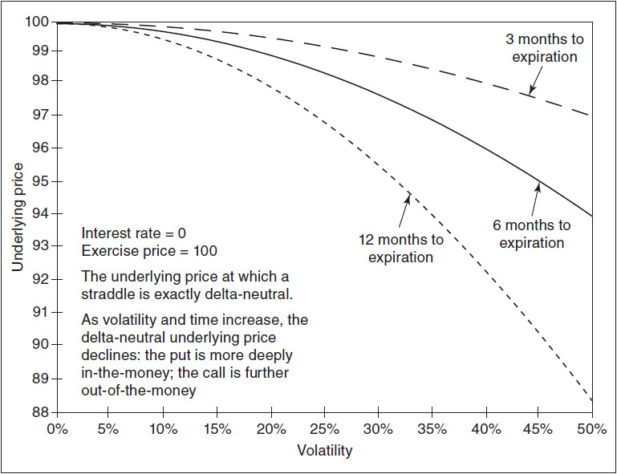

<!-- source:block fbbf754dacbe9782 -->

## Theta（时间敏感度） / The Theta

<!-- source:block fd60daa304e09ea3 -->

> [!quote]- English 120
> Of all the sensitivities derived from the Black-Scholes model, the formula for theta is probably the most complex. Depending on the underlying instrument and the option settlement procedure, the passage of time affects option values in three different ways. First, there is a decay in the option’s volatility value—as time passes, the distribution of possible prices at expiration becomes more restricted. This is represented by the first term in the theta formula

在布莱克-斯科尔斯模型推导出的所有灵敏度中，Theta的公式可能是最复杂的。根据标的工具和期权结算程序，时间的推移以三种不同的方式影响期权价值。首先，期权的波动率值会下降——随着时间的推移，到期时可能价格的分布变得更加限制。这由Theta公式中的第一项表示

<!-- source:block e22da4b3daffa6d7 -->

$$
-\frac{Se^{(b-r)\tau}n(d_1)\sigma}{2\sqrt\tau}.
$$

<!-- source:block fd999edfebfa714b -->

> [!quote]- English 121
> Second, for an underlying contract such as stock, the spot price is assumed to move toward the forward price as time passes. This is represented by the second term in the theta formula

其次，对于股票等标的合约，假设现货价格随着时间的推移而向远期价格移动。这由Theta公式中的第二项表示

<!-- source:block a9d154492603d321 -->

> [!quote]- English 122
> (*b* – *r*)*Se*(*b–r*)*t* *N*(*d*1

$$
(b-r)Se^{(b-r)\tau}N(d_1).
$$

<!-- source:block 753371a3f601d1a4 -->

> [!quote]- English 123
> Finally, the present value of the option’s expected value at expiration is changing as time passes. This appears in the formula as

最后，期权到期时预期价值的现值会随着时间的推移而变化。这在公式中出现为

<!-- source:block 789ebb9e8b933eb8 -->

> [!quote]- English 124
> *rXe*–rt *N*(*d*2)

$$
rXe^{-r\tau}\,N(d_{2}).
$$

<!-- source:block fbed0d2c51b57053 -->

> [!quote]- English 125
> We know from put-call parity that the volatility value for a call and put with identical contract specifications must be the same. The sign of the first component, the decay in volatility value, must therefore be the same for calls and puts. The other two theta components depend on the effects of interest rates and may be either positive or negative depending on the settlement procedure and whether the option is a call or a put.

我们从看涨-看跌平价中知道，具有相同合约规格的看涨和看跌的波动率值必须相同。因此，第一个成分（波动率值的衰减）的符号对于看涨和看跌期权来说必须相同。其他两个Theta成分取决于利率的影响，并且可以是正的或负的，具体取决于结算程序以及期权是看涨还是看跌。

<!-- source:block e0b2f77eaba37a04 -->

> [!quote]- English 126
> The decay in volatility value is almost always more important than interest considerations and will tend to dominate the theta calculation. If interest rates are 0 or if options on futures are subject to futures-type settlement, the second and third components in the theta formula will be 0, leaving only the volatility decay component. In this case, the volatility decay component, sometimes referred to as the *driftless theta*, will be the sole factor that determines how an option’s theoretical value changes as time passes.

波动率值的衰减几乎总是比利息考虑更重要，并且往往会主导Theta计算。如果利率为0或期货期权须接受期货型结算，则Theta公式中的第二个和第三个分量将为0，只剩下波动率衰减分量。在这种情况下，波动率衰减成分（有时称为无漂移Theta）将是决定期权理论价值如何随着时间的推移而变化的唯一因素。

<!-- source:block 42f2d1db02ef00e2 -->

## Gamma、Theta 与 Vega 的最大值 / Maximum Gamma, Theta, and Vega

<!-- source:block de22e829ca5e6db6 -->

> [!quote]- English 127
> In Chapter 7, we suggested that an option has its maximum gamma, theta, and vega when it is exactly at the money. But, just as we tend to assign a delta of 50 to an at-the-money option, this is only an approximation. Where does the maximum gamma, theta, and vega really occur?

在第7章中，我们建议当期权恰好在货币上时，它的Gamma、Theta和Vega具有最大值。但是，正如我们倾向于为平值的期权分配50的Delta一样，这只是一个近似值。最大的Gamma、Theta和Vega真正发生在哪里？

<!-- source:block 2e77623821f1456e -->

> [!quote]- English 128
> Without going into the mathematical derivation, we can summarize the critical underlying prices *S* as follows:

在不深入数学推导的情况下，我们可以将关键标的价格S总结如下：

<!-- source:block 080e5482bfde7485 -->

| 临界条件 | 对应标的价格 $S$ |
|---|---:|
| $d_1=0$（原始股票模型中 Delta 为 $0.50$，书中记作 50） | $S=Xe^{-(b+\sigma^2/2)\tau}$ |
| Gamma 最大 | $S=Xe^{-(b+3\sigma^2/2)\tau}$ |
| 无漂移 Theta 的绝对值最大 | $S=Xe^{-(b-\sigma^2/2)\tau}$ |
| Vega 最大 | $S=Xe^{-(b-\sigma^2/2)\tau}$ |

第一行的精确条件是 $d_1=0$；在广义模型中，$\Delta_C=e^{(b-r)\tau}N(d_1)$，因此只有 $b=r$ 时才恰好等于 $0.50$。Theta 一行指前文的无漂移（波动率衰减）分量；若把利率与持有成本项也计入完整的日历 Theta，其极值位置通常还取决于期权类型和结算口径。

<!-- source:block 9c6960de408f8569 -->

> [!quote]- English 129
> If *b* = 0, the maximum vega and theta will occur at an underlying price that is higher than the exercise price, and the maximum gamma will occur at an underlying price that is lower than the exercise price. Moreover, the maximum vega and theta will occur at the same underlying price. This is shown in Figure 18-8 for a one-year option with an exercise price of 100. If we raise interest rates (*b* > 0), the underlying price at which the maximum theta and vega occur will fall, and the underlying price where the maximum gamma occurs will rise. This is shown in Figure 18-9.

如果b = 0，则最大Vega和Theta将出现在高于行权价的标的价格处，而最大Gamma将出现在低于行权价的标的价格处。此外，最大Vega和Theta将以相同的标的价格发生。这如图18-8所示，适用于行权价为100的一年期期权。如果我们提高利率（b > 0），出现最大Theta和Vega的标的价格将会下降，而出现最大Gamma的标的价格将会上升。如图18-9所示。

<!-- source:block c24770e2a7290b0b -->

*Figure 18-8 At an interest rate of zero, the underlying price at which the maximum gamma, theta, and vega occur.* / Figure 18-8 At an interest rate of zero, the underlying price at which the maximum gamma, theta, and vega occur.**

<!-- source:block 24e4185049082046 -->

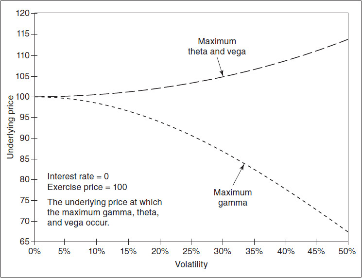

<!-- source:block 2c3b34e77a954755 -->

> [!quote]- English 131
> *We can also relate the critical underlying prices to the higher-order risk measures. If we ignore the extremes, where the option is either very deeply in the money or very far out of the money, the maximum gamma will occur when the option’s *speed* is 0. The maximum theta will occur when the option’s *charm* is 0. The maximum vega will occur when the option’s *vanna* is 0.

* 我们还可以将关键标的价格与更高级的风险指标联系起来。如果我们忽略极端情况，即期权要么是非常深的ITM，要么是非常远的OTM，则当期权的速度为0时将出现最大Gamma。 最大Theta将在期权的Charm为0时出现。当期权的vanna为0时，将出现最大Vega。

<!-- source:block 9c20339ea365ed48 -->

*Figure 18-9 At an interest rate of 4 percent, the underlying price at which the maximum gamma, theta, and vega will occur. / Figure 18-9 At an interest rate of 4 percent, the underlying price at which the maximum gamma, theta, and vega will occur.*

<!-- source:block 327e186c7716a650 -->

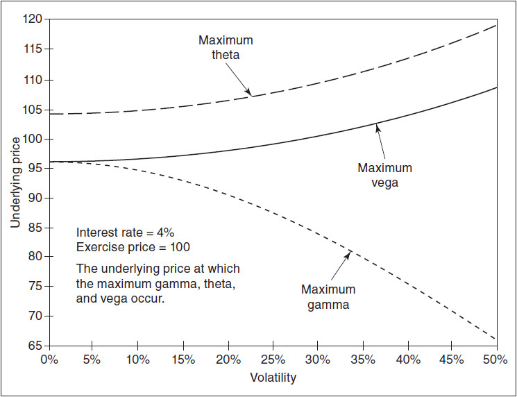

<!-- source:block 7b9b1815c97cb814 -->

> [!quote]- English 133
> We might also consider what will happen to the vega of an option as we change time. The answer may seem obvious because we previously made the assumption that the vega always increases with time—long-term options are more sensitive to a change in volatility than short-term options. But this is true only if the underlying price is equal to the forward price, as it is assumed to be when evaluating options on futures. If we evaluate a stock option, the forward price for stock is a function of both time and interest rates. If interest rates are greater than 0, and assuming no dividends, as we increase time, the forward price will increase, causing the option to become either more or less at the forward. Because an at-the-forward option tends to have the highest vega, changing time can cause the vega of an option to either rise or fall. This means that under some conditions, it is possible for the vega of a stock option to decline if we increase to expiration. We can see this effect in Figure 18-10.

我们还可能会考虑当我们改变时间时，期权的Vega会发生什么。答案可能看起来很明显，因为我们之前假设Vega总是随着时间的推移而增加——长期期权比短期期权对波动率的变化更敏感。但只有当标的价格等于远期价格时，这才成立，正如评估期货期权时所假设的那样。如果我们评估股票期权，股票的远期价格是时间和利率的函数。如果利率大于0，并假设没有股息，随着时间的增加，远期价格将会增加，导致期权在远期变得更多或更少。由于远期期权往往具有最高的Vega值，因此改变时间可能会导致期权的Vega值上升或下降。这意味着，在某些条件下，如果我们增加到到期，股票期权的Vega可能会下降。我们可以在图18-10中看到这种效果。

<!-- source:block f53260e9d785d272 -->

*图18-10随着时间和兴趣变化的Vega。 / Figure 18-10 Vega as time and interest change.*

<!-- source:block 467c4f9e803c3e28 -->

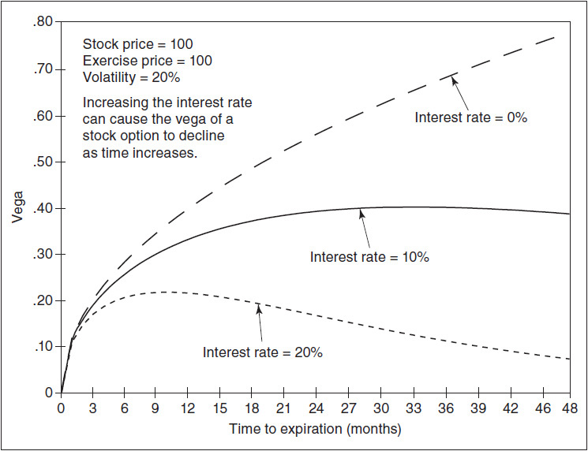

<!-- source:block 5b5a102479c561d4 -->

> [!quote]- English 135
> With an underlying stock price of 100, a volatility of 20 percent, and interest rate of 0, the vega of a 100 call always increases as we increase time to expiration. But as we raise interest rates, there is some point in time at which the opposite occurs—the option’s vega begins to decline as we increase time to expiration. At an interest rate of 10 percent, this occurs if there are more than 33 months remaining to expiration. At an interest rate of 20 percent, the critical time is 10 months remaining to expiration.

由于标的股价为100,，波动率为20 %，利率为0,，因此随着到期时间的增加，100 看涨期权的Vega总是会增加。 但当我们提高利率时，在某个时间点会发生相反的情况——随着我们延长到期时间，期权的Vega开始下降。如果利率为10 %，如果到期时间超过33个月，就会发生这种情况。 如果利率为20 %，关键时间是距离到期还剩10个月。

<!-- source:block a77580fd6649b6fd -->

> [!quote]- English 136
> We can also see where these critical points are by looking at a graph of the *vega decay*, as shown in Figure 18-11. At an interest rate of 0, the vega decay is always positive. At an interest rate of 10 percent, the vega decay is positive with less than 33 months to expiration but negative with more than 33 months. And at an interest rate of 20 percent, the vega decay is positive with less than 10 months to expiration and negative with more than 10 months.

我们还可以通过查看Vega衰变的图表来了解这些临界点在哪里，如图18-11所示。当利率为0时，Vega衰变始终为正值。在10%的利率下，距离到期时间不到33个月，Vega衰变为正值，而超过33个月，Vega衰变为负值。在20%的利率下，距离到期不到10个月，Vega衰变为正值，超过10个月，Vega衰变为负值。

<!-- source:block a6f5c730663c128b -->

*图18-11 Vega随着时间和兴趣的变化而衰变。 / Figure 18-11 Vega decay as time and interest change.*

<!-- source:block 276c64dd34a649ec -->

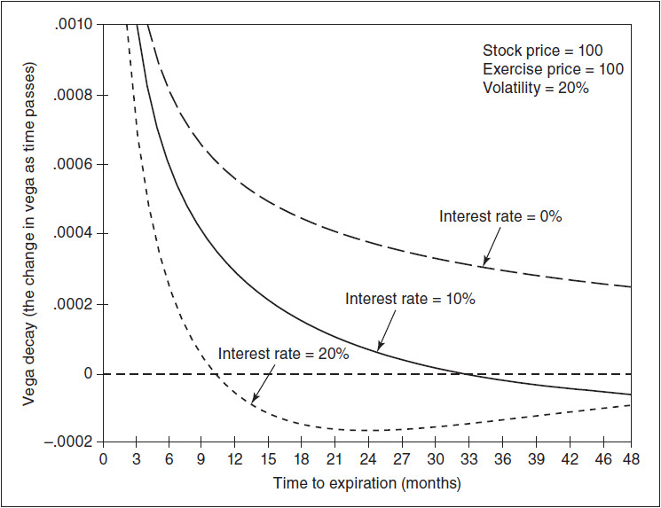

<!-- source:block 5bf2d6390b148758 -->

> [!note] Footnote 138
> 1 The Black-Scholes model is sometimes referred to as the *Black-Scholes-Merton model* because Robert Merton, originally associated with the Massachusetts Institute of Technology, contributed significantly to the theory of option pricing. Merton and Scholes were jointly awarded the Nobel Prize in Economics in 1997 for their work on option pricing. Fischer Black, sadly, died in 1995.

[^ovp18-1]: 布莱克-斯科尔斯模型有时被称为布莱克-斯科尔斯-默顿模型，因为最初与麻省理工学院有联系的罗伯特·默顿对期权定价理论做出了重大贡献。默顿和斯科尔斯因其在期权定价方面的工作于1997年共同获得诺贝尔经济学奖。费舍尔·布莱克（Fischer Black）不幸于1995年去世。

<!-- source:block c3fda6547af739bd -->

> [!note] Footnote 139
> 2. We could in fact drop *rt* and at the same time replace *S* with its forward price *Sert*. The values are the same: ln(*S*/*X*) + *rt* = ln(*Sert/X*).

[^ovp18-2]: 事实上，可以去掉 $r\tau$ 项，同时把 $S$ 替换为其远期价格 $F=Se^{r\tau}$；两种写法相同：$\ln(S/X)+r\tau=\ln(Se^{r\tau}/X)=\ln(F/X)$。

<!-- source:block d4800cb79ac34aca -->

> [!note] Footnote 140
> 3 To further simplify this approximation, many traders round .00399 to .004. This leads to what is sometimes referred to as the *40% rule*: the expected value of an at-the-forward option is equal to approximately 40% of one standard deviation, where one standard deviation is equal to *F*× σ√*t*.

[^ovp18-3]: 为了进一步简化这一近似，许多交易者会把 $0.00399$ 舍入为 $0.004$。这导出了所谓的“40% 规则”：远期平值期权的预期价值约等于一个标准差的 $40\%$，其中一个标准差为 $F\sigma\sqrt\tau$。

<!-- source:block ed256dc1e1793aef -->

> [!note] Footnote 141
> 4 For a more exact calculation, 1 + *r* × *t* can be replaced by *ert*.

[^ovp18-4]: 若使用连续复利进行更精确的计算，可用 $e^{r\tau}$ 代替 $1+r\tau$。

---

[[阅读导航|← 返回阅读导航]]

<!-- chapter-nav:start -->
> [!tip] 章节导航（章末）
> [[使用期权进行对冲 Hedging with Options|← 上一章]] · [[阅读导航|全书导航]] · [[二叉树期权定价 Binomial Option Pricing|下一章 →]]
<!-- chapter-nav:end -->
