# 第19章 二叉树期权定价 / Binomial Option Pricing

[[Option Volatility and Pricing 导航|← 返回阅读导航]] · [[翻译说明与术语表|术语表]]

> [!warning] 翻译状态
> 本章为机器初译，并使用本地术语表校验。英文原文、数字、公式和图表用于核对；中文将在后续复核中继续修订。

<!-- chapter-toc:start -->
## 本章目录 / Chapter Outline

> [!abstract] 结构导航
> 以下标题按原书顺序保留；点击可直接跳转。

- [[#风险中性世界 / A Risk-Neutral World|风险中性世界 / A Risk-Neutral World]]
- [[#期权估值 / Valuing an Option|期权估值 / Valuing an Option]]
  - [[#三期示例 / A Three-Period Example|三期示例 / A Three-Period Example]]
  - [[#二叉树符号 / Binomial Notation|二叉树符号 / Binomial Notation]]
- [[#Delta（标的价格敏感度） / The Delta|Delta（标的价格敏感度） / The Delta]]
- [[#Gamma（Delta 变化率） / The Gamma|Gamma（Delta 变化率） / The Gamma]]
- [[#Theta（时间敏感度） / The Theta|Theta（时间敏感度） / The Theta]]
- [[#Vega 与 Rho / Vega and Rho|Vega 与 Rho / Vega and Rho]]
- [[#u 与 d 的取值 / The Values of u and d|u 与 d 的取值 / The Values of u and d]]
- [[#Gamma 租金 / Gamma Rent|Gamma 租金 / Gamma Rent]]
- [[#美式期权 / American Options|美式期权 / American Options]]
- [[#股息 / Dividends|股息 / Dividends]]
<!-- chapter-toc:end -->
<!-- chapter-nav:start -->
> [!tip] 章节导航（章首）
> [[Black–Scholes 模型 The Black-Scholes Model|← 上一章]] · [[Option Volatility and Pricing 导航|全书导航]] · [[再论波动率 Volatility Revisited|下一章 →]]
<!-- chapter-nav:end -->
<!-- source:block 7d6489b97edf8ac7 -->

> [!quote]- English 1
> The Black-Scholes model is the most widely used of all theoretical option pricing models. Unfortunately, a full understanding of the model requires some familiarity with advanced mathematics. In the late 1970s, three professors, John Cox of the Massachusetts Institute of Technology, Stephen Ross of Yale University, and Mark Rubinstein of the University of California at Berkeley, were trying to develop a method of explaining basic option pricing theory to their students without using advanced mathematics. The method they proposed, *binomial option* pricing,1 is not only relatively easy to understand, but the *binomial model* (also known as the *Cox-Ross-Rubinstein model*) that resulted from this approach can be used to price some options (primarily American options) that cannot be priced using the Black-Scholes model.

布莱克-斯科尔斯模型是所有理论期权定价模型中使用最广泛的模型。不幸的是，全面理解该模型需要熟悉高等数学。在1970年代末，三位教授，麻省理工学院的约翰·考克斯、 耶鲁大学和加州大学伯克利分校的马克·鲁宾斯坦试图开发一种在不使用高等数学的情况下向学生解释基本期权定价理论的方法。他们提出的方法，即二项期权定价，不仅相对容易 理解，但这种方法产生的二项模型（也称为Cox-Ross-Rubinstein模型）可以用于对一些无法使用Black-Scholes模型定价的期权（主要是美式期权）定价。 [^ovp19-1]

<!-- source:block e13df958d24f91c2 -->

## 风险中性世界 / A Risk-Neutral World

<!-- source:block 949b731d9a3b890a -->

> [!quote]- English 2
> Consider a security that is currently trading at 100 and that, on some day in the future, can take on one of two prices, 120 and 90. Assuming that there are no interest or dividend considerations, would you rather buy or sell this security at today’s price of 100?

假设一只证券目前的交易价格为100，并且在未来的某一天，它可以采取两种价格之一，120和90。假设没有利息或股息考虑，您愿意以今天100的价格购买或出售该证券吗？

<!-- source:block 92519bbd53550e94 -->

> [!quote]- English 3
> Instinctively, it seems that one would rather be long this security at a price of 100 than short the security at the same price. After all, the security can go up 20 but down only 10.

直觉上，人们似乎更愿意在价格为 100 时做多该证券，而不是在同一价格做空。毕竟，该证券可能上涨 20，却只可能下跌 10。

<!-- source:block b77a0c7a8b5db222 -->

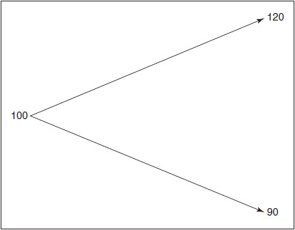

<!-- source:block 672dab7fe77a107c -->

> [!quote]- English 4
> The decision to go long is probably based on the assumption that the likelihood of the price rising and falling is the same, 50 percent. But why should the probabilities be the same? Perhaps the probability of movement in one direction is greater than the probability of movement in the other direction. Indeed, there should be some probability of upward movement *p* and downward movement 1 – *p* such that an investor will be indifferent as to whether he buys or sells the security. For an investor to be indifferent, the total expected value must be equal to the current price of 100

做多的决定可能是基于这样的假设：价格上涨和下跌的可能性相同，为50%。但为什么概率应该相同呢？也许向一个方向移动的可能性大于向另一个方向移动的可能性。事实上，p向上移动和1 - p向下移动的可能性应该存在一定程度，这样投资者就不会关心他是购买还是出售证券。对于投资者来说，要想漠不关心，总预期价值必须等于现价100

<!-- source:block 9f2d1deedf66d8f2 -->

> [!quote]- English 5
> *p* × 120 + (1 – *p*) × 90 = 100

$$
p\,\times 120 + (1 -\,p) \times 90 = 100
$$

<!-- source:block f94f5dfbe8f5db3b -->

> [!quote]- English 6
> Solving for *p*, we get

求p，我们得到

<!-- source:block 4568852bf3f1768e -->

> [!quote]- English 7
> 120*p* + 90 – 90*p* = 100 >> 30*p* = 10 >> *p* = ⅓

$$
120p\,+ 90 - 90p\,= 100 \Rightarrow 30p\,= 10 \Rightarrow\,p = \frac{1}{3}
$$

<!-- source:block 609cebb0ba25edd6 -->

> [!quote]- English 8
> We can confirm that this is correct by doing the arithmetic

我们可以通过算术来确认这是正确的

<!-- source:block 8d0822f9efa07db8 -->

> [!quote]- English 9
> ⅓ × 120 + ⅔ × 90 = 40 + 60 = 100

$$
\frac{1}{3} \times 120 + \frac{2}{3} \times 90 = 40 + 60 = 100
$$

<!-- source:block 0410b195935558a2 -->

> [!quote]- English 10
> If *S* is the current security price, we can generalize this approach by defining *u* and *d* as multipliers that represent the magnitudes of the upward and downward moves. This results in a one-period *binomial tree*:

如果S是当前的证券价格，我们可以通过将u和d定义为代表向上和向下移动幅度的乘数来概括这种方法。这会产生一个周期的二项树：

<!-- source:block 2009fc25ebac68d3 -->

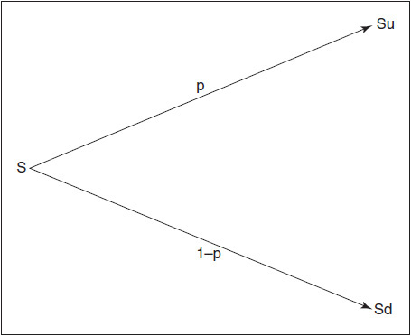

<!-- source:block e0dc59608b72c901 -->

> [!quote]- English 11
> In a *risk-neutral* world,

在风险中性的世界里，

<!-- source:block 09a44320f24955d8 -->

> [!quote]- English 12
> *pSu* + (1 – *p*)*Sd* = *S*

$$
pSu\,+ (1 -\,p)Sd\,=\,S
$$

<!-- source:block c3acfede312ca443 -->

> [!quote]- English 13
> Solving for *p*,

求p，

<!-- source:block 8b1e096fa394c948 -->

> [!quote]- English 14
> *p*(*Su*) + (1 – *p*)*Sd* = *S* >> *pu* + *d* – *pd* = 1 >> *p* = (1 – *d*)/(*u* – *d*)

$$
p(Su) + (1 -\,p)Sd\,=\,S \Rightarrow\,pu +\,d -\,pd = 1 \Rightarrow\,p = (1 -\,d)/(u\,-\,d)
$$

<!-- source:block fcb770cdf593f2db -->

> [!quote]- English 15
> In our original example, *u* and *d* were 1.20 and 0.90, respectively, with *p* equal to

在我们的原始示例中，u和d分别为1.20和0.90，p等于

<!-- source:block a70387a4b2da3ba8 -->

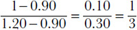

<!-- 原 EPUB 中此公式为图片，已原样保留 -->

<!-- source:block 75b32428cf8621c4 -->

> [!quote]- English 16
> What should *p* and 1 – *p* be for a non-dividend-paying stock? For an investor to be indifferent to buying or selling, the risk neutral probabilities must yield a value that is equal to the forward price for the stock *S*(1 + *r × t*). Therefore,

对于不派息股票来说，p和1 - p应该是多少？对于投资者对买卖漠不关心，风险中性概率必须产生等于股票远期价格S（1 + r x t）的值。因此，

<!-- source:block 939643a19c5ee057 -->

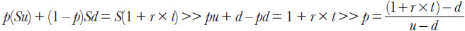

<!-- 原 EPUB 中此公式为图片，已原样保留 -->

<!-- source:block 71b4316cc12597b4 -->

## 期权估值 / Valuing an Option

<!-- source:block c1f4f86f8d925abc -->

> [!quote]- English 17
> Suppose that we want to value an option using a one-period binomial tree. We know at expiration that an option is worth exactly its intrinsic value, the maximum of [*S* – *X*, 0] for a call and the maximum of [*X* – *S*, 0] for a put. In a one-period binomial tree, the expected value of a call is

假设我们想要使用一期二项树来评估期权的价值。我们知道，在到期时，期权的内在价值恰好符合其内在价值，看涨期权的最大值为[S-X，0]，看跌期权的最大值为[X-S，0]。在一周期二项树中，看涨期权的期望值是

<!-- source:block d8ff6251c5839dff -->

> [!quote]- English 18
> *p* × max[*Su* – *X*, 0] + (1 – *p*) × max[*Sd* – *X*, 0]

$$
p\,\times \max[Su\,-\,X, 0] + (1 -\,p) \times \max[Sd\,-\,X, 0]
$$

<!-- source:block 0550f8504ccd5732 -->

> [!quote]- English 19
> The theoretical value of the call is the present value of the expected value

看涨的理论价值是预期价值的现值

<!-- source:block f334ea2da52b34a3 -->

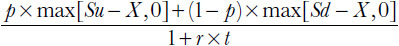

<!-- 原 EPUB 中此公式为图片，已原样保留 -->

<!-- source:block c06e97840f8b11cf -->

> [!quote]- English 20
> Using the same reasoning, the theoretical value of the put is

使用同样的推理，看跌期权的理论价值是

<!-- source:block 64dab4e036b3f525 -->

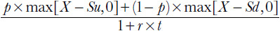

<!-- 原 EPUB 中此公式为图片，已原样保留 -->

<!-- source:block 7647832264236aaf -->

> [!quote]- English 21
> Suppose that we expand our binomial tree to two periods each of length *t*/2 and also make the assumption that *u* and *d* are multiplicative inverses. Then

假设我们将二项树扩展到两个周期，每个周期的长度为t/2，并假设u和d是乘逆。然后

<!-- source:block 8dd529a17d2176a7 -->

> [!quote]- English 22
> *d* = 1/*u* >> *u* = 1/*d* >> *ud* = *du* = 1

$$
d\,= 1/u\,\Rightarrow\,u = 1/d\,\Rightarrow\,ud =\,du = 1
$$

<!-- source:block b460d575bbfaa10a -->

> [!quote]- English 23
> This means that an up move followed by a down move or a down move followed by an up move results in the same price. If the magnitudes of the up and down moves *u* and *d* are the same at every branch in our tree, then in a risk-neutral world, the probability of an upward move will always be

这意味着向上移动然后向下移动或向下移动然后向上移动会导致相同的价格。如果上下移动u和d的幅度在我们树的每个树枝上都是相同的，那么在风险中性的世界中，向上移动的可能性始终是

<!-- source:block e619b03bf4479b84 -->

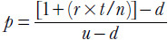

<!-- 原 EPUB 中此公式为图片，已原样保留 -->

<!-- source:block fe7b6df40739a3dc -->

> [!quote]- English 24
> and the probability of a down move will always be 1 – *p*.

向下移动的概率始终为1 -p。

<!-- source:block e3c4dceae6f13341 -->

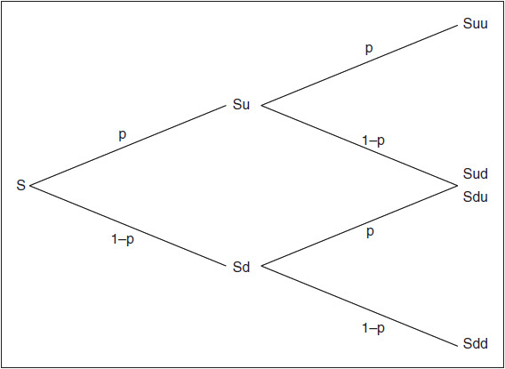

<!-- source:block 7421abd329ddba7f -->

> [!quote]- English 25
> There are now three possible prices for the underlying at expiration—*Suu*, *Sud*, and *Sdd*. There is only one path that will lead to either *Suu* or *Sdd*. But there are two possible paths to the middle price *Sud*. The underlying can go up and then down or down and then up. The theoretical value of a call in the two-period example is

现在，标的在到期时有三种可能价格：$S_{uu}$、$S_{ud}$ 和 $S_{dd}$。到达 $S_{uu}$ 或 $S_{dd}$ 的路径各只有一条，而到达中间价格 $S_{ud}$ 的路径有两条：标的可以先涨后跌，也可以先跌后涨。两期示例中看涨期权的理论价值为：

<!-- source:block d0506e4c7690a86b -->

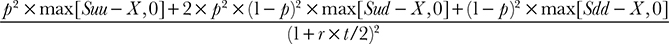

<!-- 原 EPUB 中此公式为图片，已原样保留 -->

<!-- source:block 0e86170b9681ddb0 -->

> [!quote]- English 26
> The value of a put is

看跌期权的价值是

<!-- source:block 86fe8c56910466c1 -->

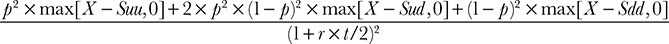

<!-- 原 EPUB 中此公式为图片，已原样保留 -->

<!-- source:block 0596c41a6b21025b -->

> [!quote]- English 27
> Using this approach, we can expand our binomial tree to any number of periods.

使用这种方法，我们可以将二项树扩展到任何数量的时期。

<!-- source:block 88943470c07f342a -->

> [!quote]- English 28
> If

如果

<!-- source:block 21433ed42607c8cf -->

> [!quote]- English 29
> *n* = number of periods in the binomial tree

$$
n\,= \text{number of periods in the binomial tree}
$$

<!-- source:block 24f8b8e81f0ffd6d -->

> [!quote]- English 30
> *t* = time to expiration in years

$$
t\,= \text{time to expiration in years}
$$

<!-- source:block cbe6b99c6ca6c3db -->

> [!quote]- English 31
> *r* = annual interest rate

$$
r\,= \text{annual interest rate}
$$

<!-- source:block 64c05b86946288c2 -->

> [!quote]- English 32
> the possible terminal underlying prices are

可能的最终标的价格是

<!-- source:block 6869686b454080c3 -->

> [!quote]- English 33
> *Sujd*(*n–j*) for *j* = 0, 1, 2, …, *n*

$$
Su^{j}d^{(}n–j) \text{for}\,j = 0, 1, 2, \ldots,\,n
$$

<!-- source:block 27f1b329d3c1b63e -->

> [!quote]- English 34
> The number of paths that will lead to each terminal price is given by the *binomial expansion2*

导致每个终端价格的路径数量由二项展开给出[^ovp19-2]

<!-- source:block 053e4cdad8f1c237 -->

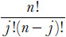

<!-- 原 EPUB 中此公式为图片，已原样保留 -->

<!-- source:block 26b38a66b568ca6c -->

> [!quote]- English 35
> The values of a European call and put are

欧洲看涨和看跌的价值观是

<!-- source:block cef7958236e15376 -->

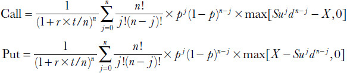

<!-- 原 EPUB 中此公式为图片，已原样保留 -->

<!-- source:block 0263138696ef702a -->

### 三期示例 / A Three-Period Example

<!-- source:block c6fc86551c9300b3 -->

> [!quote]- English 36
> Suppose that

假设

<!-- source:block 8954075a65d32fb8 -->

> [!quote]- English 37
> *n* = 3

$$
n\,= 3
$$

<!-- source:block a0cce2fdf1c5f673 -->

> [!quote]- English 38
> *S* = 100

$$
S\,= 100
$$

<!-- source:block e2ba590132bc4267 -->

> [!quote]- English 39
> *t* = 9 months (0.75 year)

$$
t\,= 9 \text{months} (0.75 \text{year})
$$

<!-- source:block bcf0920dc54ad136 -->

> [!quote]- English 40
> *r* = 4 percent (0.04)

$$
r\,= 4 \text{percent} (0.04)
$$

<!-- source:block 2a989d022e9bf4d2 -->

> [!quote]- English 41
> *u* = 1.05

$$
u\,= 1.05
$$

<!-- source:block c34dbe193544e209 -->

> [!quote]- English 42
> *d* = 1/*u* ≈ 0.9524

$$
d\,= 1/u\,\approx 0.9524
$$

<!-- source:block e89c593679446eab -->

> [!quote]- English 43
> Then the values of *p* and 1 – *p* are

那么p和1 - p的值是

<!-- source:block 2e990e787d31e1ac -->

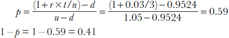

<!-- 原 EPUB 中此公式为图片，已原样保留 -->

<!-- source:block 943e5155f351e210 -->

> [!quote]- English 44
> The complete three-period binomial tree is shown in Figure 19-1.3

完整的三期二叉树如图19-1所示。 [^ovp19-3]

<!-- source:block eeeda63b1046bb0a -->

*图19-1三周期二项树。 / Figure 19-1 A three-period binomial tree.*

<!-- source:block c19e1ebcb9e6d3c6 -->

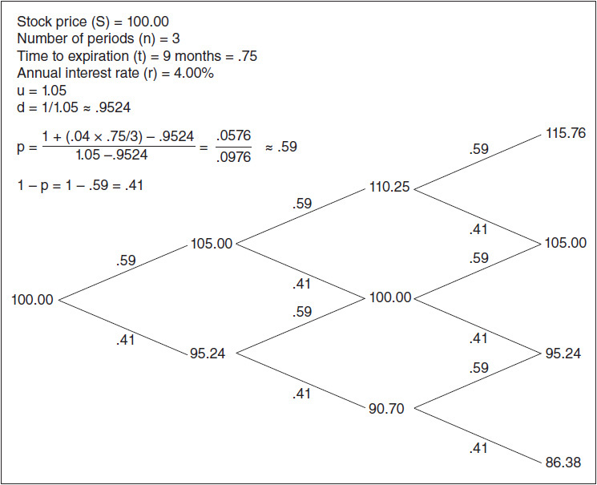

<!-- source:block 1f2aa09ecea967e0 -->

> [!quote]- English 46
> Using the three-period binomial tree, what should be the value of a 100 call and a 100 put?

使用三期二叉树，100看涨期权和100看跌期权的价值应该是多少？

<!-- source:block ca6620fa2dfdacc4 -->

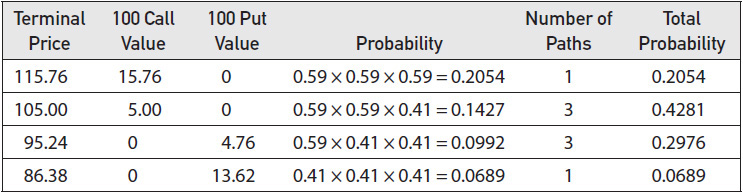

<!-- source:block 3a7c3e5072fbb345 -->

> [!quote]- English 47
> The value of the 100 call is

100看涨期权的价值是

<!-- source:block 1d63e0e3df79468e -->

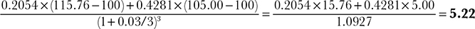

<!-- source:block 67d123c7339f00aa -->

> [!quote]- English 48
> The value of the 100 put is

100看跌期权的价值是

<!-- source:block f1392cee8c507b0f -->

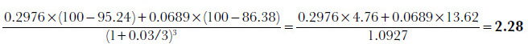

<!-- source:block c0cf64410b56caf4 -->

> [!quote]- English 49
> If the values for the 100 call and put are correct, they should be consistent with put-call parity

如果100看涨和看跌的值正确，则它们应该与看跌-看涨平价一致

<!-- source:block 40e0475224c9580d -->

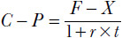

<!-- 原 EPUB 中此公式为图片，已原样保留 -->

<!-- source:block 3e60c003ec430b3c -->

> [!quote]- English 50
> We can check this by first calculating the forward price for the stock. Because we are compounding interest over three time periods, the forward price is

我们可以通过首先计算股票的远期价格来检查这一点。由于我们在三个时期内进行生息，因此远期价格为

<!-- source:block f70f29c0588e42bc -->

> [!quote]- English 51
> *F* = 100 × (1 + 0.75 × 0.04/3)3 = 100 × 1.0303 = 103.03

$$
F\,= 100 \times (1 + 0.75 \times 0.04/3)^{3} = 100 \times 1.0303 = 103.03
$$

<!-- source:block e29903cf5bd8fc22 -->

> [!quote]- English 52
> Then

然后

<!-- source:block 8d05b134fd0a50e1 -->

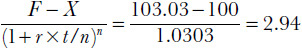

<!-- 原 EPUB 中此公式为图片，已原样保留 -->

<!-- source:block 8df30f0454611e2c -->

> [!quote]- English 53
> which is indeed equal to *C* – *P*

这确实等于C - P

<!-- source:block 2a014ddd69c7a2b1 -->

> [!quote]- English 54
> 5.22 – 2.28 = 2.94

$$
5.22 - 2.28 = 2.94
$$

<!-- source:block e5c16fbe453504ea -->

### 二叉树符号 / Binomial Notation

<!-- source:block 53043488160fce7a -->

> [!quote]- English 55
> When constructing a binomial tree, it is customary to denote each price in the tree as *Si, j*, where *i*, *j* = 0, 1, 2, . . . , *n*. The value of *i* locates *S* along the tree moving from left to right. The value of *j* locates *S* moving from bottom to top. A five-period binomial tree using this notation is shown in Figure 19-2.

在构建二项树时，习惯上将树中的每个价格表示为Si，j，其中i，j = 0，1，2，. . .，n。i的值沿着树从左向右移动定位S。j的值位于S从底部到顶部移动的位置。使用此符号的五周期二项树如图19-2所示。

<!-- source:block 1d55e7b3960ca1be -->

*图19-2五期二项树的二项符号。 / Figure 19-2 Binomial notation for a five-period binomial tree.*

<!-- source:block cf9b5ce78a02b132 -->

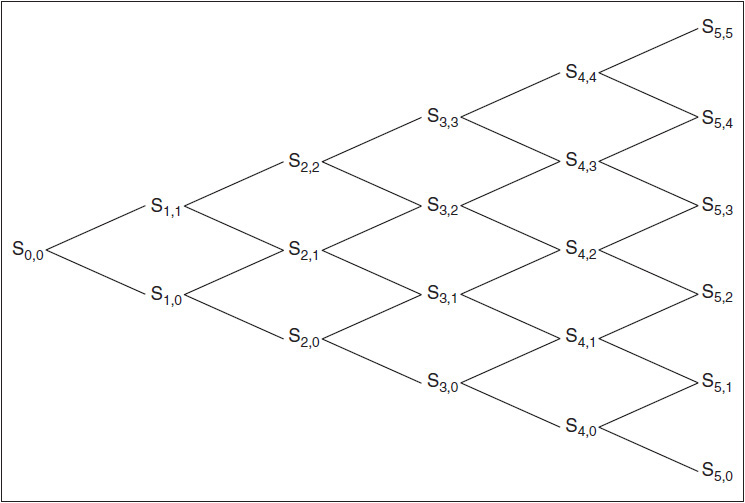

<!-- source:block 156cfe41009e2bf7 -->

> [!quote]- English 57
> Instead of filling in a binomial tree with the underlying prices *Si, j* at each node, we can instead fill in the tree with option values, either *Ci, j* for calls or *Pi, j* for puts. Figure 19-3 shows the value of a 100 call at each node along the binomial tree in Figure 19-1. The terminal values *C*3,*j* are simply the maximum of either *S*3*j* – 100 or 0. For *S*3,3 = 115.76, the value of the call *C*3,3 is equal to 115.76 – 100 = 15.76; for *S*3,2 = 105.00, the value of the call *C*3,2 is equal to 105.00 – 100 = 5.00. For *S*3,1 = 95.24 and *S*3,0 = 86.38, the 100 call is out of the money, so both *C*3,1 and *C* 3,0are 0.

我们可以用期权值（看涨期权Ci，j或看跌期权Pi，j）来填充二叉树，而不是用每个节点的标的价格Si，j来填充。图19-3显示了图19-1中二项树上每个节点上100 看涨期权的值。终端值C3，j只是S3 j- 100或0的最大值。对于S3，3 = 115.76，看涨期权 C3，3的值等于115.76 - 100 = 15.76;对于S3，2 = 105.00，看涨期权 C3，2的值等于105.00 - 100 = 5.00。对于S3，1 = 95.24和S3，0 = 86.38,100 看涨期权价外，因此C3，1和C3，0都是0。

<!-- source:block 2fb46fc9a7245f44 -->

*图19-3二项树上任何点的看涨期权值。 / Figure 19-3 A call value at any point along the binomial tree.*

<!-- source:block 70aca64dccc807d0 -->

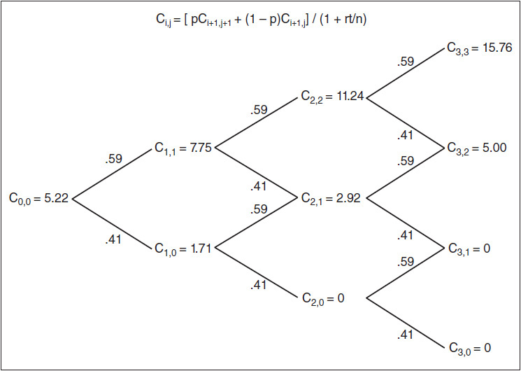

<!-- source:block 4db8636f6084af68 -->

> [!quote]- English 59
> It’s obvious what the value of the 100 call is at expiration, either intrinsic value or 0. But what should be the value of the call at other nodes along the tree? To determine these values, we can work backwards from the terminal values using the probabilities of upward and downward moves and discounting by interest to determine the present value. For example, what is the value of *C*2,2? We know that there is a 59 percent chance that at *S*2,2 the stock will move up in price, in which case the option will be worth 15.76. We also know that there is a 41 percent chance that the stock will move down in price, in which case the option will be worth 5.00. The expected value of the option at *C*2,2 is therefore know that there is a 41 percent chance that the stock will move down in price, in which case the option will be worth 5.00. The expected value of the option at *C*2,2 is therefore

很明显，100看涨期权在到期时的价值是多少，要么是内在价值，要么是0。但树上其他节点上的看涨期权值应该是多少？为了确定这些值，我们可以使用向上和向下移动的概率以及按利息贴现从终端值向后计算来确定现值。例如，C2，2的值是多少？我们知道，在S2，2时，股票价格上涨的可能性为59%，在这种情况下，期权的价值为15.76。我们还知道，股票价格下跌的可能性为41%，在这种情况下，期权的价值为5.00。因此，期权在C2，2处的期望值是，股票价格下跌的可能性为41%，在这种情况下，期权的价值为5.00。因此，期权在C2，2处的期望值为

<!-- source:block ae46078ab74af06c -->

> [!quote]- English 60
> (0.59 × 15.76) + (0.41 × 5.00) = 11.35

$$
(0.59 \times 15.76) + (0.41 \times 5.00) = 11.35
$$

<!-- source:block 0934dd260783d1d4 -->

> [!quote]- English 61
> The theoretical value of the option at *C*2,2 is the present value of 11.35

C2，2处期权的理论价值为现值11.35

<!-- source:block a57f507564eff3a5 -->

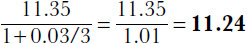

<!-- 原 EPUB 中此公式为图片，已原样保留 -->

<!-- source:block 2bd512079ef19879 -->

> [!quote]- English 62
> Using the same reasoning, the theoretical value of the option at *C*2,1 is

使用相同的推理，C2，1处期权的理论值为

<!-- source:block 4904c5ca5804cc21 -->

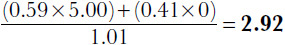

<!-- 原 EPUB 中此公式为图片，已原样保留 -->

<!-- source:block 14d0bf5792ff6db4 -->

> [!quote]- English 63
> The value of the option at *C*2,0 must be 0 because either an upward or downward move results in a value of 0. We can express the value of a call at any point along the binomial tree as

C2，0处期权的值必须为0，因为向上或向下移动都会导致值为0。我们可以将二项树上任何点的看涨期权值表示为

<!-- source:block 865e653504630a52 -->

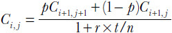

<!-- 原 EPUB 中此公式为图片，已原样保留 -->

<!-- source:block d5682816d5890f8f -->

> [!quote]- English 64
> Working backwards along the tree, we come finally to *C*0,0, the option’s initial theoretical value. Of course, we already know from our previous calculation that this value is 5.22, so why go through the process of calculating the call value at every point along the binomial tree? The reason for calculating these intermediate values is that they not only enable us to determine some of the risk sensitivities associated with the option, but also, as we will see later, they enable us to calculate the value of an American option.

沿着树向后工作，我们最终到达C 0，0，即期权的初始理论值。当然，我们从之前的计算中已经知道这个值是5.22，那么为什么还要经历计算二项树上每个点的看涨期权值的过程呢？计算这些中间值的原因是，它们不仅使我们能够确定与期权相关的一些风险敏感性，而且正如我们稍后将看到的那样，它们还使我们能够计算美式期权的价值。

<!-- source:block dd9d7827060122af -->

## Delta（标的价格敏感度） / The Delta

<!-- source:block dc973bd289814af1 -->

> [!quote]- English 65
> We know the initial value of the 100 call, 5.22. But what is the option’s delta at *C*0,0? The delta is the change in the option’s value with respect to movement in the price of the underlying contract. We can express this as a fraction

我们知道100看涨期权的初始值为5.22。但该期权在C 0，0处的Delta是多少？Delta是期权价值相对于标的合约价格变动的变化。我们可以将其表示为分数

<!-- source:block ee0d96f9a3ebb3e6 -->

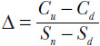

<!-- 原 EPUB 中此公式为图片，已原样保留 -->

<!-- source:block ccdcaea845eb1b2e -->

> [!quote]- English 66
> As we move from *C*0,0 to either *C*1,1 or *C*1,0, the option will go up in value to 7.75 or down in value to 1.71. At the same time, the stock will move up in price to 105.00 or down in price to 95.24. The delta is therefore

当我们从C 0，0移动到C1，1或C1，0时，期权的价值将上升至7.75或下降至1.71。与此同时，该股将上涨至105.00或下跌至95.24。因此，Delta是

<!-- source:block ddbf6c9bafeb938d -->

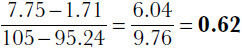

<!-- 原 EPUB 中此公式为图片，已原样保留 -->

<!-- source:block a6380ab64511d3c7 -->

> [!quote]- English 67
> Using the whole-number format, the initial delta of the 100 call is 62.

使用整数字格式，100看涨期权的初始Delta为62。

<!-- source:block 3eac3f9934a75a53 -->

> [!quote]- English 68
> We can calculate the delta at every point along the binomial tree by dividing the change in the option’s value by the change in the underlying price

我们可以通过将期权价值的变化除以标的价格的变化来计算二项树上每个点的Delta

<!-- source:block 6dd962cab5bc27cf -->

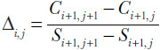

<!-- 原 EPUB 中此公式为图片，已原样保留 -->

<!-- source:block a97e5774d4148860 -->

> [!quote]- English 69
> Figure 19-4 shows the stock price, the value of the 100 call, and the delta of the call at every node along the binomial tree.

图19-4显示了二项树上每个节点的股价、100看涨的价值以及看涨的Delta。

<!-- source:block 97d7bef2f7f27c03 -->

*图19-4使用二项树的期权Delta。 / Figure 19-4 Delta of an option using a binomial tree.*

<!-- source:block 00cefc3ec6a53593 -->

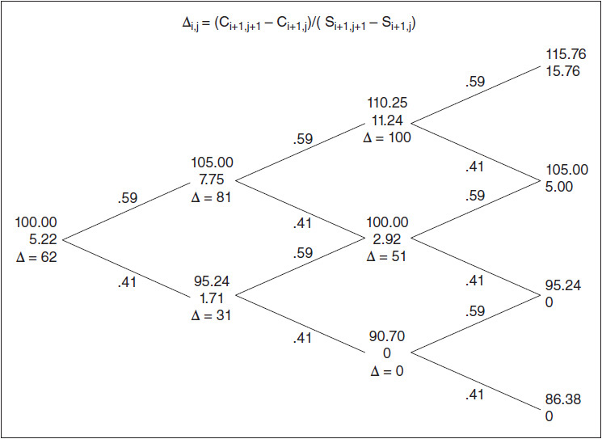

<!-- source:block f15fb24fe2daa3e1 -->

> [!quote]- English 71
> In Chapter 8, we showed that the dynamic hedging process enables us to capture the difference between an option’s value and its price. We can see this same principal at work in the binomial model. Returning to Figure 19-4, suppose that we buy the 100 call at its theoretical value of 5.22 and create a delta-neutral hedge (Δ = 62) by selling 62 percent of an underlying stock contract at a price of 100. What will be the result if we hold the position for one time period?

在第8章中，我们表明动态对冲过程使我们能够捕捉期权价值与其价格之间的差异。我们可以在二项模型中看到同样的原理在起作用。回到图19-4，假设我们以理论价值5.22购买100看涨期权，并通过以100的价格出售62%的标的股票合约来创建Delta中性对冲（Δ = 62）。如果我们持有该头寸一段时间会有什么结果？

<!-- source:block 6f212e0e535b4cd3 -->

> [!quote]- English 72
> If the stock price moves up to 105.00, the option will be worth 7.75, resulting in a profit on the option of 7.75 – 5.22 = 2.53. At the same time, we will lose 0.62 × (100 – 105) = –3.10 on the stock position, giving us a loss on the hedge of

如果股价上涨至105.00，期权价值为7.75，期权利润为7.75 - 5.22 = 2.53。同时，我们的股票头寸将损失0.62 x（100 - 105）= -3.10，使我们的对冲损失

<!-- source:block f43b0be4ff075896 -->

> [!quote]- English 73
> +2.53 – 3.10 = –0.57

$$
+2.53 - 3.10 = -0.57
$$

<!-- source:block bc6c470cd301089e -->

> [!quote]- English 74
> If the stock price moves down to 95.24, the option will be worth 1.71, resulting in a loss on the option of 1.71 – 5.22 = –3.51. At the same time, we will make 0.62 × (100 – 95.24) = 2.95 on the stock position, giving us a loss on the hedge of

如果股价下跌至95.24，期权价值将为1.71，导致期权损失为1.71 - 5.22 =-3.51。同时，我们将在股票头寸上赚0.62 x（100 - 95.24）= 2.95，使我们在对冲上损失

<!-- source:block e632893a10bdc105 -->

> [!quote]- English 75
> –3.51 +2.95 = –0.56

$$
-3.51 +2.95 = -0.56
$$

<!-- source:block 702deb1382619a63 -->

> [!quote]- English 76
> It seems that we will lose money, either 0.56 or 0.57, regardless of whether the stock moves up or down in price. In fact, both numbers are the same, the difference being due to a rounding error in our calculations (the true delta is 61.88). But this still leaves us with a loss when option pricing theory says we ought to break even.

看来无论股票价格上涨还是下跌，我们都会赔钱，要么0.56，要么0.57。事实上，这两个数字是相同的，差异是由于我们计算中的舍入误差造成的（真正的Delta是61.88）。但当期权定价理论认为我们应该收支平衡时，这仍然给我们带来了损失。

<!-- source:block 139670a9e3071428 -->

> [!quote]- English 77
> Recall that when we bought the option and sold stock, the cash flow was a credit to our account of

回想一下，当我们购买期权并出售股票时，现金流是我们账户的 credit

<!-- source:block 46da9ad3f339e869 -->

> [!quote]- English 78
> –5.22 + 0.62 × 100 = +56.78

$$
-5.22 + 0.62 \times 100 = +56.78
$$

<!-- source:block 17fcad7e35e10828 -->

> [!quote]- English 79
> At an interest rate over this time period of 1.00 percent, we are able to earn interest on this credit of

在此期间的利率为1.00%，我们能够获得该 credit 的利息

<!-- source:block 1884843d39e2f06a -->

> [!quote]- English 80
> 0.01 × 56.78 ≈ +0.57

$$
0.01 \times 56.78 \approx +0.57
$$

<!-- source:block 1c02245af4290e92 -->

> [!quote]- English 81
> Including this in our calculations, we do in fact just break even.

将这一点纳入我们的计算中，我们实际上只是收支平衡。

<!-- source:block 0050765c0ede4889 -->

> [!quote]- English 82
> If we go through the delta-neutral rehedging process at every node in the tree, taking into consideration the value of the hedge as well as any interest considerations, regardless of the path the stock follows, at expiration, we will break exactly even. It therefore follows that if we are able to buy an option at a price less than theoretical value or sell an option at a price greater than theoretical value, we will show a profit at expiration equal to the difference between the price at which we traded the option and its theoretical value. This is the principle of dynamic hedging described in Chapter 8.

如果我们在树的每个节点上经历Delta中性的再对冲过程，同时考虑对冲的价值以及任何利息考虑，无论股票遵循什么路径，到期时我们都会完全盈亏平衡。因此，如果我们能够以低于理论价值的价格购买期权或以高于理论价值的价格出售期权，我们将在到期时显示出等于我们交易期权的价格与其理论价值之间的差额的利润。这就是第8章描述的动态对冲原则。

<!-- source:block 63ad7a1cc47f22a6 -->

## Gamma（Delta 变化率） / The Gamma

<!-- source:block de49d89710d5852f -->

> [!quote]- English 83
> The gamma of an option is the change in the option’s delta with respect to movement in the price of the underlying contract. As we did with the delta, we can express the gamma as a fraction

期权的Gamma是期权Delta相对于标的合约价格变动的变化。正如我们处理Delta所做的那样，我们可以将Gamma表示为分数

<!-- source:block 8aabf6daea04460a -->

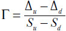

<!-- 原 EPUB 中此公式为图片，已原样保留 -->

<!-- source:block bf98f41925012fa5 -->

> [!quote]- English 84
> In Figure 19-4, we can see that as we move from *C*0,0 to either *C*1,1 or *C*1,0, the option’s delta will either go up to 81 or down to 31. At the same time, the stock will either move up to 105.00 or move down to 95.24. The gamma is therefore

在图19-4中，我们可以看到，当我们从C 0，0移动到C1，1或C1，0时，期权的Delta要么上升到81，要么下降到31。与此同时，该股要么上涨至105.00，要么下跌至95.24。因此，Gamma是

<!-- source:block 7717aa0d47da9291 -->

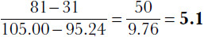

<!-- 原 EPUB 中此公式为图片，已原样保留 -->

<!-- source:block 573afcaabdeed4b8 -->

> [!quote]- English 85
> The initial gamma of the 100 call is 5.1.

100看涨期权的初始Gamma是5.1。

<!-- source:block adb9f75497c67e40 -->

> [!quote]- English 86
> We can calculate the gamma at any point along the binomial tree by dividing the change in the option’s delta by the change in the underlying price

我们可以通过将期权Delta的变化除以标的价格的变化来计算二项树上任何点的Gamma

<!-- source:block 498f4ca3edd4c6f6 -->

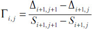

<!-- 原 EPUB 中此公式为图片，已原样保留 -->

<!-- source:block dea5ca58f00bf9f8 -->

## Theta（时间敏感度） / The Theta

<!-- source:block 1dfee72dd07f890a -->

> [!quote]- English 87
> The theta is the change in an option’s value as time passes, assuming everything else, including the underlying price, remains unchanged. In a binomial model, at each time period, the underlying price is assumed to move either up or down. The underlying price remains unchanged only after two time periods, when the underlying price either goes up and down or down and up. To approximate the theta, we must therefore consider the change in the option’s value over two time periods.

Theta是期权价值随着时间的推移而发生的变化，假设其他一切（包括标的价格）保持不变。在二项模型中，在每个时间段，假设标的价格要么向上或向下移动。只有在两个时间段后，标的价格才会保持不变，此时标的价格要么上下波动，要么上下波动。因此，为了逼近Theta，我们必须考虑两个时间段内期权价值的变化。

<!-- source:block de312188a372d03c -->

> [!quote]- English 88
> In Figure 19-4, we can see that as we move from *C*0,0 to *C*2,1, the value of the 100 call drops from 5.22 to 2.92, for a loss in value of 2.30. If we want to estimate the daily theta, we can divide by the number of days during this two-period time

在图19-4中，我们可以看到，当我们从C 0，0移动到C2，1时，100看涨的值从5.22下降到2.92，损失值为2.30。如果我们想估计每日Theta，我们可以除以这两段时间内的天数

<!-- source:block 157917115bdb455f -->

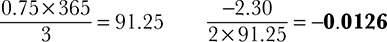

<!-- 原 EPUB 中此公式为图片，已原样保留 -->

<!-- source:block ae85a8ddb8a1b8de -->

> [!quote]- English 89
> We can approximate the daily theta at any point along the tree as

我们可以将树上任何点的每日Theta估计为

<!-- source:block 14406b5124e11944 -->

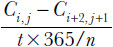

<!-- 原 EPUB 中此公式为图片，已原样保留 -->

<!-- source:block 75bad671ad6110d2 -->

## Vega 与 Rho / Vega and Rho

<!-- source:block e524c9065aa1780a -->

> [!quote]- English 90
> It would be convenient if we could use the same simple arithmetic to calculate the vega and rho that we used to calculate the delta, gamma, and theta. Unfortunately, there is no simple solution to the volatility and interest-rate sensitivities. To determine the vega, we must change the volatility input—we will see shortly how we determine this input—and then see how the option’s value changes. To determine the rho, we must change the interest-rate input.

如果我们能用计算Delta、Gamma和Theta的同样简单的算法来计算Vega和Rho，那就方便了。不幸的是，对于波动率和利率敏感性没有简单的解决方案。为了确定Vega，我们必须改变波动率的输入我们将很快看到如何确定这个输入然后看看期权的价值如何变化。为了确定ρ，我们必须改变利率输入。

<!-- source:block 99c1d4df1c6b06a1 -->

## u 与 d 的取值 / The Values of u and d

<!-- source:block adf66096744fadcb -->

> [!quote]- English 91
> We have chosen the upward move *u* and downward move *d* so that they form a *recombining* binomial tree. The terminal price for the security is independent of the order in which the price moves occur. Whether the security moves up first and then down or down first and then up, the result is the same

我们已经选择了向上移动u和向下移动d，以便它们形成重组二叉树。证券的最终价格与价格变动发生的顺序无关。无论证券先涨后跌还是先跌后涨，结果都是一样的

<!-- source:block 5d5313fe4814db28 -->

> [!quote]- English 92
> *u* × *d* = *d* × *u*

$$
u\,\times\,d =\,d \times\,u
$$

<!-- source:block 8f17fddbef553605 -->

> [!quote]- English 93
> If the upward and downward moves were not recombining, the number of calculations would be greatly increased because each node on the binomial tree would yield a completely new set of upward and downward values.

如果向上和向下的移动没有重新组合，计算的数量就会大大增加，因为二项树上的每个节点都会产生一组全新的向上和向下的值。

<!-- source:block aaea61909588a612 -->

> [!quote]- English 94
> We have also chosen *u* and *d* so that they are the multiplicative inverse of each other

我们还选择了u和d，以便它们是彼此的乘逆

<!-- source:block caf02eba0e7b5ffb -->

> [!quote]- English 95
> *u* × *d* = *d* × *u* = 1.00

$$
u\,\times\,d =\,d \times\,u = 1.00
$$

<!-- source:block b7acbb24e8ce7431 -->

> [!quote]- English 96
> This ensures that if the security makes an upward move followed by a downward move or a downward move followed by an upward move, the resulting underlying price will be same price at which it began. If *u* and *d* were not inverses, there would be a *drift* in the underlying price. If, for example, *u* and *d* were chosen to be 1.25 and 0.75, then there would be a downward drift because

这确保了如果证券先向上移动然后向下移动或先向下移动然后向上移动，那么产生的标的价格将与其开始时的价格相同。如果u和d不是倒置的，那么标的价格就会出现漂移。例如，如果u和d被选择为1.25和0.75，那么就会出现向下漂移，因为

<!-- source:block c53ed2e1311ddfbe -->

> [!quote]- English 97
> *u* × *d* = 1.25 × 0.75 = 0.9375

$$
u\,\times\,d = 1.25 \times 0.75 = 0.9375
$$

<!-- source:block 3efc60b4f60ef887 -->

> [!quote]- English 98
> In order to calculate the theta, as we did previously, we need to eliminate the drift in the underlying price. This will be true if *u* and *d* are multiplicative inverses.

为了像我们之前所做的那样计算Theta，我们需要消除标的价格的漂移。如果u和d是乘逆，则这将成立。

<!-- source:block 8284a92a12b4c16e -->

> [!quote]- English 99
> Other than the restrictions that *u* and *d* are inverses and result in a driftless underlying price, we have not specified exactly what the values of *u* and *d* should be. It will not come as a surprise that *u* and *d* must be derived from the volatility input. If we want binomial values to approximate Black-Scholes values, *u* and *d* must be chosen in such a way that the terminal prices approximate a lognormal distribution. We can achieve this by defining *u* and *d* as a one standard deviation price change over each time period in our binomial tree

除了u和d倒置并导致标的价格无漂移的限制之外，我们还没有确切指定u和d的值应该是多少。u和d必须从波动率输入中得出，这并不奇怪。如果我们希望二项值接近Black-Scholes值，那么u和d的选择必须使终端价格接近对数正态分布。我们可以通过将u和d定义为二项树中每个时间段内的一个标准差价格变化来实现这一目标

<!-- source:block 8a696b494601c7db -->

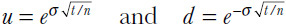

<!-- 原 EPUB 中此公式为图片，已原样保留 -->

<!-- source:block 5d2366f264816e38 -->

> [!quote]- English 100
> In our three-period example, what volatility does *u* = 1.05 represent? To determine this, we can work backwards to solve for the volatility σ

在我们的三期例子中，u = 1.05代表什么波动率？为了确定这一点，我们可以向后工作，以解决波动率σ

<!-- source:block da467e485ee22038 -->

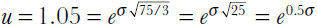

<!-- 原 EPUB 中此公式为图片，已原样保留 -->

<!-- source:block 4e8c959e3e71a0d4 -->

> [!quote]- English 101
> Taking the natural logarithm of each side, we get

取每边的自然对数，我们得到

<!-- source:block cbd3aa6b6d1f09bb -->

> [!quote]- English 102
> ln(1.05) = ln(e0.5σ) >> 0.0488 = 0.5σ >> σ =0.0976 (9.76%)

$$
\ln(1.05) = \ln(e^{0.5\sigma}) \Rightarrow 0.0488 = 0.5\sigma \Rightarrow \sigma =0.0976 (9.76\%)
$$

<!-- source:block aedc45de422fe3fc -->

> [!quote]- English 103
> In our three-period example, we used a volatility of 9.76 percent.

在我们的三期示例中，我们使用了9.76%的波动率。

<!-- source:block 0496fb0be68093ff -->

## Gamma 租金 / Gamma Rent

<!-- source:block e07eb054e892da74 -->

> [!quote]- English 104
> In theory, every volatility position in the option market represents a tradeoff between the cash flow created by the dynamic hedging process and the decay in the option’s value as time passes. A positive gamma, negative theta position will make money through dynamic hedging but lose money through time decay. A negative gamma, positive theta position will perform just the opposite, losing money through dynamic hedging but making money through time decay. Traders sometimes refer to volatility trading as *renting* the gamma, with the rental costs being equal to the theta.

理论上，期权市场中的每一个波动率头寸都代表了动态对冲过程产生的现金流与期权价值随着时间的推移而衰减之间的权衡。正的Gamma、负的Theta头寸将通过动态对冲赚钱，但通过时间衰变而赔钱。负Gamma、正Theta头寸的表现恰恰相反，通过动态对冲赔钱，但通过时间衰变赚钱。交易员有时将波动率交易称为租用Gamma，租用成本等于Theta。

<!-- source:block 79898cf7aa3c1850 -->

> [!quote]- English 105
> Over a given time period, how much movement is required in the underlying contract to offset the effects of time decay? We can give an approximate answer by going back to our binomial tree. We know that a delta-neutral position taken at theoretical value will just break even if the underlying contract moves either up by *u* or down by *d*. The magnitudes of the *u* and *d* are equal to

在给定的时间段内，标的合约需要多少变动才能抵消时间衰变的影响？我们可以通过回到我们的二项树来给出大致的答案。我们知道，如果标的合约上涨u或下跌d，以理论价值采取的Delta中性头寸就会盈亏平衡。u和d的大小等于

<!-- source:block 258aba23bb47899c -->

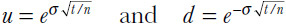

<!-- 原 EPUB 中此公式为图片，已原样保留 -->

<!-- source:block 578a16df46fed202 -->

> [!quote]- English 106
> But these values are equal to a one standard deviation price change over the time interval *t*/*n*. Therefore, over any interval of time, the amount of price movement needed in the underlying contract to just break even must be equal to one standard deviation.

但这些值等于时间间隔t/n内一个标准差的价格变化。因此，在任何时间间隔内，标的合约中盈亏平衡所需的价格变动量必须等于一个标准差。

<!-- source:block e9ca64ce627f4510 -->

> [!quote]- English 107
> The reason that this is only an approximation is that while *u* and *d* re-main constant, theta changes, sometime very rapidly, as time passes. For very short time intervals or with a great deal of time remaining to expiration, this approximation will be reasonably accurate. However, over longer time intervals or with very little time remaining to expiration, the changes in the theta will cause the approximation to be less accurate.

这只是一个近似值的原因是，虽然u和d仍然是主要常数，但随着时间的推移，Theta会发生变化，有时非常快。对于非常短的时间间隔或距离到期还有很长的时间，这种近似将相当准确。然而，在较长的时间间隔内或距离到期剩余时间很少的情况下，Theta的变化将导致逼近不太准确。

<!-- source:block d87787d575c607b7 -->

## 美式期权 / American Options

<!-- source:block 44ce0392e1b8862b -->

> [!quote]- English 108
> Let’s go back to our three-period binomial tree in Figure 19-1. But instead of calculating the value of a 100 call, as we did in Figure 19-4, let’s work backwards from the terminal prices to calculate the value of a 100 put. The underlying prices, theoretical values, and delta and gamma values for the 100 put are all shown in Figure 19-5. The reader may wish to confirm that the call and put values in Figures 19-4 and 19-5 are consistent with basic principles of option pricing: at every node, put-call parity is maintained; the absolute values of call and put deltas always add up to 100; and the call and put gammas are identical.

让我们回到图19-1中的三期二项树。但我们不要像图19-4中所做的那样计算100看涨期权的价值，而是从终端价格向后计算100看跌期权的价值。100看跌期权的标的价格、理论值以及Delta和Gamma值均如图19-5所示。读者可能希望确认，图19-4和19-5中的看涨和看跌价值与期权定价的基本原则一致：在每个节点，看跌-看涨平价都得到维持;看涨和看跌Delta的绝对值总和总是为100;看涨和看跌Gamma是相同的。

<!-- source:block 292b81587762090f -->

*Figure 19-5 The value of a 100 put at any point along the binomial tree. / Figure 19-5 The value of a 100 put at any point along the binomial tree.*

<!-- source:block 96387c32eeae95c1 -->

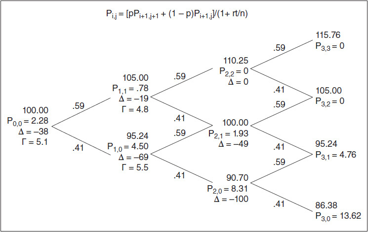

<!-- source:block 12808a8683bd675b -->

> [!quote]- English 110
> If we assume that the 100 put is European and cannot be exercised early, the only reason to calculate the intermediate values is to determine the delta and gamma. But suppose that the 100 put is American. Might there be any reason to exercise the option prior to expiration?

如果我们假设100看跌期权是欧式期权，不能提前行权，那么计算中间值的唯一原因就是确定Delta和Gamma。但是假设100 看跌期权是美国的。是否有任何理由在到期前行权期权？

<!-- source:block cf7c29fd047998b3 -->

> [!quote]- English 111
> Look closely at the value of the 100 put at *P*2,0 in Figure 19-5. The theoretical value of the put is 8.31. But with an underlying price of 90.70 the put has an intrinsic value of 9.30. If the put is American, anyone holding the put under those conditions will choose to exercise it early. If we are using a binomial tree to evaluate an American option, we might compare the value of the European option with the intrinsic value at each node. If the intrinsic value is greater than the European value, we can replace the value at that node with the option’s intrinsic value and then continue to work backwards to determine the option’s value at each preceding node. If we replace the value at *P*2,0 with 9.30, the put value at *P*1,0 will be

仔细观察图19-5中P2，0处100的值。看跌期权的理论值为8.31。但标的价格为90.70，看跌期权的内在价值为9.30。如果看跌期权是美国的，任何在这些条件下持有看跌期权的人都会选择提前行权它。如果我们使用二项树来评估美式期权，我们可能会将欧式期权的价值与每个节点的内在价值进行比较。如果内在价值大于欧洲价值，我们可以用期权的内在价值替换该节点的价值，然后继续向后工作以确定期权在每个之前节点的价值。如果我们用9.30替换P2，0处的值，则P1，0处的看跌值将为

<!-- source:block 01d843b1fc66ceeb -->

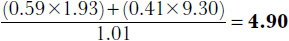

<!-- 原 EPUB 中此公式为图片，已原样保留 -->

<!-- source:block 30687bb201f76884 -->

> [!quote]- English 112
> We need to replace the European value of 4.50 at *P*1,0 with the American value of 4.90.

我们需要将P1，0处的欧洲值4.50替换为美国值4.90。

<!-- source:block 0aebf227306366fe -->

> [!quote]- English 113
> Finally, the initial value, *P*0,0, is

最后，初始值P0，0为

<!-- source:block 62f033abd74242af -->

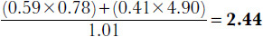

<!-- 原 EPUB 中此公式为图片，已原样保留 -->

<!-- source:block e1e2904c134a8834 -->

> [!quote]- English 114
> Because the delta and gamma are calculated from option values at every node, these new values will affect the calculation of the delta and gamma for an American option. The initial delta of the 100 put if it is American is

由于Delta和Gamma是根据每个节点的期权值计算的，因此这些新值将影响美式期权Delta和Gamma的计算。如果是美国的，100看跌期权的初始Delta是

<!-- source:block 555261e3dc3f80a8 -->

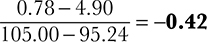

<!-- 原 EPUB 中此公式为图片，已原样保留 -->

<!-- source:block 826115e6899f8852 -->

> [!quote]- English 115
> The delta of the European 100 put was –38, but the delta of American 100 put is –42. The values for an American 100 put at every node are shown in Figure 19-6. Because the delta is affected by the possibility of early exercise, the gamma will also be affected. The gamma for the 100 put is now

欧洲100看跌期权的Delta为-38，但美国100看跌期权的Delta为-42。每个节点的美国100看跌值如图19-6所示。由于Delta受到提前行权可能性的影响，因此Gamma也会受到影响。100看跌期权的Gamma是现在

<!-- source:block 650a9ef0b753ddda -->

*图19-6美国100看跌期权的价值。 / Figure 19-6 The value of an American 100 put.*

<!-- source:block 243dc5f1069bf120 -->

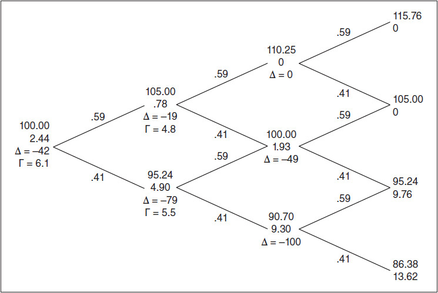

<!-- source:block c2c66ea8c43fdc48 -->

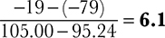

<!-- 原 EPUB 中此公式为图片，已原样保留 -->

<!-- source:block 7cf26e262bcc5dfc -->

> [!quote]- English 117
> rather than a gamma of 5.1 for the European option.

而不是欧式期权的5.1的Gamma。

<!-- source:block 81e77184cb4172ed -->

## 股息 / Dividends

<!-- source:block 3d529f7e50c3f122 -->

> [!quote]- English 118
> How does the possibility of early exercise affect the value of a call? If we look at the call value at every node in Figure 19-4, we find that at no point is it less than intrinsic value. This means that the European and American values must be the same. And, indeed, we know from Chapter 16 that if a stock does not pay a dividend over the life of the option, there is never any reason to exercise an American stock option call early.

提前行权的可能性如何影响看涨期权的价值？如果我们查看图19-4中每个节点的看涨期权值，我们会发现它在任何时候都不小于内在值。这意味着欧洲和美国的价值观必须相同。事实上，我们从第16章中知道，如果股票在期权有效期内不支付股息，那么就没有任何理由提前行权美国股票期权看涨。

<!-- source:block 620aa1f11026f001 -->

> [!quote]- English 119
> But what if the stock does pay a dividend? Suppose that the stock in Figure 19-1 will pay a dividend of 2.00 at some point during the last time period. When a stock pays a dividend, its price typically drops by the amount of the dividend. Consequently, each terminal price in our binomial tree will be reduced by the amount of the dividend,4 as shown in Figure 19-7. (The terminal values if there is no dividend are shown in parentheses.) If we want to calculate the value of the 100 call, we can use these new terminal prices. Then, as before, we can use the probabilities *p* and 1 – *p* to calculate the theoretical value and delta of the 100 call at each node of the binomial tree. These values are shown in Figure 19-8.

但如果股票确实支付股息怎么办？假设图19-1中的股票将在上一个时间段的某个时间点支付2.00的股息。当股票支付股息时，其价格通常会下跌股息金额。因此，我们的二项树中的每个终端价格都将减少股息金额，[^ovp19-4]，如图19-7所示。(The如果没有股息，最终值显示在括号中。）如果我们想计算100看涨期权的价值，我们可以使用这些新的终端价格。然后，与之前一样，我们可以使用概率p和1 - p来计算二项树每个节点处100看涨期权的理论值和Delta。这些值如图19-8所示。

<!-- source:block db8a7914d048c59a -->

*图19-7带有股息支付的二项树 / Figure 19-7 A binomial tree with dividend payment*

<!-- source:block 7de00f609e1bdfbc -->

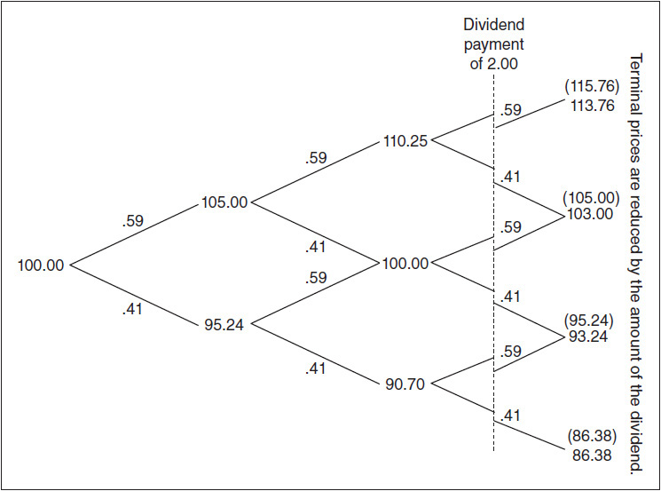

<!-- source:block 36922e4fed122d89 -->

*图19-8欧洲看涨股息股票的价值。 / Figure 19-8 The value of a European call on a dividend-paying stock.*

<!-- source:block 69de277a1f51544b -->

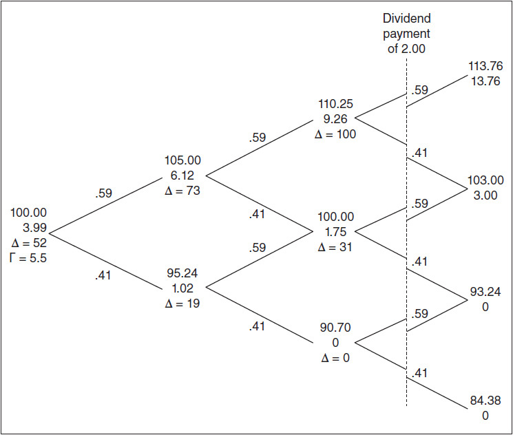

<!-- source:block f9e0c34d1d49b05c -->

> [!quote]- English 122
> The value for the 100 call in Figure 19-8 is a European value because we never considered the possibility of early exercise. But look more closely at the value of the call one time period prior to expiration with the stock price at 110.25. The theoretical value of the 100 call is 9.26. But, with a stock price of 110.25, the call has an intrinsic value of 10.25. If the call is American, anyone holding the call under these conditions will choose to exercise it early. As we did with an American put, at each node, we can compare the European value of the call with its intrinsic value. If the intrinsic value is greater than the European value, we can replace the value at that node with the option’s intrinsic value and then continue to work backwards to determine the option’s value at each preceding node. The initial value of the call, *C*0,0, will then be the value of an American call. The complete binomial tree for the American 100 call is shown in Figure 19-9.

图19-8中的100看涨期权值是欧洲值，因为我们从未考虑过提前行权的可能性。但更仔细地观察到期前一段时间的看涨期权价值，股价为110.25。100看涨的理论值为9.26。但是，股价为110.25，该看涨期权的内在价值为10.25。如果看涨期权是美式期权，在这种情况下持有看涨期权的人会选择提前行权。正如我们对美式看跌期权所做的那样，在每个节点上，我们可以将看涨期权的欧式价值与其内在价值进行比较。如果内在价值大于欧洲价值，我们可以用期权的内在价值替换该节点的价值，然后继续向后工作以确定期权在每个之前节点的价值。看涨期权的初始值C 0，0将是美国看涨期权的值。美国100看涨期权的完整二项树如图19-9所示。

<!-- source:block a073d2ce5bdf746a -->

*图19-9美国人对派息股票的看涨价值。 / Figure 19-9 The value of an American call on a dividend-paying stock.*

<!-- source:block 507b361a391541f2 -->

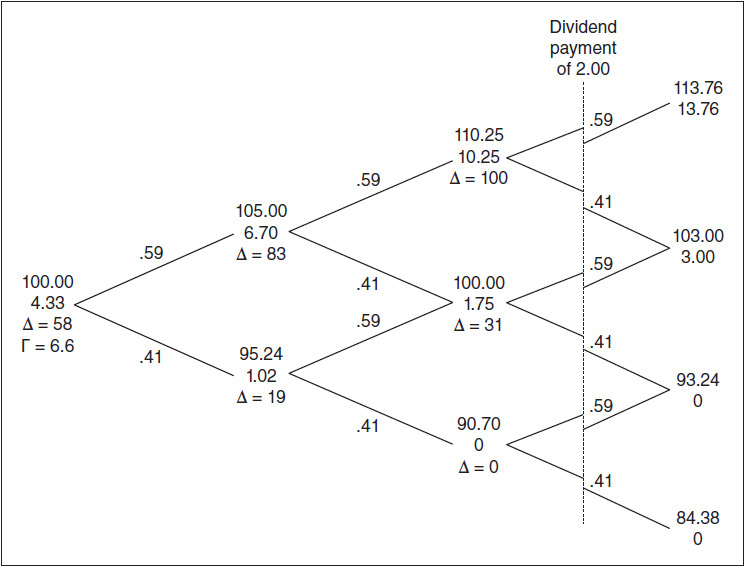

<!-- source:block f98f8e99ebbdf461 -->

> [!quote]- English 124
> If we want to construct a binomial tree for a dividend-paying stock, it might seem that we can simply reduce all stock prices following the dividend payment by the amount of the dividend. In Figure 19-7, where the dividend was paid over the last time period, this reduced the terminal prices by 2.00. But suppose that the dividend is paid during the next-to-last time period, as shown in Figure 19-10. The stock prices at the following nodes are reduced by 2.00. But look at what happens when we continue to calculate stock prices using *u* = 1.05 and *d* = 0.9524. The subsequent stock prices do not recombine. Each node begins a new binomial tree. In our three-period binomial tree, this may not seem like a significant problem. We can still calculate the value of an option using the terminal stock prices (now there are six terminal prices instead of four) and then work backward to determine the option’s theoretical value. The value for the 100 call using our new binomial tree is shown in Figure 19-11.

如果我们想为支付股息的股票构建一个二项树，那么我们似乎可以简单地将支付股息后的所有股票价格减少股息金额。在图19-7中，股息是在上一个时期支付的，这使终端价格降低了2.00。但假设股息是在倒数第二个时间段支付的，如图19-10所示。以下节点股价下调2.00。但看看当我们继续使用u = 1.05和d = 0.9524计算股价时会发生什么。随后的股价不会重组。每个节点开始一棵新的二项树。在我们的三期二项树中，这似乎不是一个重大问题。我们仍然可以使用终端股票价格计算期权的价值（现在有六个终端价格而不是四个），然后向后计算期权的理论价值。使用新的二项树进行100看涨期权的值如图19-11所示。

<!-- source:block a0855a311d94433c -->

*图19-10支付股息股票的美式看涨期权价值 / Figure 19-10 The value of an American call on a dividend-paying stock.*

<!-- source:block 2804177a4339ca25 -->

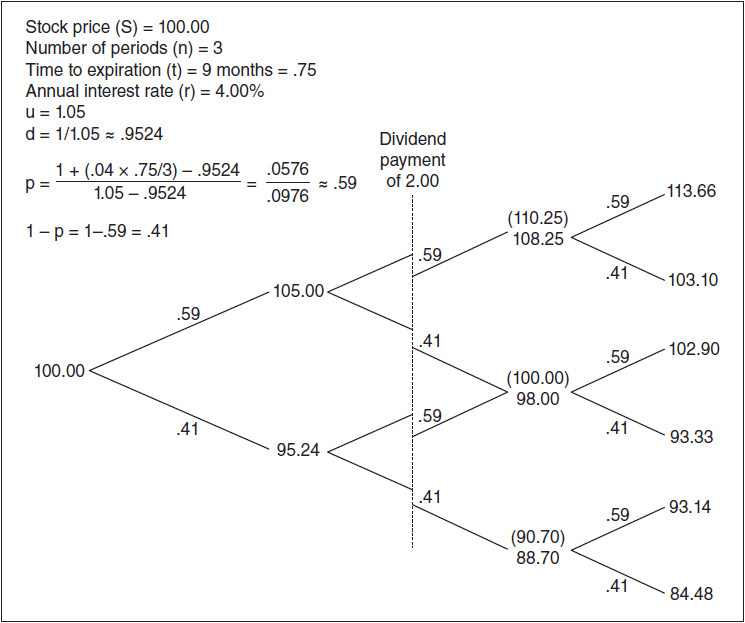

<!-- source:block 4e675eb48439815d -->

*图19-11提前支付股息的二项树。 / Figure 19-11 A binomial tree with an early dividend payment.*

<!-- source:block 560662fd3b43e702 -->

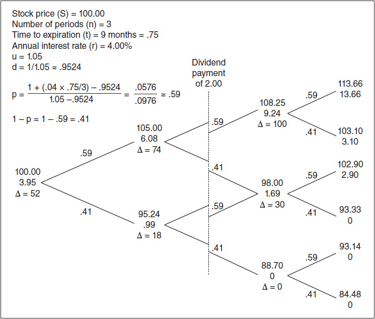

<!-- source:block 7f5efe3f628343b7 -->

> [!quote]- English 127
> What if there are multiple dividend payments over the life of the option? And what if our binomial tree consists of many time periods? Because each dividend payment generates a new set of binomial prices, the number of calculations required to value an option will be greatly increased, perhaps to the point of being unwieldy. This presents a problem to which there is no ideal solution. Perhaps the simplest way to handle dividend payments is to create a complete binomial tree without dividends and then reduce the stock price at each node by the total amount of dividends. An example of this is shown in Figure 19-12, which represents an approximation of the call option value generated in Figure 19-11. Instead of generating new binomial prices after the dividend payment, we have simply reduced all subsequent values by the 2.00 amount of the dividend. We can see that this is only an approximation. The call values in Figure 19-12 tend to be slightly larger than the values in Figure 19-11.

如果期权有效期内有多次股息支付怎么办？如果我们的二项树由多个时间段组成怎么办？由于每次股息支付都会产生一组新的二项价格，因此评估期权所需的计算数量将大大增加，也许达到难以操作的地步。这提出了一个没有理想解决方案的问题。也许处理股息支付的最简单方法是创建一个没有股息的完整二项树，然后将每个节点的股价减少股息总额。图19-12显示了其中的一个例子，它代表了图19-11中生成的看涨期权值的近似值。我们没有在股息支付后生成新的二项价格，而是简单地将所有后续值减少2.00股息金额。我们可以看到这只是一个近似值。图19-12中的看涨期权值往往略大于图19-11中的值。

<!-- source:block e1f113ed6d9b5507 -->

*图19-12美国人对派息股票的看涨价值。 / Figure 19-12 The value of an American call on a dividend-paying stock.*

<!-- source:block 880ca68c33677fab -->

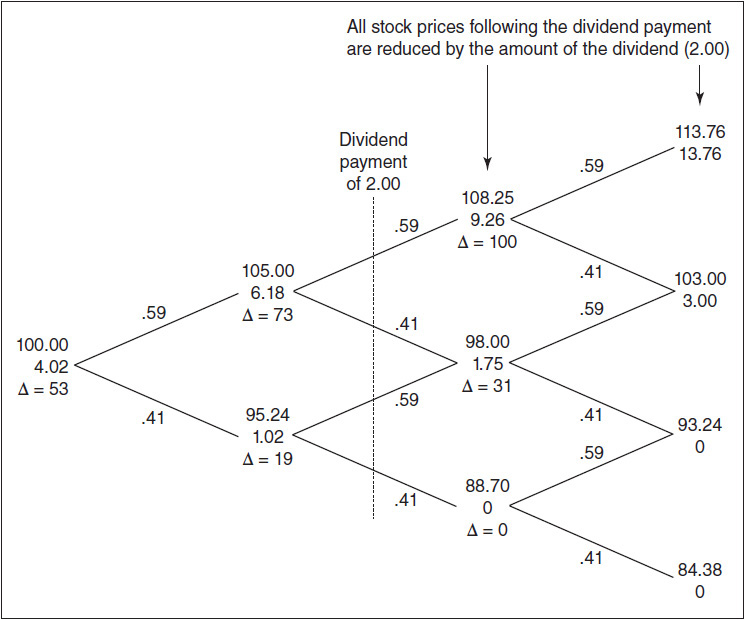

<!-- source:block fd558d9b647c596f -->

> [!quote]- English 129
> One final comment about the values for *p* and 1 – *p*. We typically expect a probability to fall between 0 to 1.00, that is, somewhere between “no chance” and “absolute certainty.” However, this is not necessarily true for *p* and 1 – *p*. Consider the conditions in Figure 19-11:

关于p和1 -p值的最后一点评论。我们通常预计概率介于0到1.00之间，即介于“没有机会”和“绝对确定”之间。然而，对于p和1 -p来说，这不一定成立。考虑图19-11中的条件：

<!-- source:block 8e75a63c2a055b2e -->

> [!quote]- English 130
> Stock price *S* = 100

$$
\text{Stock price}\,S = 100
$$

<!-- source:block c4ac7b1c736a9f00 -->

> [!quote]- English 131
> Time to expiration *t* = 9 months

$$
\text{Time to expiration}\,t = 9 \text{months}
$$

<!-- source:block 3a8c30e57f5857cd -->

> [!quote]- English 132
> Number of periods *n* = 3

$$
\text{Number of periods}\,n = 3
$$

<!-- source:block b7e54b3afb2a27b9 -->

> [!quote]- English 133
> Interest rate *r* = 4 percent

$$
\text{Interest rate}\,r = 4 \text{percent}
$$

<!-- source:block 2a989d022e9bf4d2 -->

> [!quote]- English 134
> *u* = 1.05

$$
u\,= 1.05
$$

<!-- source:block 50bd53825b97ce92 -->

> [!quote]- English 135
> *d* = 1/*u* = 0.9524

$$
d\,= 1/u\,= 0.9524
$$

<!-- source:block a56c9e9700928fe8 -->

> [!quote]- English 136
> The values for *p* and 1 – *p* resulting from these values are 0.59 and 0.41, respectively. But suppose that we are in a high inflationary climate and that instead of setting *r* equal to 4 percent, we set *r* equal to 40 percent. The new values of *p* and 1 – *p* will be

由这些值产生的p和1 - p的值分别为0.59和0.41。但假设我们处于高通胀气候中，并且我们将r设置为4 %，而不是将r设置为40 %。p和1 - p的新值将是

<!-- source:block ad6f4f4cd8bd9975 -->

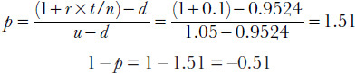

<!-- 原 EPUB 中此公式为图片，已原样保留 -->

<!-- source:block b31ea2ff3d8dd740 -->

> [!quote]- English 137
> Thus *p* and 1 – *p* no longer look like traditional probabilities: *p* exceeds 1.00, and 1 – *p* is negative. In fact, *p* and 1 – *p* can fall outside the range for a typical probability. For this reason, they are sometimes referred to as *pseudoprobabilities*.

因此，p和1 - p看起来不再像传统的概率：p超过1.00，并且1 - p为负。事实上，p和1 - p可能超出典型概率的范围。因此，它们有时被称为伪概率。

<!-- source:block 6f65da6619db2e0c -->

> [!quote]- English 138
> What is the implication of *p* being greater than 1.00 and 1 – *p* being less than 0? This means that the potential for movement in the underlying stock is not sufficiently large to offset the interest loss should we buy the stock. In our example with *u* = 1.05, if the stock price always rises over each time period, we will show a profit of 5 percent. But with an interest rate of 30 percent, we would always be better off leaving our money in the bank and earning interest over each three-month time period of

p大于1.00且1 - p小于0意味着什么？这意味着标的股票的变动潜力不足以抵消我们购买该股票时的利息损失。在u = 1.05的示例中，如果股价在每个时间段始终上涨，则我们将显示5%的利润。但利率为30%，我们最好将钱留在银行，并在每三个月的时间内赚取利息

<!-- source:block c48463ce7dc17169 -->

> [!quote]- English 139
> 0.30/4 = 7.5%

$$
0.30/4 = 7.5\%
$$

<!-- source:block b37be7fddb60d0a2 -->

> [!quote]- English 140
> Of course, if we increase the stock volatility by increasing the value of *u*, then the potential profit from investing in the stock will go up. If we choose a large enough value for *u*, the values for *p* and 1 – *p* will indeed fall between 0 and 1.00. Because the value for *u* must be greater than 1 + *r* × *t*/*n*, with an interest rate of 30 percent, *u* must be greater than

当然，如果我们通过增加u的值来增加股票波动率，那么投资股票的潜在利润就会上升。如果我们为u选择一个足够大的值，p和1 - p的值确实会落在0和1.00之间。由于u的值必须大于1 + r x t/n，利率为30%，所以u必须大于

<!-- source:block c35082f879cf6a02 -->

> [!quote]- English 141
> 1 + 0.3 × 0.75/3 = 1.075

$$
1 + 0.3 \times 0.75/3 = 1.075
$$

<!-- source:block 437f1d969ff4ff63 -->

> [!quote]- English 142
> As we did with the Black-Scholes model, we can use the binomial model to evaluate options on different underlying instruments. The binomial model and its variations are shown in Figure 19-13.

正如我们使用Black-Scholes模型所做的那样，我们可以使用二项模型来评估不同标的工具的期权。二项模型及其变化见图19-13。

<!-- source:block 29b307451f017792 -->

*图19-13 / Figure 19-13*

<!-- source:block 359cf8042f93b160 -->

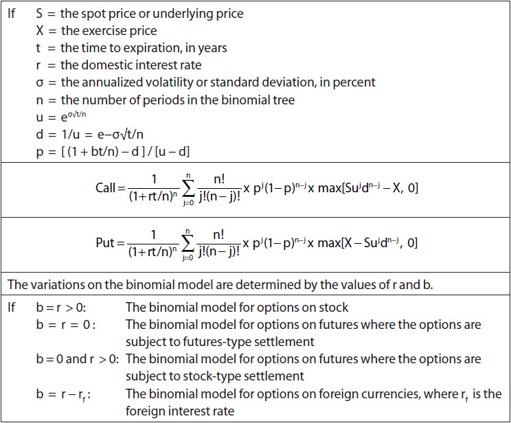

<!-- source:block 6c21cf2f0a9afeb5 -->

<!-- source:block 79fc88ed0bb44e70 -->

> [!quote]- English 144
> How close are option values generated by a binomial model to those generated by the Black-Scholes model? This question only makes sense for European options because the Black-Scholes model cannot be used to evaluate American options. In our three-period binomial tree, the value of a European 100 call is 5.22, and the value of a 100 put is 2.28. Using the Black-Scholes model, the values are 5.01 and 2.05. Both binomial values are greater than the true Black-Scholes values. We can increase the accuracy of the binomial model by increasing the number of time periods. In a four-period binomial tree, the values are 4.79 and 1.84. Figure 19-14 shows the difference between the Black-Scholes and binomial values for the 100 call as we increase the number of time periods from 1 to 10. We can see that the error oscillates between positive and negative, with the absolute value of the error becoming smaller and smaller. Indeed, if we build a tree with an infinite number of time periods, the error will converge to 0. The binomial and Black-Scholes values will be identical.

二项模型生成的期权价值与Black-Scholes模型生成的期权价值有多接近？这个问题只对欧洲期权有意义，因为布莱克-斯科尔斯模型不能用于评估美国期权。在我们的三期二项树中，欧洲100看涨的值为5.22，而100看跌的值为2.28。使用Black-Scholes模型，值为5.01和2.05。两个二项式值都大于真实的Black-Scholes值。我们可以通过增加时间段的数量来提高二项式模型的准确性。在四周期二叉树中，值为4.79和1.84。图19-14显示了当时间段数从1增加到10时，100看涨期权的Black-Scholes和二项式期权之间的差异。我们可以看到，误差在正负之间波动，误差的绝对值越来越小。事实上，如果我们构建一棵具有无限多个时间段的树，那么误差就会收敛到0。二项值和布莱克-斯科尔斯值将相同。

<!-- source:block 55a277168a95df32 -->

*图19-14随着周期数的增加，二项值收敛到布莱克-斯科尔斯值。 / Figure 19-14 As we increase the number of periods, the binomial value converges to the Black-Scholes value.*

<!-- source:block 8e0f9149ea451391 -->

<!-- source:block 2dbabd24d67778cc -->

> [!quote]- English 146
> How many periods should we use in a binomial model? As we divide the time to expiration into smaller and smaller increments, we increase the accuracy. But a greater number of periods also increases the number of calculations, and this number increases exponentially. Given the tradeoff between accuracy and speed, a common choice is often somewhere between 50 and 100 periods.

在二项式模型中我们应该使用多少个周期？当我们将到期时间划分为越来越小的增量时，我们增加了准确性。但是更多的周期数也增加了计算的数量，并且这个数量呈指数增长。考虑到准确性和速度之间的权衡，通常选择50到100个周期。

<!-- source:block a2e08e15d9a794e4 -->

> [!quote]- English 147
> The accuracy of a binomial calculation can be further increased by taking the average value generated by two periods, sometimes referred to as *half-steps*. For example, the 9-period tree overvalues the 100 call by about 0.07 (Black-Scholes value – binomial value = –0.07), whereas the 10-period tree undervalues the call by about 0.09. If we take the average of the 9- and 10-period values (a 9½-period value), the option is undervalued by only 0.01. The results of this averaging procedure can be seen in Figure 19-14.

通过取两个时期产生的平均值（有时称为半步），可以进一步提高二项计算的准确性。 例如，9-period树将100 看涨期权高估了约0.07（Black-Scholes值-二项值= -0.07），而10-period树将该看涨期权低估了约0.09。如果我们取9和10周期值的平均值（9½周期值），则该期权仅被低估了0.01。 此平均过程的结果可参见图19-14。

<!-- source:block b0ba6e1c10ff4669 -->

> [!note] Footnote 148
> 1 John C. Cox, Stephen A. Ross, and Mark Rubinstein, “Option Pricing: A Simplified Approach,” *Journal of Financial Economics* 7(3):229–263, 1979.

[^ovp19-1]: 约翰·C.斯蒂芬·A·考克斯Ross和Mark Rubinstein，“期权定价：简化方法”，Journal of Financial Economics 7（3）：229-263，1979年。

<!-- source:block a02a8ac7ec09669a -->

<!-- source:block ab6e4a4aa010cfcf -->

> [!note] Footnote 149
> 3 For simplicity, binomial trees are often drawn symmetrically from top to bottom. However, this can be somewhat misleading. If drawn to scale, the branches typically become narrower as we move from top to bottom. We can see this in Figure 19-1: 115.76 – 105.00 = 10.76 (the top two branches); 105.00 – 95.24 = 9.76 (the middle two branches); 95.24 – 86.38 = 8.86 (the bottom two branches). Because 10.76 > 9.76 > 8.86, the branches must be getting narrower.

[^ovp19-3]: 为了简单起见，二项树通常从上到下对称绘制。然而，这可能会带来一定的误导。如果按比例绘制，当我们从上到下移动时，分支通常会变得更窄。我们可以在图19-1中看到这一点：115.76 - 105.00 = 10.76（顶部两个分支）; 105.00 - 95.24 = 9.76（中间两个分支）; 95.24 - 86.38 = 8.86（底部两个分支）。因为10.76 > 9.76 > 8.86，所以分支一定越来越窄。

<!-- source:block e18268f715fb0425 -->

> [!note] Footnote 150
> 4 For simplicity, we ignore the interest that can be earned on the dividend payment. A more accurate binomial tree should also include this amount.

[^ovp19-4]: 为了简单起见，我们忽略了股息支付可以赚取的利息。更准确的二项树还应该包括这个数量。

---

[[Option Volatility and Pricing 导航|← 返回阅读导航]]

<!-- chapter-nav:start -->
> [!tip] 章节导航（章末）
> [[Black–Scholes 模型 The Black-Scholes Model|← 上一章]] · [[Option Volatility and Pricing 导航|全书导航]] · [[再论波动率 Volatility Revisited|下一章 →]]
<!-- chapter-nav:end -->
