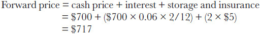
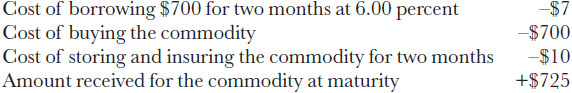
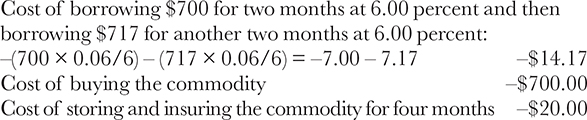
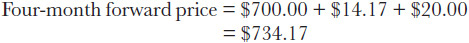
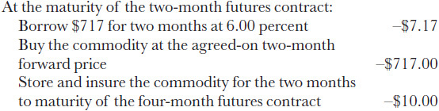
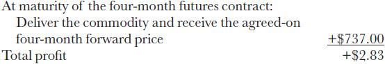
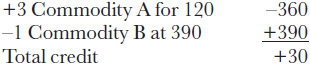
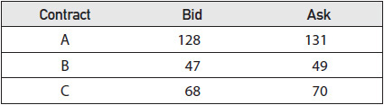
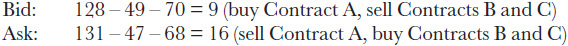
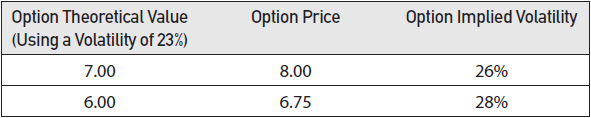

# 价差策略导论 / Introduction to Spreading

[[阅读导航|← 返回阅读导航]]

> [!success] 翻译状态
> 本章翻译与风险审计已完成。英文原文、数字、公式和图表继续保留，便于逐段核对。

<!-- chapter-toc:start -->
## 本章目录 / Chapter Outline

> [!abstract] 结构导航
> 以下标题按原书顺序保留；点击可直接跳转。

- [[#什么是价差？ / What Is a Spread?|什么是价差？ / What Is a Spread?]]
- [[#期权价差 / Option Spreads|期权价差 / Option Spreads]]
<!-- chapter-toc:end -->
<!-- chapter-nav:start -->
> [!tip] 章节导航（章首）
> [[风险度量（二） Risk Measurement II|← 上一章]] · [[阅读导航|全书导航]] · [[波动率价差策略 Volatility Spreads|下一章 →]]
<!-- chapter-nav:end -->
<!-- source:block a5c40d45856aa46e -->

> [!quote]- English 1
> In option markets, as in all markets, there are many different approaches to trading. At one time, *scalping* was a popular strategy among traders on the floors of futures exchanges. By observing the activity in a particular market, a scalper would try to determine an equilibrium price that reflected a balance between buyers and sellers. The scalper would then quote a bid-ask spread around this equilibrium price, attempting to buy at the bid price and sell at the offer price as often as possible without taking either a long or short position for any extended period of time. The scalper made no attempt to determine the theoretical value of the contract. Although the profit from each trade might be small, if a trader was able to trade often enough, he expected to show a reasonable profit. Scalping, however, requires a highly liquid market, and option markets are rarely sufficiently liquid to support this type of trading.

在期权市场中，与所有市场一样，交易方式多种多样。过去，剥头皮交易曾是期货交易所场内交易员中颇为流行的策略。剥头皮交易者通过观察特定市场的交易活动，试图判断一个反映买卖双方力量平衡的均衡价格。随后，他会围绕这一均衡价格报出买卖双向报价，力求尽可能频繁地按买价买入、按卖价卖出，同时避免长时间持有多头或空头头寸。剥头皮交易者并不试图判断合约的理论价值。虽然每笔交易的利润可能很小，但只要交易足够频繁，交易者仍期望获得合理的总体利润。然而，剥头皮交易要求市场具有很高的流动性，而期权市场通常很少具备足以支持这种交易方式的流动性。

<!-- source:block 35dcfc142552b0e4 -->

> [!quote]- English 2
> A different type of trading strategy involves speculating on the direction in which the underlying contract will move. The directional position can be taken in a variety of ways—in the cash market, in the futures market, or in the option market. Unfortunately, even when an underlying market moves in the expected direction, taking a directional position in an option market will not necessarily be profitable. Many different forces, including changes in volatility and the passage of time, can affect an option’s price. If a trader’s sole consideration is direction, he is usually better advised to take the position in the underlying market. If he does and he is right, he is assured of making a profit.

另一种类型的交易策略涉及猜测标的合约的走势方向。方向头寸可以通过多种方式采取——现货市场、期货市场或期权市场。不幸的是，即使标的市场朝着预期方向移动，在期权市场中持有方向性头寸也不一定有利可图。许多不同的力量，包括波动率的变化和时间的推移，都会影响期权的价格。如果交易者的唯一考虑因素是方向，那么通常最好建议他在标的市场上头寸。如果他这样做并且他是对的，他就有保证盈利。

<!-- source:block 996b6a4ecca499c1 -->

> [!quote]- English 3
> Most successful option traders are *spread* traders. Because option evaluation is based on the laws of probability and the laws of probability can be expected to even out only over long periods of time, option traders must often hold positions for extended periods. Over short periods of time, while the trader is waiting for an option position to move toward theoretical value, the position may be affected by a variety of changes in market conditions that threaten its potential profit. Indeed, over short periods of time, there is no guarantee that an option position will react in a manner consistent with a theoretical pricing model. Spreading enables an option trader to take advantage of theoretically mispriced options while at the same time reducing the effects of short-term “bad luck.”

最成功的期权交易员是价差交易员。由于期权评估基于概率定律，并且概率定律只能在很长一段时间内均衡，因此期权交易员必须经常长期持有头寸。在短时间内，当交易者等待期权头寸转向理论价值时，该头寸可能会受到市场条件各种变化的影响，从而威胁其潜在利润。事实上，在短时间内，无法保证期权头寸会以与理论定价模型一致的方式做出反应。价差使期权交易者能够利用理论上定价错误的期权，同时减少短期“运气不好”的影响。

<!-- source:block bffed1f6b0c59b9c -->

## 什么是价差？ / What Is a Spread?

<!-- source:block bddb406eb5dac7c5 -->

> [!quote]- English 4
> A *spread* is a strategy that involves taking opposing positions in different but related instruments. Most commonly, a spread will consist of positions that move in the opposite direction with respect to changes in market conditions. When market conditions change, one position is likely to gain value, while the other position is likely to lose value. Of course, if the values change at the same rate, the value of the spread will never change. A profitable spreading strategy is predicated on the assumption that the values of the positions will change at different rates.

价差是一种涉及在不同但相关的工具中采取相反头寸的策略。最常见的是，价差由随着市场状况变化而向相反方向移动的头寸组成。当市场条件发生变化时，一个头寸可能会增值，而另一个头寸可能会失去价值。当然，如果价值以相同的速度变化，那么价差的价值永远不会改变。有利可图的价差策略是基于头寸价值将以不同的速度变化的假设。

<!-- source:block 00138eefa7d65b67 -->

> [!quote]- English 5
> Many common spreading strategies are based on arbitrage relationships, buying and selling the same or very closely related instruments in different markets to profit from a mispricing. The *cash-and-carry strategy* common in commodity markets is an example of this type of spread. Given the current cash price, interest rate, and storage and insurance costs, a commodity trader can calculate the value of a forward contract. If the actual market price of the forward contract is higher than the calculated value, the trader will create a spread by purchasing the commodity, selling the overpriced forward contract, and carrying the position to maturity.1

许多常见的价差策略以套利关系为基础：在不同市场买卖同一种工具或高度相关的工具，以从错误定价中获利。商品市场常见的**买入现货并持有套利**（cash-and-carry strategy，也称正向期现套利）就是这类价差的一个例子。根据当前现货价格、利率以及仓储和保险成本，商品交易者可以计算远期合约的理论价值。如果远期合约的实际市场价格高于这一理论价值，交易者便可买入现货商品、卖出被高估的远期合约，并持有现货头寸至到期，从而建立套利价差。[^ovp10-1]

<!-- source:block 4b03552e7898af22 -->

> [!quote]- English 6
> Consider a commodity trading at a price of \$700. If interest rates are 6 percent annually and storage and insurance costs combined are \$5 per month, what should be the value of a two-month forward contract?

考虑价格为700美元的大宗商品交易。如果年利率为6%，存储和保险费用总和为每月5美元，那么两个月远期合约的价值应该是多少？

<!-- source:block bbadb73e989e245d -->

<!-- 原 EPUB 中此公式为图片，已原样保留 -->

<!-- source:block 6abd714248de791e -->

> [!quote]- English 7
> If the actual price of the two-month forward contract is \$725, the trader might buy the commodity for \$700, sell the forward contract for \$725, and carry the position to maturity. The total cash flow in terms of debits (–) and credits (+) will be

若两个月远期合约的实际价格为 725 美元，交易员可以按 700 美元买入商品、按 725 美元卖出远期合约，并持有头寸至到期。按 `debit`（−）与 `credit`（+）列示的总现金流为

<!-- source:block dd557ee973cff1e9 -->

<!-- 原 EPUB 中此公式为图片，已原样保留 -->

<!-- source:block c34a856a777cbf46 -->

> [!quote]- English 8
> The total profit resulting from this strategy is

该策略产生的总利润为

<!-- source:block 09cb22e09989b739 -->

> [!quote]- English 9
> –\$7 – \$700 – \$10 + \$725 = +\$8

$$
-\$7 - \$700 - \$10 + \$725 = +\$8
$$

<!-- source:block 82a02a15921fc143 -->

> [!quote]- English 10
> This is exactly the amount by which the forward contract was mispriced. The resulting profit will be unaffected by fluctuations in the price of either the commodity itself or the forward contract because all cash flows were determined at the time the strategy was initiated. Whether the commodity rises to \$800 or falls to \$600, the profit is still \$8.

这正是远期合约被错误定价的金额。由此产生的利润将不受商品本身或远期合约价格波动的影响，因为所有现金流都是在战略启动时确定的。无论商品上涨至800美元还是下跌至600美元，利润仍然是8美元。

<!-- source:block 4cc984c781380e73 -->

> [!quote]- English 11
> Another type of spreading strategy involves buying and selling futures contracts of different maturities on the same underlying commodity. In the preceding example, we calculated the value of a two-month forward contract on a commodity at \$717. We can do a similar calculation for a four-month forward contract. Here, however, the cost of borrowing will be compounded because we will need to borrow \$700 for the first two-month period at 6 percent and then borrow \$717 for the second two-month period, also at 6 percent.2

另一种类型的价差策略涉及买卖同一标的商品不同期限的期货合约。在前面的例子中，我们计算出商品两个月远期合约的价值为717美元。我们可以对四个月的远期合约进行类似的计算。然而，在这里，借贷成本将会增加，因为我们需要在前两个月期间以6%的利率借入700美元，然后在第二个两个月期间（也是6月）借入717美元。[^ovp10-2]

<!-- source:block 5defd5e447d77c6e -->

<!-- 原 EPUB 中此公式为图片，已原样保留 -->

<!-- source:block f6a528554adb9980 -->

> [!quote]- English 12
> The value of the four-month forward contract ought to be

四个月远期合约的价值应该是

<!-- source:block c54c7f35acc82a0e -->

<!-- 原 EPUB 中此公式为图片，已原样保留 -->

<!-- source:block c7d147bc69f2b7c3 -->

> [!quote]- English 13
> If there are two-month- and four-month exchange-traded futures contracts on this commodity, there should be a \$17.17 difference, or spread, between the prices of the two contracts. If the spread between months is actually \$20, a trader might buy the two-month contract and sell the four-month contract. The trader cannot tell whether either contract individually is overpriced or under-priced. But he knows that at a price of \$20, the spread is \$2.83 too expensive.

如果该商品有两个月和四个月的交易所交易期货合约，则两份合约的价格之间应该存在17.17美元的差异或价差。如果月份之间的价差实际上是20美元，则交易员可能会购买两个月期合约并出售四个月期合约。交易员无法判断任何一份合约的价格是否过高或过低。但他知道，20美元的价格，价差2.83美元太贵了。

<!-- source:block 1c226f64c154e8ef -->

> [!quote]- English 14
> Assuming that the trader has accurately evaluated the spread, how will he make this \$2.83 profit? One possibility is that the price of the futures spread will return to its expected value of \$17.17. Having sold the spread (sell the four-month futures contract, buy the two-month futures contract), the trader can close out the position by purchasing the spread (buy the four-month futures contract, sell the two-month futures contract).

假设交易员准确评估了价差，他将如何赚取2.83美元的利润？一种可能性是期货价差价格将恢复至17.17美元的预期价值。卖出价差（卖出四个月期货合约，买入两个月期货合约）后，交易者可以通过购买价差（买入四个月期货合约，卖出两个月期货合约）平仓。

<!-- source:block 0c7fc3a7f5251824 -->

> [!quote]- English 15
> If the price of the spread does not return to its expected value, the trader can carry the entire position to maturity. Suppose that the spread was originally created by purchasing the two-month forward contract at a price of \$717 and selling the four-month forward contract at a price of \$737. If carried to maturity, the cash flow from the entire position will be as follows:

如果价差价格未恢复至预期价值，交易者可以将整个头寸持有至到期。假设价差最初是通过以717美元的价格购买两个月远期合约并以737美元的价格出售四个月远期合约而产生的。如果结转至到期，整个头寸的现金流将如下：

<!-- source:block 81820437d16bcc87 -->

<!-- 原 EPUB 中此公式为图片，已原样保留 -->

<!-- source:block 6c0a76eea5e35b5e -->

<!-- 原 EPUB 中此公式为图片，已原样保留 -->

<!-- source:block cf07339ced130df8 -->

> [!quote]- English 16
> Of course, the trader could have achieved the same result by simply selling the four-month forward contract and buying the commodity. However, although a trader may have easy access to a futures exchange, he may find that his access to the physical commodity market is limited because such markets are typically dominated by large corporations. In such a case, he may find that it is both simpler and cheaper to execute the spread in the futures market.

当然，交易员可以通过简单地出售四个月远期合约并购买大宗商品来实现同样的结果。然而，尽管交易员可能很容易进入期货交易所，但他可能会发现他进入实物商品市场的机会有限，因为此类市场通常由大公司主导。在这种情况下，他可能会发现在期货市场上执行价差既简单又便宜。

<!-- source:block 83b38bda75a225cb -->

> [!quote]- English 17
> Spreading strategies are often done to reduce one or more risks. In a cash-and-carry strategy, much of the directional risk is eliminated because the value of the long cash contract and the value of the short forward contract will tend to move in opposite directions. But a spreading strategy will not necessarily eliminate all risks. In our example, we assumed that we were able to borrow money at a fixed rate, thereby eliminating any interest-rate risk. We also assumed that storage and insurance costs were fixed when the strategy was initiated. If we are dealing only with futures contracts, changes in interest rates, as well as changes in storage and insurance costs, may affect the price relationship between futures months. If the changes are large enough, a seemingly profitable spreading strategy may in fact become unprofitable. In the preceding example, if interest rates and storage costs rise after the strategy has been initiated, the spread between the two-month and four-month futures contract will widen, resulting in a smaller profit to the trader or perhaps even a loss.

价差策略往往用于降低一种或多种风险。在买入现货并持有套利中，现货多头与远期空头的价值通常反向变动，因此大部分方向风险会被抵消；但价差策略未必能消除所有风险。在本例中，我们假定交易者能够按固定利率借款，因而排除了利率风险；同时还假定建仓时仓储和保险成本已经固定。如果只交易期货合约，利率以及仓储和保险成本的变化都可能影响不同到期月份期货合约之间的价格关系。若这些变化足够大，看似有利可图的价差策略实际上可能转为亏损。在前例中，如果建仓后利率和仓储成本上升，两个月期与四个月期货合约之间的价差将会扩大，使交易者的利润减少，甚至产生亏损。

<!-- source:block e31b8d73f709254b -->

> [!quote]- English 18
> Our examples thus far were both *intramarket* commodity spreads, with all contract values based on the same underlying commodity. However, if a trader can identify a price relationship between two different commodities or two different financial instruments, he might consider an *intermarket* spread, buying in one market and selling in a different market. As with all spreads, the strategy is based on the assumption that there is an identifiable relationship between the prices of different contracts. When the price spread between the two contracts appears to violate this relationship, it represents an opportunity for the trader.

到目前为止，我们的例子都是市场内大宗商品价差，所有合约价值都基于相同的标的商品。然而，如果交易员能够识别两种不同商品或两种不同金融工具之间的价格关系，他可能会考虑市场间价差，在一个市场买入并在不同市场卖出。与所有价差一样，该策略基于不同合约的价格之间存在可识别的关系的假设。当两份合约之间的价格价差似乎违反了这种关系时，它对交易者来说就代表了机会。

<!-- source:block a5b0e6334279f731 -->

> [!quote]- English 19
> In the fixed-income markets, a common strategy involves buying or selling short-term interest-rate instruments and taking an opposing position in long-term interest-rate instruments. The value of the spread depends on changes in the yield curve—the relationship between short- and long-term interest rates.

在固定收益市场中，常见的策略包括购买或出售短期利率工具并在长期利率工具中采取相反头寸。价差的价值取决于收益率曲线（短期和长期利率之间的关系）的变化。

<!-- source:block d09b5e771ef66561 -->

> [!quote]- English 20
> Consider two futures contracts with the same time to maturity, a 10-year Treasury note future trading at price of 116 14/32 and a 30-year Treasury bond future trading at a price of 118 27/32.3 The spread between the two is

考虑两份到期时间相同的期货合约：10 年期美国国债期货的报价为 $116+\frac{14}{32}$，30 年期美国国债期货的报价为 $118+\frac{27}{32}$。美债期货报价中的分数部分以一个点的 $\frac{1}{32}$ 为单位，因此两者之间的价差为：[^ovp10-3]

<!-- source:block 457e8a0a8e8c4a59 -->

> [!quote]- English 21
> 118 27/32 – 116 14/32 = 2 13/32

$$
\left(118+\frac{27}{32}\right)
-\left(116+\frac{14}{32}\right)
=2+\frac{13}{32}
$$

<!-- source:block b41b6bc9b9c7b47d -->

> [!quote]- English 22
> The prices of Treasury contracts move in the opposite direction of interest rates. If interest rates rise, Treasury prices will fall; if interest rates fall, Treasury prices will rise. If a trader believes that interest rates will rise but that long-term rates will rise more quickly than short-term rates, he might sell the 10-year/30-year spread.4 If he is correct, the spread will narrow, perhaps at a later date trading at

美国国债合约价格与利率反向变动：利率上升时，国债价格下跌；利率下降时，国债价格上涨。如果交易者认为利率将会上升，而且长期利率的上升速度会快于短期利率，他可能会卖出 10 年期／30 年期国债期货价差。[^ovp10-4]若判断正确，价差将会收窄，之后可能报价为：

<!-- source:block a1fdd2a7653bff58 -->

> [!quote]- English 23
> 11510/32 – 1137/32 = 23/32

$$
\left(115+\frac{10}{32}\right)
-\left(113+\frac{7}{32}\right)
=2+\frac{3}{32}
$$

<!-- source:block ffe867fc5e0342e0 -->

> [!quote]- English 24
> If the trader originally sold the spread at 213/32 and later buys the spread back at 23/32, he will show a profit of

如果交易者最初以 $2+\frac{13}{32}$ 卖出价差，后来以 $2+\frac{3}{32}$ 买回价差，其利润为：

<!-- source:block 0355373c7b4b8375 -->

> [!quote]- English 25
> 213/32 – 23/32 = 10/32

$$
\left(2+\frac{13}{32}\right)
-\left(2+\frac{3}{32}\right)
=\frac{10}{32}
=\frac{5}{16}
$$

<!-- source:block f39c2b178a3237f2 -->

> [!quote]- English 26
> As a somewhat different intermarket spread, suppose that a trader observes the prices of two commodities, Commodity A and Commodity B, over an extended period and concludes that Commodity B tends to trade at a price that is three times greater than that of Commodity A. That is,

作为略有不同的市场间价差，假设交易员在很长一段时间内观察两种商品（商品A和商品B）的价格，并得出结论，商品B的交易价格往往是商品A的三倍。也就是说，

<!-- source:block 802cedcf619b17ee -->

> [!quote]- English 27
> Price of Commodity B = 3 × price of Commodity A

$$
\text{Price of Commodity B} = 3 \times \text{price of Commodity A}
$$

<!-- source:block 9c40fb994f981565 -->

> [!quote]- English 28
> If the price of Commodity A is 50, the price of Commodity B ought to be 150. If the price of Commodity A is 200, the price of Commodity B ought to be 600. Although prices may occasionally deviate from this, they eventually seem to revert to this 3:1 relationship. Given this relationship, what will a trader do if the current prices of the commodities are

如果商品A的价格是50，那么商品B的价格应该是150。如果商品A的价格是200，那么商品B的价格应该是600。尽管价格偶尔可能会偏离这一点，但它们最终似乎会恢复到这种3：1的关系。鉴于这种关系，如果大宗商品的当前价格是

<!-- source:block eff9e5e75c7c5076 -->

> [!quote]- English 29
> Price of Commodity A = 120

$$
\text{Price of Commodity A} = 120
$$

<!-- source:block ac16faa2848722d8 -->

> [!quote]- English 30
> Price of Commodity B = 390

$$
\text{Price of Commodity B} = 390
$$

<!-- source:block 107af26b362e42a4 -->

> [!quote]- English 31
> With prices of 120 and 390, Commodity B is trading at a multiple of 3.25 times Commodity A. Given the historical relationship, Commodity B seems to be trading at a price that is too high compared with Commodity A. Either Commodity B ought to be trading at 360 (3 × 120) or Commodity A ought to be trading at 130 (390/3).

商品B的价格为120和390，交易价格为商品A的3.25倍。考虑到历史关系，商品B的交易价格与商品A相比似乎过高。商品B的交易价格应为360（3 × 120），或者商品A的交易价格应为130（390/3）。

<!-- source:block 435ee9b7112186d8 -->

> [!quote]- English 32
> If the trader believes that the prices are likely to return to their 3:1 historical relationship, he might purchase three contracts of Commodity A for 120 each and sell one contract of Commodity B at a price of 390

如果交易员认为价格可能会恢复到3：1的历史关系，他可能会以每份120的价格购买三份商品A合约，并以390的价格出售一份商品B合约

<!-- source:block 6880ad8e47e4ea0d -->

<!-- 原 EPUB 中此公式为图片，已原样保留 -->

<!-- source:block 287164b062ec05cd -->

> [!quote]- English 33
> If at a later date the contract prices return to their 3:1 relationship, the trader can close out the position at no cost, leaving him with the expected profit of 30. This profit will be independent of the actual prices of the two commodities as long as the 3:1 relationship is maintained.

如果稍后合约价格恢复到3：1的关系，交易员可以免费平仓，从而获得30的预期利润。只要保持3：1的关系，这笔利润将独立于两种商品的实际价格。

<!-- source:block 96438e1a82870022 -->

> [!quote]- English 34
> The strategy that we have just described involves buying and selling unequal numbers of contracts, sometimes referred to as a *ratio strategy*. It is common in markets where there is a perceived relationship between products with similar characteristics but that trade at different prices. In the precious metals market, a trader might spread gold against silver, even though gold trades at a price many times that of silver. In the agricultural market, a trader might spread corn against soybeans, even though soybean prices are always greater than corn prices. In the stock index market, a trader might spread the Standard and Poor’s (S&P) 500 Index against the Dow Jones Industrial Average Index. All these spreads differ from previous strategies in that they depend on an observed and perhaps less well-defined relationship than that between the cash price and the futures price or between the prices of different futures months. Because the relationship is less reliable, these types of spreads carry greater uncertainty and therefore greater risk. Nonetheless, if a trader believes that his analysis of a price relationship is accurate, the strategy may be worth pursuing.

我们刚刚描述的策略涉及买卖不相等数量的合约，有时称为比例策略。这种情况在具有相似特征但以不同价格交易的产品之间存在明显关系的市场中很常见。在贵金属市场，交易员可能会将黄金与白银价差，尽管黄金的交易价格是白银的好几倍。在农业市场上，贸易商可能会将玉米与大豆价差，尽管大豆价格总是高于玉米价格。在股指市场中，交易员可能会将标准普尔（S & P）500指数与道琼斯工业平均指数进行价差。所有这些价差与以前的策略不同之处在于，它们取决于一种观察到的关系，并且可能比现金价格和期货价格之间或不同期货月份价格之间的关系不那么明确。由于这种关系不太可靠，这些类型的价差具有更大的不确定性，因此风险更大。尽管如此，如果交易员相信他对价格关系的分析是准确的，那么该策略可能值得采用。

<!-- source:block 98fcb65bb18ef28b -->

> [!quote]- English 35
> Thus far, all our spreading examples have consisted of two sides, or *legs*. In the first example, one leg consisted of a physical commodity and one leg consisted of a forward contract. In the second example, the legs consisted of two different futures contracts. In the third example, the legs consisted of two different commodities. But spreading strategies may consist of many legs as long as a price relationship between the different legs can be identified.

到目前为止，我们所有的价差例子都由两侧或腿组成。在第一个例子中，一条腿由实物商品组成，一条腿由远期合约组成。在第二个例子中，腿由两个不同的期货合约组成。在第三个例子中，腿由两种不同的商品组成。但只要可以确定不同腿之间的价格关系，价差策略可能由多个腿组成。

<!-- source:block 785fb9a528c55ff0 -->

> [!quote]- English 36
> In energy markets, a common spreading strategy consists of buying or selling crude oil futures and taking an opposing position in futures in products that are made from crude oil—gasoline and heating oil. The value of this *crack spread* depends on the cost of refining, or *cracking*, crude oil into its derivative products, as well as the demand for these products relative to the cost of crude oil. If the costs of refining rise or the demand for refined products rises, the value of the spread will widen. If costs fall or demand falls, the value of the spread will narrow.5

在能源市场中，一种常见的价差策略是买入或卖出原油期货，同时在原油制成品——汽油和取暖油——的期货上建立相反方向的头寸。这种**裂解价差**（crack spread，也称炼油价差）的价值取决于原油裂解、炼制为成品油的成本，以及成品油需求相对于原油成本的强弱。炼制成本上升或成品油需求增加时，价差会扩大；成本下降或需求减弱时，价差会收窄。[^ovp10-5]

<!-- source:block 5c98bf4720ef6a06 -->

> [!quote]- English 37
> There are a number of ratios in which the crack spread can be traded, but one common ratio is the 3:2:1—3 gallons of crude oil to yield 2 gallons of gasoline and 1 gallon of heating oil. Because the value of the refined products is greater than that of crude oil, a trader is said to buy the spread when he buys the products and sells crude oil.

裂解价差可以采用多种配比交易，其中常见的一种是 $3:2:1$，即以 3 单位原油对应 2 单位汽油和 1 单位取暖油。由于成品油组合的价值高于投入的原油，买入成品油期货并卖出原油期货称为**买入裂解价差**。

<!-- source:block d6e54681e3ca1d67 -->

> [!quote]- English 38
> Price of the 3:2:1 crack spread = (2 × gasoline) + (1 × heating oil) – (3 × crude oil)

$$
V_{\text{crack},\,3:2:1}
=2P_{\text{gasoline}}
+P_{\text{heating oil}}
-3P_{\text{crude oil}}
$$

<!-- source:block 60da5bbcfa7c1c09 -->

> [!quote]- English 39
> A trader who believes that the demand for refined products will fall can sell the crack spread. A trader who believes that demand will rise can buy the spread.

预期成品油需求下降的交易者可以卖出裂解价差；预期需求上升的交易者则可以买入裂解价差。

<!-- source:block 7615844c6daa37c6 -->

> [!quote]- English 40
> In some markets, it may be necessary to execute each leg of a spread separately because there may be no counterparty willing to execute the entire spread at one time. If the spread consists of multiple legs and the trader has only been able to execute one leg, he will be at risk until he completes the spread by executing the remaining legs. If the trader must execute the spread one leg at a time, he needs to consider the risk resulting from this piecemeal execution. Determining how best to execute a spread is usually a matter of experience. It is often true that some legs, owing to the liquidity in the respective markets, will be more difficult to execute than other legs. As a consequence, most traders learn that it is usually best to execute the more difficult leg first. If a trader does this, he will find that execution risk is reduced because he will be able to more easily complete the spread. If, on the other hand, a trader executes the easier leg first, he may be left with a *naked* position if he is unable to execute the remaining legs in a timely manner or at a reasonable price.

在某些市场中，可能必须逐腿执行价差，因为未必有交易对手愿意一次成交整个组合。若价差包含多条腿，而交易者目前只成交了一条，那么在其余各腿成交、组合完整建立之前，他将持续暴露于市场风险。必须逐腿成交时，交易者应事先考虑这种分拆执行带来的风险；如何安排最佳执行顺序，通常取决于经验。

由于各合约市场的流动性不同，有些腿会比其他腿更难成交。多数交易者因此会先执行最难成交的腿，再完成较易成交的腿，从而降低执行风险。反之，若先成交容易执行的腿，却无法及时或以合理价格完成其余各腿，交易者就可能被迫留下裸露头寸。

<!-- source:block 21629a11bd78ef5b -->

> [!quote]- English 41
> Fortunately, in many markets, spreads are traded all at one time as if they are one contract. A quote for the spread will typically consist of one bid price and one offer price, no matter how complex the spread. Consider a spread that consists of buying Contract A and selling Contracts B and C with the following bid-ask quotes:

好在许多市场允许整个价差组合一次性成交，交易方式就像买卖一份合约。无论组合包含多少条腿，市场通常只对整个组合报出一个买价（bid）和一个卖价（ask/offer）。下面定义一个价差组合：买入合约 A，同时卖出合约 B 和 C；三份合约各自的买卖报价如下：

<!-- source:block 4fee5237964aa5cb -->

<!-- source:block ecb335981df76395 -->

> [!quote]- English 42
> From the bid-ask quotes for each of the individual contracts, the current market for the spread is

先将一单位价差定义为“买入 A、卖出 B、卖出 C”。如果逐腿按各自盘口立即成交，则整个组合的可执行报价为：

<!-- source:block 86fabb14e5fa5e1c -->

<!-- 原 EPUB 中此公式为图片，已原样保留 -->

从交易者的角度看，计算过程如下：

$$
\begin{aligned}
P_{\text{bid}}
&=A_{\text{bid}}-B_{\text{ask}}-C_{\text{ask}} \\
&=128-49-70=9,
\\[4pt]
P_{\text{ask}}
&=A_{\text{ask}}-B_{\text{bid}}-C_{\text{bid}} \\
&=131-47-68=16.
\end{aligned}
$$

也就是说，交易者立即**卖出**整个组合可获得 9；立即**买入**整个组合则需支付 16。原图括号中的买卖方向采用做市商视角，与交易者视角正好相反。

<!-- source:block 3fe93b9813a2d096 -->

> [!quote]- English 43
> If a trader wants to buy the spread, he can immediately trade all three contracts individually and pay a total of 16. If he wants to sell the spread, he can do so at a price of 9. But a trader may take the position that because he is trading multiple contracts, he ought to get some discount. A market maker in this spread will often take the view that because he has less risk when he executes all contracts at one time, he is willing to do so at a price more favorable to the trader. If the trader asks for a market for the entire spread, he will often find that the difference between the bid price and ask price is narrower than the sum of the bid-ask prices, perhaps 11 bid, 14 offer. Executing the entire spread as one transaction will clearly be better than executing the spread as three individual transactions.

如果交易者逐腿买入该价差，他必须以 131 买入 A，再分别以 47 和 68 卖出 B、C，净支出为 16；如果逐腿卖出该价差，则以 128 卖出 A，再分别以 49 和 70 买入 B、C，净收入为 9。因此，将三条腿各自的买卖价差简单相加后，整个组合的盘口是 **9 bid / 16 ask**，买卖价差宽达 7。

不过，交易者一次执行多份合约，通常会希望获得更好的组合价格。做市商也可能愿意让价，因为三条腿同时成交时，他承担的逐腿执行风险较小。因此，整个价差的组合报价往往会收窄，例如 **11 bid / 14 offer**：交易者卖出组合可以成交在 11，而买入组合只需支付 14。与分别执行三条腿相比，将整个价差作为一笔组合订单成交显然更有利。

<!-- source:block 6ebe363f8dbcc682 -->

> [!quote]- English 44
> Even if a spread is executed as one trade, many exchanges require that parties trading a spread still report the prices of the individual contracts. If this is the case, what prices should be reported if a trader buys the entire spread at a price of 14? In fact, the individual prices really don’t matter. Whether the trader pays 129 for Contract A and sells Contracts B and C at 47 and 68 (129 – 47 – 68 = 14) or pays 131 for Contract A and sells Contracts B and C at 48 and 69 (131 – 48 – 69 = 14), the total price is still 14. Indeed, the parties could decide for whatever reason to trade Contract A at a price of 200 and Contracts B and C at prices of 86 and 100 (200 – 86 100 = 14). As far as the parties to the trade are concerned, all that matters is that the individual prices add up to the agreed-on spread price of 14.6

即使整个价差以一笔组合订单成交，许多交易所仍要求交易双方分别申报每条腿的成交价。假设交易者以净价 14 买入“买 A、卖 B、卖 C”的组合，应当怎样分配三份合约的成交价？

从组合净价的角度看，具体分配并不唯一。例如，下面两组价格都会得到相同的净价：

$$
\begin{aligned}
129-47-68&=14,\\
131-48-69&=14.
\end{aligned}
$$

纯粹从算术上说，甚至可以申报为 A 成交于 200、B 成交于 86、C 成交于 100，因为 $200-86-100=14$。对交易双方而言，关键是各条腿的价格按组合方向相加后，等于约定的价差净价 14。不过在实际申报时，各条腿的价格仍应合理反映当时的市场行情。[^ovp10-6]

<!-- source:block b04a3a2177fd671f -->

## 期权价差 / Option Spreads

<!-- source:block d0383cb55c560257 -->

> [!quote]- English 45
> At the beginning of this chapter, we defined a spread as consisting of opposing positions in related instruments. But what do we mean by a *position*? In the spread examples thus far, the positions were based on directional considerations. If the value of one position rises as a result of a directional move in the underlying market, the value of the opposing position is expected to decline, even though ultimately the price of the spread is expected to converge to some projected value. We can also create directional spreads in the option market by taking opposing but unequal delta positions in different contracts. As with our other spreads, the value of such a spread will depend on directional movement in the underlying contract.

在本章的开头，我们将价差定义为由相关文书中的相反头寸组成。但我们所说的头寸是什么意思呢？在迄今为止的价差示例中，头寸是基于方向考虑的。如果一个头寸的价值因标的市场的方向性变动而上升，那么对手头寸的价值预计将下降，尽管最终价差的价格预计将收敛到某个预测价值。我们还可以通过在不同合约中采取相反但不平等的Delta头寸，在期权市场上创造定向价差。与我们的其他价差一样，这种价差的价值将取决于标的合约的方向性变动。

<!-- source:block a75b0320925e2c25 -->

> [!quote]- English 46
> While the prices of options are affected by directional moves in the underlying market, they can also be affected by other factors. In an option market, we might create a spread by taking a long gamma position in one option and a short gamma position in a different option, or by taking a long vega position and a short vega position, or even a long and short rho position. The value of each of these spreads will depend on factors other than directional moves in the underlying market. The gamma spread will be sensitive to the volatility of the underlying market. The vega spread will be sensitive to changes in implied volatility. And the rho spread will be sensitive to changes in interest rates.

虽然期权价格受到标的市场方向性波动的影响，但也可能受到其他因素的影响。在期权市场中，我们可能会通过在一个期权中持有多头Gamma头寸并在另一个期权中持有空头Gamma头寸，或者通过持有多头Vega头寸和空头Vega头寸，甚至是多头和空头Rho头寸来创建价差。这些价差的价值将取决于标的市场方向性波动以外的因素。Gamma价差将对标的市场的波动率敏感。Vega价差将对隐含波动率的变化敏感。而且Rho价差对利率变化很敏感。

<!-- source:block becf14ab94837ccd -->

> [!quote]- English 47
> The dynamic hedging examples in Chapter 8 are typical *gamma spreads*. We initiated the spreads by either purchasing or selling options and then offsetting the option’s delta with an opposing delta position in the underlying contract. However, although an underlying contract has no gamma, an option does have a gamma. As a result, the entire position had either a positive or a negative gamma. From this we demonstrated that the value of the position depended not on the direction of movement in the underlying contract but on the volatility of the underlying contract.

第8章中的动态对冲示例是典型的Gamma价差。我们通过购买或出售期权来启动价差，然后用标的合约中的相反Delta头寸抵消期权的Delta。然而，尽管标的合约没有Gamma，但期权确实有Gamma。结果，整个头寸的Gamma要么为正，要么为负。由此我们证明，头寸的价值不取决于标的合约的移动方向，而是取决于标的合约的波动率。

<!-- source:block 21c95ffcead5a7a6 -->

> [!quote]- English 48
> Many option spreads are dynamic, requiring periodic adjustments. But a spread can also be *static*. Once initiated, the spread is carried to expiration without adjustments. This is usually done only when the risk characteristics of the spread are well defined and limited.

许多期权价差是动态的，需要定期调整。但价差也可以是静态的。一旦启动，价差将持续至到期，无需调整。通常只有在价差的风险特征明确且有限时才进行这一操作。

<!-- source:block a7d441ac03e742b1 -->

> [!quote]- English 49
> Perhaps in no other market are spreading strategies as widely employed as they are in option markets. There are a number of reasons for this:

也许没有哪个市场能像期权市场那样广泛价差策略。原因有多种：

<!-- source:block b9fa68cab81ad276 -->

> [!quote]- English 50
> 1. *A trader might perceive a relative mispricing between contracts*. Just as a trader might calculate the value of a futures contract in relation to the price of a cash contract, an option trader might try to identify the value of one option contract in relation to another option. Although it may not be possible to determine the exact value of either contract, the trader might be able to estimate the relative value of the contracts. If prices in the marketplace deviate from this relative value, a trader will try to profit by either buying or selling the spread.

1.交易员可能会发现合约之间存在相对定价错误。正如交易员可能会根据现金合约的价格计算期货合约的价值一样，期权交易员可能会尝试识别一份期权合约相对于另一份期权的价值。尽管可能无法确定任何一份合约的确切价值，但交易员可能能够估计合约的相对价值。如果市场价格偏离该相对价值，交易者将试图通过购买或出售价差来获利。

<!-- source:block 92f00d6a1bc9ead7 -->

> [!quote]- English 51
> In many markets, traders express a mispricing in terms of how much the price of a contract differs from its value. In option markets, the mispricing is often expressed in terms of volatility. Consider two options, one that has a theoretical value of 7.00 and is trading at a price of 8.00 and another that has a theoretical value of 6.00 and is trading at a price of 6.75. Which option represents a greater mispricing? Looking only at the option prices, the first option appears to be overpriced by 1.00, whereas the second option appears to be overpriced by only 0.75. But suppose that the volatility used to calculate the theoretical value is 23 percent. Because both options are overpriced, we know that their implied volatilities must be greater than 23 percent. If the implied volatility of the option trading at 8.00 is 26 percent, while the implied volatility of the option trading at 6.75 is 28 percent, an option trader is likely to conclude that in volatility terms, the second option is more overpriced.

在许多市场中，交易员通过合约价格与其价值的差异来表达定价错误。在期权市场中，错误定价通常以波动率来表达。考虑两种期权，一种理论价值为7.00，交易价格为8.00，另一种理论价值为6.00，交易价格为6.75。哪种选择代表更大的定价错误？只看期权价格，第一个期权似乎高估了1.00，而第二个期权似乎只高估了0.75。但假设用于计算理论值的波动率为23%。因为这两个期权都定价过高，我们知道它们的隐含波动率必须大于23%。如果期权交易的隐含波动率在8.00是26%，而期权交易的隐含波动率在6.75是28%，期权交易者可能会得出结论，在波动率方面，第二个期权的价格更高。

<!-- source:block 0b6d30e150f9c568 -->

<!-- source:block 1f3217af9ac2660b -->

> [!quote]- English 52
> 2. *A trader may want to construct a position that reflects a particular view of market conditions*. Options can be combined in an almost infinite variety of ways such that a position will yield a profit when market conditions move favorably. At the same time, options can be combined in ways that will limit loss when conditions turn unfavorable. We looked at some examples of this in Chapter 4. Of course, even if a trader is able to construct a position that exactly reflects his view of market conditions, he will have to decide whether the prices at which the trades can be executed make the position worthwhile.

2.交易者可能希望建立一个反映市场状况的特定观点的头寸。期权可以以几乎无限种方式组合，当市场条件有利时，头寸将产生利润。与此同时，可以将各种选择组合起来，以便在条件变得不利时限制损失。我们在第4章中看过一些这样的例子。当然，即使交易者能够建立一个准确反映他对市场状况的看法的头寸，他也必须决定执行交易的价格是否使该头寸值得。

<!-- source:block cd3a7e402553ecaa -->

> [!quote]- English 53
> 3. *Spreading strategies help to control risk*. This is particularly important for someone who is making decisions based on a theoretical pricing model. In Chapter 5, we stressed the fact that all commonly used pricing models are probability based and that outcomes predicated on the laws of probability are only reliable *in the long run*. In the short run, any one outcome can deviate from the expected outcome. If a trader wants to be successful in options, he must ensure that he remains in the game for the long run. If he is unlucky in the short run and must leave the game, the long-term probability theory does him no good. Spreading is the primary method by which traders limit the short-term effects of “bad luck.”

3.价差策略有助于控制风险。这对于根据理论定价模型做出决策的人来说尤其重要。在第5章中，我们强调了这样一个事实：所有常用的定价模型都是基于概率的，并且基于概率定律的结果只有从长远来看才是可靠的。从短期来看，任何一种结果都可能偏离预期结果。如果交易者想要在期权中取得成功，他必须确保自己长期留在游戏中。如果他短期内运气不好，必须退出比赛，那么长期概率论对他没有任何好处。价差是交易员限制“厄运”短期影响的主要方法。

<!-- source:block f9fb484316c8150c -->

> [!quote]- English 54
> In addition to reducing the effects of short-term bad luck, spreading strategies can also help protect a trader against incorrectly estimated inputs into the theoretical pricing model. Suppose that a trader estimates that over the life of an option, the volatility of an underlying contract will be 35 percent. Based on this, he determines that a certain call option, which is currently trading at a price of 4.00, has a theoretical value of 3.50. If the call has a delta of 25, the trader might try to capture this mispricing by selling four calls at a price of 4.00 each and buying one underlying contract and dynamically hedging the position over the life of the option. The total theoretical edge for the position is 4 × 0.50 = 2.00. Of course, if the trader can make 2.00 with a 4 × 1 spread, it may occur to him that he can make 20.00 if he increases the size of the spread to 40 × 10. Why stop now? The trader can make 200.00 if he increases the size to 400 × 100.

除了减少短期霉运的影响外，价差策略还可以帮助保护交易者免受理论定价模型中错误估计的输入的影响。假设交易员估计，在期权的有效期内，标的合约的波动率将为35%。基于此，他确定目前交易价格为4.00的某个看涨期权的理论价值为3.50。如果看涨期权的Delta为25，交易员可能会尝试通过以每份4.00的价格出售四个看涨期权并购买一份标的合约并在期权有效期内动态对冲头寸来捕捉这种定价错误。该头寸的总理论优势为4 × 0.50 = 2.00。当然，如果交易者可以通过4 × 1的价差赚2.00，那么他可能会想到，如果他将价差扩大到40 × 10，他就可以赚20.00。为什么现在停下来？如果交易者将规模增加到400 × 100，则可以赚200.00。

<!-- source:block 23bc239280ca181a -->

> [!quote]- English 55
> Even if the market is sufficiently liquid to absorb the increased size, is this a reasonable approach to trading? Should a trader simply find a theoretically profitable strategy and do it as many times as possible in order to maximize the potential profit? At some point, the intelligent trader will have to consider not only the potential profit of a strategy but also its risks. After all, the trader’s volatility estimate of 35 percent is just that, an estimate. What will happen if volatility actually turns out to be some higher number, perhaps 40 percent, or 45 percent? If the calls that the trader sold at 4.00 are worth 4.50 at a volatility of 45 percent, and volatility actually turns out to be 45 percent, then the hoped-for profit of 200.00 (assuming a size of 400 × 100) will turn into a loss of 200.00.

即使市场有足够的流动性来吸收增加的规模，这是一个合理的交易方法吗？交易者是否应该简单地找到一个理论上有利可图的策略，并尽可能多地这样做，以最大限度地提高潜在利润？在某些时候，聪明的交易者不仅必须考虑策略的潜在利润，还要考虑其风险。毕竟，交易员对波动率35%的估计只是一个估计。如果波动率实际上是更高的数字，也许是40%或45%，会发生什么？如果交易员在4.00点卖出的看涨期权价值4.50，波动率为45%，而波动率实际上为45%，那么预期的利润200.00（假设规模为400 × 100）将变成亏损200.00。

<!-- source:block bad30d0a6ab5063a -->

> [!quote]- English 56
> A trader must always consider the effects of an incorrect estimate and then decide how much risk he is willing to take. If the trader in this example decides that he can survive if volatility goes no higher than 40 percent (a 5 percentage point margin for error), he might only be willing to do the spread 40 × 10. But, if there is some way to increase his breakeven volatility to 45 percent (a 10 percentage point margin for error), he might indeed be willing to do the spread 400 × 100. Option spreading strategies enable traders to profit under a wide variety of market conditions by giving them an increased margin for error in estimating the inputs into a theoretical pricing model. No trader will survive very long if his livelihood depends on estimating each input with 100 percent accuracy. But if he has constructed an intelligent spreading strategy that allows for a large margin of error, the experienced trader can survive even when his estimates of market conditions turn out to be incorrect.

交易者必须始终考虑错误估计的影响，然后决定他愿意承担多大的风险。如果本例中的交易员认为，如果波动率不高于40%（5个百分点的误差保证金），他就可以生存，那么他可能只愿意将价差设为40 × 10。但是，如果有某种方法可以将他的盈亏平衡波动率提高到45%（10个百分点的误差幅度），他可能确实愿意将价差设定为400 × 100。期权价差策略使交易者能够在各种市场条件下获利，因为交易者在估计理论定价模型的输入时有更大的误差幅度。如果交易者的生计依赖于100%准确地估计每项输入，那么他就不会生存很久。但如果他构建了一个智能的价差策略，允许很大的误差幅度，那么经验丰富的交易员即使对市场状况的估计被证明是错误的，也可以生存下来。

<!-- source:block 2457d50a75499752 -->

> [!quote]- English 57
> To see how spreading strategies can be used to reduce risk, recall our example in Chapter 5 where a casino is selling a roulette bet with an expected value of 95 cents for \$1.00. The casino knows that based on the laws of probability, it has a 5 percent theoretical edge. Suppose that a customer comes into the casino and proposes to bet \$2,000 on one number at the roulette table. Should the casino allow the bet? The casino owner knows that the odds are on his side and that he will most likely get to keep the \$2,000 bet, but there is always a chance that the player’s number will come up. If it does, the casino will lose \$70,000 (the \$72,000 payoff less the \$2,000 cost of the bet). If the casino is backed by millions of dollars, the loss of \$70,000 will not severely interfere with the casino’s continuing operations. If, however, the casino is only backed by \$50,000, the loss of \$70,000 will put the casino out of business. And if the casino goes out of business, it can no longer rely on its 5 percent edge because this is an expectation that is only reliable in the long run. And the long run has just been eliminated.

要了解如何使用价差策略来降低风险，请回忆一下我们在第5章中的例子，其中赌场以1.00美元出售预期价值为95美分的轮盘赌赌注。赌场知道，根据概率定律，它有5%的理论优势。假设一位顾客进入赌场并提议在轮盘赌桌上的一个号码上下注2,000美元。赌场应该允许投注吗？赌场老板知道赔率对他有利，他很有可能保留2,000美元的赌注，但玩家的号码总是有可能出现。如果确实如此，赌场将损失70,000美元（72,000美元的回报减去2,000美元的赌注成本）。如果赌场有数百万美元的支持，那么7万美元的损失不会严重干扰赌场的持续运营。然而，如果赌场只有50,000美元的支持，那么70,000美元的损失将使赌场破产。如果赌场倒闭，它就不能再依赖5%的优势，因为这是一个只有从长远来看才可靠的预期。而长远来看刚刚被淘汰。

<!-- source:block ec5162dd40fd5c28 -->

> [!quote]- English 58
> Now consider a slight variation where two customers come into the casino and propose to place bets of \$1,000 each at the roulette table, but they also agree not to bet on the same number. Whichever number one player chooses, the other will choose a different number. As with the first scenario, where one player makes a single \$2,000 bet, the casino’s potential reward in this new scenario is also \$2,000. If neither number comes up, the casino gets to keep the two \$1,000 bets. But what is the risk to the casino now? In the worst case, the casino can only lose \$34,000, the \$36,000 payoff if one player wins less the cost of the two \$1,000 bets. The two bets are mutually exclusive—if one player wins, the other must lose.

现在考虑一个微小的变化，两名顾客进入赌场并提议在轮盘赌桌上每人下注1,000美元，但他们也同意不下注相同的号码。无论一个玩家选择哪个号码，另一个玩家都会选择不同的号码。与第一种情况一样，一名玩家下注2,000美元，赌场在这种新情况下的潜在奖励也是2,000美元。如果两个数字都没有出现，赌场将保留两笔1,000美元的赌注。但现在赌场面临的风险是什么？在最坏的情况下，赌场只能损失34,000美元，如果一名玩家获胜减去两个1,000美元赌注的费用，则获得36,000美元的回报。这两个赌注是相互排斥的——如果一个玩家赢了，另一个玩家一定会输。

<!-- source:block 47d7ee011024e693 -->

> [!quote]- English 59
> In return for the reduced risk, it might seem that the casino must give up some of its theoretical edge. We tend to assume that there is a tradeoff between risk and reward. But the edge to the casino in both cases is still the same 5 percent. Regardless of the amount wagered or the number of individual bets, the laws of probability specify that in the long run the casino gets to keep 5 percent of everything that is bet at the roulette table. In the short run, however, the risk to the casino is greatly reduced with two \$1,000 bets because the bets have been *spread* around the table.

为了换取风险的降低，赌场似乎必须放弃一些理论优势。我们倾向于假设风险和回报之间存在权衡。但这两种情况下赌场的优势仍然是5%。无论投注金额或个人投注的数量如何，概率定律规定，从长远来看，赌场可以保留轮盘赌桌上投注的5%。然而，从短期来看，两笔1,000美元的赌注会大大降低赌场的风险，因为赌注已经分散在赌桌上。

<!-- source:block d140259d213d3172 -->

> [!quote]- English 60
> Casinos do not like to see an individual player wager a large amount of money on one outcome, whether at roulette or any other casino game. This is why casinos have betting limits. The laws of probability are still in the casino’s favor, but if the bet is large enough and the bettor happens to win, the short-term bad luck can overwhelm the casino. From the casino’s point of view, the ideal scenario is for 38 players to place 38 bets of \$1,000 each on all 38 numbers at the roulette table. Now the casino has a perfect spread position. One player will collect \$36,000, but with \$38,000 on the table, the casino has a sure profit of \$2,000.

赌场不喜欢看到个人玩家在一个结果上下注大量金钱，无论是在轮盘赌还是任何其他赌场游戏中。这就是为什么赌场有投注限制。概率定律仍然对赌场有利，但如果赌注足够大并且投注者碰巧赢了，那么短期的坏运气可能会压倒赌场。从赌场的角度来看，理想的情况是38名玩家对轮盘赌桌上的所有38个号码进行38次下注，每人1,000美元。现在赌场拥有完美的价差头寸。一名玩家将获得36,000美元，但桌面上有38,000美元，赌场的利润肯定为2,000美元。

<!-- source:block f66976e230f7436c -->

> [!quote]- English 61
> Looking at the situation from the player’s point of view, if the player knows that the odds are against him and he wants the greatest chance of showing a profit, his best course is to wager the maximum amount on one outcome and hope that in the short run he gets lucky. If he continues to make bets over a long period of time, the laws of probability eventually will catch up with him, and the casino will end up with the player’s money.

从玩家的角度来看情况，如果玩家知道赔率对自己不利，并且他想要最大的机会获利，那么他最好的做法就是在一个结果上下注最大金额，并希望短期内他能幸运。如果他在很长一段时间内继续下注，概率定律最终会追上他，赌场最终会抢走玩家的钱。

<!-- source:block a2d227e3fe1f46b0 -->

> [!quote]- English 62
> An option trader prefers to spread for the same reason that the casino prefers the bets to be spread around the table: spreading maintains profit potential but reduces short-term risk. There is rarely a perfect spread position for an option trader, but an intelligent option trader learns to spread off the risk in as many different ways as possible to minimize the effects of short-term bad luck. An important part of any serious option trader’s education consists of learning a wide variety of spreading strategies.

期权交易员更喜欢价差，原因与赌场更喜欢将赌注分散在赌桌上相同：价差保持利润潜力，但降低短期风险。对于期权交易员来说，很少有完美的价差头寸，但聪明的期权交易员学会以尽可能多的不同方式分散风险，以最大限度地减少短期霉运的影响。任何严肃的期权交易者教育的一个重要部分包括学习各种价差策略。

<!-- source:block 8643f14db7fc7a78 -->

> [!quote]- English 63
> New traders are sometimes astonished at the size of the trades an experienced option trader is prepared to make. How can the trader afford to do this? His financial resources certainly play a role in the risk he is willing to accept. But equally important is his ability to spread off risk. An experienced trader may know many different ways to spread off the risk, using other options, futures contracts, cash contracts, or some combination of these. While he may not be able to completely eliminate his risk, he may be able to reduce it to such an extent that his risk is actually less than that of a much smaller trader who does not know how to spread or knows only a limited number of spreading strategies.

新交易员有时会对经验丰富的期权交易员准备进行的交易规模感到惊讶。交易者如何承担此费用？他的财务资源无疑在他愿意接受的风险中发挥了一定作用。但同样重要的是他分散风险的能力。经验丰富的交易员可能知道许多不同的方法来分散风险，使用其他期权、期货合约、现金合约或这些合约的组合。虽然他可能无法完全消除风险，但他可能能够将风险降低到一定程度，以至于他的风险实际上低于不知道如何价差或只知道有限数量的价差策略的规模小得多的交易者。

<!-- source:block ece626f852081965 -->

> [!note] Footnote 64
> 1 The opposite type of arbitrage, selling the commodity and buying a forward contract, is not usually possible in commodity markets because commodities, unlike financial instruments, cannot be borrowed and sold short.

[^ovp10-1]: 相反方向的套利是卖出现货商品并买入远期合约。但在商品市场中，这种做法通常不可行，因为商品不同于金融工具，一般无法借入后卖空。

<!-- source:block 3e2a9ebfe03843e2 -->

> [!note] Footnote 65
> 2 For simplicity, we have assumed a constant interest rate. In fact, the cost of borrowing money for the second two-month period may be different from the cost of borrowing for the first two-month period. We have also ignored the cost of borrowing money to pay for storage and insurance. This will add a very small additional cost to the strategy.

[^ovp10-2]: 为了简单起见，我们假设利率不变。事实上，第二个两个月的借款成本可能与前两个月的借款成本不同。我们还忽视了借钱支付存储和保险费用的成本。这将给该策略增加非常小的额外成本。

<!-- source:block 423f2de71aefb8e3 -->

> [!note] Footnote 66
> 3 Treasury note and bond prices are typically quoted in points and 32nds of par value.

[^ovp10-3]: 国库券和债券价格通常以面值的32便士报价。

<!-- source:block 1f23fac93853c964 -->

> [!note] Footnote 67
> 4 Traders refer to this as the NOB spread (notes over bonds).

[^ovp10-4]: 交易员将其称为NOB价差（票据与债券的价差）。

<!-- source:block d51caca99872c35c -->

> [!note] Footnote 68
> 5 A similar type of three-sided spread is available in the soybean market. The *crush spread* consists of buying or selling soybean futures and taking an opposing futures position in the products that are made from soybeans—soybean oil and soybean meal.

[^ovp10-5]: 大豆市场也有类似的三腿组合。**压榨价差**（crush spread）由大豆期货与其制成品——豆油和豆粕——的期货构成：买入或卖出大豆期货，同时在豆油和豆粕期货上建立相反方向的头寸。

<!-- source:block de537f6431951860 -->

> [!note] Footnote 69
> 6 In practice, when reporting the price of a spread, exchanges prefer that the parties to the trade use prices for the individual contracts that reflect current market conditions. Otherwise, it may appear that someone is engaging in unethical or illegal market activity. The exchange will not be happy if the parties report prices of 200, 86, and 100, even though these prices still add up to a total spread price of 14.

[^ovp10-6]: 在实践中，在报告价差价格时，交易所更希望交易各方使用反映当前市场状况的个别合约的价格。否则，可能会出现某人正在从事不道德或非法的市场活动。如果双方报告的价格为200、86和100，交易所不会高兴，尽管这些价格加起来仍然相当于总价差价格14。

---

[[阅读导航|← 返回阅读导航]]

<!-- chapter-nav:start -->
> [!tip] 章节导航（章末）
> [[风险度量（二） Risk Measurement II|← 上一章]] · [[阅读导航|全书导航]] · [[波动率价差策略 Volatility Spreads|下一章 →]]
<!-- chapter-nav:end -->
