# 第20章 再论波动率 / Volatility Revisited

[[阅读导航|← 返回阅读导航]] · [[翻译说明与术语表|术语表]]

> [!warning] 翻译状态
> 本章为机器初译，并使用本地术语表校验。英文原文、数字、公式和图表用于核对；中文将在后续复核中继续修订。

<!-- chapter-toc:start -->
## 本章目录 / Chapter Outline

> [!abstract] 结构导航
> 以下标题按原书顺序保留；点击可直接跳转。

- [[#历史波动率 / Historical Volatility|历史波动率 / Historical Volatility]]
  - [[#波动率的一些特征 / Some Volatility Characteristics|波动率的一些特征 / Some Volatility Characteristics]]
- [[#波动率预测 / Volatility Forecasting|波动率预测 / Volatility Forecasting]]
- [[#以隐含波动率预测未来波动率 / Implied Volatility as a Predictor of Future Volatility|以隐含波动率预测未来波动率 / Implied Volatility as a Predictor of Future Volatility]]
  - [[#隐含波动率期限结构 / The Term structure of Implied Volatility|隐含波动率期限结构 / The Term structure of Implied Volatility]]
- [[#远期波动率 / Forward Volatility|远期波动率 / Forward Volatility]]
<!-- chapter-toc:end -->
<!-- chapter-nav:start -->
> [!tip] 章节导航（章首）
> [[二叉树期权定价 Binomial Option Pricing|← 上一章]] · [[阅读导航|全书导航]] · [[头寸分析 Position Analysis|下一章 →]]
<!-- chapter-nav:end -->
<!-- source:block 87d509a8877a9bc7 -->

> [!quote]- English 1
> When a trader enters a volatility into a theoretical pricing model, what exactly is he feeding into the model? We know the mathematical definition of volatility—one standard deviation, in percent terms, over a one-year period. Beyond this, we still have the question of interpretation. Does the number represent a realized volatility or an implied volatility? Are we talking about historical volatility or future volatility? Long term or short term? The volatility a trader chooses may vary depending on the answers to these questions.

当交易员将波动率输入理论定价模型时，他到底在模型中输入了什么？我们知道波动率的数学定义——一年内的一个标准差（以百分比计算）。除此之外，我们还有解释的问题。该数字代表已实现波动率还是隐含波动率？我们谈论的是历史波动率还是未来波动率？长期还是短期？交易者选择的波动率可能会因这些问题的答案而异。

<!-- source:block 38516489814d105e -->

> [!quote]- English 2
> Consider this situation:

考虑一下这种情况：

<!-- source:block c7feaad4c3b4c167 -->

> [!quote]- English 3
> Underlying price = 100.00

$$
\text{Underlying price} = 100.00
$$

<!-- source:block 2a5a8fe34bd87ca0 -->

> [!quote]- English 4
> Time to expiration = 8 weeks

$$
\text{Time to expiration} = 8 \text{weeks}
$$

<!-- source:block 586dc624837bb04e -->

> [!quote]- English 5
> Interest rate = 0

$$
\text{Interest rate} = 0
$$

<!-- source:block 0be0b4a0f0e6cc39 -->

> [!quote]- English 6
> Implied volatility = 20 percent

$$
\text{Implied volatility} = 20 \text{percent}
$$

<!-- source:block 2ae831a84120655c -->

> [!quote]- English 7
> Suppose that we buy the 100 straddle at a price equal to its implied volatility of 20 percent, in this case 6.25. The position should be approximately delta neutral because both the 100 call and the 100 put are at the money. After we buy the straddle, implied volatility rises to 22 percent. How are we doing?

假设我们以等于20 %的隐含波动率的价格购买100跨式，在本例中为6.25。该头寸应大致为Delta中性，因为100 看涨期权和100 看跌期权均为ATM。购买Straddle后，隐含波动率上升至22 %。 我们做得怎么样？

<!-- source:block 26202bbb5379a58e -->

> [!quote]- English 8
> We might instinctively assume that the position will show a profit because the increase in implied volatility should be a reflection of rising option prices. Indeed, if there is an immediate increase in implied volatility and all other conditions remain unchanged, the price of the 100 straddle will rise to 6.87, resulting in a profit of

我们可能本能地假设该头寸将显示利润，因为隐含波动率的增加应该反映期权价格的上涨。事实上，如果隐含波动率立即上升且所有其他条件保持不变，那么100跨式的价格将升至6.87，从而产生

<!-- source:block c95cc7ce0c384938 -->

> [!quote]- English 9
> 6.87 – 6.25 = +0.62

$$
6.87 - 6.25 = +0.62
$$

<!-- source:block fee3a9a9ce628df9 -->

> [!quote]- English 10
> But suppose that implied volatility slowly rises to 22 percent over a period of three weeks. Even though the increase in implied volatility will work in our favor, the passage of time will cause the options to decay. In fact, with the underlying contract still at 100.00, the straddle will be worth only 5.43, resulting in a loss of

但假设隐含波动率在三周内缓慢上升至22%。尽管隐含波动率的增加对我们有利，但时间的推移将导致期权衰退。事实上，由于标的合约仍为100.00，跨式的价值将仅为5.43，导致损失

<!-- source:block 834d6ae6200cd3d4 -->

> [!quote]- English 11
> 5.43 – 6.25 = –0.82

$$
5.43 - 6.25 = -0.82
$$

<!-- source:block 5d12ad293931303a -->

> [!quote]- English 12
> The benefits of rising implied volatility were overwhelmed by the costs of time decay.

隐含波动率上升的好处被时间衰变的成本所抵消。

<!-- source:block 5507631db01962e3 -->

> [!quote]- English 13
> Now suppose that instead of rising, implied volatility falls to 18 percent. How will this affect our position? If there is an immediate decline with no changes in any other market conditions, the price of the 100 straddle will fall to 5.62, leaving us with a loss of

现在假设隐含波动率没有上升，而是下降到18%。这将如何影响我们的地位？如果立即下跌，而其他任何市况没有变化，那么100跨式的价格将跌至5.62，损失

<!-- source:block 251fce8980059741 -->

> [!quote]- English 14
> 5.62 – 6.25 = –0.63

$$
5.62 - 6.25 = -0.63
$$

<!-- source:block ed435dd6fdd2bf2c -->

> [!quote]- English 15
> But suppose that as implied volatility falls to 18 percent, the underlying price is also changing. We are now benefiting from a positive gamma. If the underlying price rises immediately to 105.00, the 100 straddle will be worth 7.09, resulting in a profit of

但假设随着隐含波动率降至18%，标的价格也在发生变化。我们现在受益于正的Gamma。如果标的价格立即上涨至105.00，则100跨式将价值7.09，从而产生

<!-- source:block 57d7b2d2df4095a0 -->

> [!quote]- English 16
> 7.09 – 6.25 = +0.84

$$
7.09 - 6.25 = +0.84
$$

<!-- source:block 9c8169acec9c63ee -->

> [!quote]- English 17
> If the underlying price moves in the other direction and falls immediately to 95.00, the straddle will be worth 6.87, now resulting in a profit of

如果标的价格向另一个方向移动并立即下跌至95.00，那么跨式将价值6.87，现在产生的利润

<!-- source:block c95cc7ce0c384938 -->

> [!quote]- English 18
> 6.87 – 6.25 = +0.62

$$
6.87 - 6.25 = +0.62
$$

<!-- source:block 0d019deff7ecc358 -->

> [!quote]- English 19
> The disadvantages of falling implied volatility were more than offset by the benefits of movement in the underlying stock price.

隐含波动率下降的缺点被标的股价变动的好处所抵消。

<!-- source:block a407db0e6d05bc42 -->

> [!quote]- English 20
> This example illustrate an important principle of option trading:

这个例子说明了期权交易的一个重要原则：

<!-- source:block d307182e9d00905e -->

> [!quote]- English 21
> *The longer an option position is held, the more important is the realized volatility of the underlying contract and the less important is the implied volatility. If a position is held to expiration, realized volatility is the only consideration*.

持有期权头寸的时间越长，标的合约的已实现波动率就越重要，隐含波动率就越不重要。如果头寸持有至到期，则已实现波动率是唯一的考虑因素。

<!-- source:block 98c7f3b482dc3138 -->

> [!quote]- English 22
> We saw this principle at work in Chapter 8 on dynamic hedging. The delta-neutral adjustment process eventually determined whether a position would show a profit or loss, irrespective of any changes in implied volatility. This is not to say that implied volatility is unimportant; prices are always important because they will often determine interim cash flows and capital requirements. But, in order to make sensible trading decisions, we need to know value as well as price. In the final analysis, the value of an option position will be determined by the volatility of the underlying contract.

我们在关于动态对冲的第8章中看到了这个原则的作用。Delta中性的调整过程最终决定了头寸是否会显示盈利或亏损，无论隐含波动率是否发生任何变化。这并不是说隐含波动率不重要;价格始终很重要，因为它们通常会决定中期现金流和资本要求。但是，为了做出明智的交易决策，我们需要了解价值和价格。归根结底，期权头寸的价值将由标的合约的波动率决定。

<!-- source:block 916512f55fb44079 -->

> [!quote]- English 23
> Determining the right volatility input can be a difficult and frustrating exercise, even for an experienced option trader. The forecasting of directional price movements, either through fundamental or technical analysis, is a commonly studied area in trading, and there are many sources to which a trader can turn for information on these subjects. Unfortunately, volatility is a much newer concept, and there is less to guide a trader. In spite of this difficulty, an option trader must make some effort to come up with a reasonable volatility input if he intends to use a theoretical pricing model to make trading decisions and manage risk.

即使对于经验丰富的期权交易员来说，确定正确的波动率输入也可能是一项困难且令人沮丧的行权。 通过基本面或技术分析预测方向性价格走势是交易中常见的研究领域，交易员可以通过许多来源获取有关这些主题的信息。 不幸的是，波动率是一个新得多的概念，指导交易员的概念较少。尽管存在这样的困难，但如果期权交易员打算使用理论定价模型来做出交易决策和管理风险，他必须做出一些努力来提出合理的波动率输入。

<!-- source:block 2f1a06bd0cbcb9ad -->

## 历史波动率 / Historical Volatility

<!-- source:block f5bb7f83f0a48484 -->

> [!quote]- English 24
> Because the realized volatility over the life of an option will eventually dominate any changes in implied volatility, we will certainly want to give some thought to how we might predict future realized volatility. Such a prediction will often begin by looking at historical volatility data. How should we calculate historical volatility?

由于期权有效期内的已实现波动率最终将主导隐含波动率的任何变化，因此我们当然需要考虑如何预测未来的已实现波动率。这样的预测通常会从查看历史波动率数据开始。我们应该如何计算历史波动率？

<!-- source:block eb46e38a00fd2028 -->

> [!quote]- English 25
> We know that volatility represents a standard deviation. Two methods are commonly used to calculate a standard deviation, either

我们知道波动率代表标准差。通常使用两种方法来计算标准差

<!-- source:block 1f64bb6b5a38745e -->

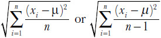

<!-- 原 EPUB 中此公式为图片，已原样保留 -->

<!-- source:block 241fb1188659fd53 -->

> [!quote]- English 26
> In each case, *x**i* are the data points, μ is the mean of all data points, and *n* is the total number of data points. The only difference between the two methods is the denominator, either *n* or *n* – 1.

在每种情况下，xi是数据点，μ是所有数据点的平均值，n是数据点的总数。两种方法之间的唯一区别是分母，n或n-1。

<!-- source:block 5a1287d6bcf1cffa -->

> [!quote]- English 27
> If we want to know the standard deviation of an entire population of data points, we can use the first method, dividing by *n*. This is known as the *population standard deviation*. Suppose, however, that we have a sample set of data points from a larger population, and we want to use this sample to estimate the standard deviation of the entire population. Because our sample is limited, we are likely to miss some of the more extreme data points in the larger population. For this reason, our estimate of the standard deviation for the entire population is likely to be too low. To improve our estimate, we ought to increase the standard deviation calculation. This is commonly done by reducing the size of the denominator from *n* to *n* – 1, resulting in a *sample standard deviation* of the larger population. Because historical volatility is most often used to estimate a future volatility, historical volatility calculations are most often made using the sample standard deviation, that is, dividing by *n* – 1.

如果我们想知道整个数据点总体的标准差，我们可以使用第一种方法，除以n。这被称为人口标准差。然而，假设我们有一组来自更大人群的数据点样本集，并且我们想要使用这个样本来估计整个人群的标准差。由于我们的样本有限，我们可能会错过更大人群中一些更极端的数据点。因此，我们对整个人群标准差的估计可能太低。为了改进我们的估计，我们应该增加标准差计算。这通常是通过将分母的大小从n减少到n - 1来实现的，从而产生较大群体的样本标准差。由于历史波动率最常用于估计未来波动率，因此历史波动率计算最常使用样本标准差（即除以n-1）进行。

<!-- source:block 1d95cd466cb8c6cf -->

> [!quote]- English 28
> The data points *x**i* in a volatility calculation are the price *returns*, either the percent change in the underlying price from one time period to the next

波动率计算中的数据点xi是价格回报，或者是标的价格从一个时期到下一个时期的百分比变化

<!-- source:block 393a8e2881332057 -->

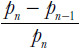

<!-- 原 EPUB 中此公式为图片，已原样保留 -->

<!-- source:block dd6d773c27b89639 -->

> [!quote]- English 29
> or, more commonly, the logarithmic change

或者，更常见的是，对数变化

<!-- source:block 77577ba75d80502d -->

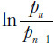

<!-- 原 EPUB 中此公式为图片，已原样保留 -->

<!-- source:block 2b5d26f30c2f2539 -->

> [!quote]- English 30
> Time periods may be any length, but for exchange-traded contracts, returns are usually based on the price change from one day’s settlement to the next.

时间段可以是任何长度，但对于交易所交易的合约，回报通常基于一天结算到下一天结算的价格变化。

<!-- source:block 1154c4e7f776ecf5 -->

> [!quote]- English 31
> In the standard deviation calculation, μ (the Greek letter mu) is the average of all price returns. Because the volatility is the deviation from average, if a contract goes up 1 percent each day for 10 consecutive days, its volatility over the 10-day period is 0; the price change never deviated from its average. To most traders, this feels wrong. The upward moves of 1 percent ought to represent some volatility other than 0. In fact, most historical volatility calculations use a *zero-mean* assumption: μ is always assumed to be 0 regardless of the actual mean.

在标准差计算中，μ（希腊字母μ）是所有价格回报的平均值。由于波动率是与平均值的偏差，如果一份合约连续10天每天上涨1%，则其10天内的波动率为0;价格变化永远不会偏离平均值。对于大多数交易者来说，这感觉是错误的。1%的上行应该代表0以外的一些波动率。事实上，大多数历史波动率计算使用零均值假设：无论实际均值如何，μ始终被假设为0。

<!-- source:block 3a7e6a2d14655851 -->

> [!quote]- English 32
> When calculating historical volatility, traders typically exclude weekends and holidays, resulting in a trading year of between 250 and 260 days. But one might also calculate volatility using all 365 days, assigning a 0 price change to nontrading days. This method might be appropriate when trying to compare the volatilities of products traded on two different exchanges with different trading calendars. The two methods will obviously yield slightly different historical volatilities. But, if historical volatility is used as a general guideline to future realized volatility, the differences are unlikely to be significant. This can be seen in Figure 20-1, which shows the three-month volatility of the Standard and Poor’s (S&P) 500 Index calculated using only trading days (approximately 252 days per year) and using all 365 days.1 The graphs are almost indistinguishable.

在计算历史波动率时，交易员通常不包括周末和假期，因此交易年在250至260天之间。但人们也可以使用所有365天来计算波动率，并为非交易日分配0的价格变化。当尝试比较在两个不同交易日历的不同交易所交易的产品的波动率时，这种方法可能是合适的。这两种方法显然会产生略有不同的历史波动率。但是，如果历史波动率被用作未来已实现波动率的一般指导方针，那么差异不太可能很大。这一点可以在图20-1中看出，该图显示了仅使用交易日（每年约252天）并使用所有365天计算的标准普尔（S & P）500指数三个月波动率。[^ovp20-1]图表几乎难以区分。

<!-- source:block 7792cf2804c935d4 -->

*Figure 20-1 S&P 500 Index three-month historical volatility: 2001–2010. / Figure 20-1 S&P 500 Index three-month historical volatility: 2001–2010.*

<!-- source:block 6fbcfb658652e79e -->

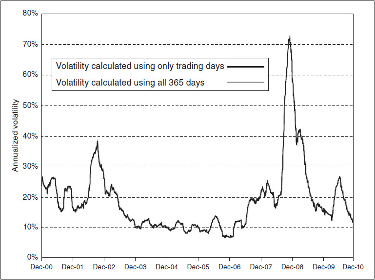

<!-- source:block 5e67b60ceed7f49d -->

> [!quote]- English 34
> Although daily price returns are most often used to calculate historical volatility, we might instead use weekly price returns. How will this affect the historical volatility calculation? Figure 20-2 shows the three-month volatility of gold from 2001 through 2010 calculated using both daily and weekly price returns. In general, the graphs show similar characteristics, although fluctuations seem to be slightly greater using weekly returns. This is probably due to the smaller number of data points (13 weekly data points rather than 91 daily data points). The greater number of data points will tend to have a smoothing effect. Because the graphs show similar characteristics, we can conclude that if a contract is volatile from day to day, it will be equally volatile from week to week or month to month. Daily returns are used most often in order to increase the number of data points in the volatility calculation and therefore yield a more accurate volatility.

尽管每日价格回报最常用于计算历史波动率，但我们可能会使用每周价格回报。这将如何影响历史波动率计算？图20-2显示了使用每日和每周价格回报计算的2001年至2010年黄金三个月波动率。总的来说，这些图表显示出相似的特征，尽管使用周回报率时波动似乎稍大一些。这可能是由于数据点数量较少（每周13个数据点，而不是91个每日数据点）。数据点数量越多，往往会产生平滑效果。由于图表显示出类似的特征，我们可以得出这样的结论：如果一份合约每天波动，那么它每周或每月的波动率也会相同。最常使用每日回报是为了增加波动率计算中的数据点数量，从而产生更准确的波动率。

<!-- source:block 427637a5ec5820f5 -->

*Figure 20-2 Gold three-month historical volatility: 2001–2010. / Figure 20-2 Gold three-month historical volatility: 2001–2010.*

<!-- source:block c4a560a6609ef916 -->

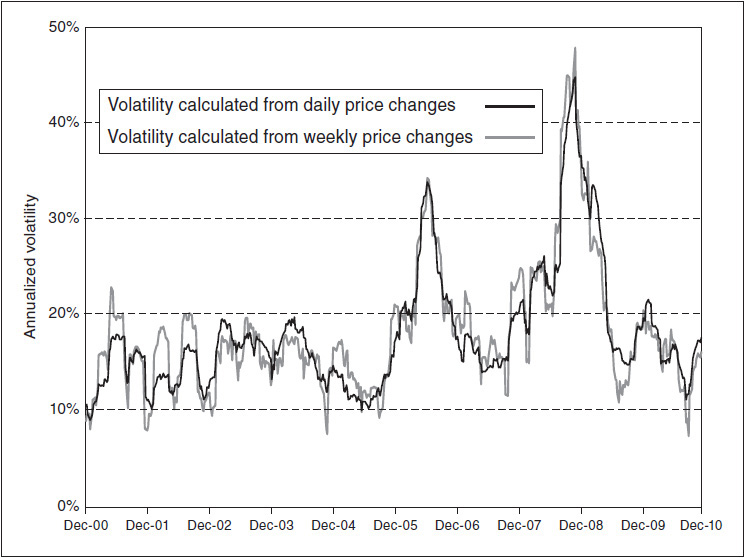

<!-- source:block ac8f7d8e9052ecde -->

> [!quote]- English 36
> Suppose that the price of a contract fluctuates wildly during a trading day, making dramatic up and down moves, yet finishes the day unchanged. If this is a common occurrence, then using only settlement prices to calculate the historical volatility may result in an incomplete picture of a contract’s true volatility. To take into consideration intraday price movement, several alternative methods have been proposed to calculate historical volatility.

假设一份合约的价格在一个交易日剧烈波动，剧烈波动，但当天结束时保持不变。如果这种情况很常见，那么仅使用结算价格来计算历史波动率可能会导致合约真实波动率的不完整描述。为了考虑盘中价格变动，提出了几种替代方法来计算历史波动率。

<!-- source:block 9dde85b7702d39e4 -->

> [!quote]- English 37
> The *extreme-value method*, proposed by Michael Parkinson,2 uses the high and low values during a 24-hour period. This method not only gives a more complete picture of volatility but may also be useful when no definitive settlement prices are available. Using the extreme-value method, the annualized historical volatility is given by

迈克尔·帕金森（Michael Parkinson）提出的极限值方法[^ovp20-2]使用24小时内的高值和低值。这种方法不仅可以更完整地了解波动率，而且在没有确定的结算价格时也可能很有用。使用极端值法，年化历史波动率由下式给出

<!-- source:block 450f4cf45a22f682 -->

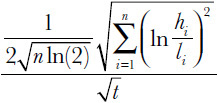

<!-- 原 EPUB 中此公式为图片，已原样保留 -->

<!-- source:block ecb50ea1e7739009 -->

> [!quote]- English 38
> where *n* = number of price returns, *h**i* = highest price during the chosen time interval, *l**i* = lowest price during the chosen time interval, ln = natural logarithm, and *t* = the length of each time interval in years.

其中n =价格返回的数量，hi =所选时间间隔内的最高价格，li =所选时间间隔内的最低价格，En =自然log，t =每个时间间隔的长度（以年为单位）。

<!-- source:block 287c80dd6916dad5 -->

> [!quote]- English 39
> An alternative approach proposed by Mark Garman and Michael Klass3 expands the Parkinson method by also including the opening and closing prices for an underlying contract. Using this method, the annualized historical volatility is given by

马克·加曼（Mark Garman）和迈克尔·克拉斯（Michael Klass）提出的另一种方法扩展了帕金森方法，还包括标的合约的开盘价和收盘价。使用此方法，年化历史波动率由下式给出 [^ovp20-3]

<!-- source:block 6a896a04dcb3b3b9 -->

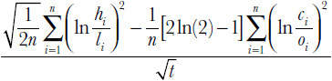

<!-- 原 EPUB 中此公式为图片，已原样保留 -->

<!-- source:block 27838e017573c972 -->

> [!quote]- English 40
> where *o**i* = opening price at the beginning of trading, and *c**i* = closing price at the end of trading.

其中oi =交易开始时的开盘价，ci =交易结束时的收盘价。

<!-- source:block a0e24e5fbdebcc98 -->

> [!quote]- English 41
> As with the traditional close-to-close estimator, both the Parkinson and Garman-Klass estimators are annualized by dividing by the square root of *t*, the time between price intervals. (This is the same as multiplying by the square root of the number of time intervals in a year.)

与传统的接近接近估计量一样，帕金森估计量和Garman-Klass估计量都通过除以t（价格区间之间的时间）的平方根来进行年化。(This与乘以一年中时间间隔数的平方根相同。）

<!-- source:block 633b746b58e1e109 -->

> [!quote]- English 42
> Figure 20-3 shows the three-month volatility of the EuroStoxx 50 Index, a widely followed index of large European companies. The volatility has been calculated using three methods: close-to-close, high-low (Parkinson), and open-high, low-close (Garman-Klass). The last two methods seem to yield a consistently lower volatility than the first method. The explanation probably has to do with the fact that Parkinson and Garman-Klass are used only when markets are open and trading is continuous. But the EuroStoxx 50 Index is not calculated continuously. It is calculated during a period of just under 10 hours, from approximately 9:00 a.m. to 6:50 p.m. European time. During the remaining hours of the day, the volatility of the index is unobservable. Because of this, for contracts that trade only during part of the day, Garman and Klass recommend giving some weight to the close-to-close estimate. One approach is to give the observable volatility (either Parkinson or Garman-Klass) weight proportional to the fraction of the day during which the market is open and give the remaining weight to the close-to-close volatility. This usually means giving greater weight to the close-to-close volatility estimate because many markets are closed more hours than they are open. But the Parkinson and Garman-Klass methods are generally considered more accurate estimates, at least when a market is trading continuously. Thus, it might make more sense to increase the weightings for these estimates and reduce the weightings for the close-to-close estimate. Garman and Klass propose a precise formula for weighting the estimates, but a practical solution might be to simply weight the estimates equally.

图20-3显示了EuroStoxx 50指数三个月的波动率，这是一个广泛关注的欧洲大型公司指数。波动率是使用三种方法计算的：接近收盘、高-低（帕金森）和开-高、低-收盘（Garman-Klass）。最后两种方法的波动率似乎始终低于第一种方法。这种解释可能与帕金森和加曼-克拉斯只有在市场开放且交易连续时才会使用这一事实有关。但EuroStoxx 50指数并不是连续计算的。计算时间不到10个小时，即欧洲时间上午9：00至下午6：50。在当天剩余的时间里，指数的波动率是不可观察的。因此，对于仅在当天部分时间交易的合约，Garman和Klass建议给予接近收盘估计一定的权重。一种方法是赋予可观察波动率（帕金森或加曼-克拉斯）与市场开放当天的比例成比例的权重，并将剩余权重赋予接近收盘的波动率。这通常意味着给予接近收盘波动率估计更大的权重，因为许多市场的收盘时间比开盘时间长。但帕金森和加曼-克拉斯方法通常被认为是更准确的估计，至少在市场连续交易时是这样。因此，增加这些估计的权重并减少接近估计的权重可能更有意义。Garman和Klass提出了一个精确的估计加权公式，但实际的解决方案可能是简单地对估计加权相等。

<!-- source:block 9e971cf73d14fd69 -->

*Figure 20-3 EuroStoxx 50 Index three-month historical volatility: 2001–2010. / Figure 20-3 EuroStoxx 50 Index three-month historical volatility: 2001–2010.*

<!-- source:block 2b9565b7dddf0f6e -->

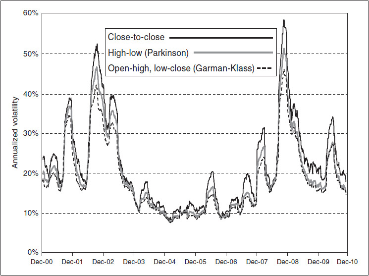

<!-- source:block 378ca2d964bdd9ad -->

> [!quote]- English 44
> Because we have gone into the calculation of historical volatility in some detail, the reader may have been left with the impression that the method chosen will be an important determinant of whether an option strategy is successful or not. For most traders, though, historical volatility is simply a guideline to what the trader is really interested in—the future realized volatility. Because the results of each method are unlikely to differ significantly, in practice, it probably does not make much difference which method is chosen. It is far more important to be able to interpret historical volatility data rather than to worry about the exact method used.

由于我们已经比较详细地计算了历史波动率，因此读者可能会留下这样的印象：所选择的方法将是期权策略是否成功的重要决定因素。不过，对于大多数交易者来说，历史波动率只是交易者真正感兴趣的内容——未来已实现波动率的指导方针。由于每种方法的结果不太可能有显着差异，因此在实践中，选择哪种方法可能不会有太大区别。能够解释历史波动数据而不是担心使用的确切方法更为重要。

<!-- source:block 9e09d2a13f734d34 -->

### 波动率的一些特征 / Some Volatility Characteristics

<!-- source:block 14d8d86168293ccd -->

> [!quote]- English 45
> In Chapter 6, we used the analogy that the volatility in its different interpretations—historical, future, implied—is similar to the weather. The volatility-weather analogy can also help us identify some basic volatility characteristics.

在第六章中，我们使用了这样的类比：不同解释（历史的、未来的、隐含的）中的波动率与天气相似。波动率与天气的类比也可以帮助我们识别一些基本的波动率特征。

<!-- source:block 6995c80c93f10fda -->

> [!quote]- English 46
> Suppose that we are trying to estimate tomorrow’s high temperature, and we have only one piece of information, today’s high temperature. What is our best estimate? Because temperatures do not usually change dramatically from one day to the next, our best estimate of tomorrow’s high temperature is probably the same as today’s high temperature. Temperature readings are said to be *serial correlated*. In the absence of other information, the best guess about what will happen over the next time period is what happened over the last time period. Volatility seems to exhibit this serial correlation characteristic. What will happen in the future often depends on what happened in the past.

假设我们试图估计明天的高温，而我们只有一条信息，那就是今天的高温。我们的最佳估计是多少？由于气温通常不会从一天到另一天发生巨大变化，因此我们对明天高温的最佳估计可能与今天的高温相同。据说温度读数是连续相关的。在没有其他信息的情况下，关于下一个时间段将发生什么的最佳猜测是上一个时间段发生的事情。波动率似乎表现出这种连续相关特征。未来会发生什么往往取决于过去发生的事情。

<!-- source:block 778f035896e5baff -->

> [!quote]- English 47
> Now suppose that we know not only today’s high temperature but we also know the average high temperature at this time of year. If today’s high temperature is higher than the average, an intelligent estimate for tomorrow’s high probably will be lower than today’s high. If today’s high temperature is lower than the average, an intelligent estimate for tomorrow’s high will be higher than today’s high. We know that temperatures tend to be *mean reverting*. Volatility also seems to exhibit this characteristic. There is a greater likelihood that volatility, like temperature, will move toward the mean rather than away from it.

现在假设我们不仅知道今天的高温，还知道一年中这个时候的平均高温。如果今天的高温高于平均水平，那么对明天的最高气温的明智估计可能会低于今天的最高气温。如果今天的高温低于平均水平，那么对明天的最高气温的明智估计将高于今天的最高气温。我们知道气温往往会均值回归。波动率似乎也表现出这一特点。波动率更有可能像气温一样向均值移动，而不是远离均值。

<!-- source:block e82bb31e804b19d2 -->

> [!quote]- English 48
> We can see the mean-reverting characteristic of volatility if we compare Figure 20-2, the three-month volatility of gold, with Figure 20-4, the price of gold over the same period.4 Both prices and volatility sometimes rise and sometimes fall. But unlike the price of an underlying contract, which can move in one direction for long periods of time, there seems to be an equilibrium number to which volatility tends to return. Over the 10-year period in question, the price of gold rose from under \$300 per ounce to over \$1,400 per ounce. Although prices fluctuated, they never again reached the lows of 2001. On the other hand, gold volatility, in spite of dramatic fluctuations between a low of 9 percent and a high of over 40 percent, always seemed to return eventually to the 10 to 20 percent range.

如果我们将图20-2（黄金三个月的波动率）与图20-4（同期黄金价格）进行比较，我们可以看到波动率的均值回复特征。[^ovp20-4]价格和波动率有时上升，有时下降。但与标的合约的价格（可以在很长一段时间内朝一个方向移动）不同的是，似乎存在一个波动率往往会返回的均衡数。在上述10年期间，金价从每盎司不到300美元上涨至每盎司1,400美元以上。尽管价格波动，但再也没有达到2001年的低点。另一方面，尽管黄金波动率在9%的低点和超过40%的高点之间剧烈波动，但最终似乎总是回到10%至20%的范围。

<!-- source:block 0d077f83c9fbe244 -->

*图20-4黄金期货价格：2001-2010年。 / Figure 20-4 Gold futures prices: 2001–2010.*

<!-- source:block 51bf405a849d0e20 -->

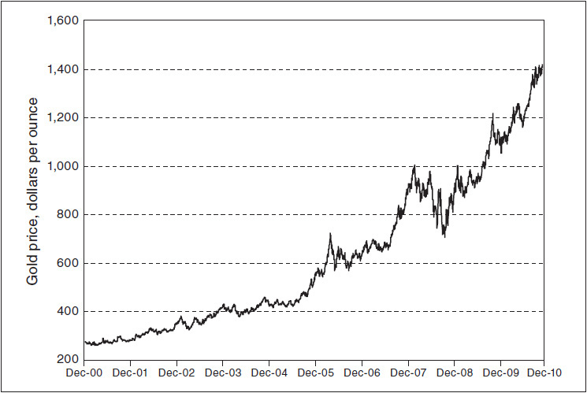

<!-- source:block 4644cd4a6ff5a8de -->

> [!quote]- English 50
> We might conclude from Figure 20-2 that gold tends to exhibit a long-term average or *mean volatility*. When volatility rises above the mean, one can be fairly certain that it will eventually fall back to its mean. When volatility falls below the mean, one can be fairly certain that it will eventually rise to its mean. There is a constant gyration back and forth through this mean.

我们可以从图20-2中得出结论，黄金往往表现出长期平均或平均波动率。当波动率升至平均值以上时，人们可以相当肯定它最终会回落到平均值。当波动率低于平均值时，人们可以相当肯定它最终会上升到平均值。通过这种方法存在着不断的来回旋转。

<!-- source:block 097cf1db8000a6ab -->

> [!quote]- English 51
> Mean reversion is a common volatility characteristic of almost all traded underlying contracts. Figures 20-1 and 20-5 show the three-month historical volatility, using daily returns, for the S&P 500 Index and Bund futures from 2001 to 2010. In spite of the dramatic fluctuations, both the S&P 500 Index and Bund futures tend to exhibit a mean volatility to which both contracts tend to return. In the case of the S&P 500 Index, this seems to be somewhere between 15 and 20 percent. In the case of the Bund, a much less volatile contract, the mean volatility seems to be around 5 percent.

均值回归是几乎所有交易标的合约的共同波动率特征。图20-1和20-5显示了2001年至2010年标准普尔500指数和外滩期货的三个月历史波动率（使用每日回报率）。尽管波动剧烈，但标准普尔500指数和外滩期货往往表现出平均波动率，两种合约往往都会回归。就标准普尔500指数而言，这一比例似乎在15%至20%之间。就波动率小得多的外滩而言，平均波动率似乎在5%左右。

<!-- source:block dfe5b59110fb9cca -->

*图20-5 2001-2010年外滩期货三个月历史波动率 / Figure 20-5 Bund futures three-month historical volatility: 2001–2010.*

<!-- source:block 6b87c63fbd1f8af8 -->

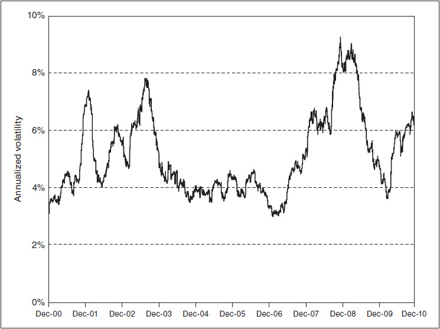

<!-- source:block 1104277ef546ce9e -->

> [!quote]- English 53
> In Figures 20-6 through 20-8, we can see more clearly the mean-reverting characteristic of volatility. These graphs show the minimum, maximum, and average realized volatilities for the S&P 500 Index, gold futures, and Bund futures from 2001 to 2010 over time periods ranging from 2 to 300 weeks. For example, in Figure 20-6, if we consider every possible two-week period from 2001 to 2010, we can see that the minimum two-week volatility for the S&P 500 Index was approximately 5 percent, while the maximum two-week volatility was just over 100 percent. The average two-week volatility was approximately 18 percent. For every possible 300-week period, the minimum volatility for the S&P 500 Index was approximately 14 percent, the maximum volatility was 24 percent, and the average volatility was approximately 19 percent. The graphs for the gold futures (Figure 20-7) and for Bund futures (Figure 20-8) show the same general characteristics. As we increase the length of time over which the volatility is calculated, the results tend to converge to an average or mean volatility.

在图20-6至20-8中，我们可以更清楚地看到波动率的均值回复特征。这些图表显示了2001年至2010年期间标准普尔500指数、黄金期货和外滩期货在2至300周期间的最小、最大和平均已实现波动率。例如，在图20-6中，如果我们考虑2001年至2010年的每个可能的两周时期，我们可以看到标准普尔500指数的最小两周波动率约为5%，而最大两周波动率略高于100%。两周平均波动率约为18%。对于每个可能的300周周期，标准普尔500指数的最低波动率约为14%，最大波动率为24%，平均波动率约为19%。黄金期货（图20-7）和德国央行期货（图20-8）的图表显示出相同的一般特征。随着我们增加计算波动率的时间长度，结果往往会收敛到平均或平均波动率。

<!-- source:block 335c7b5630f984e8 -->

*图20-6 2001-2010年标普500指数各时间段的历史已实现波动率 / Figure 20-6 S&P 500 Index historical realized volatility by time period: 2001–2010.*

<!-- source:block 83890aba5bc408ac -->

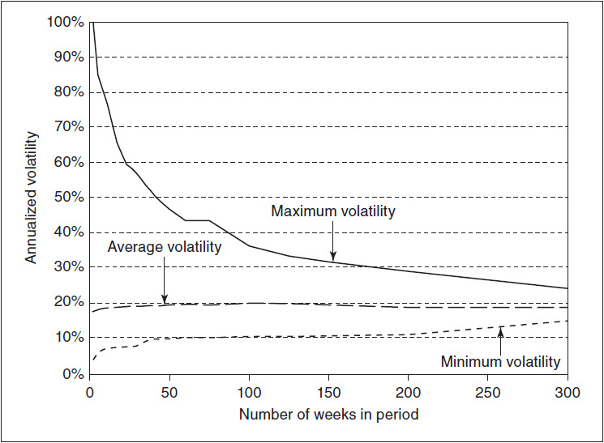

<!-- source:block 4a30d7aa26399c0b -->

*图20-7按时间段划分的黄金期货历史实现波动率：2001-2010年。 / Figure 20-7 Gold futures historical realized volatility by time period: 2001–2010.*

<!-- source:block 6199fbfb63d07895 -->

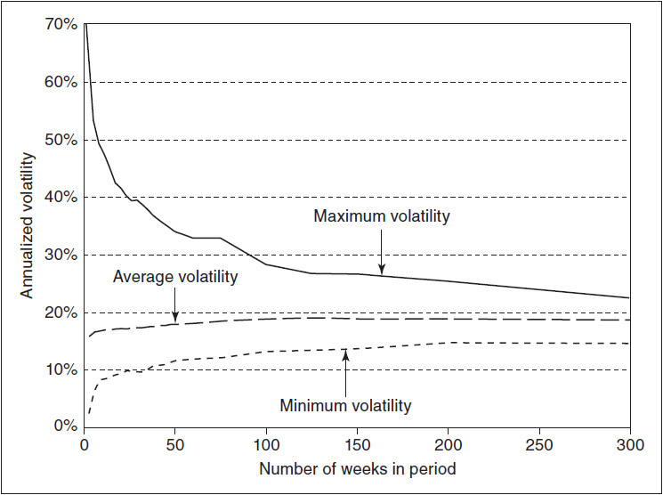

<!-- source:block 69403647c82690cd -->

*图20-8按时间段划分的外滩期货历史实现波动率：2001-2010年。 / Figure 20-8 Bund futures historical realized volatility by time period: 2001–2010.*

<!-- source:block d816e70cdd7ff4f9 -->

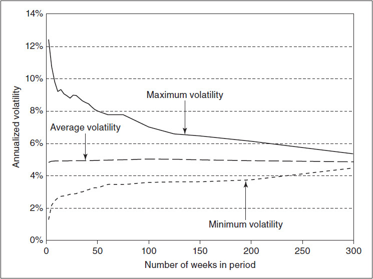

<!-- source:block 158be00c7d750b89 -->

> [!quote]- English 57
> Graphs similar to those in Figures 20-6 through 20-8 are often used to illustrate the *term structure* of volatility—the likelihood of volatility falling within a given range over a specified period of time. The term-structure graph typically has a conic shape, with greater variations over short periods of time and smaller variations over long periods.5 Because of the term structure of volatility, it is often easier to predict long-term volatility than short-term volatility. This may seem counterintuitive because we tend to expect greater variability over long periods of time than over short periods. However, volatility can be thought of as an average variability. Over long periods of time, the large and small price fluctuations tend to offset each other, resulting in more stable results.

与图 20-6 至图 20-8 类似的图形，经常用来说明波动率的期限结构，即在特定时间段内，波动率落在某一范围内的可能性。期限结构图通常呈锥形：短期的变化范围较大，长期的变化范围较小。由于波动率存在期限结构，长期波动率往往比短期波动率更容易预测。这似乎违反直觉，因为我们通常预期长时间内的价格变动幅度会大于短时间。然而，波动率可以理解为平均变动程度；在较长时间内，较大和较小的价格波动往往相互抵消，因而产生更稳定的结果。 [^ovp20-5]

<!-- source:block 006a3c027359dfd9 -->

> [!quote]- English 58
> Because long-term volatility tends to be more stable than short-term volatility, one might assume that it is easier to value long-term options than short-term options. This would be true if all options were equally sensitive to changes in volatility. But we know that long-term options have greater vega values than short-term options—they are more sensitive to changes in volatility. This means that any volatility error will be greatly magnified when evaluating a long-term option. Depending on the time to expiration, the effect of a two or three percentage point volatility error on a long-term option may be greater than a five or six percentage point error on a short-term option.

由于长期波动率往往比短期波动率更稳定，因此人们可能会认为长期期权比短期期权更容易估值。如果所有期权对波动率变化同样敏感，情况就会成立。但我们知道，长期期权比短期期权具有更大的Vega值——它们对波动率的变化更敏感。这意味着在评估长期期权时，任何波动率误差都会被大大放大。根据到期时间的不同，两到三个百分点的波动率误差对长期期权的影响可能大于五到六个百分点的波动率误差对短期期权的影响。

<!-- source:block 4f56a20bef7d8e67 -->

> [!quote]- English 59
> What else can we say about volatility? Looking again at Figure 20-2, we might surmise that volatility has some trending characteristics. From early 2004 through the middle of 2005, there was a persistent downward trend in gold volatility. This was followed by a more dramatic upward trend from the middle of 2005 to the middle of 2006. And from early 2007 through most of 2008, there seemed to be a stepping-stone increase in volatility to a high of over 40 percent. Within these major trends, there were also minor trends as volatility rose and fell for short periods of time. In this respect, volatility charts seem to display some of the same characteristics as price charts, and it would not be unreasonable to apply some of the same principles used in technical analysis to volatility analysis. It is important to remember, however, that although price changes and volatility are related, they are not the same thing. If a trader tries to apply exactly the same rules of technical analysis to volatility analysis, he is likely to find that in some cases the rules have no relevance and that in other cases the rules must be modified to take into account the unique characteristics of volatility.

关于波动率，我们还能说什么？再次查看图20-2，我们可能会推测波动率具有一些趋势特征。从2004年初到2005年中期，黄金波动率持续下降趋势。随后，从2005年中期到2006年中期出现了更加急剧的上升趋势。从2007年初到2008年大部分时间，波动率似乎出现了垫脚石式的上升，达到了40%以上的高点。在这些主要趋势中，也存在一些小趋势，因为波动率在短时间内起伏不定。在这方面，波动率图表似乎显示出一些与价格图表相同的特征，并且将技术分析中使用的一些相同原则应用于波动率分析并非不合理。然而，重要的是要记住，尽管价格变化和波动率是相关的，但它们并不是一回事。如果交易者试图将完全相同的技术分析规则应用于波动率分析，他可能会发现在某些情况下规则没有相关性，而在其他情况下规则必须进行修改以考虑波动率的独特特征。

<!-- source:block f4bb501c0ff9d95b -->

## 波动率预测 / Volatility Forecasting

<!-- source:block 65a880cfd70ced04 -->

> [!quote]- English 60
> How can we use historical volatility data, together with the characteristics of volatility, to predict future realized volatility? Suppose that we have the following historical volatility data for an underlying contract:

我们如何利用历史波动率数据以及波动率的特征来预测未来已实现的波动率？假设我们拥有标的合约的以下历史波动率数据：

<!-- source:block d2cb2e1919d7a9ae -->

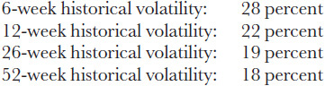

<!-- 原 EPUB 中此公式为图片，已原样保留 -->

<!-- source:block c781ebc710c95873 -->

> [!quote]- English 61
> We might prefer to look at more volatility data, but if these are the only data available, how should we go about making a volatility forecast?

我们可能更愿意查看更多的波动率数据，但如果这些是唯一可用的数据，我们应该如何进行波动率预测？

<!-- source:block d731d80854bbb9df -->

> [!quote]- English 62
> One possible approach is to simply average all the available data:

一种可能的方法是简单地平均所有可用数据：

<!-- source:block 9045ae00f5c2891e -->

> [!quote]- English 63
> (28% + 22% + 19% + 18%)/4 = 21.75%

$$
(28\% + 22\% + 19\% + 18\%)/4 = 21.75\%
$$

<!-- source:block 3245dbc35ccac3b0 -->

> [!quote]- English 64
> Using this method, each piece of historical data is given equal weight. But is this reasonable? Perhaps some data are more important than other data. A trader might assume, for example, that the more current the data, the greater their importance. Because the 28 percent volatility over the last six weeks is more current than the other volatility data, perhaps 28 percent should play a greater role in our volatility forecast. We might, for example, give twice the weight, 40 percent, to the six-week volatility but only 20 percent weight to each of the other time periods:

使用这种方法，每条历史数据都被赋予同等的权重。但这合理吗？也许有些数据比其他数据更重要。例如，交易员可能会假设数据越新，其重要性就越大。由于过去六周28%的波动率比其他波动率数据更新，因此也许28%应该在我们的波动率预测中发挥更大的作用。例如，我们可能会给六周波动率赋予两倍的权重，即40%，但给其他每个时间段赋予20%的权重：

<!-- source:block f1469d222c643f18 -->

> [!quote]- English 65
> (40% × 28%) + (20% × 22%) + (20% × 19%) + (20% × 18%) = 23.0%

$$
(40\% \times 28\%) + (20\% \times 22\%) + (20\% \times 19\%) + (20\% \times 18\%) = 23.0\%
$$

<!-- source:block 6160187e9f0ef27c -->

> [!quote]- English 66
> Our volatility forecast has increased slightly because of the additional weight given to the six-week historical volatility.

由于六周历史波动率的额外权重，我们的波动率预测略有增加。

<!-- source:block 74cca56ee0ab87bc -->

> [!quote]- English 67
> Of course, if it is true that the more recent volatility over the last 6 weeks is more important than the other data, it follows that the volatility over the last 12 weeks ought to be more important than the volatility over the last 26 and 52 weeks. It also follows that the volatility over the last 26 weeks must be more important that the volatility over the last 52 weeks. We can factor this into our forecast by using a regressive weighting, giving more distant volatility data progressively less weight in our forecast. For example, we might calculate

当然，如果过去6周的最近波动率确实比其他数据更重要，那么过去12周的波动率应该比过去26周和52周的波动率更重要。由此可见，过去26周的波动率一定比过去52周的波动率更重要。我们可以通过使用回归加权将其纳入预测中，使更远的波动率数据在预测中的权重逐渐降低。例如，我们可能会计算

<!-- source:block 8b20b9991d7567fc -->

> [!quote]- English 68
> (40% × 28%) + (30% × 22%) + (20% × 19%) + (10% × 18%) = 23.4%

$$
(40\% \times 28\%) + (30\% \times 22\%) + (20\% \times 19\%) + (10\% \times 18\%) = 23.4\%
$$

<!-- source:block 1759bd1a0bd0a1ed -->

> [!quote]- English 69
> Here we have given the 6-week volatility 40 percent of the weight, the 12-week volatility 30 percent of the weight, the 26-week volatility 20 percent of the weight, and the 52-week volatility 10 percent of the weight.

在这里，我们将6周波动率的40%权重，将12周波动率的30%权重，将26周波动率的20%权重，将52周波动率的10%权重。

<!-- source:block 5c3d05ce459a8811 -->

> [!quote]- English 70
> We have made the assumption that the more recent the data, the greater their importance. Is this always true? If we are interested in evaluating short-term options, it may be true that data that cover short periods of time are the most important. But suppose that we are interested in evaluating very long-term options. Over long periods of time, the mean-reverting characteristic of volatility is likely to reduce the importance of any short-term fluctuations in volatility. In fact, over very long periods of time, the most reasonable volatility forecast is simply the long-term mean volatility of the instrument. Therefore, the relative weight we give to the different volatility data will depend on the amount of time remaining to expiration for the options in which we are interested.

我们假设数据越新，其重要性就越大。这总是正确的吗？如果我们有兴趣评估短期选择，那么涵盖短时间段的数据可能确实是最重要的。但假设我们有兴趣评估非常长期的选择。在很长一段时间内，波动率的均值回复特征可能会降低波动率短期波动的重要性。事实上，在很长一段时间内，最合理的波动率预测只是工具的长期平均波动率。因此，我们赋予不同波动率数据的相对权重将取决于我们感兴趣的期权距离到期的剩余时间。

<!-- source:block c62a0783d49fcd08 -->

> [!quote]- English 71
> In a sense, all the historical volatilities we have at our disposal are current; they simply cover different periods of time. How do we know which data are the most important? In addition to the mean-reverting characteristic, we know that volatility also tends to be serial correlated. The volatility over any given period is likely to depend on, or correlate with, the volatility over the previous period, assuming that both periods cover the same amount of time. If the volatility of a contract over the last four weeks was 15 percent, the volatility over the next four weeks is more likely to be close to 15 percent than far away from 15 percent. Once we realize this, we might logically choose to give the greatest weight to the volatility data covering a time period closest to the life of the options in which we are interested. That is, if we are trading very long-term options, the long-term data should be given the most weight. If we are trading very short-term options, the short-term data should be given the most weight. And if we are trading intermediate-term options, the intermediate-term data should be given the most weight.

从某种意义上说，我们掌握的所有历史波动都是当前的;它们只是涵盖不同的时期。我们如何知道哪些数据最重要？除了均值回复特征外，我们知道波动率也往往具有序列相关性。假设两个时期涵盖相同的时间，任何给定时期的波动率都可能取决于或与前一时期的波动率相关。如果合约在过去四周的波动率为15%，那么未来四周的波动率更有可能接近15%，而不是远离15%。一旦我们意识到这一点，我们可能会在逻辑上选择给波动率数据最大的权重，这些波动率数据覆盖的时间段最接近我们感兴趣的期权的生命周期。也就是说，如果我们交易的是非常长期的期权，长期数据应该被赋予最大的权重。如果我们交易的是非常短期的期权，那么短期数据应该被赋予最大的权重。如果我们交易中期期权，中期数据应该被赋予最大的权重。

<!-- source:block 510359125eefbee4 -->

> [!quote]- English 72
> Given the serial correlation characteristic of volatility, what volatility should we assign to options that expire in five months if we have only our four historical volatilities: 6-week, 12-week, 26-week, and 52-week volatilities? Because 5 months is closest to 26 weeks, we can give the 26-week volatility the greatest weight and give other data correspondingly lesser weight

鉴于波动率的序列相关性，如果我们只有四个历史波动率：6周、12周、26周和52周波动率，我们应该为五个月后到期的期权分配多大的波动率？由于5个月最接近26周，因此我们可以赋予26周波动率最大的权重，而赋予其他数据相应较小的权重

<!-- source:block b18317e1329b9177 -->

> [!quote]- English 73
> (15% × 28%) + (25% × 22%) + (35% × 19%) + (25% × 18%) = 20.85%

$$
(15\% \times 28\%) + (25\% \times 22\%) + (35\% \times 19\%) + (25\% \times 18\%) = 20.85\%
$$

<!-- source:block b5b80913e0b4c6ec -->

> [!quote]- English 74
> Alternatively, if we are interested in evaluating 3-month options, we can give the greatest weight to the 12-week historical volatility

或者，如果我们有兴趣评估3个月的期权，我们可以给予12周历史波动率最大的权重

<!-- source:block 2e84bfa42b9a516c -->

> [!quote]- English 75
> (25% × 28%) + (35% × 22%) + (25% × 19%) + (15% × 18%) = 22.15%

$$
(25\% \times 28\%) + (35\% \times 22\%) + (25\% \times 19\%) + (15\% \times 18\%) = 22.15\%
$$

<!-- source:block dcb908a6da7bc6c3 -->

> [!quote]- English 76
> In the foregoing examples, we used only four historical volatilities. But the more volatility data that are available, the more accurate any volatility forecast is likely to be. Not only will more data, covering different periods of time, give a better overview of the volatility characteristics of an underlying instrument, they will also enable a trader to more closely match historical volatilities to options with different periods of time to expiration. In our examples, we used historical volatilities over the last 12 and 26 weeks as approximations to forecast volatilities over the next six and three months. Ideally, we would like historical data covering exactly six- and three-month periods.

在前面的例子中，我们仅使用了四个历史波动率。但可用的波动率数据越多，波动率预测就可能越准确。涵盖不同时期的更多数据不仅可以更好地概述标的工具的波动率特征，还可以使交易员能够更接近地将历史波动率与不同期限到期的期权进行匹配。在我们的例子中，我们使用过去12周和26周的历史波动率作为近似值来预测未来六个月和三个月的波动率。理想情况下，我们希望历史数据恰好涵盖六个月和三个月的时期。

<!-- source:block c28adbb7816260e8 -->

> [!quote]- English 77
> This approach to forecasting volatility is one that many traders use intuitively. It depends on identifying the typical characteristics of volatility and then projecting a volatility over some future period.

这种预测波动率的方法是许多交易员直观地使用的方法。它取决于识别波动率的典型特征，然后预测未来某个时期的波动率。

<!-- source:block cfc7984e0a3698cd -->

> [!quote]- English 78
> The analysis of a data series in order to predict future values falls into an area of study usually referred to as *time-series analysis*. We might wish to apply time-series models to volatility forecasting, but to do so, we need a series of data points where each point is independent of every other point. In our examples, the volatilities we used to make our prediction do not form a true time series because the volatilities overlap and, as such, are not really independent of each other. The 52-week volatility overlaps the 26-, 12-, and 6-week volatilities. The 26-week volatility overlaps the 12- and 6-week volatilities. And the 12-week volatility overlaps the 6-week volatility. But suppose that instead of using as our data points, the historical volatilities, we use the underlying returns. These returns create a true time series to which we might be able to apply a time-series model.

为了预测未来价值而对数据序列进行分析属于通常称为时间序列分析的研究领域。我们可能希望将时间序列模型应用于波动率预测，但要做到这一点，我们需要一系列数据点，其中每个点都独立于所有其他点。在我们的例子中，我们用来进行预测的波动率并没有形成真正的时间序列，因为波动率重叠，因此并不真正相互独立。52周的波动与26周、12周和6周的波动重叠。26周的波动与12周和6周的波动重叠。12周的波动与6周的波动重叠。但假设我们不使用历史波动率作为数据点，而是使用标的回报。这些回报创建了一个真实的时间序列，我们可能能够对其应用时间序列模型。

<!-- source:block d64c51d8bf3ad4a4 -->

> [!quote]- English 79
> One time-series model often used to estimate future volatility is the *exponentially weighted moving average* (EWMA) *model*. In this model, greater weight is always given to more recent returns, with older returns given progressively smaller weightings. If α is the weighting assigned to each return *r*, then the estimated variance (the square of the standard deviation) σ2 over the next period of time is given by

常用于估计未来波动率的一种时间序列模型是指数加权移动平均（EGMA）模型。在这个模型中，最近的回报总是被赋予更大的权重，而旧回报的权重逐渐变小。如果a是分配给每个回报r的权重，那么下一个时间段内的估计方差（标准差的平方）δ 2由下式给出

<!-- source:block a1e5f2c547fce2d2 -->

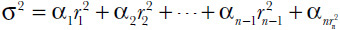

<!-- 原 EPUB 中此公式为图片，已原样保留 -->

<!-- source:block 622322be1f68b1d0 -->

> [!quote]- English 80
> where *r**n* is the most recent return. The constraints are that all the weightings must add up to 1.00

其中rn是最近的回报。限制是所有权重总和必须等于1.00

<!-- source:block a1c1f8e9a6986ec1 -->

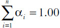

<!-- 原 EPUB 中此公式为图片，已原样保留 -->

<!-- source:block 5bbd08d17fb07102 -->

> [!quote]- English 81
> and that the more recent the return, the greater is the weighting

回报越近，权重越大

<!-- source:block 0284f502adad6aa7 -->

> [!quote]- English 82
> α*n* > α*n*–1

$$
α_{n} > α_{n-1}
$$

<!-- source:block aee11bc6c83cd754 -->

> [!quote]- English 83
> By choosing a variable λ between 0 and 1.00, the constraints will be met if

通过选择0和1.00之间的变量A，满足以下条件的约束

<!-- source:block 025875283d99f47e -->

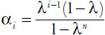

<!-- 原 EPUB 中此公式为图片，已原样保留 -->

<!-- source:block 6c5dc762174e45da -->

> [!quote]- English 84
> As we reduce the value of λ, more recent returns are assigned progressively greater weight—the variance estimate tends to discount the effect of older returns. As we increase the value of λ, the estimate makes less and less distinction between returns—older returns become just as important as newer returns. As λ approaches 1.00 (it can never be exactly 1.00), the weight for all returns converges to a single value, 1.00/*n*. A common choice for λ in many risk-management programs is something close to 0.94.

随着我们降低参数的值，最近的回报会被赋予越来越大的权重——方差估计往往会低估旧回报的影响。随着我们增加参数的值，估计回报之间的区别越来越小——较旧的回报变得与较新的回报一样重要。当参数接近1.00（它永远不可能恰好是1.00）时，所有返回的权重都会收敛到一个值1.00/n。在许多风险管理计划中，通常选择的参数接近0.94。

<!-- source:block 30da55a350d6d671 -->

> [!quote]- English 85
> The EWMA model is relatively simple method for predicting volatility. Two factors that it ignores are the likely correlation between successive returns and the mean-reversion characteristic of volatility. The time-series models most often used to forecast volatility were an outgrowth of the *autoregressive conditional heteroskedasticity* (ARCH) *model* first proposed by Robert Engle in 1982.6 The techniques used in ARCH models have subsequently been refined and extended into what is now commonly referred to as the *generalized autoregressive conditional heteroskedasticity* (GARCH) family of volatility forecasting models. GARCH models consist of three components: a volatility estimate, such as EWMA; a correlation component reflecting the fact that the magnitude of successive returns tends to be correlated (i.e., large returns tend to be followed by large returns, and small returns tend to be followed by small returns); and a mean-reversion component specifying how fast volatility tends to revert to its mean. An in-depth discussion of GARCH models is beyond the scope of this text, but further information on these models is available in most advanced texts on time-series analysis.

ELMA模型是预测波动率的相对简单方法。它忽视的两个因素是连续回报与波动率的均值回归特征之间可能的相关性。最常用于预测波动率的时间序列模型是罗伯特·恩格尔（Robert Engle）于1982年首次提出的自回归条件异方差（ARCH）模型的产物。[^ovp20-6]自回归条件异方差（ARCH）模型中使用的技术随后被改进并扩展为现在通常称为广义自回归条件异方差（GARCH）波动预测模型家族。GSYS模型由三个部分组成：波动率估计，例如EWM;相关性部分，反映连续回报的幅度往往是相关的事实（即，大回报之后往往会有大回报，而小回报之后往往会有小回报）;以及均值回归组件，指定波动率恢复到均值的速度。对GSYS模型的深入讨论超出了本文的范围，但有关这些模型的更多信息可以在有关时间序列分析的最高级文本中找到。

<!-- source:block 54a6a8c40802e273 -->

## 以隐含波动率预测未来波动率 / Implied Volatility as a Predictor of Future Volatility

<!-- source:block 78e3296bfc66feca -->

> [!quote]- English 86
> If, as many traders believe, prices in the marketplace reflect all available information affecting the value of a contract,7 the best predictor of the future realized volatility ought to be the implied volatility. Just how good a predictor of future volatility is implied volatility? Although it may be impossible to answer this question definitively, because that would require a detailed study of many markets over long periods of time, we still might gain some insight by looking at sample data.

如果正如许多交易员所认为的那样，市场价格反映了影响合约价值的所有可用信息[^ovp20-7]，那么未来已实现波动率的最佳预测者应该是隐含波动率。隐含波动率对于未来波动率的预测有多好？尽管可能不可能最终回答这个问题，因为这需要对许多市场进行长时间的详细研究，但我们仍然可以通过查看样本数据来获得一些见解。

<!-- source:block 9c95599161d5c565 -->

> [!quote]- English 87
> Figure 20-9 shows the three-month realized volatility (approximately 63 trading days) for the S&P 500 Index and a rolling implied volatility for three-month at-the-money options8 on the index from 2002 through 2010. However, the values for the three-month realized volatility have been shifted forward so that each data point represents the future realized volatility of the index over the next three months. If implied volatility is a perfect predictor of future volatility, both graphs would be identical, but obviously, this is not the case. In general, the volatility of the S&P 500 Index tends to lead the implied volatility. If the index becomes more volatile, implied volatility rises; if the index becomes less volatile, implied volatility falls. The marketplace seems to react to the volatility of the index. This was particularly evident during 2008, when implied volatility rose following the dramatic increase in volatility of the index, and in 2009, when implied volatility fell as the index itself became less volatile.

图 20-9 对比了标普 500 指数的三个月已实现波动率（约 63 个交易日），以及 2002–2010 年该指数三个月平值期权的滚动隐含波动率。图中将三个月已实现波动率向前平移，使每个数据点表示其后三个月的已实现波动率。如果隐含波动率能完美预测未来波动率，两条曲线应当完全重合，但事实显然并非如此。总体而言，标普 500 指数的实际波动变化往往先于隐含波动率：指数波动加剧时，隐含波动率上升；指数波动减弱时，隐含波动率下降。市场似乎是在对指数已经发生的波动作出反应。2008 年这一点尤为明显：指数波动率急剧上升后，隐含波动率随之上升；到 2009 年，随着指数本身的波动率下降，隐含波动率也随之回落。 [^ovp20-8]

<!-- source:block e5ec90409a57a462 -->

*图20-9标准普尔500指数三个月未来波动率与三个月隐含波动率。 / Figure 20-9 S&P 500 Index three-month future volatility versus the three-month implied volatility.*

<!-- source:block ce1dded1d8e2bb23 -->

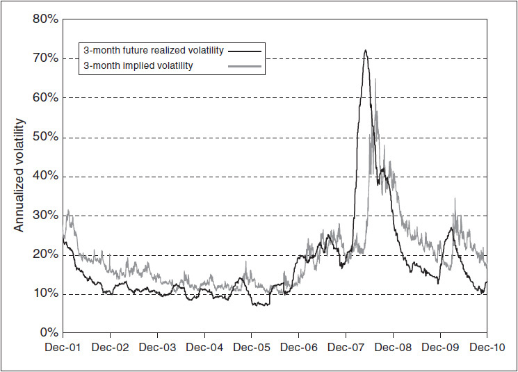

<!-- source:block b20e2d5586e718e9 -->

> [!quote]- English 89
> We can do the same comparison using a 12-month period. Figure 20-10 shows the 12-month future realized volatility of the S&P 500 Index (approximately 252 trading days) versus a rolling 12-month at-the-money implied volatility over the same time period. Here the lag is even more evident due to the longer time frame.

我们可以使用12个月的时间进行相同的比较。图20-10显示了标准普尔500指数未来12个月已实现波动率（约252个交易日）与同期12个月滚动平值隐含波动率。由于时间范围较长，滞后现象更加明显。

<!-- source:block ed2f1c9c9b5b20b8 -->

*图20-10标准普尔500指数12个月未来波动率与12个月隐含波动率。 / Figure 20-10 S&P 500 Index 12-month future volatility versus the 12-month implied volatility.*

<!-- source:block 399daaf43276b846 -->

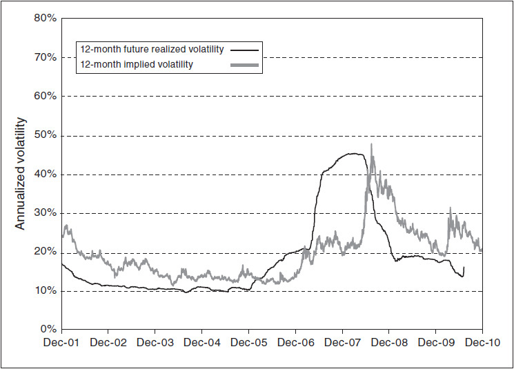

<!-- source:block 314227bcb40be03a -->

> [!quote]- English 91
> Clearly, the implied volatility in our examples did not accurately predict future volatility. But, even if the implied volatility was not a totally accurate predictor, perhaps we can draw some conclusions by looking at the difference between the implied volatility and the future realized volatility. This is shown in Figure 20-11 for both 3- and 12-month options. A positive value indicates an implied volatility that was too low (the future realized volatility turned out to be higher), while a negative value indicates an implied volatility that was too high (the future realized volatility turned out to be lower).

显然，我们示例中的隐含波动率并不能准确预测未来的波动率。但是，即使隐含波动率不是一个完全准确的预测因素，也许我们可以通过观察隐含波动率和未来实现波动率之间的差异来得出一些结论。对于3个月和12个月期权，这如图20-11所示。正值表示隐含波动率太低（未来已实现波动率更高），而负值表示隐含波动率太高（未来已实现波动率更低）。

<!-- source:block 75bda42ed9ae1bf9 -->

*图20-11标准普尔500指数未来波动率与隐含波动率之间的差异。 / Figure 20-11 Difference between future volatility and implied volatility for the S&P 500 Index.*

<!-- source:block 58f49a644237fae3 -->

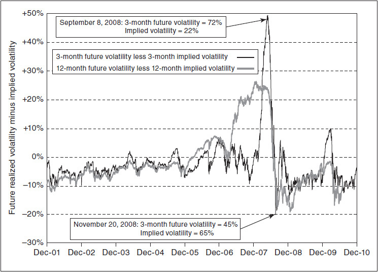

<!-- source:block b3ed0fa7c585145e -->

> [!quote]- English 93
> We can see in Figure 20-11 that for much of the period in question, implied volatility seemed to predict a future volatility that was too high by up to 10 percentage points. But there are some dramatic exceptions. During 2008, the three-month implied volatility at one point predicted a future volatility that was too low by almost 50 percentage points and at another point predicted a volatility that was too high by 20 percentage points. Admittedly, 2008 was a year of extremes, but even during other years, a difference of 10 percentage points between implied volatility and future volatility was not uncommon.

从图20-11中我们可以看到，在所讨论的大部分时间里，隐含波动率似乎预测了未来的波动率，最高可达10个百分点。但也有一些戏剧性的例外。2008年，三个月隐含波动率在某一点预测未来波动率过低近50个百分点，在另一点预测波动率过高20个百分点。诚然，2008年是极端的一年，但即使在其他年份，隐含波动率和未来波动率之间10个百分点的差异也并不罕见。

<!-- source:block cfc8c3255b48aec1 -->

> [!quote]- English 94
> Implied volatility is at best an imperfect predictor of future volatility. What else might we conclude from these graphs? Under normal conditions, implied volatility seems to be too high—options tend to be overpriced. Buyers of options may be willing to pay this extra premium in return for the few occasions when implied volatility is dramatically too low and there is a subsequent volatility explosion. This is analogous to insurance. A rational buyer of insurance is aware that the price of an insurance contract is almost certainly higher than its value. Otherwise, the insurance company would have no profit expectation. But buyers of insurance are willing to pay this extra premium for those rare occasions when an unforeseen event occurs and the insurance becomes absolutely necessary.

隐含波动率充其量只是未来波动率的不完美预测因素。我们还可以从这些图表中得出什么结论？在正常情况下，隐含波动率似乎过高——期权往往定价过高。期权买家可能愿意支付额外的溢价，以换取少数隐含波动率过低且随后波动率爆炸的情况。这类似于保险。理性的保险购买者知道保险合约的价格几乎肯定高于其价值。否则保险公司就没有盈利预期。但保险购买者愿意在发生不可预见事件且保险变得绝对必要的罕见情况下支付这笔额外保费。

<!-- source:block 633d32105e4170b9 -->

> [!quote]- English 95
> There are, of course, other reasons why options tend to be overpriced. For the seller of an option, such as a market maker, there may be a cost to replicating the option through the dynamic hedging process, a cost that the market maker is likely to pass on to the customer. Moreover, there may be weaknesses in the theoretical pricing model from which implied volatility is derived. Taken together, these factors may in fact justify the seemingly inflated prices of options in the marketplace.

当然，期权往往定价过高还有其他原因。对于期权的卖方（例如做市商）来说，通过动态对冲流程复制期权可能会产生成本，做市商可能会将这种成本转嫁给客户。此外，推导隐含波动率的理论定价模型可能存在弱点。总而言之，这些因素实际上可能证明市场上期权价格看似过高是合理的。

<!-- source:block 3edf31a074706d2a -->

### 隐含波动率期限结构 / The Term structure of Implied Volatility

<!-- source:block c355cd291b6b7fe4 -->

> [!quote]- English 96
> If held to expiration, the sole determinant of an option position’s value is, in theory, the realized volatility of the underlying contract. However, a trader may decide for a variety of reasons that a position should be closed prior to expiration. The position may have achieved its expected profit potential prior to expiration. Or the position, even if it hasn’t achieved its expected profit, may have become too risky. Or holding the position may require a large amount of capital, capital that could be put to better use. Regardless of why a trader decides to close out a position prior to expiration, there is usually one primary cause: changes in implied volatility. Although we have emphasized the importance of realized volatility, in the real world of option trading, changes in implied volatility can often make or break a strategy. For this reason, a sensible trader will give some thought to how changes in implied volatility will affect a position.

理论上，如果持有至到期，期权头寸价值的唯一决定因素是标的合约的已实现波动率。然而，交易员可能会出于各种原因决定在到期前关闭头寸。该头寸可能在到期前已实现预期利润潜力。或者该头寸即使没有实现预期利润，也可能变得风险太大。或者持有该头寸可能需要大量的资本，这些资本可以得到更好的利用。无论交易员为何决定在到期前平仓，通常有一个主要原因：隐含波动率的变化。尽管我们强调了已实现波动率的重要性，但在期权交易的现实世界中，隐含波动率的变化通常可以决定或破坏策略。因此，明智的交易员会考虑隐含波动率的变化将如何影响头寸。

<!-- source:block 73df3f1e0d93291c -->

> [!quote]- English 97
> It may seem that determining the sensitivity of a position to changes in implied volatility is relatively simple. We need only determine the total position vega, which we can do by adding up all the individual vega values. Unfortunately, determining the true implied volatility risk can be significantly more complex. We know that vega values change with changing market conditions, so today’s vega may not be tomorrow’s vega. Moreover, the vega values across different exercise prices and expiration months may not be a true reflection of implied-volatility risk.

确定头寸对隐含波动率变化的敏感性似乎相对简单。我们只需要确定Vega的总头寸，我们可以通过将所有单个Vega值相加来完成这一点。不幸的是，确定真正的隐含波动率风险可能要复杂得多。我们知道Vega的价值观会随着市场状况的变化而变化，所以今天的Vega可能不是明天的Vega。此外，不同行权价和到期月份的Vega值可能并不能真实反映隐含波动风险。

<!-- source:block ec044abbf525c5fc -->

> [!quote]- English 98
> Consider a market where there are three expiration months, all in the same calendar year—March, June, and September. Let’s assume that the mean volatility in this market is 25 percent, and although this almost never happens, let’s also assume that the current implied volatility for every month is the same, 25 percent.

假设一个有三个到期月份的市场，都在同一日历年——三月、六月和九月。假设该市场的平均波动率为25%，尽管这种情况几乎从未发生过，但我们也假设每个月的当前隐含波动率相同，为25%。

<!-- source:block aa25e8dd525e8214 -->

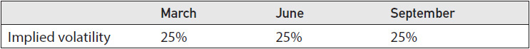

<!-- source:block 528d603b9cc2a834 -->

> [!quote]- English 99
> Suppose that the volatility of the underlying contract begins to rise. What will happen to implied volatility? Implied volatility will almost certainly rise, but will it rise at the same rate for each month? If the implied volatility for March rises to 30 percent, will the implied volatility of June and September also rise to 30 percent? Traders know that volatility is mean reverting, and there is a greater likelihood that volatility will revert to its mean over long periods of time than over short periods. Therefore, as we move to more distant expirations, implied volatility is likely to remain closer to its mean, in this case, 25 percent. The new implied volatilities might be

假设标的合约的波动率开始上升。隐含波动率会发生什么？隐含波动率几乎肯定会上升，但每月会以相同的速度上升吗？如果3月份的隐含波动率上升至30%，6月和9月的隐含波动率是否也上升至30%？交易员知道，波动率是均值回归，而且波动率在长期内恢复到均值的可能性比在短期内更大。因此，随着我们转向更远的波动率，隐含波动率可能会保持更接近其平均值，在这种情况下为25%。新的隐含波动率可能是

<!-- source:block 212447fa2c648291 -->

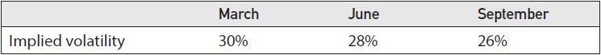

<!-- source:block 1783fa2bd10ed94e -->

> [!quote]- English 100
> Mean reversion will also affect falling implied volatility. If the underlying market becomes less volatile and implied volatility in March falls to 20 percent, the new implied volatilities might be

均值回归也将影响隐含波动率的下降。如果标的市场的波动率变得较小，并且3月份的隐含波动率降至20%，那么新的隐含波动率可能是

<!-- source:block dec8b5741d40341f -->

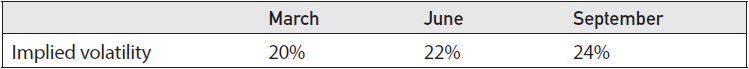

<!-- source:block c4c4bb31278e2e8c -->

> [!quote]- English 101
> Even if there is a large change in the implied volatility of short-term options, the implied volatility of long-term options will tend to change less because of the mean-reversion characteristics of volatility. Figure 20-12 shows the typical term structure of implied volatility.

即使短期期权的隐含波动率发生较大变化，但由于波动率的均值回归特征，长期期权的隐含波动率也往往会变化较小。图20-12显示了隐含波动率的典型期限结构。

<!-- source:block f4bd5621de0f52a4 -->

*图20-12隐含波动率的期限结构。 / Figure 20-12 The term structure of implied volatility.*

<!-- source:block 2573a4ca6899d2d8 -->

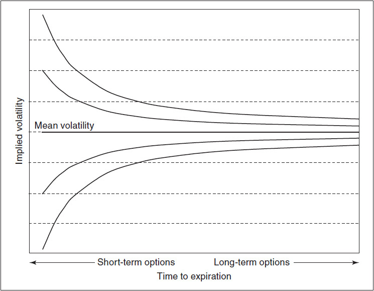

<!-- source:block 53fd1b2f8a0f1215 -->

> [!quote]- English 103
> The fact that implied volatilities across different expiration months change at different rates can have important implications for risk analysis. Consider an option position consisting of four different expiration months with the following vega values for each month:

不同到期月份的隐含波动率以不同的速度变化，这一事实可能对风险分析产生重要影响。考虑由四个不同的到期月份组成的期权头寸，每个月的Vega值如下：

<!-- source:block 1dbc12a3260fa53b -->

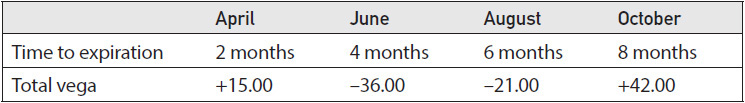

<!-- source:block 012fa872384cdecd -->

> [!quote]- English 104
> What is the implied-volatility risk of the position? We might begin by adding up all the vegas

头寸的隐含波动率风险是多少？我们可以先把所有Vega斯加起来

<!-- source:block 546b43eb2ab71cf7 -->

> [!quote]- English 105
> +15.00 – 36.00 – 21.00 + 42.00 = 0

$$
+15.00 - 36.00 - 21.00 + 42.00 = 0
$$

<!-- source:block 655c7910abf2f535 -->

> [!quote]- English 106
> With a total vega of 0, it might appear that there is no implied-volatility risk. This, however, assumes that implied volatility will change at the same rate across all months. But we know that this is unlikely. The implied volatility of short-term options will tend to change more quickly than the implied volatility of long-term options. Given this, how should we determine our total implied-volatility risk?

如果总Vega为0，那么似乎不存在隐含波动率风险。然而，这假设隐含波动率将在所有月份以相同的速度变化。但我们知道这不太可能。短期期权的隐含波动率往往比长期期权的隐含波动率变化得更快。鉴于此，我们应该如何确定总的隐含波动率风险？

<!-- source:block ffbfd8feaded8806 -->

> [!quote]- English 107
> Suppose that the mean volatility in this market is 25 percent and that we believe that the term structure of implied volatility is similar to that shown in Figure 20-13. If April implied volatility rises to 28 percent, what will be the profit or loss to the position? If there are two months remaining to April expiration and implied volatility in April rises to 28 percent, we expect June implied volatility to rise to only 27 percent, August implied volatility to only 26.5 percent, and October to only 26.1 percent. Adjusting for the different rates of change, the result is a loss because

假设该市场的平均波动率为25%，并且我们认为隐含波动率的期限结构与图20-13中所示的相似。如果4月份隐含波动率上升至28%，该头寸的损益是多少？如果距离4月到期还有两个月，并且4月隐含波动率升至28%，我们预计6月隐含波动率将仅升至27%，8月隐含波动率仅升至26.5%，10月仅升至26.1%。根据不同的变化率进行调整，结果是损失，因为

<!-- source:block ddcfbb7da823ef7b -->

*图20-13 4月、6月、8月和10月期权隐含波动率的相对变化。 / Figure 20-13 Relative changes in implied volatility for April, June, August, and October options.*

<!-- source:block e3387ce008a14b13 -->

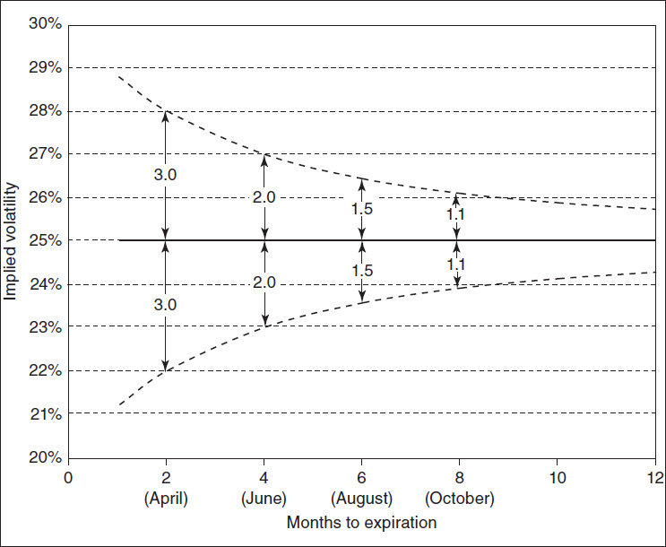

<!-- source:block 8aa0f808a62dfd2f -->

> [!quote]- English 109
> (3 × 15.00) – (2 × 36.00) – (1.5 × 21.00) + (1.1 × 42.00) = –12.30

$$
(3 \times 15.00) - (2 \times 36.00) - (1.5 \times 21.00) + (1.1 \times 42.00) = -12.30
$$

<!-- source:block a5f086d42f576230 -->

> [!quote]- English 110
> And if April implied volatility falls to 22 percent, the result will be reversed; we will show a profit of 12.30. Clearly, the position is not *vega neutral*. We would much prefer implied volatility to fall than rise.

如果4月份隐含波动率下降到22%，结果将逆转;我们将显示利润为12.30。显然，这一头寸并非Vega中立。我们更希望隐含波动率下降而不是上升。

<!-- source:block 6b95736dd4f3628c -->

> [!quote]- English 111
> In order to form a more accurate picture of the implied-volatility risk, we must adjust the vega values for each month. We know that for each percentage point change in April implied volatility, June implied volatility will change by

为了更准确地了解隐含波动率风险，我们必须调整每月的Vega值。我们知道，4月份隐含波动率每变化一个百分点，6月份隐含波动率就会变化

<!-- source:block a9593cf855a39c3d -->

> [!quote]- English 112
> 2/3 = 0.67

$$
2/3 = 0.67
$$

<!-- source:block 58e4d74bd5f1e6f0 -->

> [!quote]- English 113
> For each percentage point change in April implied volatility, August implied volatility will change by

4月份隐含波动率每变化一个百分点，8月份隐含波动率就会变化

<!-- source:block 028255d04bc75d2c -->

> [!quote]- English 114
> 1.5/3 = 0.50

$$
1.5/3 = 0.50
$$

<!-- source:block 557f5a33f10fdb49 -->

> [!quote]- English 115
> And for each percentage point change in April implied volatility, October implied volatility will change by

4月份隐含波动率每变化一个百分点，10月份隐含波动率就会变化

<!-- source:block b47f68204fbdd93a -->

> [!quote]- English 116
> 1.1/3 = 0.37

$$
1.1/3 = 0.37
$$

<!-- source:block 63cd559d8cfc7098 -->

> [!quote]- English 117
> If we want to know our total implied-volatility risk in terms of changes in April implied volatility, we can adjust our vega values accordingly

如果我们想通过4月份隐含波动率的变化来了解我们的总隐含波动率风险，我们可以相应调整我们的Vega值

<!-- source:block 3d1106507e81064e -->

> [!quote]- English 118
> June vega = –36.00 × 0.67 = –24.12

$$
\text{June vega} = -36.00 \times 0.67 = -24.12
$$

<!-- source:block 5eb1fc314d2faedb -->

> [!quote]- English 119
> August vega = –21.00 × 0.5 = –10.50

$$
\text{August vega} = -21.00 \times 0.5 = -10.50
$$

<!-- source:block 9638d014b0e2bb50 -->

> [!quote]- English 120
> October vega = +42.00 × 0.37 = +15.54

$$
\text{October vega} = +42.00 \times 0.37 = +15.54
$$

<!-- source:block 65457d2624b46a89 -->

> [!quote]- English 121
> Adding everything up, we can see that we do indeed have a short vega position. For each percentage point change in April implied volatility, the value of the total position will change by

综合起来，我们可以看到我们确实有一个做空Vega的头寸。4月份隐含波动率每变化一个百分点，总头寸价值将变化

<!-- source:block a45a375a9ec2b2f2 -->

> [!quote]- English 122
> +15.00 – 24.12 – 10.50 +15.54 = –4.08

$$
+15.00 - 24.12 - 10.50 +15.54 = -4.08
$$

<!-- source:block 45ae70d425b9dc7a -->

> [!quote]- English 123
> In order to accurately assess implied-volatility risk, a trader will need some method of determining how implied volatilities are likely to change across multiple expirations. This usually takes the form of an implied-volatility term-structure model. There is no single model that all traders use. Models are often “home grown,” with a trader trying to develop a model that is consistent with his mathematical sophistication, as well as his experience in the marketplace. Whatever the model, it will usually require at least three inputs: a *primary month* against which all other months will be compared, a mean volatility to which implied volatility tends to revert, and a “whippiness” factor that specifies how implied volatility changes across other expirations with respect to changes in the primary month. The primary month will often be the front month, where trading activity tends to be concentrated. But this is not always the case. In agricultural markets, trading activity is often concentrated in expiration months that fall close to either the planting or harvesting calendar. If this is the case, one of these months may be a better choice as the primary month. Additionally, implied volatility in the front month can be unstable, especially as expiration approaches. It often changes in ways that are inconsistent with the term structure of other expiration months. As a result, many traders evaluate their position in front-month contracts separately from their positions in other months, with the volatility term-structure model applying to all months except the front month. The primary month chosen in this approach will be something other than the front month.

为了准确评估隐含波动率风险，交易员需要某种方法来确定隐含波动率在多次波动中可能如何变化。这通常采取隐含波动率条款结构模型的形式。没有任何单一模型可供所有交易者使用。模型通常是“本土开发的”，交易员试图开发一个与他的数学复杂程度以及他在市场中的经验一致的模型。无论采用哪种模型，它通常需要至少三个输入：将与所有其他月份进行比较的主要月份、隐含波动率倾向于恢复的平均波动率，以及指定隐含波动率在其他月份之间如何变化的“波动率”因子。相对于主要月份的变化。主要月份通常是前月份，交易活动往往集中。但情况并非总是如此。在农业市场中，交易活动通常集中在临近种植或收获日历的到期月份。如果是这种情况，那么其中一个月可能是更好的选择作为主要月份。此外，前一个月的隐含波动率可能不稳定，尤其是在到期临近时。它的变化方式通常与其他到期月份的期限结构不一致。因此，许多交易员将他们在前月合约中的头寸与其他月份的头寸分开评估，波动率条款结构模型适用于除前月以外的所有月份。这种方法中选择的主要月份将不是前月份。

<!-- source:block 61217818a8366f3b -->

> [!quote]- English 124
> Figure 20-14 shows how the term structure of implied volatility can evolve over time. The values represent the implied volatilities during 2010 of at-the-money options on the EuroStoxx 50 Index for expirations extending out 24 months. Values were calculated at two-month intervals, on the first Friday of February, April, June, August, October, and December. The reader may find it useful to compare the changes in the term-structure graphs with the 30-day historical volatility of the EuroStoxx 50 Index during this period, shown in Figure 20-15. In early February, the term-structure graph was downward sloping: long-term options were trading at lower implied volatilities than short-term options. By April, as a result of declining index volatility, not only had implied volatility declined, but the term-structure graph had inverted and was upward sloping: long-term options were trading at higher implied volatilities than short-term options. After a dramatic increase in index volatility, the June term-structure graph again became downward sloping. Finally, after declining index volatility in the last half of 2010, implied volatilities seemed to settle into a middle area, with a relatively flat term structure.

图20-14显示了隐含波动率的期限结构如何随着时间的推移而演变。这些值代表了EuroStoxx 50指数2010年期间平值期权在24个月内的隐含波动率。每隔两个月计算一次值，即二月、四月、六月、八月、十月和十二月的第一个星期五。读者可能会发现将期限结构图的变化与此期间EuroStoxx 50指数30天历史波动率进行比较很有用，如图20-15所示。2月初，期限结构图表呈向下倾斜：长期期权的隐含波动率低于短期期权。到了四月份，由于指数波动率下降，不仅隐含波动率下降，而且期限结构图表也发生了倒置并向上倾斜：长期期权的隐含波动率高于短期期权。在指数波动率急剧增加后，6月份的期限结构图表再次变得向下倾斜。最后，在2010年下半年指数波动率下降后，隐含波动率似乎稳定在中间区域，期限结构相对平坦。

<!-- source:block d954d25e13314ff2 -->

*图20-14 2010年EuroStoxx 50指数期权的隐含波动率期限结构。 / Figure 20-14 Implied-volatility term structure for EuroStoxx 50 Index options during 2010.*

<!-- source:block e7c00f9a59673026 -->

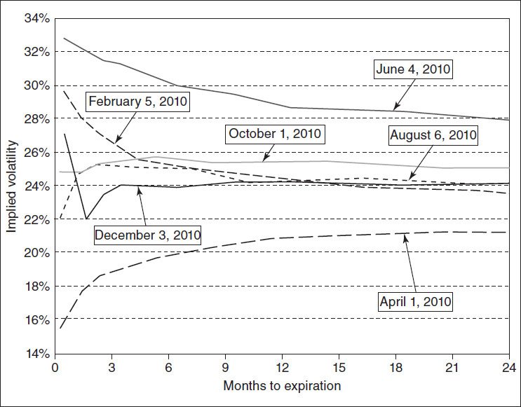

<!-- source:block 50f954d45d031419 -->

*Figure 20-15 EuroStoxx 50 Index 30-day historical volatility during 2010. / Figure 20-15 EuroStoxx 50 Index 30-day historical volatility during 2010.*

<!-- source:block faa8af939e373e93 -->

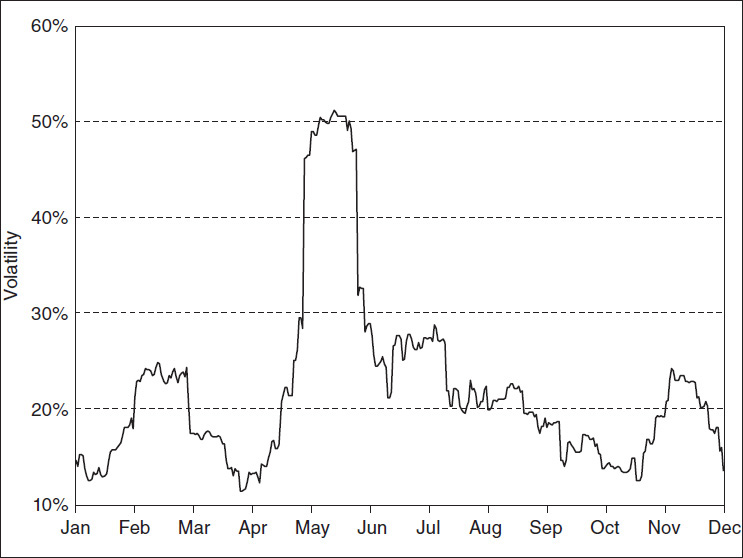

<!-- source:block 4c37fe04e2cd7c15 -->

> [!quote]- English 127
> Note one other important point: the disconnect between the front-month implied volatility and the remainder of the term-structure graph in December. The graph is generally upward sloping, but the front-month implied volatility is still much higher than all other months. This is a common characteristic in many option markets. The front-month implied volatility can often trade in a way that is inconsistent with the term structure of other months.

请注意另一个重要的点：前月隐含波动率与12月期限结构图表其余部分之间的脱节。该图表总体上向上倾斜，但前月隐含波动率仍然远高于所有其他月份。这是许多期权市场的共同特征。前月隐含波动率通常与其他月份的期限结构不一致。

<!-- source:block ab175795f551fa2f -->

> [!quote]- English 128
> The term structure in Figure 20-12 is typical of markets where the only factors that tend to affect implied volatility are the recent volatility of the underlying contract and the mean volatility. However, in some markets, there may also be a seasonal volatility factor.

图20-12中的期限结构是典型的市场，其中影响隐含波动率的唯一因素是标的合约的近期波动率和平均波动率。不过，在某些市场中，也可能存在季节性波动因素。

<!-- source:block 896d5795705518ba -->

> [!quote]- English 129
> Given the possibility of extremely hot temperatures, as well as droughts, summer expiration months in agricultural markets typically trade at higher implied volatilities than other months, regardless of the time of year. In energy markets where fuel is needed for heating in the winter and cooling in the summer, the possibility of very cold winters and very hot summers may result in some months trading at persistently higher implied volatilities than other months. In such markets, it can be difficult to create a reliable term-structure model.

鉴于可能出现极热的气温和干旱，无论一年中的什么时候，农产品市场夏季到期月份的隐含波动率通常高于其他月份。在冬季取暖、夏季降温需要燃料的能源市场中，冬季非常寒冷和夏季非常炎热的可能性可能会导致某些月份的隐含波动率持续高于其他月份。在此类市场中，创建可靠的条款结构模型可能很困难。

<!-- source:block e5bf01a152ec5fcf -->

> [!quote]- English 130
> Figure 20-16 shows the changing term structure of implied volatility for options on natural gas futures during 2009. Although not as obvious as the Eurostox 50 Index in Figure 20-14, we can still detect the tendency of long-term implied volatility to revert to a mean, perhaps around 40 percent. But in addition, there is also a seasonal volatility factor. Note the implied volatility of the October option contract, which has been highlighted with a circle. Regardless of the term structure, October options always seem to trade at an inflated implied volatility. This is perhaps easier to see in Figure 20-17, which shows the average implied volatility of each expiration month during 2009. October clearly carries a higher implied volatility than any other month. The reason for this has to do primarily with the Atlantic hurricane season, which extends from approximately early June to late November, with the height of the season falling in August and September. During this period, any major hurricane can disrupt natural gas operations, which in the United States are concentrated along the northern coast of the Gulf of Mexico. October options, which expire toward the end of September, will capture any volatility occurring during the height of the hurricane season. Consequently, October options tend to trade at consistently higher implied volatilities than other months.

图20-16显示了2009年天然气期货期权隐含波动率的期限结构的变化。尽管不像图20-14中的Eurostox 50指数那么明显，但我们仍然可以检测到长期隐含波动率恢复到平均值的趋势，也许在40%左右。但除此之外，还有季节性波动因素。请注意十月期权合约的隐含波动率，已用圆圈突出显示。无论期限结构如何，十月期权似乎总是以夸大的隐含波动率进行交易。这一点在图20-17中可能更容易看出，该图显示了2009年每个到期月份的平均隐含波动率。10月份的隐含波动率显然高于任何其他月份。造成这种情况的原因主要与大西洋飓风季节有关，该季节大约从六月初持续到十一月底，季节的高峰在八月和九月。在此期间，任何大型飓风都可能扰乱天然气业务，而美国的天然气业务主要集中在墨西哥湾北部海岸。10月期权将于9月底到期，将捕捉飓风季节高峰期间发生的任何波动。因此，10月期权的隐含波动率往往高于其他月份。

<!-- source:block 112aacd5f67d221b -->

*图20-16 2009年天然气期货期权的隐含波动率期限结构。 / Figure 20-16 Implied-volatility term structure for options on natural gas futures during 2009.*

<!-- source:block de25f426360c1c20 -->

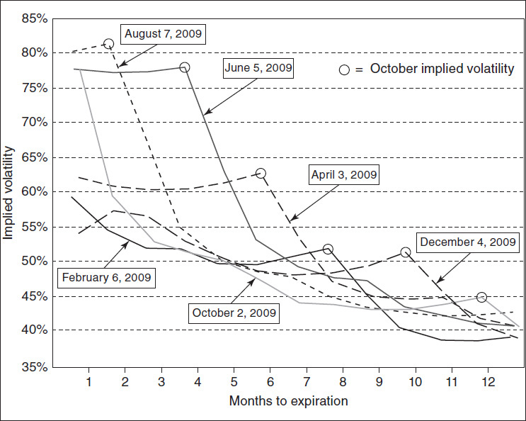

<!-- source:block c72abfa2a99d3d0b -->

*图20-17 2009年天然气期货期权到期月份的平均隐含波动率。 / Figure 20-17 Average implied volatility by expiration month of options on natural gas futures during 2009.*

<!-- source:block ebac92b8f6119561 -->

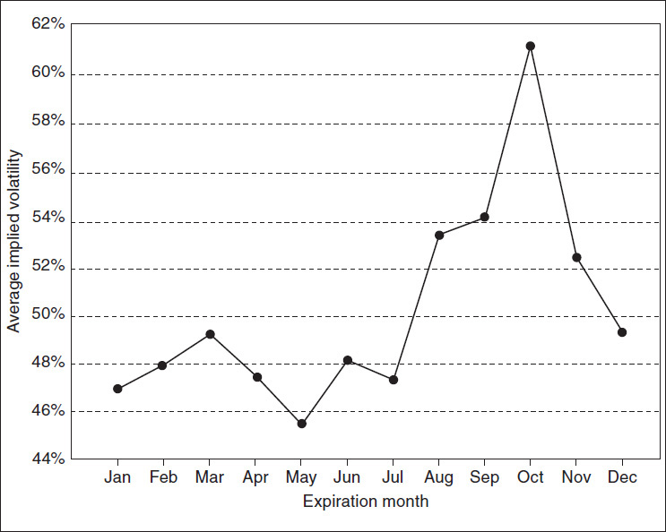

<!-- source:block 0fd02112188a305e -->

## 远期波动率 / Forward Volatility

<!-- source:block 5a3831f15c6ce4c0 -->

> [!quote]- English 133
> Let’s return to the term-structure graphs of implied volatilities across expiration months shown in Figure 20-14. Can we identify any trading opportunities from these graphs? We might simply decide that implied volatility is either too high, in which case we will prefer to sell options, or too low, in which case we will prefer to buy options. In either case, we can, in theory, capture a perceived mispricing by dynamically hedging the position with the underlying contract. But we might also ask a different question: are any expiration months mispriced with respect to other expiration months? Should we consider some type of calendar spread, selling options in one month and buying options in a different month?

让我们回到图20-14所示的跨到期月份隐含波动率的期限结构图。我们可以从这些图表中识别任何交易机会吗？我们可能简单地决定隐含波动率要么太高，在这种情况下我们宁愿出售期权，要么太低，在这种情况下我们宁愿购买期权。无论哪种情况，理论上，我们都可以通过与标的合约动态对冲头寸来捕捉感知到的定价错误。但我们也可能会问一个不同的问题：任何到期月份是否相对于其他到期月份定价错误？我们是否应该考虑某种类型的日历价差，在一个月内出售期权并在不同的月份购买期权？

<!-- source:block e753979a557c7977 -->

> [!quote]- English 134
> Let’s focus on one graph from Figure 20-14, the term structure of Eurostoxx 50 Index options on February 5, 2010. This is shown in Figure 20-18. The large dots represent the at-the-money implied volatilities, with the solid black line representing the best fit generated by a term-structure model. We can see that some contract months seem to deviate from the best-fit line. June 2010 implied volatility falls below the line, whiles September and December 2010 fall above the line. Assuming that each month is in fact trading at the indicated implied volatility,9 do these deviations represent a trading opportunity? Should we be buying June options and selling September or December options?

让我们关注图20-14中的一个图表，即2010年2月5日Eurostoxx 50指数期权的期限结构。如图20-18所示。大圆点代表平值隐含的波动率，实心黑线代表术语结构模型生成的最佳匹配。我们可以看到，有些合约月份似乎偏离了最适合的线。2010年6月隐含波动率低于该线，而2010年9月和12月则高于该线。假设每个月实际上都是以所示的隐含波动率进行交易，[^ovp20-9]这些偏离是否代表交易机会？我们应该买入6月期权，卖出9月或12月期权吗？

<!-- source:block 5945ab1a2fb6b463 -->

> [!quote]- English 135
> One method that traders use to determine the mispricing of a calendar spread is to consider the spread’s implied volatility. That is, what single volatility applied to both expiration months will cause the value of the spread to be equal to its price in the marketplace? To better understand this, let’s use the volatilities in Figure 20-18 to calculate the prices of several calendar spreads. For simplicity, we will assume that the underlying contract is trading at 100 and that there are no interest-rate considerations. The relevant data is shown in Figure 20-19.

交易员用于确定日历价差定价错误的一种方法是考虑价差的隐含波动率。也就是说，应用于两个到期月份的哪一个单一波动率将导致价差价值等于其在市场上的价格？为了更好地理解这一点，让我们使用图20-18中的波动率来计算几个日历价差的价格。为了简单起见，我们假设标的合约的交易价格为100，并且没有利率考虑。相关数据如图20-19所示。

<!-- source:block d151a0aee56771a2 -->

*Figure 20-18 Implied volatility for at-the-money eurostoxx 50 Index options on February 5, 2010. / Figure 20-18 Implied volatility for at-the-money eurostoxx 50 Index options on February 5, 2010.*

<!-- source:block f0cc109604661076 -->

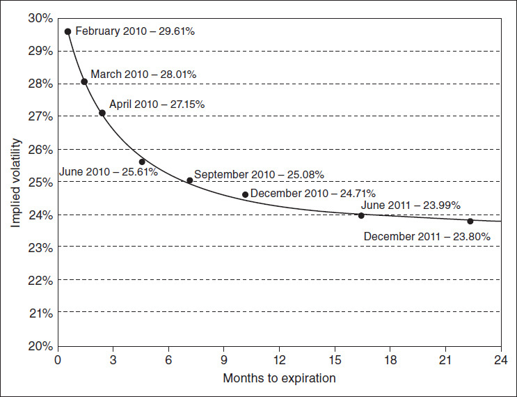

<!-- source:block e822f8e7b2a5b8cf -->

*图20-19 2010年2月5日使用隐含波动率的日历价差值。 / Figure 20-19 Calendar spread values using implied volatilities on February 5, 2010.*

<!-- source:block 5f80ec0260cf8a5f -->

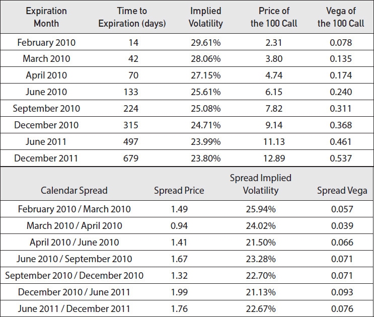

<!-- source:block 56eb7474f6f0d9bd -->

> [!quote]- English 138
> Looking at the February/March calendar spread, the implied volatilities for the two months are 29.61 percent for February and 28.06 percent for March. The values of the at-the-money calls are 2.31 and 3.80, with a spread value of 1.49. If we evaluate these options using the same volatility, what single volatility will yield a value equal to the price of 1.49? Logically, this volatility has to be less than 28.06 percent because at this volatility the March option is fairly priced, but the February option is too expensive. The entire spread will be worth more than 1.49. We need to reduce the volatility until we find the single volatility that will cause the spread to be worth 1.49. Using a computer, we find that the February/March calendar spread has an implied volatility of 25.94 percent.

从2月/3月日历价差来看，这两个月的隐含波动率2月份为29.61%，3月份为28.06%。平值看涨期权的价值为2.31和3.80，价差值为1.49。如果我们使用相同的波动率来评估这些期权，那么哪个单一波动率会产生等于1.49的价值？从逻辑上讲，这个波动率必须低于28.06%，因为在这个波动率下，三月期权的定价是公平的，但二月期权太贵了。整个价差的价值将超过1.49。我们需要降低波动率，直到找到导致价差为1.49的单一波动率。使用计算机，我们发现2月/3月日历价差的隐含波动率为25.94%。

<!-- source:block 3a37ee062653900c -->

> [!quote]- English 139
> We can go through this process for each successive calendar spread, calculating the implied volatility of each spread. These volatilities are shown at the bottom of Figure 20-19. How will these calendar spread implied volatilities look if we overlay them on Figure 20-18? This is shown in Figure 20-20. We can see clearly that the June 2010 options are significantly underpriced in the marketplace compared with nearby expirations, while the September 2010 options are significantly overpriced. If given a choice of strategies, it might make sense to buy the April/June 2010 calendar spread and sell the June/September 2010 calendar spread. Together these spreads make up a time butterfly.

我们可以对每个连续的日历价差进行这个过程，计算每个价差的隐含波动率。这些波动率如图20-19的底部所示。如果我们将这些日历价差隐含波动率叠加在图20-18上，将会如何？如图20-20所示。我们可以清楚地看到，与附近的报价相比，2010年6月的期权在市场上的定价明显过低，而2010年9月的期权则明显过高。如果可以选择策略，购买2010年4月/6月日历价差并出售2010年6月/9月日历价差可能是有意义的。这些价差一起构成了一个时间蝶式价差。

<!-- source:block 8d3511c2d794666e -->

*图20-20 eurostoxx 50指数日历价差暗示2010年2月5日的波动率。 / Figure 20-20 eurostoxx 50 Index calendar spread implied volatilities on February 5, 2010.*

<!-- source:block fc7d3af3fa129b24 -->

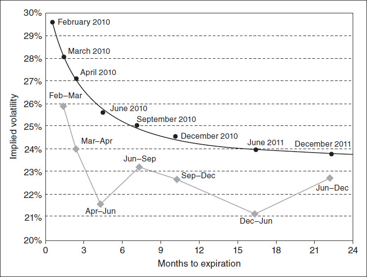

<!-- source:block f2f6da58d87d3681 -->

> [!quote]- English 141
> We use these implied volatilities not to determine whether implied volatility in the entire option complex is either too high or too low but rather to determine whether particular months are mispriced with respect to other months. The implied-volatility graph acts as a magnifying glass, enabling us to more easily determine which months are overpriced and which are underpriced.

我们使用这些隐含波动率不是为了确定整个期权综合体的隐含波动率是否过高或过低，而是为了确定特定月份相对于其他月份是否定价错误。隐含波动率图表就像放大镜一样，使我们能够更轻松地确定哪些月份的价格过高，哪些月份的价格过低。

<!-- source:block afe88ae850db4cd5 -->

> [!quote]- English 142
> When the term-structure graph is downward sloping, as it is in Figure 20-20, all calendar spread implied volatilities will fall below the term-structure graph. Alternatively, if the term-structure graph is upward sloping, all calendar spread implied volatilities will fall above the graph. If all implied volatilities fall exactly along the best-fit graph, regardless of whether the graph is upward or downward sloping, the implied-volatility curve will be smooth, suggesting that there are no obviously mispriced calendar spreads.

当期限结构图表向下倾斜时，如图20-20所示，所有日历价差隐含的波动率将低于期限结构图表。或者，如果期限结构图表向上倾斜，则所有日历价差隐含的波动率将落在图表上方。如果所有隐含波动率完全沿着最佳匹配的图表下降，无论图表是向上还是向下倾斜，隐含波动率曲线都将是光滑的，这表明不存在明显定价错误的日历价差。

<!-- source:block a02ec699c74de9f9 -->

> [!quote]- English 143
> Determining the exact implied volatility of a calendar spread usually requires a computer programmed with a pricing model. However, it is often possible to estimate the implied volatility of an at-the-money calendar spread if we recall that the vega of an at-the-money option is relatively constant with respect to changes in volatility. Suppose that we know both the prices *O*1 and *O*2 and the vega values *V*1 and *V*2 of the two options that make up the calendar spread. The price of the spread is *O*2 – *O*1, and the vega of the spread is *V*2 – *V*1. The implied volatility of the spread, given as a whole number, is approximately equal to the price of the spread divided by its vega

确定日历价差的确切隐含波动率通常需要一台编程有定价模型的计算机。然而，如果我们记得平值期权的Vega对于波动率变化相对恒定，通常可以估计平值日历价差的隐含波动率。假设我们知道构成日历价差的两个期权的价格O 1和O2以及Vega值V1和V2。价差的价格为O2 -O 1，价差的Vega为V2 - V1。价差的隐含波动率（作为一个数字）大约等于价差价格除以其Vega

<!-- source:block 538f2503eaaca21b -->

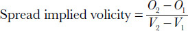

<!-- 原 EPUB 中此公式为图片，已原样保留 -->

<!-- source:block 4890fa380f8a3ceb -->

> [!quote]- English 144
> This method is not exact because there is likely to be rounding error, and the vega does change slightly as we change volatility. However, this approach may be useful if a trader needs to make a quick estimate of whether a calendar spread is overpriced or underpriced.

这种方法并不精确，因为可能存在四舍五入误差，而且随着我们改变波动率，Vega确实会略有变化。然而，如果交易员需要快速估计日历价差是否定价过高或过低，这种方法可能很有用。

<!-- source:block 2adc029019ebfafd -->

> [!quote]- English 145
> The vega values for the individual options, as well as for the various calendar spreads, are given in Figure 20-20. The reader may find it worthwhile to estimate the implied volatility of each spread using this method and then compare the result with the true implied volatility of the spread.

各个期权以及各种日历价差的Vega值如图20-20所示。读者可能会发现值得使用这种方法来估计每个价差的隐含波动率，然后将结果与价差的真实隐含波动率进行比较。

<!-- source:block dbaf22a9f8d975af -->

> [!quote]- English 146
> Instead of analyzing the volatility term structure by looking at the implied volatility of successive calendar spreads, we might take a slightly more theoretical approach. Suppose that we have two option expirations, a short-term option expiring at *t*1 and a long-term option expiring at *t*2. If the implied volatility of the short-term expiration is σ1 and the implied volatility of the long-term expiration is σ2, we might ask this question: what *forward volatility* σ*f* is the marketplace implying between expiration of the short-term option and expiration of the long-term option?

我们可能会采取稍微理论化的方法，而不是通过观察连续日历价差的隐含波动率来分析波动率期限结构。假设我们有两个期权到期，短期期权在t1到期，长期期权在t2到期。如果短期到期的隐含波动率是σ1，长期到期的隐含波动率是σ2，我们可能会问这个问题：短期期权到期和长期期权到期之间市场暗示的远期波动率是多少？

<!-- source:block 50bf76875f752c35 -->

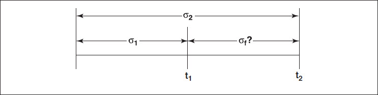

<!-- source:block 8273ccc4c3c9e8f8 -->

> [!quote]- English 147
> This is analogous to a *forward rate* in an interest-rate market. Given a short-term interest rate and a long-term interest rate, what rate must apply between the two maturities such that no arbitrage opportunity exists? Unlike interest rates, which are directly proportional to time, volatility is proportional to the square root of time. Using this, we can calculate the forward volatility10

这类似于利率市场中的远期利率。给定一个短期利率和一个长期利率，在两个期限之间必须采用什么利率才能使套利机会不存在？与利率直接与时间成正比不同，波动率与时间的平方根成正比。使用这个，我们可以计算远期波动率[^ovp20-10]

<!-- source:block f2aeeff84af0bb3a -->

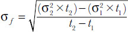

<!-- 原 EPUB 中此公式为图片，已原样保留 -->

<!-- source:block 2133a3fd7e75d510 -->

> [!quote]- English 148
> We can expand this relationship to any number of volatilities over any number of consecutive time periods. Given forward volatilities σ*i* covering the time from *t**i*–1 to *t**i*, the volatility over the entire time period from *t*0 to *t**n* must be

我们可以将这种关系扩展到任意数量的连续时间段内的任意数量的波动率。给定涵盖ti-1至ti时间的远期波动率δ i，从t0至dn整个时间段的波动率必须为

<!-- source:block 5eddfe53d8511485 -->

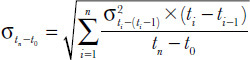

<!-- 原 EPUB 中此公式为图片，已原样保留 -->

<!-- source:block fc0bb440bcbb8b13 -->

> [!quote]- English 149
> Suppose that we calculate the forward volatilities for the volatility term structure in Figure 20-20. How would this compare with the implied volatilities of the calendar spreads? This is shown in Figure 20-21. The forward volatility graph has the same general structure as the calendar spread graph. Both graphs serve the same purpose—to highlight any mispricing of a particular expiration month.

假设我们计算图20-20中波动率期限结构的远期波动率。这与日历价差的隐含波动率相比如何？如图20-21所示。远期波动率图表具有与日历价差图表相同的总体结构。两个图表的目的相同——突出显示特定到期月份的任何错误定价。

<!-- source:block e0eb9c6d56ba9882 -->

*图20-21 / Figure 20-21*

<!-- source:block 3fe20b8e52cff28a -->

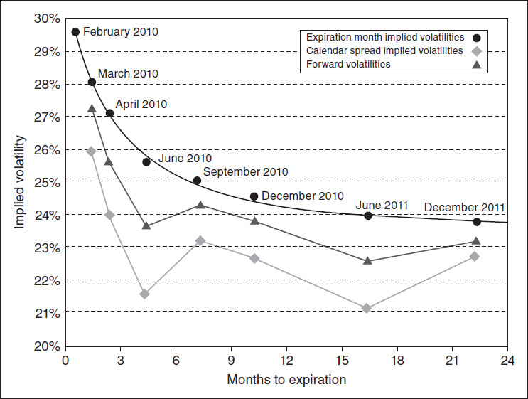

<!-- source:block fa02b0fdde3a74dd -->

> [!quote]- English 151
> Every experienced option trader knows that dealing with volatility can be a difficult task. To facilitate the decision-making process, we have attempted to make some generalizations about volatility characteristics. Even then, it may not be clear what the right strategy is. Moreover, looking at a limited number of examples makes the generalizations even less reliable. Every market has its own characteristics, and understanding the volatility characteristics of a particular market, whether interest rates, foreign currencies, stocks, or commodities, is at least as important as knowing the technical characteristics of volatility. And this knowledge can only come from careful study of a market combined with actual trading experience.

每一位经验丰富的期权交易员都知道，处理波动率可能是一项艰巨的任务。为了促进决策过程，我们试图对波动率特征进行一些概括。即便如此，我们可能也不清楚正确的策略是什么。此外，查看有限数量的例子使得概括变得更加不可靠。每个市场都有自己的特征，了解特定市场的波动率特征，无论是利率、外币、股票还是大宗商品，至少与了解波动率的技术特征一样重要。而这些知识只能来自对市场的仔细研究并结合实际交易经验。

<!-- source:block 3b1d397f67eb0157 -->

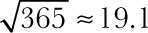

<!-- source:block a816e8d4c7eaa076 -->

> [!note] Footnote 152
> 2 Michael Parkinson, “The Extreme Value Method of Estimating the Variance of the Rate of Return,” *Journal of Business* 53(1):61–64, 1980.

[^ovp20-2]: 迈克尔·帕金森（Michael Parkinson），“估计回报率方差的极小值方法”，《商业杂志》53（1）：61-64，1980年。

<!-- source:block 9a20b2ef860523ab -->

> [!note] Footnote 153
> 3 Mark B. Garman and Michael J. Klass, “On the Estimation of Security Price Volatilities from Historical Data,” *Journal of Business* 53(1):67–78, 1980.

[^ovp20-3]: 马克·B。Garman和Michael J. Klass，“从历史数据中估计证券价格波动率”，Journal of Business 53（1）：67-78，1980。

<!-- source:block 1feb2123f94827b5 -->

> [!note] Footnote 154
> 4 Historical gold volatility in Figure 20-2 and Bund volatility in Figure 20-5 were calculated from settlement prices of the front-month futures contract.

[^ovp20-4]: 图20-2中的历史黄金波动率和图20-5中的德国央行波动率是根据前月期货合约的结算价计算得出的。

<!-- source:block 614f8ec3fbde303f -->

> [!note] Footnote 155
> 5 For additional discussion of *volatility cones*, see Galen Burghardt and Morton Lane, “How to Tell If Options Are Cheap,” *Journal of Portfolio Management*, Winter:72–78, 1990.

[^ovp20-5]: 有关波动率锥的更多讨论，请参阅Galen Burghardt和Morton Lane，“How to Tell If期权Are Cheap”，Journal of Portfolio Management，Winter：72-78，1990年。

<!-- source:block 749e7441316d7af6 -->

> [!note] Footnote 156
> 6 Robert F. Engle, “Autoregressive Conditional Heteroskedsticity with Estimates of the Variance of United Kingdom Inflation,” *Econometrica* 50(4):987–1000, 1982. Engle was awarded the 2003 Nobel Prize in Economics.

[^ovp20-6]: 罗伯特·F. Engle，“Autoregressive Conditional Heteroskedsticity with Estimates of the Variance of United Kingdom Inflation，”Econometrica 50（4）：987-1000，1982.恩格尔被授予2003年诺贝尔经济学奖。

<!-- source:block 0c4bb96eab7efddf -->

> [!note] Footnote 157
> 7 This is known in finance as the *efficient-market hypothesis*.

[^ovp20-7]: 这在金融学中被称为有效市场假说。

<!-- source:block 8ba1587137b6278f -->

> [!note] Footnote 158
> 8 The three-month implied volatility was calculated by interpolating between the implied volatility of options bracketing three months.

[^ovp20-8]: 三个月隐含波动率是通过在三个月期权的隐含波动率之间进行插值计算的。

<!-- source:block cccee942da05d940 -->

> [!note] Footnote 159
> 9 We make this proviso because option settlement prices do not necessarily reflect actual trading activity. When this happens, anyone using settlement prices as a guide to potential trading strategies may be disappointed to find that the settlement price is not an accurate reflection of where an option can actually be traded.

[^ovp20-9]: 我们提出此但书是因为期权结算价格不一定反映实际交易活动。当这种情况发生时，任何使用结算价格作为潜在交易策略指南的人可能会失望地发现结算价格并不能准确反映期权的实际交易地点。

<!-- source:block 7e0d194c698c99c3 -->

> [!note] Footnote 160
> 10 Some readers may recognize that the forward volatility calculation results from the fact that the square of volatility or variance σ2 is directly proportional to time

[^ovp20-10]: 一些读者可能已经注意到，远期波动率的计算源于波动率的平方（即方差）$\sigma^2$ 与时间成正比这一事实。

<!-- source:block be50d7737c76359d -->

> [!quote]- English 161
> σ*f*2 × (*t*2 – *t*1) = (σ22 × *t*2) – (σ12 × *t*1)

$$
\sigma_{f}^{2} \times (t_{2} -\,t_{1}) = (\sigma_{2}^{2} \times\,t_{2}) - (\sigma_{1}^{2} \times\,t_{1})
$$

---

[[阅读导航|← 返回阅读导航]]

<!-- chapter-nav:start -->
> [!tip] 章节导航（章末）
> [[二叉树期权定价 Binomial Option Pricing|← 上一章]] · [[阅读导航|全书导航]] · [[头寸分析 Position Analysis|下一章 →]]
<!-- chapter-nav:end -->
